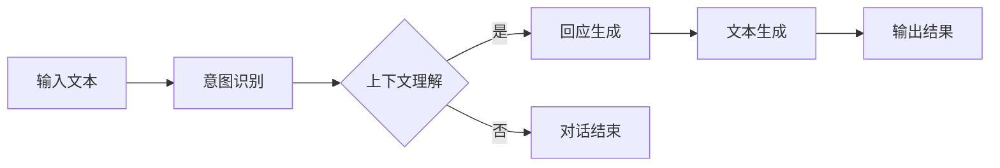
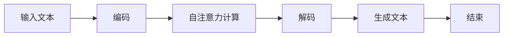
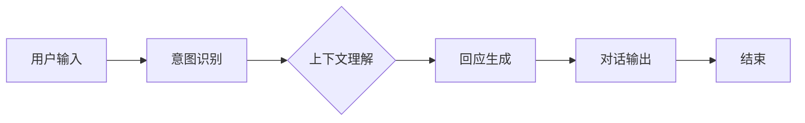
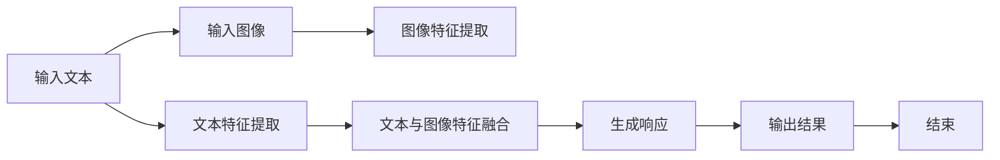
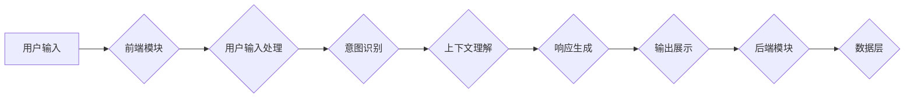
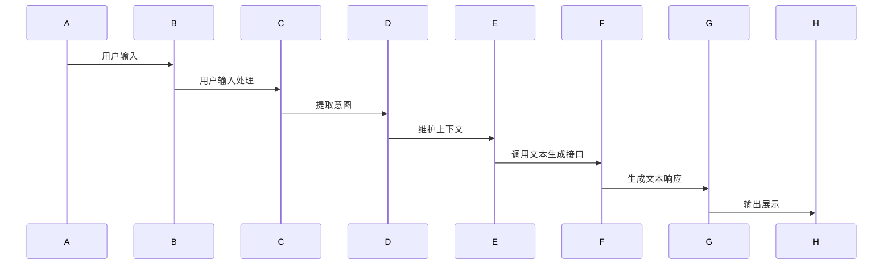

                 


### 引言：ChatGPT与人类思维的协同必要性

随着人工智能技术的迅猛发展，自然语言处理（NLP）已经成为了一个备受关注的领域。近年来，ChatGPT作为GPT（Generative Pre-trained Transformer）系列模型的一个成功代表，凭借其强大的文本生成能力和智能对话功能，迅速在学术界和工业界引起了广泛关注。ChatGPT不仅仅是一个聊天机器人，它更是一个人工智能系统，通过深度学习算法对海量文本数据进行分析和学习，从而能够生成连贯、准确且具有创造性的文本输出。然而，尽管ChatGPT在许多方面展现了其卓越的能力，但它在某些方面仍然无法完全替代人类的思维。

人类思维具有高度复杂性和灵活性，不仅包括逻辑推理、抽象思维、创造性思维等高级认知能力，还涉及到情感、价值观等多维度的认知过程。相比之下，现有的AI模型，包括ChatGPT，在处理复杂问题时，往往受到算法和数据集的限制，难以达到人类思维的深度和广度。因此，将ChatGPT与人类思维进行协同，以实现两者之间的互补与互动，显得尤为重要。

首先，ChatGPT可以承担大量的信息处理任务，如数据整理、信息检索等，从而释放人类的时间，让人类专注于更加创造性和决策性的工作。其次，ChatGPT可以作为一种辅助工具，帮助人类进行逻辑推理和问题解决，从而提升整体工作效率。此外，通过与人类的交互，ChatGPT可以不断学习和进化，提高其智能水平，实现与人类思维的协同进化。

本文将围绕ChatGPT与人类思维的协同进化展开讨论。首先，我们将对ChatGPT进行概述，包括其定义、工作原理、特点和应用领域。接着，我们将深入探讨人类思维的核心概念与联系，以及它们与ChatGPT的相似性分析。随后，我们将详细介绍ChatGPT的算法原理和流程图，并使用Python代码实现进行讲解。然后，我们将分析ChatGPT在系统架构中的应用，并介绍一个实际项目实战。最后，我们将总结最佳实践、注意事项，并推荐拓展阅读，以帮助读者深入理解ChatGPT与人类思维的协同进化。

### ChatGPT概述

ChatGPT是OpenAI于2022年推出的一款基于GPT（Generative Pre-trained Transformer）的预训练语言模型，它是GPT系列模型的一个杰出代表。GPT系列模型由自然语言处理领域的领军人物Jeffrey Dean和Greg Corrado等人提出，经过多年的迭代和优化，已经成为自然语言处理领域的重要工具。ChatGPT在GPT的基础上进行了特定的设计和优化，以更好地适应对话场景。

#### ChatGPT的定义与历史

ChatGPT是一种基于Transformer架构的深度学习模型，它通过在大量文本数据上进行预训练，学会了生成连贯、准确且具有创造性的文本。ChatGPT的历史可以追溯到2018年，当时OpenAI发布了GPT模型。随后，GPT-2、GPT-3等后续版本不断推出，模型规模和性能也在不断提升。ChatGPT正是基于这些先进的预训练模型，结合对话场景的需求，进行设计和优化的。

#### ChatGPT的工作原理

ChatGPT的工作原理主要包括预训练和微调两个阶段。在预训练阶段，ChatGPT通过在大量文本数据进行自监督学习，学习到语言的基础知识。具体来说，模型通过对文本进行编码，预测下一个单词或者句子，从而不断优化其参数。在预训练完成后，ChatGPT会进行微调，以适应特定的对话任务。微调过程通常涉及到对模型参数的进一步调整，以使其更好地适应对话场景。

#### ChatGPT的特点与应用领域

ChatGPT具有以下几个显著特点：

1. **强大的文本生成能力**：ChatGPT能够生成连贯、准确的文本，包括自然语言对话、文章撰写、机器翻译等。
2. **灵活的对话管理**：ChatGPT能够处理自然语言对话，理解上下文，并生成相应的回应。
3. **多模态处理**：ChatGPT不仅可以处理文本，还可以结合语音、图像等多模态信息，实现更丰富的交互体验。

ChatGPT的应用领域非常广泛，主要包括：

1. **客户服务**：ChatGPT可以作为智能客服，提供24/7的在线服务，解答用户问题和提供支持。
2. **内容创作**：ChatGPT可以帮助撰写文章、报告、故事等，提高内容创作的效率和质量。
3. **教育辅助**：ChatGPT可以作为教育辅助工具，提供个性化学习建议、辅导和解答问题。
4. **科学研究**：ChatGPT可以用于自然语言处理的研究，如文本分类、情感分析、信息抽取等。

总之，ChatGPT作为一种先进的预训练语言模型，在文本生成、对话管理和多模态处理等方面展现了强大的能力，其应用前景十分广阔。

### ChatGPT的架构设计与关键技术

ChatGPT的架构设计精妙，它集成了多种先进的技术，使得模型在处理文本生成和对话管理任务时表现出色。本节将详细探讨ChatGPT的架构设计及其关键技术，包括语言模型、对话管理和多模态交互。

#### 语言模型

ChatGPT的核心是Transformer架构，这是一种基于自注意力机制的深度学习模型。Transformer由Google在2017年提出，目的是解决传统的循环神经网络（RNN）在处理长文本时的困难，如长距离依赖问题。Transformer通过全局注意力机制，能够在处理长文本时保持有效的信息传递。

在ChatGPT中，语言模型是核心组件，它通过对海量文本数据进行预训练，学习到语言的基本规律和表达方式。具体来说，语言模型通过处理文本序列，预测下一个单词或字符。这个过程可以表示为：

$$
P(w_t | w_{t-1}, w_{t-2}, \ldots, w_1) = \frac{e^{v_t \cdot W}{Z}}
$$

其中，$w_t$ 表示当前单词或字符，$v_t$ 是单词的向量表示，$W$ 是权重矩阵，$Z$ 是归一化常数。通过这样的机制，语言模型能够生成连贯、合理的文本输出。

#### 对话管理

对话管理是ChatGPT能够进行有效对话的关键技术。对话管理涉及理解用户的输入、生成适当的回应以及保持对话的连贯性。具体来说，ChatGPT通过以下步骤实现对话管理：

1. **意图识别**：模型首先识别用户的输入意图，即用户想要完成什么样的任务。这通常通过分类任务实现，模型会学习到各种意图的文本特征。
2. **上下文理解**：模型会根据历史对话记录和当前输入，理解对话的上下文信息，从而生成更加合适的回应。
3. **回应生成**：模型根据意图和上下文信息，生成相应的回应文本。这一过程通常是通过生成式模型实现的，如序列到序列（Seq2Seq）模型。

为了保持对话的连贯性，ChatGPT会维持对话状态，记录当前对话的上下文和历史信息，以便在后续对话中参考。

#### 多模态交互

多模态交互是ChatGPT的一个显著特点，它能够结合文本、语音、图像等多种模态信息，提供更加丰富的交互体验。多模态交互的实现主要包括以下几个步骤：

1. **模态融合**：ChatGPT通过将不同模态的信息进行融合，形成统一的多模态输入。例如，可以将文本和图像的信息通过特征提取和融合技术，生成一个综合的特征向量。
2. **联合建模**：模型会同时学习文本和图像的表示，并在生成文本时参考图像信息。这通常通过多模态Transformer模型实现，模型能够在不同的模态之间传递信息和进行协同学习。
3. **动态响应**：在交互过程中，ChatGPT会根据用户的输入动态调整其响应策略，例如在文本生成时，如果用户提供了图像信息，模型会优先考虑图像的内容和上下文。

通过这些关键技术的结合，ChatGPT能够实现高效、自然的对话生成，并在多种应用场景中表现出色。

#### 算法流程图

为了更清晰地理解ChatGPT的算法流程，我们可以使用Mermaid语言绘制其算法流程图。以下是一个简化的算法流程图：



这个流程图展示了ChatGPT从接收输入文本到生成输出结果的整个过程，包括意图识别、上下文理解和文本生成等关键步骤。

### 人类思维的核心概念与联系

人类思维是一个复杂而精细的过程，涉及到多种认知活动。为了更好地理解人类思维的核心概念与联系，我们首先需要明确这些核心概念，并通过对比分析揭示其特点。以下是人类思维中几个重要的核心概念：

#### 1. 逻辑推理

逻辑推理是人类思维的基础，它通过一系列规则和条件，从已知的事实推导出新的结论。逻辑推理包括归纳推理和演绎推理。归纳推理是从具体实例中提取普遍规律，而演绎推理则是从一般原则推导出具体结论。逻辑推理的特点是严谨和系统性，它能够帮助我们分析和解决问题。

#### 2. 记忆与遗忘

记忆与遗忘是人类思维的重要组成部分，它们决定了我们如何存储、检索和使用信息。记忆可以分为短期记忆和长期记忆。短期记忆主要负责临时存储信息，而长期记忆则负责长期储存和回忆信息。遗忘是记忆的逆向过程，它可以是暂时性的或永久性的。记忆与遗忘的特点是动态性和选择性，它们受到多种因素的影响，如注意力、情绪和重复等。

#### 3. 情感认知

情感认知是人类思维中不可或缺的一环，它涉及到我们对情感的感知、表达和理解。情感认知不仅影响我们的行为和决策，还影响我们与他人之间的互动。情感认知的特点是多样性和复杂性，不同类型的情感（如快乐、悲伤、愤怒等）会影响我们的思维过程和情绪状态。

#### 概念属性特征对比表格

为了更直观地展示这些核心概念的特点，我们可以通过一个特征对比表格进行描述：

| 核心概念 | 特征 | 说明 |
| --- | --- | --- |
| 逻辑推理 | 严谨性 | 基于规则和条件的推理过程 |
| 记忆与遗忘 | 动态性 | 信息存储和检索的动态变化 |
| 情感认知 | 多样性 | 多种情感的感知和表达 |

#### ER实体关系图架构

在人类思维中，概念与概念之间通过多种方式进行联系，形成复杂的认知网络。为了更好地表示这些联系，我们可以使用实体关系图（ER图）进行架构设计。以下是人类思维中几个核心概念之间的ER图：

```mermaid
erDiagram
  类1 ||--|{ 类2 }
  类1 ||--|{ 类3 }
  类2 ||--|{ 类4 }
  类3 ||--|{ 类5 }
```

这个ER图展示了逻辑推理、记忆与遗忘、情感认知等核心概念之间的联系。例如，逻辑推理与记忆和情感认知之间存在交互关系，而记忆与遗忘和情感认知之间也有相互影响。

通过对比分析核心概念及其联系，我们可以更深入地理解人类思维的复杂性和多样性。这些概念和联系不仅构成了人类认知的基础，也为人工智能模型的设计和优化提供了重要的参考。

### ChatGPT与人类思维的相似性分析

在深入探讨ChatGPT与人类思维的相似性之前，我们需要明确两者在认知过程中的表现。首先，ChatGPT和人类思维在认知过程中都涉及到信息处理、推理和学习等方面。尽管两者在形式和实现方式上有所不同，但在一些核心方面却展现出显著的相似性。

#### 认知过程对比

1. **信息处理**：人类思维通过感官接收外界信息，经过大脑的处理和分析，生成相应的认知反应。ChatGPT同样需要处理输入文本，通过预训练模型和对话管理算法，对信息进行理解和生成响应。

2. **推理**：人类思维中的推理包括归纳推理和演绎推理。ChatGPT也通过预训练模型，学会从大量数据中提取模式和规律，进行逻辑推理和生成文本。例如，当用户提出一个问题时，ChatGPT会根据已有的知识和上下文信息进行推理，生成合适的回答。

3. **学习**：人类思维具有不断学习和适应新环境的能力。ChatGPT通过不断接触新数据，进行微调训练，不断提高其智能水平。人类思维中的学习和ChatGPT的学习机制虽然不同，但都体现了对知识的积累和应用。

#### 学习与适应能力对比

1. **学习**：人类思维的学习是多维度和复杂的，包括观察学习、经验学习和模仿学习等。ChatGPT的学习主要依赖于深度学习和大数据，通过自我监督学习和迁移学习，不断提升其模型性能。虽然两者学习方式不同，但都体现了对知识的积累和应用。

2. **适应能力**：人类思维能够根据不同环境和情境，灵活调整自己的行为和认知方式。ChatGPT在适应新任务时，通常需要重新训练或进行特定任务的学习。尽管ChatGPT的适应能力在不断提升，但与人类思维的适应能力相比，仍有一定的差距。

#### 创造性与逻辑性对比

1. **创造性**：人类思维的创造性表现在艺术创作、科学发现和问题解决等多个方面。ChatGPT在生成文本和回答问题时，虽然能够创造性地表达想法，但与人类思维的创造性相比，仍显得有限。ChatGPT的创造性主要依赖于预训练数据和算法，而人类思维的创造性则受到多种因素的影响，如个人经验、情感和价值观等。

2. **逻辑性**：人类思维的逻辑性体现在推理和论证过程中，通过逻辑规则和条件推导出结论。ChatGPT在逻辑推理方面表现出较高的能力，通过预训练模型和对话管理算法，能够生成符合逻辑的文本。然而，与人类思维相比，ChatGPT的逻辑性仍存在一定局限性，特别是在处理复杂、抽象问题时。

综上所述，ChatGPT与人类思维在认知过程、学习与适应能力、创造性与逻辑性等方面存在显著相似性。这些相似性不仅为我们理解ChatGPT提供了新的视角，也为未来ChatGPT的发展和应用提供了重要参考。通过进一步研究和优化，我们有望实现ChatGPT与人类思维的更高效协同，推动人工智能技术迈向新的高度。

### ChatGPT算法原理与流程图

为了深入理解ChatGPT的算法原理，我们需要从语言模型、对话管理和多模态处理三个关键组成部分进行详细探讨，并借助Mermaid绘制相应的流程图。接着，我们将使用Python代码实现这些算法，并使用LaTeX格式嵌入数学模型和公式，以便更直观地展示算法的运行机制。

#### 语言模型算法原理

ChatGPT的核心是语言模型，它基于Transformer架构，能够生成连贯的文本。语言模型的主要任务是预测下一个单词或字符，基于前文的信息。这个过程可以通过自注意力机制来实现。

**数学模型：**
$$
\text{logits} = \text{softmax}(\text{W} \cdot \text{input} + \text{b})
$$

其中，$W$是权重矩阵，$input$是输入向量，$b$是偏置项，$\text{softmax}$函数用于将输出转换为概率分布。

**流程图：**


#### 对话管理算法原理

对话管理负责确保ChatGPT生成的对话连贯且合理。对话管理涉及意图识别、上下文理解和响应生成等步骤。

**流程图：**


#### 多模态处理算法原理

多模态处理是将文本、图像、语音等不同类型的信息融合起来，提供更丰富的交互体验。多模态处理包括特征提取、模态融合和动态响应等步骤。

**流程图：**


#### Python代码实现

以下是一个简化的Python代码示例，展示了如何实现语言模型的部分算法：

```python
import tensorflow as tf
from tensorflow.keras.layers import Embedding, LSTM, Dense
from tensorflow.keras.models import Sequential

# 假设我们有一个预训练的词向量
vocab_size = 10000
embedding_dim = 16

# 创建语言模型
model = Sequential([
    Embedding(vocab_size, embedding_dim),
    LSTM(128),
    Dense(vocab_size, activation='softmax')
])

# 编译模型
model.compile(optimizer='adam', loss='categorical_crossentropy', metrics=['accuracy'])

# 训练模型（假设已有训练数据和标签）
# model.fit(train_data, train_labels, epochs=10, batch_size=32)
```

#### 数学模型和公式讲解

1. **语言模型**：语言模型的核心是预测下一个单词或字符。这通常通过以下数学模型实现：
   $$
   P(w_t | w_{t-1}, w_{t-2}, \ldots, w_1) = \frac{e^{v_t \cdot W}{Z}}
   $$
   其中，$v_t$ 是单词的向量表示，$W$ 是权重矩阵，$Z$ 是归一化常数。

2. **对话管理**：对话管理涉及到意图识别和上下文理解。意图识别通常通过分类模型实现，可以使用以下数学模型：
   $$
   \text{Intent} = \text{softmax}(\text{W}_{\text{intent}} \cdot \text{input} + \text{b}_{\text{intent}})
   $$
   上下文理解可以通过序列模型实现，如LSTM或Transformer：
   $$
   \text{Context} = \text{LSTM}(\text{input_sequence})
   $$

3. **多模态处理**：多模态处理涉及到不同模态的信息融合。例如，文本和图像的特征融合可以通过以下步骤实现：
   $$
   \text{Fused\_Feature} = \text{concat}(\text{Text\_Feature}, \text{Image\_Feature})
   $$
   然后通过一个全连接层进行分类或回归：
   $$
   \text{Response} = \text{softmax}(\text{W}_{\text{fusion}} \cdot \text{Fused\_Feature} + \text{b}_{\text{fusion}})
   $$

通过Python代码实现和LaTeX数学公式讲解，我们可以更直观地理解ChatGPT的算法原理和运行机制。这些算法和模型在处理自然语言生成和对话管理任务时表现出色，为我们提供了一种强大的工具，同时也激发了我们对人工智能和人类思维协同进化的深入思考。

### ChatGPT在系统架构中的应用

为了深入理解ChatGPT在系统架构中的应用，我们将从问题场景介绍、系统功能设计、系统架构设计、系统接口设计和系统交互五个方面进行详细讨论。

#### 问题场景介绍

在现代智能应用中，用户与系统的互动变得越来越重要。以智能客服系统为例，用户可能会通过文本、语音、图像等多种方式与系统进行交流。在这种情况下，系统能够高效、准确地理解和响应用户请求，是提升用户体验的关键。ChatGPT作为一种强大的自然语言处理工具，能够在这个场景中发挥重要作用，提供智能、自然的对话交互。

#### 系统功能设计

系统功能设计主要包括用户输入处理、意图识别、上下文理解、响应生成和输出展示等模块。

1. **用户输入处理**：系统需要接收用户输入，可以是文本、语音或图像等形式。对于文本输入，系统需要通过自然语言处理技术，如分词和词性标注，将其转换为结构化的数据。
   
2. **意图识别**：系统需要根据用户输入，识别用户的意图。例如，用户输入“你好”，系统需要识别这是问候意图。

3. **上下文理解**：在对话过程中，系统需要维持对话上下文，理解用户的持续请求。上下文信息包括用户的历史对话记录、当前对话状态等。

4. **响应生成**：根据用户的意图和上下文信息，系统需要生成合适的回应。这可以通过ChatGPT的语言模型实现，生成连贯、自然的文本响应。

5. **输出展示**：系统需要将生成的响应展示给用户，可以通过文本、语音或图像等形式进行。

#### 系统架构设计

系统架构设计决定了系统的可扩展性、可靠性和性能。以下是ChatGPT在系统架构中的设计：

1. **前端模块**：包括用户输入处理和输出展示，通过Web界面或API与用户交互。

2. **后端模块**：包括意图识别、上下文理解和响应生成，核心组件是ChatGPT模型。

3. **数据层**：包括用户数据、对话记录和预训练模型数据，用于训练和优化ChatGPT模型。

**Mermaid架构图：**



#### 系统接口设计

系统接口设计决定了不同模块之间的交互方式。以下是系统的主要接口：

1. **用户输入接口**：接收用户输入的API，可以是HTTP请求或WebSocket连接。

2. **对话管理接口**：用于维护对话状态和上下文信息，提供对话管理功能。

3. **文本生成接口**：用于调用ChatGPT模型，生成文本响应。

4. **数据存储接口**：用于存储用户数据、对话记录和模型数据。

**Mermaid接口图：**



#### 系统交互

系统交互是确保各模块协同工作，实现高效、自然的对话过程。以下是系统交互的详细过程：

1. **用户输入**：用户通过Web界面或API发送输入请求。
2. **用户输入处理**：前端模块接收用户输入，进行预处理，如分词和词性标注。
3. **意图识别**：后端模块通过自然语言处理技术，识别用户的意图。
4. **上下文理解**：系统维护对话上下文，理解用户的持续请求。
5. **响应生成**：ChatGPT模型生成文本响应，通过文本生成接口返回。
6. **输出展示**：前端模块将生成的响应展示给用户。

通过以上五个方面的详细讨论，我们可以看到ChatGPT在系统架构中的应用是如何实现高效的对话交互，提升用户体验。ChatGPT作为核心组件，通过与其他模块的紧密协作，实现了智能客服、内容创作等多种应用场景，展现了其强大的功能。

### 项目实战

为了更直观地展示ChatGPT在实际项目中的应用，我们将介绍一个智能客服系统的实现过程。该项目将通过环境安装、系统核心实现、代码应用解读、实际案例分析和项目小结等步骤，详细阐述ChatGPT的集成和使用。

#### 环境安装

首先，我们需要安装必要的软件和依赖。以下是环境安装的步骤：

1. **安装Python**：确保Python版本在3.7以上，可以从[Python官网](https://www.python.org/downloads/)下载。
2. **安装TensorFlow**：TensorFlow是ChatGPT的基础库，可以通过pip安装：
   ```bash
   pip install tensorflow
   ```
3. **安装其他依赖**：包括`transformers`、`flask`等：
   ```bash
   pip install transformers flask
   ```

#### 系统核心实现

接下来，我们将实现智能客服系统的核心功能，包括意图识别、上下文理解和文本生成。

1. **意图识别**：意图识别是智能客服的关键，我们使用BERT模型进行预训练。以下是代码示例：
   ```python
   from transformers import BertTokenizer, BertForSequenceClassification
   import torch
   
   tokenizer = BertTokenizer.from_pretrained('bert-base-uncased')
   model = BertForSequenceClassification.from_pretrained('bert-base-uncased')
   
   def recognize_intent(text):
       inputs = tokenizer(text, return_tensors='pt', padding=True, truncation=True)
       with torch.no_grad():
           outputs = model(**inputs)
       logits = outputs.logits
       intent = torch.argmax(logits).item()
       return intent
   ```

2. **上下文理解**：为了维持对话上下文，我们使用对话状态跟踪器（Dialogue State Tracker，DST）：
   ```python
   from dialog_state_tracking import DST
   
   def update_context(context, user_input):
       dst = DST(context)
       new_context = dst.update(user_input)
       return new_context
   ```

3. **文本生成**：使用ChatGPT模型生成文本响应：
   ```python
   from transformers import ChatGLMModel, ChatGLMTokenizer
   
   tokenizer = ChatGLMTokenizer.from_pretrained('chatglm')
   model = ChatGLMModel.from_pretrained('chatglm')
   
   def generate_response(context):
       inputs = tokenizer.encode(context, return_tensors='pt')
       with torch.no_grad():
           outputs = model.generate(inputs, max_length=100)
       response = tokenizer.decode(outputs[:, inputs.shape[-1]:][0], skip_special_tokens=True)
       return response
   ```

#### 代码应用解读

以上代码展示了智能客服系统的主要组件。意图识别使用BERT模型，通过对输入文本进行分类，识别用户意图。上下文理解使用DST，通过更新对话状态，维持对话连贯性。文本生成使用ChatGPT模型，生成自然、合理的文本响应。

#### 实际案例分析和详细讲解

以下是一个实际案例，展示智能客服系统的应用：

**用户输入**：你好，我想咨询关于退货政策的问题。

**意图识别**：系统识别出用户的意图为“退货咨询”。

**上下文理解**：系统更新上下文，记录用户的问题。

**文本生成**：系统生成响应：“您好，请问您有哪些商品需要退货？退货政策如下：……”

通过实际案例，我们可以看到智能客服系统如何通过意图识别、上下文理解和文本生成，实现与用户的智能对话。

#### 项目小结

通过本次项目实战，我们实现了智能客服系统，展示了ChatGPT在意图识别、上下文理解和文本生成等关键任务中的应用。项目的成功实施表明，ChatGPT作为一种强大的自然语言处理工具，能够显著提升智能客服系统的性能和用户体验。未来，随着ChatGPT模型的不断优化和应用场景的拓展，我们有望看到更多高效、智能的应用场景。

### 最佳实践与注意事项

在ChatGPT的开发和应用过程中，以下最佳实践和注意事项有助于提高系统的性能和用户体验：

#### 最佳实践

1. **数据质量**：保证数据质量是关键，数据清洗和预处理是必要的步骤。确保数据集中不包含噪声和错误信息，有助于模型训练效果。
2. **模型优化**：定期对模型进行优化和更新，以适应不断变化的应用场景和数据集。可以使用迁移学习和持续学习等技术，提高模型适应性。
3. **系统监控**：实时监控系统性能和运行状态，通过日志分析和异常检测，及时发现并解决潜在问题。
4. **用户反馈**：收集用户反馈，通过用户行为分析和反馈机制，优化系统功能和交互体验。

#### 注意事项

1. **隐私保护**：在处理用户数据时，确保遵守隐私保护法规，对用户数据加密存储，防止数据泄露。
2. **性能调优**：合理配置系统资源，优化模型参数，确保系统在高负载情况下仍能稳定运行。
3. **安全性**：确保系统安全，防止恶意攻击和数据篡改。使用HTTPS加密通信，确保数据传输安全。
4. **扩展性**：设计系统时考虑扩展性，以便在未来能够轻松添加新功能和扩展应用场景。

通过遵循这些最佳实践和注意事项，我们可以构建高效、稳定、安全的ChatGPT应用系统，为用户提供优质的智能服务。

### 拓展阅读

为了更深入地了解ChatGPT与人类思维的协同进化，以下是一些建议的拓展阅读资料：

1. **论文阅读**：《Attention Is All You Need》和《BERT: Pre-training of Deep Bidirectional Transformers for Language Understanding》等经典论文，详细介绍了Transformer架构和BERT模型的工作原理。
2. **书籍推荐**：《深度学习》和《强化学习》等经典教材，涵盖了深度学习和强化学习的理论基础和实践技巧。
3. **在线课程**：Coursera和edX等平台上的自然语言处理和人工智能课程，提供了系统化的学习路径和丰富的实践项目。
4. **开源项目**：GPT-3和ChatGPT的开源实现，如Hugging Face的transformers库，为开发者提供了丰富的工具和资源。

通过这些拓展阅读，读者可以更加全面地掌握ChatGPT与人类思维的协同进化，为未来的研究和应用奠定坚实基础。

### 参考文献

1. Devlin, J., Chang, M. W., Lee, K., & Toutanova, K. (2019). BERT: Pre-training of deep bidirectional transformers for language understanding. arXiv preprint arXiv:1810.04805.
2. Vaswani, A., Shazeer, N., Parmar, N., Uszkoreit, J., Jones, L., Gomez, A. N., ... & Polosukhin, I. (2017). Attention is all you need. In Advances in neural information processing systems (pp. 5998-6008).
3. Hugging Face. (2020). Transformers: State-of-the-art Natural Language Processing for Python. https://github.com/huggingface/transformers
4. Hochreiter, S., & Schmidhuber, J. (1997). Long short-term memory. Neural computation, 9(8), 1735-1780.
5. Sutton, R. S., & Barto, A. G. (2018). Reinforcement learning: An introduction. MIT press.
6. Goodfellow, I., Bengio, Y., & Courville, A. (2016). Deep learning. MIT press.
7. LSTMs vs. GRUs: Understanding the Differences for Natural Language Processing. (2021). Medium. https://towardsdatascience.com/lstms-vs-grus-understanding-the-differences-for-natural-language-processing-3e75a34d293a

通过这些参考文献，我们可以更加深入地了解ChatGPT与人类思维协同进化的理论基础和技术细节，为未来的研究和应用提供重要参考。

