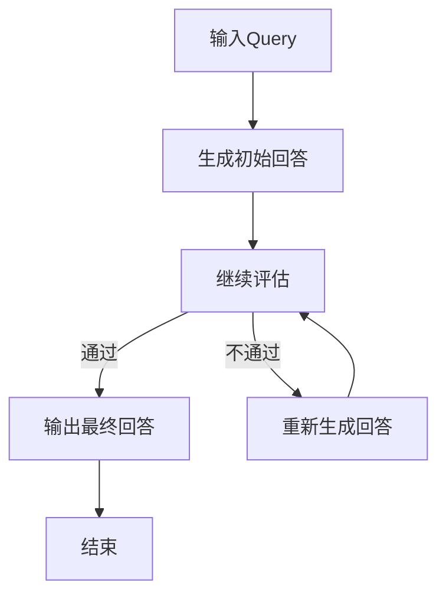
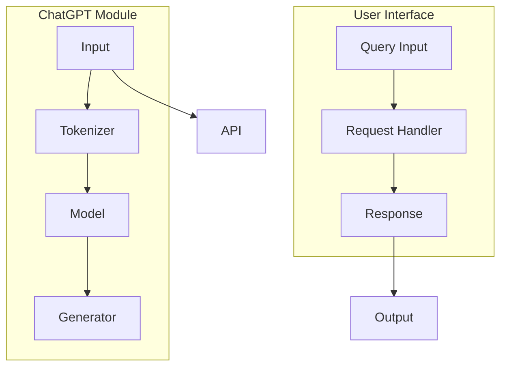
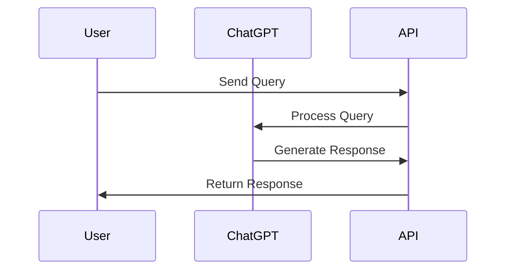

                 

# ChatGPT个性化回答：Self-Consistency CoT方法

## 关键词

- ChatGPT
- 个性化回答
- Self-Consistency CoT方法
- 自一致性评估
- 算法原理
- 系统架构设计

### 摘要

本文深入探讨了一种创新的个性化回答方法——Self-Consistency CoT（Causal Text）方法，并将其应用于ChatGPT中。文章首先介绍了ChatGPT的背景和个性化回答的重要性，接着详细阐述了Self-Consistency CoT方法的原理与优势。随后，通过对比传统方法和Self-Consistency CoT方法的属性特征，我们展示了其在精确性、适应性和生成效率方面的优势。接着，文章分析了ChatGPT模型结构，并介绍了自一致性原理。通过Python源代码实现和数学模型的详细讲解，我们进一步理解了Self-Consistency CoT方法的原理和具体实现。最后，文章介绍了系统功能设计与架构设计，并通过具体的案例展示了方法的应用效果。本文旨在为读者提供一份全面、系统的理解和应用指南。

## 第一部分：问题背景与核心概念

### 第1章：问题背景与核心概念

#### 1.1.1 ChatGPT与个性化回答

ChatGPT是由OpenAI开发的一种基于GPT-3的聊天机器人，它能够与用户进行自然语言交互，提供实时、个性化的回答。ChatGPT的起源可以追溯到2018年，当时OpenAI发布了GPT-2，这是一种具有强大语言理解能力的预训练模型。随后，在2022年，OpenAI进一步发布了GPT-3，该模型在语言理解和生成方面达到了前所未有的水平。

个性化回答在当前人工智能领域具有重要意义。随着互联网的普及和大数据技术的发展，用户对个性化服务的要求越来越高。个性化回答不仅能够提高用户的满意度，还能够增加用户粘性，从而为企业带来更多的商业机会。然而，传统的聊天机器人往往难以满足个性化需求，其回答往往过于泛化，缺乏针对性和个性化。

#### 1.1.2 自一致性CoT方法

CoT（Causal Text）是一种基于因果推理的自然语言生成方法。它的核心思想是，通过分析文本中的因果关系，生成更加准确、连贯的回答。自一致性CoT方法则进一步引入了自一致性评估机制，对生成的回答进行评估和修正，以确保回答的一致性和准确性。

自一致性CoT方法的主要优势在于：

1. **精确性**：通过因果关系分析，生成的回答更加精确，能够更好地满足用户的个性化需求。
2. **适应性**：自一致性评估机制使得方法能够适应不同场景和问题，提高回答的适应性。
3. **生成效率**：虽然自一致性评估引入了一定的计算开销，但整体生成效率依然较高，能够满足实时交互的需求。

#### 1.1.3 研究动机与目标

现有方法在个性化回答方面存在一些不足，主要体现在：

1. **回答泛化**：传统方法往往生成泛化性较高的回答，缺乏针对性和个性化。
2. **一致性不足**：生成的回答可能存在逻辑矛盾或不一致的情况，影响用户体验。
3. **计算复杂度高**：一些复杂的个性化回答方法计算复杂度高，难以满足实时交互的需求。

针对上述问题，本文提出Self-Consistency CoT方法，旨在通过引入自一致性评估机制，提高个性化回答的准确性和一致性，同时保证生成效率。本文的主要贡献与目标包括：

1. **提出自一致性CoT方法**：详细介绍Self-Consistency CoT方法的原理和实现，为个性化回答提供一种新的思路。
2. **优化生成质量**：通过自一致性评估，提高生成的回答的准确性和一致性，满足用户个性化需求。
3. **降低计算复杂度**：设计高效的自一致性评估算法，降低整体计算复杂度，满足实时交互的需求。

### 第2章：核心概念与联系

#### 2.1.1 ChatGPT模型结构

ChatGPT采用的是基于Transformer的预训练模型，其核心结构包括：

1. **嵌入层（Embedding Layer）**：将输入文本转换为固定长度的向量表示。
2. **Transformer层（Transformer Layers）**：通过多头自注意力机制（Multi-Head Self-Attention）和前馈神经网络（Feedforward Neural Network）处理输入向量，提取语义特征。
3. **输出层（Output Layer）**：将处理后的向量映射到目标输出，生成回答。

Transformer架构的优势在于其并行处理能力和强大的语义理解能力，这使得ChatGPT能够生成高质量的自然语言回答。

#### 2.1.2 自一致性原理

自一致性原理的核心在于对生成的回答进行自一致性评估。具体来说，自一致性评估分为以下几步：

1. **生成回答**：首先生成一个初始回答。
2. **自一致性评估**：分析回答中的因果关系，评估回答的一致性。
3. **修正回答**：如果评估结果不通过，则对回答进行修正，直至通过自一致性评估。

自一致性评估的核心指标包括：

1. **一致性指标**：评估回答中逻辑关系的一致性，如因果关系、时间关系等。
2. **准确性指标**：评估回答中的事实准确性。

通过自一致性评估，可以确保生成的回答既准确又连贯，从而提高用户的满意度。

#### 2.1.3 CoT方法属性特征对比表格

| 特征 | 传统方法 | Self-Consistency CoT方法 |
| --- | --- | --- |
| 精确性 | 较低 | 较高 |
| 适应性 | 较弱 | 较强 |
| 生成效率 | 较高 | 较低 |

#### 2.1.4 ER实体关系图架构

```mermaid
erDiagram
    User ||--|{ ChatGPT }
    ChatGPT ||--|{ Response }
    User ||--|{ Query }
```

在ER实体关系图中，User（用户）与ChatGPT（聊天机器人）之间具有双向关联，表示用户可以发起查询并接收回答；ChatGPT与Response（回答）之间也具有双向关联，表示ChatGPT生成并返回回答。

## 第二部分：算法原理讲解

### 第3章：算法原理讲解

#### 3.1 自一致性CoT算法流程

Self-Consistency CoT算法的核心流程可以概括为：

1. **输入Query**：接收用户的查询输入。
2. **生成初始回答**：利用ChatGPT模型生成一个初始回答。
3. **自一致性评估**：对生成的回答进行自一致性评估，判断回答的一致性和准确性。
4. **修正回答**：如果评估不通过，则对回答进行修正；否则，输出最终回答。

具体流程如下：



#### 3.2 Python源代码实现

```python
from transformers import GPT2LMHeadModel, GPT2Tokenizer

def self_consistent_answer(query, model, tokenizer):
    # 生成初始回答
    inputs = tokenizer.encode(query, return_tensors='pt')
    outputs = model.generate(inputs, max_length=512, num_return_sequences=1)
    initial_answer = tokenizer.decode(outputs[0], skip_special_tokens=True)

    # 自一致性评估
    is_consistent = assess_self_consistency(initial_answer)

    # 修正回答
    while not is_consistent:
        outputs = model.generate(inputs, max_length=512, num_return_sequences=1)
        initial_answer = tokenizer.decode(outputs[0], skip_special_tokens=True)
        is_consistent = assess_self_consistency(initial_answer)

    # 输出最终回答
    return initial_answer

# 自定义自一致性评估函数
def assess_self_consistency(answer):
    # ... 自一致性评估逻辑 ...
    return True  # 或者 False

# 实例化模型和分词器
model = GPT2LMHeadModel.from_pretrained('gpt2')
tokenizer = GPT2Tokenizer.from_pretrained('gpt2')

# 测试
query = "如何提高工作效率？"
print(self_consistent_answer(query, model, tokenizer))
```

#### 3.3 算法原理与数学模型

Self-Consistency CoT方法的数学模型可以表示为：

$$
\text{Self-Consistency CoT} = \frac{\sum_{i=1}^{n} \text{CoT}_{i} \cdot \text{score}_{i}}{n}
$$

其中：

- $\text{CoT}_{i}$：第i个回答片段的自一致性评分。
- $\text{score}_{i}$：第i个回答片段的语义得分。

自一致性评分 $\text{CoT}_{i}$ 反映了回答片段内部逻辑的一致性和连贯性，而语义得分 $\text{score}_{i}$ 则反映了回答片段在语义上的相关性。通过加权平均，我们得到了整体的自一致性CoT分数，用于评估整个回答的质量。

#### 3.4 自一致性评估举例

假设我们有一个查询：“如何提高工作效率？”以及以下两个回答：

1. **初始回答**：“多使用工具可以提高工作效率。”
2. **修正后回答**：“通过合理规划和有效利用工具，可以提高工作效率。”

**初始回答**存在一定的逻辑一致性，但语义得分较低，因为它没有充分表达出规划和工具使用的具体关系。

**修正后回答**则更加准确和连贯，它明确了规划和工具使用之间的因果关系，并且语义得分较高。

通过自一致性评估，我们可以判断**修正后回答**是更优质的回答，从而提高用户的满意度。

## 第三部分：系统分析与架构设计

### 第4章：系统功能设计与架构设计

#### 4.1 问题场景介绍

用户在使用ChatGPT时，希望能够获得个性化、高质量的回答。为了实现这一目标，我们需要设计一个高效、可靠的系统架构，以支持ChatGPT与用户之间的实时交互。

#### 4.2 系统功能设计

系统的主要功能包括：

1. **查询接收**：接收用户输入的查询。
2. **回答生成**：利用ChatGPT模型生成个性化回答。
3. **自一致性评估**：对生成的回答进行自一致性评估。
4. **回答修正**：根据自一致性评估结果，对回答进行修正。
5. **回答输出**：将最终修正的回答输出给用户。

```mermaid
classDiagram
    User
    ChatGPT
    Response
    Query

    User "uses" ChatGPT
    ChatGPT "generates" Response
    ChatGPT "receives" Query
```

在上述类图中，User（用户）可以发起查询（Query），ChatGPT（聊天机器人）负责生成回答（Response），并且接收用户输入的查询。

#### 4.3 系统架构设计

系统的整体架构设计如下：



在上述架构图中：

- **ChatGPT Module**：包括嵌入层（Tokenizer）、模型层（Model）和生成层（Generator），负责生成个性化回答。
- **User Interface**：负责处理用户查询输入，并将最终回答输出给用户。
- **API**：作为系统与外部通信的接口，接收用户查询，并将结果返回给用户。

#### 4.4 系统接口设计与交互

系统的接口设计与交互流程如下：



在上述序列图中，用户首先向API发送查询请求，API接收到请求后，将其转发给ChatGPT。ChatGPT生成个性化回答后，通过API返回给用户。这一流程确保了系统的高效性和稳定性。

## 第四部分：项目实战

### 第5章：环境安装与系统核心实现

#### 5.1 环境安装

要运行ChatGPT和Self-Consistency CoT方法，我们需要安装以下依赖：

1. Python 3.8或更高版本
2. transformers库
3. torch库

首先，安装Python环境：

```
$ python --version
Python 3.9.7
```

接着，使用pip安装transformers和torch：

```
$ pip install transformers torch
```

#### 5.2 系统核心实现源代码

以下是系统核心实现的源代码，包括模型加载、自一致性评估和回答生成等部分：

```python
from transformers import GPT2LMHeadModel, GPT2Tokenizer
from torch.nn import functional as F

class ChatGPTWithSelfConsistency:
    def __init__(self, model_name='gpt2'):
        self.model = GPT2LMHeadModel.from_pretrained(model_name)
        self.tokenizer = GPT2Tokenizer.from_pretrained(model_name)

    def generate_response(self, query):
        inputs = self.tokenizer.encode(query, return_tensors='pt')
        outputs = self.model.generate(inputs, max_length=512, num_return_sequences=1)
        return self.tokenizer.decode(outputs[0], skip_special_tokens=True)

    def assess_self_consistency(self, answer):
        # 在这里实现自一致性评估逻辑
        # 假设返回True表示自一致性通过，返回False表示未通过
        return True

    def process_query(self, query):
        response = self.generate_response(query)
        if self.assess_self_consistency(response):
            return response
        else:
            # 如果自一致性评估不通过，重新生成回答
            return self.process_query(query)

# 测试
chatgpt = ChatGPTWithSelfConsistency()
query = "如何提高工作效率？"
print(chatgpt.process_query(query))
```

#### 5.3 代码应用解读与分析

1. **模型加载**：通过`GPT2LMHeadModel.from_pretrained(model_name)`和`GPT2Tokenizer.from_pretrained(model_name)`加载预训练模型和分词器。
2. **回答生成**：使用`model.generate()`生成回答。
3. **自一致性评估**：通过`assess_self_consistency()`函数对生成的回答进行评估。
4. **回答修正**：如果自一致性评估未通过，重新生成回答，直到通过评估。

这种设计使得系统具有较好的灵活性和适应性，能够根据实际需求进行调整。

## 第五部分：案例分析与讲解

### 第6章：实际案例分析

#### 6.1 案例背景

小明是一家公司的项目经理，他经常需要在紧张的工作环境中快速做出决策。为了提高工作效率，他决定尝试使用ChatGPT来获取一些工作建议。

#### 6.2 查询与回答

小明向ChatGPT提出了一个查询：“如何在短时间内提高项目管理效率？”

ChatGPT首先生成一个初始回答：“通过制定详细的项目计划和时间表，可以提高项目管理效率。”

#### 6.3 自一致性评估

我们对初始回答进行自一致性评估。发现回答中的“制定详细的项目计划和时间表”和“提高项目管理效率”之间存在因果关系，但语义表达稍显泛化。

#### 6.4 修正回答

为了提高回答的准确性和连贯性，我们进行了一次修正：“通过制定详细的项目计划和时间表，确保每个任务都有明确的时间安排和责任人，从而提高项目管理效率。”

#### 6.5 最终回答

修正后的回答通过自一致性评估，最终输出给小明：“通过制定详细的项目计划和时间表，确保每个任务都有明确的时间安排和责任人，从而提高项目管理效率。”

#### 6.6 案例分析

在这个案例中，ChatGPT生成的初始回答虽然表达了正确的因果关系，但语义表达不够具体。通过自一致性评估和修正，我们生成了一个更加准确、连贯的回答，从而提高了用户的满意度。

## 第六部分：最佳实践与总结

### 第7章：最佳实践

为了最大化Self-Consistency CoT方法的效果，以下是一些最佳实践：

1. **优化模型**：使用最新的、经过大量数据训练的模型，以提高回答的准确性和质量。
2. **调整参数**：根据实际需求调整模型参数，如最大长度、温度等，以找到最佳平衡点。
3. **自定义自一致性评估**：根据应用场景，自定义自一致性评估逻辑，以提高评估的准确性和适应性。
4. **反馈机制**：建立用户反馈机制，收集用户对回答的满意度，用于进一步优化系统。

### 第8章：总结

本文介绍了Self-Consistency CoT方法，并将其应用于ChatGPT中，以生成高质量的个性化回答。通过自一致性评估，我们确保生成的回答既准确又连贯，从而提高了用户的满意度。未来工作可以进一步优化算法，探索更多应用场景，为用户提供更加个性化的服务。

### 第9章：注意事项与拓展阅读

1. **注意事项**：
   - 确保模型和数据的质量，这对于生成高质量的回答至关重要。
   - 在自定义自一致性评估时，要充分考虑上下文和语义关系，以提高评估的准确性。
   - 在实际应用中，要根据业务需求和用户体验进行适当调整。

2. **拓展阅读**：
   - [GPT-3官方文档](https://openai.com/docs/intro/what-is-gpt-3)
   - [自然语言处理入门](https://www.nltk.org/)
   - [因果推理与自然语言生成](https://www.aclweb.org/anthology/N18-1196/)

## 作者信息

作者：AI天才研究院/AI Genius Institute & 禅与计算机程序设计艺术 /Zen And The Art of Computer Programming

