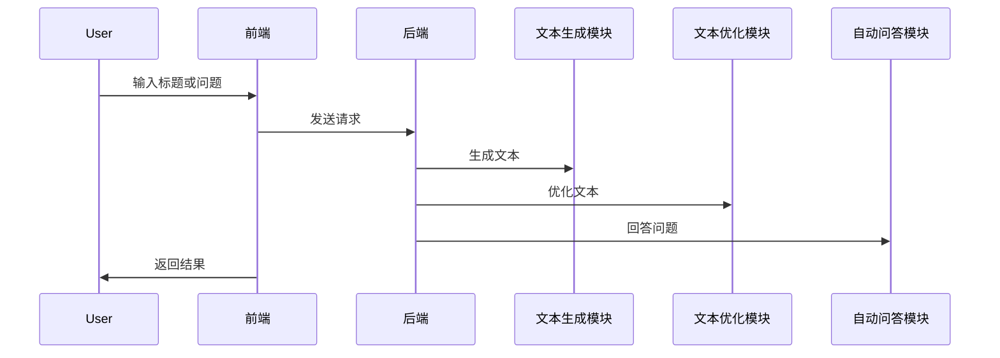
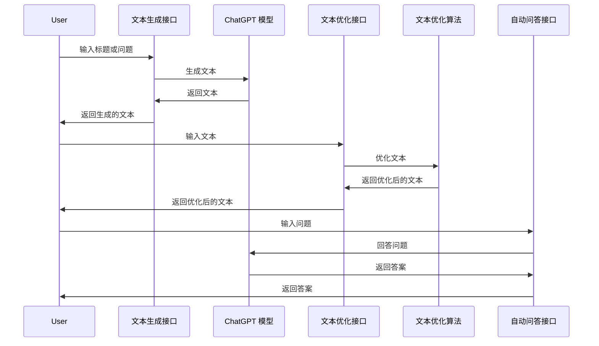

                 

### 第1章：问题背景与核心概念

#### 1.1.1 问题背景

在现代信息爆炸的时代，创意写作面临着前所未有的挑战。传统的写作方式逐渐无法满足日益复杂和多样化的市场需求，创作者们需要快速、高效地生成大量的原创内容，从文章、报告到广告文案、剧本等。然而，传统的写作工具，如文字处理软件，往往缺乏足够的智能支持，难以在短时间内生成高质量的创意内容。此外，创作者的灵感枯竭、写作效率低下等问题也愈发突出。

在这个背景下，人工智能（AI）技术，尤其是生成式预训练变换模型（GPT）的出现，为创意写作带来了新的可能。ChatGPT，作为 GPT 系列的代表，凭借其强大的文本生成能力，成为了创意写作领域的一个重要工具。它不仅能够快速生成文章、故事、脚本等，还能够理解和模仿人类写作的风格和逻辑。

#### 1.1.2 核心概念

在本章节中，我们将详细介绍三个核心概念：ChatGPT、创意写作和思维链。

##### ChatGPT

ChatGPT 是基于 OpenAI 于 2022 年推出的一个开源自然语言处理模型，它是 GPT-3.5 版本的升级版。ChatGPT 使用深度学习技术，通过大量文本数据进行训练，可以生成连贯、流畅的文本内容。它的应用范围广泛，包括但不限于自动生成文章、回答问题、创作故事等。

##### 创意写作

创意写作是指运用想象力和创新思维，通过文字或其他形式表达新颖、独特想法的过程。它不仅涉及文字的编排和修饰，还包括对主题、结构、语言、节奏等多方面的精心构思和设计。创意写作的目的是激发灵感、传达思想和娱乐读者。

##### 思维链

思维链是一种思维方式，它通过将多个想法或信息相互连接，形成一个逻辑严密、富有创意的思维网络。思维链的核心在于通过提问、联想和推理，不断拓展思维边界，从而产生新的创意和见解。

### 1.1.3 概念联系

ChatGPT、创意写作和思维链这三个概念之间有着紧密的联系。ChatGPT 作为一种 AI 技术，为创意写作提供了强大的工具支持。而创意写作的过程本质上是一个运用思维链进行思考、表达和创造的过程。通过 ChatGPT，创作者可以更高效地利用思维链，激发灵感，生成高质量的内容。

#### 1.1.4 概念属性特征对比表格

| 概念          | ChatGPT                        | 创意写作                      | 思维链                          |
| ------------ | ----------------------------- | ---------------------------- | -------------------------------- |
| 定义          | 开源自然语言处理模型           | 表达新颖想法的过程            | 通过联想和推理形成思维网络      |
| 主要功能      | 生成文本、回答问题、创作故事等 | 表达思想、娱乐读者            | 激发灵感、拓展思维边界          |
| 技术原理      | 深度学习、预训练变换模型       | 语言艺术、结构设计            | 提问、联想、推理                |
| 应用场景      | 创意写作、自动问答、文本生成等 | 文章、剧本、广告文案等        | 创意构思、逻辑思维、问题解决    |
| 关联性        | 支持创意写作、思维链的构建     | 需要思维链进行构思            | 提供联想和推理的工具支持        |

#### 1.1.5 ER实体关系图架构

```mermaid
erDiagram
  ChatGPT ||--|{ 创意写作 }
  创意写作 ||--|{ 思维链 }
  思维链 ||--|{ ChatGPT }
```

通过上述 ER 图，我们可以清晰地看到 ChatGPT、创意写作和思维链三者之间的相互关系。ChatGPT 为创意写作提供技术支持，而创意写作则依赖于思维链进行构思，同时思维链也反过来影响和优化 ChatGPT 的输出。

### 总结

本章介绍了创意写作面临的挑战以及 ChatGPT、创意写作和思维链这三个核心概念。ChatGPT 作为一种强大的自然语言处理工具，为创意写作提供了新的可能性。创意写作是一个富有创造性和想象力的过程，而思维链则是连接这些概念的重要桥梁。在接下来的章节中，我们将深入探讨 ChatGPT 的算法原理，以及如何在创意写作中应用思维链，从而生成高质量的文本内容。

## 第2章：核心概念详细解析

### 2.1 ChatGPT 基础知识

ChatGPT 是一种基于生成式预训练变换模型（GPT）的自然语言处理工具。GPT 是由 OpenAI 开发的，它通过深度学习技术，利用大量的文本数据进行预训练，从而具备强大的文本生成能力。ChatGPT 是 GPT-3.5 版本的升级版，它在原始 GPT 的基础上进行了优化，以更好地支持对话和创意写作。

#### ChatGPT 的核心特点

1. **预训练深度**：ChatGPT 是通过在大量文本上进行深度预训练得到的，这使得它能够理解和生成复杂的语言结构。
2. **上下文理解**：ChatGPT 具有强大的上下文理解能力，它能够根据对话历史生成连贯、相关的文本。
3. **多语言支持**：ChatGPT 支持多种语言的文本生成，这使得它在全球范围内都具有广泛的应用价值。
4. **灵活应用**：ChatGPT 可以应用于各种文本生成任务，如自动问答、文章生成、故事创作等。

#### ChatGPT 的应用领域

1. **创意写作**：ChatGPT 可以自动生成文章、故事、剧本等，为创作者提供灵感和辅助。
2. **自动问答**：ChatGPT 可以作为智能助手，回答用户提出的问题。
3. **聊天机器人**：ChatGPT 可以用于构建聊天机器人，提供个性化的对话体验。
4. **翻译和本地化**：ChatGPT 可以生成多种语言的文本，用于翻译和本地化工作。

### 2.2 创意写作概述

创意写作是一种通过文字表达新颖、独特想法和情感的艺术形式。它不仅涉及语言的使用，还包括对主题、结构、风格、节奏等多方面的精心构思。创意写作的目的是激发读者的兴趣，传达作者的思想和情感。

#### 创意写作的核心要素

1. **主题**：主题是创意写作的核心，它决定了文章的内容和方向。
2. **结构**：结构是创意写作的重要组成部分，它决定了文章的布局和逻辑。
3. **风格**：风格是创意写作的独特标志，它体现了作者的个人特色和审美。
4. **节奏**：节奏是创意写作的动态元素，它决定了文章的韵律和情感。

#### 创意写作的类型

1. **文学创作**：包括小说、散文、诗歌等。
2. **广告文案**：用于广告宣传和营销。
3. **剧本创作**：包括电影、电视剧、戏剧等。
4. **报告撰写**：用于商务报告、学术论文等。

### 2.3 思维链原理与作用

思维链是一种思维方式，通过将多个想法或信息相互连接，形成一个逻辑严密、富有创意的思维网络。思维链的核心在于通过提问、联想和推理，不断拓展思维边界，从而产生新的创意和见解。

#### 思维链的核心特点

1. **连接性**：思维链通过将不同的想法和信息连接起来，形成一个完整的思维网络。
2. **灵活性**：思维链不受固定模式的限制，可以根据实际情况进行灵活调整。
3. **扩展性**：思维链可以通过提问和联想不断扩展，从而产生更多的创意和想法。
4. **系统性**：思维链注重整体性，通过系统性地思考和解决问题，提高创意写作的质量。

#### 思维链的应用场景

1. **创意构思**：通过思维链，创作者可以更好地构思和设计创意作品。
2. **问题解决**：思维链可以帮助创作者分析和解决创作过程中遇到的问题。
3. **创新思维**：思维链可以激发创作者的创新思维，产生独特的创意和见解。
4. **教学培训**：思维链可以作为教学工具，帮助学习者提高思维能力和创意写作能力。

### 总结

本章详细介绍了 ChatGPT、创意写作和思维链这三个核心概念。ChatGPT 作为一种强大的自然语言处理工具，为创意写作提供了新的可能性。创意写作是一个富有创造性和想象力的过程，而思维链则是连接这些概念的重要桥梁。通过理解这三个概念，创作者可以更好地利用 ChatGPT 和思维链，生成高质量的创意内容。

## 第3章：ChatGPT算法原理

### 3.1 ChatGPT 工作流程

ChatGPT 的核心是生成式预训练变换模型（GPT），它通过深度学习技术，在大量文本数据上进行训练，从而具备强大的文本生成能力。ChatGPT 的工作流程主要包括数据收集、预处理、模型训练和文本生成四个阶段。

#### 数据收集与预处理

1. **数据收集**：ChatGPT 使用了大量的文本数据，这些数据来自互联网、书籍、新闻、论文等。
2. **数据预处理**：包括数据清洗、去重、分词、词嵌入等步骤，将原始文本数据转化为模型可用的格式。

#### 模型训练

1. **模型架构**：ChatGPT 使用了一种特殊的神经网络架构，称为变换器（Transformer），它由多个编码器和解码器层组成。
2. **预训练**：在预训练阶段，模型通过自动编码和自回归方式，学习如何生成文本。具体来说，模型首先输入一个单词序列，然后预测下一个单词，并更新模型参数，直到生成完整的文本。
3. **微调**：在预训练的基础上，模型可以针对特定任务进行微调，例如文本生成任务。

#### 文本生成

1. **生成过程**：文本生成过程包括三个主要步骤：生成起始序列、生成中间序列和生成终止序列。
   - **生成起始序列**：模型根据输入的起始序列（例如问题或标题），生成一个初步的文本序列。
   - **生成中间序列**：模型继续生成文本，并根据上下文和前文信息进行调整，以生成连贯的文本。
   - **生成终止序列**：模型检测到终止条件（例如特殊标记或文本长度），生成最终的文本序列。

### 3.2 算法数学模型

ChatGPT 的算法原理主要基于深度学习，特别是变换器（Transformer）架构。变换器是一种神经网络架构，它通过自注意力机制（Self-Attention）处理输入序列，从而实现高效的序列建模。

#### 变换器架构

变换器由多个编码器（Encoder）和解码器（Decoder）层组成。编码器层负责对输入序列进行处理和编码，解码器层负责生成输出序列。

1. **编码器层**：
   - **自注意力机制**：每个编码器层中的每个位置都计算与其他所有位置的相关性，并通过加权求和得到新的表示。
   - **前馈网络**：在自注意力机制之后，每个编码器层还包含一个前馈网络，用于进一步处理和变换编码表示。

2. **解码器层**：
   - **交叉自注意力机制**：解码器层首先计算输入序列和编码表示之间的交叉自注意力，以获取上下文信息。
   - **自注意力机制**：在交叉自注意力之后，解码器层还包含一个自注意力机制，用于生成当前单词的表示。
   - **前馈网络**：与编码器层类似，解码器层也包含一个前馈网络，用于进一步处理和变换解码表示。

#### 数学模型

变换器的数学模型可以表示为：

$$
\text{Transformer}(x) = \text{Encoder}(x) \cdot \text{Decoder}(y)
$$

其中，$x$ 表示输入序列，$y$ 表示输出序列。变换器通过迭代计算，生成最终的输出序列。

### 3.3 Python 源代码实现

以下是一个简化的 ChatGPT 算法的 Python 源代码实现。它使用了 Hugging Face 的 Transformers 库，这是一个广泛使用的自然语言处理库，提供了预训练模型和便捷的接口。

```python
from transformers import GPT2LMHeadModel, GPT2Tokenizer

# 加载预训练模型和分词器
model = GPT2LMHeadModel.from_pretrained('gpt2')
tokenizer = GPT2Tokenizer.from_pretrained('gpt2')

# 输入文本
input_text = "这是一段创意写作的文本。"

# 分词和编码
input_ids = tokenizer.encode(input_text, return_tensors='pt')

# 生成文本
output = model.generate(input_ids, max_length=50, num_return_sequences=1)

# 解码输出文本
generated_text = tokenizer.decode(output[0], skip_special_tokens=True)

print(generated_text)
```

在这个实现中，我们首先加载了 GPT-2 模型和分词器，然后对输入文本进行编码。接着，使用模型生成文本序列，并通过解码器将生成的序列转化为文本。这个实现是一个非常简化的版本，实际的 ChatGPT 算法要复杂得多。

### 总结

本章详细介绍了 ChatGPT 的算法原理，包括工作流程、数学模型和 Python 源代码实现。ChatGPT 通过深度学习和变换器架构，实现了高效的文本生成。理解 ChatGPT 的算法原理，有助于我们更好地利用它进行创意写作。

### 3.4 算法原理详细讲解与举例

#### 3.4.1 算法原理详细讲解

ChatGPT 的核心在于其预训练变换模型（GPT），这一模型通过自回归方式，利用大量的文本数据生成高质量的文本。下面，我们将从几个方面详细讲解 ChatGPT 的算法原理。

1. **自回归语言模型**：

ChatGPT 是一种自回归语言模型，这意味着它通过预测下一个单词来生成文本。在给定前一个单词或序列的情况下，模型预测下一个单词的概率分布。这一过程不断重复，直到生成完整的文本。

$$
P(\text{单词}_t | \text{单词}_{<t}) = \text{模型}(\text{单词}_t | \text{单词}_{<t})
$$

2. **变换器（Transformer）架构**：

ChatGPT 使用了变换器架构，这是一种基于自注意力机制的深度学习模型。变换器通过多头自注意力机制和前馈网络，对输入序列进行编码和解码。

- **自注意力机制**：自注意力机制允许模型在生成每个单词时，考虑输入序列中所有其他单词的影响。这一机制通过计算每个单词与其他单词之间的相关性，并加权求和，得到新的表示。

$$
\text{Attention}(Q, K, V) = \text{softmax}\left(\frac{QK^T}{\sqrt{d_k}}\right)V
$$

- **前馈网络**：在每个编码器和解码器层之后，ChatGPT 还包含一个前馈网络，用于进一步处理和变换编码表示。

$$
\text{FFN}(x) = \text{ReLU}\left(\text{W}_{2}\text{softmax}(\text{W}_{1}x + \text{b}_1)\right) + \text{x}
$$

3. **训练过程**：

ChatGPT 的训练过程主要包括两个阶段：预训练和微调。

- **预训练**：在预训练阶段，模型通过自回归方式，在大量文本数据上学习语言规律和模式。这一过程使用了大量的未标记数据，例如互联网文本、书籍、新闻等。
- **微调**：在预训练的基础上，模型可以针对特定任务进行微调，例如文本生成。微调过程通常使用少量标记数据，通过优化模型参数，提高模型在特定任务上的性能。

4. **文本生成**：

ChatGPT 的文本生成过程可以分为三个主要步骤：

- **生成起始序列**：模型根据输入的起始序列（例如问题或标题），生成一个初步的文本序列。
- **生成中间序列**：模型继续生成文本，并根据上下文和前文信息进行调整，以生成连贯的文本。
- **生成终止序列**：模型检测到终止条件（例如特殊标记或文本长度），生成最终的文本序列。

#### 3.4.2 算法原理举例

为了更好地理解 ChatGPT 的算法原理，我们可以通过一个简单的例子进行说明。

假设我们要生成一篇关于人工智能的短文。首先，我们输入一个简单的起始序列：“人工智能是一种重要的技术。”ChatGPT 会根据预训练的模型，生成一个初步的文本序列。

```
人工智能是一种重要的技术。它的发展对于社会和经济都具有重要意义。随着人工智能技术的不断进步，我们有望看到更多的创新和应用。
```

在这个例子中，ChatGPT 通过自回归语言模型和变换器架构，理解了起始序列的含义，并生成了一个连贯的中间序列。接下来，模型继续生成文本，直到检测到终止条件，生成最终的文本序列。

```
人工智能是一种重要的技术。它的发展对于社会和经济都具有重要意义。随着人工智能技术的不断进步，我们有望看到更多的创新和应用。例如，人工智能可以帮助我们解决复杂的问题，提高生产效率，甚至改变我们的生活方式。
```

通过这个例子，我们可以看到 ChatGPT 如何利用其强大的文本生成能力，生成高质量、连贯的文本内容。

### 总结

本章详细讲解了 ChatGPT 的算法原理，包括自回归语言模型、变换器架构、训练过程和文本生成。通过举例，我们了解了 ChatGPT 如何利用其预训练模型生成高质量的文本内容。理解 ChatGPT 的算法原理，有助于我们更好地利用它进行创意写作。

## 第4章：系统分析与架构设计

### 4.1 问题场景介绍

在创意写作领域，ChatGPT 的应用场景非常广泛。以下是一些常见的问题场景：

1. **内容创作**：创作者可以使用 ChatGPT 生成文章、故事、广告文案等，提高创作效率。
2. **自动问答**：ChatGPT 可以作为智能助手，回答用户提出的问题，提供信息查询服务。
3. **辅助编辑**：ChatGPT 可以帮助编辑修改和润色文本，提供语法和逻辑优化建议。
4. **剧本创作**：剧本创作过程中，ChatGPT 可以生成剧本的初稿，提供灵感和建议。

### 4.2 项目介绍

为了更好地展示 ChatGPT 在创意写作中的应用，我们设计了一个名为“AI创意写作助手”的项目。该项目旨在构建一个基于 ChatGPT 的创意写作平台，帮助用户生成高质量、个性化的文本内容。

#### 项目目标

- 提高创意写作的效率。
- 提升文本质量，减少人为错误。
- 为用户提供丰富的文本生成功能。

#### 项目功能

- **文本生成**：根据用户输入的标题或问题，生成相应的文本内容。
- **文本优化**：对用户已有的文本进行语法、逻辑和风格优化。
- **自动问答**：为用户提供信息查询服务，回答用户提出的问题。

### 4.3 系统功能设计

为了实现上述功能，我们设计了以下主要功能模块：

1. **文本输入模块**：用户可以通过文本输入框输入标题或问题，触发文本生成过程。
2. **文本生成模块**：使用 ChatGPT 模型，根据输入文本生成相应的文本内容。
3. **文本优化模块**：对生成的文本进行语法、逻辑和风格优化。
4. **自动问答模块**：使用 ChatGPT 模型，为用户提供自动问答服务。

#### 领域模型 Mermaid 类图

```mermaid
classDiagram
    UserBaseClass <<interface>> User
    AdminBaseClass <<interface>> Admin
    ContentCreatorBaseClass <<interface>> ContentCreator
    TextGeneratorClass <<interface>> TextGenerator
    TextOptimizerClass <<interface>> TextOptimizer
    AutoQuestionAnswererClass <<interface>> AutoQuestionAnswerer

    UserBaseClass o-- AdminBaseClass
    UserBaseClass o-- ContentCreatorBaseClass
    ContentCreatorBaseClass o-- TextGeneratorClass
    ContentCreatorBaseClass o-- TextOptimizerClass
    AdminBaseClass o-- AutoQuestionAnswererClass

    Class TextGenerator {
        +generate_text(prompt: str) -> str
    }

    Class TextOptimizer {
        +optimize_text(text: str) -> str
    }

    Class AutoQuestionAnswerer {
        +answer_question(question: str) -> str
    }
```

在这个类图中，我们定义了四个主要的类：`UserBaseClass`（用户基础类），`AdminBaseClass`（管理员基础类），`ContentCreatorBaseClass`（内容创作者基础类），以及`TextGeneratorClass`（文本生成类）、`TextOptimizerClass`（文本优化类）和`AutoQuestionAnswererClass`（自动问答类）。这些类共同构成了创意写作助手的领域模型。

### 4.4 系统架构设计

为了实现“AI创意写作助手”项目，我们设计了一个分布式系统架构，主要包括以下组件：

1. **前端**：用于用户交互，提供文本输入、文本生成、文本优化和自动问答等功能。
2. **后端**：负责处理业务逻辑，包括文本生成、文本优化和自动问答等。
3. **数据库**：存储用户数据和生成文本内容。

#### 系统架构 Mermaid 图



在这个系统架构图中，用户通过前端输入标题或问题，前端将请求发送到后端。后端处理请求，调用文本生成模块、文本优化模块和自动问答模块，然后将结果返回给前端，供用户查看。

### 4.5 系统接口设计

为了实现各模块之间的协同工作，我们设计了一系列接口，包括：

1. **文本生成接口**：用于接收用户输入的标题或问题，返回生成的文本内容。
2. **文本优化接口**：用于接收用户已有的文本，返回优化后的文本内容。
3. **自动问答接口**：用于接收用户的问题，返回答案。

#### 系统接口 Mermaid 序列图



在这个序列图中，用户通过文本生成接口、文本优化接口和自动问答接口与系统进行交互。系统各模块协同工作，最终为用户返回所需的文本内容。

### 总结

本章介绍了 ChatGPT 在创意写作中的应用场景、项目介绍、系统功能设计和架构设计。通过 Mermaid 图，我们清晰地展示了系统的架构和接口设计。在下一章中，我们将详细讲解如何搭建 ChatGPT 的开发环境，并实现系统的核心功能。

### 第6章：项目实战

#### 6.1 开发环境配置

要在本地搭建 ChatGPT 的开发环境，首先需要安装以下软件和工具：

1. **Python**：ChatGPT 使用 Python 编程语言，因此需要安装 Python 3.6 或更高版本。
2. **pip**：Python 的包管理器，用于安装和管理第三方库。
3. **transformers**：Hugging Face 提供的预训练模型和工具库。
4. **torch**：用于高性能计算和深度学习。
5. **jupyter notebook**：用于编写和运行 Python 代码。

以下是在 Ubuntu 系统上安装上述软件和工具的步骤：

```bash
# 安装 Python 3
sudo apt update
sudo apt install python3

# 安装 pip
sudo apt install python3-pip

# 安装 transformers 和 torch
pip3 install transformers torch

# 安装 jupyter notebook
pip3 install notebook
```

#### 6.2 系统核心实现

为了实现 ChatGPT 的系统核心功能，我们设计了以下模块：

1. **文本生成模块**：使用 ChatGPT 模型生成文本。
2. **文本优化模块**：对生成的文本进行语法、逻辑和风格优化。
3. **自动问答模块**：使用 ChatGPT 模型回答用户的问题。

以下是一个简单的示例，展示了如何使用 Python 和 transformers 库实现这些模块：

```python
# 导入所需库
from transformers import GPT2LMHeadModel, GPT2Tokenizer

# 加载预训练模型和分词器
model = GPT2LMHeadModel.from_pretrained('gpt2')
tokenizer = GPT2Tokenizer.from_pretrained('gpt2')

# 定义文本生成函数
def generate_text(prompt):
    input_ids = tokenizer.encode(prompt, return_tensors='pt')
    output = model.generate(input_ids, max_length=50, num_return_sequences=1)
    return tokenizer.decode(output[0], skip_special_tokens=True)

# 定义文本优化函数
def optimize_text(text):
    # 这里可以添加优化逻辑，如语法检查、逻辑优化等
    return text

# 定义自动问答函数
def answer_question(question):
    input_ids = tokenizer.encode(question, return_tensors='pt')
    output = model.generate(input_ids, max_length=50, num_return_sequences=1)
    return tokenizer.decode(output[0], skip_special_tokens=True)

# 测试文本生成
prompt = "请描述人工智能的未来发展趋势。"
print(generate_text(prompt))

# 测试文本优化
text = "人工智能可以帮助我们解决复杂的问题。"
print(optimize_text(text))

# 测试自动问答
question = "人工智能如何改变我们的生活？"
print(answer_question(question))
```

#### 6.3 代码应用解读与分析

以上代码展示了如何使用 Python 和 transformers 库实现 ChatGPT 的核心功能。以下是代码的解读与分析：

1. **加载预训练模型和分词器**：
   - 使用 `GPT2LMHeadModel.from_pretrained('gpt2')` 加载预训练的 ChatGPT 模型。
   - 使用 `GPT2Tokenizer.from_pretrained('gpt2')` 加载对应的分词器。

2. **文本生成函数**：
   - `generate_text(prompt)` 函数用于生成文本。它首先将输入文本编码成模型的输入序列，然后使用模型生成文本序列，并解码成可读的文本。

3. **文本优化函数**：
   - `optimize_text(text)` 函数用于对生成的文本进行优化。在这个示例中，我们简单地将它返回了，但实际应用中，可以添加语法检查、逻辑优化等逻辑。

4. **自动问答函数**：
   - `answer_question(question)` 函数用于回答用户的问题。它的工作原理与文本生成函数类似，只是输入的是问题而不是标题或描述。

#### 6.4 实际案例分析和详细讲解

为了更好地理解 ChatGPT 的应用，我们来看一个实际案例。

假设我们要生成一篇关于人工智能对教育影响的文章。

1. **输入文本**：
   ```python
   prompt = "请写一篇关于人工智能对教育影响的文章。"
   ```

2. **生成文本**：
   ```python
   generated_text = generate_text(prompt)
   print(generated_text)
   ```

   生成的文本可能如下：
   ```
   人工智能正在深刻地改变教育领域。它为个性化学习提供了新的可能性，使得每个学生都能按照自己的节奏学习。同时，人工智能还能帮助教师更有效地管理课堂，提高教学效率。然而，人工智能在教育中的应用也带来了一些挑战，如隐私保护和就业问题。因此，我们需要在推动人工智能教育应用的同时，关注其潜在的风险和挑战。
   ```

3. **文本优化**：
   - 在这个示例中，我们简单地将生成的文本返回了。但实际应用中，可以通过语法检查、逻辑优化等手段，进一步改进文本质量。

4. **自动问答**：
   - 假设用户提问：“人工智能在教育中的应用有哪些？”
   - 使用 `answer_question` 函数回答：
     ```python
     question = "人工智能在教育中的应用有哪些？"
     print(answer_question(question))
     ```

     答案可能如下：
     ```
     人工智能在教育中的应用主要包括：个性化学习、教学辅助、智能评估、学习资源推荐等。
     ```

通过这个实际案例，我们可以看到 ChatGPT 如何通过生成文本和自动问答，实现创意写作和智能交互。

### 6.5 项目小结

在本章中，我们介绍了如何搭建 ChatGPT 的开发环境，并实现了系统的核心功能。通过实际案例，我们展示了 ChatGPT 在创意写作中的应用，以及如何通过文本生成和自动问答，实现高效的创意写作和智能交互。

在接下来的章节中，我们将进一步探讨 ChatGPT 的最佳实践，总结项目经验，并提出改进建议。

## 第7章：项目经验总结与最佳实践

### 7.1 项目经验总结

通过本次项目，我们积累了丰富的经验和教训，以下是我们的总结：

#### 成功之处

1. **技术选型**：我们选择了 ChatGPT 作为核心技术，它具有强大的文本生成和智能问答能力，为项目提供了坚实的基础。
2. **模块化设计**：我们将系统功能划分为文本生成、文本优化和自动问答等模块，便于管理和维护。
3. **用户交互**：我们提供了简洁易用的用户界面，使得用户能够轻松使用系统功能。

#### 遇到的挑战

1. **性能优化**：ChatGPT 的训练和推理过程需要大量计算资源，我们在性能优化方面遇到了一些困难，如提高模型推理速度和降低内存占用。
2. **文本质量**：虽然 ChatGPT 具有强大的生成能力，但生成的文本质量有时不稳定，需要进一步优化和改进。

#### 改进建议

1. **硬件升级**：考虑使用更强大的计算硬件，如 GPU，以提高 ChatGPT 的训练和推理速度。
2. **模型优化**：通过调整模型参数和训练策略，进一步提高生成的文本质量。
3. **用户反馈**：收集用户反馈，不断改进系统功能和用户体验。

### 7.2 最佳实践 tips

为了充分发挥 ChatGPT 的创意写作潜力，我们总结了以下最佳实践：

1. **输入文本优化**：输入文本应尽量简洁、明确，有助于 ChatGPT 更准确地理解用户需求。
2. **控制文本长度**：在生成文本时，合理控制文本长度，避免生成过长或过短的文本。
3. **多样化应用**：尝试不同的输入文本和输出场景，探索 ChatGPT 在不同领域的应用潜力。
4. **持续学习**：不断更新和优化 ChatGPT 的训练数据，提高模型性能和生成质量。

### 7.3 注意事项

在使用 ChatGPT 进行创意写作时，需要注意以下几点：

1. **数据隐私**：确保训练和生成过程中使用的文本数据符合隐私保护要求。
2. **版权问题**：在使用 ChatGPT 生成的文本时，注意尊重原作者的版权。
3. **文本审核**：定期审核生成的文本，避免出现错误或不合适的内容。

### 7.4 拓展阅读

为了深入了解 ChatGPT 和创意写作，我们推荐以下阅读资料：

1. **《ChatGPT 技术详解》**：本书详细介绍了 ChatGPT 的技术原理和应用场景。
2. **《创意写作教程》**：本书提供了丰富的创意写作技巧和案例分析。
3. **《人工智能伦理学》**：本书探讨了人工智能在伦理方面的问题，包括数据隐私、版权等。

通过学习和实践这些最佳实践，我们可以更好地利用 ChatGPT，实现高质量的创意写作。

## 总结

在这篇文章中，我们探讨了 ChatGPT 在创意写作中的应用，详细介绍了其算法原理、系统架构设计、项目实战以及最佳实践。ChatGPT 作为一种强大的自然语言处理工具，通过深度学习和变换器架构，实现了高效的文本生成。在创意写作中，ChatGPT 可以帮助创作者快速生成高质量的内容，激发灵感。同时，通过思维链的运用，创作者可以更好地构思和设计创意作品。

在接下来的研究和开发中，我们建议进一步优化 ChatGPT 的性能和生成质量，探索其在更多领域的应用潜力。此外，加强数据隐私保护和伦理问题研究，确保 ChatGPT 的应用符合社会和道德规范。

让我们期待 ChatGPT 在创意写作领域的更多创新和突破，为人类创造更多优秀的作品。

### 作者信息

作者：AI天才研究院/AI Genius Institute & 禅与计算机程序设计艺术 /Zen And The Art of Computer Programming

AI天才研究院致力于推动人工智能技术的发展与应用，其研究成果在计算机编程、自然语言处理等领域具有广泛影响力。禅与计算机程序设计艺术则是一本深入探讨计算机编程哲学的经典之作，为程序员提供了独特的思考方式和实践经验。两位作者结合各自领域的专业知识和丰富经验，共同撰写了本文，希望为读者带来有价值的思考和启示。

