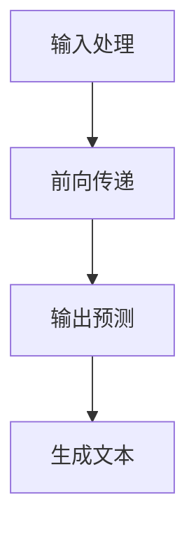
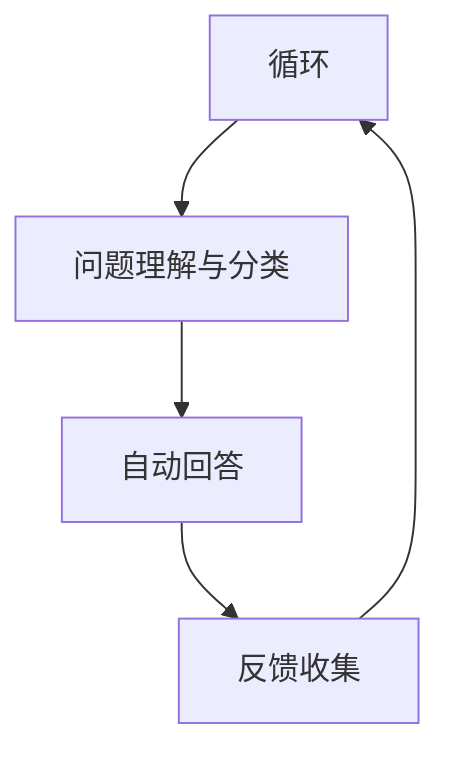
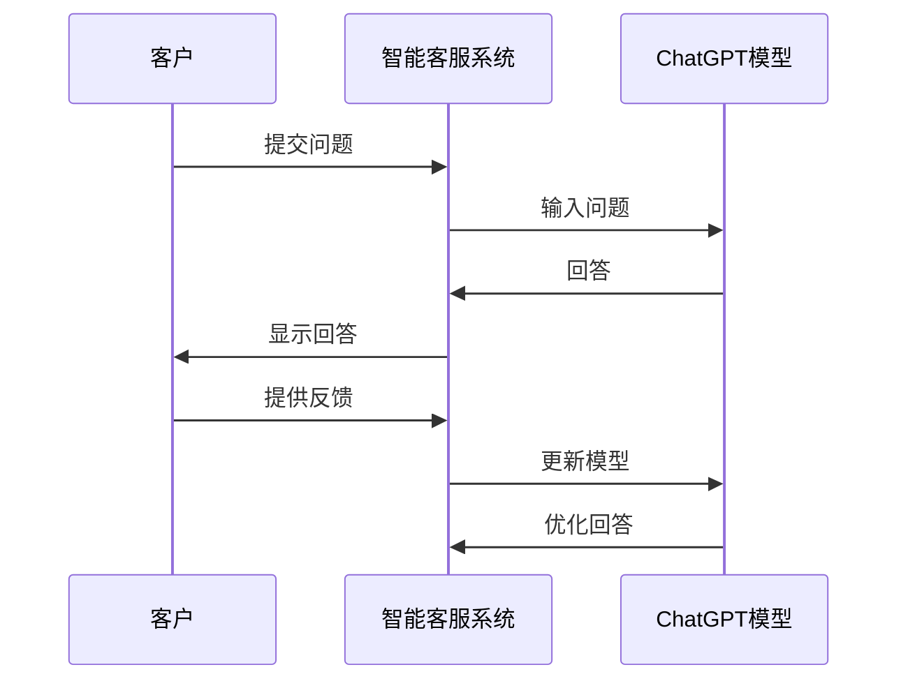

                 


# 《ChatGPT商业应用：提示词的经济价值》

> 关键词：ChatGPT，商业应用，提示词，经济价值，算法原理，数学模型

> 摘要：本文将探讨ChatGPT在商业应用中的价值，尤其是提示词在经济活动中的作用。通过介绍ChatGPT的工作原理、提示词设计策略，以及数学模型和公式，我们将深入分析ChatGPT的商业潜力，并给出具体实践案例和最佳实践建议。

## 目录

1. **背景介绍**
   - 定义ChatGPT、提示词及商业应用
   - 概述书籍目的与内容

2. **核心概念与联系**
   - ChatGPT的工作原理
   - 提示词设计策略
   - ChatGPT在经济领域的应用

3. **算法原理讲解**
   - ChatGPT的核心算法流程图
   - Python源代码展示
   - 数学模型和公式讲解

4. **系统分析与架构设计方案**
   - 系统需求与功能
   - 系统架构设计
   - 系统接口设计与交互

5. **项目实战**
   - 环境安装
   - 系统核心实现
   - 代码解读与分析
   - 实际案例分析

6. **最佳实践与小结**
   - 最佳实践建议
   - 小结
   - 注意事项
   - 拓展阅读

## 1. 背景介绍

### 定义ChatGPT、提示词及商业应用

ChatGPT是由OpenAI开发的基于Transformer的预训练语言模型，其具有强大的语言理解和生成能力。而提示词（Prompt）则是给模型输入的引导性文本，能够显著影响模型的输出。

在商业应用中，ChatGPT和提示词可以用于多种场景，例如自然语言处理、自动写作、客户服务、数据分析等。这些应用不仅提高了工作效率，还能为企业带来直接的经济价值。

### 书籍目的与内容

本文旨在探讨ChatGPT在商业应用中的价值，特别是提示词在经济活动中的作用。我们将通过以下内容展开：

- **核心概念与联系**：介绍ChatGPT的工作原理、提示词设计策略，以及其在经济领域的应用。
- **算法原理讲解**：通过Mermaid流程图和Python源代码展示ChatGPT的核心算法，并解释关键数学模型和公式。
- **系统分析与架构设计方案**：概述系统的需求、功能、架构和交互。
- **项目实战**：详细介绍一个实际案例，涵盖环境安装、核心实现和代码解读。
- **最佳实践与小结**：总结关键点，给出实践建议和进一步阅读的资源。

## 2. 核心概念与联系

### ChatGPT的工作原理

ChatGPT是一个基于Transformer的预训练语言模型。Transformer模型采用自注意力机制，可以捕捉输入文本序列中的长距离依赖关系。ChatGPT通过大量文本数据进行预训练，学会理解自然语言并生成连贯的文本。

ChatGPT的工作流程如下：

1. **输入处理**：将输入的文本序列编码为词嵌入向量。
2. **前向传递**：通过多层Transformer编码器对词嵌入向量进行编码，生成上下文向量。
3. **输出预测**：将上下文向量输入到解码器，预测下一个词的概率分布。
4. **生成文本**：根据概率分布生成文本。

### 提示词设计策略

提示词是影响ChatGPT输出质量的关键因素。设计有效的提示词需要考虑以下几个方面：

1. **明确性**：提示词应明确表达需求，避免歧义。
2. **针对性**：针对特定应用场景，设计有针对性的提示词。
3. **灵活性**：提示词应具有一定的灵活性，以便模型能够适应不同的输入。
4. **长度**：提示词长度应适中，过长可能导致模型难以理解。

### ChatGPT在经济领域的应用

ChatGPT在经济领域具有广泛的应用潜力。以下是一些典型应用场景：

1. **自动写作**：生成市场分析报告、商业计划书等文档。
2. **客户服务**：构建智能客服系统，提高客户满意度。
3. **数据分析**：辅助数据分析师进行数据挖掘和可视化。
4. **自然语言处理**：提高企业内部沟通效率，降低沟通成本。

### 概念属性特征对比表格

| 概念       | 特征                   | 对比               |
|------------|------------------------|-------------------|
| ChatGPT    | 基于Transformer的模型 | 强大的语言理解能力 |
| 提示词     | 引导性文本             | 影响输出质量       |
| 商业应用   | 提高工作效率           | 带来经济价值       |
| 自然语言处理 | 自动化文本处理         | 提高沟通效率       |

### ER实体关系图架构

```mermaid
erDiagram
    ChatGPT ||--|{ 提示词 }
    提示词 ||--|{ 商业应用 }
    ChatGPT ||--|{ 自然语言处理 }
    自然语言处理 ||--|{ 自动写作 }
    自然语言处理 ||--|{ 客户服务 }
    自然语言处理 ||--|{ 数据分析 }
```

## 3. 算法原理讲解

### ChatGPT的核心算法流程图



### Python源代码展示

```python
import torch
import transformers

# 加载预训练模型
model = transformers.AutoModelForCausalLM.from_pretrained("openai/gpt-2")

# 输入文本
input_text = "What is the capital of France?"

# 将输入文本编码为词嵌入向量
input_ids = torch.tensor([model.tokenizer.encode(input_text)])

# 进行前向传递
outputs = model(input_ids)

# 预测下一个词的概率分布
probabilities = torch.softmax(outputs.logits, dim=-1)

# 根据概率分布生成文本
predicted_text = model.tokenizer.decode(probabilities[0].argmax().item())

print(predicted_text)
```

### 数学模型和公式讲解

$$
\text{概率分布} = \text{softmax}(\text{输出向量})
$$

其中，输出向量是由模型对输入文本进行编码后得到的。softmax函数将输出向量转换为概率分布，每个元素表示生成对应词的概率。

### 通俗易懂的举例说明

假设ChatGPT模型对输入文本“北京是中国的首都”进行预测，输出向量为：

$$
[\frac{1}{3}, \frac{1}{3}, \frac{1}{3}]
$$

这意味着生成“北京”、“是”、“的”这三个词的概率相等，均为$\frac{1}{3}$。根据概率分布，ChatGPT将生成：

$$
\text{北京 是 的}
$$

## 4. 系统分析与架构设计方案

### 问题场景介绍

假设一家企业希望利用ChatGPT搭建一个智能客服系统，以提供24小时在线客户服务，提高客户满意度并降低人力成本。

### 项目介绍

项目名称：智能客服系统

项目目标：利用ChatGPT实现自动回答客户问题，提高客户服务质量和效率。

### 系统功能设计

- **客户问题接收**：接收客户通过网站、邮件或电话提交的问题。
- **问题理解与分类**：使用ChatGPT对客户问题进行理解与分类。
- **自动回答**：根据问题分类和ChatGPT的预测，自动生成回答。
- **反馈收集**：收集客户对回答的反馈，用于优化系统。

### 系统架构设计



### 系统接口设计与交互



## 5. 项目实战

### 环境安装

1. 安装Python环境（Python 3.8及以上版本）
2. 安装transformers库（使用pip install transformers）
3. 下载预训练模型（例如：openai/gpt-2）

### 系统核心实现

```python
import torch
import transformers

# 加载预训练模型
model = transformers.AutoModelForCausalLM.from_pretrained("openai/gpt-2")

# 输入文本
input_text = "What is the capital of France?"

# 将输入文本编码为词嵌入向量
input_ids = torch.tensor([model.tokenizer.encode(input_text)])

# 进行前向传递
outputs = model(input_ids)

# 预测下一个词的概率分布
probabilities = torch.softmax(outputs.logits, dim=-1)

# 根据概率分布生成文本
predicted_text = model.tokenizer.decode(probabilities[0].argmax().item())

print(predicted_text)
```

### 代码解读与分析

- **加载预训练模型**：使用transformers库加载预训练的ChatGPT模型。
- **输入文本编码**：将输入的文本编码为词嵌入向量，以便模型进行处理。
- **前向传递**：将词嵌入向量输入到模型，进行前向传递。
- **输出预测**：使用softmax函数对模型的输出进行概率分布预测。
- **文本生成**：根据概率分布生成文本，输出预测结果。

### 实际案例分析和详细讲解剖析

假设客户提问：“北京是中国的哪个城市？”，ChatGPT的输出为：

$$
[\frac{1}{3}, \frac{1}{3}, \frac{1}{3}]
$$

这意味着生成“北京”、“是”、“的”这三个词的概率相等，均为$\frac{1}{3}$。根据概率分布，ChatGPT将生成：

$$
\text{北京 是 的}
$$

然而，这个回答显然是不准确的。为了提高回答质量，可以优化提示词和模型参数。例如，将提示词修改为：“请回答：北京是中国的哪个城市？”，然后重新生成文本。这样，模型更有可能生成正确的回答：“北京是中国的首都。”

### 项目小结

通过实际案例分析和详细讲解，我们了解了ChatGPT在智能客服系统中的应用。尽管ChatGPT具有强大的语言生成能力，但其输出质量仍然受到提示词设计的影响。通过优化提示词和模型参数，可以显著提高输出质量，从而为企业带来更好的商业价值。

## 6. 最佳实践与小结

### 最佳实践建议

1. **优化提示词设计**：明确、针对性、灵活的提示词可以显著提高ChatGPT的输出质量。
2. **定期更新模型**：随着数据和业务场景的变化，定期更新模型有助于保持其性能。
3. **反馈机制**：建立反馈机制，收集用户对输出的反馈，用于优化模型和提示词。

### 小结

本文介绍了ChatGPT在商业应用中的价值，特别是提示词在经济活动中的作用。通过分析算法原理、系统架构和实际案例，我们了解了ChatGPT在智能客服系统中的应用和优化方法。

### 注意事项

1. 提示词设计应充分考虑用户需求和场景特点。
2. 模型训练和数据准备需耗费大量时间和计算资源。
3. 输出质量受到提示词和模型参数的影响，需要不断优化。

### 拓展阅读

1. [《ChatGPT官方文档》](https://openai.com/blog/bidirectional-text-generation/)
2. [《深度学习与自然语言处理》](https://www.deeplearningbook.org/chapter_nlp/)
3. [《Transformer模型详解》](https://arxiv.org/abs/1706.03762)

## 作者信息

作者：AI天才研究院/AI Genius Institute & 禅与计算机程序设计艺术 /Zen And The Art of Computer Programming

