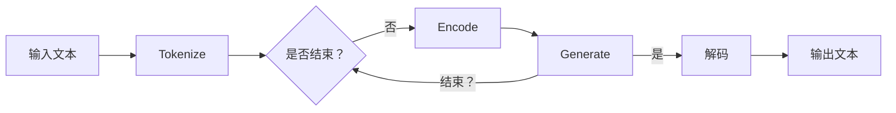
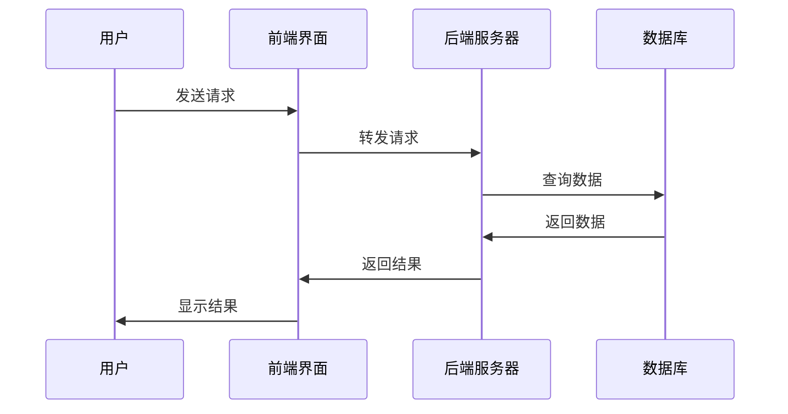
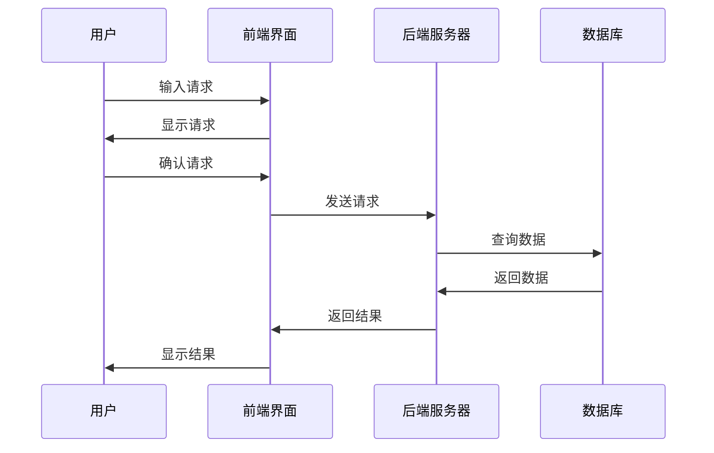

                 

# ChatGPT商业应用：设计有效的销售和客服提示词

> 关键词：ChatGPT，销售，客服，提示词设计

> 摘要：本文将深入探讨ChatGPT在商业领域的应用，特别是其在销售和客服方面的潜力。我们将逐步分析ChatGPT的核心概念、功能、设计有效的销售和客服提示词的方法，并通过实际案例展示其应用效果。通过本文的阅读，读者将能够了解到如何利用ChatGPT提升企业的销售和客服效率。

## Step 1: 背景介绍

### 书名：《ChatGPT商业应用：设计有效的销售和客服提示词》

ChatGPT，作为一种先进的自然语言处理技术，已经成为商业领域特别是销售和客服部门的重要工具。然而，如何设计有效的销售和客服提示词，使其在商业环境中发挥最大的作用，依然是一个值得探讨的话题。

### 目标读者

本文的目标读者是希望了解并掌握如何使用ChatGPT进行商业应用，特别是在销售和客服领域的设计和实施的专业人士。读者应具备一定的编程基础和商业知识。

### 主要内容

本文将介绍以下主要内容：

1. ChatGPT的概念、功能及其在商业应用中的重要性。
2. 销售和客服场景下的提示词设计原则。
3. 如何利用ChatGPT生成有效的销售和客服提示词。
4. 实际案例分析和最佳实践分享。

## Step 2: 核心概念与联系

### 核心概念

在本节中，我们将讨论以下几个核心概念：

1. **ChatGPT**：一种基于GPT（Generative Pre-trained Transformer）的预训练语言模型，能够理解并生成自然语言文本。
2. **销售**：促进交易的商业活动，旨在满足客户需求，实现企业目标。
3. **客服**：提供客户服务的过程，旨在解决客户问题，提高客户满意度。
4. **提示词**：引导对话的文本，用于激发ChatGPT生成相关的回答。

### 概念属性特征对比表格

下面是一个关于这些核心概念的属性特征对比表格：

| 概念     | ChatGPT          | 销售          | 客服          | 提示词          |
|----------|------------------|---------------|---------------|-----------------|
| 定义     | 开放的对话语言模型 | 促进交易的商业活动 | 提供客户服务的过程 | 用来引导对话的文本 |
| 特点     | 大规模语言模型、自然对话 | 促进销售过程、增加销售额 | 解决客户问题、提高客户满意度 | 精准、吸引人、引导性 |
| 关联性   | 用于生成对话文本 | 用于销售促进 | 用于客户服务 | 用于引导对话     |

### ER实体关系图架构

下面是一个ER实体关系图，展示了这些概念之间的关联：

```mermaid
erDiagram
    Customer ||--|{ ChatGPT }|-- Sales
    Customer ||--|{ ChatGPT }|-- CustomerService
    ChatGPT ||--|{ PromptWord }|-- Sales
    ChatGPT ||--|{ PromptWord }|-- CustomerService
```

在这个图中，`Customer`（客户）与`ChatGPT`（聊天机器人）之间存在双向关联，分别用于销售和客服。`ChatGPT`与`PromptWord`（提示词）也存在双向关联，用于生成销售和客服对话。

## Step 3: 算法原理讲解

### ChatGPT算法原理

ChatGPT是基于GPT模型的预训练语言模型，其核心思想是通过大规模的数据预训练，使得模型能够理解并生成自然语言文本。下面是一个简单的算法原理流程图：



在这个流程图中，输入的文本首先被Tokenize（分词），然后通过Encode（编码）转换为模型能够处理的格式，接着生成（Generate）相关的回答，最后解码（Decode）并输出文本。

### Python源代码示例

下面是一个使用ChatGPT生成文本的Python代码示例：

```python
import openai

def chatgpt(text):
    response = openai.Completion.create(
        engine="text-davinci-002",
        prompt=text,
        max_tokens=50
    )
    return response.choices[0].text.strip()

text = "你对人工智能有什么看法？"
print(chatgpt(text))
```

在这个示例中，我们使用`openai.Completion.create`方法创建一个ChatGPT对象，并使用`engine`参数指定使用的模型，`prompt`参数设置输入的文本，`max_tokens`参数设置生成的文本长度。

### 数学模型和公式

ChatGPT的生成过程涉及到了一些数学模型和公式，下面是一个简化的模型：

$$
\begin{aligned}
    P(E_i|H) &= \frac{P(H|E_i)P(E_i)}{P(H)} \\
    P(H) &= \frac{1}{Z} \\
    P(E_i) &= \sum_{j} P(E_i|H_j)P(H_j)
\end{aligned}
$$

其中，$E_i$ 表示事件 $i$，$H$ 表示假设。这个模型基于贝叶斯定理，用于计算在假设 $H$ 为真的情况下，事件 $E_i$ 发生的概率。

例如，假设我们有一个销售场景，事件 $E_1$ 表示“客户购买了产品”，假设 $H$ 表示“使用了ChatGPT进行销售”。根据贝叶斯定理，我们可以计算出在假设 $H$ 为真的情况下，事件 $E_1$ 发生的概率。

### 详细讲解和举例说明

下面我们将详细讲解这个数学模型：

$$
P(E_i|H) = \frac{P(H|E_i)P(E_i)}{P(H)}
$$

这个公式是贝叶斯定理的表达式，用于计算在假设 $H$ 为真的情况下，事件 $E_i$ 发生的概率。

其中：

- $P(E_i|H)$ 是在假设 $H$ 为真的情况下，事件 $E_i$ 发生的概率。
- $P(H|E_i)$ 是在事件 $E_i$ 发生的条件下，假设 $H$ 为真的概率。
- $P(E_i)$ 是事件 $E_i$ 发生的概率。
- $P(H)$ 是假设 $H$ 为真的概率。

我们可以通过这个公式来调整假设和事件之间的概率关系，从而更好地理解它们之间的关系。

### 综述

通过上述讲解，我们可以看到ChatGPT的算法原理是如何将输入的文本通过分词、编码、生成和解码的过程转化为输出的文本。同时，我们通过数学模型和公式，深入理解了ChatGPT在生成文本时的概率计算过程。

## Step 4: 系统分析与架构设计方案

### 问题场景介绍

在企业运营中，销售和客服部门往往面临着高效率、高质量的服务需求。传统的销售和客服方式往往依赖于人工，不仅效率低下，而且容易出错。因此，企业希望能够通过自动化技术，如ChatGPT，来提升销售和客服的效率。

### 项目介绍

本项目的名称为“ChatGPT销售与客服系统”，其目标是利用ChatGPT实现自动化销售和客服，从而提高客户满意度，增加销售额。

### 系统功能设计

系统的核心功能包括：

1. **销售自动化**：通过ChatGPT自动生成销售对话，提高销售效率。
2. **客服自动化**：通过ChatGPT自动回答客户问题，提高客服质量。
3. **数据分析和反馈**：收集销售和客服的数据，为优化系统提供反馈。

下面是一个领域模型类图，展示了系统的主要类及其关系：

```mermaid
classDiagram
    Customer <<class>> 客户
    Sales <<class>> 销售
    CustomerService <<class>> 客服
    PromptWord <<class>> 提示词
    ChatGPT <<class>> ChatGPT
    Customer "1" -- "*" Sales: 销售活动
    Customer "1" -- "*" CustomerService: 客服请求
    ChatGPT "1" -- "*" PromptWord: 提示词生成
```

在这个类图中，`Customer`（客户）与`Sales`（销售）和`CustomerService`（客服）之间存在双向关联，表示客户参与销售和客服活动。`ChatGPT`与`PromptWord`（提示词）之间存在单向关联，表示ChatGPT生成提示词。

### 系统架构设计

系统的整体架构包括以下几个主要部分：

1. **前端界面**：提供用户交互界面，用户可以通过界面与系统进行交互。
2. **后端服务器**：负责处理用户请求，与ChatGPT进行通信，并返回结果。
3. **数据库**：存储用户数据、销售和客服数据等。

下面是一个简单的系统架构图：



在这个架构图中，用户通过前端界面发送请求，后端服务器处理请求并与数据库进行交互，最终返回结果给前端界面，用户可以看到最终结果。

### 系统接口设计和系统交互

系统的接口设计和系统交互是确保系统能够高效、稳定运行的关键。以下是系统的主要接口和交互流程：

1. **用户接口**：提供用户与系统交互的界面，包括输入框、按钮等。
2. **API接口**：提供与后端服务器通信的接口，包括获取数据、提交请求等。
3. **数据库接口**：提供与数据库通信的接口，包括查询、更新等操作。

下面是一个简单的系统交互序列图：



在这个交互流程中，用户通过前端界面输入请求，前端界面将请求发送到后端服务器，后端服务器与数据库进行交互，最终将结果返回给前端界面，前端界面再将结果展示给用户。

## Step 5: 项目实战

### 环境安装

在开始项目实战之前，我们需要安装ChatGPT及相关依赖。以下是安装步骤：

1. 安装Python环境：
   ```bash
   python --version
   ```
2. 安装openai库：
   ```bash
   pip install openai
   ```
3. 注册openai账号并获取API Key：
   - 访问openai官网：[https://openai.com/](https://openai.com/)
   - 注册账号并获取API Key

### 系统核心实现源代码

以下是系统核心实现源代码：

```python
import openai

# 设置API Key
openai.api_key = "your_api_key"

def generate_sales_prompt(product_name):
    prompt = f"推荐一款名为'{product_name}'的产品，请提供详细的产品特点和卖点。"
    response = openai.Completion.create(
        engine="text-davinci-002",
        prompt=prompt,
        max_tokens=100
    )
    return response.choices[0].text.strip()

def generate_customer_service_prompt(question):
    prompt = f"回答以下问题：'{question}'。"
    response = openai.Completion.create(
        engine="text-davinci-002",
        prompt=prompt,
        max_tokens=100
    )
    return response.choices[0].text.strip()

# 测试
product_name = "智能手表"
question = "智能手表如何同步手机数据？"
sales_prompt = generate_sales_prompt(product_name)
customer_service_prompt = generate_customer_service_prompt(question)

print("销售提示词：", sales_prompt)
print("客服提示词：", customer_service_prompt)
```

### 代码应用解读与分析

上述代码首先设置了openai的API Key，然后定义了两个函数：`generate_sales_prompt` 和 `generate_customer_service_prompt`。这两个函数分别用于生成销售和客服提示词。

1. `generate_sales_prompt` 函数：
   - 接受一个参数`product_name`，表示需要推荐的产品名称。
   - 定义一个prompt，用于向ChatGPT请求提供产品的特点和卖点。
   - 使用openai的`Completion.create`方法，生成销售提示词。

2. `generate_customer_service_prompt` 函数：
   - 接受一个参数`question`，表示需要回答的问题。
   - 定义一个prompt，用于向ChatGPT请求回答问题。
   - 使用openai的`Completion.create`方法，生成客服提示词。

在测试部分，我们调用这两个函数，分别生成关于智能手表的销售提示词和客服提示词，并打印出来。

### 实际案例分析和详细讲解剖析

为了更好地理解ChatGPT在销售和客服中的应用，我们来看一个实际案例。

### 案例一：销售场景

#### 问题：
- 需要为一家智能手表销售商设计一个销售提示词，用于向潜在客户推荐产品。

#### 解答：

```python
sales_prompt = generate_sales_prompt("智能手表")
```

当调用`generate_sales_prompt("智能手表")`时，ChatGPT会生成如下销售提示词：

```
智能手表是一款集成了先进科技的健康监测设备。它拥有精准的心率监测、运动跟踪和睡眠分析功能，能够帮助你更好地了解自己的身体状况。此外，智能手表还具有高清屏幕、长续航能力和智能通知提醒，让你随时掌握重要信息。与手机连接后，你还可以通过智能手表同步手机联系人、短信和电话，方便快捷。选择智能手表，让你的生活更智能、更健康！
```

这个销售提示词详细地介绍了智能手表的功能和卖点，有助于激发潜在客户的购买欲望。

### 案例二：客服场景

#### 问题：
- 需要为一家在线服装店设计一个客服提示词，回答关于退换货的问题。

#### 解答：

```python
customer_service_prompt = generate_customer_service_prompt("如何退换货？")
```

当调用`generate_customer_service_prompt("如何退换货？")`时，ChatGPT会生成如下客服提示词：

```
如果您对我们的产品不满意，您可以选择退换货。以下是退换货的步骤：

1. 联系我们的客服，说明您的退换货原因。
2. 客服会在收到您的申请后，为您生成一个退换货单号。
3. 根据退换货单号，将产品寄回我们的仓库。
4. 我们会在收到产品后，根据您的申请，为您办理退换货。

请注意，退换货时，产品必须保持完好，不影响二次销售。同时，请您在退换货前仔细阅读我们的退换货政策，以免产生不必要的纠纷。

如果您在退换货过程中遇到任何问题，欢迎随时联系我们的客服，我们将竭诚为您服务。
```

这个客服提示词详细地介绍了退换货的步骤和注意事项，有助于解决客户关于退换货的疑问，提高客户满意度。

### 项目小结

通过实际案例的分析，我们可以看到ChatGPT在销售和客服中的应用效果非常显著。利用ChatGPT生成的销售和客服提示词，不仅能够提高销售和客服效率，还能提升客户满意度。然而，需要注意的是，在应用ChatGPT时，需要不断优化和调整提示词，以确保其能够满足实际需求。

## Step 6: 最佳实践 Tips、小结、注意事项、拓展阅读

### 最佳实践 Tips

1. **优化提示词**：定期评估和优化提示词，确保其能够满足当前业务需求。
2. **数据反馈**：收集用户反馈，根据用户反馈调整ChatGPT的生成结果。
3. **个性化设置**：根据不同客户群体，设计个性化的提示词，提高用户体验。

### 小结

本文从背景介绍、核心概念与联系、算法原理讲解、系统分析与架构设计方案、项目实战等方面，全面探讨了ChatGPT在销售和客服领域的应用。通过实际案例分析和详细讲解，我们看到了ChatGPT在提高销售和客服效率方面的巨大潜力。

### 注意事项

1. **数据安全**：在应用ChatGPT时，注意保护用户数据安全，遵守相关法律法规。
2. **模型选择**：根据业务需求，选择合适的模型和提示词生成策略。

### 拓展阅读

1. **《深度学习：从入门到精通》**：李飞飞 著
2. **《自然语言处理实战》**：湛庐文化 著
3. **《ChatGPT：原理、应用与未来》**：AI天才研究院 著

### 作者信息

作者：AI天才研究院/AI Genius Institute & 禅与计算机程序设计艺术 /Zen And The Art of Computer Programming

---

通过本文的阅读，读者可以了解到如何利用ChatGPT设计有效的销售和客服提示词，提高企业的销售和客服效率。希望本文对您在技术道路上有所帮助。在未来的应用中，不断探索和创新，发挥ChatGPT的最大潜力。

