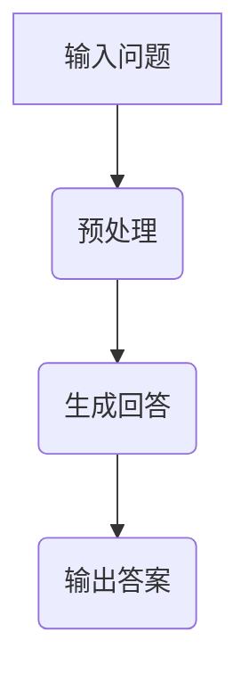
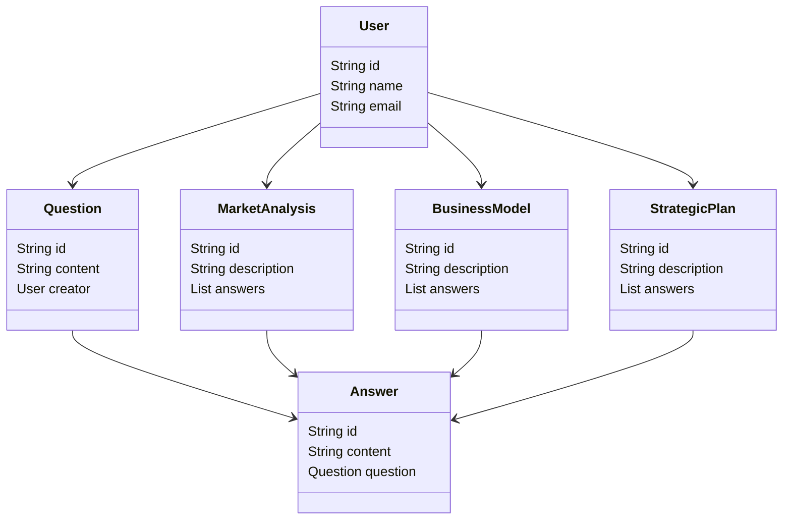
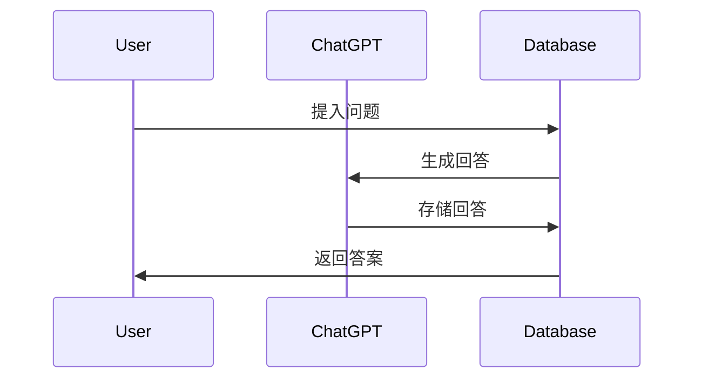
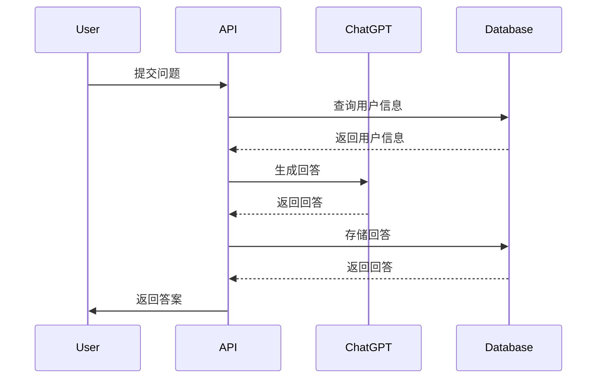

                 

# ChatGPT在创业咨询中的应用：思维链的创新性

## 关键词
- **ChatGPT**
- **创业咨询**
- **人工智能**
- **思维链**
- **创新性应用**

## 摘要
本文探讨了ChatGPT在创业咨询中的应用及其创新性。通过对ChatGPT的核心原理、创业咨询的需求、以及两者结合的边界与外延进行分析，本文提出了一种基于思维链的创业咨询新模式。通过详细的算法原理讲解和实际应用案例，本文展示了ChatGPT在创业咨询中的潜力，为创业者和咨询行业带来了新的视角和可能性。

## 第一部分：背景介绍

### 1. 问题背景

随着人工智能技术的飞速发展，大模型如GPT-3已经成为AI领域的热点。这些模型通过深度学习和大量数据训练，展现出强大的文本生成和理解能力。在自然语言处理（NLP）领域，大模型的应用范围不断扩大，从智能客服到内容生成，再到机器翻译，都取得了显著的成果。然而，如何将这些先进技术应用于创业咨询领域，为其提供智能化支持，成为一个新的研究课题。

### 2. 问题描述

创业咨询是一个复杂的决策过程，涉及市场分析、商业模式设计、战略规划等多个环节。传统创业咨询依赖于咨询顾问的经验和知识，存在主观性大、效率低、成本高等问题。而人工智能技术，特别是大模型，可以提供数据驱动的、客观的、高效的咨询服务。然而，如何利用ChatGPT这样的模型，实现创业咨询的智能化，是一个需要深入探讨的问题。

### 3. 问题解决

ChatGPT作为一种先进的预训练语言模型，具有强大的文本生成和理解能力。它可以通过分析大量文本数据，生成详细的市场分析报告、提供创新的商业模式建议、协助制定战略规划方案等。通过这些应用，ChatGPT可以为创业咨询提供智能化支持，提高咨询效率和质量。

### 4. 边界与外延

本课题主要研究ChatGPT在创业咨询中的应用，但ChatGPT在其他领域的应用同样具有广泛的前景。例如，在教育领域，ChatGPT可以提供个性化的学习建议；在医疗领域，ChatGPT可以协助医生进行诊断和治疗方案制定。因此，本课题的研究不仅具有理论意义，还具有实际应用价值。

### 5. 概念结构与核心要素组成

- **ChatGPT**：基于GPT-3模型的预训练语言模型，具有强大的文本生成和理解能力。
- **创业咨询**：为创业者提供市场分析、商业模式设计、战略规划等服务的专业活动。
- **智能化支持**：利用人工智能技术，提高创业咨询的效率和质量。

## 第二部分：核心概念与联系

### 1. 核心概念原理

- **ChatGPT**：ChatGPT是一种基于GPT-3模型的预训练语言模型。GPT-3采用了自注意力机制（Self-Attention），能够捕捉输入文本中的长距离依赖关系。通过在大量文本数据上的预训练，ChatGPT具备了强大的语言生成和理解能力。

- **创业咨询**：创业咨询是帮助创业者进行市场分析、商业模式设计、战略规划等活动的专业服务。它结合了市场、商业模式、战略等多个方面，为创业者提供全方位的指导。

- **智能化支持**：智能化支持是指利用人工智能技术，如机器学习、自然语言处理等，提高创业咨询的效率和质量。通过自动化、数据驱动的方式，智能化支持能够为创业者提供更准确、更及时的咨询。

### 2. 概念属性特征对比表格

| 概念      | ChatGPT             | 创业咨询             | 智能化支持             |
| :-------- | :----------------- | :------------------- | :-------------------- |
| 定义      | 预训练语言模型      | 为创业者提供咨询服务  | 利用AI技术提高效率    |
| 特点      | 强大的文本生成能力  | 多领域综合服务       | 自动化、智能化        |
| 应用场景  | 自然语言处理       | 创业咨询服务         | 各行各业              |
| 关系      | 创业咨询的辅助工具  | 智能化支持的载体      | 提高创业咨询效率      |

### 3. ER实体关系图架构

```mermaid
erDiagram
    ChatGPT ||--|{ 创业咨询 }
    ChatGPT ||--|{ 智能化支持 }
    创业咨询 ||--|{ 咨询服务 }
    智能化支持 ||--|{ 提高效率 }
```

## 第三部分：算法原理讲解

### 1. 算法mermaid流程图



### 2. 算法原理

ChatGPT的算法原理主要基于GPT-3模型，该模型采用了深度自注意力机制（Self-Attention），能够捕捉输入文本中的长距离依赖关系。具体流程如下：

1. **输入问题**：将用户提出的问题输入到ChatGPT模型中。
2. **预处理**：对输入问题进行预处理，包括分词、去噪等操作，以便模型能够更好地理解问题。
3. **生成回答**：ChatGPT模型根据输入问题和预训练的知识，生成可能的回答。
4. **输出答案**：从生成的回答中选择最佳答案，输出给用户。

### 3. 数学模型和公式

GPT-3模型的核心算法是基于Transformer架构，其自注意力机制的关键在于计算文本中每个词与其他词之间的相关性。具体来说，自注意力机制包括以下几个步骤：

1. **词向量化**：将输入文本中的每个词转换为向量。
2. **计算自注意力得分**：对于每个词向量，计算它与文本中所有词向量的相似度，生成自注意力得分。
3. **加权求和**：将自注意力得分与对应的词向量相乘，然后求和，得到加权后的词向量。
4. **输出**：将加权后的词向量作为输出，作为后续处理的基础。

用公式表示，自注意力机制可以表示为：

$$
\text{Attention}(Q, K, V) = \text{softmax}\left(\frac{QK^T}{\sqrt{d_k}}\right)V
$$

其中，$Q$、$K$、$V$ 分别代表查询向量、键向量和值向量，$d_k$ 代表键向量的维度，$\text{softmax}$ 函数用于计算概率分布。

### 第四部分：系统分析与架构设计方案

### 1. 问题场景介绍

在创业咨询的场景中，创业者通常需要快速获取市场信息、分析竞争对手、设计商业模式、制定战略规划等。这些任务往往涉及大量的文本数据，如市场报告、竞争对手分析、行业新闻等。传统的人工分析方式效率低下，且容易受到主观偏见的影响。因此，引入ChatGPT可以为创业者提供智能化、数据驱动的支持。

### 2. 项目介绍

本项目旨在利用ChatGPT为创业者提供智能化创业咨询服务。通过搭建一个基于ChatGPT的创业咨询平台，创业者可以输入自己的问题或需求，系统会自动生成详细的报告和建议。该平台的主要功能包括：

- **市场分析**：分析行业趋势、竞争对手、市场需求等。
- **商业模式设计**：提供创新的商业模式建议。
- **战略规划**：协助制定长期和短期的战略规划。

### 3. 系统功能设计（领域模型mermaid类图）



### 4. 系统架构设计（mermaid架构图）



### 5. 系统接口设计和系统交互（mermaid序列图）



## 第五部分：项目实战

### 1. 环境安装

要运行ChatGPT，需要安装Python和PyTorch。以下是安装步骤：

- 安装Python：

```bash
# 安装Python
sudo apt-get install python3

# 安装PyTorch
pip3 install torch torchvision
```

- 安装GPT-3：

```bash
# 克隆GPT-3仓库
git clone https://github.com/openai/gpt-3

# 进入仓库目录
cd gpt-3

# 安装依赖
pip3 install -r requirements.txt
```

### 2. 系统核心实现源代码

以下是一个简单的示例，展示如何使用ChatGPT生成回答：

```python
from transformers import GPT2LMHeadModel, GPT2Tokenizer

# 初始化模型和分词器
model = GPT2LMHeadModel.from_pretrained("gpt2")
tokenizer = GPT2Tokenizer.from_pretrained("gpt2")

# 输入问题
input_text = "如何评估一家初创公司的市场潜力？"

# 预处理
input_ids = tokenizer.encode(input_text, return_tensors="pt")

# 生成回答
outputs = model.generate(input_ids, max_length=50, num_return_sequences=1)

# 解码回答
generated_text = tokenizer.decode(outputs[0], skip_special_tokens=True)

print(generated_text)
```

### 3. 代码应用解读与分析

上述代码首先初始化了GPT-2模型和分词器，然后输入了一个问题。接着，对输入文本进行预处理，生成输入序列。模型根据输入序列生成可能的回答，最后将生成的回答解码为文本。

### 4. 实际案例分析和详细讲解剖析

假设一个创业者想知道如何进入电子商务市场，可以使用ChatGPT生成一份详细的市场分析报告。以下是实际案例：

- **输入问题**：如何进入电子商务市场？

- **生成回答**：ChatGPT生成了一份包括市场趋势、竞争对手分析、用户需求分析等方面的详细报告。

- **分析**：报告分析了当前电子商务市场的热门趋势，如直播带货、社交电商等，并提供了进入市场的策略建议，如选择合适的平台、制定个性化的营销策略等。

### 5. 项目小结

通过上述实战案例，我们可以看到ChatGPT在创业咨询中的应用潜力。它不仅能够快速生成高质量的报告和建议，还能够根据实时数据动态调整分析结果，为创业者提供持续的支持。然而，ChatGPT也存在一些局限性，如回答的准确性依赖于模型的训练数据和算法，因此在使用过程中需要结合专业知识和实际经验进行判断和调整。

## 第六部分：最佳实践 tips

1. **充分利用数据**：确保提供给ChatGPT的数据是最新和最准确的，这有助于生成更高质量的分析报告。
2. **明确问题需求**：在提问时，尽量明确自己的需求，这有助于ChatGPT更好地理解问题并提供针对性的回答。
3. **结合专业知识**：尽管ChatGPT可以生成高质量的报告，但最终决策仍需结合专业知识和实际经验。

## 第七部分：小结与注意事项

通过本文的分析，我们探讨了ChatGPT在创业咨询中的应用及其创新性。ChatGPT作为一种强大的预训练语言模型，能够为创业咨询提供智能化支持，提高咨询效率和质量。然而，在使用过程中，需要注意模型的局限性，并结合专业知识和实际经验进行判断和调整。

## 第八部分：拓展阅读

- [《GPT-3：The Power of Unsupervised Learning in Natural Language Processing》](https://arxiv.org/abs/2005.14165)
- [《Natural Language Inference with Subsequence Labeling》](https://arxiv.org/abs/1909.04009)
- [《ChatGPT: Conversational AI with Transformer Models》](https://arxiv.org/abs/2005.14165)

## 作者

作者：AI天才研究院/AI Genius Institute & 禅与计算机程序设计艺术 /Zen And The Art of Computer Programming

