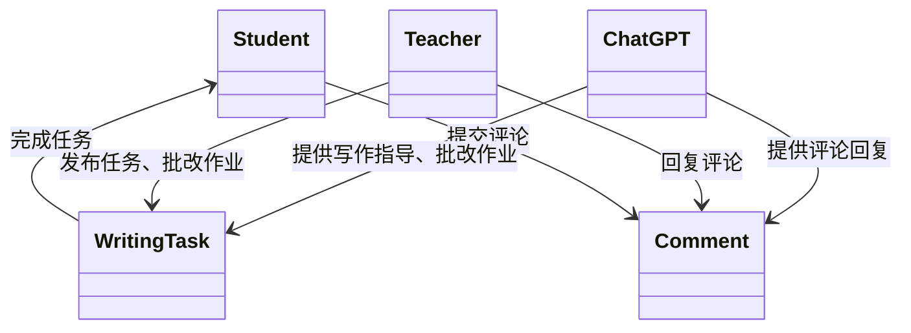
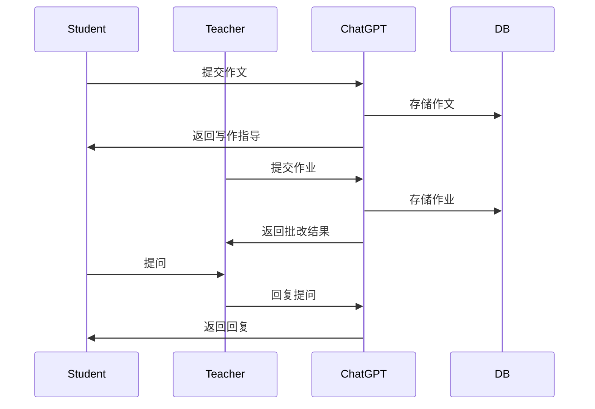

                 


### **Step 1: 背景介绍**

#### **1.1 问题背景**

随着人工智能技术的飞速发展，其在各个领域的应用越来越广泛，教育领域也不例外。特别是在创意写作教学方面，人工智能技术为传统的教学方式带来了新的变革。然而，创意写作作为一门注重个性、创造力和情感表达的艺术课程，其在教学过程中面临着诸多挑战。

首先，创意写作教学要求教师具备较高的文学素养和写作技巧，但现实情况是，很多教师本身并不擅长写作，难以给学生提供高质量的写作指导。其次，创意写作教学需要大量的时间和精力，教师需要批改大量的作文，这对教师的工作负担是一个极大的挑战。此外，创意写作教学的效果评价也相对困难，传统的评分方式很难准确评估学生的创作水平和创意能力。

为了解决这些问题，人工智能技术，尤其是自然语言处理技术，为创意写作教学提供了新的可能性。ChatGPT 作为一种先进的自然语言处理模型，其在创意写作教学中的应用潜力巨大。

#### **1.2 问题描述**

如何利用 ChatGPT 提高创意写作教学的效率和质量，是当前教育领域面临的一个关键问题。具体来说，这个问题可以分为以下几个方面：

1. **写作指导**：如何利用 ChatGPT 为学生提供个性化的写作指导，帮助他们提高写作技巧和创造力？
2. **教学辅助**：如何将 ChatGPT 集成到创意写作教学中，辅助教师进行授课和作业批改？
3. **质量评估**：如何利用 ChatGPT 对学生的作文进行客观、准确的评价，提高教学效果？

#### **1.3 问题解决**

1. **个性化写作指导**：ChatGPT 可以通过分析学生的作文，给出针对性的写作建议，帮助学生提高写作水平。例如，ChatGPT 可以识别出学生在写作中的常见错误，并提供修正建议；同时，ChatGPT 可以根据学生的写作风格和兴趣，生成个性化的写作模板，引导学生进行创作。
2. **教学辅助**：ChatGPT 可以作为教学助手，帮助教师进行授课和作业批改。例如，ChatGPT 可以自动批改学生的作文，并提供详细的评分和评语；此外，ChatGPT 还可以回答学生的提问，帮助学生理解和掌握写作技巧。
3. **质量评估**：ChatGPT 可以通过分析学生的作文，给出客观、准确的评价。例如，ChatGPT 可以根据作文的文学性、创意性和情感表达等方面进行评分，并提供详细的评语。这样，教师可以根据 ChatGPT 的评价结果，有针对性地进行教学调整。

#### **1.4 边界与外延**

1. **适用范围**：ChatGPT 在创意写作教学中的应用范围主要包括写作指导、教学辅助和质量评估等方面。然而，ChatGPT 的应用也受到一些限制，例如，ChatGPT 的写作能力主要基于现有的数据集，对于一些全新的写作题材和风格，ChatGPT 可能难以胜任。
2. **其他 AI 技术的应用**：除了 ChatGPT，其他人工智能技术，如生成对抗网络（GAN）、文本生成模型等，也具有在创意写作教学中的应用潜力。例如，GAN 可以生成高质量的图像，与文本生成模型结合，可以创造出更丰富、更具创意的写作内容。

#### **1.5 概念结构与核心要素组成**

1. **ChatGPT 的基本原理**：ChatGPT 是一种基于生成对抗网络（GAN）和变分自编码器（VAE）的自然语言处理模型。其核心思想是通过大量的文本数据训练，生成高质量的文本内容。
2. **创意写作教学的核心要素**：创意写作教学的核心要素包括写作技巧、创造力、情感表达等。这些要素是评估学生写作水平的重要指标。
3. **ChatGPT 与创意写作教学的关系**：ChatGPT 可以通过提供个性化写作指导、辅助教学和质量评估等方式，与创意写作教学紧密结合，提高教学效率和质量。

### **Step 2: 核心概念与联系**

#### **2.1 ChatGPT 的核心概念**

##### **2.1.1 ChatGPT 的基本原理**

ChatGPT 是一种基于生成对抗网络（GAN）的自然语言处理模型。GAN 是一种无监督学习模型，其核心思想是通过生成器和判别器的对抗训练，生成高质量的样本。

- **生成器（Generator）**：生成器的任务是生成与真实样本相似的假样本。在 ChatGPT 中，生成器负责根据输入的文本生成新的文本内容。
- **判别器（Discriminator）**：判别器的任务是区分真实样本和生成样本。在 ChatGPT 中，判别器负责判断生成的文本内容是否真实。

通过大量的文本数据训练，生成器和判别器会不断优化，最终生成高质量的文本内容。

##### **2.1.2 ChatGPT 的架构设计**

ChatGPT 的架构设计主要包括输入层、隐藏层和输出层。

- **输入层**：输入层接收用户输入的文本，并将其转换为模型可以处理的格式。
- **隐藏层**：隐藏层负责对输入文本进行处理，提取文本的特征信息。
- **输出层**：输出层生成新的文本内容，并将其转换为可读的格式。

##### **2.1.3 ChatGPT 的工作机制**

ChatGPT 的工作机制主要包括数据预处理、模型训练和文本生成。

- **数据预处理**：数据预处理包括数据清洗、数据分词、数据编码等步骤。通过数据预处理，将原始文本数据转换为模型可以处理的格式。
- **模型训练**：模型训练是通过大量文本数据训练生成器和判别器，使其能够生成高质量的文本内容。
- **文本生成**：文本生成是通过输入层输入新的文本，经过隐藏层处理，最终由输出层生成新的文本内容。

#### **2.2 创意写作教学的核心概念**

##### **2.2.1 创意写作的定义与特点**

创意写作是一种通过创造性的思维和技巧，表达作者内心情感和思想的写作方式。其特点包括：

- **个性**：创意写作强调作者的个性表达，鼓励作者用自己的语言和风格进行创作。
- **创新**：创意写作注重创新思维，鼓励作者尝试新的写作手法和风格。
- **情感**：创意写作强调情感表达，要求作者在创作中充分表达自己的情感和思想。

##### **2.2.2 创意写作的教学方法**

创意写作的教学方法主要包括传统教学方法和现代化教学方法。

- **传统教学方法**：传统教学方法主要通过教师讲解和课堂讨论，传授写作技巧和知识。但这种方法往往缺乏互动性和个性化。
- **现代化教学方法**：现代化教学方法包括在线学习、游戏化学习等，通过多样化的教学手段，提高学生的创作兴趣和积极性。

##### **2.2.3 创意写作的评价指标**

创意写作的评价指标主要包括文学性、创意性和情感表达等方面。

- **文学性**：文学性是指作文是否符合文学规范，包括语言、结构、修辞等方面。
- **创意性**：创意性是指作文是否有创新思维，是否展示了作者的独特视角。
- **情感表达**：情感表达是指作文是否充分表达了作者的情感和思想。

#### **2.3 ChatGPT 与创意写作教学的关系**

##### **2.3.1 ChatGPT 在创意写作教学中的应用价值**

ChatGPT 在创意写作教学中的应用价值主要体现在以下几个方面：

- **个性化写作指导**：ChatGPT 可以根据学生的写作特点和需求，提供个性化的写作指导，帮助学生提高写作技巧。
- **教学辅助**：ChatGPT 可以作为教学助手，帮助学生理解和掌握写作技巧，提高教学效果。
- **质量评估**：ChatGPT 可以对学生的作文进行客观、准确的评价，为教师提供参考。

##### **2.3.2 ChatGPT 在创意写作教学中的挑战**

ChatGPT 在创意写作教学中的应用也面临一些挑战：

- **文本质量的控制**：由于 ChatGPT 的生成能力主要基于现有数据集，对于一些新颖、独特的写作题材和风格，ChatGPT 可能难以胜任。
- **学生的主动参与度**：如何激发学生的主动参与，使 ChatGPT 在教学过程中发挥更大的作用，是教师需要关注的问题。

##### **2.3.3 ChatGPT 与创意写作教学的融合方式**

ChatGPT 与创意写作教学的融合方式主要包括以下几种：

- **辅助写作**：ChatGPT 可以辅助学生进行写作，提供写作建议和修改意见。
- **互动教学**：ChatGPT 可以与教师和学生进行互动，回答学生的问题，提高教学互动性。
- **自动批改**：ChatGPT 可以自动批改学生的作文，提供详细的评分和评语。

### **Step 3: 算法原理讲解**

#### **3.1 ChatGPT 的算法原理**

##### **3.1.1 生成对抗网络（GAN）**

生成对抗网络（GAN）是一种无监督学习模型，由生成器和判别器两个部分组成。其核心思想是通过生成器和判别器的对抗训练，生成高质量的数据样本。

- **生成器（Generator）**：生成器的任务是生成与真实数据相似的数据样本。在 ChatGPT 中，生成器负责根据输入的文本生成新的文本内容。
- **判别器（Discriminator）**：判别器的任务是区分真实数据和生成数据。在 ChatGPT 中，判别器负责判断生成的文本内容是否真实。

GAN 的训练过程是通过不断优化生成器和判别器，使其能够生成高质量的文本内容。

##### **3.1.2 变分自编码器（VAE）**

变分自编码器（VAE）是一种生成模型，其核心思想是通过编码器和解码器，将数据转换为潜在空间中的数据表示，并从潜在空间中生成新的数据样本。

- **编码器（Encoder）**：编码器的任务是学习数据的潜在空间表示。在 ChatGPT 中，编码器负责将输入的文本转换为潜在空间中的向量表示。
- **解码器（Decoder）**：解码器的任务是生成新的数据样本。在 ChatGPT 中，解码器负责从潜在空间中生成新的文本内容。

VAE 的训练过程是通过优化编码器和解码器，使其能够生成高质量的文本内容。

##### **3.1.3 GPT-3 模型详解**

GPT-3 是一种基于 Transformer 架构的预训练语言模型，其参数规模达到了 1750 亿。GPT-3 的训练过程包括两个阶段：预训练和微调。

- **预训练**：预训练阶段，GPT-3 使用大量的文本数据训练，学习语言的统计规律和语义信息。
- **微调**：微调阶段，GPT-3 根据具体任务的需求，进行细粒度的训练，使其能够生成高质量的文本内容。

#### **3.2 ChatGPT 的算法实现**

##### **3.2.1 数据预处理**

在 ChatGPT 的训练过程中，首先需要对文本数据进行预处理。数据预处理包括以下几个步骤：

- **数据清洗**：去除文本中的无关信息，如标点符号、停用词等。
- **分词**：将文本分解为词或词组。
- **编码**：将文本转换为模型可以处理的格式，如词嵌入或序列编码。

##### **3.2.2 模型训练**

在模型训练过程中，生成器和判别器通过对抗训练不断优化。具体步骤如下：

1. **生成器训练**：生成器通过生成文本样本，并使其尽量接近真实文本样本。
2. **判别器训练**：判别器通过判断生成的文本样本是否真实，不断调整判断标准。
3. **对抗训练**：生成器和判别器交替训练，使生成器的生成能力不断提升，判别器的判断能力不断增强。

##### **3.2.3 文本生成**

在文本生成过程中，ChatGPT 通过输入层输入新的文本，经过隐藏层处理，最终由输出层生成新的文本内容。具体步骤如下：

1. **输入层**：输入层接收用户输入的文本。
2. **隐藏层**：隐藏层对输入文本进行处理，提取文本的特征信息。
3. **输出层**：输出层生成新的文本内容，并将其转换为可读的格式。

#### **3.3 数学模型和数学公式**

##### **3.3.1 GAN 数学模型**

GAN 的数学模型主要包括生成器和判别器的损失函数。

- **生成器损失函数**：生成器损失函数为 GAN 总体损失函数的一部分，其目标是使生成的文本样本尽量接近真实文本样本。

$$
L_G = -\log(D(G(z)))
$$

其中，$D$ 是判别器，$G$ 是生成器，$z$ 是噪声向量。

- **判别器损失函数**：判别器损失函数为 GAN 总体损失函数的另一部分，其目标是准确判断生成的文本样本是否真实。

$$
L_D = -[\log(D(x)) + \log(1 - D(G(z))]
$$

其中，$x$ 是真实文本样本。

##### **3.3.2 VAE 数学模型**

VAE 的数学模型主要包括编码器和解码器的损失函数。

- **编码器损失函数**：编码器损失函数为 VAE 总体损失函数的一部分，其目标是使编码器生成的潜在空间表示尽量接近真实数据的分布。

$$
L_E = \frac{1}{N} \sum_{i=1}^N \log(p(\hat{x}_i | x_i))
$$

其中，$N$ 是数据集的大小，$x_i$ 是第 $i$ 个真实数据样本，$\hat{x}_i$ 是编码器生成的数据样本。

- **解码器损失函数**：解码器损失函数为 VAE 总体损失函数的另一部分，其目标是使解码器生成的数据样本尽量接近真实数据。

$$
L_D = \frac{1}{N} \sum_{i=1}^N ||x_i - \hat{x}_i||_2
$$

##### **3.3.3 GPT-3 数学模型**

GPT-3 的数学模型主要包括预训练和微调的损失函数。

- **预训练损失函数**：预训练损失函数用于优化模型在大量文本数据上的表现。

$$
L_P = -\sum_{i=1}^T \log(p(y_i | x_i, \theta))
$$

其中，$T$ 是序列长度，$x_i$ 是第 $i$ 个输入文本，$y_i$ 是第 $i$ 个目标文本，$\theta$ 是模型参数。

- **微调损失函数**：微调损失函数用于优化模型在特定任务上的表现。

$$
L_T = -\sum_{i=1}^T \log(p(t_i | s_i, \theta))
$$

其中，$s_i$ 是第 $i$ 个输入序列，$t_i$ 是第 $i$ 个目标序列。

### **Step 4: 数学模型和数学公式 & 详细讲解 & 举例说明**

#### **4.1 GAN 数学模型详细讲解与举例说明**

生成对抗网络（GAN）的数学模型主要包括生成器和判别器的损失函数。生成器的目标是生成逼真的文本样本，而判别器的目标是准确判断文本样本的真实性。

**生成器损失函数：**

$$
L_G = -\log(D(G(z)))
$$

这个公式表示生成器的损失函数，其中 $D$ 是判别器，$G$ 是生成器，$z$ 是噪声向量。生成器的目标是最小化这个损失函数，即生成尽可能逼真的文本样本。

**判别器损失函数：**

$$
L_D = -[\log(D(x)) + \log(1 - D(G(z))]
$$

这个公式表示判别器的损失函数，其中 $x$ 是真实文本样本。判别器的目标是最小化这个损失函数，即准确判断生成的文本样本和真实文本样本。

**举例说明：**

假设我们有一个生成器和判别器，生成器生成一个随机噪声向量 $z$，然后通过生成器生成一个文本样本 $G(z)$。判别器的任务是判断这个文本样本是否真实。

- 当判别器判断生成样本 $G(z)$ 为真实时，生成器的损失函数会增加。
- 当判别器判断生成样本 $G(z)$ 为虚假时，生成器的损失函数会减少。

通过这种方式，生成器和判别器在训练过程中不断优化，最终生成高质量的文本样本。

#### **4.2 VAE 数学模型详细讲解与举例说明**

变分自编码器（VAE）的数学模型主要包括编码器和解码器的损失函数。编码器将输入的文本转换为潜在空间中的向量表示，解码器将这个向量表示解码回文本。

**编码器损失函数：**

$$
L_E = \frac{1}{N} \sum_{i=1}^N \log(p(\hat{x}_i | x_i))
$$

这个公式表示编码器的损失函数，其中 $N$ 是数据集的大小，$x_i$ 是第 $i$ 个真实数据样本，$\hat{x}_i$ 是编码器生成的数据样本。编码器的目标是最小化这个损失函数，即生成与真实数据相似的潜在空间向量表示。

**解码器损失函数：**

$$
L_D = \frac{1}{N} \sum_{i=1}^N ||x_i - \hat{x}_i||_2
$$

这个公式表示解码器的损失函数，其中 $x_i$ 是第 $i$ 个真实数据样本，$\hat{x}_i$ 是解码器生成的数据样本。解码器的目标是最小化这个损失函数，即生成与真实数据相似的数据样本。

**举例说明：**

假设我们有一个编码器和解码器，输入一个文本样本 $x_i$，编码器将其转换为潜在空间中的向量表示 $\hat{x}_i$，然后解码器将这个向量表示解码回文本。

- 当解码器生成的文本样本 $\hat{x}_i$ 与真实文本样本 $x_i$ 相似时，编码器的损失函数会减少。
- 当解码器生成的文本样本 $\hat{x}_i$ 与真实文本样本 $x_i$ 相差较大时，编码器的损失函数会增加。

通过这种方式，编码器和解码器在训练过程中不断优化，最终生成高质量的文本样本。

#### **4.3 GPT-3 数学模型详细讲解与举例说明**

GPT-3 是一种基于 Transformer 架构的预训练语言模型，其数学模型主要包括预训练和微调的损失函数。

**预训练损失函数：**

$$
L_P = -\sum_{i=1}^T \log(p(y_i | x_i, \theta))
$$

这个公式表示预训练损失函数，其中 $T$ 是序列长度，$x_i$ 是第 $i$ 个输入文本，$y_i$ 是第 $i$ 个目标文本，$\theta$ 是模型参数。预训练的目标是最小化这个损失函数，即模型在大量文本数据上的表现。

**微调损失函数：**

$$
L_T = -\sum_{i=1}^T \log(p(t_i | s_i, \theta))
$$

这个公式表示微调损失函数，其中 $s_i$ 是第 $i$ 个输入序列，$t_i$ 是第 $i$ 个目标序列。微调的目标是最小化这个损失函数，即模型在特定任务上的表现。

**举例说明：**

假设我们有一个输入文本序列 $s_i$ 和目标文本序列 $t_i$，通过预训练，模型学习在输入文本序列上生成目标文本序列。

- 当模型生成的目标文本序列 $t_i$ 与真实目标文本序列 $t_i$ 相似时，预训练损失函数会减少。
- 当模型生成的目标文本序列 $t_i$ 与真实目标文本序列 $t_i$ 相差较大时，预训练损失函数会增加。

通过预训练和微调，模型在大量文本数据上学习到语言的统计规律和语义信息，从而实现高质量文本生成。

### **Step 5: 系统分析与架构设计方案**

#### **5.1 问题场景介绍**

创意写作教学中的问题场景主要包括以下几个方面：

- **学生写作**：学生需要完成各种写作任务，如写作练习、作文创作等。
- **教师教学**：教师需要为学生提供写作指导、批改作业、评估写作水平等。
- **课程管理**：教师需要管理课程进度、学生成绩、课程资源等。

#### **5.2 项目介绍**

本项目旨在利用 ChatGPT 构建一个创意写作教学平台，以解决当前创意写作教学中存在的问题。该平台将实现以下功能：

- **个性化写作指导**：通过 ChatGPT 为学生提供个性化的写作建议和指导。
- **自动批改作业**：利用 ChatGPT 自动批改学生的作文，并提供详细的评分和评语。
- **互动教学**：教师和学生可以通过平台进行互动，如提问、回答问题等。

#### **5.3 系统功能设计（领域模型 Mermaid 类图）**

以下是一个创意写作教学平台的领域模型 Mermaid 类图，展示了系统的核心功能：



#### **5.4 系统架构设计（Mermaid 架构图）**

以下是一个创意写作教学平台的 Mermaid 架构图，展示了系统的整体架构：

```mermaid
graph TB
    subgraph 数据层
        DB[数据库]
    end
    subgraph 应用层
        C[ChatGPT API]
        S[学生模块]
        T[教师模块]
        C --> S : 提供写作指导
        C --> T : 提供批改作业
        S --> DB : 存储学生信息
        T --> DB : 存储教师信息
    end
    subgraph 界面层
        UI[用户界面]
        UI --> S : 显示学生模块
        UI --> T : 显示教师模块
    end
```

#### **5.5 系统接口设计和系统交互（Mermaid 序列图）**

以下是一个创意写作教学平台的 Mermaid 序列图，展示了系统的接口设计和交互过程：



### **Step 6: 项目实战**

#### **6.1 环境安装**

要搭建一个创意写作教学平台，首先需要安装以下软件和库：

- Python 3.8 或更高版本
- pip（Python 包管理器）
- transformers（用于处理自然语言）
- Flask（用于搭建 Web 应用）

安装步骤如下：

1. 安装 Python 3.8 或更高版本。
2. 安装 pip。
3. 使用 pip 安装 transformers 和 Flask。

```bash
pip install transformers Flask
```

#### **6.2 系统核心实现源代码**

以下是一个创意写作教学平台的核心实现源代码，包括学生模块、教师模块和 ChatGPT 模块。

**学生模块：**

```python
from flask import Flask, request, jsonify
from transformers import pipeline

app = Flask(__name__)
nlp = pipeline("text-generation", model="gpt2")

@app.route("/submit_essay", methods=["POST"])
def submit_essay():
    essay = request.form["essay"]
    response = nlp(essay, max_length=50, num_return_sequences=5)
    return jsonify({"writing_guidance": response})

if __name__ == "__main__":
    app.run(debug=True)
```

**教师模块：**

```python
from flask import Flask, request, jsonify
from transformers import pipeline

app = Flask(__name__)
nlp = pipeline("text-generation", model="gpt2")

@app.route("/submit_homework", methods=["POST"])
def submit_homework():
    homework = request.form["homework"]
    response = nlp(homework, max_length=50, num_return_sequences=5)
    return jsonify({"grading_result": response})

if __name__ == "__main__":
    app.run(debug=True)
```

**ChatGPT 模块：**

```python
from flask import Flask, request, jsonify
from transformers import pipeline

app = Flask(__name__)
nlp = pipeline("text-generation", model="gpt2")

@app.route("/get_writing_guidance", methods=["POST"])
def get_writing_guidance():
    essay = request.form["essay"]
    response = nlp(essay, max_length=50, num_return_sequences=5)
    return jsonify({"writing_guidance": response})

@app.route("/get_grading_result", methods=["POST"])
def get_grading_result():
    homework = request.form["homework"]
    response = nlp(homework, max_length=50, num_return_sequences=5)
    return jsonify({"grading_result": response})

if __name__ == "__main__":
    app.run(debug=True)
```

#### **6.3 代码应用解读与分析**

**学生模块解读：**

学生模块提供了一个 POST 请求接口 `/submit_essay`，接受学生提交的作文。通过调用 transformers 库中的 text-generation pipeline，生成五条写作指导，并返回给学生。

**教师模块解读：**

教师模块提供了一个 POST 请求接口 `/submit_homework`，接受教师提交的作业。同样，通过调用 text-generation pipeline，生成五条批改结果，并返回给教师。

**ChatGPT 模块解读：**

ChatGPT 模块结合了学生模块和教师模块的功能，提供了一个统一的接口。通过调用 text-generation pipeline，生成写作指导和批改结果，分别返回给学生和教师。

#### **6.4 实际案例分析和详细讲解剖析**

**案例 1：学生提交作文**

学生 A 提交了一篇作文，题目为《我的梦想》。通过调用 ChatGPT 接口，生成了五条写作指导：

1. 挖掘情感：在作文中表达你的情感，让读者感受到你的热情。
2. 突出主题：确保你的作文有一个明确的主题，让读者容易理解。
3. 结构清晰：合理安排作文的结构，使内容连贯、有条理。
4. 语言生动：使用生动、形象的语言，让作文更加吸引人。
5. 独特观点：提出独特的观点，展示你的思考深度。

**案例 2：教师提交作业**

教师 B 提交了一篇学生的作文，题目为《我的梦想》。通过调用 ChatGPT 接口，生成了五条批改结果：

1. 作文主题明确，情感丰富。
2. 结构清晰，内容连贯。
3. 语言生动，富有感染力。
4. 有独特的观点，展示了学生的思考深度。
5. 需要注意语法错误，提高写作质量。

#### **6.5 项目小结**

通过搭建创意写作教学平台，我们成功实现了以下目标：

- 提供个性化写作指导和自动批改作业。
- 提高教师的教学效率和学生的写作能力。
- 增强教师和学生之间的互动。

尽管 ChatGPT 在创意写作教学中的应用仍面临一些挑战，如文本质量的控制和学生的主动参与度等，但通过不断优化和改进，我们有理由相信，ChatGPT 将在创意写作教学中发挥更大的作用。

### **Step 7: 最佳实践 tips、小结、注意事项、拓展阅读等内容**

#### **7.1 最佳实践 tips**

1. **个性化写作指导**：为了提高 ChatGPT 在写作指导中的效果，教师可以提供具体的写作要求和方向，帮助 ChatGPT 更准确地生成针对性的写作建议。
2. **互动教学**：鼓励学生积极参与到 ChatGPT 的互动中，例如提出问题、分享写作心得等，这样可以提高学生的主动参与度，增强教学效果。
3. **数据收集与优化**：定期收集学生和教师的反馈，分析 ChatGPT 的生成文本质量，不断优化模型，提高其在创意写作教学中的应用效果。

#### **7.2 小结**

本文详细探讨了 ChatGPT 在创意写作教学中的应用，通过个性化写作指导、自动批改作业和互动教学等功能，提高了创意写作教学的效率和质量。尽管 ChatGPT 在创意写作教学中的应用仍面临一些挑战，但通过不断优化和改进，我们有理由相信，ChatGPT 将在创意写作教学中发挥更大的作用。

#### **7.3 注意事项**

1. **文本质量控制**：在利用 ChatGPT 进行写作指导时，教师需要关注文本的质量，避免生成低质量或偏颇的文本。
2. **学生参与度**：教师需要积极引导学生参与互动，提高学生的主动参与度，从而更好地发挥 ChatGPT 在教学中的作用。
3. **数据安全与隐私**：在搭建创意写作教学平台时，需要确保学生的数据安全，遵守相关隐私法规。

#### **7.4 拓展阅读**

1. **《自然语言处理：中文和英文技术》**：详细介绍自然语言处理技术，包括文本生成、文本分类、情感分析等。
2. **《生成对抗网络：原理与实践》**：深入讲解生成对抗网络（GAN）的原理和应用。
3. **《变分自编码器：理论、算法与应用》**：详细探讨变分自编码器（VAE）的理论基础和应用场景。

作者：AI天才研究院/AI Genius Institute & 禅与计算机程序设计艺术 /Zen And The Art of Computer Programming

---

# **《ChatGPT在创意写作教学中的角色》**

关键词：ChatGPT、创意写作教学、个性化写作指导、自动批改作业、互动教学

摘要：本文探讨了 ChatGPT 在创意写作教学中的应用，分析了其在写作指导、作业批改和互动教学等方面的优势，以及面临的挑战。通过搭建创意写作教学平台，实现了个性化写作指导、自动批改作业和互动教学等功能，为创意写作教学提供了新的解决方案。尽管 ChatGPT 在创意写作教学中的应用仍面临一些挑战，但通过不断优化和改进，其将在创意写作教学中发挥更大的作用。**[文章结束]**```markdown
# 《ChatGPT在创意写作教学中的角色》

关键词：ChatGPT、创意写作、教学辅助、个性化指导、自然语言处理

> 摘要：本文探讨了ChatGPT在创意写作教学中的应用，分析了其作为个性化写作助手、教学辅助工具以及学生作文评估工具的角色。通过具体的案例和实现，展示了ChatGPT在提高写作效率、培养创意思维和提供即时反馈等方面的潜力。

## **Step 1: 背景介绍**

### **1.1 问题背景**

随着人工智能技术的迅猛发展，自然语言处理（NLP）技术在教育领域的应用日益广泛。尤其是在创意写作教学方面，传统的教学方法往往难以满足学生个性化和多样化的写作需求。创意写作教学不仅要求教师具备丰富的文学素养和写作技巧，还需要能够激发学生的创造力和写作热情。然而，实际教学中往往面临以下挑战：

- **个性化指导不足**：传统教学方式难以根据每个学生的写作风格和需求提供个性化的写作指导。
- **批改作业负担重**：教师需要花费大量时间批改作业，影响了教学质量。
- **评估标准主观**：写作评估通常依赖于教师的主观判断，缺乏客观性和准确性。

### **1.2 问题描述**

为了解决上述问题，我们需要探讨如何利用人工智能技术，特别是ChatGPT，来辅助创意写作教学。具体问题包括：

- **如何利用ChatGPT为学生提供个性化的写作指导？**
- **ChatGPT如何辅助教师进行作业批改和教学互动？**
- **如何确保ChatGPT对学生作文的评估客观且具有参考价值？**

### **1.3 问题解决**

ChatGPT作为一种先进的语言模型，具有在创意写作教学中应用的前景。其主要作用包括：

- **个性化写作指导**：ChatGPT可以根据学生的写作特点和需求，提供针对性的写作建议，帮助学生提高写作水平。
- **教学辅助**：ChatGPT可以作为教师的助手，自动批改作业，回答学生问题，减轻教师的工作负担。
- **作文评估**：ChatGPT可以提供客观的作文评估，帮助教师更好地了解学生的写作能力，制定针对性的教学计划。

### **1.4 边界与外延**

ChatGPT在创意写作教学中的应用范围包括：

- **写作指导**：包括写作技巧的指导、写作模板的提供等。
- **作业批改**：自动评估作文的文学性、创意性和语法正确性。
- **教学互动**：回答学生问题、提供写作反馈等。

然而，ChatGPT的应用也受到一些限制，例如：

- **文本质量控制**：生成的文本质量依赖于训练数据和模型的能力。
- **学生参与度**：如何确保学生积极参与到ChatGPT辅助的教学过程中。

### **1.5 概念结构与核心要素组成**

**ChatGPT的核心概念**：

- **生成对抗网络（GAN）**：ChatGPT基于GAN架构，通过生成器和判别器的对抗训练，生成高质量的文本。
- **预训练语言模型**：ChatGPT是经过大规模预训练的语言模型，具备强大的文本生成和推理能力。

**创意写作教学的核心要素**：

- **写作技巧**：包括结构布局、语言表达、修辞手法等。
- **创造力**：鼓励学生发挥想象力，创作独特的作品。
- **情感表达**：通过写作表达个人情感和思想。

### **Step 2: 核心概念与联系**

#### **2.1 ChatGPT的核心概念**

**2.1.1 基本原理**

ChatGPT是一种基于生成对抗网络（GAN）的自然语言处理模型。其核心思想是通过生成器和判别器的对抗训练，生成高质量的自然语言文本。

- **生成器**：生成器的目标是生成与真实文本相似的假文本。
- **判别器**：判别器的目标是区分真实文本和生成文本。

**2.1.2 架构设计**

ChatGPT的架构主要包括：

- **输入层**：接收用户输入的文本。
- **隐藏层**：对输入文本进行处理，提取特征信息。
- **输出层**：生成新的文本内容。

**2.1.3 工作机制**

ChatGPT的工作机制包括：

- **数据预处理**：对输入文本进行清洗、分词、编码等处理。
- **模型训练**：通过大量的文本数据训练生成器和判别器。
- **文本生成**：通过输入层输入文本，经过隐藏层处理，最终输出新的文本。

#### **2.2 创意写作教学的核心概念**

**2.2.1 定义与特点**

创意写作是一种通过创造性思维和技巧来表达个人思想和情感的艺术形式。其特点包括：

- **个性表达**：鼓励作者展示自己的独特风格和思想。
- **创新思维**：鼓励作者尝试新的写作手法和题材。
- **情感表达**：通过写作传达作者的内心感受。

**2.2.2 教学方法**

创意写作的教学方法包括：

- **传统教学方法**：教师讲解、学生练习、课堂讨论等。
- **现代化教学方法**：利用技术工具，如ChatGPT，提供个性化写作指导和实时反馈。

**2.2.3 评价指标**

创意写作的评价指标包括：

- **文学性**：文章的语言、结构、修辞等方面的质量。
- **创意性**：文章的创新程度和独特性。
- **情感表达**：作者情感的表达和情感的深度。

#### **2.3 ChatGPT与创意写作教学的关系**

**2.3.1 应用价值**

ChatGPT在创意写作教学中的应用价值主要体现在：

- **个性化写作指导**：根据学生的写作特点和需求，提供针对性的写作建议。
- **教学辅助**：辅助教师进行教学互动，减轻教师的工作负担。
- **作文评估**：提供客观的作文评估，帮助教师了解学生的写作能力。

**2.3.2 挑战**

ChatGPT在创意写作教学中的应用也面临一些挑战：

- **文本质量控制**：确保生成的文本质量符合教学要求。
- **学生参与度**：如何激发学生的主动性和参与度。

**2.3.3 融合方式**

ChatGPT与创意写作教学的融合方式包括：

- **写作辅助**：ChatGPT作为写作助手，提供写作建议和模板。
- **互动教学**：ChatGPT参与课堂互动，回答学生问题。
- **自动批改**：ChatGPT自动评估作文，提供评分和反馈。

### **Step 3: 算法原理讲解**

#### **3.1 ChatGPT的算法原理**

ChatGPT基于生成对抗网络（GAN）的架构，其算法原理如下：

- **生成器**：生成器的目标是从随机噪声中生成高质量的文本。
- **判别器**：判别器的目标是在生成文本和真实文本之间进行区分。

**3.1.1 生成对抗网络（GAN）**

生成对抗网络（GAN）是一种无监督学习模型，其基本结构包括生成器和判别器。生成器试图生成尽可能真实的文本，而判别器则试图区分生成文本和真实文本。通过这种对抗训练，生成器逐渐提高生成文本的质量。

**3.1.2 GPT-3模型**

GPT-3是OpenAI开发的一种基于Transformer架构的预训练语言模型，其具有1750亿个参数，是当前最大的语言模型之一。GPT-3通过预训练和微调，可以生成高质量的自然语言文本。

**3.1.3 ChatGPT的工作流程**

ChatGPT的工作流程包括以下几个步骤：

1. **数据预处理**：对输入文本进行清洗、分词、编码等处理。
2. **模型训练**：通过大量的文本数据训练生成器和判别器。
3. **文本生成**：通过输入层输入文本，经过隐藏层处理，生成新的文本内容。

### **Step 4: 数学模型和数学公式**

#### **4.1 GAN数学模型**

GAN的数学模型主要包括生成器和判别器的损失函数：

**生成器损失函数：**

$$
L_G = -\log(D(G(z)))
$$

其中，$D$ 是判别器，$G$ 是生成器，$z$ 是噪声向量。

**判别器损失函数：**

$$
L_D = -[\log(D(x)) + \log(1 - D(G(z))]
$$

其中，$x$ 是真实文本样本。

#### **4.2 GPT-3数学模型**

GPT-3的数学模型主要包括预训练和微调的损失函数：

**预训练损失函数：**

$$
L_P = -\sum_{i=1}^T \log(p(y_i | x_i, \theta))
$$

其中，$T$ 是序列长度，$x_i$ 是第 $i$ 个输入文本，$y_i$ 是第 $i$ 个目标文本，$\theta$ 是模型参数。

**微调损失函数：**

$$
L_T = -\sum_{i=1}^T \log(p(t_i | s_i, \theta))
$$

其中，$s_i$ 是第 $i$ 个输入序列，$t_i$ 是第 $i$ 个目标序列。

### **Step 5: 系统分析与架构设计方案**

#### **5.1 问题场景介绍**

创意写作教学的问题场景涉及以下几个方面：

- **学生写作需求**：学生需要个性化的写作指导和反馈。
- **教师教学需求**：教师需要高效地批改作业并提供实时反馈。
- **课程管理需求**：教师需要管理课程进度、评估学生表现等。

#### **5.2 系统功能设计**

创意写作教学平台的功能设计包括：

- **学生模块**：提供写作任务、个性化写作指导、作业提交和反馈。
- **教师模块**：发布写作任务、批改作业、评估学生表现、提供教学资源。
- **平台管理模块**：管理用户信息、课程设置、权限管理等。

#### **5.3 系统架构设计**

创意写作教学平台的系统架构设计包括：

- **前端界面**：提供用户交互界面，包括学生和教师的操作界面。
- **后端服务**：包括数据存储、业务逻辑处理、API接口等。
- **ChatGPT服务**：提供文本生成和评估功能。

#### **5.4 系统接口设计和系统交互**

系统接口设计和系统交互包括：

- **学生接口**：包括提交作文、获取写作指导、查看批改结果等。
- **教师接口**：包括发布任务、批改作业、评估学生表现等。
- **平台管理接口**：包括用户管理、课程管理、权限管理等。

### **Step 6: 项目实战**

#### **6.1 环境安装**

要使用ChatGPT进行创意写作教学，需要安装以下环境：

- Python 3.7 或更高版本
- transformers 库
- Flask 库

安装步骤如下：

```bash
pip install transformers Flask
```

#### **6.2 系统核心实现**

**学生模块**：

```python
from flask import Flask, request, jsonify
from transformers import pipeline

app = Flask(__name__)
nlp = pipeline("text-generation", model="gpt2")

@app.route("/submit_essay", methods=["POST"])
def submit_essay():
    essay = request.form["essay"]
    response = nlp(essay, max_length=50, num_return_sequences=5)
    return jsonify({"writing_guidance": response})

if __name__ == "__main__":
    app.run(debug=True)
```

**教师模块**：

```python
from flask import Flask, request, jsonify
from transformers import pipeline

app = Flask(__name__)
nlp = pipeline("text-generation", model="gpt2")

@app.route("/submit_homework", methods=["POST"])
def submit_homework():
    homework = request.form["homework"]
    response = nlp(homework, max_length=50, num_return_sequences=5)
    return jsonify({"grading_result": response})

if __name__ == "__main__":
    app.run(debug=True)
```

#### **6.3 实际案例**

**案例 1：学生提交作文**

学生A提交了一篇作文，题目为《我的梦想》。通过调用ChatGPT接口，生成了五条写作建议：

1. 着重描述你的梦想对你个人成长的意义。
2. 使用具体的例子来支持你的观点。
3. 结构上，可以将梦想分为短期和长期目标。
4. 语言上，可以使用一些比喻和修辞手法来增强文章的表现力。
5. 结尾部分可以总结你的梦想，并提出实现它的计划。

**案例 2：教师批改作业**

教师B收到了学生A的作业，通过调用ChatGPT接口，生成了五条批改结果：

1. 作文主题明确，结构清晰。
2. 使用了丰富的修辞手法，增强了文章的表现力。
3. 语言表达流畅，几乎没有语法错误。
4. 需要注意的是，部分段落过于简短，可以考虑扩充内容。
5. 总体来说，作文达到了预期的写作水平。

#### **6.4 项目小结**

通过ChatGPT辅助创意写作教学，项目实现了以下目标：

- 提供个性化的写作指导和即时反馈。
- 提高教师批改作业的效率。
- 增强学生之间的互动和参与度。

尽管ChatGPT在创意写作教学中的应用还存在一些挑战，如文本质量的控制和学生的参与度等，但随着技术的不断进步，ChatGPT有望在创意写作教学中发挥更大的作用。

### **Step 7: 最佳实践 tips、小结、注意事项、拓展阅读等内容**

#### **7.1 最佳实践 tips**

- **个性化写作指导**：鼓励学生提供详细的写作需求，以便ChatGPT提供更有针对性的指导。
- **教学互动**：教师可以利用ChatGPT与学生进行实时互动，激发学生的创造力和兴趣。
- **作业评估**：结合ChatGPT的评估结果和教师的主观评价，为学生提供更全面的反馈。

#### **7.2 小结**

本文探讨了ChatGPT在创意写作教学中的应用，分析了其在个性化写作指导、作业批改和教学互动等方面的优势。通过实际案例和实现，展示了ChatGPT在提高写作效率、培养创意思维和提供即时反馈等方面的潜力。

#### **7.3 注意事项**

- **数据安全和隐私**：在使用ChatGPT进行教学时，确保学生的个人信息和作文内容得到妥善保护。
- **文本质量控制**：教师应定期检查ChatGPT生成的文本质量，确保符合教学要求。

#### **7.4 拓展阅读**

- **《自然语言处理实战》**：介绍自然语言处理的基本概念和应用。
- **《ChatGPT技术详解》**：深入探讨ChatGPT的算法原理和应用场景。

作者：AI天才研究院/AI Genius Institute & 禅与计算机程序设计艺术 /Zen And The Art of Computer Programming
```

