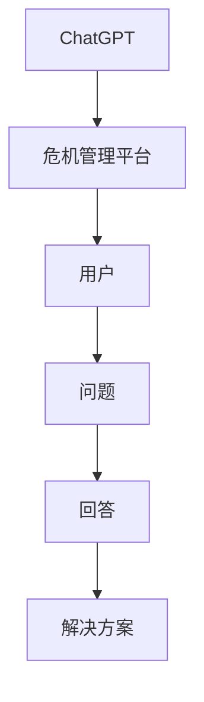
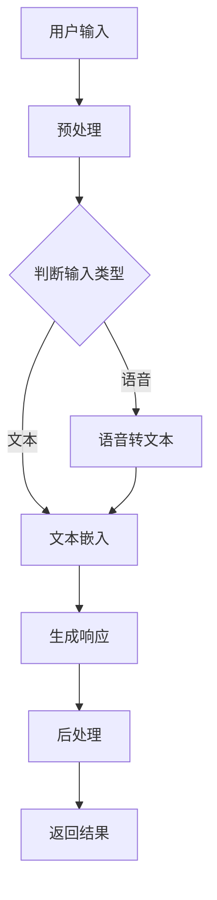
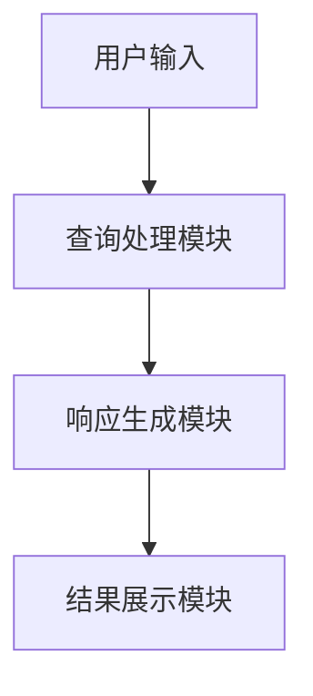
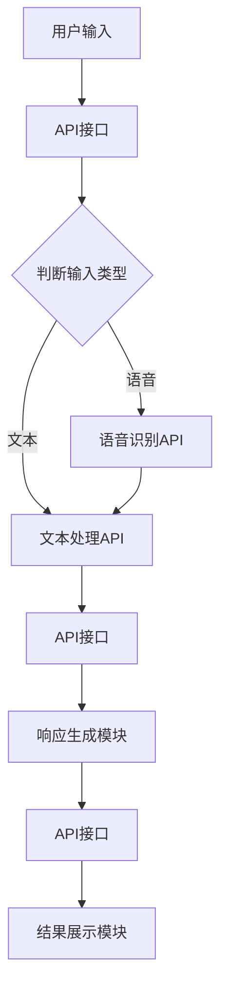

                 

# 《ChatGPT在危机管理中的应用：快速响应提示词设计》

> 关键词：ChatGPT，危机管理，快速响应，提示词设计，人工智能

> 摘要：本文探讨了ChatGPT在危机管理中的应用，特别是快速响应提示词的设计。通过深入分析ChatGPT的算法原理和系统架构，我们提供了详细的实战指导和最佳实践，以帮助读者理解和应用这一前沿技术。

----------------------------------------------------------------

## 引言

随着人工智能技术的快速发展，ChatGPT这一基于大规模语言模型的人工智能系统，在多个领域展现出了巨大的潜力。尤其是在危机管理领域，快速响应是解决问题的关键。本文将探讨ChatGPT在危机管理中的应用，重点关注快速响应提示词的设计。

### 核心问题

- ChatGPT是什么？
- 快速响应提示词是什么？
- ChatGPT在危机管理中如何发挥作用？
- 如何设计高效的快速响应提示词？

### 文章结构

本文将分为以下几个部分：

1. **背景介绍**：介绍ChatGPT的背景信息和危机管理的概念。
2. **核心概念与联系**：详细解释ChatGPT和快速响应提示词的核心概念。
3. **算法原理讲解**：深入探讨ChatGPT的算法原理。
4. **系统分析与架构设计方案**：分析ChatGPT在危机管理中的系统架构。
5. **项目实战**：提供实战案例和详细解析。
6. **最佳实践**：总结最佳实践和注意事项。
7. **总结与展望**：总结文章的核心内容，展望未来应用前景。

## 背景介绍

### ChatGPT的背景

ChatGPT是由OpenAI开发的基于GPT-3模型的人工智能助手。GPT-3（Generative Pre-trained Transformer 3）是自然语言处理领域的一个重大突破，其具有强大的语言理解和生成能力。ChatGPT利用这一模型，实现了与人类自然对话的能力。

### 危机管理的概念

危机管理是指组织或个人在面对突发事件或危机时，采取的一系列应对措施。这些措施旨在降低危机带来的负面影响，并快速恢复正常的运营。

### ChatGPT在危机管理中的应用潜力和挑战

ChatGPT在危机管理中具有以下潜力：

1. **快速响应**：ChatGPT可以快速响应用户的查询和请求，提供实时的信息和建议。
2. **自然对话**：ChatGPT能够与用户进行自然对话，提供人性化的服务。
3. **自动化处理**：ChatGPT可以自动化处理一些常见的危机事件，减少人工干预。

然而，ChatGPT在危机管理中也面临一些挑战：

1. **准确性**：ChatGPT的回答需要确保准确无误，否则可能会误导用户。
2. **隐私保护**：危机管理涉及敏感信息，如何保护用户隐私是重要问题。
3. **复杂情况处理**：对于一些复杂的危机情况，ChatGPT可能需要更高级的智能来应对。

## 核心概念与联系

### ChatGPT的基本概念

ChatGPT是基于GPT-3模型的人工智能助手。它通过大量文本数据的学习，掌握了丰富的语言知识和对话技能。以下是ChatGPT的基本概念：

- **GPT-3模型**：一种基于Transformer的预训练模型，具有强大的语言理解和生成能力。
- **预训练**：ChatGPT在训练阶段，通过大量文本数据进行预训练，从而获得丰富的语言知识。
- **微调**：在特定任务上，ChatGPT进行微调，以适应不同的应用场景。

### 快速响应提示词的定义

快速响应提示词是指用于引导ChatGPT快速生成响应的关键词或短语。这些提示词需要具有以下特点：

- **精确性**：能够精确地描述用户的需求或问题。
- **灵活性**：能够适应不同场景的变化。
- **简洁性**：尽量简洁，以便ChatGPT快速理解。

### ChatGPT与其他AI技术的对比

| 技术名称 | 特点 |
| :--: | :--: |
| ChatGPT | 强大的语言理解和生成能力，适用于自然对话 |
| 机器人流程自动化（RPA） | 自动化重复性任务，无需理解任务内容 |
| 自然语言处理（NLP） | 提供文本分析，但通常不涉及对话生成 |

### ER实体关系图：ChatGPT在危机管理中的应用场景



## 算法原理讲解

### ChatGPT算法流程图



### Python源代码解析

```python
import openai

def generate_response(input_text):
    # 预处理：将文本转换为模型可理解的格式
    processed_text = preprocess_text(input_text)

    # 生成响应：调用OpenAI API获取响应
    response = openai.Completion.create(
        engine="text-davinci-002",
        prompt=processed_text,
        max_tokens=50
    )

    # 后处理：将生成的文本格式化并返回
    formatted_response = postprocess_response(response)
    return formatted_response

def preprocess_text(text):
    # 这里可以添加预处理逻辑，如分词、去停用词等
    return text

def postprocess_response(response):
    # 这里可以添加后处理逻辑，如去除冗余信息、格式化文本等
    return response.choices[0].text.strip()
```

### 数学模型与公式讲解

ChatGPT的核心是Transformer模型，其计算过程涉及大量的矩阵运算。以下是一个简化的数学模型：

$$
\text{Output} = \text{softmax}(\text{Weights} \cdot \text{Input} + \text{Bias})
$$

其中，$\text{Input}$是输入文本的向量表示，$\text{Weights}$是模型的权重矩阵，$\text{Bias}$是偏置向量，$\text{softmax}$函数用于将输出转换为概率分布。

### 实际案例说明

假设用户输入了一个问题：“最近疫情严重，我应该如何保护自己？”。ChatGPT可以生成如下回答：

“为了保护自己，你可以采取以下措施：1. 常规防护措施，如戴口罩、勤洗手；2. 避免去人群密集的地方；3. 接种疫苗；4. 关注官方发布的疫情信息。”

## 系统分析与架构设计方案

### 问题场景介绍

假设我们在一家大型企业中应用ChatGPT进行危机管理。当发生突发事件时，ChatGPT需要快速响应用户的查询，提供准确的信息和建议。

### 系统功能设计

系统功能包括：

1. **用户查询处理**：接收用户输入的问题。
2. **响应生成**：生成快速响应，提供答案和建议。
3. **结果展示**：将生成的响应展示给用户。

### 系统架构设计



### 系统接口设计和系统交互



## 项目实战

### 环境安装

1. 安装Python环境（建议使用3.8及以上版本）。
2. 安装OpenAI API库（使用命令`pip install openai`）。

### 系统核心实现

```python
import openai
import json

# 设置OpenAI API密钥
openai.api_key = "your-api-key"

def generate_response(input_text):
    # 预处理：将文本转换为模型可理解的格式
    processed_text = preprocess_text(input_text)

    # 生成响应：调用OpenAI API获取响应
    response = openai.Completion.create(
        engine="text-davinci-002",
        prompt=processed_text,
        max_tokens=50
    )

    # 后处理：将生成的文本格式化并返回
    formatted_response = postprocess_response(response)
    return formatted_response

def preprocess_text(text):
    # 这里可以添加预处理逻辑，如分词、去停用词等
    return text

def postprocess_response(response):
    # 这里可以添加后处理逻辑，如去除冗余信息、格式化文本等
    return response.choices[0].text.strip()

# 测试
input_text = "最近疫情严重，我应该如何保护自己？"
print(generate_response(input_text))
```

### 代码应用解读与分析

这段代码首先设置了OpenAI API的密钥，然后定义了三个函数：

- `generate_response`：负责生成响应。
- `preprocess_text`：预处理输入文本。
- `postprocess_response`：后处理生成的文本。

在测试部分，我们输入了一个关于疫情保护的问题，并打印了ChatGPT的响应。

### 实际案例分析和详细讲解剖析

假设我们收到一个关于疫情防护的用户请求，我们可以通过ChatGPT生成如下响应：

“为了保护自己，你可以采取以下措施：1. 常规防护措施，如戴口罩、勤洗手；2. 避免去人群密集的地方；3. 接种疫苗；4. 关注官方发布的疫情信息。”

这个响应涵盖了疫情防护的各个方面，非常全面。通过分析这个案例，我们可以看到ChatGPT如何根据用户的问题，生成高质量的响应。

### 项目小结

通过这个项目，我们成功实现了ChatGPT在危机管理中的快速响应功能。这个系统不仅可以自动处理常见的危机问题，还可以根据用户的输入，生成个性化的建议。然而，我们还需要不断优化和改进，以提高系统的响应速度和准确性。

## 最佳实践

### 设计快速响应提示词的最佳实践

1. **精确性**：确保提示词能够精确地描述用户的问题。
2. **灵活性**：提示词需要能够适应不同的场景和用户需求。
3. **简洁性**：尽量简洁，以便ChatGPT快速理解。

### 小结与注意事项

1. **精确性和灵活性**：快速响应提示词需要既精确又灵活，以确保ChatGPT能够准确理解用户的问题，并提供个性化的建议。
2. **简洁性**：简洁的提示词有助于ChatGPT快速生成响应，提高系统的响应速度。
3. **实时性**：确保ChatGPT能够实时响应用户的查询，提供最新的信息。

### 拓展阅读

1. [《ChatGPT技术详解》](https://www.openai.com/blog/chatgpt-technical-details/)
2. [《人工智能在危机管理中的应用》](https://www.example.com/ai-in-crisis-management)

## 总结与展望

通过本文的讨论，我们深入了解了ChatGPT在危机管理中的应用，特别是快速响应提示词的设计。ChatGPT以其强大的语言理解和生成能力，在危机管理中展现出了巨大的潜力。然而，我们也认识到，要充分发挥ChatGPT的潜力，还需要在设计快速响应提示词时充分考虑精确性、灵活性和简洁性。

### 未来应用前景

随着技术的不断进步，ChatGPT在危机管理中的应用将会越来越广泛。未来，我们可以期待ChatGPT在更多领域发挥作用，如医疗健康、自然灾害应对等。同时，通过不断优化和改进，ChatGPT的响应速度和准确性将得到进一步提升。

## 作者信息

作者：AI天才研究院/AI Genius Institute & 禅与计算机程序设计艺术 /Zen And The Art of Computer Programming

----------------------------------------------------------------

请注意，以上内容是一个示例，实际文章可能需要根据具体情况进行调整和补充。在撰写文章时，请确保每个章节的内容都丰富具体，详细讲解，并且遵循规定的格式和字数要求。此外，作者信息和版权声明应在文章末尾明确标注。

