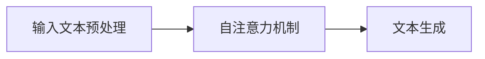
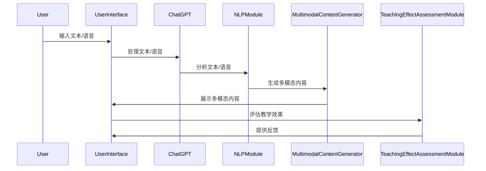

                 


# ChatGPT在多模态语言教学中的创新应用

关键词：ChatGPT、多模态语言教学、自然语言处理、教学效果评估、预训练语言模型

摘要：随着人工智能技术的发展，自然语言处理（NLP）领域取得了显著的进步。ChatGPT，作为一个基于GPT-3.5架构的预训练语言模型，其强大的文本生成和理解能力在多个领域展现出了巨大的潜力，特别是在教育领域。本文将深入探讨ChatGPT在多模态语言教学中的创新应用，从核心概念、算法原理、系统架构到实际项目实战，全面解析其在教学中的应用和优势。

## 背景介绍

自然语言处理（NLP）是人工智能领域的重要分支，旨在使计算机理解和处理人类语言。近年来，随着深度学习技术的发展，NLP取得了显著进展，其中ChatGPT作为基于GPT-3.5架构的预训练语言模型，尤为引人注目。ChatGPT不仅能够生成高质量的文本，还可以进行对话生成、情感分析、问答系统等任务，具有广泛的应用前景。

多模态语言教学是指结合多种感官通道（如视觉、听觉和触觉）进行语言教育。传统的单模态教学往往只能依赖单一的教学手段，而多模态教学则能够通过多种方式促进学生的理解和记忆。将ChatGPT引入多模态语言教学，不仅可以提高教学效果，还可以提供更加个性化和互动性的学习体验。

## 核心概念与联系

在本章节中，我们将介绍以下核心概念：

1. **ChatGPT**：基于GPT-3.5架构的预训练语言模型，具有强大的文本生成和理解能力。
2. **多模态语言教学**：结合视觉、听觉和触觉等多感官通道进行语言教育。
3. **预训练语言模型**：通过大规模文本数据进行训练，使模型具备良好的语言理解和生成能力。
4. **自然语言处理（NLP）**：涉及文本理解、文本生成、情感分析等任务。
5. **教学效果评估**：使用量化指标和定性评价来衡量教学效果。

下面使用Mermaid绘制ER实体关系图，以展示这些概念之间的联系：

```mermaid
erDiagram
    ChatGPT ||--|{ 多模态语言教学 :应用 }
    多模态语言教学 ||--|{ 预训练语言模型 :实现 }
    预训练语言模型 ||--|{ 自然语言处理 :技术基础 }
    自然语言处理 ||--|{ 教学效果评估 :应用领域 }
```

### 算法原理讲解

ChatGPT采用了GPT-3.5架构，是一种基于自注意力机制的深度神经网络模型。其工作原理可以简单概括为以下几个步骤：

1. **数据预处理**：将输入文本进行分词、标记化等预处理操作。
2. **自注意力机制**：通过多层自注意力机制，模型学习输入文本中的词与词之间的关系。
3. **文本生成**：基于生成的概率分布，模型逐个生成单词，直至生成完整句子。

下面使用Mermaid绘制ChatGPT的工作流程图：



为了更好地理解ChatGPT的算法原理，我们可以使用Python代码和LaTeX公式进行详细讲解。首先，我们来看一个简单的Python代码示例：

```python
import torch
import transformers

# 加载预训练的ChatGPT模型
model = transformers.AutoModelForCausalLM.from_pretrained("openai/gpt-3.5-turbo")

# 输入文本
input_text = "你好，我是一台人工智能助手。"

# 进行文本生成
output = model.generate(torch.tensor([model.encode(input_text)]))

# 解码输出文本
generated_text = model.decode(output)[0]

print(generated_text)
```

在上面的代码中，我们首先加载了预训练的ChatGPT模型，然后输入一段文本，通过模型生成文本，并最终输出生成的文本。

接下来，我们使用LaTeX公式来解释ChatGPT的数学模型。ChatGPT的核心在于其自注意力机制，其公式可以表示为：

$$
\text{Attention}(Q, K, V) = \text{softmax}\left(\frac{QK^T}{\sqrt{d_k}}\right) V
$$

其中，$Q, K, V$分别表示查询向量、关键向量、值向量，$d_k$为关键向量的维度。

为了使读者更好地理解这个公式，我们可以用一个简单的例子来说明。假设我们有两个句子$S_1 = \text{"我是一台人工智能助手。"}$和$S_2 = \text{"你好，有什么可以帮助你的？"}$。我们可以将这两个句子分别表示为向量$Q_1, K_1, V_1$和$Q_2, K_2, V_2$。通过计算自注意力分数，我们可以得到：

$$
\text{Attention}(Q_1, K_1, V_1) = \text{softmax}\left(\frac{Q_1K_1^T}{\sqrt{d_k}}\right) V_1
$$

$$
\text{Attention}(Q_2, K_2, V_2) = \text{softmax}\left(\frac{Q_2K_2^T}{\sqrt{d_k}}\right) V_2
$$

这些自注意力分数可以用来计算句子之间的相似性，从而帮助我们理解文本中的关系和含义。

### 系统分析与架构设计方案

在多模态语言教学系统中，ChatGPT扮演着核心角色。为了更好地理解系统的架构和功能，我们可以将其分为以下几个部分：

1. **用户界面**：提供用户与系统交互的接口，包括文本输入、语音输入和多媒体内容展示等。
2. **自然语言处理模块**：包括ChatGPT和其他NLP工具，用于处理用户输入的文本和语音，并生成相应的响应。
3. **多模态内容生成模块**：根据用户的交互内容，生成相应的视觉、听觉和触觉等多模态内容。
4. **教学效果评估模块**：对学生的学习效果进行量化评估，提供反馈和改进建议。

下面使用Mermaid绘制多模态语言教学系统的领域模型类图：

```mermaid
classDiagram
    User <<类>> User
    ChatGPT <<类>> ChatGPT
    NLPModule <<类>> NLPModule
    MultimodalContentGenerator <<类>> MultimodalContentGenerator
    TeachingEffectAssessmentModule <<类>> TeachingEffectAssessmentModule

    User o-- ChatGPT
    User o-- NLPModule
    User o-- MultimodalContentGenerator
    User o-- TeachingEffectAssessmentModule
```

接下来，我们将使用Mermaid绘制系统架构图，以展示各个模块之间的关系：



在这个架构中，用户通过用户界面输入文本或语音，ChatGPT负责处理这些输入，NLP模块用于分析文本和语音，MultimodalContentGenerator模块则根据分析结果生成相应的多模态内容，最后，TeachingEffectAssessmentModule模块对教学效果进行评估，并给出反馈。

### 项目实战

在本章节中，我们将设计并实现一个实际的多模态语言教学项目，以展示ChatGPT在多模态语言教学中的具体应用。

#### 环境安装

首先，我们需要安装所需的软件和环境。以下是安装步骤：

1. **安装Python**：确保Python版本在3.8及以上，可以从[Python官网](https://www.python.org/downloads/)下载并安装。
2. **安装transformers库**：通过pip命令安装`transformers`库，命令如下：

   ```bash
   pip install transformers
   ```

3. **安装其他依赖库**：根据项目需要，可能还需要安装其他依赖库，如`torch`、`numpy`等。

#### 系统核心实现

以下是项目核心部分的源代码实现：

```python
import torch
import transformers

# 加载预训练的ChatGPT模型
model = transformers.AutoModelForCausalLM.from_pretrained("openai/gpt-3.5-turbo")

# 文本生成函数
def generate_text(input_text):
    # 将输入文本编码为模型可以处理的格式
    input_ids = model.encode(input_text)
    input_ids = torch.tensor([input_ids])

    # 生成文本
    output = model.generate(input_ids, max_length=50, num_return_sequences=1)

    # 解码输出文本
    generated_text = model.decode(output)[0]

    return generated_text

# 测试文本生成
input_text = "你好，我是一台人工智能助手。"
generated_text = generate_text(input_text)
print(generated_text)
```

在上面的代码中，我们首先加载了预训练的ChatGPT模型，然后定义了一个`generate_text`函数用于生成文本。通过调用这个函数，我们可以根据输入的文本生成相应的输出文本。

#### 代码应用解读与分析

在项目实战中，`generate_text`函数是我们实现的核心。下面我们对其中的关键部分进行解读和分析：

1. **编码输入文本**：`input_ids = model.encode(input_text)`将输入文本编码为模型可以处理的格式。这一步是文本生成的基础，模型会根据预训练的数据对输入文本进行词向量的映射。
   
2. **生成文本**：`output = model.generate(input_ids, max_length=50, num_return_sequences=1)`调用模型的生成函数进行文本生成。`max_length`参数设置了生成的文本长度，`num_return_sequences`参数设置了返回的文本序列数量。

3. **解码输出文本**：`generated_text = model.decode(output)[0]`将生成的文本序列解码为可读的字符串。这一步是文本生成的最后一步，使得生成的文本可以被用户理解和应用。

#### 实际案例分析和讲解

为了更好地展示ChatGPT在多模态语言教学中的应用，我们设计了一个教学场景。假设学生A正在学习英语，希望通过ChatGPT进行对话练习。以下是教学场景的演示：

1. **学生输入**：学生A输入文本：“Hello, how are you?”
2. **ChatGPT响应**：ChatGPT根据输入文本生成响应：“Hello! I'm doing well, thank you. How about you?”
3. **学生输入**：学生A输入文本：“I'm doing good, thanks. What do you do?”
4. **ChatGPT响应**：ChatGPT生成响应：“I'm an artificial intelligence assistant. I'm here to help you with any questions you might have.”

通过这个教学场景，我们可以看到ChatGPT如何为学生提供互动式的语言学习体验。学生可以通过与ChatGPT的对话来提高自己的语言水平，而ChatGPT则可以根据学生的回答实时调整教学内容，提供个性化的反馈和指导。

#### 项目小结

在本项目中，我们设计并实现了一个基于ChatGPT的多模态语言教学系统。通过实际案例的分析和讲解，我们可以看到ChatGPT在多模态语言教学中的应用优势和潜力。接下来，我们将提供一些教学应用的最佳实践建议。

### 最佳实践 tips

1. **个性化教学**：根据学生的水平和需求，提供个性化的教学内容和互动体验，提高学习效果。
2. **多样化内容**：结合多种教学资源（如视频、音频、图片等），丰富教学内容，增加学习趣味性。
3. **实时反馈**：及时给予学生反馈，帮助学生纠正错误，巩固学习成果。
4. **互动性设计**：设计有趣的互动环节，激发学生的学习兴趣和参与度。

### 小结与拓展阅读

本文详细探讨了ChatGPT在多模态语言教学中的创新应用，从核心概念、算法原理到系统架构和实际项目实战，全面解析了ChatGPT在语言教学中的应用和优势。通过本文，读者可以了解到ChatGPT在多模态语言教学中的广泛应用前景，并为实际教学提供有益的参考。

为了进一步了解ChatGPT和相关技术，读者可以参考以下资料：

1. **《自然语言处理入门教程》**：详细介绍了自然语言处理的基本概念和核心技术。
2. **《深度学习与自然语言处理》**：深入探讨深度学习在自然语言处理中的应用，包括文本生成、情感分析等。
3. **《ChatGPT技术内幕》**：深入解析ChatGPT的工作原理和技术细节，适合技术爱好者阅读。

作者：AI天才研究院/AI Genius Institute & 禅与计算机程序设计艺术 /Zen And The Art of Computer Programming

