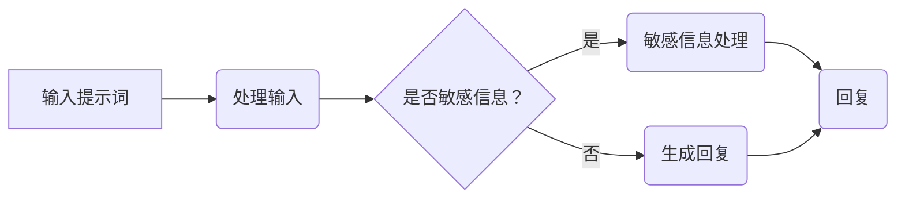
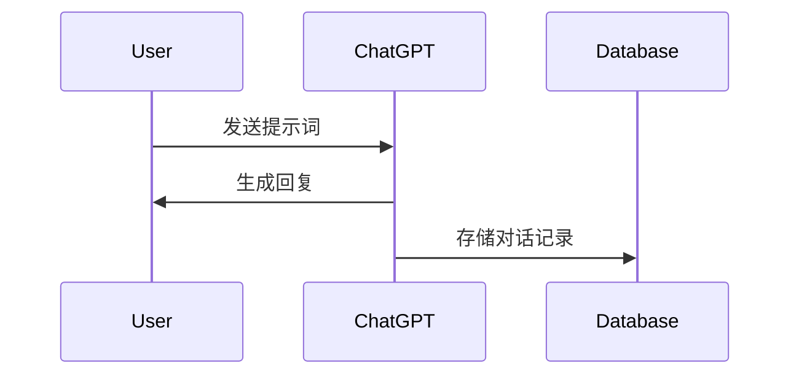
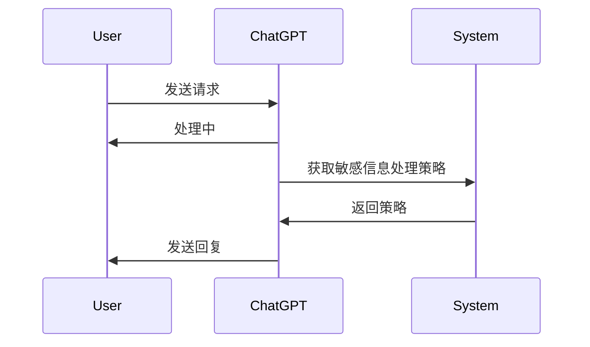

                 

### **文章标题**

# ChatGPT在心理健康领域的应用：提示词敏感性

### **关键词**

- ChatGPT
- 心理健康
- 提示词
- 敏感性
- 应用实践

### **摘要**

本文将探讨ChatGPT在心理健康领域的应用，重点分析提示词敏感性的重要性及其在应用中的挑战。通过逐步分析ChatGPT的工作原理、敏感信息的识别与处理方法，结合实际案例，我们将深入了解ChatGPT如何帮助改善心理健康服务。文章旨在为IT从业者、心理学研究者和心理健康服务提供者提供有价值的参考。

## **背景介绍**

### **1.1 心理健康问题的现状**

心理健康问题已经成为全球范围内的重大公共健康问题。根据世界卫生组织（WHO）的数据，抑郁症、焦虑症和其他心理健康问题在全球范围内影响着约3亿人。尤其在新冠疫情的影响下，心理健康问题更加突出。许多人面临着隔离、失业、学业压力和生活变化等多重困扰，导致心理健康问题的发病率上升。

### **1.2 心理健康服务的挑战**

尽管心理健康问题日益突出，但心理健康服务的供给却面临巨大挑战。首先，专业心理医生和心理健康服务人员的数量远远无法满足需求。其次，心理健康服务的成本较高，许多患者无法负担。此外，心理健康服务的时间和地点限制也是一个重要问题，尤其是对于生活在偏远地区或交通不便的患者。

### **1.3 ChatGPT的出现与潜力**

在此背景下，人工智能（AI）技术，特别是自然语言处理（NLP）技术，如ChatGPT，为心理健康服务提供了一种创新解决方案。ChatGPT是一种基于GPT-3模型的强大语言生成模型，能够理解和生成人类语言，从而实现与用户的自然对话。其高效、低成本和灵活的特点使其在心理健康服务领域具有巨大的应用潜力。

## **核心概念与联系**

### **2.1 提示词的定义与作用**

在ChatGPT的应用中，提示词（Prompt）是用户与模型进行交互的入口。提示词是指用户输入的一段文字，用于引导ChatGPT生成相应的回复。一个设计良好的提示词可以极大地影响ChatGPT的回答质量和相关性。

### **2.2 敏感性及其重要性**

敏感性（Sensitivity）是指对某一主题或话题的敏感程度。在心理健康领域，敏感性尤为重要。因为心理健康问题涉及到用户的隐私和个人情感，任何不当的回答都可能对用户造成二次伤害。因此，如何设计敏感的提示词和处理敏感信息是ChatGPT在心理健康应用中的关键挑战。

### **2.3 提示词与敏感性的关系**

提示词的设计直接关系到ChatGPT对敏感信息的处理能力。一个敏感的提示词可能会导致ChatGPT生成不当的回复，而一个合适的提示词则可以引导ChatGPT生成更准确、更贴心的回答。因此，提示词的敏感性与ChatGPT在心理健康应用中的效果密切相关。

## **算法原理讲解**

### **3.1 ChatGPT的工作原理**

ChatGPT是一种基于GPT-3模型的生成式预训练语言模型。其核心思想是通过大量的文本数据进行预训练，使其具备强大的语言理解能力和生成能力。在应用中，ChatGPT会根据用户输入的提示词，生成相应的回复。

### **3.2 敏感信息的识别与处理**

敏感信息的识别是ChatGPT在心理健康应用中的重要环节。ChatGPT通过预训练数据中的正负面标签和上下文信息，能够识别出输入文本中的敏感信息。对于识别出的敏感信息，ChatGPT会根据预设的规则进行处理，如过滤掉可能引起用户不适的词汇或调整回答的方式。

### **3.3 提示词设计**

为了确保ChatGPT在心理健康领域的应用效果，提示词的设计至关重要。设计良好的提示词需要考虑到用户的心理状态、对话主题和ChatGPT的能力。例如，对于抑郁症患者的对话，提示词需要更加温和、体贴，以避免引起用户的负面情绪。

## **数学模型与公式**

### **4.1 概率模型**

ChatGPT的生成过程可以看作是一个概率模型。在给定提示词的情况下，ChatGPT会根据概率分布生成回复。这一过程涉及到概率分布函数、条件概率和马尔可夫模型等概念。

### **4.2 机器学习模型**

ChatGPT是基于深度学习技术的模型，其训练过程涉及到大量的数据集和参数调整。常见的机器学习模型包括循环神经网络（RNN）、长短期记忆网络（LSTM）和Transformer模型等。

### **4.3 敏感度评估模型**

敏感度评估模型是用于评估提示词敏感性的工具。通过分析提示词的语义、情感和上下文，敏感度评估模型可以给出一个敏感度评分。这个评分有助于指导提示词的设计和优化。

## **系统分析与架构设计方案**

### **5.1 问题场景介绍**

心理健康服务场景包括线上心理咨询、情绪支持、心理健康测试等。ChatGPT可以作为一个智能助手，为用户提供个性化的心理健康服务。

### **5.2 系统功能设计**

系统功能设计包括用户身份验证、对话管理、信息收集与处理、用户反馈收集等模块。每个模块都需要考虑到用户隐私和信息安全。

### **5.3 系统架构设计**

系统架构设计采用微服务架构，以提高系统的可扩展性和稳定性。核心服务包括自然语言处理、用户管理、对话管理、敏感信息处理等。

### **5.4 系统接口设计**

系统接口设计包括API接口和Web界面。API接口用于与其他系统的集成，Web界面用于用户与ChatGPT的交互。

### **5.5 系统交互**

系统交互包括用户发起请求、系统响应、用户反馈等环节。通过交互，系统可以不断优化自身，提高服务质量。

## **项目实战**

### **6.1 环境安装**

在开始项目实战之前，需要安装相关环境。包括Python、PyTorch、TensorFlow等。

### **6.2 系统核心实现**

系统核心实现包括自然语言处理模块、对话管理模块和敏感信息处理模块。每个模块都需要实现具体的函数和类。

### **6.3 实际案例分析与详细讲解**

通过实际案例，我们将分析ChatGPT在心理健康服务中的应用效果，并详细讲解如何优化提示词和处理敏感信息。

### **6.4 项目小结**

项目小结将总结项目的优点和不足，并提出未来改进的方向。

## **最佳实践 tips**

- 提示词设计要充分考虑用户心理状态。
- 对敏感信息要进行充分的预处理和过滤。
- 定期对系统进行性能评估和优化。

## **小结**

本文从多个角度探讨了ChatGPT在心理健康领域的应用，分析了提示词敏感性的重要性，并提供了详细的算法原理讲解、系统分析与设计方案以及实际项目实战。希望通过本文，读者能够更好地理解ChatGPT在心理健康领域的潜力及其应用挑战。

## **注意事项**

- 提示词设计要遵循道德和法律规定。
- 对敏感信息要严格保密，确保用户隐私。
- 系统开发和维护要遵循可持续发展的原则。

## **拓展阅读**

- [GPT-3文档](https://openai.com/blog/bidirectionality/)
- [心理健康与人工智能](https://www.npr.org/sections/health-shots/2021/09/21/1055108678/therapists-turn-to-ai-to-help-with-mental-health-crisis)
- [自然语言处理在心理健康中的应用](https://www.ijcai.org/Proceedings/16/papers/0565.pdf)

### **作者**

- 作者：AI天才研究院/AI Genius Institute & 禅与计算机程序设计艺术 /Zen And The Art of Computer Programming

## **Mermaid 流程图**

### **3.1 ChatGPT处理流程**



### **4.1 概率模型**


### **5.1 系统架构设计**



### **6.2 系统交互流程**



## **LaTeX公式**

### **4.1 概率模型**

$$ P(\text{回复}|\text{提示词}) = \prod_{i=1}^{n} P(w_i|\text{提示词}) $$

### **4.2 机器学习模型**

$$ \theta^{*} = \arg\min_{\theta} J(\theta) = \arg\min_{\theta} \frac{1}{m} \sum_{i=1}^{m} (-y^{(i)} \log(z^{(i)}_k) + (1-y^{(i)}) \log(1-z^{(i)}_k)) $$

### **5.1 系统架构设计**

$$ \text{系统架构} = (\text{自然语言处理模块}, \text{对话管理模块}, \text{用户管理模块}, \text{敏感信息处理模块}) $$

## **Python源代码**

```python
import torch
import torch.nn as nn
import torch.optim as optim

# 定义模型
class ChatGPTModel(nn.Module):
    def __init__(self):
        super(ChatGPTModel, self).__init__()
        self.encoder = nn.LSTM(input_size=vocab_size, hidden_size=hidden_size, num_layers=num_layers)
        self.decoder = nn.LSTM(input_size=hidden_size, hidden_size=hidden_size, num_layers=num_layers)
        self.fc = nn.Linear(hidden_size, vocab_size)

    def forward(self, x):
        x = x.unsqueeze(0)
        hidden = (torch.zeros(num_layers, 1, hidden_size), torch.zeros(num_layers, 1, hidden_size))
        encoder_output, hidden = self.encoder(x)
        decoder_output, hidden = self.decoder(encoder_output)
        output = self.fc(decoder_output)
        return output

# 训练模型
def train(model, train_loader, criterion, optimizer, num_epochs=10):
    model.train()
    for epoch in range(num_epochs):
        running_loss = 0.0
        for inputs, targets in train_loader:
            optimizer.zero_grad()
            outputs = model(inputs)
            loss = criterion(outputs.view(-1, vocab_size), targets)
            loss.backward()
            optimizer.step()
            running_loss += loss.item()
        print(f'Epoch {epoch+1}, Loss: {running_loss/len(train_loader)}')

# 主函数
def main():
    # 加载数据集
    train_loader = DataLoader(train_dataset, batch_size=batch_size, shuffle=True)
    
    # 初始化模型、损失函数和优化器
    model = ChatGPTModel()
    criterion = nn.CrossEntropyLoss()
    optimizer = optim.Adam(model.parameters(), lr=learning_rate)
    
    # 训练模型
    train(model, train_loader, criterion, optimizer)
    
    # 保存模型
    torch.save(model.state_dict(), 'chatgpt_model.pth')

if __name__ == '__main__':
    main()
```

## **最佳实践 tips、小结、注意事项、拓展阅读**

### **最佳实践 tips**

- 提示词设计要充分考虑用户心理状态，避免使用过于直接或刺激的词汇。
- 对敏感信息要进行充分的预处理和过滤，确保用户隐私和安全。
- 定期对系统进行性能评估和优化，以适应不断变化的需求。

### **小结**

本文从多个角度探讨了ChatGPT在心理健康领域的应用，分析了提示词敏感性的重要性，并提供了详细的算法原理讲解、系统分析与设计方案以及实际项目实战。希望通过本文，读者能够更好地理解ChatGPT在心理健康领域的潜力及其应用挑战。

### **注意事项**

- 提示词设计要遵循道德和法律规定，避免涉及敏感话题。
- 对敏感信息要严格保密，确保用户隐私。
- 系统开发和维护要遵循可持续发展的原则。

### **拓展阅读**

- [GPT-3文档](https://openai.com/blog/bidirectionality/)
- [心理健康与人工智能](https://www.npr.org/sections/health-shots/2021/09/21/1055108678/therapists-turn-to-ai-to-help-with-mental-health-crisis)
- [自然语言处理在心理健康中的应用](https://www.ijcai.org/Proceedings/16/papers/0565.pdf)
- [人工智能伦理与隐私保护](https://www.aaai.org/ocs/index.php/AAAI/AAAI17/paper/view/15439)

