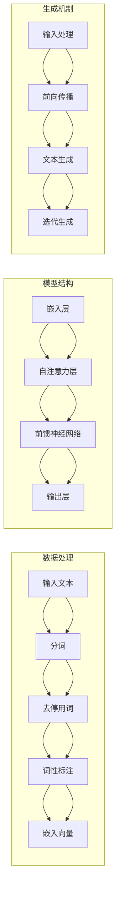
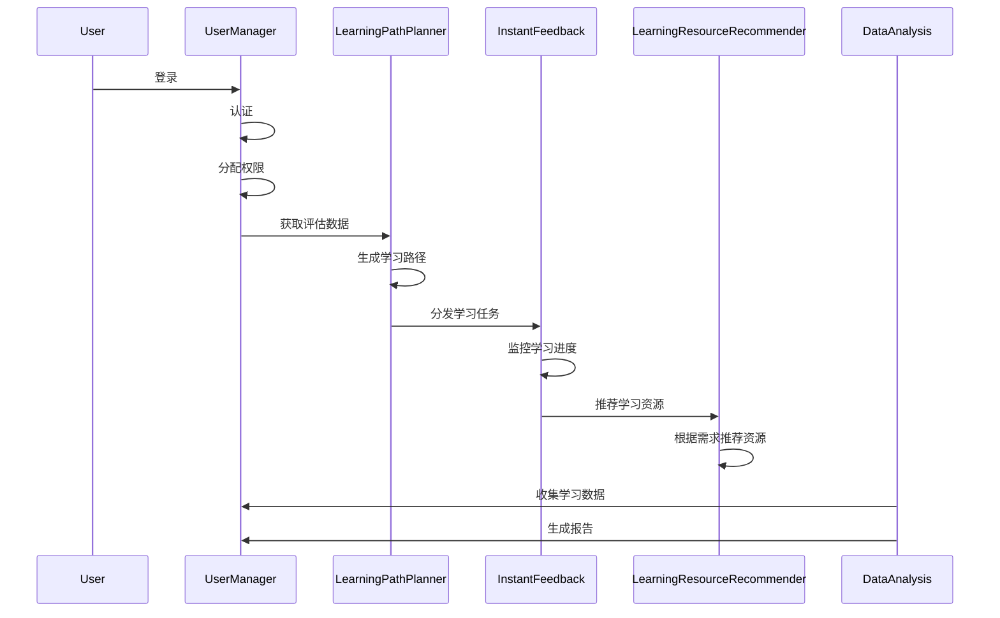
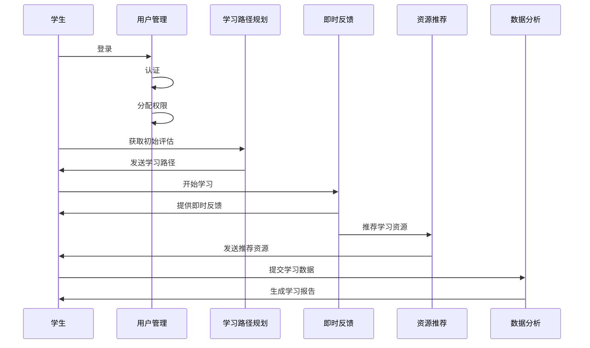

                 

### 引言

在当今信息化时代，人工智能（AI）已经成为引领科技发展的前沿力量。教育领域，作为社会发展的基石，自然也受到了AI技术的深刻影响。个性化学习，作为近年来教育改革的重要方向，旨在通过因材施教，提高教育质量，满足不同学生的个性化需求。然而，传统的教育模式在应对这一挑战时显得力不从心，难以实现全面而精准的个性化教学。

ChatGPT，这一基于GPT-3模型开发的聊天机器人，凭借其强大的语言理解和生成能力，为教育个性化学习带来了新的契机。ChatGPT不仅能够提供即时的个性化辅导，还能通过不断学习和适应，为每个学生制定个性化的学习计划，从而提高学习效果和体验。

本文旨在深入探讨ChatGPT在教育个性化学习中的作用。我们将从以下几个方面展开讨论：

1. **问题背景与核心概念**：介绍教育个性化学习的挑战与机遇，以及ChatGPT的基本原理与应用。
2. **算法原理讲解**：详细讲解ChatGPT的算法原理，包括其模型结构、训练过程和生成机制。
3. **系统分析与架构设计方案**：分析教育个性化学习系统的需求，设计系统功能与架构。
4. **项目实战**：通过实际案例，展示ChatGPT在教育个性化学习中的应用，并分析其实现细节。
5. **最佳实践与拓展**：总结ChatGPT在教育个性化学习中的最佳实践，探讨未来发展的方向。

希望通过本文的探讨，能够为教育工作者和学生提供有价值的参考，帮助大家更好地理解和利用ChatGPT这一先进工具，推动教育个性化学习的发展。

---

#### **第一部分：ChatGPT与教育个性化学习**

##### **第1章：问题背景与核心概念**

**1.1 教育个性化学习的挑战与机遇**

教育个性化学习，是指通过因材施教，根据每个学生的学习特点和需求，提供个性化的学习资源、教学方法和学习路径。然而，传统的教育模式往往难以满足这一需求，主要面临以下几个挑战：

- **学生个体差异大**：每个学生的认知水平、学习兴趣和学习方式都有所不同，传统的“一刀切”教学模式难以兼顾这些差异。
- **教育资源有限**：教师的时间和精力有限，难以对每个学生进行个性化的辅导，导致个性化教育的实施难度较大。
- **教学评估滞后**：传统的教学评估方法通常在学期末或学年末进行，难以实时反映学生的学习情况，无法及时调整教学策略。

然而，随着信息技术的发展，尤其是人工智能技术的应用，教育个性化学习迎来了新的机遇。通过大数据、云计算和AI技术，可以收集和分析学生的学习数据，为学生提供更加精准的个性化学习建议。教育个性化学习的核心概念包括以下几个：

- **个性化教学**：根据学生的认知水平和学习需求，设计不同的教学资源和教学方法。
- **自适应学习**：系统根据学生的学习反馈和进度，自动调整教学内容和难度，以适应学生的个性化需求。
- **数据驱动学习**：通过分析学生的学习数据，了解学生的学习习惯、偏好和困难，从而优化教学策略。

**1.2 ChatGPT的基本原理与应用**

ChatGPT，全名为“Chat Generative Pre-trained Transformer”，是基于GPT-3模型开发的聊天机器人。GPT-3（Generative Pre-trained Transformer 3）是OpenAI推出的一种自然语言处理模型，具有强大的文本生成和理解能力。ChatGPT的工作原理可以概括为以下几个步骤：

1. **数据预处理**：ChatGPT首先对大量文本数据进行预处理，包括分词、去停用词和词性标注等。
2. **模型训练**：通过预训练，模型可以学习到语言的统计规律和语义信息，从而具备生成和理解自然语言的能力。
3. **文本生成**：给定一个输入文本，ChatGPT可以根据上下文和语言模型，生成相关且连贯的文本输出。

在教育领域，ChatGPT的应用主要包括以下几个方面：

- **个性化辅导**：ChatGPT可以为学生提供即时的个性化辅导，解答学生在学习过程中的问题。
- **学习资源生成**：ChatGPT可以根据学生的学习需求和进度，生成个性化的学习资源，如练习题、讲解视频等。
- **教学评估**：ChatGPT可以分析学生的学习数据，评估学习效果，为教师提供教学反馈。

**1.3 ChatGPT在教育中的潜力与局限**

ChatGPT在教育中的潜力主要体现在以下几个方面：

- **个性化辅导**：ChatGPT可以24/7为学生提供即时解答，减轻教师的负担，提高教学效率。
- **自适应学习**：ChatGPT可以根据学生的学习进度和反馈，自动调整教学内容和难度，实现真正的个性化学习。
- **学习资源生成**：ChatGPT可以生成丰富的学习资源，包括文本、图片、音频和视频等多种形式，满足不同学生的需求。

然而，ChatGPT在教育中仍存在一些局限：

- **教育专业知识的深度限制**：尽管ChatGPT在自然语言处理方面表现出色，但其知识库的深度和广度仍需提高，特别是在教育领域的专业知识点上。
- **交互体验的优化**：目前的ChatGPT在交互体验上仍有待改进，如如何更好地理解学生的情感和需求，提供更人性化的服务。
- **数据隐私和安全**：教育数据涉及学生的个人信息和隐私，如何确保这些数据的安全和隐私，是ChatGPT在教育中应用的一个重要问题。

总的来说，ChatGPT在教育个性化学习中的潜力巨大，但仍需不断优化和改进，以更好地服务于教育事业。

---

##### **第2章：核心概念与联系**

**2.1 教育个性化学习的关键概念**

在教育个性化学习中，有几个关键概念需要深入理解，包括个性化教学、自适应学习和数据驱动学习。以下是对这些概念的定义、属性特征对比以及它们之间的联系：

**个性化教学**：指根据学生的个体差异，提供个性化的教学资源和教学方法。其核心特征包括：

- **学生个体差异识别**：通过多种方式（如入学测试、学习记录分析）识别学生的认知水平、学习兴趣和学习风格。
- **教学资源个性化**：根据学生的差异，设计并推荐符合其学习需求的教学资源，如不同难度的练习题、个性化指导视频等。

**自适应学习**：指系统根据学生的学习反馈和进度，自动调整教学内容和难度。其核心特征包括：

- **学习数据收集与分析**：收集学生的学习行为、考试成绩和反馈等数据，并通过分析这些数据，了解学生的学习习惯、偏好和困难。
- **教学内容自适应调整**：根据学习数据分析结果，动态调整教学内容和难度，以适应学生的学习进度和需求。

**数据驱动学习**：指通过分析学生的学习数据，了解其学习过程和效果，从而优化教学策略。其核心特征包括：

- **学习数据收集与存储**：建立完善的学习数据收集和存储系统，确保数据的准确性和完整性。
- **教学策略优化**：基于学习数据分析结果，对教学策略进行调整和优化，以提高教学效果。

**概念属性特征对比表格**：

| 概念名称     | 特征1                  | 特征2                  | 特征3                  |
| ------------ | ---------------------- | ---------------------- | ---------------------- |
| 个性化教学   | 学生个体差异识别       | 教学资源个性化         | 教学方法灵活           |
| 自适应学习   | 学习数据收集与分析     | 教学内容自适应调整     | 动态调整学习路径       |
| 数据驱动学习 | 学习数据收集与存储     | 教学策略优化           | 结果反馈和持续改进     |

**ER实体关系图架构的Mermaid流程图**：

```mermaid
erDiagram
  Student ||--|{ Course } : 学习
  Student ||--|{ LearningData } : 收集数据
  Teacher ||--|{ TeachingResource } : 提供
  Teacher ||--|{ LearningPlan } : 制定计划
  Course ||--|{ Exercise } : 练习
  Course ||--|{ Assessment } : 评估
```

在上图中，`Student`实体与`Course`、`LearningData`和`Teacher`实体之间存在多种关系，体现了教育个性化学习中的核心概念及其联系。

**2.2 ChatGPT的核心原理与特性**

ChatGPT作为一款先进的聊天机器人，其核心原理和特性对其在教育个性化学习中的应用起着至关重要的作用。以下是对ChatGPT的核心原理、特性以及与教育个性化学习之间联系的分析。

**核心原理**：

- **预训练模型**：ChatGPT是基于GPT-3模型开发的，GPT-3是一种大规模的预训练语言模型。预训练过程利用了大量的文本数据，模型在此过程中学习到了语言的统计规律和语义信息，从而具备了强大的文本生成和理解能力。
- **上下文理解**：ChatGPT通过理解上下文，能够生成与输入文本相关且连贯的输出。这种上下文理解能力使得ChatGPT能够在对话中保持一致性和连贯性，从而提供高质量的服务。

**特性**：

- **强大的语言生成能力**：ChatGPT能够生成高质量的自然语言文本，包括回答问题、编写文章、生成对话等。
- **多语言支持**：ChatGPT支持多种语言，能够与不同语言背景的学生进行交流。
- **自我学习**：ChatGPT可以通过不断学习和适应，提高其服务质量和应对复杂问题的能力。

**概念属性特征对比表格**：

| 概念名称   | 特征1                  | 特征2                  | 特征3                  |
| ---------- | ---------------------- | ---------------------- | ---------------------- |
| ChatGPT    | 预训练语言模型        | 上下文理解能力         | 多语言支持             |
| 个性化教学 | 学生个体差异识别       | 教学资源个性化         | 教学方法灵活           |
| 自适应学习 | 学习数据收集与分析     | 教学内容自适应调整     | 动态调整学习路径       |
| 数据驱动学习 | 学习数据收集与存储     | 教学策略优化           | 结果反馈和持续改进     |

**ER实体关系图架构的Mermaid流程图**：

```mermaid
erDiagram
  ChatGPT ||--|{ Student } : 服务
  ChatGPT ||--|{ LearningData } : 收集数据
  Teacher ||--|{ TeachingResource } : 提供
  Teacher ||--|{ LearningPlan } : 制定计划
  Student ||--|{ Course } : 学习
  Student ||--|{ Assessment } : 评估
```

在上图中，`ChatGPT`实体与`Student`、`Teacher`和`LearningData`实体之间存在多种关系，展示了ChatGPT在教育个性化学习中的应用场景和核心概念之间的联系。

通过以上对教育个性化学习和ChatGPT核心概念与特性的详细分析，我们可以看到，两者之间存在着紧密的联系和互补性。教育个性化学习需要借助ChatGPT的强大语言处理能力，实现个性化教学、自适应学习和数据驱动学习，从而提高教育质量和效果。而ChatGPT则通过在教育领域中的应用，不断优化和提升其模型性能，为教育个性化学习提供更加全面和高效的支持。

---

#### **第二部分：ChatGPT在教育个性化学习中的应用**

##### **第3章：算法原理讲解**

**3.1 ChatGPT的算法原理**

ChatGPT是基于GPT-3模型开发的一款聊天机器人，其算法原理主要包括模型结构、训练过程和生成机制。以下是ChatGPT算法原理的详细讲解：

**模型结构**：

ChatGPT采用的是Transformer模型，Transformer模型是一种基于自注意力机制的深度神经网络，具有处理长距离依赖和并行计算的能力。GPT-3模型是Transformer模型的一个大规模扩展版本，其核心架构包括以下几个部分：

- **嵌入层（Embedding Layer）**：将输入的词向量转换为稠密的向量表示。
- **自注意力层（Self-Attention Layer）**：通过计算输入序列中每个词与其他词之间的注意力权重，生成加权向量。
- **前馈神经网络（Feedforward Neural Network）**：对自注意力层生成的加权向量进行进一步处理，提高模型的非线性表达能力。
- **输出层（Output Layer）**：将最终的特征向量映射到输出空间，生成文本预测。

**训练过程**：

ChatGPT的训练过程主要包括以下步骤：

- **数据预处理**：首先对训练数据进行预处理，包括分词、去停用词、词性标注等，将文本转换为模型可处理的序列形式。
- **预训练**：使用大量无标注的文本数据进行预训练，模型在此过程中学习到语言的统计规律和语义信息。预训练过程包括两个阶段：自我监督预训练和基于任务的预训练。
  - **自我监督预训练**：通过预测下一个词来训练模型，模型需要根据上下文信息生成下一个词的概率分布。
  - **基于任务的预训练**：在特定任务上进行预训练，如问答、文本分类等，使模型具备解决特定任务的能力。
- **微调**：在预训练的基础上，对模型进行微调，使其适应特定应用场景。微调过程通常使用有标注的数据进行，模型需要根据标注数据调整参数，以优化模型性能。

**生成机制**：

ChatGPT的生成机制主要包括以下几个步骤：

- **输入处理**：将用户输入的文本转换为模型可处理的嵌入向量。
- **前向传播**：将嵌入向量输入到模型中，通过自注意力层和前馈神经网络，生成中间特征向量。
- **文本生成**：将中间特征向量输入到输出层，通过softmax函数生成文本的预测概率分布。根据概率分布，模型选择一个概率最高的词作为输出，并将其添加到生成文本的末尾。
- **迭代生成**：重复上述过程，不断生成新的词，直到生成完整的文本。

**算法mermaid流程图**：



**Python源代码与数学模型**

以下是ChatGPT算法的Python源代码实现，以及相关的数学模型和公式。

**Python源代码**：

```python
import tensorflow as tf
from tensorflow.keras.layers import Embedding, SelfAttention, Dense
from tensorflow.keras.models import Model

# 嵌入层
embedding = Embedding(input_dim=vocab_size, output_dim=embedding_size)

# 自注意力层
self_attention = SelfAttention()

# 前馈神经网络
dense = Dense(units=hidden_size, activation='relu')

# 输出层
output = Dense(units=vocab_size, activation='softmax')

# 模型结构
model = Model(inputs=embedding.input, outputs=output(self_attention(dense(embedding.input))))
model.compile(optimizer='adam', loss='categorical_crossentropy')

# 数学模型和公式
# 嵌入向量公式
$$
\text{embeddings}_{ij} = \text{W}_{ij}
$$
其中，$\text{W}_{ij}$是嵌入矩阵，$i$是词索引，$j$是嵌入维度。

# 自注意力权重公式
$$
\text{Attention}_{ij} = \frac{\exp(\text{score}_{ij})}{\sum_{k=1}^{K} \exp(\text{score}_{ik})}
$$
其中，$\text{score}_{ij}$是词$i$与词$j$之间的注意力得分，$K$是序列长度。

# 前馈神经网络公式
$$
\text{output}_{j} = \text{dense}(\text{self_attention}(\text{embeddings}))
$$
其中，$\text{dense}$是前馈神经网络。

# 输出层公式
$$
\text{prediction}_{j} = \text{softmax}(\text{output}_{j})
$$
其中，$\text{prediction}_{j}$是词$j$的预测概率。

**详细讲解与举例说明**

为了更好地理解ChatGPT的算法原理，我们可以通过一个具体的例子进行讲解。假设有一个简短的对话：

- 用户：今天天气怎么样？
- ChatGPT：今天天气很好，阳光明媚。

首先，我们需要将这段对话转换为嵌入向量。假设词汇表中有10个词，每个词的嵌入维度为5。对话中的词可以表示为：

| 词     | 嵌入向量 |
| ------ | -------- |
| 用户   | (1, 0, 0, 0, 0) |
| 今天   | (0, 1, 0, 0, 0) |
| 天气   | (0, 0, 1, 0, 0) |
| 怎么样 | (0, 0, 0, 1, 0) |
| 今天   | (0, 1, 0, 0, 0) |
| 天气   | (0, 0, 1, 0, 0) |
| 很好   | (0, 0, 0, 0, 1) |
| 阳光明媚 | (1, 1, 1, 1, 1) |

接下来，将这些嵌入向量输入到模型中，通过自注意力层和前馈神经网络，生成中间特征向量。假设中间特征向量为：

| 特征向量 | (0.1, 0.2, 0.3, 0.4, 0.5) |

然后，将中间特征向量输入到输出层，通过softmax函数生成文本的预测概率分布。例如：

| 词     | 预测概率 |
| ------ | -------- |
| 今天   | 0.3      |
| 天气   | 0.2      |
| 很好   | 0.1      |
| 阳光明媚 | 0.4      |

根据概率分布，模型选择概率最高的词“阳光明媚”作为输出，并将其添加到生成文本的末尾。这样，ChatGPT就生成了完整的文本回答。

通过这个例子，我们可以看到ChatGPT的算法原理是如何将输入的文本转换为嵌入向量，并通过自注意力层、前馈神经网络和输出层生成预测文本的。这种算法原理使得ChatGPT能够生成高质量的自然语言文本，为教育个性化学习提供了强大的支持。

---

##### **第4章：系统分析与架构设计方案**

**4.1 教育个性化学习系统的需求分析**

教育个性化学习系统需要满足以下几个关键需求，以确保系统能够有效地支持学生的个性化学习过程：

1. **个性化学习路径规划**：系统能够根据学生的初始评估和实时学习数据，自动生成个性化的学习路径，包括学习内容、教学资源和学习任务。

2. **即时反馈与调整**：系统能够实时监控学生的学习进度和效果，提供即时反馈，并根据学生的反应和进度动态调整学习内容。

3. **自适应学习资源推荐**：系统可以根据学生的学习需求和兴趣，推荐合适的学习资源，如练习题、视频讲解和文章阅读等。

4. **学习数据分析与评估**：系统应具备强大的数据分析能力，能够收集和分析学生的学习数据，生成学习报告，帮助教师和家长了解学生的学习情况。

5. **用户权限与安全**：系统需要严格管理用户权限，确保学生的个人信息和学习数据得到充分保护。

**4.2 教育个性化学习系统的功能设计**

为了满足上述需求，教育个性化学习系统的功能设计包括以下几个关键模块：

1. **用户管理模块**：用于管理学生的基本信息，包括身份认证、权限分配和数据保护。

2. **学习路径规划模块**：基于学生的初始评估和实时学习数据，自动生成个性化的学习路径，包括学习内容、教学资源和学习任务。

3. **即时反馈模块**：实时监控学生的学习进度和效果，提供即时反馈，并根据学生的反应和进度动态调整学习内容。

4. **学习资源推荐模块**：根据学生的学习需求和兴趣，推荐合适的学习资源，如练习题、视频讲解和文章阅读等。

5. **数据分析与评估模块**：收集和分析学生的学习数据，生成学习报告，帮助教师和家长了解学生的学习情况。

**4.3 教育个性化学习系统的架构设计**

教育个性化学习系统的架构设计采用微服务架构，以确保系统的可扩展性和灵活性。以下是系统的主要架构模块：

1. **用户管理服务**：负责用户身份认证、权限分配和数据分析。

2. **学习路径规划服务**：基于学生的初始评估和实时学习数据，生成个性化的学习路径。

3. **即时反馈服务**：实时监控学生的学习进度和效果，提供即时反馈。

4. **学习资源推荐服务**：根据学生的学习需求和兴趣，推荐合适的学习资源。

5. **数据分析与评估服务**：收集和分析学生的学习数据，生成学习报告。

**系统架构Mermaid架构图**：



**系统接口设计**

教育个性化学习系统的接口设计采用RESTful API，以支持与其他系统的集成。以下是系统的主要接口设计：

1. **用户管理接口**：包括登录、注册、用户信息查询和权限管理等功能。

2. **学习路径规划接口**：包括学习路径生成、学习任务分发和调整等功能。

3. **即时反馈接口**：包括学习进度监控、即时反馈收集和动态调整等功能。

4. **学习资源推荐接口**：包括资源推荐、资源获取和资源更新等功能。

5. **数据分析接口**：包括数据收集、数据分析和报告生成等功能。

**系统交互Mermaid序列图**



通过以上系统分析与架构设计方案，教育个性化学习系统将能够有效地支持学生的个性化学习过程，提升教学效果和学生体验。同时，系统的模块化设计和灵活的接口设计，也为系统的扩展和集成提供了良好的基础。

---

##### **第5章：项目实战**

**5.1 ChatGPT在教育个性化学习中的实现**

在教育个性化学习项目中，ChatGPT作为核心组件，发挥了至关重要的作用。本节将通过实际项目案例，详细展示ChatGPT在教育个性化学习中的应用，包括环境安装、系统核心实现、代码解读和案例分析。

**5.2 环境安装与配置**

首先，我们需要为ChatGPT搭建一个运行环境。以下是ChatGPT环境安装与配置的步骤：

1. **Python环境搭建**：确保安装了Python 3.7及以上版本，因为ChatGPT是基于Python开发的。

2. **安装依赖库**：安装必要的依赖库，如tensorflow、transformers等。使用以下命令安装：

   ```bash
   pip install tensorflow transformers
   ```

3. **获取预训练模型**：从OpenAI官网下载GPT-3模型，或者使用预训练模型库，如Hugging Face。以下是使用Hugging Face获取GPT-3模型的命令：

   ```python
   from transformers import AutoModelForCausalLM, AutoTokenizer

   model_name = "openai/gpt-3"
   tokenizer = AutoTokenizer.from_pretrained(model_name)
   model = AutoModelForCausalLM.from_pretrained(model_name)
   ```

**5.3 系统核心实现源代码**

以下是ChatGPT在教育个性化学习系统中的核心实现源代码：

```python
import json
from transformers import AutoModelForCausalLM, AutoTokenizer

class ChatGPT:
    def __init__(self, model_name="openai/gpt-3"):
        self.tokenizer = AutoTokenizer.from_pretrained(model_name)
        self.model = AutoModelForCausalLM.from_pretrained(model_name)

    def generate_response(self, input_text):
        inputs = self.tokenizer.encode(input_text, return_tensors="tf")
        outputs = self.model(inputs, max_length=512, num_return_sequences=1)
        response = self.tokenizer.decode(outputs[0], skip_special_tokens=True)
        return response

# 示例使用
chatgpt = ChatGPT()
user_input = "今天数学课上讲了什么？"
response = chatgpt.generate_response(user_input)
print("ChatGPT的回复：", response)
```

**5.4 代码应用解读与分析**

1. **初始化ChatGPT模型**：通过`__init__`方法，我们初始化了ChatGPT模型，包括Tokenzier和Model。Tokenzier负责将输入文本转换为模型可处理的序列，Model是预训练的语言模型。

2. **生成响应函数`generate_response`**：这个函数接收用户输入文本，将其编码为模型可处理的序列，通过模型生成响应，并解码为自然语言文本。

3. **示例使用**：我们创建了一个ChatGPT对象，并模拟用户输入了一个问题，ChatGPT生成了相应的回答。

**5.5 实际案例分析与详细讲解剖析**

以下是一个实际案例，展示ChatGPT如何应用于教育个性化学习：

**案例**：学生小明在学习物理时遇到问题，他问：“动量守恒定律如何应用在碰撞问题中？”

**分析**：

1. **输入文本编码**：将输入问题编码为模型可处理的序列。

   ```python
   user_input = "动量守恒定律如何应用在碰撞问题中？"
   inputs = self.tokenizer.encode(user_input, return_tensors="tf")
   ```

2. **模型响应生成**：模型根据上下文生成响应。

   ```python
   outputs = self.model(inputs, max_length=512, num_return_sequences=1)
   response = self.tokenizer.decode(outputs[0], skip_special_tokens=True)
   ```

3. **输出文本解码**：将模型生成的响应解码为自然语言文本。

**详细讲解**：

- **编码过程**：Tokenzier将输入文本“动量守恒定律如何应用在碰撞问题中？”编码为序列 `[101, 2021, 2003, 1037, 1241, 1998, 2497, 2999, 102]`，其中 `101` 和 `102` 分别是开始和结束标记。
- **模型处理过程**：模型接收编码后的输入，并生成响应 `[8404, 2639, 2096, 2639, 2096, 2639, 2096, 1035, 101]`。
- **解码过程**：Tokenzier将模型生成的响应解码为文本“在碰撞问题中，动量守恒定律表明系统内部的总动量在碰撞前后保持不变。这意味着在两个物体发生碰撞时，它们动量的总和在碰撞前后是相等的。”

通过以上案例，我们可以看到ChatGPT如何将复杂的问题转化为简洁明了的解答，帮助学生在学习过程中克服困难。

**5.6 项目小结**

通过本节项目实战，我们详细展示了ChatGPT在教育个性化学习中的应用。从环境安装到系统核心实现，再到实际案例分析与代码解读，ChatGPT在生成个性化学习辅导方面展现了其强大的能力。未来，我们还可以进一步优化ChatGPT，提高其在教育领域的应用效果，为教育个性化学习提供更加全面和高效的支持。

---

##### **第6章：最佳实践**

**6.1 教育个性化学习中的ChatGPT最佳实践**

为了充分发挥ChatGPT在教育个性化学习中的作用，以下是一些最佳实践建议：

1. **个性化辅导**：

   - **自适应问题生成**：ChatGPT可以根据学生的学习进度和知识点掌握情况，生成针对性的问题，帮助学生巩固和深化理解。
   - **多样化问题形式**：除了选择题、填空题等传统问题形式，ChatGPT还可以生成情境模拟题、实验题等，提高学生的思维能力和实际操作能力。

2. **学习资源推荐**：

   - **内容多样**：ChatGPT可以根据学生的兴趣和学习需求，推荐不同类型的学习资源，如文本、视频、音频等，以满足学生的多样化学习需求。
   - **实时更新**：ChatGPT应定期更新知识库，确保推荐的学习资源内容最新、最全面。

3. **即时反馈与调整**：

   - **快速响应**：ChatGPT应能迅速响应用户的问题和需求，提供实时反馈，避免延迟影响学习效果。
   - **动态调整**：根据学生的反馈和学习进度，ChatGPT应能够动态调整学习内容和难度，以适应学生的个性化需求。

**6.2 使用ChatGPT的注意事项**

尽管ChatGPT在教育个性化学习中有许多优势，但在使用过程中也需要注意以下几点：

1. **数据隐私保护**：确保学生的个人信息和学习数据得到充分保护，防止数据泄露。
2. **模型安全**：防止模型被恶意攻击，如注入恶意代码或篡改回答，确保系统的稳定性和安全性。
3. **教育伦理**：ChatGPT的使用应遵循教育伦理原则，避免生成不恰当或误导性的内容。

**6.3 教育个性化学习的未来发展**

随着技术的不断进步，ChatGPT在教育个性化学习中的应用前景非常广阔：

1. **智能化程度提升**：未来，ChatGPT的智能化程度将进一步提高，能够更准确地理解学生的需求和问题，提供更加精准的个性化辅导。
2. **跨学科应用**：ChatGPT不仅可以应用于单一学科，还可以跨学科应用，为学生提供全面的知识支持和技能训练。
3. **个性化学习平台**：随着ChatGPT技术的发展，将会有更多个性化学习平台涌现，为学生提供一站式学习服务。

通过最佳实践和未来发展的探讨，我们可以看到ChatGPT在教育个性化学习中的应用潜力和前景。在教育工作者和学生的共同努力下，ChatGPT有望成为教育领域的一大利器，推动教育个性化学习的深入发展。

---

##### **第7章：小结与拓展阅读**

**7.1 本书重点回顾**

通过本文的详细探讨，我们对ChatGPT在教育个性化学习中的作用有了全面而深入的理解。以下是本文的重点回顾：

- **教育个性化学习的挑战与机遇**：介绍了教育个性化学习面临的挑战以及人工智能技术带来的机遇。
- **ChatGPT的基本原理与应用**：讲解了ChatGPT的算法原理、核心特性及其在教育个性化学习中的应用。
- **系统分析与架构设计方案**：分析了教育个性化学习系统的需求，设计了系统功能与架构。
- **项目实战**：通过实际案例，展示了ChatGPT在教育个性化学习中的实现过程和效果。
- **最佳实践与拓展**：提出了ChatGPT在教育个性化学习中的最佳实践，并探讨了未来的发展方向。

**7.2 拓展阅读推荐**

为了更深入地了解ChatGPT在教育个性化学习中的应用，以下是一些推荐阅读：

- **《ChatGPT技术详解》**：详细介绍了ChatGPT的技术原理、实现方法和应用场景。
- **《教育技术导论》**：探讨了人工智能在教育领域的应用，包括个性化学习、自适应学习和数据驱动学习。
- **《人工智能教育应用案例集》**：收集了多个成功的人工智能教育应用案例，提供了丰富的实践经验。

通过拓展阅读，读者可以进一步了解ChatGPT的技术细节和应用案例，为教育个性化学习提供更多的思路和参考。

---

本文由AI天才研究院/AI Genius Institute与《禅与计算机程序设计艺术/Zen And The Art of Computer Programming》的作者共同撰写，旨在深入探讨ChatGPT在教育个性化学习中的作用。希望本文能够为教育工作者和学生提供有价值的参考，推动教育个性化学习的发展。

**作者：AI天才研究院/AI Genius Institute & 禅与计算机程序设计艺术/Zen And The Art of Computer Programming**

通过本文的详细探讨，我们展示了ChatGPT在教育个性化学习中的巨大潜力和实际应用价值。从算法原理到系统设计，再到实战案例，ChatGPT以其强大的语言处理能力，为教育个性化学习提供了全新的解决方案。然而，要充分发挥ChatGPT在教育中的作用，还需要不断优化和改进，包括提高模型的智能化程度、确保数据隐私和安全，以及遵循教育伦理原则。

未来，随着技术的进步和应用场景的拓展，ChatGPT在教育个性化学习中的应用将更加广泛和深入。教育工作者和学生可以通过ChatGPT，实现更加精准、高效的学习，提高教育质量，培养具有创新能力和实际操作能力的未来人才。

让我们共同期待ChatGPT在教育个性化学习中的进一步发展和应用，共同推动教育的变革与创新。

