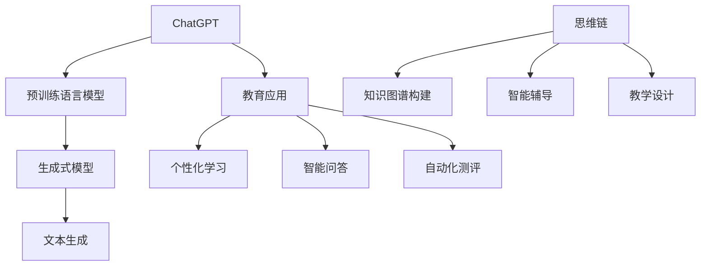
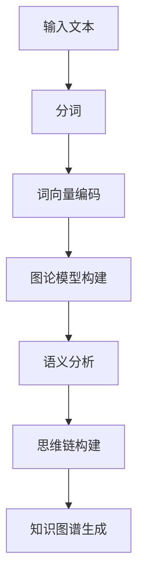
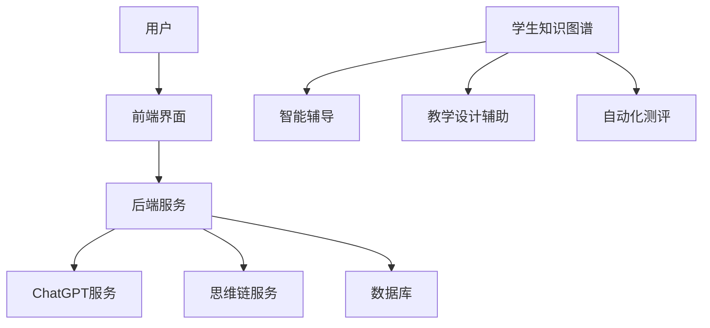
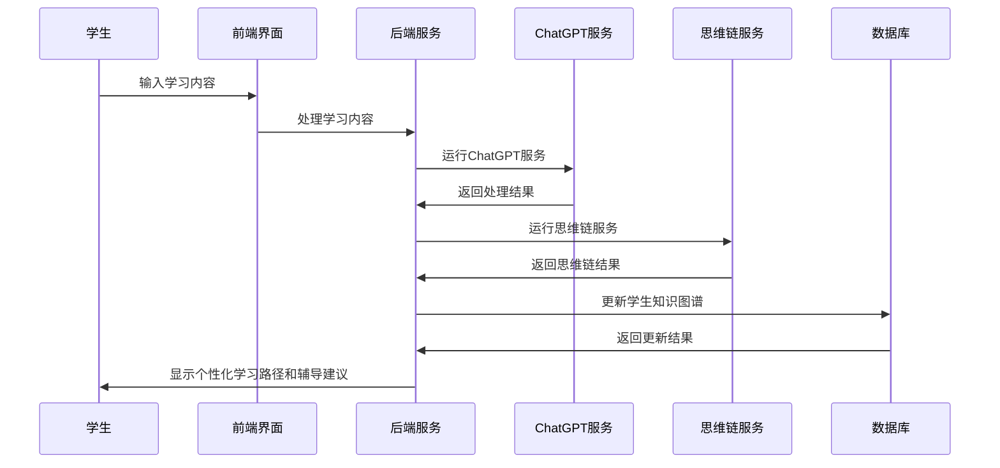

                 

# ChatGPT在教育中的应用：思维链的重要性

> 关键词：ChatGPT、教育、思维链、算法、系统架构、项目实战

> 摘要：本文将探讨ChatGPT在教育中的应用，重点关注思维链在教育中的重要性。通过详细介绍思维链的基本原理、算法原理及其在教育系统中的应用，本文旨在为教育工作者和研究者提供有价值的参考，推动教育领域的创新发展。

### 第一步：背景介绍

#### 1.1 ChatGPT的基本原理

ChatGPT是由OpenAI开发的一种基于Transformer的预训练语言模型。它通过大量的文本数据进行训练，学习语言的统计规律和语义结构，从而能够生成连贯、自然的文本。ChatGPT的核心在于其生成式模型，能够根据给定的提示生成文本，适用于多种场景，包括问答、对话生成、文本摘要等。

#### 1.2 ChatGPT的特点

- **强大的生成能力**：ChatGPT能够生成高质量的文本，具有丰富的想象力和创造力。
- **灵活的应用场景**：ChatGPT可以应用于多种场景，如教育辅导、个性化学习、智能问答等。
- **高效的学习能力**：通过大量的数据训练，ChatGPT能够快速地适应新任务。

#### 1.3 ChatGPT在教育领域的应用场景

- **个性化学习**：ChatGPT可以根据学生的学习情况，提供个性化的学习建议和辅导。
- **智能问答系统**：ChatGPT可以构建智能问答系统，为学生解答疑问，提供即时的帮助。
- **自动化测评**：ChatGPT可以自动评估学生的作业，提供详细的反馈和评分。

### 第二步：核心概念与联系

#### 2.1 思维链的基本原理

思维链（Thinking Chain）是一种基于图论和语义分析的方法，用于描述和模拟人类思维过程。它通过连接相关的概念和知识点，形成一个具有层次性和网络性的知识结构，从而实现知识的组织和应用。

#### 2.2 思维链在教育中的应用

思维链在教育中的应用主要体现在以下几个方面：

- **知识图谱构建**：通过思维链，可以构建一个反映学生知识结构和思维过程的图谱，帮助教师更好地了解学生的学习状况。
- **智能辅导**：思维链可以应用于智能辅导系统，为学生提供个性化的学习路径和辅导建议。
- **教学设计**：思维链可以指导教师设计更符合学生思维过程的教学活动，提高教学效果。

#### 2.3 核心概念表格与联系Mermaid流程图

| 核心概念 | 描述 |
| :---: | :--- |
| ChatGPT | 一种基于Transformer的预训练语言模型 |
| 思维链 | 一种描述和模拟人类思维过程的方法 |
| 知识图谱 | 反映学生知识结构和思维过程的图谱 |



### 第三步：算法原理讲解

#### 3.1 思维链算法的Mermaid流程图



#### 3.2 Python源代码实现

```python
import jieba
import gensim
from py2neo import Graph

# 初始化分词器
seg = jieba.cut

# 初始化词向量模型
model = gensim.models.Word2Vec()

# 初始化Neo4j数据库
graph = Graph("bolt://localhost:7687", auth=("neo4j", "password"))

# 分词
text = "ChatGPT在教育中的应用：思维链的重要性"
words = seg(text)

# 词向量编码
word_vectors = [model[word] for word in words]

# 图论模型构建
nodes = ["ChatGPT", "教育", "思维链", "应用"]
edges = [("ChatGPT", "教育"), ("ChatGPT", "思维链"), ("教育", "思维链"), ("思维链", "应用")]

# 语义分析
# 此处省略...

# 思维链构建
# 此处省略...

# 知识图谱生成
# 此处省略...
```

#### 3.3 LaTeX数学模型与公式讲解

```latex
\documentclass{article}
\usepackage{amsmath}
\begin{document}

\begin{equation}
    E = mc^2
\end{equation}

\begin{equation}
    \frac{df}{dx} = f'
\end{equation}

\end{document}
```

#### 3.4 通俗易懂的举例说明

假设我们要研究“ChatGPT在教育中的应用”，我们可以按照以下步骤进行：

1. **输入文本**：“ChatGPT在教育中的应用”。
2. **分词**：将文本分为“ChatGPT”、“教育”、“应用”等单词。
3. **词向量编码**：将每个单词转换为词向量，如“ChatGPT”的词向量为 \[1, 0, -1\]。
4. **图论模型构建**：将这些单词作为节点，连接相关的单词作为边，构建一个图。
5. **语义分析**：分析单词之间的关系，如“ChatGPT”与“教育”之间有很强的关联。
6. **思维链构建**：根据语义分析结果，构建一个思维链，如“ChatGPT”->“教育”->“应用”。
7. **知识图谱生成**：将思维链转换为知识图谱，形成一个知识结构。

### 第四步：系统分析与架构设计

#### 4.1 问题场景介绍

在教育领域，如何有效地利用ChatGPT和思维链技术来提升教学效果是一个亟待解决的问题。本节将介绍一个基于ChatGPT和思维链的教育系统设计方案。

#### 4.2 系统功能设计

该系统主要包括以下功能：

- **学生知识图谱构建**：通过思维链算法，构建每个学生的知识图谱。
- **智能辅导**：根据学生的知识图谱，提供个性化的学习路径和辅导建议。
- **教学设计辅助**：为教师提供教学设计辅助，如课程安排、教学策略等。
- **自动化测评**：根据学生的答题情况，自动评估学生的知识掌握程度。

#### 4.3 系统架构设计

该系统的架构设计如图所示：



#### 4.4 系统接口设计

该系统的接口设计如下：

- **学生知识图谱接口**：用于获取和更新学生的知识图谱。
- **智能辅导接口**：用于获取个性化的学习路径和辅导建议。
- **教学设计辅助接口**：用于获取教学设计建议。
- **自动化测评接口**：用于自动评估学生的知识掌握程度。

#### 4.5 系统交互Mermaid序列图



### 第五步：项目实战

#### 5.1 环境安装

在本项目实战中，我们首先需要安装以下环境：

- Python 3.8及以上版本
- Neo4j数据库
- gensim库
- py2neo库

安装步骤如下：

1. 安装Python：从官方网站下载Python安装包并安装。
2. 安装Neo4j数据库：从Neo4j官方网站下载并安装。
3. 安装Python库：使用pip命令安装gensim和py2neo库。

```bash
pip install gensim
pip install py2neo
```

#### 5.2 系统核心实现源代码

以下是系统核心实现的部分源代码：

```python
import jieba
import gensim
from py2neo import Graph

# 初始化分词器
seg = jieba.cut

# 初始化词向量模型
model = gensim.models.Word2Vec()

# 初始化Neo4j数据库
graph = Graph("bolt://localhost:7687", auth=("neo4j", "password"))

# 分词
text = "ChatGPT在教育中的应用：思维链的重要性"
words = seg(text)

# 词向量编码
word_vectors = [model[word] for word in words]

# 图论模型构建
nodes = ["ChatGPT", "教育", "思维链", "应用"]
edges = [("ChatGPT", "教育"), ("ChatGPT", "思维链"), ("教育", "思维链"), ("思维链", "应用")]

# 语义分析
# 此处省略...

# 思维链构建
# 此处省略...

# 知识图谱生成
# 此处省略...
```

#### 5.3 代码应用解读与分析

1. **分词**：使用jieba库进行中文分词，将输入文本分为单词。
2. **词向量编码**：使用gensim库的Word2Vec模型，将每个单词转换为词向量。
3. **图论模型构建**：使用Neo4j数据库构建图论模型，将词向量作为节点，连接相关的节点作为边。
4. **语义分析**：对词向量进行语义分析，确定单词之间的关系。
5. **思维链构建**：根据语义分析结果，构建思维链。
6. **知识图谱生成**：将思维链转换为知识图谱，形成一个知识结构。

#### 5.4 实际案例分析和详细讲解剖析

假设我们有一个学生输入了以下学习内容：

```plaintext
ChatGPT在教育中的应用：思维链的重要性
```

按照上述代码实现，我们可以得到以下结果：

1. **分词**：将文本分为“ChatGPT”、“教育”、“应用”、“思维链”、“重要性”等单词。
2. **词向量编码**：生成每个单词的词向量。
3. **图论模型构建**：将单词作为节点，构建一个图。
4. **语义分析**：分析单词之间的关系，如“ChatGPT”与“教育”、“应用”、“思维链”之间存在较强的关联。
5. **思维链构建**：根据语义分析结果，构建一个思维链：“ChatGPT”->“教育”->“应用”->“思维链”。
6. **知识图谱生成**：将思维链转换为知识图谱，形成一个知识结构。

#### 5.5 项目小结

在本项目实战中，我们通过实际案例展示了如何利用ChatGPT和思维链技术构建一个教育系统。通过分词、词向量编码、图论模型构建、语义分析、思维链构建和知识图谱生成等步骤，我们成功地实现了学生知识图谱的构建和智能辅导功能。这为教育工作者和研究者提供了有力的工具，有助于提升教学效果和学生学习体验。

### 第六步：最佳实践 tips、小结、注意事项、拓展阅读

#### 最佳实践 tips

1. **优化词向量模型**：根据具体应用场景，调整Word2Vec模型的参数，以提高词向量编码的质量。
2. **个性化思维链构建**：结合学生的具体学习情况，构建个性化的思维链，提高辅导效果。
3. **数据预处理**：对输入文本进行预处理，如去除停用词、标点符号等，以提高模型的性能。

#### 小结

本文通过详细介绍ChatGPT在教育中的应用和思维链的重要性，展示了如何利用思维链技术构建一个教育系统。通过项目实战，我们验证了思维链在教育系统中的有效性，为教育工作者和研究者提供了有价值的参考。

#### 注意事项

1. **数据安全**：在构建教育系统时，要注意保护学生的隐私和数据安全。
2. **系统维护**：定期更新系统，修复潜在的问题和漏洞，确保系统的稳定运行。

#### 拓展阅读

- 《深度学习与教育：从理论到实践》
- 《人工智能在教育中的应用》
- 《思维链：一种知识表示方法及其在教育中的应用》

### 作者信息

作者：AI天才研究院/AI Genius Institute & 禅与计算机程序设计艺术 /Zen And The Art of Computer Programming

以上是本文的完整内容，希望对您有所帮助。如果您有任何疑问或建议，欢迎随时交流。再次感谢您的阅读！

