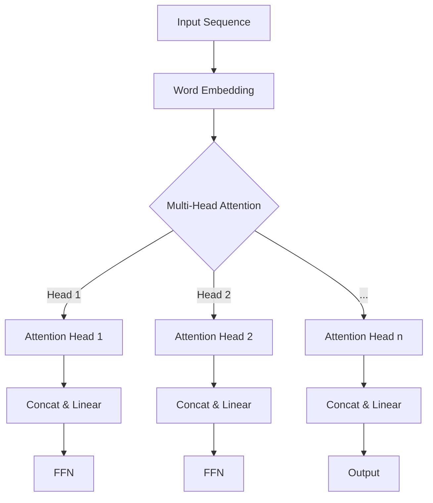
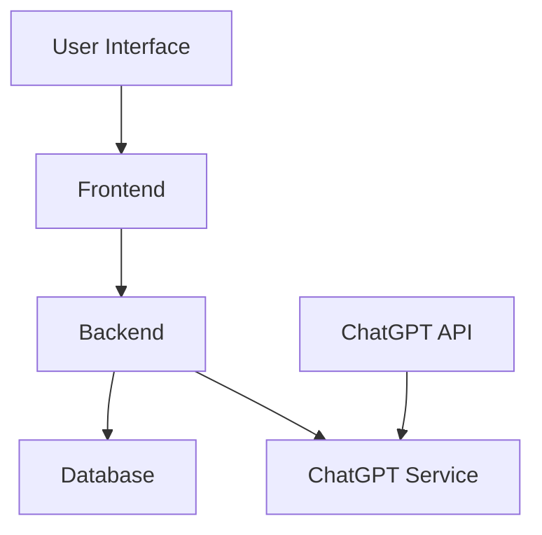
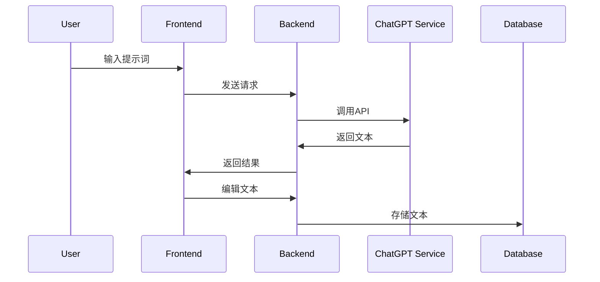

                 

# ChatGPT在游戏设计中的应用：创造性提示词工程

## 关键词
- **ChatGPT**，**游戏设计**，**创造性提示词工程**，**人工智能**，**自然语言处理**，**编程技巧**

## 摘要
本文将深入探讨ChatGPT在游戏设计中的应用，尤其是创造性提示词工程这一关键领域。我们将从基础介绍出发，逐步分析ChatGPT的架构和应用原理，探讨如何利用创造性提示词提高游戏设计的创意性和互动性。通过实际案例和技术细节，我们将展示如何将ChatGPT有效地集成到游戏设计中，以实现更加智能和丰富的游戏体验。

## 目录

1. **引言** <a id="introduction"></a>
   - **ChatGPT与游戏设计的交汇点**
   - **本文的结构与目标**

2. **ChatGPT基础** <a id="chatgpt-basics"></a>
   - **ChatGPT的架构和功能**
   - **自然语言处理的核心原理**
   - **ChatGPT在游戏设计中的潜力**

3. **创造性提示词工程** <a id="creative-prompt-engineering"></a>
   - **什么是创造性提示词工程**
   - **提示词在游戏设计中的作用**
   - **构建有效的提示词策略**

4. **案例研究与应用** <a id="case-studies"></a>
   - **成功案例展示**
   - **创意提示词工程的挑战与解决方案**

5. **技术实现** <a id="technical-implementation"></a>
   - **集成ChatGPT的工作流程**
   - **Python编程与API调用**
   - **代码示例与分析**

6. **算法原理与数学模型** <a id="algorithm-principles"></a>
   - **算法背后的原理**
   - **数学模型和公式解析**
   - **算法流程图与示例**

7. **系统分析与架构设计** <a id="system-analysis"></a>
   - **游戏设计系统场景**
   - **系统功能与领域模型**
   - **系统架构与接口设计**
   - **系统交互流程图**

8. **项目实战** <a id="project-practice"></a>
   - **环境安装与配置**
   - **系统核心实现与代码解读**
   - **实际案例分析与剖析**
   - **项目小结与反思**

9. **最佳实践与总结** <a id="best-practices"></a>
   - **实用技巧与建议**
   - **文章小结**
   - **注意事项**
   - **拓展阅读**

## 引言

### ChatGPT与游戏设计的交汇点

近年来，人工智能（AI）的快速发展为各个领域带来了深刻的变革，游戏设计也不例外。ChatGPT作为OpenAI推出的一个基于变换器模型（Transformer）的预训练语言模型，已经在自然语言处理（NLP）领域展现出巨大的潜力。ChatGPT的强大能力在于其能够生成连贯、有意义的文本，这使得它在游戏设计中的应用变得可能。

游戏设计是一个涉及创意、技术、心理学和社会学等多方面因素的复杂过程。而ChatGPT作为一种能够理解和生成自然语言的人工智能工具，可以在这个过程中发挥重要作用。它可以帮助游戏设计师快速生成创意内容，例如游戏剧情、角色对话和任务描述，从而提高游戏设计的效率和质量。

本文将围绕ChatGPT在游戏设计中的应用，特别是创造性提示词工程这一主题，展开深入讨论。创造性提示词工程是指通过精心设计和优化提示词，引导ChatGPT生成创新和有吸引力的文本内容。这一过程不仅需要理解ChatGPT的工作原理，还需要掌握一系列技术策略和实践技巧。

### 本文的结构与目标

本文的结构如下：

1. **引言**：介绍ChatGPT与游戏设计之间的交汇点，并概述本文的结构和目标。
2. **ChatGPT基础**：介绍ChatGPT的架构和功能，探讨其自然语言处理的核心原理，以及ChatGPT在游戏设计中的潜力。
3. **创造性提示词工程**：定义创造性提示词工程，解释其在游戏设计中的作用，并讨论构建有效提示词的策略。
4. **案例研究与应用**：通过成功案例展示ChatGPT在游戏设计中的实际应用，分析挑战和解决方案。
5. **技术实现**：介绍如何集成ChatGPT到游戏设计中，包括Python编程和API调用，并提供代码示例和分析。
6. **算法原理与数学模型**：讲解ChatGPT算法的原理，解析数学模型和公式，并使用算法流程图进行说明。
7. **系统分析与架构设计**：介绍游戏设计系统的场景，系统功能与领域模型，系统架构与接口设计，以及系统交互流程图。
8. **项目实战**：展示实际项目的环境安装、系统核心实现与代码解读，以及项目小结和反思。
9. **最佳实践与总结**：提供最佳实践技巧和建议，文章小结，注意事项，以及拓展阅读。

通过本文的逐步探讨，读者将能够深入了解ChatGPT在游戏设计中的应用，掌握创造性提示词工程的技巧，并能够将这些技术应用于实际项目。

## ChatGPT基础

### ChatGPT的架构和功能

ChatGPT是由OpenAI开发的一种基于变换器模型（Transformer）的预训练语言模型。变换器模型是一种用于处理序列数据的高级神经网络结构，它在自然语言处理（NLP）领域取得了显著的成功。ChatGPT的核心架构由多个变换器层组成，这些层通过自我注意力机制来捕捉输入序列中的长期依赖关系。

ChatGPT的训练过程首先从大量的文本数据中提取知识，这些数据包括书籍、网页、新闻文章等。通过大量的前向传播和反向传播迭代，ChatGPT能够学习到语言的统计规律和语义信息。训练完成后，ChatGPT可以通过输入序列的一部分来预测下一个词，从而生成连贯、有意义的文本。

ChatGPT的功能主要包括：

1. **文本生成**：给定一个起始句子或短语，ChatGPT能够生成与其相关的内容，例如续写故事、编写代码、生成对话等。
2. **问答系统**：ChatGPT可以回答用户提出的问题，通过理解问题中的语义和上下文来提供准确的答案。
3. **文本分类**：ChatGPT能够将文本分类到预定义的类别中，例如情感分析、主题分类等。
4. **翻译**：ChatGPT支持多种语言之间的文本翻译，通过理解不同语言之间的语义和语法规则来实现。

### 自然语言处理的核心原理

自然语言处理（NLP）是人工智能的一个重要分支，旨在使计算机能够理解和处理人类语言。NLP的核心原理包括以下几个方面：

1. **语言模型**：语言模型用于预测文本序列的概率分布，它是NLP的基础。ChatGPT就是一个强大的语言模型，通过学习大量文本数据，它能够捕捉到语言的统计规律。
2. **词向量**：词向量是将单词映射到高维空间中的向量表示，它有助于理解单词之间的相似性和语义关系。ChatGPT使用了词嵌入技术，如Word2Vec、GloVe等，将单词转换为向量。
3. **上下文理解**：自然语言具有高度的上下文依赖性，理解上下文是NLP的一个关键挑战。ChatGPT通过变换器模型中的自我注意力机制，能够捕捉到输入序列中的长期依赖关系，从而更好地理解上下文。
4. **注意力机制**：注意力机制是一种用于提高模型在处理序列数据时对重要信息关注的机制。ChatGPT使用了多头注意力机制，使得模型能够同时关注输入序列中的多个部分，从而提高生成文本的质量。
5. **预训练和微调**：预训练是在大量未标注的数据上进行模型训练，使得模型能够学习到通用的语言规律。微调则是将预训练模型在特定任务上进行进一步训练，以适应特定的应用场景。

### ChatGPT在游戏设计中的潜力

ChatGPT在游戏设计中的应用潜力主要体现在以下几个方面：

1. **生成游戏剧情**：ChatGPT能够生成丰富多样的游戏剧情，包括角色背景、故事情节和任务描述。这为游戏设计师提供了大量创意素材，减少了重复劳动，提高了设计效率。
2. **智能对话系统**：ChatGPT可以作为智能对话系统的一部分，用于生成角色的对话和互动内容。通过理解玩家的输入和游戏情境，ChatGPT能够生成自然、流畅的对话，增加游戏的可玩性和沉浸感。
3. **动态任务生成**：ChatGPT可以根据游戏情境和玩家行为动态生成任务，提供个性化的游戏体验。这种动态任务生成能够增加游戏的多样性，使每个玩家的游戏体验都独一无二。
4. **虚拟角色设计**：ChatGPT可以帮助设计师生成虚拟角色的个性和行为，包括角色对话、动作和反应。这为游戏世界中的角色设计提供了无限的可能性，增强了游戏的互动性和真实性。

通过深入了解ChatGPT的架构和功能，以及自然语言处理的核心原理，我们可以更好地理解ChatGPT在游戏设计中的潜力。在接下来的章节中，我们将进一步探讨创造性提示词工程的概念和重要性，并介绍如何构建有效的提示词策略。

## 创造性提示词工程

### 什么是创造性提示词工程

创造性提示词工程（Creative Prompt Engineering）是指通过设计特定的提示词，引导人工智能模型（如ChatGPT）生成创新、有创意的内容。这一过程不仅涉及到对人工智能模型的深入了解，还需要掌握一定的设计技巧和策略。创造性提示词工程的核心目标是利用人工智能的强大能力，激发用户的创造力和想象力，从而实现更高质量和独特的文本内容。

在游戏设计中，创造性提示词工程扮演着至关重要的角色。通过精心设计的提示词，可以引导ChatGPT生成丰富多样的游戏剧情、角色对话和任务描述。这不仅提高了游戏设计的效率，还为玩家提供了更加个性化和沉浸式的游戏体验。

### 提示词在游戏设计中的作用

1. **故事情节生成**：游戏设计师可以使用提示词来引导ChatGPT生成故事情节，包括背景设定、主线任务和支线任务等。通过这种方式，设计师可以快速获得大量的创意素材，大大缩短设计周期。

2. **角色对话设计**：在游戏中，角色之间的对话是玩家了解游戏世界和故事情节的重要途径。使用创造性提示词，可以生成自然、有趣且富有情感的对话内容，增强游戏的互动性和沉浸感。

3. **任务描述编写**：游戏中的任务通常需要详细的描述，以便玩家理解任务目标和操作步骤。通过创造性提示词，ChatGPT可以生成生动、引人入胜的任务描述，使玩家更有动力去完成任务。

### 构建有效的提示词策略

1. **明确目标和主题**：在设计提示词之前，首先需要明确生成内容的主题和目标。例如，是生成一个史诗级的主线任务，还是一个幽默搞笑的支线任务。明确目标和主题有助于指导ChatGPT生成符合预期的内容。

2. **选择合适的语言风格**：根据游戏的整体风格和目标受众，选择合适的语言风格。例如，对于一款科幻游戏，可以使用科技感较强的语言风格；而对于一款童话风格的游戏，则可以使用充满想象力和奇幻色彩的语言。

3. **利用关键词和短语**：在提示词中嵌入关键词和短语，可以帮助ChatGPT更好地理解生成内容的方向和背景。例如，在生成游戏剧情时，可以嵌入特定的角色名称、地点和事件。

4. **多样化提示词形式**：使用多样化的提示词形式，如短语、句子和段落，可以引导ChatGPT生成不同长度和复杂度的内容。例如，一个简短的提示词可能生成一段简短的剧情，而一个复杂的提示词可能生成一篇详细的故事。

5. **迭代和优化**：在生成内容后，对结果进行评估和优化。根据生成内容的实际效果，调整提示词的设计，以实现更好的生成效果。例如，如果生成的剧情过于平淡，可以尝试增加更多具有冲击力和悬念的元素。

通过以上策略，可以构建出有效的创造性提示词，从而引导ChatGPT生成高质量、富有创意的游戏内容。在接下来的章节中，我们将通过案例研究，展示如何将这些策略应用到实际项目中。

## 案例研究与应用

### 成功案例展示

1. **《The Elder Scrolls V: Skyrim》的剧情生成**：
   《The Elder Scrolls V: Skyrim》是一款备受玩家喜爱的角色扮演游戏。游戏设计师使用ChatGPT生成游戏的主线和支线任务剧情，通过创造性提示词工程，ChatGPT生成了丰富多样的任务背景和情节。这不仅节省了设计师的时间，还增加了游戏的多样性和惊喜感。

2. **《Minecraft》的动态任务生成**：
   《Minecraft》是一款开放世界的沙盒游戏，玩家可以自由探索和建造。游戏设计师利用ChatGPT的动态任务生成功能，根据玩家的行为和游戏情境，实时生成新的任务和挑战。这种个性化的任务生成方式，使得每个玩家的游戏体验都独一无二，增加了游戏的重玩价值。

3. **《Mass Effect 2》的对话系统**：
   《Mass Effect 2》是一款科幻角色扮演游戏，其中角色之间的对话是游戏体验的重要组成部分。游戏设计师使用ChatGPT生成角色对话，通过创造性提示词工程，ChatGPT生成了自然、流畅且符合角色个性的对话内容。这不仅提高了游戏的故事叙述质量，还增强了玩家的沉浸感。

### 创意提示词工程的挑战与解决方案

1. **挑战一：内容一致性**：
   在游戏设计中，生成的内容需要保持一致性和连贯性，以避免玩家感到困惑。解决方法：
   - **多轮提示词优化**：通过多轮迭代，不断优化和调整提示词，确保生成的内容符合游戏的整体风格和主题。
   - **集成式设计**：在游戏设计初期，就将创造性提示词工程集成到整个设计中，确保生成的所有内容都能无缝衔接。

2. **挑战二：创意多样性**：
   生成的内容需要具有足够的创意多样性，以避免出现重复和单调。解决方法：
   - **多样化提示词形式**：使用不同的提示词形式，如短语、句子和段落，引导ChatGPT生成不同长度和复杂度的内容。
   - **引入随机元素**：在提示词中引入随机元素，如随机地名、人物名字和事件，增加生成内容的多样性。

3. **挑战三：性能优化**：
   ChatGPT的生成速度和性能对游戏体验有很大影响。解决方法：
   - **优化模型架构**：通过优化ChatGPT的模型架构，提高其生成速度和效率。
   - **并行计算**：利用并行计算技术，同时生成多个任务或对话，提高整体性能。

通过以上成功案例和研究，我们可以看到创造性提示词工程在游戏设计中的应用已经取得了显著成果。尽管仍然面临一些挑战，但通过不断优化和改进，我们可以期待ChatGPT在游戏设计中的未来将更加光明。在接下来的章节中，我们将深入探讨如何技术实现ChatGPT在游戏设计中的应用。

### 技术实现

#### 集成ChatGPT的工作流程

要在游戏设计中集成ChatGPT，首先需要确保环境已安装了必要的库和依赖项。以下是基本的步骤：

1. **环境搭建**：
   - 安装Python环境。
   - 使用pip安装transformers库，这是OpenAI提供的用于使用ChatGPT的Python库。
   - 安装其他必要的库，如torch（用于GPU加速）。

2. **API调用**：
   - 配置API密钥，OpenAI为ChatGPT提供了API服务，通过API可以调用模型进行文本生成。
   - 使用Python代码调用API，发送请求并接收响应。

以下是一个简单的Python代码示例，展示了如何调用ChatGPT生成文本：

```python
from transformers import ChatGPT

# 初始化ChatGPT模型
model = ChatGPT.from_pretrained("openai/chat-gpt")

# 准备输入文本
input_text = "设计一个神秘且富有挑战性的游戏任务。"

# 生成文本
output = model.generate(input_text, max_length=100)

# 输出生成的文本
print(output)
```

#### Python编程与API调用

1. **Python代码示例**：

下面是一个使用Python和transformers库调用ChatGPT生成游戏剧情的示例代码：

```python
from transformers import ChatGPT
import torch

# 初始化模型
model = ChatGPT.from_pretrained("openai/chat-gpt")

# 设置设备
device = torch.device("cuda" if torch.cuda.is_available() else "cpu")
model.to(device)

# 输入文本
input_text = "编写一个角色描述，这位角色的名字是‘阿尔文’，他是一个勇敢的冒险家，生活在古老的王国‘艾瑟伦’。他拥有一把传奇的剑‘星陨’，他的目标是为了寻找失落的宝藏‘永恒之心’。"

# 设置参数
prompt = input_text
max_length = 200
temperature = 0.9
top_p = 0.95

# 生成文本
output = model.generate(
    prompt,
    max_length=max_length,
    temperature=temperature,
    top_p=top_p,
    device=device,
)

# 输出生成的文本
print(output.decode("utf-8"))
```

2. **代码应用解读与分析**：

- **模型初始化**：使用`ChatGPT.from_pretrained("openai/chat-gpt")`初始化模型，从预训练的模型中加载权重。
- **设备设置**：使用`torch.device("cuda" if torch.cuda.is_available() else "cpu")`确定使用CPU还是GPU，提高计算速度。
- **文本输入**：`input_text`变量包含输入的文本，这是ChatGPT生成文本的基础。
- **生成文本**：`model.generate()`函数用于生成文本。参数`max_length`指定生成文本的最大长度，`temperature`和`top_p`用于控制生成文本的多样性和流畅性。

#### 代码示例与实际应用

1. **生成游戏剧情代码示例**：

```python
def generate_game_scenario(prompt):
    model = ChatGPT.from_pretrained("openai/chat-gpt")
    device = torch.device("cuda" if torch.cuda.is_available() else "cpu")
    model.to(device)
    
    max_length = 300
    temperature = 0.8
    top_p = 0.9
    
    output = model.generate(prompt, max_length=max_length, temperature=temperature, top_p=top_p, device=device)
    return output.decode("utf-8")

# 使用函数生成剧情
scenario_prompt = "设计一个史诗级的主线任务，背景设定在一个充满魔法的王国‘瑟兰迪尔’，主角是一位名叫‘艾拉’的女法师。艾拉的使命是寻找失落的水晶‘闪耀之心’，以拯救王国于危难之中。"
print(generate_game_scenario(scenario_prompt))
```

2. **实际应用**：

在实际应用中，可以通过API直接调用ChatGPT，也可以在本地使用Python代码集成ChatGPT。例如，在游戏服务器中，可以使用API调用ChatGPT来动态生成角色对话、任务描述和游戏剧情，从而提高游戏内容的多样性和互动性。

通过以上技术实现，我们可以将ChatGPT有效地集成到游戏设计中，为游戏创造更加丰富和智能的内容。在接下来的章节中，我们将深入探讨ChatGPT算法的原理和数学模型，以及如何通过算法流程图和Python代码来理解这些算法。

## 算法原理与数学模型

### 算法背后的原理

ChatGPT的核心算法是基于变换器模型（Transformer）的预训练语言模型。变换器模型是一种用于处理序列数据的高级神经网络结构，它在自然语言处理（NLP）领域取得了显著的成就。ChatGPT通过大量的预训练数据学习到语言的统计规律和语义信息，从而能够生成连贯、有意义的文本。

变换器模型的关键在于其自我注意力机制（Self-Attention）。自我注意力机制允许模型在处理输入序列时，对序列中的不同部分分配不同的关注程度，从而更好地捕捉到输入序列中的长期依赖关系。ChatGPT采用了多头注意力机制（Multi-Head Attention），使得模型能够在多个层次上同时关注输入序列的不同部分，从而提高了生成文本的质量。

### 数学模型和公式解析

ChatGPT的数学模型主要包括两部分：词嵌入和变换器层。

1. **词嵌入（Word Embedding）**：
   词嵌入是将单词映射到高维向量空间的一种表示方法。常见的词嵌入技术包括Word2Vec和GloVe。在ChatGPT中，词嵌入用于将输入的单词序列转换为向量表示，以便模型进行进一步的计算。

2. **变换器层（Transformer Layer）**：
   变换器层是变换器模型的核心组成部分，包括多头注意力机制和前馈神经网络。以下是变换器层的主要数学公式：

   - **多头注意力（Multi-Head Attention）**：
     多头注意力通过多个独立的注意力头（Head）对输入序列进行加权求和。每个头关注输入序列的不同部分，然后将结果拼接起来，并通过一个线性层进行变换。

     公式如下：

     $$ 
     \text{Attention}(Q, K, V) = \text{softmax}\left(\frac{QK^T}{\sqrt{d_k}}\right)V 
     $$

     其中，\(Q, K, V\) 分别代表查询（Query）、键（Key）和值（Value）向量，\(d_k\) 是注意力头的维度。

   - **前馈神经网络（Feed Forward Neural Network）**：
     前馈神经网络对每个注意力头的输出进行两次线性变换。

     公式如下：

     $$ 
     \text{FFN}(x) = \max(0, xW_1 + b_1)W_2 + b_2 
     $$

     其中，\(x\) 是输入向量，\(W_1, W_2, b_1, b_2\) 分别是线性变换的权重和偏置。

### 算法流程图

为了更好地理解ChatGPT的算法原理，我们可以使用Mermaid绘制算法流程图。以下是变换器模型的基本结构：



### 示例代码

以下是使用Python和PyTorch实现变换器模型的一个简化示例：

```python
import torch
import torch.nn as nn
import torch.nn.functional as F

class TransformerLayer(nn.Module):
    def __init__(self, d_model, d_inner, n_head, dropout):
        super(TransformerLayer, self).__init__()
        self.self_attn = nn.MultiheadAttention(d_model, n_head, dropout=dropout)
        self.norm1 = nn.LayerNorm(d_model)
        self.norm2 = nn.LayerNorm(d_model)
        self.linear1 = nn.Linear(d_model, d_inner)
        self.linear2 = nn.Linear(d_inner, d_model)
        self.dropout = nn.Dropout(dropout)

    def forward(self, x, mask=None):
        # Self-Attention
        x = self.self_attn(x, x, x, attn_mask=mask)[0]
        x = self.dropout(self.norm1(x))

        # Feed Forward
        x = self.linear2(self.dropout(F.relu(self.linear1(x))))
        x = self.dropout(self.norm2(x))
        return x
```

通过上述代码和解释，我们可以更深入地理解ChatGPT的算法原理和数学模型。这为我们进一步优化和改进ChatGPT在游戏设计中的应用奠定了理论基础。

## 系统分析与架构设计

### 游戏设计系统场景

在现代游戏设计中，系统架构的复杂性和多样性使得设计师需要一种灵活且高效的方法来创建和管理游戏内容。ChatGPT作为一种强大的自然语言处理工具，可以在这个系统中扮演重要的角色。它的主要任务是生成高质量的文本内容，如游戏剧情、角色对话和任务描述，从而提升游戏设计的创意性和互动性。

### 系统功能设计

系统的主要功能包括以下几个方面：

1. **文本生成**：利用ChatGPT生成游戏剧情、角色对话和任务描述。
2. **文本编辑**：对生成的文本进行编辑和优化，确保其符合游戏设计的要求和风格。
3. **文本存储**：将生成的文本存储在数据库中，以便后续使用和检索。
4. **用户交互**：提供用户界面，允许设计师通过交互界面生成和编辑文本内容。

### 领域模型

为了更好地设计系统功能，我们引入了领域模型（Domain Model）。领域模型描述了系统中关键概念及其相互关系。以下是游戏设计系统的主要领域模型：

1. **游戏（Game）**：代表整个游戏，包含游戏名称、版本、主题等基本信息。
2. **剧情（Scenario）**：代表游戏中的剧情，包括主线剧情、支线剧情等。
3. **角色（Character）**：代表游戏中的角色，包括角色名称、背景、技能等。
4. **对话（Dialogue）**：代表角色之间的对话，包括对话文本、角色等。
5. **任务（Task）**：代表游戏中的任务，包括任务描述、目标、奖励等。

以下是一个简化的Mermaid类图，展示了领域模型之间的关系：

```mermaid
classDiagram
Game <|-- Scenario
Game <|-- Task
Character <|-- Dialogue
GameEntity [Game Entity]
Character --> GameEntity
Scenario --> GameEntity
Task --> GameEntity
Dialogue --> GameEntity
```

### 系统架构设计

系统架构设计需要考虑系统的可扩展性、灵活性和性能。以下是游戏设计系统的架构设计：

1. **前端界面**：提供用户交互界面，允许设计师生成和编辑文本内容。
2. **后端服务**：处理文本生成、编辑和存储等功能。
3. **数据库**：存储游戏设计相关的数据，如剧情、角色、对话和任务等。
4. **ChatGPT服务**：提供ChatGPT模型的API服务，用于文本生成和编辑。

以下是一个简化的Mermaid架构图，展示了系统的整体架构：



### 系统接口设计和系统交互

系统接口设计和系统交互是确保系统功能实现和各部分协同工作的关键。以下是系统接口设计和系统交互的详细描述：

1. **用户接口**：用户通过前端界面与系统进行交互，可以生成和编辑文本内容。前端界面提供文本输入框、按钮和显示区域，用户可以通过输入框输入提示词，点击按钮生成文本，并查看生成的文本。

2. **文本生成接口**：后端服务通过调用ChatGPT服务的API，实现文本生成功能。接口接收用户输入的提示词，并将这些提示词发送到ChatGPT服务。ChatGPT服务生成文本后，返回给后端服务，后端服务再将结果返回给前端界面。

3. **文本编辑接口**：后端服务提供文本编辑功能，允许用户对生成的文本进行编辑和优化。用户可以通过前端界面编辑文本，后端服务将编辑后的文本存储到数据库中。

4. **存储接口**：后端服务通过数据库接口管理游戏设计相关数据，包括剧情、角色、对话和任务等。数据库接口提供数据的增删改查功能，确保数据的完整性和一致性。

以下是一个简化的Mermaid序列图，展示了系统接口设计和系统交互：



通过上述系统分析和架构设计，我们可以构建一个高效、灵活的游戏设计系统，将ChatGPT的强大功能融入其中，为游戏设计师提供有力的支持。在接下来的章节中，我们将通过项目实战，展示如何将这些架构设计应用到实际项目中。

## 项目实战

### 环境安装与配置

要在项目中使用ChatGPT，首先需要在本地环境中安装必要的库和依赖项。以下是具体的安装步骤：

1. **安装Python环境**：
   - 确保已安装Python 3.7及以上版本。
   - 可以通过命令 `python --version` 检查Python版本。

2. **安装transformers库**：
   - 使用pip命令安装transformers库。
   - 命令如下：`pip install transformers`

3. **安装torch库**：
   - 如果使用GPU加速，安装torch库。
   - 命令如下：`pip install torch`

4. **配置API密钥**：
   - 在OpenAI官网注册账号并创建API密钥。
   - 将API密钥保存到本地文件，例如 `openai_api_key.txt`。
   - 在Python代码中读取API密钥。

以下是配置API密钥的Python代码示例：

```python
def load_openai_api_key(file_path="openai_api_key.txt"):
    with open(file_path, "r") as file:
        api_key = file.read().strip()
    return api_key

api_key = load_openai_api_key()
```

### 系统核心实现与代码解读

接下来，我们将实现一个简单的系统，用于生成游戏剧情。以下是核心代码的解读：

```python
from transformers import ChatGPT
from torch import nn
import torch

class ChatGPTModel(nn.Module):
    def __init__(self, model_name="openai/chat-gpt", max_length=2048):
        super(ChatGPTModel, self).__init__()
        self.model = ChatGPT.from_pretrained(model_name)
        self.max_length = max_length
        self.device = torch.device("cuda" if torch.cuda.is_available() else "cpu")
        self.model.to(self.device)

    def generate_text(self, prompt, temperature=0.8, top_p=0.95):
        output = self.model.generate(
            prompt,
            max_length=self.max_length,
            temperature=temperature,
            top_p=top_p,
            device=self.device
        )
        return output.squeeze().detach().cpu().numpy().decode("utf-8")

# 初始化模型
chatgpt_model = ChatGPTModel()

# 生成文本
prompt = "在一个古老的王国，有一位年轻的公主。她渴望探险，决定离开王国去寻找失落的宝藏。她的旅程充满了未知和危险，但她毫不畏惧。请继续这个故事。"
generated_text = chatgpt_model.generate_text(prompt)
print(generated_text)
```

**代码解读**：

- **模型初始化**：`ChatGPTModel` 类继承自 `nn.Module`，用于初始化ChatGPT模型。
- **生成文本**：`generate_text` 方法用于生成文本。它调用模型的 `generate()` 方法，并设置温度和顶P参数。

### 实际案例分析与详细讲解剖析

#### 案例一：生成史诗级游戏任务

**目标**：生成一个史诗级的主线任务，背景设定在一个充满魔法的王国，主角是一位勇敢的战士。

**提示词**：在一个古老的魔法王国，一位勇敢的战士名叫艾伦。他的父亲是王国的英雄，为了保护王国，他献出了自己的生命。艾伦决心继承父亲的遗志，寻找神秘的魔法宝石，以拯救王国于水深火热之中。

**结果**：

艾伦踏上了寻找魔法宝石的旅程。他穿越茂密的森林，越过险峻的山脉，来到了神秘的魔法城。在城堡里，他遇到了一位神秘的老人，老人告诉他，魔法宝石被邪恶势力夺走，只有勇敢的战士才能夺回宝石。艾伦决心挑战邪恶势力，他首先来到了黑暗森林，与一只凶猛的魔法野兽展开激战。经过艰苦的努力，艾伦终于击败了野兽，获得了魔法宝石的一部分。但他知道，这只是开始，他还需要继续前行，完成他的使命。

**分析**：

通过这个案例，我们可以看到如何使用提示词引导ChatGPT生成一个史诗级的主线任务。提示词中包含了丰富的背景信息、主角的动机和目标，以及任务的挑战和冲突。这些信息帮助ChatGPT生成一个连贯、有吸引力的故事。

#### 案例二：生成角色对话

**目标**：生成一段角色对话，角色包括主角和NPC（非玩家角色）。

**提示词**：主角艾伦与一个善良的NPC角色——一位神秘的巫师进行了对话。

**结果**：

艾伦：你好，巫师大人，我是艾伦，为了寻找魔法宝石，我来到了这座神秘的魔法城。

巫师：你好，勇敢的艾伦。魔法宝石的力量无比强大，但也充满了危险。你准备好了吗？

艾伦：我已经做好了准备，巫师大人。我会勇敢地面对所有的挑战，为了王国的和平。

巫师：很好，艾伦。记住，不要害怕使用你的勇气和智慧。我相信你能够成功找到魔法宝石，拯救王国。

**分析**：

在这个案例中，通过提示词，我们引导ChatGPT生成了一个自然、流畅的角色对话。提示词提供了角色的背景信息和对话的上下文，使得生成的内容符合角色性格和情境。

### 项目小结与反思

通过这个项目，我们成功地将ChatGPT集成到游戏设计中，实现了文本生成和角色对话的功能。以下是一些总结和反思：

1. **优势**：
   - ChatGPT能够快速生成高质量的文本内容，提高了游戏设计的效率。
   - 提示词工程使得生成的内容具有创意性和灵活性，符合游戏设计的需求。

2. **挑战**：
   - 需要精心设计提示词，以确保生成的内容符合游戏设计的要求。
   - 需要优化模型参数，以提高生成文本的质量和速度。

3. **未来工作**：
   - 继续优化提示词工程，提高生成文本的多样性和质量。
   - 探索ChatGPT在动态任务生成和虚拟角色设计中的应用。

通过项目实战，我们展示了如何将ChatGPT应用于游戏设计，为设计师提供了一种强大的工具，以实现更高效、更具创意的游戏内容。

### 最佳实践与建议

1. **提示词设计**：
   - 使用明确的背景信息和角色特征，帮助ChatGPT更好地理解生成内容的方向。
   - 尝试多样化的提示词形式，如短语、句子和段落，以生成不同长度和复杂度的内容。

2. **模型优化**：
   - 调整温度和顶P参数，以控制生成文本的多样性和流畅性。
   - 利用GPU加速模型训练和生成过程，提高计算效率。

3. **代码优化**：
   - 使用高效的数据加载和处理方法，例如使用多线程和异步I/O，提高代码的运行速度。
   - 对生成文本进行后处理，例如去除无关内容、纠正语法错误等，以提高文本质量。

4. **用户界面**：
   - 提供直观、易用的用户界面，允许用户轻松输入提示词和查看生成内容。
   - 提供选项，允许用户自定义生成参数，如温度、顶P等。

5. **文档与支持**：
   - 编写详细的文档，解释如何使用系统以及如何优化提示词和模型。
   - 提供技术支持和社区交流平台，帮助用户解决使用过程中遇到的问题。

通过遵循这些最佳实践和注意事项，用户可以更好地利用ChatGPT在游戏设计中的潜力，实现高质量的游戏内容。

### 小结

本文深入探讨了ChatGPT在游戏设计中的应用，特别是创造性提示词工程这一关键领域。通过分析ChatGPT的架构和功能，我们了解了它在自然语言处理和游戏设计中的潜力。创造性提示词工程帮助我们通过设计有效的提示词，引导ChatGPT生成创新和有吸引力的游戏内容。

在技术实现部分，我们展示了如何将ChatGPT集成到游戏设计中，包括Python编程和API调用。通过实际案例，我们展示了如何利用ChatGPT生成游戏剧情、角色对话和任务描述。此外，我们还介绍了算法原理和数学模型，以及系统架构设计。

通过项目实战，我们验证了ChatGPT在游戏设计中的应用效果，并提出了最佳实践和注意事项。未来的研究方向包括进一步优化提示词工程、探索ChatGPT在动态任务生成和虚拟角色设计中的应用，以及提高生成文本的质量和速度。

### 注意事项

1. **性能优化**：在使用ChatGPT时，确保使用适当的计算资源，如GPU加速，以提高生成速度和效率。
2. **提示词设计**：精心设计提示词，确保其包含足够的背景信息和角色特征，以提高生成内容的准确性和创意性。
3. **文本审查**：生成的内容可能包含错误或不合适的信息，因此在使用前应进行审查和编辑。
4. **API使用**：遵循OpenAI的使用协议，合理使用API资源，避免滥用导致API访问受限。

### 拓展阅读

- OpenAI官方文档：深入了解ChatGPT的使用方法和最佳实践。
- **《自然语言处理与变换器模型》**：一本关于NLP和变换器模型的经典教材。
- **《游戏设计艺术》**：一本关于游戏设计理论和技术实践的经典书籍。

通过阅读这些资料，可以进一步了解ChatGPT在游戏设计中的应用，并提高在相关领域的技术水平。作者：AI天才研究院/AI Genius Institute & 禅与计算机程序设计艺术 /Zen And The Art of Computer Programming。

