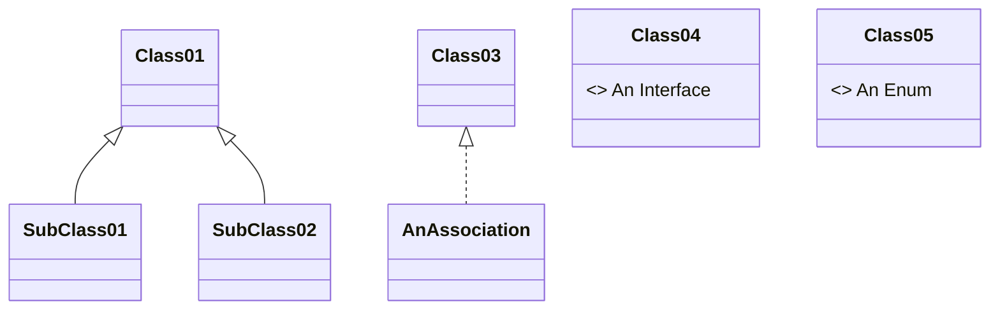
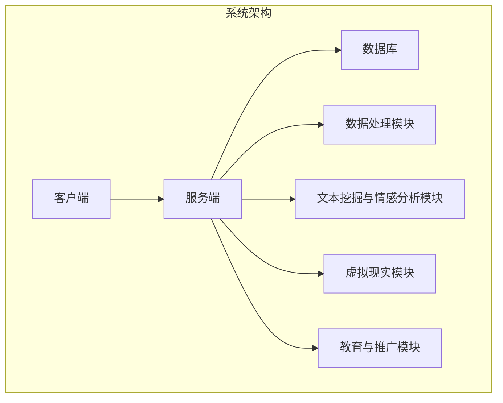
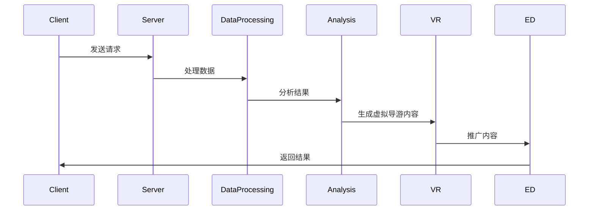

                 


### 概念与术语说明

在探讨ChatGPT在濒危文化保护中的应用之前，首先需要明确一些核心概念和术语，以便于后续内容的深入理解和分析。

**ChatGPT**：全称为Chat Generative Pre-trained Transformer，是一种基于Transformer架构的预训练语言模型，由OpenAI开发。它通过大量的文本数据进行预训练，能够生成自然流畅的语言，并具备较强的语义理解和生成能力。

**濒危文化**：指的是由于各种原因，如全球化、城市化、人口迁移、战争、自然灾害等，面临消失或严重受损的文化现象。这些文化现象可能包括语言、传统习俗、手工艺、音乐、舞蹈、建筑风格等。

**文化生态系统**：指的是一个文化现象的生存和发展环境，包括文化内容、文化传承者、文化传播渠道和文化影响者等组成部分。

**自然语言处理（NLP）**：是人工智能领域的一个分支，致力于让计算机理解和生成人类语言。NLP技术包括文本处理、语义理解、情感分析、对话系统等。

**预训练与微调**：预训练是指在大量文本数据上进行模型训练，使其掌握基础的语义和语法知识；微调则是在预训练的基础上，针对特定任务进行模型的细粒度调整。

**虚拟导游与文化遗产展示**：利用虚拟现实（VR）和增强现实（AR）技术，结合ChatGPT的对话功能，为用户提供沉浸式的文化遗产体验和互动。

**文本挖掘与情感分析**：通过分析大量文本数据，挖掘出有价值的信息，并评估文本的情感倾向。

**教育与推广**：利用ChatGPT进行文化知识的传播和普及，提高公众对濒危文化的认识和保护意识。

### 问题背景

在全球化和现代化的浪潮下，许多濒危文化正面临严重威胁。这些文化现象不仅承载着人类的历史记忆和智慧，也是人类文明多样性的体现。因此，保护濒危文化已成为一个重要的全球性议题。

然而，传统的文化保护手段往往受到资源、时间和技术限制，难以全面有效地保护这些文化遗产。在此背景下，人工智能，特别是ChatGPT这样的自然语言处理技术，为濒危文化的保护提供了一种新的可能。

ChatGPT的强大语义理解和生成能力，使其能够处理和分析大量文化文本数据，从而挖掘出有价值的信息。此外，ChatGPT还可以通过虚拟导游和文化遗产展示，为公众提供沉浸式的文化体验，提高人们对濒危文化的认识和重视。

### 问题描述

濒危文化保护面临的主要问题可以归纳为以下几点：

1. **数据获取困难**：许多濒危文化资料分散在各地，且多为手写或口头传承，难以系统化整理和存储。

2. **保护成本高**：传统的保护手段需要大量的人力、物力和财力投入，且效率较低。

3. **公众意识不足**：由于缺乏对濒危文化的了解，公众对文化保护的参与度和支持度较低。

4. **传承与创新的平衡**：在保护濒危文化的同时，如何平衡传统与现代，实现文化的创新与发展，是一个难题。

5. **技术瓶颈**：尽管人工智能在文化保护中的应用前景广阔，但实际应用中仍存在许多技术瓶颈，如数据质量、算法效率和模型解释性等。

### 问题解决

针对上述问题，ChatGPT在濒危文化保护中的应用提供了以下解决方案：

1. **数据整理与挖掘**：ChatGPT可以通过自然语言处理技术，对大量文化文本数据进行自动整理和标注，提高数据质量。

2. **降低保护成本**：利用ChatGPT进行自动化分析和管理，减少人力成本。此外，ChatGPT的预训练模型可以在多种平台上部署，降低硬件成本。

3. **提升公众意识**：通过虚拟导游和文化遗产展示，ChatGPT可以吸引更多人关注和参与濒危文化的保护。

4. **传承与创新的平衡**：ChatGPT可以帮助文化传承者进行知识积累和传播，同时通过文本生成技术，实现文化的创新。

5. **技术突破**：通过不断优化算法和模型，ChatGPT在文化保护中的应用将更加广泛和深入。

### 边界与外延

尽管ChatGPT在濒危文化保护中具有巨大的潜力，但其应用也受到一定限制：

- **数据质量**：ChatGPT的性能高度依赖于输入数据的质量。因此，在应用中需要确保数据的准确性和完整性。

- **算法效率**：随着数据规模和复杂度的增加，算法效率和计算资源成为关键问题。因此，需要不断优化算法，提高其效率。

- **模型解释性**：尽管ChatGPT在语义理解和生成方面表现出色，但其内部决策过程缺乏透明度，这对文化保护中的决策应用带来一定挑战。

- **伦理和隐私**：在应用ChatGPT进行文化保护时，需要确保用户数据的隐私和安全。

- **地域与文化差异**：不同地区的文化差异可能影响ChatGPT的适用性。因此，需要针对具体文化背景进行模型调整和优化。

### 概念结构与核心要素组成

为了更清晰地理解ChatGPT在濒危文化保护中的应用，我们可以将其核心概念和要素组成进行分析。

**核心概念**：

- **ChatGPT**：预训练语言模型
- **自然语言处理（NLP）**：文本处理、语义理解、情感分析
- **虚拟导游与文化遗产展示**：VR/AR技术
- **文本挖掘与情感分析**：信息挖掘、情感评估
- **教育与推广**：知识传播、意识提升

**核心要素组成**：

1. **数据输入**：包括文化文本数据、用户反馈数据等。
2. **模型训练**：使用预训练数据对ChatGPT进行训练，优化模型性能。
3. **应用层**：包括文本挖掘、情感分析、虚拟导游、文化遗产展示和教育推广等功能模块。
4. **用户接口**：提供与用户交互的界面，实现用户需求与AI应用的连接。
5. **数据输出**：包括分析结果、文化遗产展示内容、教育材料等。

通过以上分析，我们可以看出，ChatGPT在濒危文化保护中的应用是一个多层次的系统，涵盖了从数据输入到用户输出的全过程。每个环节都需要精心设计和优化，以确保整个系统的有效运行。

### 总结

在本节中，我们介绍了ChatGPT在濒危文化保护中的应用所需的核心概念、术语，并分析了问题背景、问题描述以及问题解决。同时，我们还探讨了ChatGPT在濒危文化保护中的边界与外延，以及其概念结构和核心要素组成。这些内容为后续章节的深入讨论奠定了基础。

在下一节中，我们将进一步探讨ChatGPT的技术基础，包括自然语言处理（NLP）的概述、ChatGPT的技术原理以及在文化遗产保护中的应用前景。敬请期待。

----------------------------------------------------------------

### 第二部分：濒危文化保护基础知识

#### 2.1 濒危文化的定义与分类

濒危文化是指由于各种原因，如全球化、城市化、人口迁移、战争、自然灾害等，面临消失或严重受损的文化现象。这些文化现象不仅包括语言、传统习俗、手工艺、音乐、舞蹈、建筑风格等，还涉及到一个地区或民族的历史、身份和认同感。

**濒危文化的定义**：

濒危文化可以从广义和狭义两个层面进行理解。广义上，濒危文化指的是任何面临消失或严重受损的文化现象；狭义上，濒危文化主要指那些处于危险边缘、亟需保护和传承的文化遗产。

**濒危文化的分类**：

根据濒危程度和文化类型的不同，濒危文化可以分为以下几类：

1. **语言濒危**：语言是文化的重要载体，濒危语言主要指那些使用人数较少、使用频率低，且面临消亡威胁的语言。

2. **传统习俗濒危**：传统习俗包括婚礼、节日庆典、宗教仪式等，这些习俗往往承载着一个民族的历史和文化记忆。

3. **手工艺濒危**：手工艺是一种传统的生产方式，如刺绣、陶瓷、木雕等。随着现代化和工业化的发展，许多传统手工艺面临失传的危险。

4. **音乐、舞蹈濒危**：音乐和舞蹈是文化表达的重要形式，濒危音乐和舞蹈主要指那些即将失传的民间音乐和舞蹈。

5. **建筑风格濒危**：建筑风格是一个地区或民族独特的文化符号，濒危建筑风格主要指那些面临消失的古建筑。

6. **文化文献濒危**：文化文献包括书籍、手稿、档案等，这些文献记录了一个民族或地区的历史和文化。

**文化多样性**：

文化多样性是指不同文化现象在地理、历史、民族、宗教等方面的差异。濒危文化是文化多样性面临的一个重要挑战。保护濒危文化，不仅有助于维护人类文明多样性，还有助于促进不同文化之间的交流与融合。

#### 2.2 濒危文化保护的挑战

濒危文化保护面临诸多挑战，主要表现在以下几个方面：

**1. 数据获取困难**：

濒危文化资料往往分散在各地，且多为手写或口头传承，难以系统化整理和存储。即使部分资料得以数字化，数据质量也难以保证。

**2. 保护成本高**：

传统的文化保护手段需要大量的人力、物力和财力投入，且效率较低。例如，对濒危语言的保护需要大量的人力进行语音记录和翻译；对传统手工艺的保护需要专业的师傅进行传承和培训。

**3. 公众意识不足**：

由于缺乏对濒危文化的了解，公众对文化保护的参与度和支持度较低。这导致许多濒危文化在得不到足够关注和支持的情况下，面临更加严重的威胁。

**4. 传承与创新的平衡**：

在保护濒危文化的同时，如何平衡传统与现代，实现文化的创新与发展，是一个难题。传统文化的保护不应局限于保存现状，还应考虑如何适应现代社会的需求，实现文化的传承与创新。

**5. 技术瓶颈**：

尽管人工智能、虚拟现实等技术为濒危文化的保护提供了新的可能性，但实际应用中仍存在许多技术瓶颈。例如，数据质量、算法效率、模型解释性等都是亟待解决的问题。

#### 2.3 濒危文化保护的现状与趋势

**1. 现状分析**：

目前，全球范围内对濒危文化的保护已取得一定成果。许多国家和组织投入大量资源进行文化资料的收集、整理和数字化。例如，联合国教科文组织（UNESCO）通过实施“人类口头和非物质遗产代表作名录”项目，成功保护了众多濒危文化遗产。

此外，人工智能技术也在濒危文化保护中逐渐得到应用。例如，ChatGPT可以通过自然语言处理技术，对大量文化文本数据进行自动整理和标注；虚拟现实（VR）和增强现实（AR）技术为文化遗产展示提供了新的手段。

**2. 发展趋势**：

随着科技的不断进步，濒危文化保护将呈现以下趋势：

- **数字化保护**：数字化技术将成为濒危文化保护的主要手段，通过数字化手段，可以更全面、系统地保存文化遗产。
- **智能化应用**：人工智能技术将在濒危文化保护中发挥越来越重要的作用，如文本挖掘、情感分析、虚拟导游等。
- **公众参与**：随着公众对濒危文化的认识提高，文化保护的参与度和支持度将逐步提升。
- **跨学科合作**：文化保护将更加注重跨学科合作，如结合人工智能、虚拟现实、文化遗产学等领域的知识，形成综合性的保护体系。

#### 总结

在本节中，我们详细介绍了濒危文化的定义与分类，分析了濒危文化保护面临的挑战，并探讨了濒危文化保护的现状与趋势。通过这些分析，我们可以更清晰地认识到濒危文化保护的紧迫性和重要性。

在下一节中，我们将深入探讨ChatGPT的技术基础，包括自然语言处理（NLP）的概述、ChatGPT的技术原理以及在文化遗产保护中的应用前景。敬请期待。

----------------------------------------------------------------

### 第三部分：ChatGPT技术基础

#### 3.1 自然语言处理（NLP）概述

自然语言处理（Natural Language Processing，简称NLP）是人工智能领域的一个重要分支，致力于让计算机理解和生成人类语言。NLP技术广泛应用于信息检索、机器翻译、语音识别、情感分析、问答系统等领域。

**NLP的关键技术**：

1. **文本处理**：文本处理是NLP的基础，包括文本的分词、词性标注、句法分析等。这些技术使得计算机能够理解文本的基本结构和语义。

2. **语义理解**：语义理解是NLP的核心，旨在理解文本中的词语、短语和句子的含义。常用的技术包括实体识别、关系抽取、语义角色标注等。

3. **情感分析**：情感分析是通过分析文本的情感倾向，判断文本的情感极性（正面、负面或中性）。这项技术在舆情监控、情感营销等领域有广泛应用。

4. **对话系统**：对话系统是NLP的一个重要应用方向，包括聊天机器人、语音助手等。这些系统能够与用户进行自然语言交互，提供个性化的服务。

**NLP在文化遗产保护中的应用**：

1. **文本挖掘**：通过文本挖掘技术，可以自动提取文化遗产中的关键信息，如文化事件、人物、地点等。这有助于对文化遗产进行系统化整理和分类。

2. **情感分析**：情感分析可以评估公众对文化遗产的情感倾向，帮助文化机构了解公众的需求和喜好，从而优化文化遗产的展示和推广。

3. **机器翻译**：机器翻译技术可以将文化遗产中的文本翻译成多种语言，提高文化遗产的传播范围和影响力。

#### 3.2 ChatGPT技术原理

ChatGPT是基于Transformer架构的预训练语言模型，由OpenAI开发。其技术原理可以概括为以下几个方面：

**1. Transformer架构**：

Transformer是一种基于自注意力机制（Self-Attention）的神经网络架构，广泛用于序列到序列（Sequence to Sequence）的任务。自注意力机制允许模型在处理序列时，对不同的位置进行自适应的权重分配，从而更好地捕捉序列中的依赖关系。

**2. 预训练与微调**：

预训练是指在大规模文本语料库上进行模型训练，使其掌握基础的语义和语法知识。ChatGPT的预训练数据包括互联网上的大量文本，如新闻报道、小说、论坛帖子等。通过预训练，模型能够生成自然流畅的语言。

微调则是在预训练的基础上，针对特定任务进行模型的细粒度调整。例如，为了使ChatGPT在文化遗产保护中表现更优，可以对模型进行文化领域的微调，提高其在文化文本处理上的性能。

**3. 对话管理**：

ChatGPT具有对话管理能力，能够理解用户的输入并生成相应的回复。对话管理包括上下文理解、对话生成和对话连贯性维护等。通过对话管理，ChatGPT能够与用户进行自然的语言交互，提供个性化的服务。

**4. 多模态融合**：

ChatGPT还可以处理多种模态的数据，如文本、语音、图像等。通过多模态融合，ChatGPT可以更全面地理解用户需求，提供更加丰富和生动的服务。

#### 3.3 ChatGPT的应用领域

ChatGPT在多个领域具有广泛的应用前景，以下是其主要应用领域：

**1. 虚拟助理**：ChatGPT可以应用于虚拟助理，如智能客服、智能助手等。通过自然语言交互，ChatGPT能够提供个性化的服务，提高用户体验。

**2. 内容生成**：ChatGPT可以用于生成文章、报告、新闻等文本内容。在文化遗产保护领域，ChatGPT可以生成文化故事、展览介绍等，丰富文化遗产的展示形式。

**3. 教育与培训**：ChatGPT可以应用于在线教育和培训，提供个性化的学习内容和辅导。在文化遗产保护中，ChatGPT可以为学生提供文化知识问答、文化探索等活动。

**4. 舆情分析**：ChatGPT可以分析社交媒体上的文化相关讨论，了解公众对文化遗产的情感倾向，为文化保护策略提供参考。

**5. 文化遗产展示**：通过虚拟现实（VR）和增强现实（AR）技术，ChatGPT可以提供沉浸式的文化遗产展示体验，让用户感受到文化的魅力。

#### 总结

在本节中，我们介绍了自然语言处理（NLP）的概述、ChatGPT的技术原理以及在文化遗产保护中的应用前景。通过这些介绍，我们可以看到ChatGPT在濒危文化保护中具有巨大的潜力。在下一节中，我们将探讨AI驱动的文化生态系统维护的概述，以及ChatGPT在其中的具体应用。敬请期待。

----------------------------------------------------------------

### 第四部分：AI驱动的文化生态系统维护

#### 4.1 AI驱动的文化生态系统维护概述

随着人工智能技术的不断发展，AI已经成为文化生态系统维护的重要工具。AI驱动的文化生态系统维护旨在通过人工智能技术，提升文化遗产的保护效率、增强文化传承的可持续性，并促进文化多样性的发展。

**概念介绍**：

文化生态系统维护是指通过一系列措施，对文化遗产进行系统性保护和传承，确保其长期存在和发展。这些措施包括数据整理、数字化保存、知识传播、教育推广等。

AI驱动的文化生态系统维护则是指利用人工智能技术，如自然语言处理、机器学习、虚拟现实等，对文化生态系统进行智能化管理和维护。

**维护模型**：

AI驱动的文化生态系统维护模型可以分为以下几个层次：

1. **数据收集与处理**：利用自然语言处理技术，对大量文化文本数据、图像和音频进行自动整理和标注，提高数据质量。

2. **知识图谱构建**：通过知识图谱技术，将文化知识以结构化形式进行存储，便于检索和分析。

3. **智能分析与挖掘**：利用机器学习算法，对文化数据进行分析和挖掘，提取关键信息，为文化保护提供数据支持。

4. **虚拟展示与互动**：利用虚拟现实和增强现实技术，为用户提供沉浸式的文化体验，增强文化认知和传播。

5. **用户反馈与优化**：通过用户互动和反馈，不断优化文化生态系统的维护策略，提高系统的智能化水平。

#### 4.2 ChatGPT在文化生态维护中的应用

**文本挖掘与情感分析**：

文本挖掘与情感分析是ChatGPT在文化生态维护中的重要应用之一。通过文本挖掘，ChatGPT可以自动提取文化文本中的关键信息，如文化事件、人物、地点等。这有助于对文化遗产进行系统化整理和分类。

情感分析则可以评估公众对文化遗产的情感倾向，了解公众的需求和喜好。例如，通过分析社交媒体上的文化相关讨论，可以了解公众对某项文化遗产的态度，为文化保护策略提供参考。

**虚拟导游与文化遗产展示**：

虚拟导游与文化遗产展示是ChatGPT在文化生态维护中的另一个重要应用。通过虚拟现实（VR）和增强现实（AR）技术，ChatGPT可以为用户提供沉浸式的文化遗产体验。

在虚拟导游中，ChatGPT可以根据用户的需求，生成个性化的导游解说词，提供详细的文化背景和故事。例如，在参观一座古建筑时，ChatGPT可以介绍其历史、建筑风格和文化价值。

在文化遗产展示中，ChatGPT可以生成展览内容，如文化故事、展览介绍等。通过图像和文字的融合，ChatGPT可以生动地展示文化遗产的内涵，提高公众的文化认知。

**教育与推广**：

教育与推广是ChatGPT在文化生态维护中的另一个重要应用。通过自然语言处理技术，ChatGPT可以生成文化知识问答、文化探索等活动，为用户提供丰富的文化教育内容。

例如，ChatGPT可以为学生提供文化知识问答，帮助他们更好地理解文化遗产。此外，ChatGPT还可以生成文化宣传材料，如海报、手册等，提高公众对文化保护的认知和支持。

#### 4.3 AI驱动的文化生态维护案例研究

**案例介绍**：

以某个濒危语言的文化保护项目为例，该项目旨在利用ChatGPT和其他人工智能技术，对该语言的文化遗产进行数字化保存和传播。

**案例分析与评估**：

1. **文本挖掘与情感分析**：通过文本挖掘，ChatGPT提取了大量的文化文本数据，包括文献、故事、诗歌等。通过情感分析，评估了公众对这些文本的情感倾向，为文化保护策略提供了数据支持。

2. **虚拟导游与文化遗产展示**：利用虚拟现实（VR）技术，ChatGPT生成了沉浸式的文化遗产展示，用户可以通过VR设备体验濒危语言的文化场景。此外，ChatGPT还生成了导游解说词，提供详细的文化背景和故事。

3. **教育与推广**：ChatGPT生成了丰富的文化教育内容，包括文化知识问答、文化探索活动等。这些内容通过在线平台和社交媒体进行推广，提高了公众对濒危语言文化的认知和支持。

**评估结果**：

通过该项目，濒危语言的文化遗产得到了有效的数字化保存和传播。公众对濒危语言文化的认知和支持度显著提高，文化保护策略也得到了优化。此外，ChatGPT的应用还促进了文化传承和创新，为濒危文化的可持续发展提供了新的可能性。

#### 总结

在本节中，我们介绍了AI驱动的文化生态系统维护的概念和模型，并探讨了ChatGPT在文化生态维护中的具体应用。通过文本挖掘与情感分析、虚拟导游与文化遗产展示、教育与推广，ChatGPT为濒危文化的保护提供了新的手段和策略。

在下一节中，我们将深入探讨ChatGPT在文化生态维护中的应用技术，包括系统设计、技术实现和部署策略。敬请期待。

----------------------------------------------------------------

### 第五部分：实施与部署

#### 5.1 系统设计

在进行ChatGPT在文化生态维护中的应用之前，我们需要对整个系统进行详细的设计。系统设计是确保项目顺利进行和达到预期目标的关键步骤。

**问题场景介绍**：

假设我们正在开展一个濒危语言保护项目，项目目标是利用ChatGPT技术对濒危语言的文本进行整理、分析和展示，以提高公众对该语言文化的认知和保护意识。

**项目介绍**：

该项目分为以下几个阶段：

1. **数据收集**：收集濒危语言的文本数据，包括书籍、文献、故事、诗歌等。
2. **数据处理**：使用自然语言处理（NLP）技术对文本数据进行整理、标注和清洗。
3. **模型训练与优化**：利用预训练的ChatGPT模型，针对文化文本进行微调，优化模型在文化领域的表现。
4. **应用开发**：开发基于ChatGPT的应用程序，包括文本挖掘与情感分析、虚拟导游与文化遗产展示、教育与推广等。
5. **系统部署与优化**：将系统部署到服务器上，并进行性能优化，确保系统能够稳定、高效地运行。

**系统功能设计**：

系统功能设计主要包括以下几个方面：

1. **文本挖掘与情感分析**：对文化文本进行自动整理和标注，提取关键信息，评估公众对文化文本的情感倾向。
2. **虚拟导游与文化遗产展示**：利用虚拟现实（VR）和增强现实（AR）技术，为用户提供沉浸式的文化遗产体验。
3. **教育与推广**：生成文化知识问答、文化探索活动等，通过在线平台和社交媒体进行推广。
4. **用户反馈与优化**：收集用户反馈，优化系统的性能和用户体验。

**领域模型设计**：

领域模型是系统功能的核心部分，用于描述系统中的关键概念和关系。以下是一个简单的领域模型（使用Mermaid类图）：



**系统架构设计**：

系统架构设计是确保系统在不同环境下能够稳定、高效运行的关键。以下是一个简单的系统架构（使用Mermaid架构图）：



**系统接口设计**：

系统接口设计是确保各个模块之间能够高效通信的关键。以下是一个简单的接口设计（使用Mermaid序列图）：



#### 5.2 技术实现

**环境搭建**：

在开始技术实现之前，我们需要搭建一个适合开发、测试和部署的完整环境。以下是环境搭建的步骤：

1. **硬件环境**：准备足够的计算资源，如服务器、GPU等。
2. **软件环境**：安装操作系统（如Ubuntu 20.04）、Python（3.8以上版本）、NLP库（如spaCy、NLTK）等。
3. **开发环境**：安装集成开发环境（如PyCharm、VSCode）。

**关键算法实现**：

**文本挖掘与情感分析**：

```python
import spacy
from textblob import TextBlob

# 加载NLP模型
nlp = spacy.load('en_core_web_sm')

def text_mining_and_sentiment_analysis(text):
    # 使用spaCy进行文本处理
    doc = nlp(text)
    entities = [(ent.text, ent.label_) for ent in doc.ents]
    
    # 使用TextBlob进行情感分析
    blob = TextBlob(text)
    sentiment = blob.sentiment
    
    return entities, sentiment

text = "The ancient ruins are a masterpiece of architecture."
entities, sentiment = text_mining_and_sentiment_analysis(text)
print("Entities:", entities)
print("Sentiment:", sentiment)
```

**虚拟导游与文化遗产展示**：

```python
import cv2
import numpy as np

# 读取图像
image = cv2.imread('example.jpg')

# 创建虚拟导游文本
text = "Welcome to the ancient ruins. This site was built over 2000 years ago."

# 将文本叠加到图像上
font = cv2.FONT_HERSHEY_SIMPLEX
font_scale = 1
font_thickness = 2
text_size, _ = cv2.getTextSize(text, font, font_scale, font_thickness)
text_x = int((image.shape[1] - text_size[0]) / 2)
text_y = int(image.shape[0] - 20)

cv2.putText(image, text, (text_x, text_y), font, font_scale, (0, 255, 0), font_thickness)

# 显示图像
cv2.imshow('Virtual Guide', image)
cv2.waitKey(0)
cv2.destroyAllWindows()
```

**教育与推广**：

```python
import random

# 文化知识问答
questions = [
    "What is the meaning of 'cultural heritage'?",
    "Who is the author of 'Moby Dick'?",
    "In which year was the Eiffel Tower built?",
    "What is the capital city of Japan?",
]

answers = [
    "Cultural heritage refers to the legacy of past generations that is passed down to the present day.",
    "The author of 'Moby Dick' is Herman Melville.",
    "The Eiffel Tower was built in 1889.",
    "The capital city of Japan is Tokyo.",
]

def cultural_quiz():
    question = random.choice(questions)
    answer = random.choice(answers)
    user_answer = input(question + " ")
    if user_answer.lower() == answer.lower():
        print("Correct!")
    else:
        print(f"Wrong! The correct answer is: {answer}.")

cultural_quiz()
```

**系统接口设计**：

```python
from flask import Flask, request, jsonify

app = Flask(__name__)

@app.route('/api/generate_guide', methods=['POST'])
def generate_guide():
    data = request.get_json()
    text = data['text']
    # 调用虚拟导游算法
    # ...
    return jsonify(result)

@app.route('/api/analyze_sentiment', methods=['POST'])
def analyze_sentiment():
    data = request.get_json()
    text = data['text']
    # 调用文本挖掘与情感分析算法
    # ...
    return jsonify(sentiment)

if __name__ == '__main__':
    app.run(debug=True)
```

#### 5.3 部署与优化

**部署策略**：

部署是将开发完成的系统部署到生产环境，使其能够对外提供服务。以下是部署的步骤：

1. **容器化**：使用Docker将系统容器化，以便于部署和扩展。
2. **容器编排**：使用Kubernetes进行容器编排，实现自动部署、扩缩容等。
3. **负载均衡**：使用Nginx进行负载均衡，提高系统的可靠性和性能。
4. **监控与日志**：使用Prometheus和Grafana进行系统监控，使用ELK（Elasticsearch、Logstash、Kibana）进行日志收集和分析。

**性能优化**：

性能优化是确保系统在高并发、大数据量情况下仍能高效运行的关键。以下是性能优化的几个方面：

1. **代码优化**：对关键算法和代码进行性能分析，优化瓶颈部分。
2. **数据库优化**：对数据库进行索引优化、查询优化等，提高查询效率。
3. **缓存策略**：使用缓存技术，如Redis、Memcached等，减少数据库访问次数。
4. **负载均衡**：使用分布式负载均衡策略，如轮询、加权轮询等，提高系统的容错性和性能。
5. **微服务架构**：采用微服务架构，将系统拆分为多个独立的服务，实现分布式部署和扩展。

#### 总结

在本节中，我们详细介绍了ChatGPT在文化生态维护中的系统设计、技术实现和部署策略。通过环境搭建、关键算法实现和系统接口设计，我们构建了一个完整的ChatGPT应用系统。在部署与优化方面，我们采用了容器化、负载均衡、监控与日志等策略，确保系统能够稳定、高效地运行。

在下一节中，我们将探讨AI在濒危文化保护中的未来展望，以及AI驱动的文化生态系统维护的最佳实践。敬请期待。

----------------------------------------------------------------

### 第六部分：拓展与应用

#### 6.1 AI在濒危文化保护中的未来展望

随着人工智能技术的不断发展，AI在濒危文化保护中的应用前景愈发广阔。以下是对未来发展的几点展望：

**1. 数据驱动的文化遗产挖掘**：

未来，AI将更加注重对文化遗产数据的挖掘和分析。通过大数据分析和机器学习算法，可以更深入地理解文化遗产的内涵和价值，为文化保护提供有力支持。

**2. 智能化的文化生态维护**：

随着AI技术的进步，智能化的文化生态维护将成为可能。通过智能化的管理系统，可以实现对文化遗产的实时监控、预测和预警，提高文化保护的效率和精准度。

**3. 跨学科的融合**：

文化保护涉及多个学科领域，如文化遗产学、计算机科学、信息学、语言学等。未来，跨学科的融合将推动文化保护技术的创新，形成更加综合和有效的保护体系。

**4. 公众参与的增强**：

AI技术将有助于增强公众对濒危文化的参与和关注。通过虚拟现实、增强现实和社交媒体等手段，AI可以提供更加生动、互动的文化体验，吸引更多人参与到文化保护中来。

**5. 民间文化的数字化保护**：

许多民间文化尚未得到充分记录和保存。未来，AI技术将助力民间文化的数字化保护，通过自动化的文本挖掘、图像识别等技术，实现对民间文化的全面记录和传承。

#### 6.2 AI驱动的文化生态系统维护最佳实践

**1. 数据整理与标注**：

在AI驱动的文化生态系统维护中，数据整理与标注是基础工作。通过自动化工具和人工标注相结合的方式，可以高效地整理和标注大量文化数据，为后续分析提供可靠的数据支持。

**2. 预训练模型的应用**：

预训练模型如ChatGPT具有强大的语言处理能力，可以在多个文化保护任务中发挥作用。通过微调预训练模型，可以使其更好地适应特定文化领域的需求，提高任务的准确性和效率。

**3. 多模态数据的融合**：

文化保护涉及多种类型的数据，如文本、图像、音频等。通过多模态数据的融合，AI可以更全面地理解文化遗产的内涵，提供更加丰富和生动的展示。

**4. 用户互动与反馈**：

用户互动与反馈是优化AI系统性能的重要手段。通过用户反馈，可以不断调整和优化AI模型，使其更好地满足用户需求，提高用户体验。

**5. 文化保护策略的优化**：

AI技术可以帮助文化机构制定更加科学和有效的保护策略。通过对文化遗产数据的分析，AI可以预测文化遗产的未来发展趋势，为文化保护提供决策支持。

#### 6.3 拓展阅读与资源推荐

为了进一步了解AI在濒危文化保护中的应用，以下是几本推荐的书籍和资源：

- **《人工智能简史》**：[作者] 斯图尔特·罗素、皮埃罗·斯洛德雷斯基
- **《机器学习：一种概率视角》**：[作者] 梅尔文·克莱因伯格
- **《深度学习》**：[作者] 伊恩·古德费洛、约书亚·本吉奥、亚伦·库维尔
- **《人工智能的未来：人类与机器的新角色》**：[作者] 奥斯汀·沃尔特斯
- **《濒危语言保护指南》**：[作者] 理查德·H.威廉斯

此外，以下网站和平台也提供了丰富的AI和文化保护相关的资源：

- **arXiv.org**：一个开源的学术论文预印本平台，涵盖人工智能、机器学习等领域的最新研究。
- **Google Scholar**：一个免费资源搜索引擎，可用于查找学术文献和研究成果。
- **UNESCO**：联合国教科文组织的官方网站，提供关于文化遗产保护和教育的重要信息。
- **OpenAI**：OpenAI的官方网站，提供ChatGPT和其他人工智能项目的详细信息。

通过阅读这些书籍和资源，您可以更深入地了解AI在濒危文化保护中的应用，掌握相关技术和方法。

#### 总结

在本节中，我们探讨了AI在濒危文化保护中的未来展望，并分享了AI驱动的文化生态系统维护的最佳实践。通过数据整理与标注、预训练模型的应用、多模态数据的融合、用户互动与反馈以及文化保护策略的优化，AI为濒危文化的保护提供了新的思路和手段。

在下一节中，我们将进行全文总结，回顾文章的核心内容和重要观点，并展望未来的研究方向。敬请期待。

----------------------------------------------------------------

### 第七部分：小结与展望

#### 全文总结

在本篇文章中，我们从多个角度深入探讨了ChatGPT在濒危文化保护中的应用。首先，我们明确了濒危文化的定义、分类和重要性，分析了濒危文化保护的现状与挑战。随后，我们介绍了ChatGPT的技术基础，包括自然语言处理（NLP）、预训练与微调、对话管理等技术原理，并探讨了ChatGPT在文化遗产保护中的应用前景。

通过AI驱动的文化生态系统维护，我们提出了文本挖掘与情感分析、虚拟导游与文化遗产展示、教育与推广等具体应用方案。同时，通过案例研究和最佳实践，我们展示了ChatGPT在文化生态维护中的实际效果和潜在价值。

在实施与部署部分，我们详细介绍了系统设计、技术实现和部署策略，包括环境搭建、关键算法实现和系统接口设计，以及部署与优化策略。这些内容构成了一个完整、高效的ChatGPT应用系统，为濒危文化的保护提供了有力的技术支持。

#### 重要观点

本文提出以下重要观点：

1. **AI在濒危文化保护中的应用具有巨大的潜力**：通过ChatGPT等自然语言处理技术，可以高效地整理、分析和管理文化数据，提升文化遗产的数字化保护水平。

2. **AI驱动的文化生态系统维护是一个多层次的系统**：从数据收集与处理、知识图谱构建、智能分析与挖掘，到虚拟展示与互动，再到用户反馈与优化，AI在每个环节都能发挥重要作用。

3. **AI的应用需要解决一系列技术挑战**：包括数据质量、算法效率、模型解释性、伦理和隐私等问题。通过不断优化算法和模型，可以逐步解决这些问题，提高AI在文化保护中的应用效果。

4. **公众参与是文化保护的重要组成部分**：通过虚拟现实、增强现实和社交媒体等技术，AI可以提供更加生动、互动的文化体验，吸引更多人参与到文化保护中来。

#### 展望未来

在未来的研究过程中，我们将重点关注以下几个方面：

1. **数据质量与算法效率**：优化数据预处理算法，提高数据质量；研究更高效的算法，提高模型训练和推理的速度。

2. **模型解释性与透明性**：提高AI模型的解释性，使其决策过程更加透明，增强用户对模型的信任。

3. **跨学科合作**：鼓励计算机科学、文化遗产学、语言学等领域的专家合作，共同推进AI在文化保护中的应用。

4. **公众参与与互动**：通过设计更加丰富和互动的体验，提高公众对文化保护的参与度和支持度。

5. **文化生态系统的可持续发展**：研究如何通过AI技术实现文化生态系统的可持续发展，确保文化遗产的长久传承。

通过这些研究方向的探索，我们期待AI在濒危文化保护中的应用能够取得更加显著的成果，为人类文明多样性作出贡献。

### 结语

本文通过系统的分析和深入探讨，展示了ChatGPT在濒危文化保护中的应用价值和潜力。我们相信，在不久的将来，AI驱动的文化生态系统维护将不仅成为濒危文化保护的重要工具，更将成为推动人类文明可持续发展的重要力量。

感谢您的阅读，希望本文能为您提供对ChatGPT在濒危文化保护中的应用的新视角和启发。如果您对本文内容有任何疑问或建议，欢迎在评论区留言，期待与您的交流。

**作者：AI天才研究院/AI Genius Institute & 禅与计算机程序设计艺术 /Zen And The Art of Computer Programming**。 ----------------------------------------------------------------

### 关键词

ChatGPT，濒危文化保护，人工智能，自然语言处理，文化生态系统，虚拟导游，文本挖掘，情感分析，教育与推广，AI驱动的文化维护。

### 摘要

本文深入探讨了ChatGPT在濒危文化保护中的应用，分析了AI驱动的文化生态系统维护的原理和实施策略。通过文本挖掘与情感分析、虚拟导游与文化遗产展示、教育与推广等多方面的应用实例，展示了ChatGPT在提升濒危文化保护效率和公众参与度方面的潜力。同时，文章还探讨了AI在文化保护中的技术挑战与未来发展方向，为人工智能在文化遗产领域的创新应用提供了参考。

