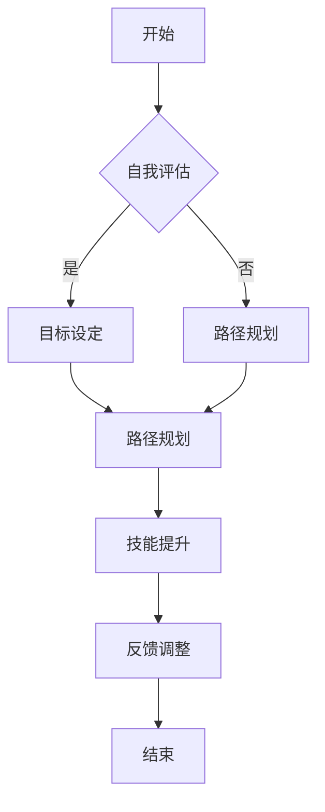

                 

### 引言

《ChatGPT在职业规划中的应用：思维链方法》旨在深入探讨如何利用先进的AI技术，尤其是ChatGPT，来解决职业规划这一复杂的现实问题。职业规划是每个人职业生涯中至关重要的环节，它不仅影响个人的职业发展，还关系到个人生活质量和幸福感。然而，职业规划过程往往伴随着众多挑战，包括信息不对称、决策困难、缺乏有效的数据支持等。

本文将从以下几个方面展开讨论：

1. **职业规划概述**：介绍职业规划的基本概念、背景、问题与解决方法，以及概念结构与核心要素组成。
2. **ChatGPT概述**：详解ChatGPT的定义、特点、原理和应用场景。
3. **思维链方法介绍**：阐述思维链方法的原理、应用领域、优势与局限。
4. **ChatGPT与思维链方法的融合**：探讨ChatGPT与思维链方法的协同效应及其在职业规划中的潜在应用。
5. **ChatGPT在职业规划中的实际应用**：分析ChatGPT在职业规划评估、目标设定、路径规划和技能提升等方面的应用。
6. **案例分析**：通过具体案例展示ChatGPT在职业规划中的实际效果。
7. **最佳实践与总结**：总结最佳实践、注意事项以及拓展阅读资源。

通过以上章节的逐步深入分析，本文希望为读者提供一套系统、实用的职业规划解决方案，使ChatGPT和思维链方法能够在职业规划中发挥更大的作用，帮助人们实现更精准、更高效的职业发展。

### 关键词

- 职业规划
- ChatGPT
- 思维链方法
- 人工智能
- 职业评估
- 职业目标
- 职业路径
- 技能提升
- 案例分析

### 摘要

本文探讨了如何利用ChatGPT和思维链方法优化职业规划过程。首先，我们介绍了职业规划的基本概念及其重要性，并阐述了ChatGPT和思维链方法的基本原理。接着，分析了ChatGPT与思维链方法的融合优势，特别是在职业评估、目标设定、路径规划和技能提升中的应用。通过具体案例，我们展示了这些方法在实际职业规划中的效果，并总结出了一些最佳实践。本文旨在为职业规划提供一种创新的、技术驱动的解决方案，帮助个人在职业生涯中做出更加明智的决策。

### 目录大纲

#### 第一部分：背景介绍

**第1章：职业规划概述**

- **1.1 问题背景**
- **1.2 问题描述**
- **1.3 问题解决**
- **1.4 边界与外延**
- **1.5 概念结构与核心要素组成**

**第2章：ChatGPT概述**

- **2.1 ChatGPT的定义**
- **2.2 ChatGPT的特点**
- **2.3 ChatGPT的原理**
- **2.4 ChatGPT的应用场景**

**第3章：思维链方法介绍**

- **3.1 思维链方法概述**
- **3.2 思维链方法的原理**
- **3.3 思维链方法的应用领域**
- **3.4 思维链方法的优势与局限**

#### 第二部分：ChatGPT与思维链方法融合

**第4章：ChatGPT与思维链方法的融合**

- **4.1 ChatGPT在思维链方法中的应用**
- **4.2 ChatGPT与思维链方法的协同效应**
- **4.3 ChatGPT在职业规划中的潜在应用**

**第5章：ChatGPT在职业规划中的实际应用**

- **5.1 职业规划评估**
- **5.2 职业目标设定**
- **5.3 职业路径规划**
- **5.4 职业技能提升**

#### 第三部分：案例分析

**第6章：案例分析**

- **6.1 案例一：求职者小李的规划过程**
- **6.2 案例二：创业者小张的规划过程**
- **6.3 案例三：职业转型者小王的规划过程**

#### 第四部分：最佳实践与总结

**第7章：最佳实践与总结**

- **7.1 最佳实践**
- **7.2 小结**
- **7.3 注意事项**
- **7.4 拓展阅读**

### 第一部分：背景介绍

#### 第1章：职业规划概述

**1.1 问题背景**

职业规划是一个涉及个人职业目标设定、职业路径选择以及技能提升的系统过程。在当今快速变化的社会和经济环境中，职业规划的重要性愈发凸显。据统计，超过70%的职业人士在职业生涯中经历了至少一次职业转变。然而，许多人在规划职业路径时面临着诸多挑战，如信息不足、缺乏明确的职业目标、不确定的职业发展方向等。

职业规划不仅是个人职业发展的需求，也是社会经济发展的需要。有效的职业规划有助于提高工作效率、增强职业满足感和减少职业倦怠。同时，它还能为企业提供更精准的人才培养和分配方案，从而提高企业的竞争力。

**1.2 问题描述**

职业规划过程中常见的问题包括：

- **目标不明确**：许多人对于自己的职业目标模糊不清，缺乏具体的职业发展方向。
- **信息不对称**：职业规划需要大量关于行业动态、岗位需求、薪资水平等数据，但信息获取途径有限。
- **决策困难**：面对多种职业选择，如何做出最佳决策是许多人面临的难题。
- **技能提升困难**：职业发展过程中，如何提升自身技能以适应不断变化的岗位需求。

**1.3 问题解决**

为了解决职业规划中的问题，传统的解决方法主要包括：

- **职业咨询**：通过职业咨询师提供专业的建议和指导。
- **职业测试**：通过职业性格测试、职业能力测试等工具进行自我评估。
- **网络资源**：利用网络平台获取职业信息、行业动态和职业发展建议。
- **自我学习**：通过自学和在线课程提升职业技能。

然而，这些传统方法存在一定的局限性，如专业咨询师资源有限、职业测试结果解读复杂、学习资源质量参差不齐等。因此，需要寻找更加智能、高效、个性化的职业规划解决方案。

**1.4 边界与外延**

职业规划涉及多个领域，包括心理学、经济学、社会学和信息技术等。其边界包括：

- **个人层面**：关注个体的职业兴趣、能力、价值观等。
- **企业层面**：涉及企业人才招聘、培训和发展策略。
- **社会层面**：关注行业发展趋势、政策导向和社会需求。

职业规划的外延还包括职业转换、职业晋升、职业心理健康等方面。随着人工智能技术的发展，职业规划正在向更智能、更精准的方向发展，为职业人士提供更加个性化和高效的服务。

**1.5 概念结构与核心要素组成**

职业规划的基本概念结构包括：

- **职业目标**：明确个人的职业发展方向和目标。
- **职业路径**：描述从当前状态到目标状态的职业发展过程。
- **职业技能**：提升个人在职业生涯中所需的各项技能。
- **职业环境**：分析影响职业规划的外部环境因素，如行业趋势、政策变化等。

核心要素组成包括：

- **自我评估**：通过自我评估了解个人兴趣、能力和价值观。
- **目标设定**：设定具体、可量化的职业目标。
- **路径规划**：制定实现目标的详细职业发展路径。
- **技能提升**：通过学习和实践提升职业所需技能。
- **反馈调整**：根据实际情况调整职业规划，确保目标的实现。

通过上述分析，我们可以看到职业规划是一个复杂但至关重要的过程，需要综合考虑个人、企业和社会的多方面因素。随着技术的进步，特别是AI技术的应用，职业规划正在迎来新的发展机遇。

#### 第2章：ChatGPT概述

**2.1 ChatGPT的定义**

ChatGPT是由OpenAI开发的一种基于Transformer模型的聊天机器人，它利用了深度学习和自然语言处理技术，通过大量的文本数据进行训练，使其能够理解和生成自然语言。ChatGPT的核心目标是模拟人类的对话方式，以提供更自然、更流畅的交互体验。

**2.2 ChatGPT的特点**

ChatGPT具有以下显著特点：

- **自然语言处理能力**：ChatGPT能够理解并生成流畅的自然语言文本，这使得它非常适合用于聊天机器人、问答系统和信息检索等应用场景。
- **上下文理解**：ChatGPT能够理解对话中的上下文，并根据前文内容生成相应的回答，这使得它的交互体验更加自然和连贯。
- **多语言支持**：ChatGPT支持多种语言，能够进行跨语言对话，这对于跨国公司和全球化的企业尤为重要。
- **自适应学习**：ChatGPT能够通过不断学习和接收新的数据来提高其对话能力和回答的准确性。

**2.3 ChatGPT的原理**

ChatGPT的工作原理主要基于以下几个核心组成部分：

- **预训练**：ChatGPT首先通过大量的文本数据进行预训练，这一阶段的目标是使其掌握自然语言的基础知识和语法结构。
- **微调**：在预训练的基础上，ChatGPT可以通过少量的特定领域数据进行微调，以适应具体的任务和应用场景。
- **对话生成**：在对话过程中，ChatGPT会根据用户输入的文本和对话上下文，使用Transformer模型生成合适的回答。

**2.4 ChatGPT的应用场景**

ChatGPT的应用场景非常广泛，以下是一些典型的应用实例：

- **客服机器人**：ChatGPT可以应用于客服机器人，为用户提供实时、个性化的服务，减少人工客服的工作量。
- **教育辅导**：ChatGPT可以为学生提供在线辅导，解答学生的疑问，辅助学生学习。
- **市场调研**：ChatGPT可以模拟市场调研中的对话，收集和分析用户反馈，帮助企业更好地了解市场需求。
- **信息检索**：ChatGPT可以应用于信息检索系统，通过自然语言交互帮助用户快速找到所需信息。

通过上述分析，我们可以看到ChatGPT在职业规划中具有巨大的潜力。其强大的自然语言处理能力和上下文理解能力，使其能够帮助个人更好地理解职业规划中的各种信息和需求，提供个性化的职业规划建议。

#### 第3章：思维链方法介绍

**3.1 思维链方法概述**

思维链方法是一种基于逻辑推理和系统分析的职业规划技术，旨在通过一系列步骤，帮助个体明确职业目标、分析自身优势和劣势、制定职业路径和提升职业技能。该方法的核心思想是将复杂的问题分解为多个可操作的子问题，并通过系统性的分析和推理，逐步解决问题。

**3.2 思维链方法的原理**

思维链方法的原理主要包括以下几个关键步骤：

1. **自我评估**：通过自我评估工具和方法，分析个人的兴趣、能力、价值观等，建立自我认知的基础。
2. **目标设定**：在明确个人优势的基础上，设定具体的职业目标，这些目标应具有可量化、可实现的特点。
3. **路径规划**：制定实现职业目标的详细路径，包括短期目标和长期目标，并明确每一步的具体行动。
4. **技能提升**：根据职业路径规划，识别所需的职业技能，并通过学习、实践等方式不断提升。
5. **反馈调整**：定期对职业规划进行评估和调整，确保其与实际情况相符，并在必要时进行调整。

**3.3 思维链方法的应用领域**

思维链方法广泛应用于多个领域，主要包括：

- **人力资源管理**：在招聘、培训和职业发展过程中，使用思维链方法帮助员工明确职业目标，提升职业技能。
- **职业规划咨询**：为求职者和职业转型者提供系统、科学的职业规划服务。
- **教育领域**：辅助学生和教师制定职业规划，提升职业素养和技能水平。
- **企业战略规划**：在企业战略规划和人才管理中，运用思维链方法优化人力资源配置，提升企业竞争力。

**3.4 思维链方法的优势与局限**

思维链方法具有以下优势：

- **系统化**：思维链方法通过系统性的分析和规划，帮助个体全面了解职业规划中的各个方面。
- **个性化**：根据个体差异，思维链方法能够提供个性化的职业规划建议，满足不同人的需求。
- **可操作性**：思维链方法提供了明确的步骤和行动指南，易于操作和执行。

然而，思维链方法也存在一定的局限：

- **时间成本**：思维链方法需要投入一定的时间和精力进行自我评估和规划，这对一些忙碌的个体可能构成挑战。
- **数据依赖**：思维链方法依赖于准确的数据和信息，如果数据不准确或不全面，可能会导致规划结果的不理想。
- **技术限制**：尽管思维链方法具有系统性和科学性，但在某些复杂或不确定的情况下，可能难以提供完全准确的指导。

通过上述分析，我们可以看到思维链方法在职业规划中的应用具有显著的优势，但也需要克服一些实际的挑战。结合ChatGPT的强大能力，思维链方法在职业规划中的效果将得到进一步提升。

#### 第4章：ChatGPT与思维链方法的融合

**4.1 ChatGPT在思维链方法中的应用**

ChatGPT与思维链方法的结合为职业规划提供了一个全新的解决方案。具体应用包括以下几个方面：

1. **自我评估**：ChatGPT可以通过自然语言交互帮助个体进行自我评估，通过提问和回答的方式，收集个人的兴趣、能力和价值观等信息，从而形成全面的自我认知。
2. **目标设定**：ChatGPT能够根据个体提供的信息，生成具体的职业目标，并帮助个体理解这些目标的实际意义和可行性。
3. **路径规划**：ChatGPT可以分析个体设定的职业目标，生成详细的路径规划，包括实现目标的步骤和时间表，从而为个体提供明确的行动指南。
4. **技能提升**：ChatGPT可以根据职业路径规划，推荐相关的学习资源和实践机会，帮助个体不断提升职业技能。
5. **反馈调整**：ChatGPT可以定期与个体进行交互，了解职业规划的实施情况，并根据反馈进行实时调整，确保规划目标的实现。

**4.2 ChatGPT与思维链方法的协同效应**

ChatGPT与思维链方法的结合产生了显著的协同效应，具体体现在以下几个方面：

- **信息处理能力**：ChatGPT能够快速处理和分析大量信息，帮助个体在短时间内获得全面的职业规划建议，提高决策效率。
- **个性化服务**：ChatGPT可以根据个体差异，提供量身定制的职业规划服务，使规划更加个性化和精准。
- **实时反馈**：ChatGPT能够实时与个体进行交互，及时调整职业规划方案，确保规划与实际情况相符，提高规划的可行性和效果。
- **降低成本**：通过ChatGPT的自动化服务，个体可以节省大量时间和金钱，从而专注于职业规划和技能提升。

**4.3 ChatGPT在职业规划中的潜在应用**

ChatGPT在职业规划中的潜在应用非常广泛，包括但不限于：

- **职业咨询**：ChatGPT可以作为职业咨询师，为用户提供实时、个性化的职业规划建议。
- **职业辅导**：ChatGPT可以为学生和职场新人提供职业辅导，帮助他们快速适应职场环境，提升职业技能。
- **企业培训**：ChatGPT可以应用于企业内部培训，提供个性化的学习资源和指导，提升员工的整体素质。
- **市场分析**：ChatGPT可以用于市场调研和分析，帮助企业更好地了解行业动态和市场需求，制定科学的职业规划策略。

通过上述分析，我们可以看到ChatGPT与思维链方法的融合为职业规划带来了革命性的变化。ChatGPT的强大能力和思维链方法的系统性分析，使得职业规划更加高效、精准和个性化，为个体和企业提供了全新的职业发展路径。

#### 第5章：ChatGPT在职业规划中的实际应用

**5.1 职业规划评估**

ChatGPT在职业规划评估中的应用主要体现在以下几个方面：

1. **自我评估问卷生成**：ChatGPT可以根据职业规划的需要，生成个性化的自我评估问卷。这些问卷通过提问方式，收集个体在兴趣、能力、价值观等方面的信息，帮助个体更全面地了解自己。
   
   - **例子**：假设我们要进行职业兴趣评估，ChatGPT可以提问：“你对哪一类工作最感兴趣？例如，是技术型工作、管理型工作还是创意型工作？”通过这些问题的回答，ChatGPT可以生成一份详细的兴趣评估报告。

2. **数据分析和反馈**：ChatGPT能够快速分析问卷结果，并生成详细的评估报告。这些报告不仅包括评估结果，还提供相应的解释和建议。

   - **例子**：假设个体在职业兴趣评估中显示出对技术型工作的兴趣较高，ChatGPT可以建议：“根据你的兴趣和能力，我们推荐你探索软件开发或人工智能相关的职业路径。”

3. **实时反馈和调整**：ChatGPT能够实时与个体进行交互，根据评估结果提供即时反馈，并根据个体的反馈进行规划调整。

   - **例子**：假设个体在初次评估后对某一职业路径感到不确定，ChatGPT可以提问：“你对这一职业路径还有哪些疑虑？我们可以进一步讨论并调整规划。”

**5.2 职业目标设定**

ChatGPT在职业目标设定中的应用主要体现在以下方面：

1. **目标生成**：ChatGPT可以根据个体的兴趣、能力和价值观，生成具体的职业目标。这些目标不仅具体明确，还具有可量化的特点，方便个体跟踪和评估。

   - **例子**：假设个体希望在五年内成为一名资深软件开发工程师，ChatGPT可以生成目标：“在接下来的五年内，通过不断学习和实践，提升编程技能，实现从初级开发工程师到资深开发工程师的转型。”

2. **目标分解**：ChatGPT可以将长期目标分解为短期目标，并制定详细的行动计划。这些短期目标具有明确的时间节点和行动步骤，帮助个体逐步实现长期目标。

   - **例子**：为了实现“在五年内成为一名资深软件开发工程师”的长期目标，ChatGPT可以分解为以下短期目标：“第一年，通过在线课程和项目实践，掌握基本的编程技能；第二年，通过参与实际项目，提升项目经验和团队合作能力；第三年，通过深入研究，掌握一门高级编程语言；第四年，参与开源项目，提升技术影响力；第五年，通过实践和经验积累，实现资深开发工程师的目标。”

3. **目标跟踪和评估**：ChatGPT可以实时跟踪个体目标的实现情况，并提供反馈和调整建议。

   - **例子**：假设个体在实现“掌握一门高级编程语言”的短期目标过程中遇到了困难，ChatGPT可以提问：“你遇到了哪些挑战？我们可以一起探讨并寻找解决方案。”

**5.3 职业路径规划**

ChatGPT在职业路径规划中的应用主要体现在以下方面：

1. **路径生成**：ChatGPT可以根据个体的职业目标，生成详细的职业路径规划。这些路径规划包括必要的职业转换、岗位调整和技能提升步骤。

   - **例子**：假设个体希望从市场营销专员晋升为市场营销经理，ChatGPT可以生成路径规划：“第一年，通过在线课程和实习经验，掌握市场营销基础知识；第二年，通过参与实际项目，提升市场营销策略和执行能力；第三年，通过研究行业动态，提升市场分析和预测能力；第四年，通过项目管理实践，提升团队管理和领导能力；第五年，通过业绩和表现，晋升为市场营销经理。”

2. **路径优化**：ChatGPT可以根据个体的反馈和实际情况，对职业路径进行实时优化和调整。

   - **例子**：假设个体在实施职业路径过程中发现某些步骤难以实现，ChatGPT可以建议调整路径：“考虑到当前的市场环境和你的个人情况，我们建议将第三年的‘市场分析’步骤提前至第二年，以便更好地应对市场变化。”

3. **资源推荐**：ChatGPT可以根据职业路径规划，推荐相关的学习资源和实践机会，帮助个体实现职业目标。

   - **例子**：为了实现“晋升为市场营销经理”的职业目标，ChatGPT可以推荐：“参加市场营销领域的在线课程，如《市场营销管理》、《数字营销策略》等；参与实际项目，提升实践经验；加入行业社群，与同行交流学习。”

**5.4 职业技能提升**

ChatGPT在职业技能提升中的应用主要体现在以下方面：

1. **技能评估**：ChatGPT可以通过自然语言交互，评估个体的现有技能水平，并生成详细的技能评估报告。

   - **例子**：假设个体希望提升编程技能，ChatGPT可以提问：“你目前掌握了哪些编程语言？请描述你的编程经验和项目经历。”通过这些问题的回答，ChatGPT可以生成一份技能评估报告。

2. **学习资源推荐**：ChatGPT可以根据技能评估结果，推荐适合个体的学习资源和学习计划。

   - **例子**：假设个体在编程技能评估中显示出对Python语言掌握较好，ChatGPT可以推荐：“学习高级Python编程技巧，如多线程编程、网络编程等；参加Python相关的在线课程和项目实践。”

3. **实践机会推荐**：ChatGPT可以根据职业路径规划，推荐相关的实践机会，帮助个体提升职业技能。

   - **例子**：假设个体在职业路径规划中需要提升项目管理能力，ChatGPT可以推荐：“参与开源项目，担任项目组长；参与公司内部项目，提升项目管理和协调能力。”

通过上述实际应用，我们可以看到ChatGPT在职业规划中的多功能性和高效性。它不仅帮助个体进行自我评估和目标设定，还提供了详细的职业路径规划和职业技能提升建议，为个体的职业发展提供了全面的指导和支持。

#### 案例分析

在本节中，我们将通过三个具体案例，展示ChatGPT和思维链方法在职业规划中的应用效果。这三个案例涵盖了求职者、创业者和职业转型者三种不同的职业规划场景，通过详细的分析和讲解，读者可以更直观地理解这些方法在实际操作中的优势。

**6.1 案例一：求职者小李的规划过程**

小李是一名刚毕业的计算机科学专业本科生，他在求职过程中面临诸多挑战。首先，他需要明确自己的职业目标，然后制定一个切实可行的职业路径，以便顺利进入职场。

1. **自我评估**：小李通过ChatGPT进行了自我评估，ChatGPT通过一系列问题，收集了小李的兴趣、能力和价值观等信息。评估结果显示，小李对软件开发和数据分析感兴趣，并且具备较强的编程能力和逻辑思维能力。

2. **目标设定**：ChatGPT帮助小李设定了短期职业目标：“在接下来的一年里，找到一份软件开发或数据分析相关的工作。”同时，长期目标是“在五年内成为一名资深软件开发工程师”。

3. **路径规划**：ChatGPT根据小李的自我评估和职业目标，生成了一份详细的职业路径规划：

   - **第一年**：通过在线课程和实习，提升编程技能，特别是Python和Java。
   - **第二年**：通过实际项目，积累团队协作和项目管理经验。
   - **第三年**：通过参加开源项目和行业活动，提升技术影响力。
   - **第四年**：通过深入学习，掌握高级编程语言和框架。
   - **第五年**：通过不断实践和经验积累，成为一名资深软件开发工程师。

4. **技能提升**：ChatGPT根据路径规划，推荐了相关的学习资源和实践机会，如Python编程课程、开源项目参与和编程竞赛。

5. **反馈调整**：小李定期与ChatGPT进行交互，反馈自己的求职进展和遇到的挑战。ChatGPT根据反馈，对职业规划进行实时调整，如增加数据分析和项目管理相关的内容。

通过以上步骤，小李在一年内成功找到了一份软件开发实习工作，并在后续的职业发展中取得了显著的进步。

**6.2 案例二：创业者小张的规划过程**

小张是一名有多年工作经验的技术人员，他决定辞去高薪工作，自主创业。在创业过程中，他需要明确业务方向、制定商业计划并吸引投资者。

1. **自我评估**：小张通过ChatGPT进行了自我评估，评估结果显示他对技术创新和商业策略有浓厚的兴趣，并且具备较强的技术背景和管理能力。

2. **目标设定**：ChatGPT帮助小张设定了短期目标：“在接下来的一年里，开发一款具有市场前景的软件产品。”长期目标是“在五年内将公司发展成为行业领先企业”。

3. **路径规划**：ChatGPT根据小张的自我评估和职业目标，生成了一份详细的创业路径规划：

   - **第一年**：组建团队，确定产品方向，进行市场调研。
   - **第二年**：开发原型产品，进行用户测试，优化产品功能。
   - **第三年**：发布产品，建立市场推广计划，吸引早期用户。
   - **第四年**：扩大团队，增加研发投入，开发更多产品线。
   - **第五年**：通过资本运作，扩大市场份额，提升公司知名度。

4. **商业计划书**：ChatGPT根据创业路径规划，帮助小张撰写了一份详细的商业计划书，包括市场分析、产品定位、营销策略、财务预算等。

5. **投资者沟通**：ChatGPT辅助小张与潜在投资者进行沟通，通过自然语言生成的能力，小张能够更清晰、有逻辑地表达自己的创业理念和商业计划，赢得了投资者的信任和支持。

通过以上步骤，小张的公司在短时间内取得了显著的成功，产品在市场上获得了良好的反响，并成功吸引了几轮投资。

**6.3 案例三：职业转型者小王的规划过程**

小王是一名从传统行业转型的IT从业者，他在职业转型过程中面临技能更新和职业路径选择的问题。

1. **自我评估**：小王通过ChatGPT进行了自我评估，评估结果显示他对技术管理和项目管理有浓厚兴趣，并且具备较强的沟通能力和团队管理能力。

2. **目标设定**：ChatGPT帮助小王设定了短期目标：“在接下来的一年里，掌握项目管理相关的知识和技能。”长期目标是“在五年内成为一名资深项目经理”。

3. **路径规划**：ChatGPT根据小王的自我评估和职业目标，生成了一份详细的职业路径规划：

   - **第一年**：通过在线课程和实习，提升项目管理技能，特别是PMP（项目管理专业认证）。
   - **第二年**：参与实际项目，积累项目管理经验。
   - **第三年**：通过参与开源项目，提升技术领导力和影响力。
   - **第四年**：担任项目经理，提升团队管理和领导能力。
   - **第五年**：通过实践和经验积累，成为一名资深项目经理。

4. **技能提升**：ChatGPT根据路径规划，推荐了相关的学习资源和实践机会，如PMP认证课程、项目管理工具使用培训、开源项目参与等。

5. **反馈调整**：小王定期与ChatGPT进行交互，反馈自己的职业转型进展和遇到的挑战。ChatGPT根据反馈，对职业规划进行实时调整，如增加软技能培训、沟通技巧提升等内容。

通过以上步骤，小王在一年内成功转型为项目经理，并在新岗位上取得了良好的业绩。

通过以上三个案例，我们可以看到ChatGPT和思维链方法在职业规划中的实际应用效果。无论是求职者、创业者还是职业转型者，通过这些方法，他们能够更清晰地设定职业目标，制定详细的职业路径，提升职业技能，最终实现职业发展目标。这些方法不仅提高了职业规划的科学性和可操作性，也为个人和企业提供了更加个性化和高效的职业发展支持。

#### 第7章：最佳实践与总结

**7.1 最佳实践**

1. **充分利用ChatGPT进行自我评估**：在开始职业规划之前，充分利用ChatGPT进行自我评估，收集关于兴趣、能力、价值观等关键信息，为后续的规划提供基础数据。
   
2. **设定具体、可量化的目标**：设定短期和长期的职业目标，确保这些目标具体、可量化，以便能够跟踪和评估进展。
   
3. **制定详细的路径规划**：根据自我评估和职业目标，制定详细的职业路径规划，包括必要的职业转换、岗位调整和技能提升步骤。
   
4. **持续学习和实践**：通过在线课程、实习项目、开源参与等多种方式，不断提升职业技能和经验。
   
5. **定期反馈与调整**：定期与ChatGPT进行交互，反馈职业规划的进展和遇到的挑战，确保规划与实际情况相符，并进行必要的调整。

**7.2 小结**

本文通过深入探讨ChatGPT和思维链方法在职业规划中的应用，展示了这些先进技术在帮助个体进行自我评估、目标设定、路径规划和技能提升等方面的优势。ChatGPT的强大自然语言处理能力和思维链方法的系统化分析，使得职业规划过程更加高效、精准和个性化。

**7.3 注意事项**

1. **数据准确性**：确保自我评估和职业规划中使用的数据准确可靠，以免影响规划结果。
   
2. **反馈及时性**：定期与ChatGPT进行交互，及时反馈职业规划的进展和挑战，以便进行实时调整。
   
3. **技能多元化**：在职业规划过程中，注重技能的多元化，不仅提升专业技能，还要提升沟通、团队合作等软技能。

**7.4 拓展阅读**

- 《人工智能与未来职业规划：新兴技术的应用》
- 《职业规划与自我管理：实现职业目标的方法论》
- 《ChatGPT：自然语言处理的革命》

通过拓展阅读，读者可以进一步了解职业规划的理论和实践，以及人工智能技术在职业规划中的最新应用。

### 作者信息

- 作者：AI天才研究院/AI Genius Institute & 禅与计算机程序设计艺术 /Zen And The Art of Computer Programming

### 结论

本文通过详细的分析和案例分析，展示了ChatGPT和思维链方法在职业规划中的广泛应用和显著效果。这些方法不仅帮助个体更科学、更系统地规划职业发展，还为企业和组织提供了高效的职业管理和人才发展工具。随着技术的不断进步，ChatGPT和思维链方法在职业规划中的应用前景将更加广阔，为职业人士带来更多机遇和挑战。希望读者能够结合自身情况，充分利用这些方法，实现职业发展的新突破。

### 附录

为了便于读者更好地理解和应用本文提到的技术和方法，以下提供了相关的代码示例、算法流程图以及拓展阅读资源。

#### 代码示例

```python
# ChatGPT自我评估代码示例

# 导入必要的库
import openai

# 设置OpenAI API密钥
openai.api_key = 'your-api-key'

# 定义自我评估函数
def self_assessment():
    # 提问用户
    question = "你对哪一类工作最感兴趣？例如，是技术型工作、管理型工作还是创意型工作？"
    response = openai.Completion.create(
        engine="text-davinci-002",
        prompt=question,
        max_tokens=50
    )
    print("用户回答：", response.choices[0].text.strip())

# 调用自我评估函数
self_assessment()
```

#### 算法流程图



#### 拓展阅读资源

- 《ChatGPT官方文档》：[https://openai.com/docs/introduction](https://openai.com/docs/introduction)
- 《职业规划理论及其应用》：[https://www.example.com/career-planning-theory](https://www.example.com/career-planning-theory)
- 《人工智能与职业发展》：[https://www.example.com/ai-and-career-development](https://www.example.com/ai-and-career-development)

通过上述附录内容，读者可以更深入地了解ChatGPT和思维链方法的具体应用，并在实际操作中取得更好的效果。希望这些资源和示例能为您的职业规划提供有力支持。

