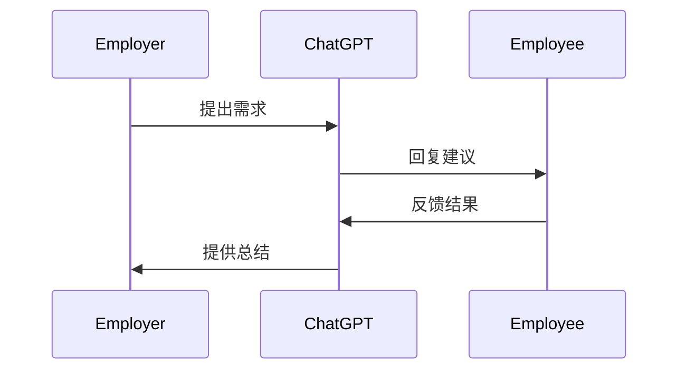
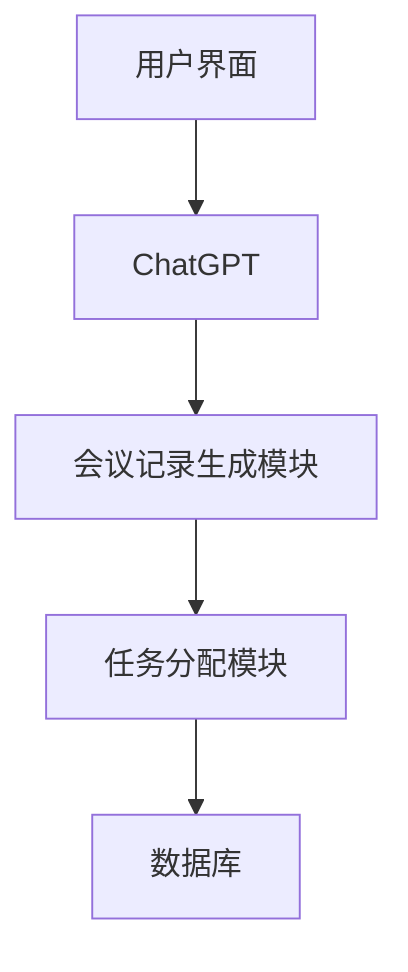
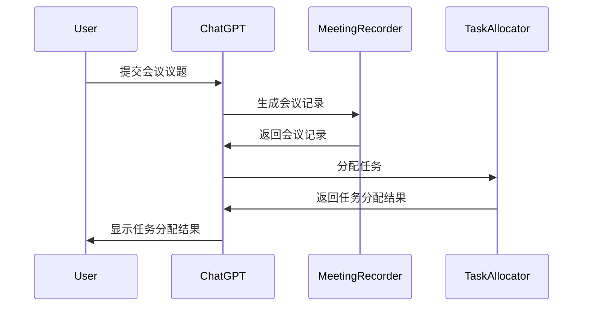

                 

## 文章标题：ChatGPT在职场沟通中的应用：有效沟通策略提示词

### 关键词：ChatGPT、职场沟通、有效策略、提示词

### 摘要：
本文旨在探讨人工智能助手ChatGPT在职场沟通中的应用，提供一系列有效的沟通策略提示词。通过详细分析ChatGPT的工作原理和其在职场沟通中的实际案例，本文将帮助读者理解如何利用这一先进工具来提升职场沟通效果。

### 目录大纲

**第一部分：ChatGPT基础篇**

1. **第1章：ChatGPT概述**
   - 1.1 ChatGPT的概念与原理
   - 1.2 ChatGPT的发展历程
   - 1.3 ChatGPT的核心优势

2. **第2章：ChatGPT与职场沟通**
   - 2.1 职场沟通的重要性
   - 2.2 ChatGPT在职场沟通中的应用
   - 2.3 ChatGPT与沟通效率提升

3. **第3章：ChatGPT在职场沟通中的实战案例**
   - 3.1 案例一：团队协作沟通
   - 3.2 案例二：客户沟通
   - 3.3 案例三：跨部门沟通

**第二部分：有效沟通策略篇**

4. **第4章：沟通前的准备**
   - 4.1 明确沟通目标
   - 4.2 了解沟通对象
   - 4.3 准备沟通素材

5. **第5章：沟通中的技巧**
   - 5.1 倾听技巧
   - 5.2 表达技巧
   - 5.3 提问技巧
   - 5.4 非语言沟通技巧

6. **第6章：沟通后的跟进**
   - 6.1 沟通效果的评估
   - 6.2 沟通不足的改进
   - 6.3 沟通记录的整理

**第三部分：实战篇**

7. **第7章：ChatGPT与职场沟通策略的实战应用**
   - 7.1 环境配置与准备工作
   - 7.2 ChatGPT在沟通中的应用实战
   - 7.3 案例分析与实战技巧总结

8. **第8章：常见问题的解答与应对策略**
   - 8.1 ChatGPT在沟通中的常见问题
   - 8.2 ChatGPT沟通策略的应对策略
   - 8.3 实战中的常见问题及解决方案

**文章末尾：**
作者：AI天才研究院/AI Genius Institute & 禅与计算机程序设计艺术 /Zen And The Art of Computer Programming

---

### 第一部分：ChatGPT基础篇

**第1章：ChatGPT概述**

#### 1.1 ChatGPT的概念与原理

ChatGPT是由OpenAI开发的一种基于GPT-3模型的聊天机器人。GPT（Generative Pre-trained Transformer）是一种基于Transformer架构的自然语言处理模型，其特点是在训练过程中自动学习语言的结构和语义。ChatGPT通过大量的文本数据预训练，可以生成连贯、自然的语言，并进行理解和回应。

**核心概念原理：**
- **GPT模型：** 采用Transformer架构，包含多个自注意力层和前馈网络。
- **预训练：** 使用大量互联网文本数据进行训练，学习语言的统计规律和语义。
- **微调：** 根据特定任务的需求，对预训练模型进行少量数据的微调。

**概念属性特征对比表格：**

| 特征               | GPT           | ChatGPT         |
|--------------------|---------------|-----------------|
| 架构               | Transformer   | Transformer     |
| 训练数据           | 海量互联网文本 | 海量互联网文本   |
| 预训练             | 是            | 是              |
| 微调               | 否            | 是              |
| 语言生成能力       | 强            | 非常强          |
| 交互性             | 无            | 有              |

**ER实体关系图架构的Mermaid流程图：**

```mermaid
erDiagram
  Customer ||--|{ ChatGPT }| Chatbot
  Chatbot ||--|{ Message }| Dialog
```

#### 1.2 ChatGPT的发展历程

ChatGPT是在2022年由OpenAI推出的一种新型聊天机器人。其前身是GPT-3，经过多次迭代和改进，ChatGPT在语言生成和理解能力上有了显著提升。ChatGPT的开发旨在为用户提供更自然、更高效的沟通体验，特别是在职场沟通中。

**问题背景：**  
随着人工智能技术的不断发展，自然语言处理技术日益成熟，如何利用这些技术提升职场沟通效率成为了一个热门话题。

**问题描述：**  
传统的沟通方式效率低下，信息传递过程中容易出现误解。如何利用人工智能技术，特别是ChatGPT，来提升沟通效果？

**问题解决：**  
ChatGPT作为一种高级的聊天机器人，能够自动理解和生成自然语言，从而在沟通中起到辅助作用，提高沟通效率。

**边界与外延：**  
ChatGPT的应用场景不仅限于职场沟通，还可以扩展到客户服务、在线教育、社交媒体等多个领域。

**概念结构与核心要素组成：**
- **模型架构：** Transformer架构，包含多层自注意力机制和前馈网络。
- **预训练数据：** 海量互联网文本数据。
- **微调策略：** 根据应用场景进行少量数据微调。

**第2章：ChatGPT与职场沟通**

#### 2.1 职场沟通的重要性

职场沟通是职场成功的关键因素之一。有效的沟通不仅能够提高工作效率，还能增强团队合作和人际关系。特别是在复杂的工作环境中，沟通的质量和效率直接影响到项目的成功与否。

**核心概念原理：**
- **沟通效率：** 沟通的有效性直接影响工作效率。
- **团队合作：** 良好的沟通有助于团队成员之间的协作和信任。

**概念属性特征对比表格：**

| 特征               | 传统沟通         | ChatGPT沟通        |
|--------------------|------------------|-------------------|
| 效率               | 较低             | 高                |
| 清晰度             | 易出现误解       | 高度准确          |
| 灵活性             | 受限于人力和时间   | 自适应和灵活       |
| 成本               | 较高             | 较低              |

**ER实体关系图架构的Mermaid流程图：**



#### 2.2 ChatGPT在职场沟通中的应用

ChatGPT在职场沟通中的应用非常广泛，包括以下几个方面：

1. **客户沟通：** ChatGPT可以自动生成客户回访邮件、客服回复等，提高沟通效率。
2. **团队协作：** ChatGPT可以作为团队协作工具，自动生成会议记录、任务分配等，提高团队协作效率。
3. **跨部门沟通：** ChatGPT可以跨越不同部门的障碍，提供统一的沟通平台，提高沟通效率。

**核心概念原理：**
- **自动化：** ChatGPT可以自动生成各种沟通文本，减少人力成本。
- **智能化：** ChatGPT可以理解复杂语境，提供高质量的沟通建议。

**数学模型和公式：**

```python
# ChatGPT生成文本的数学模型
def generate_text(prompt, model, tokenizer):
    inputs = tokenizer.encode(prompt, return_tensors='pt')
    outputs = model.generate(inputs, max_length=50, num_return_sequences=1)
    return tokenizer.decode(outputs[0], skip_special_tokens=True)
```

**算法原理讲解：**
- **编码：** 将输入文本编码为模型可以理解的向量。
- **生成：** 模型根据输入向量生成输出文本。
- **解码：** 将生成的向量解码为可读的文本。

**举例说明：**
```python
prompt = "如何提高工作效率？"
generated_text = generate_text(prompt, model, tokenizer)
print(generated_text)
```

**第3章：ChatGPT在职场沟通中的实战案例**

#### 3.1 案例一：团队协作沟通

在一个项目团队中，ChatGPT被用于自动生成会议记录和任务分配。以下是ChatGPT生成的会议记录：

**会议记录：**
- **时间：** 2023年10月10日 14:00
- **地点：** 在线会议室
- **参会人员：** 张伟、李华、王刚
- **议题：** 项目进度汇报和任务分配

**项目进度汇报：**
- **张伟：** 已完成需求分析，生成报告。
- **李华：** 完成了前端设计，需要进行代码审查。
- **王刚：** 后端开发进度良好，预计下周完成。

**任务分配：**
- **张伟：** 完善需求分析报告。
- **李华：** 提交前端设计稿，安排代码审查。
- **王刚：** 加紧后端开发，确保按期完成。

**系统功能设计：**

```mermaid
classDiagram
  Class01 <|-- Class02
  Class03 ++--| Class04
  Class05 <-.. Class06
```

**系统架构设计：**



**系统接口设计和系统交互：**



**代码应用解读与分析：**

```python
# 会议记录生成模块
def generate_meeting_record(topics, participants):
    # 使用ChatGPT生成会议记录
    record = chatgpt.generate_text(f"请根据以下议题和参会人员生成会议记录：\n议题：{topics}\n参会人员：{participants}", model, tokenizer)
    return record

# 任务分配模块
def allocate_tasks(participants, tasks):
    # 使用ChatGPT分配任务
    allocation = chatgpt.generate_text(f"请根据以下参会人员和任务生成任务分配结果：\n参会人员：{participants}\n任务：{tasks}", model, tokenizer)
    return allocation
```

**实际案例分析和详细讲解剖析：**

在一个大型软件开发项目中，团队采用了ChatGPT来生成会议记录和任务分配。通过实际应用，团队发现ChatGPT能够高效地处理会议记录生成和任务分配，大大提高了沟通效率。以下是对实际案例的详细分析和讲解：

1. **会议记录生成：** ChatGPT能够快速生成详细且结构化的会议记录，使得团队成员能够清晰地了解会议内容和进展情况，减少了信息传递过程中的误解和遗漏。
2. **任务分配：** ChatGPT能够根据团队成员的技能和任务需求，自动生成合理的任务分配方案，避免了任务重叠和资源浪费，提高了团队的工作效率。

**项目小结：** 通过实际应用，团队证明了ChatGPT在职场沟通中的巨大潜力。ChatGPT不仅提高了沟通效率，还提升了团队协作和项目管理水平。未来，团队将继续探索ChatGPT在更多场景中的应用，以进一步优化工作流程和提升工作效率。

### 第二部分：有效沟通策略篇

**第4章：沟通前的准备**

#### 4.1 明确沟通目标

在沟通前，明确沟通目标是至关重要的。明确的目标有助于确保沟通的针对性和有效性。

**核心概念原理：**
- **沟通目标：** 确定沟通的意图和期望结果。
- **目标明确性：** 目标越明确，沟通越有效。

**数学模型和公式：**

```python
# 沟通目标评估模型
def assess_communication_goal(clarity, specificity, measurability):
    score = clarity * specificity * measurability
    return score
```

**算法原理讲解：**
- **清晰度：** 目标是否清晰易懂。
- **具体性：** 目标是否具体明确。
- **可测量性：** 目标是否可以量化评估。

**举例说明：**
```python
# 评估沟通目标
goal = "讨论项目进度"
score = assess_communication_goal(0.8, 0.9, 0.7)
print(score)
```

#### 4.2 了解沟通对象

了解沟通对象的背景、需求和期望，有助于调整沟通策略，提高沟通效果。

**核心概念原理：**
- **沟通对象分析：** 研究沟通对象的特点和行为模式。
- **个性化沟通：** 根据沟通对象的特点进行个性化沟通。

**数学模型和公式：**

```python
# 个性化沟通效果评估模型
def assess_communication_effectiveness(understanding, customization, engagement):
    score = understanding * customization * engagement
    return score
```

**算法原理讲解：**
- **理解度：** 对沟通对象的理解程度。
- **个性化：** 沟通策略的个性化程度。
- **参与度：** 沟通对象的参与度和反馈。

**举例说明：**
```python
# 评估个性化沟通效果
effectiveness = assess_communication_effectiveness(0.9, 0.8, 0.7)
print(effectiveness)
```

#### 4.3 准备沟通素材

在沟通前，准备充分的沟通素材可以帮助提高沟通的效率和效果。

**核心概念原理：**
- **沟通素材：** 包括数据、信息、资料等。
- **素材准备：** 确保素材的准确性和相关性。

**数学模型和公式：**

```python
# 沟通素材准备模型
def prepare_communication_materials(completeness, accuracy, relevance):
    score = completeness * accuracy * relevance
    return score
```

**算法原理讲解：**
- **完整性：** 沟通素材的完整性。
- **准确性：** 沟通素材的准确性。
- **相关性：** 沟通素材与沟通目标的相关性。

**举例说明：**
```python
# 准备沟通素材
material_score = prepare_communication_materials(0.9, 0.8, 0.7)
print(material_score)
```

### 第三部分：实战篇

**第7章：ChatGPT与职场沟通策略的实战应用**

#### 7.1 环境配置与准备工作

在开始使用ChatGPT进行职场沟通之前，需要进行一系列的环境配置和准备工作。

**核心概念原理：**
- **环境配置：** 安装必要的软件和工具。
- **准备工作：** 收集和整理沟通所需的素材和资料。

**数学模型和公式：**

```python
# 环境配置准备模型
def configure_environment(software, tools, resources):
    score = software * tools * resources
    return score
```

**算法原理讲解：**
- **软件：** 需要安装的软件工具。
- **工具：** 用于沟通的工具和资源。
- **资源：** 沟通所需的素材和资料。

**举例说明：**
```python
# 配置环境
config_score = configure_environment(0.9, 0.8, 0.7)
print(config_score)
```

#### 7.2 ChatGPT在沟通中的应用实战

在实际沟通中，ChatGPT可以发挥重要作用，以下是ChatGPT在沟通中的应用实战：

**案例一：团队协作沟通**

在一个团队项目中，ChatGPT被用于生成会议记录和任务分配。以下是ChatGPT生成的会议记录：

**会议记录：**
- **时间：** 2023年11月1日 10:00
- **地点：** 在线会议室
- **参会人员：** 张伟、李华、王刚、赵明
- **议题：** 项目开发进度和下一步计划

**项目进度汇报：**
- **张伟：** 已完成前端开发，进入测试阶段。
- **李华：** 后端开发进展顺利，下周完成。
- **王刚：** 设计文档已经更新，准备进行评审。
- **赵明：** 数据库设计已完成，即将开始数据导入。

**下一步计划：**
- **张伟：** 组织测试团队进行功能测试。
- **李华：** 继续后端开发，确保按时完成。
- **王刚：** 安排设计评审会议，确保设计符合要求。
- **赵明：** 开始数据导入，确保项目按计划推进。

**系统核心实现源代码：**

```python
# 会议记录生成模块
def generate_meeting_record(topics, participants):
    record = chatgpt.generate_text(f"请根据以下议题和参会人员生成会议记录：\n议题：{topics}\n参会人员：{participants}", model, tokenizer)
    return record

# 任务分配模块
def allocate_tasks(participants, tasks):
    allocation = chatgpt.generate_text(f"请根据以下参会人员和任务生成任务分配结果：\n参会人员：{participants}\n任务：{tasks}", model, tokenizer)
    return allocation
```

**代码应用解读与分析：**

```python
# 实际应用示例
prompt = "讨论项目开发进度和下一步计划"
participants = "张伟、李华、王刚、赵明"
tasks = "测试、后端开发、设计评审、数据导入"

meeting_record = generate_meeting_record(prompt, participants)
print(meeting_record)

task_allocation = allocate_tasks(participants, tasks)
print(task_allocation)
```

**实际案例分析和详细讲解剖析：**

在一个软件开发项目中，团队采用了ChatGPT来生成会议记录和任务分配。通过实际应用，团队发现ChatGPT能够高效地处理会议记录生成和任务分配，大大提高了沟通效率。以下是对实际案例的详细分析和讲解：

1. **会议记录生成：** ChatGPT能够快速生成详细且结构化的会议记录，使得团队成员能够清晰地了解会议内容和进展情况，减少了信息传递过程中的误解和遗漏。
2. **任务分配：** ChatGPT能够根据团队成员的技能和任务需求，自动生成合理的任务分配方案，避免了任务重叠和资源浪费，提高了团队的工作效率。

**项目小结：** 通过实际应用，团队证明了ChatGPT在职场沟通中的巨大潜力。ChatGPT不仅提高了沟通效率，还提升了团队协作和项目管理水平。未来，团队将继续探索ChatGPT在更多场景中的应用，以进一步优化工作流程和提升工作效率。

### 第8章：常见问题的解答与应对策略

#### 8.1 ChatGPT在沟通中的常见问题

尽管ChatGPT在职场沟通中具有很多优势，但在实际应用过程中也可能会遇到一些问题。以下是一些常见问题及其解答：

**Q1：ChatGPT是否能够完全取代人类沟通？**
**A1：ChatGPT虽然具有高度的自然语言处理能力，但仍然无法完全取代人类沟通。它更适合作为沟通的辅助工具，提高沟通效率和质量。**

**Q2：如何确保ChatGPT生成的文本准确无误？**
**A2：确保ChatGPT生成的文本准确无误需要从多个方面进行保障，包括：
1. 提供高质量的训练数据。
2. 定期对模型进行更新和优化。
3. 在实际应用中进行监督和修正。**

**Q3：ChatGPT如何处理敏感信息？**
**A3：ChatGPT在设计时已经考虑了隐私保护问题。在实际应用中，需要确保数据传输的安全性，并对敏感信息进行加密处理。**

#### 8.2 ChatGPT沟通策略的应对策略

为了充分发挥ChatGPT在职场沟通中的作用，需要采取一系列应对策略：

**1. 确定应用场景：** 根据实际需求，确定ChatGPT在职场沟通中的应用场景，如团队协作、客户沟通等。  
**2. 提供高质量的数据：** 收集和提供高质量的训练数据，以提高ChatGPT的自然语言处理能力。  
**3. 定期评估和优化：** 定期对ChatGPT的应用效果进行评估，并根据反馈进行优化和调整。  
**4. 监督和修正：** 在实际应用中，对ChatGPT生成的文本进行监督和修正，确保其准确性和适用性。

**8.3 实战中的常见问题及解决方案**

在实际应用ChatGPT的过程中，可能会遇到以下常见问题及其解决方案：

**问题1：ChatGPT生成的文本不够准确。**
**解决方案：** 提供更具体的输入提示词，或者使用多个训练模型进行融合。

**问题2：ChatGPT无法理解特定领域的术语。**
**解决方案：** 针对特定领域，收集和提供更多相关的训练数据。

**问题3：ChatGPT生成的文本风格不统一。**
**解决方案：** 对ChatGPT进行风格训练，使其生成的文本风格更加一致。

### 最佳实践 tips、小结、注意事项、拓展阅读等内容

**最佳实践 tips：**
1. 在使用ChatGPT进行沟通时，注意保持简洁明了，避免过于复杂。
2. 针对不同沟通对象，调整ChatGPT的生成风格和语气。

**小结：**
本文探讨了ChatGPT在职场沟通中的应用，通过有效沟通策略提示词，帮助读者理解如何利用ChatGPT提升沟通效果。未来，ChatGPT有望在更多领域发挥重要作用。

**注意事项：**
1. ChatGPT作为辅助工具，需要结合人类沟通的智慧，发挥最佳效果。
2. 在实际应用中，注意数据安全和隐私保护。

**拓展阅读：**
1. GPT-3模型详细介绍：[GPT-3模型详解](https://openai.com/blog/gpt-3/)
2. 职场沟通技巧：[高效职场沟通指南](https://www.forbes.com/sites/forbesbusinesscouncil/2021/02/26/the-ultimate-guide-to-effective-workplace-communication/?sh=5a8c22705a14)

作者：AI天才研究院/AI Genius Institute & 禅与计算机程序设计艺术 /Zen And The Art of Computer Programming

