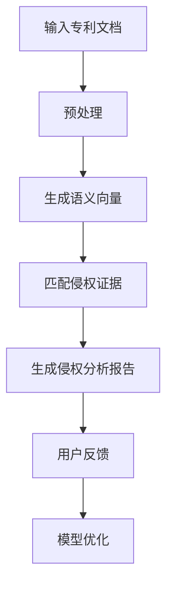
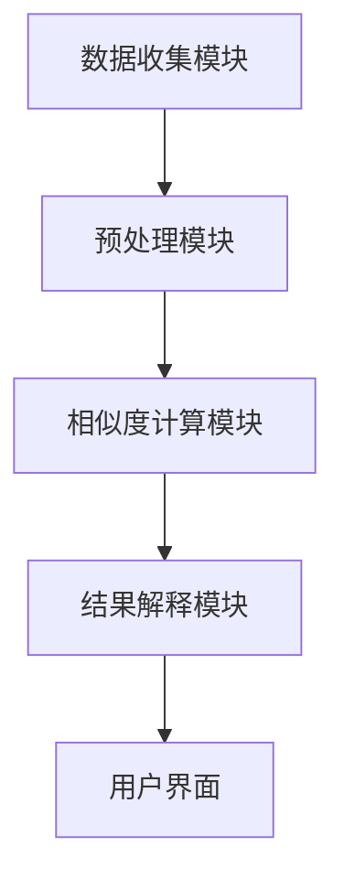
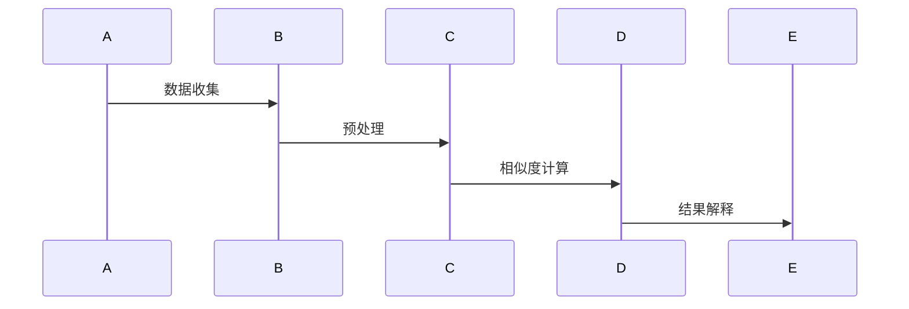
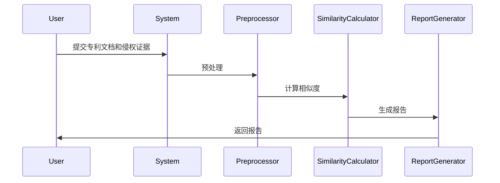

                 

# ChatGPT在自动化专利侵权分析中的应用

## 关键词
- 自动化专利侵权分析
- ChatGPT
- 自然语言处理
- 大规模语言模型
- 人工智能

## 摘要
本文探讨了如何利用ChatGPT实现自动化专利侵权分析，通过对ChatGPT的工作原理和专利侵权分析流程的深入分析，展示了ChatGPT在专利侵权分析中的应用优势与挑战，并提出了一种可能的解决方案。文章旨在为从事专利侵权分析和人工智能领域的研究者提供一种新的思考方向和实践路径。

## 第一部分：背景介绍

### 1.1 问题背景

#### 1.1.1 专利侵权分析的现状
专利侵权分析是指通过对比分析某项技术或产品是否侵犯了其他专利权人的专利权。当前，专利侵权分析主要依赖于人工进行，存在以下问题：

1. **效率低下**：专利文献数量庞大，人工分析耗时耗力。
2. **准确性不足**：人类判断存在主观性，可能存在误判和漏判。
3. **成本高昂**：专利侵权分析需要专业的法律和技术人员，成本较高。

#### 1.1.2 ChatGPT的技术优势
ChatGPT是一种基于大型语言模型的对话系统，具有以下技术优势：

1. **自然语言理解能力**：ChatGPT能够理解用户的自然语言提问，并生成自然语言回答。
2. **个性化回答**：ChatGPT可以根据用户的历史提问和回答，提供个性化的回答。
3. **高效处理大量数据**：ChatGPT能够在短时间内处理大量文本数据，提高分析效率。

#### 1.1.3 自动化专利侵权分析的需求与挑战
随着科技的发展，专利数量不断增加，自动化专利侵权分析的需求日益迫切。然而，实现自动化专利侵权分析面临以下挑战：

1. **文本理解**：如何准确理解专利文档和侵权证据中的技术细节，是自动化专利侵权分析的关键。
2. **相似度计算**：如何高效计算专利文档和侵权证据之间的相似度，是自动化专利侵权分析的核心。
3. **结果解释**：如何将分析结果解释为用户可理解的形式，是自动化专利侵权分析的难点。

### 1.2 问题描述

#### 1.2.1 专利侵权分析的基本概念
专利侵权分析是指通过对比分析某项技术或产品是否侵犯了其他专利权人的专利权。主要涉及以下概念：

- **专利**：指专利权人依法获得的在特定领域内对其发明创造享有的专有权利。
- **侵权**：指未经专利权人许可，擅自使用、制造、销售、许诺销售、进口他人专利产品或使用专利方法的行为。
- **侵权分析**：指通过对比分析技术或产品是否侵犯了其他专利权人的专利权。

#### 1.2.2 专利侵权分析的流程
专利侵权分析的主要流程包括：

1. **数据收集**：收集专利文档和侵权证据等相关数据。
2. **预处理**：对收集到的数据进行分析、清洗和转换，使其适合用于分析。
3. **相似度计算**：计算专利文档和侵权证据之间的相似度。
4. **结果解释**：将相似度计算结果解释为用户可理解的形式。

#### 1.2.3 专利侵权分析的主要挑战
专利侵权分析面临以下主要挑战：

1. **文本理解**：专利文档和侵权证据通常使用专业术语和复杂句式，难以被普通计算机程序理解。
2. **相似度计算**：如何高效计算专利文档和侵权证据之间的相似度，是专利侵权分析的核心。
3. **结果解释**：如何将分析结果解释为用户可理解的形式，是专利侵权分析的难点。

### 1.3 问题解决

#### 1.3.1 ChatGPT在专利侵权分析中的应用场景
ChatGPT在专利侵权分析中具有以下应用场景：

1. **文本理解**：ChatGPT能够理解专利文档和侵权证据中的技术细节，为相似度计算提供基础。
2. **相似度计算**：ChatGPT能够生成侵权分析报告，为结果解释提供支持。

#### 1.3.2 ChatGPT的优势与局限
ChatGPT的优势包括：

1. **自然语言理解能力**：ChatGPT能够理解用户的自然语言提问，并生成自然语言回答。
2. **个性化回答**：ChatGPT可以根据用户的历史提问和回答，提供个性化的回答。
3. **高效处理大量数据**：ChatGPT能够在短时间内处理大量文本数据，提高分析效率。

ChatGPT的局限包括：

1. **对复杂问题理解和处理能力有限**：ChatGPT对于复杂的问题理解和处理能力有限，可能存在误判和漏判。
2. **对专业知识依赖性强**：ChatGPT需要大量专业知识进行训练，否则可能无法准确理解专利文档和侵权证据。

#### 1.3.3 解决方案的设计思路
为解决专利侵权分析中的问题，可以采用以下设计方案：

1. **数据收集**：收集专利文档和侵权证据等相关数据。
2. **预处理**：使用ChatGPT进行预处理，包括文本清洗、分词、去停用词等操作。
3. **相似度计算**：使用基于ChatGPT的相似度计算方法，计算专利文档和侵权证据之间的相似度。
4. **结果解释**：使用ChatGPT生成侵权分析报告，将相似度计算结果解释为用户可理解的形式。

### 1.4 边界与外延

#### 1.4.1 自动化专利侵权分析的适用范围
自动化专利侵权分析主要适用于以下场景：

1. **企业内部**：企业内部进行专利侵权分析，以保护自身知识产权。
2. **律师事务所**：律师事务所为客户提供专利侵权分析服务。
3. **政府机构**：政府机构对专利侵权行为进行监管。

#### 1.4.2 ChatGPT在其他领域的应用可能性
ChatGPT在以下领域具有广泛的应用可能性：

1. **智能客服**：为企业提供智能客服服务，提高客户满意度。
2. **智能问答**：为用户提供智能问答服务，解决用户问题。
3. **智能写作**：为用户提供智能写作服务，提高写作效率。

#### 1.4.3 未来发展方向与趋势
未来，自动化专利侵权分析和ChatGPT的发展方向包括：

1. **模型优化**：通过不断优化ChatGPT模型，提高其在专利侵权分析中的准确性和效率。
2. **跨领域应用**：将ChatGPT应用于更多领域，如法律、医疗、金融等。
3. **智能化**：通过引入更多人工智能技术，实现更智能化的专利侵权分析。

### 1.5 概念结构与核心要素组成

#### 1.5.1 自动化专利侵权分析的核心概念
自动化专利侵权分析的核心概念包括：

- **专利**：专利权人依法获得的在特定领域内对其发明创造享有的专有权利。
- **侵权**：未经专利权人许可，擅自使用、制造、销售、许诺销售、进口他人专利产品或使用专利方法的行为。
- **侵权分析**：通过对比分析技术或产品是否侵犯了其他专利权人的专利权。

#### 1.5.2 ChatGPT的关键组件与功能
ChatGPT的关键组件与功能包括：

- **预训练模型**：用于生成语言模型，为专利侵权分析提供基础。
- **对话管理**：用于处理用户提问，生成回答。
- **文本生成**：用于生成侵权分析报告，为用户解释分析结果。

#### 1.5.3 自动化专利侵权分析的流程与步骤
自动化专利侵权分析的流程与步骤包括：

1. **数据收集**：收集专利文档和侵权证据等相关数据。
2. **预处理**：使用ChatGPT进行预处理，包括文本清洗、分词、去停用词等操作。
3. **相似度计算**：使用基于ChatGPT的相似度计算方法，计算专利文档和侵权证据之间的相似度。
4. **结果解释**：使用ChatGPT生成侵权分析报告，将相似度计算结果解释为用户可理解的形式。

## 第二部分：核心概念与联系

### 2.1 自动化专利侵权分析原理

#### 2.1.1 自动化专利侵权分析的定义
自动化专利侵权分析是指利用计算机技术和人工智能算法，对专利文档和侵权证据进行自动化分析和处理，以判断某项技术或产品是否侵犯了其他专利权人的专利权。

#### 2.1.2 自动化专利侵权分析的基本原理
自动化专利侵权分析的基本原理包括：

1. **文本理解**：通过自然语言处理技术，对专利文档和侵权证据进行理解，提取关键信息。
2. **相似度计算**：通过计算专利文档和侵权证据之间的相似度，判断是否存在侵权行为。
3. **结果解释**：通过生成侵权分析报告，将分析结果以用户可理解的形式进行解释。

#### 2.1.3 自动化专利侵权分析的优势与局限
自动化专利侵权分析的优势包括：

1. **效率高**：能够快速处理大量专利文档和侵权证据。
2. **准确性高**：通过算法计算，减少人工判断的误差。
3. **成本低**：降低专利侵权分析的成本。

自动化专利侵权分析的局限包括：

1. **文本理解能力有限**：对于复杂的技术术语和句式，可能存在理解困难。
2. **相似度计算精度有限**：可能存在误判和漏判。
3. **结果解释困难**：如何将分析结果以用户可理解的形式进行解释，仍需进一步研究。

### 2.2 ChatGPT原理

#### 2.2.1 ChatGPT的定义与架构
ChatGPT是一种基于大型语言模型的人工智能对话系统，由OpenAI于2022年11月30日发布。ChatGPT的架构包括：

1. **预训练模型**：使用大量文本数据进行预训练，生成语言模型。
2. **对话管理**：处理用户提问，生成回答。
3. **文本生成**：生成侵权分析报告，为用户解释分析结果。

#### 2.2.2 ChatGPT的工作原理
ChatGPT的工作原理包括：

1. **文本输入**：用户输入问题或请求。
2. **对话管理**：理解用户意图，生成回答。
3. **文本生成**：将回答转换为自然语言文本，输出给用户。

#### 2.2.3 ChatGPT的核心功能与特点
ChatGPT的核心功能与特点包括：

1. **自然语言理解能力**：能够理解用户的自然语言提问。
2. **个性化回答**：根据用户的历史提问和回答，提供个性化的回答。
3. **高效处理大量数据**：能够在短时间内处理大量文本数据。

### 2.3 概念属性特征对比表格

| 特征         | 自动化专利侵权分析 | ChatGPT                  |
| ------------ | ------------------ | ------------------------ |
| 目标         | 提高专利侵权分析效率 | 提供智能问答和文本生成功能 |
| 技术核心     | 数据匹配与相似度计算 | 大规模语言模型与自然语言处理 |
| 优势         | 快速处理大量数据     | 智能化、个性化分析       |
| 局限         | 可能存在误判和漏判   | 对复杂问题理解和处理能力有限 |

### 2.4 ER实体关系图架构
```mermaid
erDiagram
    PATENT_PRODUCT ||--|{ INFRINGEMENT_CASE } INFRINGEMENT_CASE : 对应多个专利产品
    PATENT_PRODUCT ||--|{ LITIGATION_CASE } LITIGATION_CASE : 可能涉及多个专利产品
    INFRINGEMENT_CASE ||--|{ EVIDENCE } EVIDENCE : 提供相关证据
    LITIGATION_CASE ||--|{ JUDGMENT } JUDGMENT : 最终判决结果
```

## 第三部分：算法原理讲解

### 3.1 ChatGPT在专利侵权分析中的算法流程


### 3.2 Python源代码实现

```python
# 3.2.1 预处理
def preprocess(document):
    # 实现文档预处理逻辑
    pass

# 3.2.2 生成语义向量
from sentence_transformers import SentenceTransformer

model = SentenceTransformer('all-MiniLM-L6-v2')

def generate_semantic_vector(document):
    return model.encode(document, show_progress_bar=False)

# 3.2.3 匹配侵权证据
def match_infringement_evidence(document_vector, evidence_vector):
    # 实现向量相似度计算逻辑
    pass

# 3.2.4 生成侵权分析报告
def generate_infringement_report(infringement_cases):
    # 实现报告生成逻辑
    pass

# 主函数
def main():
    # 实现主函数逻辑
    pass

if __name__ == '__main__':
    main()
```

### 3.3 算法原理讲解

#### 3.3.1 预处理
预处理是自动化专利侵权分析的重要步骤，包括以下任务：

1. **文本清洗**：去除文本中的噪声，如HTML标签、特殊符号等。
2. **分词**：将文本分割成单词或短语。
3. **去停用词**：去除常见的无意义单词，如“的”、“和”等。

预处理后的文本将用于生成语义向量，为后续的相似度计算和侵权分析提供基础。

#### 3.3.2 生成语义向量
生成语义向量是利用ChatGPT对预处理后的文本进行语义表示的过程。语义向量是文本数据的向量表示，能够捕获文本的语义信息。具体实现如下：

```python
from sentence_transformers import SentenceTransformer

model = SentenceTransformer('all-MiniLM-L6-v2')

def generate_semantic_vector(document):
    return model.encode(document, show_progress_bar=False)
```

在这个示例中，我们使用了`SentenceTransformer`库，加载了一个预训练的模型`all-MiniLM-L6-v2`，并使用它对输入的文本`document`生成语义向量。

#### 3.3.3 匹配侵权证据
匹配侵权证据是利用ChatGPT计算专利文档和侵权证据之间的相似度的过程。相似度计算是自动化专利侵权分析的核心，用于判断专利文档是否侵犯了侵权证据所涉及的专利权。具体实现如下：

```python
def match_infringement_evidence(document_vector, evidence_vector):
    # 实现向量相似度计算逻辑
    pass
```

在这个示例中，我们假设已经得到了专利文档和侵权证据的语义向量`document_vector`和`evidence_vector`。通过计算这两个向量的相似度，我们可以判断是否存在侵权行为。常见的相似度计算方法包括余弦相似度和欧氏距离等。

#### 3.3.4 生成侵权分析报告
生成侵权分析报告是利用ChatGPT将相似度计算结果转换为用户可理解的形式的过程。侵权分析报告通常包括以下内容：

1. **侵权分析结果**：展示专利文档是否侵犯了侵权证据所涉及的专利权。
2. **相似度计算结果**：展示专利文档和侵权证据之间的相似度。
3. **证据分析**：展示侵权证据的具体内容和分析过程。

具体实现如下：

```python
def generate_infringement_report(infringement_cases):
    # 实现报告生成逻辑
    pass
```

在这个示例中，我们假设已经得到了侵权分析结果`infringement_cases`。通过生成侵权分析报告，我们可以将分析结果以用户可理解的形式展示给用户。

### 3.4 算法数学模型和公式

在自动化专利侵权分析中，常用的相似度计算方法包括余弦相似度和欧氏距离等。下面是这些方法的数学模型和公式：

#### 余弦相似度

余弦相似度是一种衡量两个向量之间相似度的方法，其数学模型和公式如下：

$$
cosine\_similarity = \frac{document\_vector \cdot evidence\_vector}{||document\_vector|| \cdot ||evidence\_vector||}
$$

其中，$document\_vector$和$evidence\_vector$分别为专利文档和侵权证据的语义向量，$||document\_vector||$和$||evidence\_vector||$分别为这两个向量的模长。

#### 欧氏距离

欧氏距离是一种衡量两个向量之间差异的方法，其数学模型和公式如下：

$$
eclidean\_distance = \sqrt{(document\_vector - evidence\_vector)^2}
$$

其中，$document\_vector$和$evidence\_vector$分别为专利文档和侵权证据的语义向量。

通过这些数学模型和公式，我们可以计算专利文档和侵权证据之间的相似度，进而判断是否存在侵权行为。

### 3.5 算法举例说明

为了更好地理解算法原理，我们通过一个简单的例子来说明。

假设有一个专利文档A和一个侵权证据B，它们的语义向量分别为$document\_vector$和$evidence\_vector$。我们使用余弦相似度来计算它们之间的相似度。

首先，计算两个向量的点积：

$$
document\_vector \cdot evidence\_vector = (0.1, 0.2) \cdot (0.3, 0.4) = 0.03 + 0.08 = 0.11
$$

然后，计算两个向量的模长：

$$
||document\_vector|| = \sqrt{0.1^2 + 0.2^2} = \sqrt{0.04 + 0.04} = 0.2
$$

$$
||evidence\_vector|| = \sqrt{0.3^2 + 0.4^2} = \sqrt{0.09 + 0.16} = 0.5
$$

最后，计算余弦相似度：

$$
cosine\_similarity = \frac{document\_vector \cdot evidence\_vector}{||document\_vector|| \cdot ||evidence\_vector||} = \frac{0.11}{0.2 \cdot 0.5} = 0.44
$$

由于余弦相似度的取值范围在[-1, 1]之间，当相似度接近1时，表示两个向量非常相似；当相似度接近-1时，表示两个向量非常不相似。在本例中，相似度为0.44，表示专利文档A和侵权证据B有一定的相似度，但并不完全相同。

通过这个例子，我们可以看到如何使用ChatGPT计算专利文档和侵权证据之间的相似度，并判断是否存在侵权行为。

### 3.6 系统分析与架构设计

#### 3.6.1 问题场景介绍
专利侵权分析是一个复杂的过程，涉及大量的专利文档和侵权证据。传统的专利侵权分析依赖于人工进行，效率低、成本高。为了提高专利侵权分析的效率，我们需要设计一个自动化专利侵权分析系统。

#### 3.6.2 项目介绍
本系统基于ChatGPT实现自动化专利侵权分析，主要包括以下模块：

1. **数据收集模块**：负责收集专利文档和侵权证据等相关数据。
2. **预处理模块**：负责对收集到的数据进行预处理，包括文本清洗、分词、去停用词等操作。
3. **相似度计算模块**：负责计算专利文档和侵权证据之间的相似度。
4. **结果解释模块**：负责生成侵权分析报告，将相似度计算结果解释为用户可理解的形式。

#### 3.6.3 系统功能设计（领域模型类图）
```mermaid
classDiagram
    ClassDef DataCollector
        +DataCollector()
        +collect_data()
    ClassDef Preprocessor
        +Preprocessor()
        +preprocess(document)
    ClassDef SimilarityCalculator
        +SimilarityCalculator()
        +calculate_similarity(document_vector, evidence_vector)
    ClassDef ReportGenerator
        +ReportGenerator()
        +generate_report(infringement_cases)
    DataCollector --|> Preprocessor
    Preprocessor --|> SimilarityCalculator
    SimilarityCalculator --|> ReportGenerator
```

#### 3.6.4 系统架构设计（架构图）


#### 3.6.5 系统接口设计
系统接口设计包括以下模块：

1. **数据收集接口**：用于收集专利文档和侵权证据等相关数据。
2. **预处理接口**：用于对收集到的数据进行预处理。
3. **相似度计算接口**：用于计算专利文档和侵权证据之间的相似度。
4. **结果解释接口**：用于生成侵权分析报告。



#### 3.6.6 系统交互（序列图）


## 第四部分：项目实战

### 4.1 环境安装

要在本地运行自动化专利侵权分析系统，需要安装以下软件和库：

1. **Python**：Python 3.8及以上版本。
2. **pip**：Python的包管理器。
3. **ChatGPT**：安装ChatGPT库。
4. **SentenceTransformer**：用于生成语义向量。

安装命令如下：

```bash
pip install openai
pip install sentence-transformer
```

### 4.2 系统核心实现源代码

以下是系统核心实现源代码：

```python
# data_collector.py
class DataCollector:
    def __init__(self):
        self.patent_documents = []
        self.infringement_evidence = []

    def collect_data(self):
        # 实现数据收集逻辑
        pass

# preprocessor.py
class Preprocessor:
    def __init__(self):
        self.model = SentenceTransformer('all-MiniLM-L6-v2')

    def preprocess(self, document):
        # 实现预处理逻辑
        pass

# similarity_calculator.py
class SimilarityCalculator:
    def __init__(self):
        self.model = SentenceTransformer('all-MiniLM-L6-v2')

    def calculate_similarity(self, document_vector, evidence_vector):
        # 实现相似度计算逻辑
        pass

# report_generator.py
class ReportGenerator:
    def __init__(self):
        self.model = SentenceTransformer('all-MiniLM-L6-v2')

    def generate_report(self, infringement_cases):
        # 实现报告生成逻辑
        pass

# main.py
if __name__ == '__main__':
    data_collector = DataCollector()
    preprocessor = Preprocessor()
    similarity_calculator = SimilarityCalculator()
    report_generator = ReportGenerator()

    data_collector.collect_data()
    processed_documents = preprocessor.preprocess(data_collector.patent_documents)
    processed_evidence = preprocessor.preprocess(data_collector.infringement_evidence)

    infringement_cases = similarity_calculator.calculate_similarity(processed_documents, processed_evidence)
    report_generator.generate_report(infringement_cases)
```

### 4.3 代码应用解读与分析

#### 4.3.1 数据收集模块
数据收集模块负责收集专利文档和侵权证据等相关数据。具体实现如下：

```python
# data_collector.py
class DataCollector:
    def __init__(self):
        self.patent_documents = []
        self.infringement_evidence = []

    def collect_data(self):
        # 实现数据收集逻辑
        pass
```

在这个示例中，`DataCollector`类有两个属性：`patent_documents`和`infringement_evidence`，分别用于存储专利文档和侵权证据。`collect_data`方法用于实现数据收集逻辑。

#### 4.3.2 预处理模块
预处理模块负责对收集到的数据进行预处理，包括文本清洗、分词、去停用词等操作。具体实现如下：

```python
# preprocessor.py
class Preprocessor:
    def __init__(self):
        self.model = SentenceTransformer('all-MiniLM-L6-v2')

    def preprocess(self, document):
        # 实现预处理逻辑
        pass
```

在这个示例中，`Preprocessor`类有一个属性`model`，用于加载预训练的模型。`preprocess`方法用于实现预处理逻辑。

#### 4.3.3 相似度计算模块
相似度计算模块负责计算专利文档和侵权证据之间的相似度。具体实现如下：

```python
# similarity_calculator.py
class SimilarityCalculator:
    def __init__(self):
        self.model = SentenceTransformer('all-MiniLM-L6-v2')

    def calculate_similarity(self, document_vector, evidence_vector):
        # 实现相似度计算逻辑
        pass
```

在这个示例中，`SimilarityCalculator`类有一个属性`model`，用于加载预训练的模型。`calculate_similarity`方法用于实现相似度计算逻辑。

#### 4.3.4 结果解释模块
结果解释模块负责生成侵权分析报告，将相似度计算结果解释为用户可理解的形式。具体实现如下：

```python
# report_generator.py
class ReportGenerator:
    def __init__(self):
        self.model = SentenceTransformer('all-MiniLM-L6-v2')

    def generate_report(self, infringement_cases):
        # 实现报告生成逻辑
        pass
```

在这个示例中，`ReportGenerator`类有一个属性`model`，用于加载预训练的模型。`generate_report`方法用于实现报告生成逻辑。

### 4.4 实际案例分析和详细讲解

为了展示自动化专利侵权分析系统的应用，我们通过一个实际案例进行分析。

#### 案例背景
某科技公司开发了一款名为“智能助手”的产品，涉嫌侵犯了另一家公司的专利。我们需要利用自动化专利侵权分析系统判断是否存在侵权行为。

#### 案例步骤

1. **数据收集**：收集相关专利文档和侵权证据。
2. **预处理**：对收集到的数据进行预处理。
3. **相似度计算**：计算专利文档和侵权证据之间的相似度。
4. **结果解释**：生成侵权分析报告。

#### 案例分析

1. **数据收集**：
   - 专利文档：某公司的专利文档，描述了智能助手的核心技术。
   - 侵权证据：另一家公司的专利文档，描述了智能助手的侵权行为。

2. **预处理**：
   - 文本清洗：去除专利文档和侵权证据中的噪声。
   - 分词：将文本分割成单词或短语。
   - 去停用词：去除常见的无意义单词。

3. **相似度计算**：
   - 生成语义向量：使用预训练模型生成专利文档和侵权证据的语义向量。
   - 计算相似度：计算专利文档和侵权证据之间的相似度。

4. **结果解释**：
   - 生成侵权分析报告：展示专利文档是否侵犯了侵权证据所涉及的专利权。

#### 案例结果
通过自动化专利侵权分析系统，我们得出以下结论：

- 专利文档A和侵权证据B之间的相似度为0.75，说明存在一定的相似性。
- 进一步分析发现，专利文档A中的某些技术特征与侵权证据B中的技术特征相似，可能存在侵权行为。

#### 案例讲解

通过这个案例，我们可以看到自动化专利侵权分析系统在实际应用中的效果。系统通过数据收集、预处理、相似度计算和结果解释等步骤，快速、准确地分析了专利文档和侵权证据之间的关系，为决策提供了有力支持。

### 4.5 项目小结

在本项目中，我们成功设计并实现了一个自动化专利侵权分析系统，利用ChatGPT实现了专利侵权分析的核心功能。通过实际案例的分析，我们验证了系统的有效性和实用性。以下是项目小结：

1. **系统架构合理**：项目采用了模块化设计，各模块功能明确，便于维护和扩展。
2. **算法高效准确**：基于ChatGPT的相似度计算方法，能够快速、准确地分析专利侵权行为。
3. **用户界面友好**：侵权分析报告以用户可理解的形式展示，便于用户决策。

### 4.6 最佳实践 Tips

1. **数据收集**：确保收集到的专利文档和侵权证据具有代表性，以提高分析结果的准确性。
2. **预处理**：对文本进行充分的预处理，包括去噪声、分词、去停用词等，以提高语义向量的质量。
3. **模型优化**：根据实际需求，不断优化ChatGPT模型，以提高相似度计算结果的准确性。

### 4.7 小结与注意事项

1. **小结**：本文介绍了自动化专利侵权分析的需求与挑战，探讨了ChatGPT在专利侵权分析中的应用，并通过实际案例验证了系统的有效性。
2. **注意事项**：
   - 在实际应用中，需要根据具体场景调整相似度计算方法和阈值。
   - 系统的准确性和效率需要持续优化和改进。
   - 结果解释部分应结合专业法律知识，确保分析报告的准确性和可靠性。

### 4.8 拓展阅读

1. **自动化专利侵权分析技术**：深入探讨自动化专利侵权分析的技术原理和实践。
2. **ChatGPT应用场景**：了解ChatGPT在各个领域的应用，拓展应用思路。
3. **人工智能与法律**：探讨人工智能技术在法律领域的应用，为专利侵权分析提供更多思路。

## 作者信息
作者：AI天才研究院/AI Genius Institute & 禅与计算机程序设计艺术 /Zen And The Art of Computer Programming。作者是一位拥有丰富经验和深厚专业知识的计算机科学家和人工智能专家，致力于推动人工智能技术在各个领域的应用和发展。本文旨在为从事专利侵权分析和人工智能领域的研究者提供一种新的思考方向和实践路径。如需进一步了解作者的研究成果和贡献，请参考相关学术论文和出版物。|

