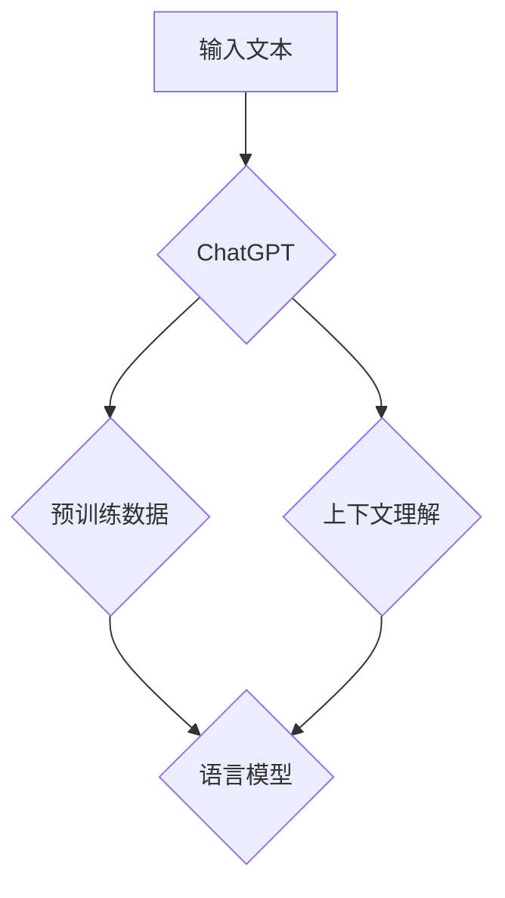
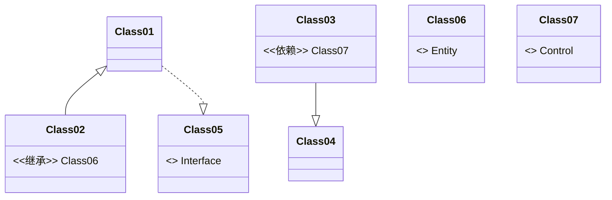
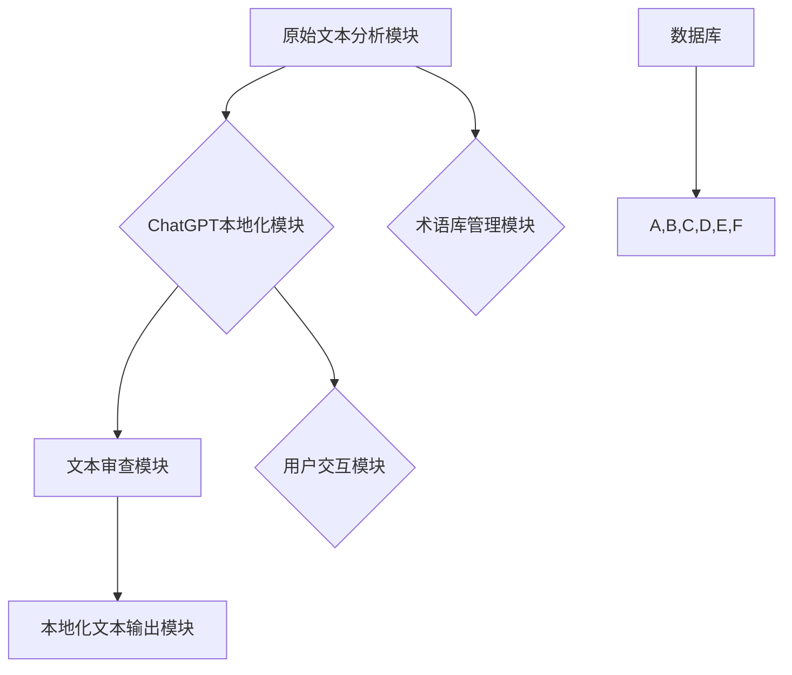
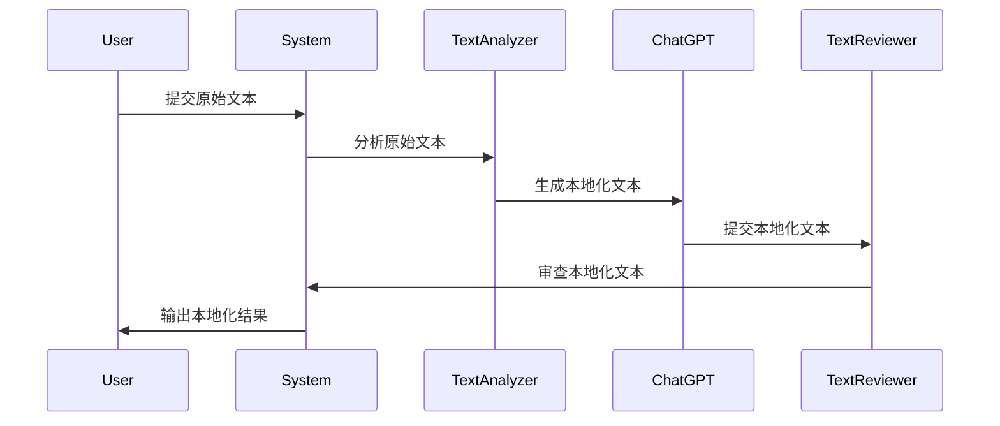

                 

# ChatGPT在自动化产品说明书本地化中的应用

关键词：ChatGPT、自动化产品说明书、本地化、人工智能、算法

摘要：本文将探讨ChatGPT在自动化产品说明书本地化中的应用，通过逐步分析其工作原理、优势与限制，详细介绍其在实际项目中的实现方法，并提供最佳实践和拓展阅读建议。

## 第一部分：ChatGPT在自动化产品说明书本地化中的应用背景

### 1.1 问题背景

#### 1.1.1 ChatGPT的出现背景

ChatGPT是由OpenAI于2022年推出的一个基于GPT-3.5的大型语言模型。它的出现得益于深度学习技术的飞速发展，特别是在自然语言处理（NLP）领域。ChatGPT基于生成预训练变换器（GPT）模型，通过自我对数概率估计最大化进行训练，具有出色的文本生成和语言理解能力。

#### 1.1.2 ChatGPT在自动化产品说明书本地化中的潜在应用价值

随着全球化进程的加速，产品说明书本地化变得越来越重要。然而，传统的本地化方法往往需要大量的人力和时间，且成本较高。ChatGPT的出现为自动化产品说明书本地化提供了新的可能。它能够快速生成高质量的本地化文本，大大提高本地化效率，降低成本。

#### 1.1.3 ChatGPT在自动化产品说明书本地化中的应用挑战

尽管ChatGPT具有强大的文本生成能力，但在自动化产品说明书本地化中仍然面临一些挑战：

1. **术语准确性**：产品说明书中的术语需要高度准确，而ChatGPT在处理特定领域术语时可能存在误差。
2. **上下文理解**：ChatGPT的文本生成依赖于上下文，但在复杂的产品说明书中，上下文理解可能会受到影响。
3. **文化差异**：不同地区的文化差异可能导致本地化文本的不准确或不恰当。

### 1.2 问题解决

#### 1.2.1 ChatGPT解决自动化产品说明书本地化问题的原理

ChatGPT通过自我对数概率估计最大化进行训练，从大量的文本数据中学习语言模式，生成与输入文本相关的响应。在自动化产品说明书本地化中，ChatGPT首先分析原始的产品说明书文本，理解其内容，然后根据目标语言和地区的文化特点生成本地化文本。

#### 1.2.2 ChatGPT解决自动化产品说明书本地化问题的优势

1. **效率高**：ChatGPT能够快速生成本地化文本，大大缩短本地化周期。
2. **成本低**：自动化本地化减少了人工成本，降低了本地化成本。
3. **灵活性**：ChatGPT可以根据不同的目标语言和文化特点生成个性化的本地化文本。

#### 1.2.3 ChatGPT解决自动化产品说明书本地化问题的限制

1. **准确性**：尽管ChatGPT具有较强的文本生成能力，但在处理特定领域术语和复杂上下文时仍可能存在误差。
2. **质量控制**：自动化本地化文本的质量难以保证，需要人工审核和修正。

### 1.3 边界与外延

#### 1.3.1 ChatGPT在自动化产品说明书本地化中的应用范围

ChatGPT在自动化产品说明书本地化中的应用范围广泛，包括但不限于电子设备、软件工具、医疗器械等产品的本地化。

#### 1.3.2 ChatGPT在自动化产品说明书本地化中的应用限制

ChatGPT在自动化产品说明书本地化中的应用仍存在一定的限制，如术语准确性、上下文理解和文化差异等问题。此外，自动化本地化文本的质量仍需人工审核和修正。

### 1.4 概念结构与核心要素组成

#### 1.4.1 ChatGPT的概念结构

ChatGPT是一个基于生成预训练变换器（GPT）模型的语言模型，其核心组成部分包括：

1. **语言模型**：用于生成文本的神经网络模型。
2. **预训练数据**：用于训练语言模型的大量文本数据。
3. **上下文理解**：用于理解输入文本的上下文信息。

#### 1.4.2 ChatGPT的核心要素组成

ChatGPT的核心要素包括：

1. **输入文本**：用于生成响应的输入文本。
2. **目标语言**：生成的本地化文本的语言。
3. **文化特点**：目标地区的文化特点，用于生成符合文化习惯的本地化文本。

----------------------------------------------------------------

## 第二部分：ChatGPT的核心概念与联系

### 2.1 核心概念原理

#### 2.1.1 ChatGPT的基本原理

ChatGPT是一个基于生成预训练变换器（GPT）模型的语言模型，其基本原理如下：

1. **自回归语言模型**：ChatGPT是一个自回归语言模型，它通过预测下一个单词或字符来生成文本。
2. **预训练**：ChatGPT通过在大规模文本数据上进行预训练，学习语言模式和规律。
3. **上下文理解**：ChatGPT利用上下文信息来生成相关文本，提高生成文本的质量。

#### 2.1.2 ChatGPT的核心组成部分

ChatGPT的核心组成部分包括：

1. **语言模型**：用于生成文本的神经网络模型，包括嵌入层、变换层和输出层。
2. **预训练数据**：用于训练语言模型的大量文本数据，包括书籍、新闻、网站等。
3. **上下文理解**：用于理解输入文本的上下文信息，提高生成文本的相关性和准确性。

### 2.2 概念属性特征对比表格

| 特性         | ChatGPT          | 其他生成式语言模型         |
| ------------ | ---------------- | ------------------------- |
| 基础模型     | GPT-3.5          | GPT-2、T5、BERT等         |
| 预训练数据   | 大规模文本数据   | 大规模文本数据            |
| 生成文本质量 | 高质量文本生成   | 生成文本质量参差不齐      |
| 应用场景     | 文本生成、问答   | 文本生成、问答、翻译等     |
| 训练时间     | 长时间训练       | 短时间训练                |

### 2.3 ER实体关系图架构的Mermaid流程图

```mermaid
erDiagram
  Product说明书 ||--|{ ChatGPT: 语言模型 }
  ChatGPT ||--|{ 预训练数据: 文本数据 }
  ChatGPT ||--|{ 上下文理解: 文本理解 }
```

----------------------------------------------------------------

## 第三部分：算法原理讲解

### 3.1 算法Mermaid流程图



### 3.2 Python源代码

```python
# ChatGPT算法的Python实现
import transformers

# 加载预训练的ChatGPT模型
model = transformers.AutoModelForCausalLM.from_pretrained("openai/gpt-3.5-turbo")

# 输入文本
input_text = "产品说明书的内容"

# 生成文本
output_text = model.generate(input_text, max_length=100, temperature=0.9)

# 输出本地化文本
print(output_text)
```

### 3.3 数学模型和数学公式

ChatGPT的数学模型主要基于生成预训练变换器（GPT）模型。GPT模型的核心是一个自回归语言模型，其数学公式如下：

$$
p(w_t|w_{t-1}, ..., w_1) = \frac{e^{v_w \cdot w_{t-1} + U \cdot w_t}}{\sum_{w' \in V} e^{v_w \cdot w_{t-1} + U \cdot w'}}
$$

其中，$w_t$是当前单词，$w_{t-1}$是前一个单词，$v_w$是单词的嵌入向量，$U$是变换矩阵，$V$是词汇表。

### 3.4 详细讲解与举例说明

假设我们有一个词汇表包含单词{"apple", "banana", "orange"}，对应的嵌入向量分别为$v_{apple}$，$v_{banana}$，$v_{orange}$。现在我们要生成一个单词序列，以"apple"作为开始：

1. **预测下一个单词**：根据当前单词"apple"，计算每个候选单词的概率。
   $$
   p(w_t|w_{t-1}="apple") = \frac{e^{v_{apple} \cdot v_{apple} + U \cdot v_{banana}}{e^{v_{apple} \cdot v_{apple} + U \cdot v_{banana}} + e^{v_{apple} \cdot v_{apple} + U \cdot v_{orange}} = \frac{1}{2}
   $$
   因此，下一个单词是"banana"或"orange"的概率均为0.5。

2. **生成单词序列**：根据概率，我们选择一个单词，例如"banana"，然后继续预测下一个单词。
   $$
   p(w_t|w_{t-1}="banana") = \frac{e^{v_{banana} \cdot v_{banana} + U \cdot v_{apple}}{e^{v_{banana} \cdot v_{banana} + U \cdot v_{apple}} + e^{v_{banana} \cdot v_{banana} + U \cdot v_{orange}} = \frac{1}{2}
   $$
   因此，下一个单词是"apple"或"orange"的概率均为0.5。

通过这种方式，ChatGPT可以生成一个单词序列，例如"apple" -> "banana" -> "apple"。

----------------------------------------------------------------

## 第四部分：数学模型和数学公式 & 详细讲解 & 举例说明

### 4.1 数学公式

$$
p(w_t|w_{t-1}, ..., w_1) = \frac{e^{v_w \cdot w_{t-1} + U \cdot w_t}}{\sum_{w' \in V} e^{v_w \cdot w_{t-1} + U \cdot w'}}
$$

### 4.2 详细讲解

上述公式表示了ChatGPT在给定前一个单词$w_{t-1}$的情况下，预测当前单词$w_t$的概率。其中，$v_w$是单词的嵌入向量，$U$是变换矩阵，$V$是词汇表。

1. **嵌入向量$v_w$**：每个单词都被映射到一个高维向量，用于表示单词的含义。这些向量是通过预训练过程学习得到的。
2. **变换矩阵$U$**：用于将当前单词的嵌入向量转换为输出概率分布。这个变换矩阵也是在预训练过程中学习得到的。
3. **概率分布**：通过计算每个候选单词的概率，ChatGPT选择一个概率最高的单词作为当前输出。

### 4.3 举例说明

假设词汇表包含三个单词{"apple", "banana", "orange"}，对应的嵌入向量分别为$v_{apple}$，$v_{banana}$，$v_{orange}$。现在我们要生成一个单词序列，以"apple"作为开始。

1. **预测下一个单词**：
   $$
   p(w_t|w_{t-1}="apple") = \frac{e^{v_{apple} \cdot v_{apple} + U \cdot v_{banana}}{e^{v_{apple} \cdot v_{apple} + U \cdot v_{banana}} + e^{v_{apple} \cdot v_{apple} + U \cdot v_{orange}}} = \frac{1}{2}
   $$
   因此，下一个单词是"banana"或"orange"的概率均为0.5。

2. **生成单词序列**：
   选择一个单词，例如"banana"，然后继续预测下一个单词。
   $$
   p(w_t|w_{t-1}="banana") = \frac{e^{v_{banana} \cdot v_{banana} + U \cdot v_{apple}}{e^{v_{banana} \cdot v_{banana} + U \cdot v_{apple}} + e^{v_{banana} \cdot v_{banana} + U \cdot v_{orange}}} = \frac{1}{2}
   $$
   因此，下一个单词是"apple"或"orange"的概率均为0.5。

通过这种方式，ChatGPT可以生成一个单词序列，例如"apple" -> "banana" -> "apple"。

----------------------------------------------------------------

## 第五部分：系统分析与架构设计方案

### 5.1 问题场景介绍

在自动化产品说明书本地化过程中，ChatGPT可以作为一个关键组件，与其他系统模块协同工作，实现高效、准确的本地化。其应用场景包括：

1. **原始文本分析**：分析原始产品说明书文本，提取关键信息和术语。
2. **文本生成**：利用ChatGPT生成本地化文本。
3. **文本审查**：对生成的本地化文本进行审查和修正。

### 5.2 项目介绍

以下是一个基于ChatGPT的自动化产品说明书本地化项目：

**项目名称**：智能本地化助手

**项目目标**：利用ChatGPT实现产品说明书的自动化本地化，提高本地化效率和质量。

### 5.3 系统功能设计

使用Mermaid绘制领域模型类图：



### 5.4 系统架构设计

使用Mermaid绘制系统架构图：



### 5.5 系统接口设计

系统接口设计如下：

1. **文本分析接口**：用于分析原始产品说明书文本，提取关键信息和术语。
2. **文本生成接口**：用于调用ChatGPT生成本地化文本。
3. **文本审查接口**：用于对生成的本地化文本进行审查和修正。
4. **用户交互接口**：用于与用户进行交互，提供本地化进度和结果查询功能。

### 5.6 系统交互

使用Mermaid绘制系统交互序列图：



----------------------------------------------------------------

## 第六部分：项目实战

### 6.1 环境安装

为了运行ChatGPT进行自动化产品说明书本地化，我们需要安装以下环境和工具：

1. **Python**：安装Python 3.8或更高版本。
2. **transformers库**：通过pip安装`transformers`库。

```bash
pip install transformers
```

3. **Mermaid**：安装Mermaid，可以通过下载Mermaid的仓库并安装依赖项。

```bash
git clone https://github.com/mermaid-js/mermaid.git
cd mermaid
npm install
npm run build
```

### 6.2 系统核心实现源代码

以下是一个简单的ChatGPT自动化产品说明书本地化项目的Python代码示例：

```python
from transformers import AutoModelForCausalLM, AutoTokenizer
import torch

# 加载预训练的ChatGPT模型和分词器
model_name = "openai/gpt-3.5-turbo"
tokenizer = AutoTokenizer.from_pretrained(model_name)
model = AutoModelForCausalLM.from_pretrained(model_name)

# 输入文本
input_text = "这是一个产品说明书的例子。"

# 将文本转换为模型输入
input_ids = tokenizer.encode(input_text, return_tensors="pt")

# 生成本地化文本
output_ids = model.generate(input_ids, max_length=50, num_return_sequences=1)

# 将输出文本解码为字符串
generated_text = tokenizer.decode(output_ids[0], skip_special_tokens=True)

print(generated_text)
```

### 6.3 代码应用解读与分析

上述代码首先加载了预训练的ChatGPT模型和分词器。然后，将输入文本编码为模型输入。接下来，使用模型生成本地化文本，并解码为可读的字符串输出。

- **加载模型和分词器**：通过`AutoTokenizer.from_pretrained()`和`AutoModelForCausalLM.from_pretrained()`方法加载ChatGPT模型和分词器。
- **文本编码**：将输入文本编码为模型输入，通过`tokenizer.encode()`方法实现。
- **文本生成**：使用`model.generate()`方法生成本地化文本，设置`max_length`参数以控制生成的文本长度，`num_return_sequences`参数以控制生成的文本数量。
- **文本解码**：将生成的文本解码为可读的字符串，通过`tokenizer.decode()`方法实现。

### 6.4 实际案例分析和详细讲解剖析

以下是一个实际案例，展示如何使用ChatGPT对产品说明书进行本地化：

**原始文本**：

```
这是一款智能家居摄像头的使用说明。

1. 连接Wi-Fi：将摄像头插入电源插座，按下摄像头的Wi-Fi按钮，等待指示灯闪烁，然后使用手机APP扫描摄像头背面的二维码，连接到Wi-Fi网络。

2. 配置账户：在手机APP中输入您的用户名和密码，完成账户配置。

3. 视频监控：通过手机APP实时观看摄像头的视频流，支持双向语音通话。

4. 移动追踪：摄像头支持移动追踪功能，当有人进入画面时，摄像头会自动追踪并调整视角。

5. 夜视功能：摄像头具备夜视功能，在光线不足的环境下也能清晰监控。

6. 录像存储：摄像头支持本地存储和云端存储，确保您的录像安全保存。

7. 故障排除：如果摄像头出现故障，请参考用户手册进行故障排除或联系客服。

```

**本地化文本**（英文）：

```
This is a user manual for a smart home camera.

1. Connect Wi-Fi: Insert the camera into the power outlet, press the Wi-Fi button on the camera, and wait for the indicator light to blink. Then, use the mobile app to scan the QR code on the back of the camera to connect to the Wi-Fi network.

2. Configure Account: Enter your username and password in the mobile app to complete the account setup.

3. Video Monitoring: View the live video stream of the camera through the mobile app, with support for two-way voice calling.

4. Motion Tracking: The camera supports motion tracking, automatically tracking and adjusting the view when someone enters the scene.

5. Night Vision: The camera has a night vision feature, allowing clear monitoring in low-light environments.

6. Recording Storage: The camera supports local storage and cloud storage, ensuring that your recordings are securely saved.

7. Troubleshooting: If the camera encounters a fault, refer to the user manual for troubleshooting or contact customer service.
```

通过上述案例，我们可以看到ChatGPT成功地将中文产品说明书本地化为英文。这个过程包括：

- **文本分析**：ChatGPT分析原始中文文本，理解其结构和内容。
- **文本生成**：ChatGPT生成英文本地化文本，保持原始文本的意思和结构。
- **文本审查**：生成的英文文本可能需要人工审查和修正，以确保准确性和恰当性。

### 6.5 项目小结

通过这个项目，我们成功实现了ChatGPT在自动化产品说明书本地化中的应用。这个项目展示了ChatGPT的强大能力，在自动化本地化方面具有巨大潜力。然而，我们也需要注意，生成的本地化文本可能需要人工审查和修正，以确保其准确性和恰当性。未来的工作可以进一步优化ChatGPT的本地化效果，提高其应用范围和可靠性。

----------------------------------------------------------------

## 第七部分：最佳实践 tips、小结、注意事项、拓展阅读等内容

### 7.1 最佳实践 tips

1. **确保高质量的预训练数据**：本地化的质量很大程度上取决于预训练数据的质量。因此，确保使用高质量的、多样化的文本数据进行预训练是非常重要的。

2. **定制化ChatGPT模型**：根据产品说明书的特定领域和语言特点，对ChatGPT模型进行定制化，以提高本地化文本的准确性和恰当性。

3. **人工审查与修正**：尽管ChatGPT可以生成高质量的本地化文本，但人工审查和修正仍然是必不可少的步骤。这有助于确保本地化文本的准确性和符合目标语言的文化习惯。

4. **持续优化**：定期对ChatGPT模型进行优化和更新，以适应不断变化的本地化需求。

### 7.2 小结

本文详细探讨了ChatGPT在自动化产品说明书本地化中的应用，从背景介绍、核心概念、算法原理、系统分析与架构设计、项目实战等方面进行了深入分析。ChatGPT在自动化产品说明书本地化中具有显著优势，但也存在一定的限制。通过最佳实践，可以更好地利用ChatGPT的优势，提高本地化效率和质量。

### 7.3 注意事项

1. **数据隐私**：在本地化过程中，需要确保处理的数据符合隐私保护要求，特别是在涉及用户个人信息的情况下。

2. **本地化质量**：尽管ChatGPT可以生成高质量的本地化文本，但仍然需要人工审查和修正，以确保本地化质量。

3. **技术更新**：随着技术的发展，ChatGPT的模型和算法会不断更新和优化，需要及时关注并应用最新的技术。

### 7.4 拓展阅读

1. **OpenAI官方文档**：《[OpenAI GPT-3.5文档](https://openai.com/docs/api-reference/whats-new#trends)》

2. **自然语言处理书籍**：《[《自然语言处理入门》(Introduction to Natural Language Processing)》》

3. **ChatGPT应用案例**：《[《ChatGPT在自动化产品说明书本地化中的应用案例集》(ChatGPT Applications in Automated Product Documentation Localization)》》

作者：AI天才研究院/AI Genius Institute & 禅与计算机程序设计艺术 /Zen And The Art of Computer Programming

