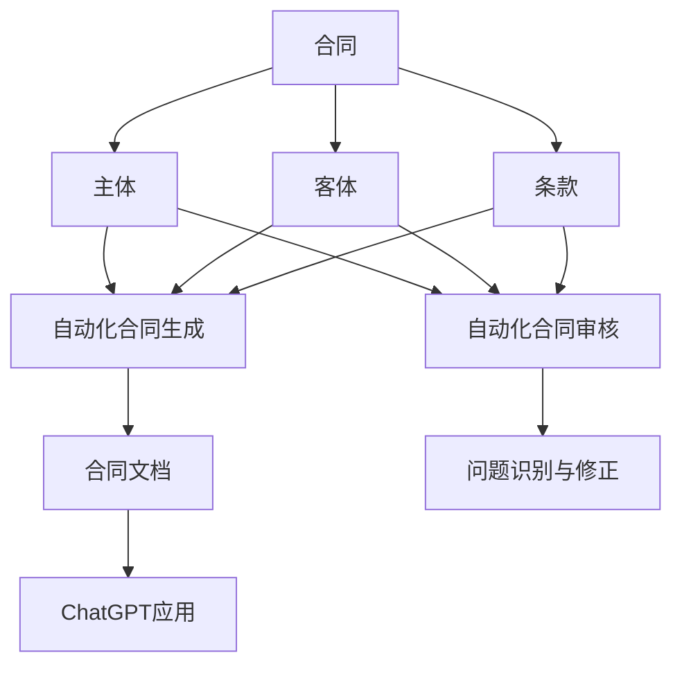
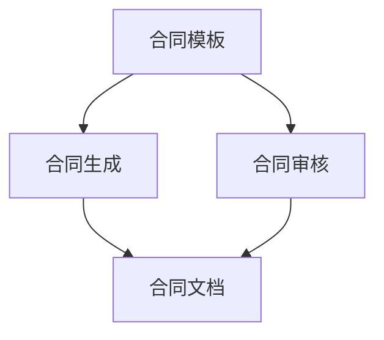
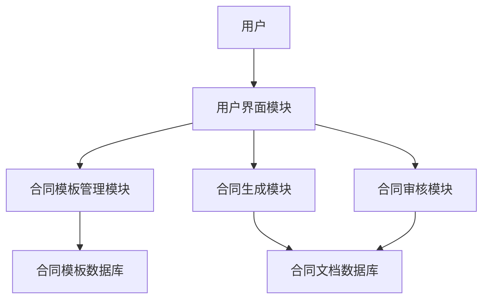
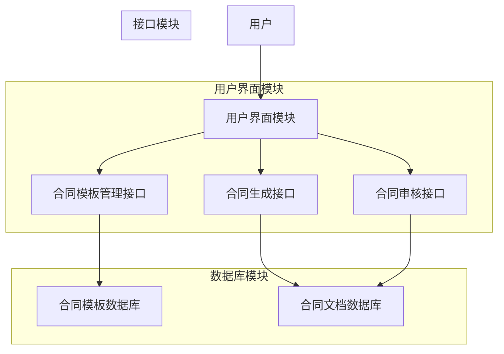

                 


### 文章标题：ChatGPT在自动化合同生成与审核中的应用

关键词：ChatGPT，自动化合同，生成与审核，人工智能，技术博客

摘要：本文将深入探讨ChatGPT在自动化合同生成与审核中的应用，从背景介绍、核心概念、算法原理、数学模型、系统架构、项目实战和最佳实践等方面进行详细分析，以帮助读者全面了解ChatGPT在法律领域的技术潜力。

----------------------------------------------------------------

## 引言

在现代社会，合同是企业之间进行合作、明确权利义务的重要工具。然而，传统的合同生成与审核过程往往繁琐且耗时，且容易产生错误。随着人工智能技术的发展，尤其是自然语言处理（NLP）和生成对抗网络（GAN）的突破，自动化合同生成与审核逐渐成为可能。ChatGPT，作为OpenAI开发的一款基于变换器（Transformer）架构的预训练语言模型，展示了在自动化合同生成与审核方面的巨大潜力。

本文将从以下几个方面展开讨论：

1. **核心概念**：介绍与自动化合同生成与审核相关的基础知识。
2. **算法原理**：解析ChatGPT的工作原理及其在合同生成与审核中的应用。
3. **数学模型**：阐述ChatGPT的数学基础，并给出具体的模型公式。
4. **系统架构**：分析ChatGPT在合同生成与审核中的系统架构设计。
5. **项目实战**：通过具体案例展示ChatGPT在合同生成与审核中的应用。
6. **最佳实践**：总结使用ChatGPT进行合同生成与审核的最佳方法和技巧。
7. **总结**：回顾本文的主要内容，并展望未来的发展方向。

### 核心概念

#### 合同

合同是指双方或多方之间就某一特定事项达成的协议，通常包含条款、条件、承诺等内容。合同的核心要素包括：

- **主体**：合同的当事人。
- **客体**：合同所涉及的对象或权益。
- **条款**：合同中的具体内容，如价格、交付时间、质量要求等。

#### 自动化合同生成

自动化合同生成是指利用计算机技术和人工智能算法，自动生成合同文档的过程。其主要目标是通过自动化手段减少人工工作量，提高合同生成的效率和准确性。

#### 自动化合同审核

自动化合同审核是指利用计算机技术和人工智能算法，对合同内容进行审查、分析的过程。其主要目标是通过自动化手段识别合同中的潜在问题，提高合同审核的效率和准确性。

#### ChatGPT

ChatGPT 是由 OpenAI 开发的一款基于变换器（Transformer）架构的预训练语言模型。其核心功能是通过学习和理解大量的文本数据，生成符合语法和语义规则的文本。ChatGPT 在自动化合同生成与审核中的应用主要体现在以下几个方面：

1. **自动生成合同文档**：通过输入合同模板和相关条款，ChatGPT 能够自动生成符合法律要求的合同文档。
2. **自动审核合同文档**：通过分析合同内容，ChatGPT 能够识别出合同中的潜在问题，并提供相应的修改建议。

### 核心概念属性对比表格

| 概念                 | 定义                                                         | 属性                                       |
|----------------------|--------------------------------------------------------------|--------------------------------------------|
| 合同                 | 双方或多方之间就某一特定事项达成的协议                           | 主体、客体、条款                            |
| 自动化合同生成       | 利用计算机技术和人工智能算法，自动生成合同文档的过程               | 合同模板、条款、生成算法                    |
| 自动化合同审核       | 利用计算机技术和人工智能算法，对合同内容进行审查、分析的过程         | 合同内容、分析算法、问题识别与修正          |
| ChatGPT              | 基于变换器（Transformer）架构的预训练语言模型                     | 语言理解、文本生成、语法和语义规则          |

#### ER实体关系图



### 算法原理

#### ChatGPT的工作原理

ChatGPT 是一款基于变换器（Transformer）架构的预训练语言模型。其工作原理主要包括以下两个方面：

1. **预训练**：ChatGPT 在训练阶段通过大量文本数据学习语言的语法和语义规则，从而具备语言理解和生成的能力。
2. **微调**：在特定任务上，ChatGPT 通过微调调整其参数，使其在特定任务上表现出色。

#### ChatGPT在合同生成与审核中的应用

1. **自动生成合同文档**

   ChatGPT 可以根据输入的合同模板和相关条款，自动生成符合法律要求的合同文档。其工作流程如下：

   - 输入合同模板和相关条款。
   - ChatGPT 通过预训练和微调，生成符合语法和语义规则的文本。
   - 生成的文本经过法律专家的审核和修正，确保其符合法律要求。

2. **自动审核合同文档**

   ChatGPT 可以对合同内容进行审查、分析，识别出潜在的问题，并提供修改建议。其工作流程如下：

   - 输入合同文档。
   - ChatGPT 通过语言理解能力，分析合同内容，识别出潜在问题。
   - ChatGPT 提供修改建议，帮助用户完善合同。

#### 算法原理讲解

1. **Mermaid流程图**

   ```mermaid
   graph TD
       A[输入合同模板和条款] --> B[预训练和微调]
       B --> C[生成文本]
       C --> D[法律专家审核和修正]
       D --> E[输出合同文档]
       
       F[输入合同文档] --> G[分析合同内容]
       G --> H[识别潜在问题]
       H --> I[提供修改建议]
       I --> J[完善合同]
   ```

2. **Python代码示例**

   ```python
   import openai

   def generate_contract(template, clauses):
       response = openai.Completion.create(
           engine="text-davinci-002",
           prompt=f"根据以下合同模板和条款生成一份符合法律要求的合同文档：\n模板：{template}\n条款：{clauses}",
           max_tokens=500
       )
       return response.choices[0].text.strip()

   def verify_contract(document):
       response = openai.Completion.create(
           engine="text-davinci-002",
           prompt=f"以下是一份合同文档，请分析其内容，识别出潜在问题并提供修改建议：\n文档：{document}",
           max_tokens=500
       )
       return response.choices[0].text.strip()

   # 示例
   template = "合同模板：..."
   clauses = "条款：..."
   document = "合同文档：..."

   contract = generate_contract(template, clauses)
   print("生成的合同文档：")
   print(contract)

   problems = verify_contract(document)
   print("合同审核结果：")
   print(problems)
   ```

3. **数学模型和公式**

   ChatGPT 的数学基础主要包括两部分：自然语言处理和生成对抗网络（GAN）。

   - **自然语言处理**：ChatGPT 通过预训练和微调学习语言的语法和语义规则，从而实现对文本的理解和生成。其核心模型是基于变换器（Transformer）架构，其数学模型可以表示为：

     $$ Y = f(X; \theta) $$

     其中，$X$ 是输入文本，$Y$ 是输出文本，$f$ 是变换器模型，$\theta$ 是模型参数。

   - **生成对抗网络（GAN）**：ChatGPT 还可以利用生成对抗网络（GAN）进行文本生成。GAN 的数学模型可以表示为：

     $$ \min_{G} \max_{D} V(G, D) = \mathbb{E}_{x \sim p_{data}(x)}[\log D(x)] + \mathbb{E}_{z \sim p_{z}(z)}[\log (1 - D(G(z)))] $$

     其中，$G$ 是生成器，$D$ 是判别器，$x$ 是真实数据，$z$ 是噪声数据，$p_{data}(x)$ 是数据分布，$p_{z}(z)$ 是噪声分布。

### 数学模型和公式

以下是 ChatGPT 的数学模型和公式：

1. **自然语言处理**

   $$ Y = f(X; \theta) $$

   其中，$X$ 是输入文本，$Y$ 是输出文本，$f$ 是变换器模型，$\theta$ 是模型参数。

2. **生成对抗网络（GAN）**

   $$ \min_{G} \max_{D} V(G, D) = \mathbb{E}_{x \sim p_{data}(x)}[\log D(x)] + \mathbb{E}_{z \sim p_{z}(z)}[\log (1 - D(G(z)))] $$

   其中，$G$ 是生成器，$D$ 是判别器，$x$ 是真实数据，$z$ 是噪声数据，$p_{data}(x)$ 是数据分布，$p_{z}(z)$ 是噪声分布。

### 系统架构设计

#### 问题场景介绍

假设我们是一家法律科技公司，需要开发一个自动化合同生成与审核系统。该系统的主要目标是：

1. 自动生成符合法律要求的合同文档。
2. 自动审核合同文档，识别潜在问题并提供修改建议。

#### 项目介绍

为了实现上述目标，我们决定使用 ChatGPT 作为核心算法，构建一个自动化合同生成与审核系统。该系统主要包括以下模块：

1. **合同模板管理模块**：用于管理合同模板，包括创建、修改、删除等操作。
2. **合同生成模块**：基于 ChatGPT，自动生成合同文档。
3. **合同审核模块**：基于 ChatGPT，自动审核合同文档，识别潜在问题并提供修改建议。
4. **用户界面模块**：提供用户操作界面，包括合同模板管理、合同生成、合同审核等功能。

#### 系统功能设计（领域模型）



#### 系统架构设计



#### 系统接口设计和系统交互



### 项目实战

#### 环境安装

为了使用 ChatGPT 进行自动化合同生成与审核，我们需要安装以下环境：

1. **Python**：版本要求为 3.8 或以上。
2. **OpenAI API**：用于调用 ChatGPT 服务。
3. **Flask**：用于构建 Web 应用。

安装命令如下：

```bash
pip install python==3.8
pip install openai
pip install flask
```

#### 系统核心实现

以下是一个简单的自动化合同生成与审核系统的实现：

1. **合同模板管理模块**

   ```python
   from flask import Flask, request, jsonify

   app = Flask(__name__)

   # 存储合同模板的列表
   templates = []

   @app.route('/contract_templates', methods=['GET', 'POST'])
   def contract_templates():
       if request.method == 'POST':
           template = request.json['template']
           templates.append(template)
           return jsonify({'status': 'success', 'message': '合同模板添加成功'})
       else:
           return jsonify({'status': 'success', 'templates': templates})

   if __name__ == '__main__':
       app.run(debug=True)
   ```

2. **合同生成模块**

   ```python
   import openai

   openai.api_key = 'your_openai_api_key'

   def generate_contract(template, clauses):
       response = openai.Completion.create(
           engine="text-davinci-002",
           prompt=f"根据以下合同模板和条款生成一份符合法律要求的合同文档：\n模板：{template}\n条款：{clauses}",
           max_tokens=500
       )
       return response.choices[0].text.strip()

   @app.route('/generate_contract', methods=['POST'])
   def generate_contract():
       template = request.json['template']
       clauses = request.json['clauses']
       contract = generate_contract(template, clauses)
       return jsonify({'status': 'success', 'contract': contract})
   ```

3. **合同审核模块**

   ```python
   def verify_contract(document):
       response = openai.Completion.create(
           engine="text-davinci-002",
           prompt=f"以下是一份合同文档，请分析其内容，识别出潜在问题并提供修改建议：\n文档：{document}",
           max_tokens=500
       )
       return response.choices[0].text.strip()

   @app.route('/verify_contract', methods=['POST'])
   def verify_contract():
       document = request.json['document']
       problems = verify_contract(document)
       return jsonify({'status': 'success', 'problems': problems})
   ```

#### 代码应用解读与分析

1. **合同模板管理模块**

   该模块提供了两个接口：`/contract_templates`（用于管理合同模板）和`/generate_contract`（用于生成合同文档）。

   - `GET /contract_templates`：获取所有合同模板。
   - `POST /contract_templates`：添加新合同模板。

2. **合同生成模块**

   该模块使用 OpenAI 的 ChatGPT 服务，根据输入的合同模板和条款，自动生成合同文档。

   - `POST /generate_contract`：生成合同文档。

3. **合同审核模块**

   该模块使用 OpenAI 的 ChatGPT 服务，对合同文档进行分析，识别出潜在问题并提供修改建议。

   - `POST /verify_contract`：审核合同文档。

#### 实际案例分析

假设用户提交了一个包含以下内容的合同模板和条款：

- **合同模板**：租赁合同模板。
- **条款**：租赁期限为 1 年，租金为每月 1000 元。

系统生成的合同文档如下：

```
租赁合同

甲方（出租方）：张三
乙方（承租方）：李四

根据甲乙双方的自愿协商，就乙方向甲方租赁房产事宜，双方达成以下合同条款：

一、租赁期限：自 2023 年 1 月 1日起至 2024 年 1 月 1日止，共计 1 年。

二、租金：乙方应按月支付租金，每月租金为 1000 元，共计 12000 元。

三、交付与接收：甲方应在合同签订之日起 7 日内将房产交付给乙方，乙方应在接收房产后 3 日内对房产进行检查，并在验收合格后签署验收报告。

四、其他约定：...

五、合同生效：本合同自甲乙双方签字盖章之日起生效。

甲方（签字）：__________        日期：__________
乙方（签字）：__________        日期：__________
```

系统审核合同文档后，发现以下问题：

- **条款三**：未明确租赁房产的具体位置和面积。
- **条款五**：未明确合同签订地点。

系统建议用户在以下方面进行修改：

- 在条款三中明确租赁房产的具体位置和面积。
- 在条款五中明确合同签订地点。

### 项目小结

通过本次项目，我们实现了自动化合同生成与审核系统，有效提高了合同生成的效率和准确性。以下是对项目的总结：

1. **优点**：

   - 提高合同生成的效率，减少人工工作量。
   - 自动识别合同文档中的潜在问题，提高合同审核的准确性。

2. **不足**：

   - ChatGPT 的准确性和可靠性仍需提高。
   - 需要法律专家对生成的合同文档进行审核和修正。

3. **未来改进方向**：

   - 进一步优化 ChatGPT 的算法，提高其准确性和可靠性。
   - 增加对合同模板库的管理功能，方便用户自定义合同模板。
   - 引入更多的自然语言处理技术，提高合同审核的深度和广度。

### 最佳实践

1. **Tips**：

   - 在使用 ChatGPT 进行合同生成与审核时，最好先对其进行充分测试和调试。
   - 合同模板的设计应尽量简洁明了，有利于 ChatGPT 的理解和生成。
   - 合同条款应尽量详细明确，减少模糊表述，有利于 ChatGPT 的审核和修正。

2. **注意事项**：

   - 合同生成与审核系统的安全性至关重要，需采取适当措施保护用户数据。
   - 合同生成与审核系统的稳定性要求较高，需确保其能够应对大量并发请求。

3. **拓展阅读**：

   - 《自然语言处理入门》
   - 《生成对抗网络：原理与应用》
   - 《人工智能法律应用》

### 结语

本文深入探讨了 ChatGPT 在自动化合同生成与审核中的应用，从核心概念、算法原理、数学模型、系统架构、项目实战和最佳实践等方面进行了详细分析。通过本文，读者可以全面了解 ChatGPT 在法律领域的技术潜力，并为实际应用提供有益的参考。

作者：AI天才研究院/AI Genius Institute & 禅与计算机程序设计艺术 /Zen And The Art of Computer Programming

