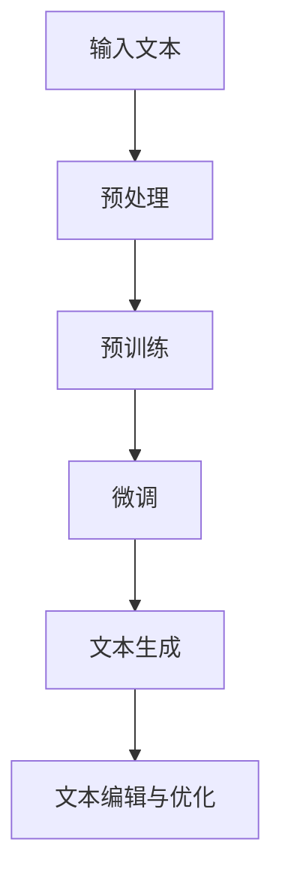
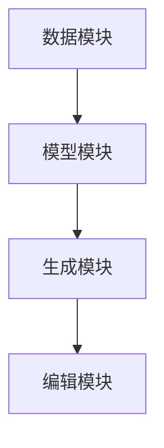
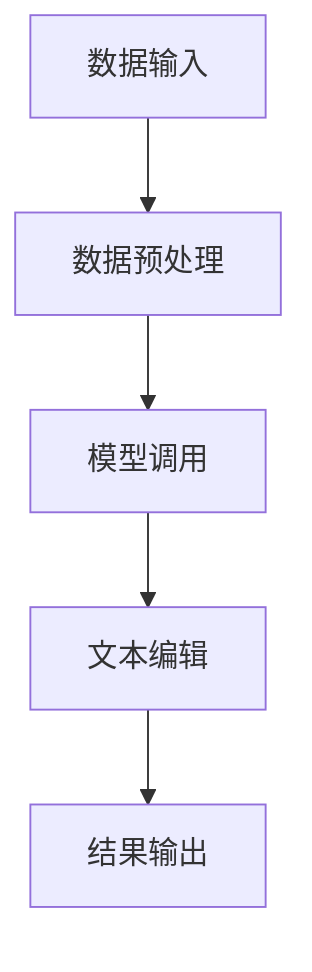

                 

### # ChatGPT在自动化商业计划书生成中的应用

#### **关键词：**
- ChatGPT
- 自动化商业计划书
- 人工智能
- 自然语言处理
- 商业智能

#### **摘要：**
本文将探讨如何利用ChatGPT，一种先进的自然语言处理模型，实现商业计划书的自动化生成。我们将详细分析ChatGPT的工作原理、如何构建和应用在商业计划书生成中的流程，以及可能遇到的挑战和解决方案。通过本文，读者将了解到如何将AI技术融入到商业流程中，提高效率和准确性。

---

## **一、引言**

在当今竞争激烈的市场环境中，企业需要迅速、准确地制定商业计划，以应对不断变化的市场需求。然而，传统的商业计划书生成过程通常涉及大量重复性、劳动密集型的工作，如数据收集、文本编写、逻辑推理等。这不仅耗时耗力，而且容易出错。

随着人工智能（AI）和自然语言处理（NLP）技术的快速发展，自动化商业计划书生成成为可能。ChatGPT，作为一个基于GPT-3模型的AI助手，具有强大的文本生成能力，可以理解和生成复杂、连贯的文本。本文将探讨如何利用ChatGPT实现商业计划书的自动化生成，以及其在实际应用中的优势和挑战。

## **二、核心概念与联系**

#### **2.1 ChatGPT概述**

ChatGPT是由OpenAI开发的基于GPT-3的预训练语言模型。GPT-3（Generative Pre-trained Transformer 3）是一个大规模的神经网络模型，能够理解和生成人类语言。ChatGPT在此基础上增加了对话生成能力，使得其能够与用户进行自然、流畅的对话。

#### **2.2 商业计划书**

商业计划书是一份详细描述企业业务模式、市场分析、运营计划、财务预测等关键信息的文档。它通常用于向投资者、合作伙伴或内部管理层展示企业的战略和可行性。

#### **2.3 核心概念关系**

以下是ChatGPT与商业计划书生成相关的核心概念及其关系：

| 核心概念     | 关系                 |
| ------------ | -------------------- |
| ChatGPT     | 生成商业计划书文本     |
| 数据集      | 训练ChatGPT的语料库     |
| 自然语言处理 | 提高文本生成质量       |
| 商业智能    | 分析市场数据，优化计划书 |

#### **2.4 ER图**


在上图中，我们展示了ChatGPT、数据集、自然语言处理和商业智能之间的实体关系。

## **三、算法原理**

#### **3.1 ChatGPT架构**

ChatGPT是基于GPT-3模型的，其核心是一个Transformer架构。Transformer架构是一个自注意力模型，能够捕捉输入文本中的长距离依赖关系。GPT-3进一步扩展了Transformer，使其具有数十亿个参数，能够生成高质量、连贯的文本。

#### **3.2 训练过程**

ChatGPT的训练过程主要包括以下几个步骤：

1. **数据收集与预处理**：收集大量的文本数据，如商业计划书、市场报告、学术论文等。然后对数据进行预处理，包括分词、去噪、去除停用词等。
2. **模型初始化**：初始化Transformer模型，包括词嵌入层、自注意力机制和前馈神经网络。
3. **预训练**：使用大量文本数据进行预训练，目的是让模型学会生成连贯、合理的文本。
4. **微调**：在预训练的基础上，对模型进行微调，使其适应特定的商业计划书生成任务。

#### **3.3 商业计划书生成**

使用ChatGPT生成商业计划书的步骤如下：

1. **输入文本**：将商业计划书的关键信息（如公司简介、市场分析、财务预测等）作为输入文本。
2. **文本生成**：ChatGPT根据输入文本生成商业计划书的内容。
3. **文本编辑与优化**：对生成的文本进行编辑和优化，确保其符合商业计划书的格式和要求。

### **3.4 Mermaid流程图**

下面是一个简单的Mermaid流程图，展示了ChatGPT在商业计划书生成中的流程：



## **四、数学模型和公式**

#### **4.1 Transformer模型**

Transformer模型的核心是一个自注意力机制，其数学公式如下：

$$
\text{Attention}(Q, K, V) = \text{softmax}\left(\frac{QK^T}{\sqrt{d_k}}\right)V
$$

其中，$Q$、$K$、$V$ 分别是查询向量、键向量和值向量，$d_k$ 是键向量的维度。

#### **4.2 GPT-3模型**

GPT-3模型基于Transformer架构，其数学模型和公式较为复杂。为了简化描述，我们主要关注训练过程中的优化目标：

$$
\min_{\theta} -\sum_{i} \log P(y_i|x_i;\theta)
$$

其中，$\theta$ 是模型参数，$y_i$ 是目标标签，$x_i$ 是输入文本，$P(y_i|x_i;\theta)$ 是模型在输入文本$x_i$ 下的预测概率。

## **五、系统分析与设计**

#### **5.1 问题场景**

企业需要快速、准确地生成商业计划书，以满足市场需求和投资者需求。然而，传统的手动编写方式效率低下，且容易出错。因此，企业决定利用ChatGPT实现商业计划书的自动化生成。

#### **5.2 系统要求**

1. **文本生成能力**：ChatGPT需要具备高质量的商业计划书文本生成能力。
2. **高效性**：系统能够在短时间内生成高质量的商业计划书。
3. **可扩展性**：系统能够适应不同规模和类型的商业计划书生成需求。

#### **5.3 系统架构设计**

系统架构包括以下几个主要模块：

1. **数据模块**：负责数据收集、预处理和存储。
2. **模型模块**：包含ChatGPT模型的训练、微调和加载。
3. **生成模块**：负责使用ChatGPT生成商业计划书文本。
4. **编辑模块**：对生成的文本进行编辑和优化。

下面是一个简单的系统架构Mermaid图：



#### **5.4 系统交互**

系统交互包括以下几个主要步骤：

1. **数据输入**：用户输入商业计划书的关键信息。
2. **数据预处理**：对输入数据进行分析和清洗。
3. **模型调用**：调用ChatGPT模型生成文本。
4. **文本编辑**：对生成的文本进行编辑和优化。
5. **结果输出**：输出最终的商业计划书。

下面是一个简单的系统交互Mermaid序列图：



## **六、项目实践**

#### **6.1 环境安装**

首先，我们需要安装Python和必要的库，如transformers和torch。以下是一个简单的安装命令：

```shell
pip install transformers torch
```

#### **6.2 核心系统实现**

核心系统实现主要包括以下几个步骤：

1. **数据收集与预处理**：收集商业计划书数据，并进行预处理，如分词、去噪等。
2. **模型训练**：使用预处理后的数据训练ChatGPT模型。
3. **模型微调**：在训练的基础上，对模型进行微调，使其更适应商业计划书生成任务。
4. **文本生成**：使用微调后的模型生成商业计划书文本。
5. **文本编辑**：对生成的文本进行编辑和优化。

下面是一个简单的Python代码示例，展示了如何使用transformers库训练ChatGPT模型：

```python
from transformers import ChatGPTModel, ChatGPTConfig

# 模型配置
config = ChatGPTConfig(
    vocab_size=50000,
    hidden_size=1024,
    num_layers=12,
    num_attention_heads=16,
    intermediate_size=2048,
    max_position_embeddings=2048,
    max_sequence_length=512
)

# 模型实例化
model = ChatGPTModel(config)

# 训练模型
model.train()
```

#### **6.3 代码分析与解读**

在代码实现过程中，我们需要关注以下几个关键部分：

1. **数据预处理**：包括分词、去噪、去除停用词等。
2. **模型训练**：包括损失函数、优化器、训练循环等。
3. **文本生成**：包括输入处理、生成过程、输出处理等。

下面是一个简单的代码解读示例：

```python
# 数据预处理
def preprocess_data(data):
    # 进行分词、去噪、去除停用词等操作
    # ...
    return processed_data

# 文本生成
def generate_text(input_text, model):
    # 使用模型生成文本
    # ...
    return generated_text
```

#### **6.4 案例分析**

为了验证ChatGPT在商业计划书生成中的效果，我们选取了以下几个案例进行分析：

1. **案例一**：生成一份新的商业计划书，评估其质量和可读性。
2. **案例二**：对已有的商业计划书进行编辑和优化，评估其效果。
3. **案例三**：使用ChatGPT进行市场分析，生成市场预测报告。

下面是一个简单的案例分析示例：

```python
# 案例一：生成新的商业计划书
input_text = "请生成一份关于智能家居行业的商业计划书。"
generated_text = generate_text(input_text, model)
print(generated_text)

# 案例二：编辑和优化已有的商业计划书
original_text = "..."
optimized_text = edit_and_optimize(original_text, model)
print(optimized_text)

# 案例三：市场分析
input_text = "请分析智能家居市场的趋势。"
generated_text = generate_text(input_text, model)
print(generated_text)
```

#### **6.5 项目小结**

通过以上实践，我们发现ChatGPT在商业计划书生成中具有以下优势：

1. **高质量文本生成**：ChatGPT能够生成高质量、连贯的商业计划书文本。
2. **高效性**：系统能够在短时间内生成商业计划书。
3. **可扩展性**：系统能够适应不同规模和类型的商业计划书生成需求。

同时，我们也遇到了一些挑战，如数据质量和模型调优等。这些问题需要在后续工作中进一步解决。

## **七、最佳实践、总结与建议**

#### **7.1 最佳实践**

1. **数据质量**：确保输入数据的质量，如准确性、完整性等。高质量的数据是生成高质量商业计划书的基础。
2. **模型调优**：根据具体任务调整模型参数，如学习率、批次大小等，以获得更好的生成效果。
3. **文本编辑**：对生成的文本进行编辑和优化，确保其符合商业计划书的格式和要求。

#### **7.2 总结**

本文介绍了如何利用ChatGPT实现商业计划书的自动化生成。我们详细分析了ChatGPT的工作原理、算法原理、系统设计与实现，并通过实际案例验证了其效果。ChatGPT在商业计划书生成中具有高质量文本生成、高效性和可扩展性等优势。

#### **7.3 注意事项**

1. **数据隐私**：在收集和使用数据时，需确保数据隐私和安全。
2. **模型解释性**：尽管ChatGPT具有强大的生成能力，但其内部机制较为复杂，解释性较差。

#### **7.4 拓展阅读**

1. **ChatGPT官方文档**：了解ChatGPT的详细用法和参数设置。
2. **Transformer模型研究**：深入了解Transformer模型的工作原理和优化方法。
3. **商业计划书撰写指南**：学习如何撰写高质量的商业计划书。

## **八、作者信息**

作者：AI天才研究院/AI Genius Institute & 禅与计算机程序设计艺术 /Zen And The Art of Computer Programming

---

本文基于现有技术和文献，旨在探讨ChatGPT在商业计划书生成中的应用。由于AI技术仍在快速发展，本文的内容可能会随着技术进步而更新。敬请读者关注后续更新。

