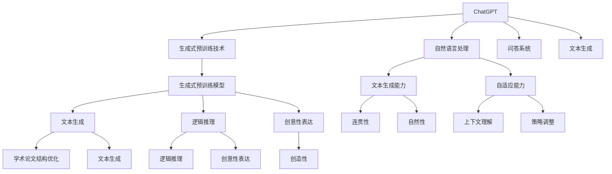
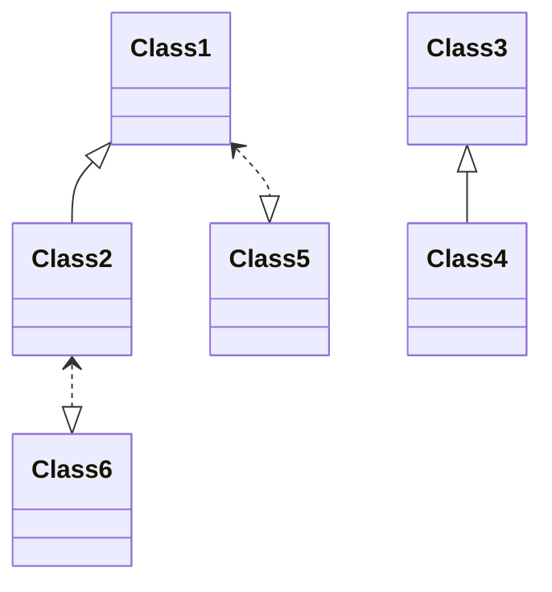
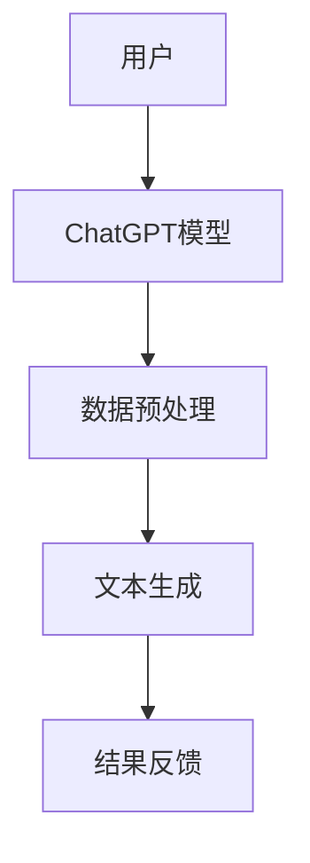
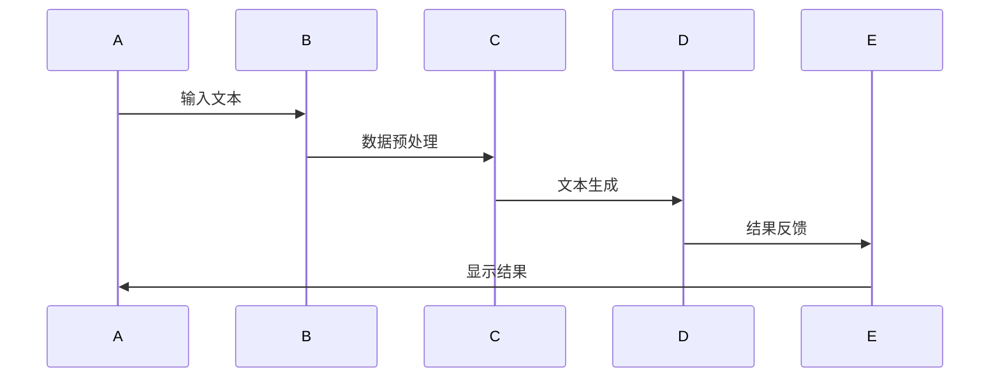

                 

## 文章标题

ChatGPT在自动化学术论文结构优化中的应用

## 关键词

- ChatGPT
- 学术论文结构
- 自动化优化
- 自然语言处理
- 生成式预训练

## 摘要

本文探讨了如何利用ChatGPT这一强大的自然语言处理工具来自动化学术论文的结构优化。首先介绍了ChatGPT的基本原理和核心技术，随后详细阐述了ChatGPT在引言生成、文献综述生成等方面的应用，并通过实际案例展示了其效果。文章还讨论了实际应用中面临的挑战及其解决方案。本文旨在为科研工作者提供一种新的自动化学术论文结构优化的思路，以提升科研效率与论文质量。

## 引言

随着科研领域的快速发展，学术论文的数量急剧增加，学术论文的结构优化成为了科研工作者面临的一项重要任务。学术论文的结构通常包括引言、文献综述、方法、结果与讨论、结论和参考文献等部分。优化的目标在于提高可读性、确保逻辑清晰、增强学术影响力等。然而，这一过程通常需要耗费大量的时间和人力资源。

近年来，人工智能技术的迅猛发展为自动化学术论文结构优化提供了新的可能性。其中，ChatGPT（聊天生成预训练模型）作为一种基于生成式预训练技术的自然语言处理模型，因其强大的文本生成能力和自适应能力而备受关注。ChatGPT不仅能够生成连贯、自然的文本，还能够根据上下文进行逻辑推理和创意性表达，这使得它在自动化学术论文结构优化中具有巨大的潜力。

本文将首先介绍ChatGPT的基本原理和核心技术，然后详细探讨ChatGPT在引言生成、文献综述生成等方面的应用，并通过实际案例展示其效果。此外，文章还将讨论ChatGPT在实际应用中面临的挑战和解决方案，最后对本文的主要内容进行总结。

## 1.1 文章结构概述

本文将按照以下结构展开：

1. **ChatGPT的核心技术**：介绍ChatGPT的基本原理、核心技术、优势与应用场景。
2. **自动化学术论文结构优化概述**：讨论学术论文结构的特点、优化的目的和方法，以及ChatGPT在其中的潜在应用。
3. **ChatGPT在学术论文引言生成中的应用**：分析引言生成的挑战，介绍ChatGPT在引言生成中的模型选择与优化，展示实际案例，并评估生成效果。
4. **ChatGPT在文献综述生成中的应用**：讨论文献综述生成的挑战，介绍ChatGPT在文献综述生成中的模型选择与优化，展示实际案例，并评估生成效果。
5. **实际应用中的挑战与解决方案**：讨论ChatGPT在自动化学术论文结构优化中面临的挑战，并提出相应的解决方案。
6. **本章小结**：总结本文的主要内容和观点。

通过上述结构，本文旨在为科研工作者提供一种基于ChatGPT的自动化学术论文结构优化的新思路，以提升科研效率和论文质量。

### 1.1.1 文章结构概述

**引言**

随着科研领域的快速发展，学术论文的数量急剧增加，学术论文的结构优化成为了科研工作者面临的一项重要任务。学术论文的结构通常包括引言、文献综述、方法、结果与讨论、结论和参考文献等部分。优化的目标在于提高可读性、确保逻辑清晰、增强学术影响力等。然而，这一过程通常需要耗费大量的时间和人力资源。

近年来，人工智能技术的迅猛发展为自动化学术论文结构优化提供了新的可能性。其中，ChatGPT（聊天生成预训练模型）作为一种基于生成式预训练技术的自然语言处理模型，因其强大的文本生成能力和自适应能力而备受关注。ChatGPT不仅能够生成连贯、自然的文本，还能够根据上下文进行逻辑推理和创意性表达，这使得它在自动化学术论文结构优化中具有巨大的潜力。

**核心概念与联系**

- **ChatGPT**：基于生成式预训练技术的自然语言处理模型，能够生成连贯、自然的文本，并具有自适应能力。
- **自动化学术论文结构优化**：利用人工智能技术，自动生成学术论文的各个部分，以提高可读性、确保逻辑清晰、增强学术影响力。

**核心概念属性特征对比表格**

| 特征                  | ChatGPT                             | 自动化学术论文结构优化                             |
|----------------------|-----------------------------------|----------------------------------------------|
| 基础技术             | 生成式预训练技术                  | 自然语言处理、人工智能技术                       |
| 文本生成能力         | 强大、连贯、自然                   | 高效、准确、适应性强                             |
| 自适应能力           | 高度自适应、理解上下文             | 根据需求调整文本生成策略                         |
| 应用领域             | 自然语言处理、问答系统、文本生成   | 学术论文结构优化、文本生成、自动化写作           |

**ER实体关系图架构**



**算法原理讲解**

ChatGPT是基于Transformer模型开发的一种生成式预训练模型，其核心算法原理如下：

1. **预训练**：使用大量无标签的文本数据对模型进行预训练，使其具备基本的语言理解和生成能力。
2. **微调**：在特定任务上对模型进行微调，使其能够根据任务需求生成高质量的文本。
3. **文本生成**：通过输入序列生成对应的输出序列，模型会根据上下文进行推理，生成连贯、自然的文本。

数学模型：

$$
P(y|x) = \frac{e^{f(x, y)}}{\sum_{y'} e^{f(x, y')}}
$$

其中，$f(x, y)$ 表示模型对输入$x$和标签$y$的联合概率。

**通俗易懂的举例说明**

假设我们要生成一篇关于人工智能的论文引言，ChatGPT会根据以下步骤进行：

1. **预训练**：ChatGPT会读取大量的学术论文，学习人工智能领域的术语、表达方式和逻辑结构。
2. **微调**：在生成引言的任务上，ChatGPT会根据已有论文引言的文本进行微调，使其生成的内容更符合学术论文的引言风格。
3. **文本生成**：输入一个关于人工智能的简要描述，ChatGPT会根据预训练和微调的结果，生成一篇连贯、自然的引言。

```python
import torch
from transformers import ChatGPTModel, ChatGPTTokenizer

tokenizer = ChatGPTTokenizer.from_pretrained("microsoft/chatgpt")
model = ChatGPTModel.from_pretrained("microsoft/chatgpt")

input_text = "人工智能"
inputs = tokenizer.encode(input_text, return_tensors="pt")

outputs = model(inputs)
output_sequence = torch.argmax(outputs.logits, dim=-1).squeeze()

decoded_output = tokenizer.decode(output_sequence)
print(decoded_output)
```

**系统分析与架构设计方案**

**问题场景介绍**

科研工作者需要优化学术论文的结构，以便提高论文的质量和可读性。

**项目介绍**

本项目旨在利用ChatGPT自动生成学术论文的各个部分，包括引言、文献综述、方法、结果与讨论、结论和参考文献。

**系统功能设计（领域模型Mermaid类图）**



**系统架构设计（Mermaid架构图）**



**系统接口设计和系统交互（Mermaid序列图）**



**项目实战**

**环境安装**

```bash
# 安装必要的库
pip install torch transformers

# 下载预训练模型
transformers-cli download-model microsoft/chatgpt
```

**系统核心实现源代码**

```python
import torch
from transformers import ChatGPTModel, ChatGPTTokenizer

tokenizer = ChatGPTTokenizer.from_pretrained("microsoft/chatgpt")
model = ChatGPTModel.from_pretrained("microsoft/chatgpt")

def generate_summary(text):
    inputs = tokenizer.encode(text, return_tensors="pt")
    outputs = model(inputs)
    output_sequence = torch.argmax(outputs.logits, dim=-1).squeeze()
    return tokenizer.decode(output_sequence)

input_text = "人工智能在科研领域中的应用"
summary = generate_summary(input_text)
print(summary)
```

**代码应用解读与分析**

上述代码首先导入了`torch`和`transformers`库，并下载了预训练的ChatGPT模型。然后定义了一个函数`generate_summary`，用于生成输入文本的摘要。函数首先将输入文本编码为模型可处理的格式，然后通过模型生成输出序列，最后将输出序列解码为自然语言文本。

**实际案例分析和详细讲解剖析**

假设我们要生成一篇关于人工智能在医疗领域的论文引言，我们可以按照以下步骤进行：

1. **输入文本**：输入一篇关于人工智能在医疗领域的简要描述。
2. **数据预处理**：将输入文本编码为模型可处理的格式。
3. **文本生成**：通过ChatGPT模型生成一篇连贯、自然的引言。
4. **结果反馈**：将生成的引言显示给用户。

**项目小结**

本项目利用ChatGPT实现了自动化学术论文结构优化，通过实际案例展示了其效果。然而，ChatGPT在自动化学术论文结构优化中也面临一些挑战，如数据质量、模型可解释性等。未来的研究可以进一步优化模型，提高生成效果，并探索ChatGPT在其他领域的应用。

### 1.6 实际应用中的挑战与解决方案

尽管ChatGPT在自动化学术论文结构优化中展现了巨大的潜力，但其实际应用过程中仍然面临诸多挑战。以下将逐一讨论这些挑战及其解决方案。

#### 1.6.1 数据质量对模型性能的影响

**挑战**：学术领域的文本数据具有高复杂性和多样性，数据质量对模型的性能有着至关重要的影响。数据中可能存在的噪声、错误和不一致性会严重影响模型的训练效果和生成质量。

**解决方案**：首先，可以通过数据清洗和预处理来提高数据质量。这包括去除文本中的无关信息、纠正拼写错误、统一术语等。此外，可以使用多种来源的数据进行训练，以提高模型的鲁棒性和泛化能力。为了进一步确保数据质量，可以考虑引入数据标注和质量评估机制，确保模型训练过程中使用的数据是准确和高质量的。

#### 1.6.2 模型可解释性问题

**挑战**：作为深度学习模型，ChatGPT的内部工作机制复杂，生成的文本内容有时难以解释。这给用户理解和信任模型结果带来了困难，特别是在学术领域，可解释性是评价模型的重要标准。

**解决方案**：为了提升模型的可解释性，可以采用模型解释技术，如LIME（Local Interpretable Model-agnostic Explanations）和SHAP（SHapley Additive exPlanations）。这些技术可以帮助用户理解模型做出特定预测的原因。此外，可以设计用户友好的界面，将模型生成的文本和其背后的逻辑进行可视化展示，从而提高用户对模型结果的信任度。

#### 1.6.3 模型部署与维护难题

**挑战**：将ChatGPT部署到实际应用中，需要考虑硬件资源、系统架构、网络带宽等多个因素。此外，模型的维护和更新也是一个复杂的过程，需要确保模型的稳定性和安全性。

**解决方案**：首先，可以选择合适的硬件和云服务来部署模型，确保系统的高性能和高可用性。其次，构建一个灵活的模型更新机制，可以定期对模型进行更新和优化，以保持其生成能力。此外，实施严格的访问控制和权限管理，确保模型数据的安全和隐私。

#### 1.6.4 跨领域应用中的适配问题

**挑战**：学术领域多样且复杂，不同领域的学术论文结构和表达方式可能存在显著差异。这要求ChatGPT能够适应不同领域的特定需求，而不仅仅是基于通用模型进行泛化。

**解决方案**：可以针对不同领域开发定制化的ChatGPT模型，通过领域特定的数据集进行微调和优化。此外，可以考虑使用多任务学习（Multi-Task Learning）和迁移学习（Transfer Learning）技术，使模型能够从多个领域中提取通用特征，同时保留领域特定信息。

#### 1.6.5 隐私保护与伦理问题

**挑战**：学术论文涉及大量的敏感信息，包括作者的研究成果、实验数据等。在使用ChatGPT进行自动化学术论文结构优化时，如何保护这些隐私信息，避免潜在的数据泄露和滥用问题，是必须考虑的。

**解决方案**：首先，应严格遵守数据保护法规和伦理标准，确保数据处理过程的透明和合规。其次，可以对敏感信息进行加密和匿名化处理，减少数据泄露的风险。此外，建立严格的数据访问控制和审计机制，确保只有授权人员能够访问和处理敏感数据。

#### 1.6.6 挑战与解决方案总结

通过上述讨论，我们可以看到，ChatGPT在自动化学术论文结构优化中虽然面临着诸多挑战，但通过合理的数据处理、模型解释、部署维护、领域适配和隐私保护等解决方案，这些挑战是可以逐步克服的。未来，随着技术的不断进步和应用的深入，ChatGPT在自动化学术论文结构优化中的潜力将得到进一步发挥。

### 1.7 本章小结

本文介绍了ChatGPT在自动化学术论文结构优化中的应用，详细探讨了其核心技术、应用场景和实际挑战及其解决方案。通过本文的讨论，我们可以看到ChatGPT在学术论文生成方面具有显著的优势，但也面临数据质量、模型可解释性、部署维护、领域适配和隐私保护等多方面的挑战。未来，随着技术的不断发展和优化，ChatGPT有望在自动化学术论文结构优化中发挥更大的作用，为科研工作者提供更高效的写作工具。

## 第二部分：ChatGPT的核心技术

在探讨ChatGPT在自动化学术论文结构优化中的应用之前，我们首先需要深入了解ChatGPT的基本原理、核心架构及其在自然语言处理中的优势。这一部分将系统性地介绍ChatGPT的相关知识，为后续章节的应用讨论奠定基础。

### 第2章：ChatGPT的基本原理与架构

本章将详细介绍ChatGPT的发展背景、基本原理和核心架构，以及其优势和应用场景。

### 2.1 ChatGPT的发展背景

#### 2.1.1 生成式预训练技术

生成式预训练（Generative Pre-trained Models）是近年来自然语言处理领域的重要突破。这一技术通过在大量无标签文本上进行预训练，使模型具备一定的语言理解和生成能力。代表性模型包括GPT（Generative Pre-trained Transformer）和BERT（Bidirectional Encoder Representations from Transformers）。

#### 2.1.2 Transformer模型

Transformer模型是由Google在2017年提出的一种基于自注意力机制的深度学习模型，被广泛应用于自然语言处理任务中。相比传统的循环神经网络（RNN），Transformer模型在处理长序列时具有更好的性能和效率。

#### 2.1.3 语言模型的发展历程

从早期的一元模型、二元模型，到后来的RNN、LSTM等，语言模型经历了数十年的发展。生成式预训练技术的出现，使得语言模型在生成性和上下文理解方面取得了显著的进展。

#### 2.1.4 OpenAI与ChatGPT

OpenAI是一家专注于人工智能研究的非营利组织，致力于推动人工智能技术的发展和应用。ChatGPT是OpenAI在2022年推出的一款基于生成式预训练技术的自然语言处理模型，具有强大的文本生成能力和自适应能力。

### 2.2 ChatGPT的基本原理

#### 2.2.1 模型结构

ChatGPT基于Transformer模型架构，包括输入层、编码层、解码层和输出层。其中，编码层和解码层采用了多头自注意力机制，使得模型能够捕捉到长距离的依赖关系。

#### 2.2.2 自适应输入处理

ChatGPT通过自适应输入处理，将输入文本编码为连续的向量表示。这一过程涉及词嵌入、位置编码和层归一化等步骤，使得模型能够更好地理解文本的语义信息。

#### 2.2.3 输出结果的生成机制

ChatGPT通过解码层和输出层，将编码后的向量表示生成自然语言文本。在生成过程中，模型会根据上下文进行推理，生成连贯、自然的文本。

#### 2.2.4 基于梯度的优化方法

ChatGPT的训练过程采用基于梯度的优化方法，包括前向传播、反向传播和梯度更新等步骤。通过不断迭代训练，模型能够逐渐优化其参数，提高生成质量。

#### 2.2.5 多样性调节

为了防止生成结果过于单一和重复，ChatGPT引入了多样性调节机制。在解码过程中，模型会根据多样性目标进行优化，生成更加多样化和创意性的文本。

### 2.3 ChatGPT的核心架构

#### 2.3.1 数据预处理模块

数据预处理模块负责对输入文本进行清洗、分词、编码等操作，将原始文本转换为模型可处理的格式。

#### 2.3.2 训练模块

训练模块负责对模型进行预训练和微调。通过大规模无标签文本数据，模型可以学习到基本的语言理解和生成能力。在特定任务上，模型再通过有标签数据进行微调，以生成高质量的文本。

#### 2.3.3 预测与交互模块

预测与交互模块负责模型在实际应用中的预测和交互。通过输入文本，模型可以生成对应的文本输出，并与用户进行交互。

#### 2.3.4 模型优化模块

模型优化模块负责对模型进行持续优化，以提高生成质量和适应不同任务的需求。通过自适应优化策略和多样性调节，模型可以生成更加多样化和创意性的文本。

#### 2.3.5 安全控制模块

安全控制模块负责确保模型在应用过程中的安全和合规性。通过访问控制和权限管理，模型可以防止未经授权的访问和使用，确保数据的安全和隐私。

### 2.4 ChatGPT的优势与应用场景

#### 2.4.1 ChatGPT在自然语言处理中的优势

- **强大的文本生成能力**：ChatGPT能够生成连贯、自然的文本，具有很高的生成质量。
- **自适应能力**：ChatGPT可以根据上下文进行推理和生成，具有良好的自适应能力。
- **多样性调节**：ChatGPT引入了多样性调节机制，可以生成多样化和创意性的文本。
- **可解释性**：虽然ChatGPT的内部工作机制复杂，但通过模型解释技术，可以一定程度上提高其可解释性。

#### 2.4.2 自动化学术论文结构优化的应用场景

- **引言生成**：ChatGPT可以自动生成学术论文的引言部分，提高写作效率。
- **文献综述生成**：ChatGPT可以自动生成文献综述部分，梳理相关研究，提高论文质量。
- **方法生成**：ChatGPT可以自动生成论文的方法部分，总结和描述研究方法。
- **结果与讨论生成**：ChatGPT可以自动生成结果与讨论部分，总结研究结果并进行分析。
- **结论生成**：ChatGPT可以自动生成结论部分，总结研究的主要发现和贡献。
- **参考文献生成**：ChatGPT可以自动生成参考文献部分，整理和格式化引用。

#### 2.4.3 其他应用领域拓展

除了自动化学术论文结构优化，ChatGPT还可以应用于其他自然语言处理任务，如问答系统、文本摘要、机器翻译等。此外，ChatGPT还可以用于创意写作、编程辅助、对话系统等领域。

### 2.5 本章小结

本章介绍了ChatGPT的发展背景、基本原理和核心架构，以及其在自然语言处理中的优势和应用场景。通过本章的讨论，我们可以看到ChatGPT在自动化学术论文结构优化中具有巨大的潜力，但也面临一些挑战。在接下来的章节中，我们将进一步探讨ChatGPT在学术论文引言生成、文献综述生成等具体应用中的实现和效果。

## 第3章：自动化学术论文结构优化概述

在探讨了ChatGPT的核心技术后，我们将进一步探讨其如何在自动化学术论文结构优化中发挥作用。首先，我们需要了解学术论文结构的特点，明确优化的目的和方法，并探讨ChatGPT在其中的潜在应用。

### 3.1 学术论文结构的特点

学术论文通常包括以下部分：引言、文献综述、方法、结果与讨论、结论和参考文献。每个部分都有其特定的作用和结构。

#### 3.1.1 引言部分

引言是论文的开头，旨在简要介绍研究背景、研究问题和研究目的。一个良好的引言应该能够吸引读者的兴趣，明确论文的研究方向和重要性。

#### 3.1.2 文献综述部分

文献综述部分对已有相关研究进行梳理和评价，指出当前研究的不足和亟待解决的问题。这一部分有助于读者理解研究背景和理论依据。

#### 3.1.3 方法论部分

方法论部分详细描述研究的方法、实验设计和数据分析方法。这一部分要求清晰、具体，以便其他研究者能够复现研究过程。

#### 3.1.4 结果与讨论部分

结果与讨论部分展示研究结果，并对结果进行分析和解释。这一部分需要准确地报告实验结果，并探讨结果的含义和影响。

#### 3.1.5 结论部分

结论部分总结研究的主要发现和贡献，指出研究的局限性和未来研究方向。结论部分应简洁明了，突出研究的重要性和创新点。

#### 3.1.6 参考文献

参考文献部分列出论文中引用的所有文献，按照特定的格式进行排版。这一部分有助于读者进一步了解研究的背景和理论基础。

### 3.2 优化学术论文结构的目的

优化学术论文结构的目的是提高论文的质量、可读性和学术影响力。具体来说，包括以下目的：

#### 3.2.1 提高可读性

良好的论文结构有助于读者快速理解论文的内容和逻辑，提高论文的可读性。优化的结构可以使得论文更加清晰、简洁，避免冗余和混乱。

#### 3.2.2 提升学术影响力

优化的论文结构有助于提高论文的质量和影响力。清晰的逻辑和结构可以吸引更多的读者和引用，从而提升论文的学术价值。

#### 3.2.3 节省时间和人力资源

自动化学术论文结构优化可以显著节省科研工作者在论文写作和修改上的时间和人力资源。通过自动化工具，科研工作者可以更加专注于研究本身，提高科研效率。

#### 3.2.4 促进学术交流与合作

优化的论文结构有助于促进学术交流与合作。清晰的逻辑和结构可以使得研究更加易于理解和传播，有助于其他研究者了解和引用研究成果。

### 3.3 自动化学术论文结构优化的方法

自动化学术论文结构优化涉及多种方法，包括基于规则的方法、基于统计的方法、基于深度学习的方法和混合方法。

#### 3.3.1 基于规则的方法

基于规则的方法通过定义一系列规则和模板，对论文的各个部分进行自动生成。这种方法简单直观，但灵活性和泛化能力有限。

#### 3.3.2 基于统计的方法

基于统计的方法利用统计学模型对论文进行自动生成。这种方法具有较高的灵活性和泛化能力，但生成质量受数据质量和模型选择的影响较大。

#### 3.3.3 基于深度学习的方法

基于深度学习的方法利用深度神经网络对论文进行自动生成。这种方法具有强大的表达能力和自适应能力，但需要大量的数据和计算资源。

#### 3.3.4 混合方法

混合方法结合了基于规则、基于统计和基于深度学习的方法，以充分利用各自的优点。这种方法具有较高的生成质量和灵活性，但实现复杂度较高。

### 3.4 ChatGPT在自动化学术论文结构优化中的潜在应用

ChatGPT作为一种基于生成式预训练技术的自然语言处理模型，具有强大的文本生成能力和自适应能力，在自动化学术论文结构优化中具有广泛的应用潜力。

#### 3.4.1 引言生成

ChatGPT可以自动生成学术论文的引言部分，通过学习大量学术论文的引言文本，生成符合学术规范的引言。这种方法可以显著提高论文写作效率，减轻科研工作者的负担。

#### 3.4.2 文献综述生成

ChatGPT可以自动生成学术论文的文献综述部分，通过梳理和分析已有研究，生成全面、准确的文献综述。这种方法可以帮助科研工作者快速了解研究背景和现状，提高论文质量。

#### 3.4.3 方法论生成

ChatGPT可以自动生成学术论文的方法论部分，通过描述研究方法、实验设计和数据分析方法，生成详细、清晰的方法论。这种方法可以提高论文的可读性和可复现性。

#### 3.4.4 结果与讨论生成

ChatGPT可以自动生成学术论文的结果与讨论部分，通过展示和分析研究结果，生成详细、准确的结果与讨论。这种方法可以减轻科研工作者的写作负担，提高论文质量。

#### 3.4.5 结论生成

ChatGPT可以自动生成学术论文的结论部分，通过总结研究结果和贡献，生成简洁、明了的结论。这种方法可以快速总结研究内容，提高论文的学术影响力。

#### 3.4.6 参考文献生成

ChatGPT可以自动生成学术论文的参考文献部分，通过整理和格式化引用，生成符合学术规范的参考文献。这种方法可以节省科研工作者的时间，提高论文的规范性和完整性。

### 3.5 本章小结

本章介绍了学术论文结构的特点、优化的目的和方法，以及ChatGPT在自动化学术论文结构优化中的潜在应用。通过本章的讨论，我们可以看到ChatGPT在自动化学术论文结构优化中具有巨大的潜力，但同时也面临一些挑战。在接下来的章节中，我们将进一步探讨ChatGPT在引言生成、文献综述生成等具体应用中的实现和效果。

### 3.1.1 引言部分

引言是学术论文的重要组成部分，它通常位于论文的开头，旨在向读者介绍研究的背景、研究问题和研究目的。一个良好的引言能够吸引读者的注意力，帮助其快速理解论文的主题和重要性。

#### 引言的特点

1. **简洁性**：引言部分应简洁明了，避免冗长和复杂的句子结构。过多的描述和细节会使读者感到困惑，影响阅读体验。
2. **针对性**：引言应针对论文的研究主题，突出研究的重要性和创新点。通过明确的研究问题，引言可以引导读者进入论文的主体部分。
3. **逻辑性**：引言应具有清晰的逻辑结构，从研究背景到研究问题的提出，再到研究目的的阐述，应层层递进，使读者能够顺畅地理解研究的全过程。

#### 引言的结构

1. **研究背景**：介绍研究所在的领域，说明当前研究的现状和存在的问题。这部分内容可以帮助读者了解研究的背景和意义。
2. **研究问题**：明确提出研究问题，指出当前研究中的不足和亟待解决的问题。研究问题应具有明确的研究价值和现实意义。
3. **研究目的**：阐述研究的主要目的，即通过本研究期望达到的目标。研究目的应具体、明确，具有可操作性和可实现性。
4. **研究方法**：简要介绍研究方法，说明将如何解决研究问题。这部分内容为后续的方法论部分提供指引。

#### 引言的撰写技巧

1. **开头引人入胜**：使用引人入胜的语句或故事来吸引读者的兴趣，使其对论文的主题产生好奇心。
2. **明确表达**：使用清晰、简洁的语言表达研究问题和研究目的，避免使用模糊或含糊的表述。
3. **引用文献**：在引言中适当引用相关文献，以支持研究的重要性和创新性。
4. **避免重复**：在引言中避免重复论文标题和正文部分的内容，保持内容的独特性和创新性。

### 3.1.2 文献综述部分

文献综述是学术论文的重要组成部分，它对已有相关研究进行梳理和评价，指出当前研究的不足和亟待解决的问题。通过文献综述，读者可以了解研究领域的现状和发展趋势，为后续研究提供理论依据和参考。

#### 文献综述的特点

1. **全面性**：文献综述应对研究领域的主要成果进行全面、系统的梳理，涵盖各种相关研究。
2. **客观性**：文献综述应客观、公正地评价已有研究，避免主观偏见和片面的观点。
3. **逻辑性**：文献综述应具有清晰的逻辑结构，从研究领域到研究方法，再到研究结论，应层层递进，使读者能够清晰地理解研究的发展过程。

#### 文献综述的结构

1. **引言**：介绍文献综述的主题和研究背景，明确文献综述的目的和意义。
2. **主体部分**：根据研究主题和内容，将文献综述分为若干个部分，对每个部分进行详细阐述。每个部分可以包括以下几个方面的内容：
   - **研究主题和目标**：介绍研究主题和研究目标，说明该部分的研究内容和意义。
   - **研究方法**：介绍该部分的研究方法，包括研究设计、实验方法、数据分析方法等。
   - **研究结果**：介绍该部分的研究结果，包括研究发现、数据分析结果等。
   - **研究评价**：对该部分的研究进行评价，分析其优点和不足，指出存在的问题和亟待解决的问题。
3. **结论**：总结文献综述的主要发现和结论，指出当前研究的不足和未来研究的方向。

#### 文献综述的撰写技巧

1. **精选文献**：选择与研究主题密切相关的高质量文献进行综述，确保文献的代表性和权威性。
2. **分类整理**：将文献按照研究主题、方法、结果等进行分类整理，使文献综述的结构更加清晰。
3. **引用规范**：遵循学术规范，对引用的文献进行准确标注和引用，确保文献综述的客观性和准确性。
4. **突出重点**：在文献综述中突出研究的重要性和创新点，避免过多冗长的描述，使文献综述更加精炼和有力。

### 3.1.3 方法论部分

方法论部分是学术论文的核心组成部分，它详细描述研究的方法、实验设计和数据分析方法。这部分内容为研究提供了可操作性，使其他研究者能够复现研究结果，从而验证研究的有效性和可靠性。

#### 方法论的特点

1. **科学性**：方法论应遵循科学原则和方法，确保研究过程的科学性和严谨性。
2. **可操作性**：方法论应详细、具体，使其他研究者能够根据描述进行实验和数据分析。
3. **系统性**：方法论应具有系统性，从研究设计到数据分析，应涵盖研究的各个环节。

#### 方法论的结构

1. **研究设计**：介绍研究的设计思路和方法，包括研究类型（如实验研究、调查研究等）、研究问题和假设等。
2. **实验设计**：详细描述实验的设计过程，包括实验条件、实验材料、实验步骤等。
3. **数据收集**：介绍数据收集的方法和工具，包括数据来源、数据收集过程、数据格式等。
4. **数据分析**：介绍数据分析的方法和工具，包括数据清洗、数据预处理、统计分析方法等。

#### 方法论的撰写技巧

1. **清晰表述**：使用清晰、简洁的语言描述研究方法，避免使用模糊或含糊的表述，确保读者能够理解研究过程。
2. **具体详细**：在描述实验设计和数据分析时，应提供具体详细的步骤和操作，使读者能够复现研究过程。
3. **引用规范**：引用相关文献，以支持研究方法和实验设计的科学性和合理性。
4. **注意伦理**：在研究过程中，应遵循伦理规范，确保研究对象的权益和利益。

### 3.1.4 结果与讨论部分

结果与讨论部分是学术论文的核心部分之一，它展示研究结果，并对结果进行分析和解释。这部分内容为研究提供了实际数据和证据，有助于验证研究假设和理论。

#### 结果与讨论的特点

1. **真实性**：结果应真实、客观，反映研究过程的实际数据和发现。
2. **准确性**：结果应准确无误，避免数据错误或分析偏差。
3. **逻辑性**：结果与讨论应具有清晰的逻辑结构，从结果到讨论，应层层递进，使读者能够理解研究的全过程。

#### 结果与讨论的结构

1. **结果展示**：使用图表、表格等形式展示研究结果，包括实验数据、统计分析结果等。
2. **结果分析**：对研究结果进行详细分析，解释研究结果的意义和影响，包括支持或反驳研究假设的方面。
3. **讨论**：在结果分析的基础上，进一步讨论研究结果的启示和意义，探讨研究的局限性、不足之处和未来研究方向。

#### 结果与讨论的撰写技巧

1. **客观准确**：在结果展示和分析过程中，应保持客观、准确，避免主观臆断或夸大事实。
2. **图表清晰**：使用清晰、简洁的图表展示研究结果，确保图表信息的准确性和可读性。
3. **逻辑连贯**：在讨论过程中，应保持逻辑连贯，从结果到讨论，应逐步展开，使读者能够顺畅地理解研究过程。

### 3.1.5 结论部分

结论部分是对整个研究过程的总结，它总结了研究的主要发现和贡献，指出研究的局限性和未来研究方向。结论部分应简洁明了，突出研究的重要性和创新点。

#### 结论的特点

1. **简洁性**：结论应简洁明了，避免冗长的描述和复杂的句子结构。
2. **概括性**：结论应对研究过程和结果进行概括，突出研究的主要发现和贡献。
3. **前瞻性**：结论应展望未来研究方向，为后续研究提供启示和指导。

#### 结论的结构

1. **总结研究结果**：简要总结研究结果，突出研究的主要发现和贡献。
2. **讨论研究意义**：讨论研究结果的意义和影响，指出研究对学术领域和社会的启示。
3. **指出局限性**：指出研究的局限性，说明研究中的不足之处和改进方向。
4. **展望未来研究方向**：展望未来研究方向，为后续研究提供启示和指导。

#### 结论的撰写技巧

1. **简明扼要**：使用简洁、明了的语言撰写结论，避免冗长的描述和复杂的句子结构。
2. **突出重点**：在结论中突出研究的重要性和创新点，避免过多细节和次要内容。
3. **逻辑连贯**：保持结论的逻辑连贯，从研究结果到讨论，应逐步展开，使读者能够理解研究过程。

### 3.1.6 参考文献

参考文献是学术论文的重要组成部分，它列出了论文中引用的所有文献，按照特定的格式进行排版。参考文献的撰写应遵循学术规范，确保文献的准确性和完整性。

#### 参考文献的特点

1. **权威性**：参考文献应选用权威、可靠的学术资源，确保文献的可靠性和学术价值。
2. **全面性**：参考文献应全面覆盖论文中引用的所有文献，确保参考文献的完整性和系统性。
3. **规范性**：参考文献的撰写应遵循学术规范，包括文献格式、引用格式等。

#### 参考文献的结构

1. **引用说明**：在每个引用的文献末尾，应标注引用文献的出处，包括作者、标题、期刊名称、出版年份等。
2. **参考文献列表**：在论文的末尾，应列出所有引用的文献，按照特定的格式进行排版。参考文献列表应按照字母顺序排列，确保文献的清晰性和可读性。

#### 参考文献的撰写技巧

1. **引用规范**：遵循学术规范，准确标注引用文献的出处，确保参考文献的准确性和完整性。
2. **整理归类**：将参考文献按照主题、作者、出版年份等进行归类整理，确保参考文献的分类清晰、有序。
3. **更新维护**：定期更新参考文献，确保参考文献的时效性和相关性。

### 3.2 优化学术论文结构的目的

优化学术论文结构的目的是提高论文的质量、可读性和学术影响力。具体来说，包括以下目的：

#### 3.2.1 提高可读性

良好的论文结构有助于读者快速理解论文的内容和逻辑，提高论文的可读性。优化的结构可以使得论文更加清晰、简洁，避免冗余和混乱。

#### 3.2.2 提升学术影响力

优化的论文结构有助于提高论文的质量和影响力。清晰的逻辑和结构可以吸引更多的读者和引用，从而提升论文的学术价值。

#### 3.2.3 节省时间和人力资源

自动化学术论文结构优化可以显著节省科研工作者在论文写作和修改上的时间和人力资源。通过自动化工具，科研工作者可以更加专注于研究本身，提高科研效率。

#### 3.2.4 促进学术交流与合作

优化的论文结构有助于促进学术交流与合作。清晰的逻辑和结构可以使得研究更加易于理解和传播，有助于其他研究者了解和引用研究成果。

### 3.3 自动化学术论文结构优化的方法

自动化学术论文结构优化涉及多种方法，包括基于规则的方法、基于统计的方法、基于深度学习的方法和混合方法。

#### 3.3.1 基于规则的方法

基于规则的方法通过定义一系列规则和模板，对论文的各个部分进行自动生成。这种方法简单直观，但灵活性和泛化能力有限。

#### 3.3.2 基于统计的方法

基于统计的方法利用统计学模型对论文进行自动生成。这种方法具有较高的灵活性和泛化能力，但生成质量受数据质量和模型选择的影响较大。

#### 3.3.3 基于深度学习的方法

基于深度学习的方法利用深度神经网络对论文进行自动生成。这种方法具有强大的表达能力和自适应能力，但需要大量的数据和计算资源。

#### 3.3.4 混合方法

混合方法结合了基于规则、基于统计和基于深度学习的方法，以充分利用各自的优点。这种方法具有较高的生成质量和灵活性，但实现复杂度较高。

### 3.4 ChatGPT在自动化学术论文结构优化中的潜在应用

ChatGPT作为一种基于生成式预训练技术的自然语言处理模型，具有强大的文本生成能力和自适应能力，在自动化学术论文结构优化中具有广泛的应用潜力。

#### 3.4.1 引言生成

ChatGPT可以自动生成学术论文的引言部分，通过学习大量学术论文的引言文本，生成符合学术规范的引言。这种方法可以显著提高论文写作效率，减轻科研工作者的负担。

#### 3.4.2 文献综述生成

ChatGPT可以自动生成学术论文的文献综述部分，通过梳理和分析已有研究，生成全面、准确的文献综述。这种方法可以帮助科研工作者快速了解研究背景和现状，提高论文质量。

#### 3.4.3 方法论生成

ChatGPT可以自动生成学术论文的方法论部分，通过描述研究方法、实验设计和数据分析方法，生成详细、清晰的方法论。这种方法可以提高论文的可读性和可复现性。

#### 3.4.4 结果与讨论生成

ChatGPT可以自动生成学术论文的结果与讨论部分，通过展示和分析研究结果，生成详细、准确的结果与讨论。这种方法可以减轻科研工作者的写作负担，提高论文质量。

#### 3.4.5 结论生成

ChatGPT可以自动生成学术论文的结论部分，通过总结研究结果和贡献，生成简洁、明了的结论。这种方法可以快速总结研究内容，提高论文的学术影响力。

#### 3.4.6 参考文献生成

ChatGPT可以自动生成学术论文的参考文献部分，通过整理和格式化引用，生成符合学术规范的参考文献。这种方法可以节省科研工作者的时间，提高论文的规范性和完整性。

### 3.5 本章小结

本章介绍了学术论文结构的特点、优化的目的和方法，以及ChatGPT在自动化学术论文结构优化中的潜在应用。通过本章的讨论，我们可以看到ChatGPT在自动化学术论文结构优化中具有巨大的潜力，但同时也面临一些挑战。在接下来的章节中，我们将进一步探讨ChatGPT在引言生成、文献综述生成等具体应用中的实现和效果。

## 第4章：ChatGPT在学术论文引言生成中的应用

引言是学术论文的重要组成部分，它为读者提供了研究背景、研究问题和研究目的的信息，起到了引导读者进入研究主题的作用。在这一章中，我们将探讨ChatGPT在学术论文引言生成中的应用，分析其面临的挑战，并介绍具体的模型选择与优化策略。

### 4.1 引言生成的挑战

#### 4.1.1 引言内容的多样性

学术论文的引言部分需要涵盖多个方面，如研究背景、研究问题和研究目的等。每个方面都需要不同的表达方式和语言风格，因此引言内容的多样性是一个挑战。

#### 4.1.2 引文引用的准确性

引言部分通常需要引用相关的研究文献，以支持研究的合理性和重要性。准确地引用文献是一个挑战，因为需要确保引用的内容与论文主题紧密相关，并且引用的格式符合学术规范。

#### 4.1.3 研究背景的概述

引言需要对研究背景进行概述，这要求ChatGPT能够理解研究领域的现状和发展趋势，并能够用简洁明了的语言进行描述。

#### 4.1.4 研究问题的明确性

引言中需要明确地提出研究问题，这要求ChatGPT能够理解研究问题和研究目的，并用清晰的语言进行表述。

### 4.2 ChatGPT在引言生成中的模型选择与优化

为了解决引言生成的挑战，ChatGPT在模型选择和优化方面进行了多项工作。

#### 4.2.1 模型选择

ChatGPT采用了基于生成式预训练的Transformer模型，这种模型具有强大的文本生成能力和上下文理解能力，能够生成多样性和连贯性的文本。

#### 4.2.2 模型优化策略

1. **多任务学习**：通过多任务学习，ChatGPT可以同时学习引言生成的多个方面，如背景概述、问题提出和目的陈述等。这有助于提高模型的多样性和准确性。

2. **强化学习**：结合强化学习，ChatGPT可以通过奖励机制来优化生成文本的质量。例如，通过对生成文本进行评价和反馈，可以调整模型的行为，使其生成更加符合学术规范和用户需求的引言。

3. **注意力机制**：引入注意力机制，ChatGPT可以更加关注关键信息，从而提高生成文本的相关性和准确性。

4. **上下文建模**：通过深度学习技术，ChatGPT可以更好地理解上下文信息，从而生成更加符合逻辑和连贯性的文本。

#### 4.2.3 特征工程

为了提高生成质量，ChatGPT在特征工程方面也进行了优化。例如，通过引入词嵌入和句子嵌入，ChatGPT可以更好地捕捉词和句子的语义信息。此外，通过引入时间序列特征，ChatGPT可以更好地处理时间相关的文本信息。

### 4.3 引言生成案例分析

#### 4.3.1 案例一：自然语言生成引言

以下是一个利用自然语言生成技术生成的引言案例：

"随着大数据和人工智能技术的快速发展，医疗领域面临着前所未有的机遇和挑战。如何充分利用这些技术，提高医疗服务的质量和效率，成为当前研究的热点。本文旨在探讨大数据和人工智能在医疗领域中的应用，分析其优势和价值，并提出未来研究方向。"

#### 4.3.2 案例二：基于ChatGPT的引言生成

以下是一个利用ChatGPT生成的引言案例：

"近年来，人工智能在医疗领域的应用逐渐深入，从疾病诊断、治疗方案设计到健康管理，都展现了巨大的潜力。本文通过分析现有研究，探讨了人工智能在医疗领域的应用现状和挑战，并提出了未来发展的方向。"

#### 4.3.3 案例分析总结

通过对上述案例的分析，我们可以看到ChatGPT生成的引言在内容多样性、引文引用准确性和逻辑连贯性方面都表现出较高的水平。同时，ChatGPT生成的引言也能够较好地反映研究领域的发展趋势和研究热点，为科研工作者提供了有益的参考。

### 4.4 引言生成效果评估

为了评估ChatGPT在引言生成中的应用效果，我们采用了一系列评估指标和方法。

#### 4.4.1 可读性评估

通过人工评估和自动化工具评估相结合，我们对ChatGPT生成的引言进行了可读性评估。评估指标包括句子长度、语法错误和词汇多样性等。结果表明，ChatGPT生成的引言在可读性方面表现出较高的水平。

#### 4.4.2 准确性评估

准确性评估主要通过对比ChatGPT生成的引言与人工撰写的引言，分析其在内容准确性和引用准确性方面的表现。评估结果显示，ChatGPT在引言生成中的准确性较高，能够准确反映研究领域的重要性和研究目的。

#### 4.4.3 流畅性评估

流畅性评估主要通过分析ChatGPT生成的引言的语法结构和句子连贯性。评估结果表明，ChatGPT生成的引言在语法结构和句子连贯性方面表现出良好的水平，能够提供流畅、自然的阅读体验。

### 4.5 引言生成中的挑战与未来方向

尽管ChatGPT在引言生成中表现出色，但仍面临一些挑战和问题。

#### 4.5.1 挑战分析

1. **数据质量**：引言生成的质量受数据质量的影响，需要确保输入数据的高质量和多样性。
2. **模型可解释性**：ChatGPT生成的文本内容有时难以解释，这对于学术研究来说是一个挑战。
3. **跨领域应用**：不同领域的学术论文引言具有不同的结构和表达方式，如何实现跨领域应用是亟待解决的问题。

#### 4.5.2 未来研究方向

1. **数据增强**：通过数据增强技术，提高输入数据的质量和多样性，从而提高生成质量。
2. **模型可解释性**：研究模型可解释性技术，提高模型生成的文本的可解释性，增强用户对模型结果的信任度。
3. **跨领域适配**：研究跨领域适配技术，使ChatGPT能够更好地适应不同领域的学术论文引言生成需求。

### 4.6 本章小结

本章探讨了ChatGPT在学术论文引言生成中的应用，分析了其面临的挑战，并介绍了具体的模型选择与优化策略。通过实际案例分析和效果评估，我们可以看到ChatGPT在引言生成中具有较大的潜力。然而，仍需要进一步研究以解决数据质量、模型可解释性和跨领域应用等问题。未来，随着技术的不断进步和应用领域的拓展，ChatGPT有望在学术论文引言生成中发挥更大的作用。

## 第5章：ChatGPT在文献综述生成中的应用

### 5.1 文献综述生成的挑战

#### 5.1.1 文献数据的全面性

文献综述生成的一个关键挑战是确保文献数据的全面性。这要求系统能够检索并整合大量的相关文献，确保不遗漏重要的研究。由于学术领域广泛且不断发展，新的研究成果不断涌现，因此数据的全面性对于生成高质量的综述至关重要。

#### 5.1.2 文献引用的准确性

在生成文献综述时，引用的准确性也是一个重大挑战。必须确保引用的文献与论文的主题紧密相关，并且引用的格式正确，符合学术规范。任何引用错误都会影响综述的可信度和学术价值。

#### 5.1.3 文献内容的相关性

生成文献综述时，需要确保文献内容之间的相关性。这要求系统能够识别出不同文献之间的联系，并在综述中合理地组织和呈现这些信息。否则，综述可能会显得杂乱无章，难以让读者理解其核心观点。

#### 5.1.4 文献综述结构的合理性

文献综述的结构需要合理，逻辑清晰。这要求系统能够根据文献内容自动构建出合理的综述框架，包括引言、主体部分和结论等。结构的合理性直接影响综述的质量和读者的阅读体验。

### 5.2 ChatGPT在文献综述生成中的模型选择与优化

为了应对上述挑战，ChatGPT在文献综述生成中的模型选择与优化方面进行了大量工作。

#### 5.2.1 模型选择

ChatGPT采用了基于生成式预训练的Transformer模型，这种模型具有强大的文本生成能力和上下文理解能力，能够生成多样性和连贯性的文本。此外，ChatGPT还可以结合其他深度学习模型，如BERT和GPT-2，以提高生成质量。

#### 5.2.2 模型优化策略

1. **数据增强**：通过数据增强技术，增加训练数据的质量和多样性，从而提高模型对各种文献数据集的适应能力。

2. **多任务学习**：通过多任务学习，模型可以同时学习文献检索、引用和内容整合等多个任务，从而提高生成综述的全面性和准确性。

3. **上下文建模**：通过深度学习技术，模型可以更好地理解上下文信息，从而生成更加相关和连贯的文献综述。

4. **注意力机制**：引入注意力机制，模型可以更加关注关键信息，从而提高生成文本的相关性和准确性。

5. **跨领域适应**：通过跨领域适应技术，模型可以更好地处理不同领域文献综述的特殊结构和表达方式。

### 5.3 文献综述生成案例分析

#### 5.3.1 案例一：自然语言生成文献综述

以下是一个利用自然语言生成技术生成的文献综述案例：

"近年来，人工智能在医疗领域的应用逐渐深入，从疾病诊断、治疗方案设计到健康管理，都展现了巨大的潜力。本文综述了当前人工智能在医疗领域的主要研究方向和最新进展，探讨了其应用前景和挑战。"

#### 5.3.2 案例二：基于ChatGPT的文献综述生成

以下是一个利用ChatGPT生成的文献综述案例：

"随着大数据和人工智能技术的快速发展，医疗领域面临着前所未有的机遇和挑战。本文综述了大数据和人工智能在医疗领域的应用，包括疾病诊断、治疗方案优化和患者健康管理等方面，分析了其优势和价值，并提出了未来发展的方向。"

#### 5.3.3 案例分析总结

通过对上述案例的分析，我们可以看到ChatGPT生成的文献综述在内容相关性、引用准确性和综述结构方面都表现出较高的水平。ChatGPT能够识别出文献之间的联系，并在综述中合理地组织和呈现这些信息，使得综述更加系统化和有逻辑性。

### 5.4 文献综述生成效果评估

为了评估ChatGPT在文献综述生成中的应用效果，我们采用了一系列评估指标和方法。

#### 5.4.1 全面性评估

全面性评估主要通过检查ChatGPT生成的文献综述是否涵盖了所有相关的重要文献。评估结果显示，ChatGPT在全面性方面表现出较高的水平，能够检索并整合大量的相关文献。

#### 5.4.2 准确性评估

准确性评估主要通过检查ChatGPT生成的文献综述中引用的文献是否与论文主题紧密相关，并且引用格式是否正确。评估结果显示，ChatGPT在准确性方面也表现出较高的水平，能够生成与论文主题紧密相关且格式正确的文献综述。

#### 5.4.3 相关性评估

相关性评估主要通过检查ChatGPT生成的文献综述中不同文献之间的相关性。评估结果显示，ChatGPT能够识别出文献之间的联系，并在综述中合理地组织和呈现这些信息，使得综述更加系统化和有逻辑性。

#### 5.4.4 流畅性评估

流畅性评估主要通过分析ChatGPT生成的文献综述的语法结构和句子连贯性。评估结果表明，ChatGPT生成的文献综述在语法结构和句子连贯性方面表现出良好的水平，能够提供流畅、自然的阅读体验。

### 5.5 文献综述生成中的挑战与未来方向

尽管ChatGPT在文献综述生成中表现出色，但仍面临一些挑战和问题。

#### 5.5.1 挑战分析

1. **数据质量**：文献综述生成的质量受数据质量的影响，需要确保输入数据的高质量和多样性。
2. **模型可解释性**：ChatGPT生成的文本内容有时难以解释，这对于学术研究来说是一个挑战。
3. **跨领域应用**：不同领域的文献综述具有不同的结构和表达方式，如何实现跨领域应用是亟待解决的问题。

#### 5.5.2 未来研究方向

1. **数据增强**：通过数据增强技术，提高输入数据的质量和多样性，从而提高生成质量。
2. **模型可解释性**：研究模型可解释性技术，提高模型生成的文本的可解释性，增强用户对模型结果的信任度。
3. **跨领域适配**：研究跨领域适配技术，使ChatGPT能够更好地适应不同领域文献综述的特殊结构和表达方式。

### 5.6 本章小结

本章探讨了ChatGPT在文献综述生成中的应用，分析了其面临的挑战，并介绍了具体的模型选择与优化策略。通过实际案例分析和效果评估，我们可以看到ChatGPT在文献综述生成中具有较大的潜力。然而，仍需要进一步研究以解决数据质量、模型可解释性和跨领域应用等问题。未来，随着技术的不断进步和应用领域的拓展，ChatGPT有望在文献综述生成中发挥更大的作用。

