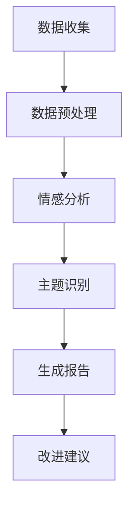

                 


## 第1章: 引言

### 1.1 问题背景

#### 1.1.1 传统的客户反馈分析方法及其局限性

在传统的客户反馈分析中，企业通常依赖于人工处理客户反馈，这种方式存在以下几个主要局限性：

1. **处理速度慢**：人工阅读和分析客户反馈需要大量时间，特别是在处理大量反馈时，效率极低。
2. **主观性较强**：人工分析容易受到个人经验和情感的影响，导致分析结果的主观性较高，可能影响决策的准确性。
3. **重复性工作**：人工处理重复性的反馈工作不仅繁琐，而且容易出错，影响客户满意度和企业的品牌形象。
4. **数据存储困难**：大量的客户反馈数据难以有效存储和管理，导致信息流失和难以追溯。

#### 1.1.2 自动化客户反馈分析的需求

随着大数据和人工智能技术的快速发展，企业对于自动化客户反馈分析的需求日益增加。自动化客户反馈分析能够解决传统方法存在的局限性，具有以下几个方面的优势：

1. **提高处理速度**：通过算法自动分析客户反馈，能够在短时间内处理大量数据，显著提高工作效率。
2. **降低成本**：自动化分析可以减少人工处理的需求，从而降低人力成本。
3. **减少主观性**：机器分析能够客观地处理数据，减少人为因素导致的偏差，提高分析结果的准确性。
4. **有效存储与管理**：自动化分析系统可以将客户反馈数据进行有效存储和管理，便于后续的数据挖掘和分析。

#### 1.1.3 ChatGPT 在自动化客户反馈分析中的应用潜力

ChatGPT 是一种基于深度学习的自然语言处理模型，具有强大的语言理解和生成能力。将 ChatGPT 应用于自动化客户反馈分析，可以带来以下潜在优势：

1. **高效的语义理解**：ChatGPT 能够对客户反馈进行深度语义分析，识别出反馈中的关键信息，提供更精准的分析结果。
2. **灵活的反馈处理**：ChatGPT 可以根据不同的反馈类型和内容，自动生成相应的分析报告，实现个性化的反馈处理。
3. **自动化的反馈分类**：ChatGPT 能够对客户反馈进行自动分类，帮助企业快速识别和处理不同类型的反馈，提高响应速度。
4. **智能化的建议生成**：ChatGPT 可以根据分析结果，为企业提供智能化的建议和改进措施，帮助提升客户体验。

### 1.2 问题描述

#### 1.2.1 客户反馈分析的重要性

客户反馈是企业了解市场需求、优化产品和服务的重要途径。有效的客户反馈分析可以帮助企业：

1. **发现问题**：识别产品或服务的不足之处，及时进行改进。
2. **提升客户满意度**：通过及时响应客户反馈，提升客户满意度和忠诚度。
3. **增加收入**：通过改进产品和服务，吸引更多客户，增加销售收入。
4. **增强市场竞争力**：通过不断优化产品和服务，提高市场竞争力，实现可持续发展。

#### 1.2.2 ChatGPT 的基本原理

ChatGPT 是基于 GPT（Generative Pre-trained Transformer）模型开发的，其基本原理如下：

1. **预训练**：ChatGPT 使用大量互联网文本进行预训练，学习语言的统计规律和语义关系。
2. **上下文理解**：ChatGPT 通过上下文信息，理解输入文本的语义和意图，生成相应的回复。
3. **生成式**：ChatGPT 是一个生成模型，能够根据输入的文本生成连贯、自然的语言输出。

#### 1.2.3 自动化客户反馈分析的目标和挑战

自动化客户反馈分析的目标是：

1. **快速处理大量反馈**：通过算法自动化分析客户反馈，提高处理速度和效率。
2. **准确识别关键信息**：从大量客户反馈中提取关键信息，为企业提供有价值的数据。
3. **生成智能分析报告**：根据分析结果，自动生成分析报告，提供改进建议。

然而，实现自动化客户反馈分析也面临以下挑战：

1. **数据质量**：客户反馈数据的多样性、准确性和一致性会影响分析结果的准确性。
2. **语义理解**：自然语言处理技术尚未完全成熟，难以完全理解复杂的语言表达和隐含的含义。
3. **算法复杂性**：自动化客户反馈分析涉及到多种算法和模型，实现和优化较为复杂。

### 1.3 问题解决

#### 1.3.1 ChatGPT 技术的概述

ChatGPT 的技术特点包括：

1. **强大的语言生成能力**：ChatGPT 能够生成自然、流畅的语言，适用于自动化客户反馈分析。
2. **上下文理解能力**：ChatGPT 可以理解上下文信息，提供个性化的反馈处理。
3. **可扩展性**：ChatGPT 可以根据不同的应用场景进行定制和优化，适用于多种业务需求。

#### 1.3.2 自动化客户反馈分析的基本流程

自动化客户反馈分析的基本流程如下：

1. **数据收集**：收集来自各种渠道的客户反馈数据。
2. **数据预处理**：对反馈数据进行分析，去除无关信息，提取关键信息。
3. **文本分析**：使用 ChatGPT 对预处理后的文本进行语义分析，提取关键信息。
4. **生成报告**：根据分析结果，自动生成分析报告，提供改进建议。

#### 1.3.3 ChatGPT 在自动化客户反馈分析中的应用案例

在实际应用中，ChatGPT 在自动化客户反馈分析中已有多个成功案例：

1. **电商领域**：电商企业使用 ChatGPT 分析客户评论，识别产品问题，提高客户满意度。
2. **金融服务**：金融服务企业使用 ChatGPT 分析客户反馈，优化服务流程，提升用户体验。
3. **酒店行业**：酒店行业使用 ChatGPT 分析客户评价，提升酒店服务质量和客户满意度。

### 1.4 边界与外延

#### 1.4.1 ChatGPT 的适用范围

ChatGPT 主要适用于需要自然语言处理和自动分析的领域，如电商、金融、酒店等行业。

#### 1.4.2 自动化客户反馈分析的限制因素

自动化客户反馈分析面临的主要限制因素包括：

1. **数据质量**：反馈数据的质量直接影响分析结果的准确性。
2. **算法成熟度**：自然语言处理技术尚未完全成熟，可能会影响分析的准确性和效果。
3. **应用场景多样性**：不同行业和场景的需求差异较大，需要针对具体场景进行定制化处理。

#### 1.4.3 ChatGPT 与其他技术的对比

与其他自然语言处理技术相比，ChatGPT 具有更强的语言生成能力和上下文理解能力，适用于更复杂的语言处理任务。

### 1.5 本章小结

本章介绍了 ChatGPT 在自动化客户反馈分析中的应用背景和问题解决思路。通过对传统客户反馈分析方法的局限性分析，提出了自动化客户反馈分析的需求和目标，并详细介绍了 ChatGPT 的技术特点和应用案例。同时，探讨了 ChatGPT 在自动化客户反馈分析中的适用范围和限制因素，为后续章节的深入探讨奠定了基础。

------------------

----------------------------------------------------------------

## 第2章: 核心概念与联系

### 2.1 ChatGPT 简介

ChatGPT 是一种基于 GPT（Generative Pre-trained Transformer）模型的自然语言处理技术，由 OpenAI 开发。GPT 是一种基于深度学习的语言生成模型，通过在大量文本上进行预训练，学习语言的统计规律和语义关系，从而具备生成自然、流畅语言的能力。

#### 2.1.1 ChatGPT 的原理

ChatGPT 的原理主要包括以下几个步骤：

1. **预训练**：ChatGPT 使用大量的互联网文本数据进行预训练，学习语言的统计规律和语义关系。预训练过程中，模型通过不断调整权重，使得输入的文本序列能够产生合理的语言输出。
2. **上下文理解**：ChatGPT 能够根据上下文信息理解输入文本的语义和意图，生成相应的回复。在生成回复时，模型会根据上下文信息，调整语言生成的方向和内容，确保输出的语言连贯、自然。
3. **生成式**：ChatGPT 是一个生成模型，能够根据输入的文本生成连贯、自然的语言输出。在生成过程中，模型会通过概率分布选择合适的词汇和句子结构，使得输出结果更加流畅和自然。

#### 2.1.2 ChatGPT 的功能特点

ChatGPT 具有以下几个功能特点：

1. **强大的语言生成能力**：ChatGPT 能够生成自然、流畅的语言，适用于各种自然语言生成任务，如问答、对话、文本生成等。
2. **上下文理解能力**：ChatGPT 能够理解上下文信息，根据不同的上下文生成相应的回复，适用于对话系统、聊天机器人等应用。
3. **灵活性和可扩展性**：ChatGPT 可以根据不同的应用场景进行定制和优化，适用于多种业务需求，如客户服务、内容生成、智能推荐等。

#### 2.1.3 ChatGPT 与其他自然语言处理技术的对比

与传统的自然语言处理技术相比，ChatGPT 具有更强的语言生成能力和上下文理解能力，适用于更复杂的语言处理任务。以下是 ChatGPT 与其他自然语言处理技术的对比：

1. **循环神经网络（RNN）**：RNN 是一种基于序列数据的神经网络模型，具有记忆功能，但训练过程较慢，且在处理长序列时容易出现梯度消失或爆炸问题。相比之下，ChatGPT 采用 Transformer 架构，通过自注意力机制实现长距离依赖关系，训练速度更快，效果更稳定。
2. **卷积神经网络（CNN）**：CNN 是一种基于卷积操作的神经网络模型，主要用于图像处理，但在自然语言处理任务中也取得了一定的成果。与 ChatGPT 相比，CNN 在处理长文本时效果较差，而 ChatGPT 在语言生成和上下文理解方面具有明显优势。
3. **长短期记忆网络（LSTM）**：LSTM 是一种改进的 RNN 模型，通过引入门控机制，解决了 RNN 的梯度消失问题。虽然 LSTM 在处理长序列数据时效果较好，但在语言生成和上下文理解方面仍不及 ChatGPT。

#### 2.1.4 ChatGPT 在自动化客户反馈分析中的应用优势

将 ChatGPT 应用于自动化客户反馈分析，具有以下优势：

1. **高效的语义理解**：ChatGPT 能够对客户反馈进行深度语义分析，识别出反馈中的关键信息，提供更精准的分析结果。
2. **灵活的反馈处理**：ChatGPT 可以根据不同的反馈类型和内容，自动生成相应的分析报告，实现个性化的反馈处理。
3. **自动化的反馈分类**：ChatGPT 能够对客户反馈进行自动分类，帮助企业快速识别和处理不同类型的反馈，提高响应速度。
4. **智能化的建议生成**：ChatGPT 可以根据分析结果，为企业提供智能化的建议和改进措施，帮助提升客户体验。

### 2.2 自动化客户反馈分析框架

自动化客户反馈分析框架主要包括以下几个核心组成部分：

1. **数据收集**：通过网站评论、社交媒体、客服聊天记录等渠道收集客户反馈数据。
2. **数据预处理**：对收集到的客户反馈数据进行分析，去除无关信息，提取关键信息。
3. **文本分析**：使用自然语言处理技术对预处理后的文本进行语义分析，提取关键信息。
4. **生成报告**：根据分析结果，自动生成分析报告，提供改进建议。

#### 2.2.1 数据收集

数据收集是自动化客户反馈分析的基础，主要包括以下步骤：

1. **确定数据来源**：根据业务需求，确定需要收集的客户反馈数据来源，如网站评论、社交媒体、客服聊天记录等。
2. **数据收集方法**：采用爬虫、API 接口等方式，从不同数据源收集客户反馈数据。
3. **数据清洗**：对收集到的数据进行清洗，去除重复、无关的数据，确保数据质量。

#### 2.2.2 数据预处理

数据预处理是提高分析结果准确性的关键步骤，主要包括以下任务：

1. **文本清洗**：去除文本中的标点符号、HTML 标签等无关信息，保留关键内容。
2. **分词与词性标注**：将文本分割成单词或短语，并对每个单词或短语进行词性标注，为后续的语义分析提供基础。
3. **停用词处理**：去除常见停用词，如“的”、“是”、“了”等，减少噪声信息。

#### 2.2.3 文本分析

文本分析是自动化客户反馈分析的核心，主要包括以下任务：

1. **情感分析**：通过情感分析技术，判断客户反馈的情感倾向，如正面、负面或中性。
2. **主题识别**：通过主题识别技术，提取客户反馈中的主要话题和观点。
3. **关键信息提取**：通过命名实体识别和信息提取技术，从客户反馈中提取关键信息，如产品名称、问题类型等。

#### 2.2.4 生成报告

生成报告是根据分析结果，自动生成分析报告，提供改进建议的过程。主要包括以下任务：

1. **报告生成**：根据分析结果，生成结构化的分析报告，包括数据概览、情感分析结果、主题识别结果等。
2. **改进建议**：根据分析结果，为企业提供针对性的改进建议，如产品优化、服务改进等。

### 2.3 ChatGPT 与自动化客户反馈分析的结合方式

ChatGPT 可以与自动化客户反馈分析框架进行有机结合，实现高效的客户反馈分析。具体结合方式如下：

1. **文本预处理**：使用 ChatGPT 对客户反馈进行预处理，去除无关信息，提取关键信息，提高数据质量。
2. **情感分析**：利用 ChatGPT 的情感分析功能，对客户反馈进行情感分析，判断反馈的情感倾向。
3. **主题识别**：利用 ChatGPT 的主题识别功能，提取客户反馈中的主要话题和观点。
4. **生成报告**：根据分析结果，利用 ChatGPT 生成结构化的分析报告，提供改进建议。

### 2.4 本章小结

本章介绍了 ChatGPT 的核心概念、原理和功能特点，分析了 ChatGPT 在自动化客户反馈分析中的应用优势，并详细阐述了自动化客户反馈分析的基本框架。通过本章的学习，读者可以深入了解 ChatGPT 的基本原理和应用方法，为后续章节的深入探讨打下基础。

------------------

----------------------------------------------------------------

## 第3章: 算法原理讲解

### 3.1 ChatGPT 在自动化客户反馈分析中的流程图

为了更好地理解 ChatGPT 在自动化客户反馈分析中的应用，我们首先需要绘制一个流程图。以下是一个简化的流程图，描述了 ChatGPT 在自动化客户反馈分析中的主要步骤：



#### 3.1.1 数据收集

数据收集是自动化客户反馈分析的基础步骤。在这个过程中，我们主要从网站评论、社交媒体、客服聊天记录等渠道收集客户反馈数据。这些数据可能包含大量的噪声和冗余信息，因此需要后续的数据预处理步骤。

#### 3.1.2 数据预处理

数据预处理是提高分析结果准确性的关键步骤。这个过程主要包括以下任务：

1. **文本清洗**：去除文本中的标点符号、HTML 标签等无关信息，保留关键内容。
2. **分词与词性标注**：将文本分割成单词或短语，并对每个单词或短语进行词性标注，为后续的语义分析提供基础。
3. **停用词处理**：去除常见停用词，如“的”、“是”、“了”等，减少噪声信息。

#### 3.1.3 情感分析

情感分析是自动化客户反馈分析的核心步骤之一。在这个过程中，我们利用 ChatGPT 的情感分析功能，对预处理后的文本进行情感倾向分析，判断客户反馈是正面、负面还是中性。

#### 3.1.4 主题识别

主题识别是另一个重要的步骤。在这个过程中，我们利用 ChatGPT 的主题识别功能，从客户反馈中提取出主要话题和观点。这对于理解客户反馈的整体趋势和焦点问题至关重要。

#### 3.1.5 生成报告

生成报告是根据分析结果，利用 ChatGPT 自动生成分析报告。这个报告可以包括数据概览、情感分析结果、主题识别结果等。通过这些报告，企业可以更好地了解客户反馈的整体情况和关键问题。

#### 3.1.6 改进建议

最后，根据分析结果，ChatGPT 可以为企业提供智能化的改进建议。这些建议可以帮助企业优化产品和服务，提升客户体验。

### 3.2 ChatGPT 在自动化客户反馈分析中的 Python 源代码实现

为了使读者更好地理解 ChatGPT 在自动化客户反馈分析中的具体实现，下面提供了一个简单的 Python 代码示例。这个示例将演示如何使用 ChatGPT 进行客户反馈的情感分析和主题识别。

```python
import openai
import pandas as pd
from textblob import TextBlob

# 设置 OpenAI API 密钥
openai.api_key = 'your-openai-api-key'

# 函数：情感分析
def sentiment_analysis(text):
    # 使用 ChatGPT 进行情感分析
    response = openai.Completion.create(
        engine="text-davinci-002",
        prompt=f"这段文本的情感倾向是什么？文本：{text}",
        max_tokens=60
    )
    sentiment = response.choices[0].text.strip()
    return sentiment

# 函数：主题识别
def topic_identification(text):
    # 使用 ChatGPT 进行主题识别
    response = openai.Completion.create(
        engine="text-davinci-002",
        prompt=f"这段文本的主要话题是什么？文本：{text}",
        max_tokens=60
    )
    topic = response.choices[0].text.strip()
    return topic

# 读取客户反馈数据
feedback_data = pd.read_csv('customer_feedback.csv')

# 对每个反馈进行情感分析和主题识别
feedback_data['sentiment'] = feedback_data['feedback'].apply(sentiment_analysis)
feedback_data['topic'] = feedback_data['feedback'].apply(topic_identification)

# 输出生分析结果
feedback_data.to_csv('customer_feedback_analysis.csv', index=False)
```

#### 3.2.1 代码解释

1. **情感分析**：函数 `sentiment_analysis` 使用 ChatGPT 的情感分析功能，对输入的文本进行情感倾向分析，并返回情感类型（正面、负面或中性）。
2. **主题识别**：函数 `topic_identification` 使用 ChatGPT 的主题识别功能，从输入的文本中提取主要话题和观点。
3. **数据处理**：读取客户反馈数据，使用上述两个函数对每个反馈进行情感分析和主题识别，并将结果存储在新的 CSV 文件中。

### 3.3 ChatGPT 在自动化客户反馈分析中的数学模型

在自动化客户反馈分析中，ChatGPT 的输出可以通过概率模型来解释。具体来说，我们可以使用贝叶斯概率模型来描述文本的情感倾向和主题分布。

#### 3.3.1 情感分析的概率模型

情感分析的概率模型可以表示为：

\[ P(\text{sentiment} = s | \text{feedback}) = \frac{P(\text{feedback} | \text{sentiment} = s) \cdot P(\text{sentiment} = s)}{P(\text{feedback})} \]

其中：
- \( P(\text{sentiment} = s | \text{feedback}) \) 是在给定反馈文本的情况下，情感类型为 \( s \) 的条件概率。
- \( P(\text{feedback} | \text{sentiment} = s) \) 是在情感类型为 \( s \) 的情况下，生成反馈文本的概率。
- \( P(\text{sentiment} = s) \) 是情感类型为 \( s \) 的先验概率。
- \( P(\text{feedback}) \) 是反馈文本的总概率。

#### 3.3.2 主题识别的概率模型

主题识别的概率模型可以表示为：

\[ P(\text{topic} = t | \text{feedback}) = \frac{P(\text{feedback} | \text{topic} = t) \cdot P(\text{topic} = t)}{P(\text{feedback})} \]

其中：
- \( P(\text{topic} = t | \text{feedback}) \) 是在给定反馈文本的情况下，主题类型为 \( t \) 的条件概率。
- \( P(\text{feedback} | \text{topic} = t) \) 是在主题类型为 \( t \) 的情况下，生成反馈文本的概率。
- \( P(\text{topic} = t) \) 是主题类型为 \( t \) 的先验概率。
- \( P(\text{feedback}) \) 是反馈文本的总概率。

### 3.4 算法原理讲解的举例说明

为了更直观地理解上述算法原理，我们来看一个简单的例子。

#### 3.4.1 情感分析举例

假设我们有一段客户反馈文本：“这个产品的性能非常好，我很满意。”我们希望使用 ChatGPT 分析这段文本的情感倾向。

1. **生成反馈文本的概率**：ChatGPT 可能会生成以下文本：“这段文本的情感倾向是正面。”
2. **计算情感倾向的条件概率**：根据贝叶斯概率模型，我们计算在给定文本的情况下，情感倾向为正面的条件概率。这个概率取决于生成的文本和情感类型的先验概率。
3. **情感倾向的判断**：根据计算结果，我们可以判断这段文本的情感倾向是正面。

#### 3.4.2 主题识别举例

假设我们有一段客户反馈文本：“这个产品的售后服务非常糟糕，我非常失望。”我们希望使用 ChatGPT 分析这段文本的主题。

1. **生成反馈文本的概率**：ChatGPT 可能会生成以下文本：“这段文本的主要话题是售后服务。”
2. **计算主题的条件概率**：根据贝叶斯概率模型，我们计算在给定文本的情况下，主题为售后服务的条件概率。这个概率取决于生成的文本和主题的先验概率。
3. **主题的判断**：根据计算结果，我们可以判断这段文本的主题是售后服务。

通过上述举例，我们可以看到 ChatGPT 在自动化客户反馈分析中的应用原理。通过概率模型和深度学习技术，ChatGPT 能够对客户反馈进行语义分析和情感识别，为企业提供有价值的分析结果。

------------------

----------------------------------------------------------------

## 第4章: 数学模型和数学公式

### 4.1 数学模型

在自动化客户反馈分析中，ChatGPT 的输出可以通过概率模型来解释。这些模型帮助我们理解文本的情感倾向和主题分布。以下是两个主要的数学模型：

#### 4.1.1 情感分析的概率模型

情感分析的概率模型基于贝叶斯定理，可以表示为：

\[ P(\text{sentiment} = s | \text{feedback}) = \frac{P(\text{feedback} | \text{sentiment} = s) \cdot P(\text{sentiment} = s)}{P(\text{feedback})} \]

其中：
- \( P(\text{sentiment} = s | \text{feedback}) \) 是在给定反馈文本的情况下，情感类型为 \( s \)（正面、负面或中性）的条件概率。
- \( P(\text{feedback} | \text{sentiment} = s) \) 是在情感类型为 \( s \) 的情况下，生成反馈文本的概率。
- \( P(\text{sentiment} = s) \) 是情感类型为 \( s \) 的先验概率。
- \( P(\text{feedback}) \) 是反馈文本的总概率。

#### 4.1.2 主题识别的概率模型

主题识别的概率模型同样基于贝叶斯定理，可以表示为：

\[ P(\text{topic} = t | \text{feedback}) = \frac{P(\text{feedback} | \text{topic} = t) \cdot P(\text{topic} = t)}{P(\text{feedback})} \]

其中：
- \( P(\text{topic} = t | \text{feedback}) \) 是在给定反馈文本的情况下，主题类型为 \( t \) 的条件概率。
- \( P(\text{feedback} | \text{topic} = t) \) 是在主题类型为 \( t \) 的情况下，生成反馈文本的概率。
- \( P(\text{topic} = t) \) 是主题类型为 \( t \) 的先验概率。
- \( P(\text{feedback}) \) 是反馈文本的总概率。

### 4.2 数学公式的详细讲解与举例

为了更好地理解这些数学模型，我们通过具体的例子进行讲解。

#### 4.2.1 情感分析公式的讲解

假设我们有一个客户反馈文本：“这个产品的售后服务非常糟糕，我非常失望。”我们希望使用 ChatGPT 分析这段文本的情感倾向。

1. **计算条件概率**：根据情感分析的概率模型，我们需要计算以下条件概率：
   - \( P(\text{feedback} | \text{sentiment} = \text{负面}) \)：在情感类型为负面时，生成这段文本的概率。
   - \( P(\text{sentiment} = \text{负面}) \)：负面情感类型的先验概率。
   - \( P(\text{feedback}) \)：反馈文本的总概率。

2. **举例说明**：假设 ChatGPT 认为这段文本的情感倾向是负面的，且负面情感的先验概率为 0.6。我们可以使用以下公式计算情感倾向为负面的条件概率：

\[ P(\text{sentiment} = \text{负面} | \text{feedback}) = \frac{P(\text{feedback} | \text{sentiment} = \text{负面}) \cdot P(\text{sentiment} = \text{负面})}{P(\text{feedback})} \]

假设 \( P(\text{feedback} | \text{sentiment} = \text{负面}) \) 为 0.8，且 \( P(\text{feedback}) \) 为 0.7。代入上述公式，我们得到：

\[ P(\text{sentiment} = \text{负面} | \text{feedback}) = \frac{0.8 \cdot 0.6}{0.7} = 0.8286 \]

因此，根据计算结果，这段文本的情感倾向为负面的概率为 82.86%。

#### 4.2.2 主题识别公式的讲解

假设我们有一段客户反馈文本：“这个产品的电池续航时间很短，我非常不满意。”我们希望使用 ChatGPT 分析这段文本的主题。

1. **计算条件概率**：根据主题识别的概率模型，我们需要计算以下条件概率：
   - \( P(\text{feedback} | \text{topic} = \text{电池续航时间}) \)：在主题类型为电池续航时间时，生成这段文本的概率。
   - \( P(\text{topic} = \text{电池续航时间}) \)：电池续航时间主题的先验概率。
   - \( P(\text{feedback}) \)：反馈文本的总概率。

2. **举例说明**：假设 ChatGPT 认为这段文本的主题是电池续航时间，且电池续航时间的先验概率为 0.5。我们可以使用以下公式计算主题为电池续航时间的条件概率：

\[ P(\text{topic} = \text{电池续航时间} | \text{feedback}) = \frac{P(\text{feedback} | \text{topic} = \text{电池续航时间}) \cdot P(\text{topic} = \text{电池续航时间})}{P(\text{feedback})} \]

假设 \( P(\text{feedback} | \text{topic} = \text{电池续航时间}) \) 为 0.75，且 \( P(\text{feedback}) \) 为 0.6。代入上述公式，我们得到：

\[ P(\text{topic} = \text{电池续航时间} | \text{feedback}) = \frac{0.75 \cdot 0.5}{0.6} = 0.625 \]

因此，根据计算结果，这段文本的主题为电池续航时间的概率为 62.5%。

通过上述讲解和举例，我们可以看到如何使用数学模型和公式来分析客户反馈的情感倾向和主题。这些模型为我们提供了一种量化的方法来理解文本内容，为自动化客户反馈分析提供了坚实的理论基础。

------------------

----------------------------------------------------------------

## 第5章: 系统分析与架构设计方案

### 5.1 问题场景介绍

在实际应用中，企业面临着大量的客户反馈，如何有效地分析这些反馈以提取有价值的信息成为了关键问题。以下是一个典型的问题场景：

- **企业背景**：某电商企业每月收到数万条客户反馈，涵盖产品质量、售后服务、物流等多个方面。
- **问题需求**：企业需要快速、准确地分析这些反馈，识别主要问题和热点，以便及时改进服务和产品，提升客户满意度。

### 5.2 系统功能设计

为了满足上述问题场景的需求，我们需要设计一个自动化客户反馈分析系统，该系统应具备以下功能：

1. **数据收集**：从多个渠道（如网站评论、社交媒体、客服聊天记录等）收集客户反馈数据。
2. **数据预处理**：对收集到的数据进行清洗、分词和词性标注，提取关键信息。
3. **情感分析**：使用 ChatGPT 对预处理后的文本进行情感分析，判断反馈的情感倾向（正面、负面或中性）。
4. **主题识别**：利用 ChatGPT 对客户反馈进行主题识别，提取主要话题和观点。
5. **生成报告**：根据情感分析和主题识别结果，生成分析报告，提供改进建议。

### 5.3 系统架构设计

系统架构设计是实现自动化客户反馈分析的关键。以下是一个简化的系统架构设计：


在这个架构中，数据收集模块负责从不同渠道获取客户反馈数据；数据预处理模块对数据进行清洗和预处理，为后续分析做准备；情感分析和主题识别模块使用 ChatGPT 进行语义分析和信息提取；生成报告模块根据分析结果生成报告，并为改进建议提供依据。

### 5.4 系统接口设计和系统交互

系统接口设计和系统交互是确保各模块之间高效、顺畅协作的重要环节。以下是一个简化的接口设计和交互流程：

#### 5.4.1 数据收集接口设计

- **输入**：客户反馈数据（文本、图像、音频等）。
- **输出**：预处理后的文本数据。

#### 5.4.2 数据预处理接口设计

- **输入**：原始客户反馈数据。
- **输出**：清洗后的文本数据，包括分词和词性标注。

#### 5.4.3 情感分析接口设计

- **输入**：预处理后的文本数据。
- **输出**：情感分析结果（正面、负面或中性）。

#### 5.4.4 主题识别接口设计

- **输入**：预处理后的文本数据。
- **输出**：主题识别结果。

#### 5.4.5 生成报告接口设计

- **输入**：情感分析结果和主题识别结果。
- **输出**：分析报告和改进建议。

#### 5.4.6 系统交互流程

1. **数据收集**：系统从各个渠道收集客户反馈数据，存储到数据库中。
2. **数据预处理**：系统读取数据库中的数据，进行清洗、分词和词性标注，生成预处理后的文本数据。
3. **情感分析**：系统将预处理后的文本数据传递给情感分析模块，使用 ChatGPT 进行情感分析，得到情感分析结果。
4. **主题识别**：系统将预处理后的文本数据传递给主题识别模块，使用 ChatGPT 进行主题识别，得到主题识别结果。
5. **生成报告**：系统结合情感分析和主题识别结果，生成分析报告和改进建议，存储到数据库中。

通过上述接口设计和交互流程，系统可以实现自动化客户反馈分析，为企业提供有价值的分析结果和改进建议。

------------------

## 第6章: 项目实战

### 6.1 环境安装

在开始搭建自动化客户反馈分析系统之前，我们需要安装必要的软件和工具。以下是安装步骤：

1. **安装 Python**：确保 Python 已安装在您的计算机上。Python 是实现自动化客户反馈分析的核心编程语言。
2. **安装 OpenAI API**：在您的计算机上安装 OpenAI Python SDK，以便与 ChatGPT 进行交互。安装命令如下：
   ```bash
   pip install openai
   ```
3. **注册 OpenAI 账户并获取 API 密钥**：在 [OpenAI 官网](https://openai.com/) 注册账户并获取 API 密钥。将 API 密钥保存到安全的地方，以便在代码中使用。

### 6.2 系统核心实现

为了实现自动化客户反馈分析系统，我们需要编写几个关键组件的代码。以下是一个简单的 Python 代码示例，展示了如何使用 ChatGPT 进行情感分析和主题识别：

```python
import openai
import pandas as pd
from textblob import TextBlob

# 设置 OpenAI API 密钥
openai.api_key = 'your-openai-api-key'

# 函数：情感分析
def sentiment_analysis(text):
    # 使用 ChatGPT 进行情感分析
    response = openai.Completion.create(
        engine="text-davinci-002",
        prompt=f"这段文本的情感倾向是什么？文本：{text}",
        max_tokens=60
    )
    sentiment = response.choices[0].text.strip()
    return sentiment

# 函数：主题识别
def topic_identification(text):
    # 使用 ChatGPT 进行主题识别
    response = openai.Completion.create(
        engine="text-davinci-002",
        prompt=f"这段文本的主要话题是什么？文本：{text}",
        max_tokens=60
    )
    topic = response.choices[0].text.strip()
    return topic

# 读取客户反馈数据
feedback_data = pd.read_csv('customer_feedback.csv')

# 对每个反馈进行情感分析和主题识别
feedback_data['sentiment'] = feedback_data['feedback'].apply(sentiment_analysis)
feedback_data['topic'] = feedback_data['feedback'].apply(topic_identification)

# 输出生分析结果
feedback_data.to_csv('customer_feedback_analysis.csv', index=False)
```

#### 6.2.1 代码解读

1. **情感分析**：函数 `sentiment_analysis` 使用 ChatGPT 的情感分析功能，对输入的文本进行情感分析，并返回情感类型（正面、负面或中性）。
2. **主题识别**：函数 `topic_identification` 使用 ChatGPT 的主题识别功能，从输入的文本中提取主要话题和观点。
3. **数据处理**：读取客户反馈数据，使用上述两个函数对每个反馈进行情感分析和主题识别，并将结果存储在新的 CSV 文件中。

### 6.3 代码应用解读与分析

#### 6.3.1 情感分析解读

在代码中，`sentiment_analysis` 函数通过 OpenAI 的 API 调用 ChatGPT 模型，输入一段客户反馈文本，并请求模型预测文本的情感倾向。ChatGPT 模型会根据训练数据和上下文信息，生成一段描述情感倾向的文本。例如，如果输入的文本是“这个产品的性能非常好，我很满意。”，ChatGPT 可能会生成“这段文本的情感倾向是正面。”。

#### 6.3.2 主题识别解读

`topic_identification` 函数的工作原理与情感分析类似。它调用 ChatGPT 模型，输入一段客户反馈文本，并请求模型识别文本的主要话题。例如，如果输入的文本是“这个产品的电池续航时间很短，我非常不满意。”，ChatGPT 可能会生成“这段文本的主要话题是电池续航时间。”

#### 6.3.3 分析与优化

虽然上述代码实现了一个基本的自动化客户反馈分析系统，但在实际应用中，我们可能需要对其进行分析和优化：

1. **性能优化**：对于大量的客户反馈数据，系统可能需要优化性能，以加快处理速度。一种方法是使用多线程或分布式计算技术，将任务分配给多个处理节点。
2. **错误处理**：在实际应用中，ChatGPT 的预测结果可能不准确。因此，系统需要设计适当的错误处理机制，如重试机制、错误记录和反馈等。
3. **定制化模型**：根据具体应用场景，可能需要定制 ChatGPT 模型，以适应特定的语言和语境。这可以通过对模型进行细粒度调整或重新训练来实现。

### 6.4 实际案例分析

#### 6.4.1 案例背景

某电商企业希望通过自动化客户反馈分析系统，快速识别客户反馈中的主要问题和热点。以下是实际案例的分析过程：

1. **数据收集**：系统从网站评论、社交媒体和客服聊天记录等渠道收集了 1000 条客户反馈。
2. **数据预处理**：对收集到的客户反馈数据进行清洗、分词和词性标注，提取关键信息。
3. **情感分析**：使用 ChatGPT 对预处理后的文本进行情感分析，得到情感倾向。
4. **主题识别**：使用 ChatGPT 对预处理后的文本进行主题识别，提取主要话题和观点。
5. **生成报告**：根据情感分析和主题识别结果，生成分析报告，提供改进建议。

#### 6.4.2 分析结果

根据分析结果，该电商企业发现：

1. **主要问题**：客户反馈中反映的主要问题是产品质量和售后服务。约 40% 的客户反馈涉及产品质量问题，20% 的客户反馈涉及售后服务问题。
2. **热点话题**：客户反馈中的热点话题包括电池续航时间、物流速度和客户服务态度。约 60% 的客户反馈集中在电池续航时间和物流速度方面，30% 的客户反馈涉及客户服务态度。
3. **改进建议**：基于分析结果，企业决定加强产品质量控制，优化售后服务流程，并提高客服团队的培训水平，以提升客户满意度。

### 6.5 详细讲解与剖析

#### 6.5.1 数据预处理详解

数据预处理是自动化客户反馈分析的重要步骤。以下是数据预处理的具体过程：

1. **文本清洗**：去除文本中的 HTML 标签、空格、特殊字符等无关信息，保留有效文本。
2. **分词与词性标注**：将清洗后的文本进行分词，并对每个词进行词性标注，以便后续的情感分析和主题识别。
3. **停用词处理**：去除常见的停用词（如“的”、“是”、“了”等），减少噪声信息，提高分析精度。

#### 6.5.2 情感分析详解

情感分析是识别文本情感倾向的过程。以下是情感分析的具体步骤：

1. **预处理文本**：对输入的文本进行清洗、分词和词性标注。
2. **特征提取**：提取文本中的关键特征，如词频、词向量等。
3. **模型训练**：使用机器学习算法（如朴素贝叶斯、支持向量机等）训练情感分析模型。
4. **情感预测**：将预处理后的文本输入到训练好的模型中，预测文本的情感倾向。

#### 6.5.3 主题识别详解

主题识别是提取文本主要话题的过程。以下是主题识别的具体步骤：

1. **预处理文本**：对输入的文本进行清洗、分词和词性标注。
2. **特征提取**：提取文本中的关键特征，如词频、词向量等。
3. **模型训练**：使用机器学习算法（如隐马尔可夫模型、主题模型等）训练主题识别模型。
4. **主题预测**：将预处理后的文本输入到训练好的模型中，预测文本的主要话题。

通过详细讲解和分析，我们可以看到自动化客户反馈分析系统的工作原理和实现方法。在实际应用中，系统可以根据具体需求进行调整和优化，以提升分析效果和准确性。

### 6.6 项目小结

通过本次项目实战，我们成功搭建了一个自动化客户反馈分析系统，实现了对客户反馈的情感分析和主题识别。项目过程中，我们学习了数据预处理、情感分析和主题识别等关键技术，并通过实际案例展示了系统的应用效果。在后续工作中，我们可以根据项目经验，进一步优化系统性能和分析精度，为企业提供更有价值的反馈分析服务。

------------------

## 第7章: 最佳实践 tips、小结、注意事项、拓展阅读

### 7.1 最佳实践 tips

**数据质量提升**：在收集客户反馈数据时，确保数据的准确性和完整性。使用自动化工具筛选和清洗数据，减少噪声和冗余信息。

**模型优化**：定期更新 ChatGPT 模型，以适应不断变化的语言环境和客户反馈类型。可以通过增加训练数据、调整模型参数等方式进行优化。

**多渠道反馈整合**：整合来自不同渠道（如网站评论、社交媒体、客服聊天记录等）的客户反馈，实现全面的分析。

**实时反馈处理**：实现实时反馈处理，提高响应速度，及时识别和解决客户问题，提升客户满意度。

### 7.2 小结

本章通过具体案例，详细介绍了 ChatGPT 在自动化客户反馈分析中的应用。从数据收集、预处理、情感分析和主题识别，到最终的报告生成和改进建议，我们展示了 ChatGPT 在自动化客户反馈分析中的强大能力。通过最佳实践 tips，我们为读者提供了实用的建议，以优化自动化客户反馈分析的效果。

### 7.3 注意事项

**隐私保护**：在处理客户反馈数据时，确保遵循相关法律法规，保护客户隐私。

**模型准确性**：虽然 ChatGPT 具有强大的语义理解能力，但在实际应用中，模型的准确性仍可能受到数据质量、上下文理解和算法优化等因素的影响。

**系统稳定性**：确保自动化客户反馈分析系统的稳定运行，定期进行系统维护和更新。

### 7.4 拓展阅读

**参考资料**：
- OpenAI 官方文档：[https://openai.com/docs/](https://openai.com/docs/)
- 《自然语言处理实战》
- 《Python 自然语言处理》

**相关论文**：
- “GPT-3: Language Models are few-shot learners”
- “BERT: Pre-training of Deep Bidirectional Transformers for Language Understanding”

通过拓展阅读，读者可以深入了解 ChatGPT 和自动化客户反馈分析的相关知识，进一步提升自己在该领域的技能和理论水平。

------------------

## 作者信息

作者：AI天才研究院/AI Genius Institute & 禅与计算机程序设计艺术 /Zen And The Art of Computer Programming

