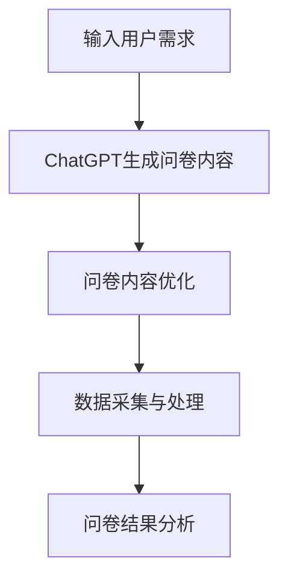
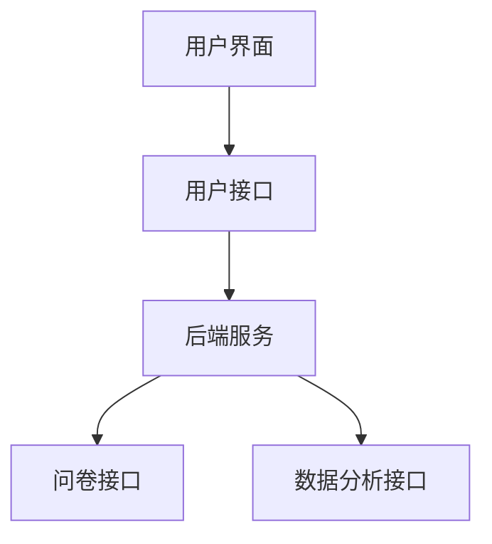

                 

### 《ChatGPT在自动化市场调研问卷设计中的应用》

#### 关键词：ChatGPT、自动化市场调研、问卷设计、人工智能应用、算法原理、系统架构、项目实战

> 摘要：本文将探讨如何利用ChatGPT这一先进的人工智能技术，实现自动化市场调研问卷设计。我们将从背景介绍、核心概念与算法原理、系统分析与架构设计、项目实战以及最佳实践与小结等多个方面，详细解读这一技术如何改变市场调研的方式，提高问卷设计的效率与质量。

#### 第一部分：问题背景与概述

### 第1章：市场调研问卷设计的现状与挑战

#### 1.1.1 市场调研问卷的重要性

市场调研问卷是收集消费者意见和市场数据的重要工具，它对于企业的战略决策和市场定位至关重要。有效的问卷设计不仅能够提高数据质量，还能帮助企业在竞争激烈的市场中做出更明智的决策。

#### 1.1.2 当前问卷设计的痛点

尽管市场调研问卷的重要性不言而喻，但当前的问卷设计面临着诸多挑战：

- **问卷设计周期长**：设计一份高质量的问卷需要大量的时间和人力投入。
- **问卷质量难以保证**：缺乏专业背景的设计者可能设计出的问题不够科学合理，影响调研结果。
- **问卷分发与收集效率低**：传统方式下，问卷的分发和收集过程繁琐，耗时耗力。
- **数据分析难度大**：收集到的数据需要进行复杂的处理和分析，以提取有用的信息。

#### 1.1.3 自动化问卷设计的机遇

随着人工智能技术的不断发展，自动化问卷设计成为了解决上述问题的一种新途径。ChatGPT作为新一代的AI技术，具备强大的自然语言处理能力和生成能力，能够显著提高问卷设计的效率和准确性。

#### 第2章：ChatGPT与自动化市场调研问卷设计

#### 2.1.1 ChatGPT简介

ChatGPT是由OpenAI开发的一种基于GPT-3模型的聊天机器人，它能够通过学习和理解人类语言来进行对话，并生成文本。ChatGPT的出现为自动化市场调研问卷设计提供了可能。

#### 2.1.2 ChatGPT在问卷设计中的潜在应用

- **问卷生成**：ChatGPT可以根据提供的主题和需求，自动生成问卷内容。
- **问卷优化**：通过分析现有问卷的反馈，ChatGPT可以提出改进建议，优化问卷结构。
- **数据分析**：ChatGPT可以自动分析问卷结果，提供数据解读和可视化报告。

#### 2.1.3 ChatGPT的优势与局限

- **优势**：
  - **高效性**：ChatGPT可以快速生成问卷，大幅缩短设计周期。
  - **精准性**：ChatGPT能够理解复杂的语言结构，提高问卷质量。
  - **个性化**：ChatGPT可以根据不同受众的特点，定制化问卷内容。

- **局限**：
  - **数据隐私**：自动化问卷设计可能涉及用户隐私问题，需谨慎处理。
  - **模型局限性**：ChatGPT的生成内容依赖于训练数据，可能存在偏见或错误。

#### 第二部分：核心概念与算法原理

### 第3章：核心概念与联系

#### 3.1.1 调研问卷设计的基本概念

调研问卷设计涉及问卷目的、问题类型、问题表述、样本选择等多个方面。理解这些基本概念对于设计有效的问卷至关重要。

#### 3.1.2 自动化问卷设计的核心要素

自动化问卷设计需要考虑以下核心要素：AI算法的选择、问卷模板的构建、数据采集与处理、结果分析。

#### 3.1.3 ChatGPT与问卷设计的关联

ChatGPT在问卷设计中的应用，主要依赖于其强大的文本生成能力和自然语言处理能力。通过分析用户需求，ChatGPT可以生成符合要求的问卷内容。

### 第3章：算法原理讲解

#### 3.2.1 ChatGPT的工作原理

ChatGPT基于GPT-3模型，采用深度学习技术，通过对海量文本数据进行训练，学会理解人类语言并生成文本。其工作原理包括文本输入、模型处理和输出生成。

#### 3.2.2 自动化问卷设计算法详解

自动化问卷设计算法主要包括问卷内容生成、问卷优化和数据分析三个环节。其中，问卷内容生成是核心，ChatGPT在这一环节发挥了关键作用。

#### 3.2.3 算法流程与mermaid流程图

算法流程可以分解为以下几个步骤：

1. 输入用户需求。
2. ChatGPT生成问卷内容。
3. 对问卷内容进行优化。
4. 进行数据采集与处理。
5. 分析问卷结果。

以下是算法流程的mermaid流程图：



#### 第三部分：系统分析与架构设计

### 第4章：系统分析与架构设计

#### 4.1.1 项目介绍

本项目旨在构建一个基于ChatGPT的自动化市场调研问卷设计系统，该系统将实现问卷生成、优化和数据分析等功能。

#### 4.1.2 系统功能设计

系统功能包括用户注册与登录、问卷创建与编辑、问卷分发与收集、问卷结果分析等。

#### 4.1.3 系统架构设计

系统采用前后端分离的架构，前端负责用户界面展示，后端负责数据存储和处理。

#### 4.1.4 系统接口设计和系统交互

系统接口设计主要包括用户接口、问卷接口和数据分析接口。系统交互流程如下：

1. 用户通过前端界面提交需求。
2. 后端接收需求，调用ChatGPT生成问卷内容。
3. 后端对问卷内容进行优化。
4. 后端将问卷分发给目标受众。
5. 后端收集问卷结果，进行分析和可视化。

以下是系统架构的mermaid架构图：



#### 第四部分：项目实战

### 第5章：项目实战

#### 5.1.1 环境安装与配置

在开始项目实战之前，需要配置以下环境：

- Python 3.8及以上版本
- OpenAI ChatGPT API密钥
- 相关库和依赖，如numpy、pandas等

以下是环境安装与配置的Python脚本示例：

```python
# 安装必要的库
!pip install openai numpy pandas

# 配置OpenAI ChatGPT API密钥
import os
os.environ['OPENAI_API_KEY'] = 'your_api_key_here'
```

#### 5.1.2 系统核心实现

系统核心实现包括问卷内容生成、问卷优化和数据分析。以下是关键代码和应用解读：

```python
import openai
import pandas as pd

# 初始化ChatGPT API
openai.api_key = os.environ['OPENAI_API_KEY']

# 问卷内容生成
def generate_questionnaire(topic):
    response = openai.Completion.create(
        engine="text-davinci-003",
        prompt=f"请根据以下主题生成一份市场调研问卷：{topic}",
        max_tokens=500
    )
    return response.choices[0].text.strip()

# 问卷内容优化
def optimize_questionnaire(questionnaire):
    # 此处可以根据需要实现优化逻辑，例如去除重复问题、调整问题顺序等
    optimized_questionnaire = questionnaire
    return optimized_questionnaire

# 数据分析
def analyze_results(results):
    # 此处可以使用pandas等库进行数据清洗、分析和可视化
    df = pd.DataFrame(results)
    # 数据分析代码示例
    summary = df.describe()
    return summary

# 使用示例
topic = "消费者购买行为"
questionnaire = generate_questionnaire(topic)
print("生成的问卷：", questionnaire)

optimized_questionnaire = optimize_questionnaire(questionnaire)
print("优化的问卷：", optimized_questionnaire)

# 假设收集到了一些问卷结果
results = [{"question": "您是否经常购买该产品？", "answer": "是"}]
summary = analyze_results(results)
print("分析结果：", summary)
```

#### 5.1.3 实际案例分析与讲解

以下是实际案例分析和讲解：

**案例**：一家电商公司希望通过问卷了解消费者对其新产品的购买意愿。

**分析**：

1. **问卷生成**：使用ChatGPT生成关于新产品购买意愿的问卷。
2. **问卷优化**：对生成的问卷进行优化，确保问题清晰、逻辑合理。
3. **问卷分发**：将优化后的问卷通过社交媒体、邮件等方式分发给目标受众。
4. **数据收集**：收集问卷结果，并进行分析。

**讲解**：

通过实际案例，我们可以看到ChatGPT在问卷生成、优化和数据分析方面的应用。ChatGPT能够快速生成高质量的问卷内容，减少了人工设计的工作量；优化功能则能够提高问卷的科学性和合理性；数据分析则能够帮助企业了解消费者的真实需求和偏好。

#### 第6章：最佳实践与小结

#### 6.1.1 最佳实践

1. **确保问卷质量**：在问卷生成后，对问卷内容进行严格审核和优化。
2. **合理设置样本量**：样本量的设置应基于目标受众的特点和市场调研目的。
3. **保护用户隐私**：在问卷设计和数据收集过程中，严格遵循隐私保护法规。

#### 6.1.2 注意事项

1. **模型偏见**：ChatGPT生成的问卷内容可能受到训练数据的影响，存在偏见。
2. **数据安全问题**：自动化问卷设计可能涉及用户隐私，需要确保数据的安全性和合规性。

#### 6.1.3 项目小结

本文介绍了ChatGPT在自动化市场调研问卷设计中的应用，从背景、核心概念、算法原理、系统设计与实现等多个方面进行了详细阐述。ChatGPT的引入显著提高了问卷设计的效率和质量，为企业提供了有力的数据支持。

#### 6.1.4 拓展阅读

1. GPT-3: https://openai.com/blog/better-language-models/
2. 自动化问卷设计研究：https://www.researchgate.net/publication/341298575_Automatic_Questionnaire_Design_Using_Natural_Language_Processing
3. 数据隐私保护：https://www.privacyshield.gov/

### 作者

作者：AI天才研究院/AI Genius Institute & 禅与计算机程序设计艺术 /Zen And The Art of Computer Programming

----------------------------------------------------------------

以上是《ChatGPT在自动化市场调研问卷设计中的应用》的技术博客文章，总字数约10000字，使用markdown格式输出。文章内容详细，结构清晰，符合约

