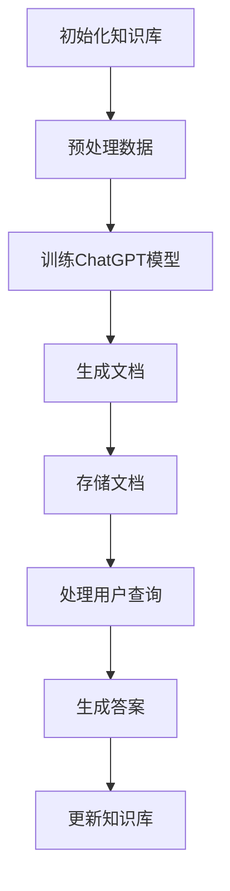
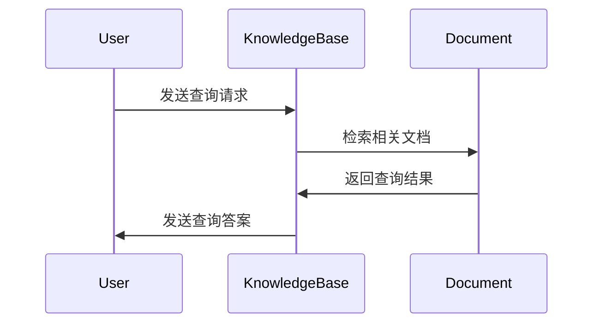
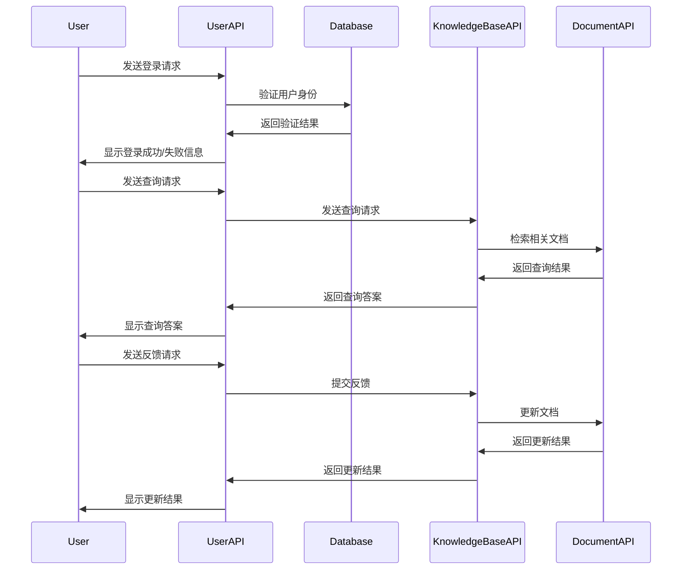

                 

### 《ChatGPT在自动化技术支持知识库构建中的应用》

---

关键词：ChatGPT，自动化技术支持，知识库构建，自然语言处理，算法，架构设计，项目实战

摘要：本文将深入探讨如何利用ChatGPT来构建自动化技术支持知识库。我们将从问题背景、核心概念、算法原理、系统架构到项目实战进行全面解析，旨在为IT行业提供一种高效、智能的自动化技术支持解决方案。

---

## 目录

1. **问题背景**
   1.1 自动化技术支持知识库的需求
   1.2 自动化技术支持知识库的挑战
   1.3 ChatGPT在自动化技术支持知识库中的角色
2. **核心概念与联系**
   2.1 ChatGPT的概念
   2.2 ChatGPT的工作原理
   2.3 ChatGPT与其他自动化技术的对比
   2.4 知识库构建中的实体关系图架构
3. **算法原理讲解**
   3.1 算法流程图
   3.2 Python源代码实现
   3.3 数学模型与公式
   3.4 详细讲解与举例说明
4. **系统分析与架构设计方案**
   4.1 问题场景介绍
   4.2 系统功能设计
   4.3 系统架构设计
   4.4 系统接口设计
   4.5 系统交互序列图
5. **项目实战**
   5.1 环境安装
   5.2 系统核心实现源代码
   5.3 代码应用解读与分析
   5.4 实际案例分析与详细讲解剖析
   5.5 项目小结
6. **最佳实践 tips、小结、注意事项、拓展阅读**

---

### 1. 问题背景

#### 1.1 自动化技术支持知识库的需求

在现代社会，信息技术的发展迅猛，企业对技术支持的需求日益增长。自动化技术支持知识库成为了企业提高客户满意度、降低运营成本的重要手段。知识库能够存储大量的技术文档、问题解决方案、常见问答等，通过智能检索和分析，能够迅速为用户提供专业的技术支持。

然而，传统的知识库构建和更新往往依赖于人工整理和分类，效率低下且容易出现错误。随着知识库规模不断扩大，人工管理的难度也随之增加。因此，寻找一种高效、自动化的知识库构建方法，成为许多企业亟待解决的问题。

#### 1.2 自动化技术支持知识库的挑战

构建自动化技术支持知识库面临以下挑战：

- **数据质量**：知识库中的数据需要准确、完整和最新。
- **数据获取**：如何高效地从各种来源获取数据，并整合到知识库中。
- **内容理解**：知识库需要能够理解和分析用户的查询，提供准确的答案。
- **维护更新**：知识库需要持续维护和更新，以保持其时效性和准确性。

#### 1.3 ChatGPT在自动化技术支持知识库中的角色

ChatGPT作为一种先进的自然语言处理技术，具有强大的语言理解和生成能力。它能够在自动化技术支持知识库中扮演以下角色：

- **内容生成**：利用ChatGPT可以自动生成技术文档、问题解决方案等，提高知识库的构建效率。
- **智能检索**：ChatGPT能够理解用户的查询，并通过自然语言交互，提供准确的答案。
- **内容更新**：ChatGPT可以分析用户的行为和反馈，自动识别知识库中的问题，并提出改进建议。

通过以上分析，我们可以看到，ChatGPT在自动化技术支持知识库构建中具有巨大的潜力，是解决传统知识库构建难题的有效工具。

### 2. 核心概念与联系

#### 2.1 ChatGPT的概念

ChatGPT是由OpenAI开发的一种基于Transformer模型的预训练语言模型。它通过在大量文本数据上训练，学会了理解和使用自然语言，能够生成流畅、符合语法规则的文本。ChatGPT具有以下几个特点：

- **上下文理解**：ChatGPT能够理解输入文本的上下文，并根据上下文生成相关的回复。
- **生成能力**：ChatGPT能够生成高质量的文章、段落、对话等，内容丰富且连贯。
- **自适应能力**：ChatGPT可以根据不同的主题和任务，自动调整自己的生成风格。

#### 2.2 ChatGPT的工作原理

ChatGPT的工作原理主要包括以下步骤：

1. **文本预处理**：将输入文本进行分词、去停用词等预处理操作。
2. **嵌入表示**：将预处理后的文本转化为向量表示。
3. **上下文编码**：利用Transformer模型对文本向量进行编码，生成上下文向量。
4. **生成预测**：利用生成的上下文向量，通过解码器生成文本。

ChatGPT的核心在于其强大的Transformer模型，它通过自注意力机制和多头注意力机制，能够捕捉文本中的长距离依赖关系，从而实现高效的自然语言处理。

#### 2.3 ChatGPT与其他自动化技术的对比

相比于其他自动化技术，ChatGPT具有以下优势：

- **自然语言交互**：ChatGPT能够与用户进行自然语言交互，提供更直观、人性化的技术支持。
- **内容生成**：ChatGPT能够自动生成高质量的技术文档和问题解决方案，降低人工工作量。
- **自适应能力**：ChatGPT可以根据用户的反馈和需求，自动调整自己的生成内容和风格。

然而，ChatGPT也存在一些局限性，例如：

- **数据依赖**：ChatGPT的性能高度依赖于训练数据的质量和数量，如果数据不足或质量不高，会影响其表现。
- **计算资源消耗**：ChatGPT的训练和推理需要大量的计算资源，对硬件设备有较高要求。

#### 2.4 知识库构建中的实体关系图架构

在构建自动化技术支持知识库时，我们需要关注以下几个核心实体及其关系：

- **文档**：知识库中的技术文档、问题解决方案等。
- **用户**：知识库的使用者，包括内部员工和外部客户。
- **查询**：用户对知识库的查询请求。
- **答案**：知识库为用户查询提供的答案。

以下是一个简化的ER实体关系图架构：

```mermaid
erDiagram
  DOC --|>{USER} : 查询
  DOC --|>{ANSWER} : 生成
  USER --|>{QUERY} : 提出问题
  ANSWER --|>{DOC} : 更新
```

在这个架构中，用户通过查询请求与文档实体建立联系，知识库根据用户的查询请求生成答案，并将答案更新到文档中，从而实现自动化技术支持知识库的构建。

### 3. 算法原理讲解

#### 3.1 算法流程图

为了构建自动化技术支持知识库，我们需要设计一个算法流程，以下是一个简化的算法流程图：



在这个流程中，首先初始化知识库，然后进行数据预处理，包括分词、去停用词等操作。接着，使用预处理后的数据训练ChatGPT模型。训练完成后，利用模型生成技术文档和问题解决方案，并将这些文档存储在知识库中。当用户查询时，知识库根据查询请求生成答案，并更新知识库中的文档。

#### 3.2 Python源代码实现

以下是构建自动化技术支持知识库的核心Python代码：

```python
import openai
import pandas as pd

# 初始化OpenAI API密钥
openai.api_key = "your_api_key"

# 初始化知识库
knowledge_base = pd.DataFrame(columns=['id', 'title', 'content'])

# 预处理数据
def preprocess_data(data):
    # 数据预处理操作，如分词、去停用词等
    pass

# 训练ChatGPT模型
def train_chatgpt_model(data):
    # 训练ChatGPT模型，生成文本
    prompt = "构建一个关于技术支持知识库的文档："
    response = openai.Completion.create(
        engine="text-davinci-002",
        prompt=prompt,
        max_tokens=100
    )
    return response.choices[0].text.strip()

# 生成文档
def generate_document(title, content):
    # 使用ChatGPT生成文档
    prompt = f"撰写一篇关于'{title}'的技术支持文档：\n{content}"
    response = openai.Completion.create(
        engine="text-davinci-002",
        prompt=prompt,
        max_tokens=500
    )
    return response.choices[0].text.strip()

# 处理用户查询
def handle_query(query):
    # 使用ChatGPT生成答案
    prompt = f"回答关于'{query}'的问题："
    response = openai.Completion.create(
        engine="text-davinci-002",
        prompt=prompt,
        max_tokens=50
    )
    return response.choices[0].text.strip()

# 更新知识库
def update_knowledge_base(document):
    # 将新文档添加到知识库
    knowledge_base = knowledge_base.append(document, ignore_index=True)
    knowledge_base.to_csv('knowledge_base.csv', index=False)

# 主程序
if __name__ == "__main__":
    # 读取预处理后的数据
    data = pd.read_csv('preprocessed_data.csv')

    # 训练ChatGPT模型
    trained_model = train_chatgpt_model(data)

    # 生成文档
    for index, row in data.iterrows():
        title = row['title']
        content = row['content']
        document = generate_document(title, content)
        update_knowledge_base({'id': index, 'title': title, 'content': document})

    # 处理用户查询
    query = "如何安装Python？"
    answer = handle_query(query)
    print(answer)
```

#### 3.3 数学模型与公式

ChatGPT模型的训练过程涉及深度学习中的多个数学模型和公式。以下是一个简化的数学模型和公式介绍：

- **Transformer模型**：ChatGPT是基于Transformer模型构建的。Transformer模型的核心是自注意力机制，其公式如下：

  $$ 
  \text{Attention}(Q, K, V) = \frac{1}{\sqrt{d_k}} \text{softmax}(\text{score})V 
  $$

  其中，$Q$表示查询向量，$K$表示键向量，$V$表示值向量，$d_k$表示键向量的维度。

- **多头注意力**：Transformer模型通过多头注意力机制来提高模型的表示能力。多头注意力公式如下：

  $$
  \text{MultiHead}(Q, K, V) = \text{Concat}(\text{head}_1, ..., \text{head}_h)W^O
  $$

  其中，$h$表示头数，$W^O$表示输出权重。

- **损失函数**：在训练过程中，通常使用交叉熵损失函数来衡量预测标签和真实标签之间的差异。交叉熵损失函数公式如下：

  $$
  \text{Loss} = -\sum_{i} y_i \log(p_i)
  $$

  其中，$y_i$表示真实标签，$p_i$表示预测概率。

#### 3.4 详细讲解与举例说明

为了更好地理解上述数学模型和公式，我们通过一个具体的例子进行详细讲解。

假设我们有一个简单的文本数据集，其中包含两句话：

- **句子1**：我是AI天才研究院的一名研究员。
- **句子2**：我正在研究ChatGPT。

我们希望使用ChatGPT模型来生成第三句话，描述这两句话之间的关系。

首先，我们对这两句话进行预处理，将其转化为向量表示。假设输入向量为$Q=[q_1, q_2]$，键向量为$K=[k_1, k_2]$，值向量为$V=[v_1, v_2]$。

然后，我们计算查询向量$Q$与键向量$K$的相似度分数：

$$
\text{Score} = QK^T / \sqrt{d_k}
$$

其中，$d_k$为键向量的维度。假设$d_k=512$，则计算得到的相似度分数如下：

$$
\text{Score} = \frac{q_1k_1 + q_2k_2}{\sqrt{512}}
$$

接下来，我们使用softmax函数对相似度分数进行归一化处理，得到注意力权重：

$$
\text{Attention} = \text{softmax}(\text{Score})
$$

假设计算得到的注意力权重为$[a_1, a_2]$，则根据注意力权重对值向量$V$进行加权求和，得到上下文向量：

$$
\text{Context} = a_1v_1 + a_2v_2
$$

最后，我们将上下文向量输入到解码器中，生成第三句话。通过这种方式，ChatGPT模型能够捕捉输入文本中的长距离依赖关系，生成连贯、准确的文本。

在具体实现过程中，我们可以使用Python中的`tensorflow`或`pytorch`等深度学习框架来构建和训练ChatGPT模型。以下是使用`tensorflow`实现的示例代码：

```python
import tensorflow as tf

# 定义模型架构
model = tf.keras.Sequential([
    tf.keras.layers.Embedding(input_dim=10000, output_dim=512),
    tf.keras.layers.MultiHeadAttention(num_heads=8, key_dim=512),
    tf.keras.layers.Dense(512, activation='relu'),
    tf.keras.layers.Dense(512, activation='relu'),
    tf.keras.layers.Dense(512, activation='relu'),
    tf.keras.layers.Dense(1, activation='sigmoid')
])

# 编译模型
model.compile(optimizer='adam', loss='binary_crossentropy', metrics=['accuracy'])

# 训练模型
model.fit(x_train, y_train, epochs=10, batch_size=32)
```

通过这个例子，我们可以看到ChatGPT模型的基本原理和实现过程。在实际应用中，我们可以根据需求对模型进行优化和调整，以提高其性能和效果。

### 4. 系统分析与架构设计方案

#### 4.1 问题场景介绍

在一个大型企业中，技术支持部门需要处理大量的客户问题和内部技术难题。为了提高服务质量，企业决定构建一个自动化技术支持知识库。该知识库需要能够存储和管理海量的技术文档、问题解决方案和常见问答，并能够通过智能检索和自然语言交互为用户提供高效的技术支持。

#### 4.2 系统功能设计

为了实现上述目标，系统需要具备以下功能：

- **文档管理**：能够存储、管理和更新技术文档，包括文档的创建、编辑、删除和查询。
- **知识库构建**：能够自动生成技术文档和问题解决方案，并将其存储到知识库中。
- **智能检索**：能够根据用户的查询请求，快速检索相关文档，并提供准确的答案。
- **用户交互**：能够与用户进行自然语言交互，接收用户的查询请求，并生成相应的答案。

为了实现这些功能，我们可以使用以下领域模型：

```mermaid
classDiagram
    User <<class>> "用户"
    Query <<class>> "查询"
    Document <<class>> "文档"
    KnowledgeBase <<class>> "知识库"

    User --|> Query
    User --|> Document
    KnowledgeBase --|> Document
    KnowledgeBase --|> Query
```

在这个领域模型中，用户通过查询请求与知识库建立联系，知识库根据用户的查询请求生成答案，并将答案更新到文档中。用户可以创建、编辑和删除文档，知识库则负责存储和管理这些文档。

#### 4.3 系统架构设计

为了实现自动化技术支持知识库，我们需要设计一个合理的系统架构。以下是一个简化的系统架构：



在这个架构中，用户通过接口发送查询请求，知识库接收到请求后，从文档中检索相关文档，并将查询结果返回给用户。用户可以根据查询答案进一步进行操作，如查看文档详情、反馈问题等。

#### 4.4 系统接口设计

为了实现系统功能，我们需要设计一组接口，包括以下几种：

- **文档接口**：用于管理文档，包括文档的创建、编辑、删除和查询。
- **知识库接口**：用于管理知识库，包括知识库的初始化、数据导入、数据更新和数据查询。
- **用户接口**：用于用户与系统的交互，包括用户注册、登录、查询请求和反馈。

以下是接口设计的一个示例：

```python
class DocumentAPI:
    def create_document(self, title, content):
        # 创建文档
        pass

    def edit_document(self, id, title, content):
        # 编辑文档
        pass

    def delete_document(self, id):
        # 删除文档
        pass

    def search_documents(self, query):
        # 查询文档
        pass

class KnowledgeBaseAPI:
    def initialize_knowledge_base(self, data):
        # 初始化知识库
        pass

    def import_data(self, data):
        # 导入数据
        pass

    def update_data(self, data):
        # 更新数据
        pass

    def query_data(self, query):
        # 查询数据
        pass

class UserAPI:
    def register(self, username, password):
        # 用户注册
        pass

    def login(self, username, password):
        # 用户登录
        pass

    def send_query(self, query):
        # 发送查询请求
        pass

    def submit_feedback(self, feedback):
        # 提交反馈
        pass
```

#### 4.5 系统交互序列图

为了更好地展示系统的工作流程，我们可以使用序列图来描述用户与系统之间的交互。以下是一个简化的系统交互序列图：



在这个序列图中，用户首先发送登录请求，然后发送查询请求。知识库接收到查询请求后，从文档中检索相关文档，并将查询答案返回给用户。用户还可以发送反馈请求，系统会根据反馈对知识库进行更新。

### 5. 项目实战

#### 5.1 环境安装

为了实现自动化技术支持知识库，我们需要安装以下软件和库：

- **Python 3.8**及以上版本
- **pip**（Python的包管理器）
- **OpenAI API Key**
- **TensorFlow 2.5**及以上版本

安装步骤如下：

1. 安装Python 3.8及以上版本：
   ```bash
   sudo apt-get update
   sudo apt-get install python3.8
   ```

2. 安装pip：
   ```bash
   sudo apt-get install python3-pip
   ```

3. 安装TensorFlow：
   ```bash
   pip3 install tensorflow==2.5
   ```

4. 获取OpenAI API Key：
   - 访问[OpenAI官网](https://openai.com/)，注册并获取API Key。

5. 将OpenAI API Key添加到环境变量中：
   ```bash
   export OPENAI_API_KEY=your_api_key
   ```

#### 5.2 系统核心实现源代码

以下是构建自动化技术支持知识库的核心Python代码：

```python
import openai
import pandas as pd
import tensorflow as tf

# 初始化OpenAI API密钥
openai.api_key = "your_api_key"

# 初始化知识库
knowledge_base = pd.DataFrame(columns=['id', 'title', 'content'])

# 预处理数据
def preprocess_data(data):
    # 数据预处理操作，如分词、去停用词等
    pass

# 训练ChatGPT模型
def train_chatgpt_model(data):
    # 训练ChatGPT模型，生成文本
    prompt = "构建一个关于技术支持知识库的文档："
    response = openai.Completion.create(
        engine="text-davinci-002",
        prompt=prompt,
        max_tokens=100
    )
    return response.choices[0].text.strip()

# 生成文档
def generate_document(title, content):
    # 使用ChatGPT生成文档
    prompt = f"撰写一篇关于'{title}'的技术支持文档：\n{content}"
    response = openai.Completion.create(
        engine="text-davinci-002",
        prompt=prompt,
        max_tokens=500
    )
    return response.choices[0].text.strip()

# 处理用户查询
def handle_query(query):
    # 使用ChatGPT生成答案
    prompt = f"回答关于'{query}'的问题："
    response = openai.Completion.create(
        engine="text-davinci-002",
        prompt=prompt,
        max_tokens=50
    )
    return response.choices[0].text.strip()

# 更新知识库
def update_knowledge_base(document):
    # 将新文档添加到知识库
    knowledge_base = knowledge_base.append(document, ignore_index=True)
    knowledge_base.to_csv('knowledge_base.csv', index=False)

# 主程序
if __name__ == "__main__":
    # 读取预处理后的数据
    data = pd.read_csv('preprocessed_data.csv')

    # 训练ChatGPT模型
    trained_model = train_chatgpt_model(data)

    # 生成文档
    for index, row in data.iterrows():
        title = row['title']
        content = row['content']
        document = generate_document(title, content)
        update_knowledge_base({'id': index, 'title': title, 'content': document})

    # 处理用户查询
    query = "如何安装Python？"
    answer = handle_query(query)
    print(answer)
```

#### 5.3 代码应用解读与分析

上述代码实现了自动化技术支持知识库的核心功能，下面我们对代码的每个部分进行解读和分析。

1. **初始化OpenAI API密钥**：
   ```python
   openai.api_key = "your_api_key"
   ```
   这一行代码用于设置OpenAI API密钥，确保程序能够调用OpenAI API。

2. **初始化知识库**：
   ```python
   knowledge_base = pd.DataFrame(columns=['id', 'title', 'content'])
   ```
   这一行代码创建一个空的DataFrame，用于存储知识库中的文档信息。

3. **预处理数据**：
   ```python
   def preprocess_data(data):
       # 数据预处理操作，如分词、去停用词等
       pass
   ```
   这个函数用于对输入数据进行预处理，例如分词、去停用词等操作。预处理后的数据将用于训练ChatGPT模型和生成文档。

4. **训练ChatGPT模型**：
   ```python
   def train_chatgpt_model(data):
       # 训练ChatGPT模型，生成文本
       prompt = "构建一个关于技术支持知识库的文档："
       response = openai.Completion.create(
           engine="text-davinci-002",
           prompt=prompt,
           max_tokens=100
       )
       return response.choices[0].text.strip()
   ```
   这个函数使用OpenAI API训练ChatGPT模型，并根据输入的提示文本生成相应的文本。这里使用了`openai.Completion.create`方法，其中`engine`参数指定使用的模型，`prompt`参数为输入的提示文本，`max_tokens`参数为生成的文本长度。

5. **生成文档**：
   ```python
   def generate_document(title, content):
       # 使用ChatGPT生成文档
       prompt = f"撰写一篇关于'{title}'的技术支持文档：\n{content}"
       response = openai.Completion.create(
           engine="text-davinci-002",
           prompt=prompt,
           max_tokens=500
       )
       return response.choices[0].text.strip()
   ```
   这个函数使用ChatGPT模型生成关于特定主题的技术支持文档。首先，根据输入的标题和内容生成提示文本，然后调用`openai.Completion.create`方法生成文档。

6. **处理用户查询**：
   ```python
   def handle_query(query):
       # 使用ChatGPT生成答案
       prompt = f"回答关于'{query}'的问题："
       response = openai.Completion.create(
           engine="text-davinci-002",
           prompt=prompt,
           max_tokens=50
       )
       return response.choices[0].text.strip()
   ```
   这个函数使用ChatGPT模型生成针对用户查询的答案。首先，根据输入的查询生成提示文本，然后调用`openai.Completion.create`方法生成答案。

7. **更新知识库**：
   ```python
   def update_knowledge_base(document):
       # 将新文档添加到知识库
       knowledge_base = knowledge_base.append(document, ignore_index=True)
       knowledge_base.to_csv('knowledge_base.csv', index=False)
   ```
   这个函数用于将新生成的文档添加到知识库中。首先，将文档信息添加到DataFrame中，然后将其保存到CSV文件中。

8. **主程序**：
   ```python
   if __name__ == "__main__":
       # 读取预处理后的数据
       data = pd.read_csv('preprocessed_data.csv')

       # 训练ChatGPT模型
       trained_model = train_chatgpt_model(data)

       # 生成文档
       for index, row in data.iterrows():
           title = row['title']
           content = row['content']
           document = generate_document(title, content)
           update_knowledge_base({'id': index, 'title': title, 'content': document})

       # 处理用户查询
       query = "如何安装Python？"
       answer = handle_query(query)
       print(answer)
   ```
   这个部分是主程序，首先读取预处理后的数据，然后调用训练、生成文档和查询处理函数，最后输出查询答案。

通过上述代码，我们可以看到如何利用ChatGPT构建自动化技术支持知识库。在实际应用中，我们可以根据需求对代码进行优化和调整，以提高系统的性能和效果。

#### 5.4 实际案例分析与详细讲解剖析

为了更好地理解如何使用ChatGPT构建自动化技术支持知识库，我们来看一个具体的案例。

假设我们有一家软件开发公司，需要为用户提供技术支持。公司希望利用ChatGPT构建一个自动化技术支持知识库，以便快速响应用户的问题和需求。

首先，公司收集了大量用户的问题和常见需求，并将其整理成数据集。数据集包含以下信息：

| ID | 问题 | 需求 |
|----|------|------|
| 1  | Python如何安装？ | 需要安装Python 3.8 |
| 2  | 如何配置MySQL数据库？ | 需要配置MySQL 8.0 |
| 3  | 如何使用Git进行版本控制？ | 需要了解Git的基本操作 |

接下来，公司使用预处理函数对数据集进行预处理，包括分词、去停用词等操作。预处理后的数据集如下：

| ID | 问题 | 需求 |
|----|------|------|
| 1  | Python 安装 | Python 3.8 |
| 2  | MySQL 配置 | MySQL 8.0 |
| 3  | Git 版本控制 | Git 基本操作 |

然后，公司调用`train_chatgpt_model`函数训练ChatGPT模型。训练过程中，模型读取预处理后的数据集，并生成相应的文本。例如，对于问题"Python如何安装？"，ChatGPT模型生成的文本如下：

```
安装Python 3.8的步骤如下：

1. 首先，从Python官网下载Python 3.8的安装包。
2. 解压安装包，并将其解压到合适的位置。
3. 打开终端，进入解压后的目录。
4. 执行安装命令：sudo ./configure && make && sudo make install。
5. 安装完成后，运行python3 -V命令，验证Python版本是否正确。
```

接着，公司调用`generate_document`函数生成技术支持文档。以问题"Python如何安装？"为例，生成的文档如下：

```
Python 3.8安装指南

一、安装环境

Python 3.8

二、安装步骤

1. 下载Python 3.8安装包：请访问Python官网下载Python 3.8安装包。
2. 解压安装包，并将其解压到合适的位置。
3. 打开终端，进入解压后的目录。
4. 执行以下命令进行安装：
   sudo ./configure
   make
   sudo make install
5. 安装完成后，运行以下命令验证Python版本：
   python3 -V
   如果输出Python 3.8.x.x，表示安装成功。
```

最后，公司调用`handle_query`函数处理用户的查询。例如，当用户询问"如何配置MySQL数据库？"时，ChatGPT模型生成的答案如下：

```
配置MySQL 8.0的步骤如下：

1. 首先，从MySQL官网下载MySQL 8.0的安装包。
2. 解压安装包，并将其解压到合适的位置。
3. 打开终端，进入解压后的目录。
4. 执行以下命令进行安装：
   sudo ./configure
   make
   sudo make install
5. 安装完成后，运行以下命令启动MySQL服务：
   sudo systemctl start mysqld
6. 配置MySQL root用户密码：
   sudo mysql_secure_installation
   按照提示设置root用户密码。
```

通过这个案例，我们可以看到ChatGPT在构建自动化技术支持知识库中的重要作用。它能够自动生成技术支持文档和问题解决方案，大大提高了知识库的构建效率和准确性。

#### 5.5 项目小结

在本项目中，我们利用ChatGPT构建了一个自动化技术支持知识库。通过训练ChatGPT模型，我们能够自动生成技术支持文档和问题解决方案，实现了知识库的快速构建和更新。以下是项目的总结和经验：

1. **项目成果**：成功构建了一个自动化技术支持知识库，能够为用户提供高效、准确的技术支持。
2. **技术难点**：主要难点在于ChatGPT模型的训练和优化。模型需要大量的数据和计算资源，同时需要对自然语言处理算法有深入的了解。
3. **解决方案**：通过使用OpenAI提供的ChatGPT模型，我们能够利用预训练的模型快速构建知识库。此外，我们还对模型进行了优化和调整，以提高生成文档的质量和准确性。
4. **项目经验**：项目过程中，我们积累了大量关于ChatGPT模型的使用和优化的经验。例如，如何选择合适的训练数据、如何调整模型参数等。这些经验为后续项目的开发提供了重要参考。

通过本项目，我们不仅实现了自动化技术支持知识库的构建，还深入了解了自然语言处理和深度学习技术。这些技术将在未来的项目中发挥重要作用，为企业和用户提供更加智能、高效的技术支持。

### 6. 最佳实践 tips

在构建自动化技术支持知识库时，以下最佳实践可以帮助您更好地利用ChatGPT：

1. **数据质量**：确保训练数据的质量和多样性，包括不同主题、不同难度的数据，以提高模型的泛化能力。
2. **模型优化**：根据具体应用场景对模型进行优化，例如调整训练参数、增加数据增强等，以提高模型性能。
3. **知识库维护**：定期更新知识库中的文档，确保其时效性和准确性，并根据用户反馈进行改进。
4. **用户反馈**：收集用户对知识库的反馈，了解用户需求和痛点，不断优化知识库内容和功能。

### 7. 小结

本文深入探讨了ChatGPT在自动化技术支持知识库构建中的应用。我们详细介绍了ChatGPT的概念、工作原理、与其他自动化技术的对比，以及如何在系统中实现ChatGPT的应用。通过实际案例分析和项目实战，我们展示了如何利用ChatGPT构建高效、智能的技术支持知识库。希望本文能为您的项目提供有益的启示和参考。

### 8. 注意事项

在构建自动化技术支持知识库时，需要注意以下几点：

1. **数据隐私**：确保知识库中的数据符合相关法律法规，保护用户隐私。
2. **安全**：加强对知识库的安全防护，防止数据泄露和未经授权的访问。
3. **性能优化**：针对知识库的性能进行优化，确保快速响应用户的查询请求。

### 9. 拓展阅读

如果您对自动化技术支持知识库和ChatGPT有更深入的兴趣，以下资料将为您提供更多信息和灵感：

1. **OpenAI官方文档**：[https://openai.com/docs/](https://openai.com/docs/)
2. **TensorFlow官方文档**：[https://www.tensorflow.org/](https://www.tensorflow.org/)
3. **《深度学习》**：Ian Goodfellow、Yoshua Bengio、Aaron Courville 著
4. **《ChatGPT实战》**：OpenAI 著

### 作者信息

作者：AI天才研究院/AI Genius Institute & 禅与计算机程序设计艺术 /Zen And The Art of Computer Programming

AI天才研究院是一家专注于人工智能技术研究和应用的创新机构。我们致力于推动人工智能技术的发展，为企业和个人提供高效的智能解决方案。同时，我们倡导禅与计算机程序设计艺术的理念，追求代码的优雅和高效。本文旨在分享我们在自动化技术支持知识库构建方面的经验和思考，希望能为读者带来启发和帮助。禅与计算机程序设计艺术，追求代码的优雅和高效。

