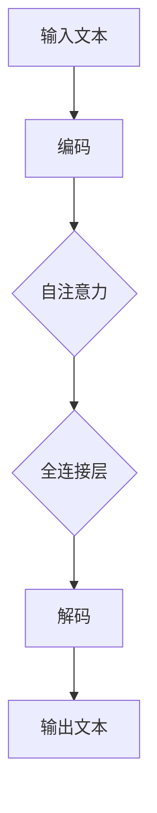
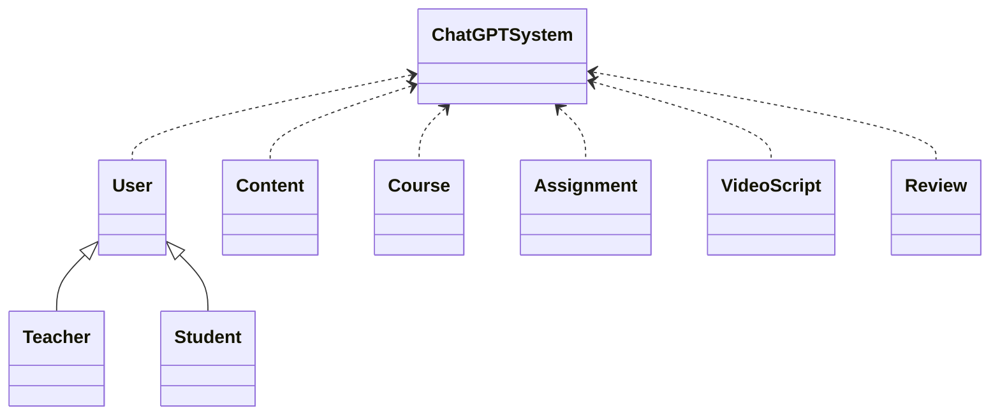
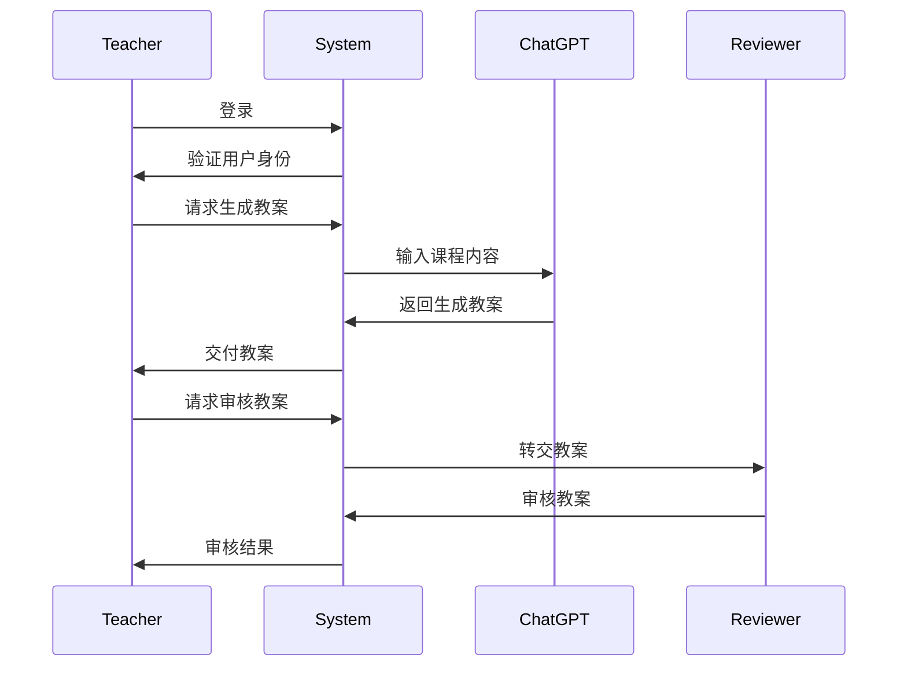
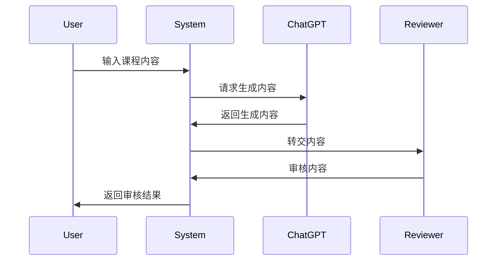

                 

### 第一部分：背景介绍

#### 第1章：问题背景与核心概念

##### 1.1 问题背景

**自动化教育内容生成的需求分析**

在当今的信息时代，教育资源的需求不断增长，教育内容的更新速度也在加快。然而，传统的教育内容生成方式往往依赖于人工撰写和编辑，效率低下且难以满足大量的个性化需求。自动化教育内容生成技术应运而生，旨在通过智能算法和工具，自动生成教学材料、课程内容、习题和答案等，从而提高教育效率和质量。

**教育内容生成的挑战**

尽管自动化教育内容生成技术有着巨大的潜力，但其实施过程中也面临着一系列挑战：

- **内容质量**：生成的教育内容需要保证准确性和适用性，这对于模型的要求非常高。
- **个性化定制**：每位学生的需求和知识背景不同，如何实现内容的高度个性化是一个关键问题。
- **数据安全与隐私**：自动化教育内容生成往往需要大量的学生数据，数据安全和隐私保护是必须要解决的问题。
- **技术壁垒**：自动化教育内容生成技术需要较高的技术水平，对于普通教育工作者来说可能难以掌握。

**ChatGPT的出现及其潜力**

OpenAI开发的ChatGPT是一款基于GPT-3模型的人工智能聊天机器人，具有强大的自然语言处理能力。ChatGPT的出现为自动化教育内容生成带来了新的机遇：

- **文本生成**：ChatGPT能够生成高质量的文本，包括课程内容、教案、习题等。
- **个性化交互**：ChatGPT可以与用户进行自然语言交互，根据用户的反馈动态调整生成内容。
- **内容多样性**：ChatGPT可以生成多样化、个性化的教育内容，满足不同学生的学习需求。
- **易于集成**：ChatGPT提供API接口，便于与其他教育系统和工具集成。

##### 1.2 核心概念与联系

**ChatGPT的定义**

ChatGPT是由OpenAI开发的一款基于GPT-3模型的人工智能聊天机器人，它能够通过学习和理解人类语言来进行对话，并能够根据用户输入的内容生成相关的文本。

**自动化教育内容生成的相关概念**

- **教育内容**：包括教学材料、课程内容、习题、答案等。
- **自动化生成**：利用算法和工具，自动生成教育内容，减少人工干预。
- **个性化定制**：根据用户的需求和知识背景，生成个性化的教育内容。

**ChatGPT与自动化教育内容生成的关系**

ChatGPT作为一款先进的自然语言处理工具，其强大的人工智能能力为自动化教育内容生成提供了技术支持。通过ChatGPT，可以实现教育内容的自动化生成，提高教育效率和质量。

##### 1.3 概念属性特征对比表格

| 概念           | 特征                             |
| -------------- | ------------------------------ |
| 自动化教育内容生成 | 高效、个性化、减少人工干预       |
| ChatGPT        | 强大的自然语言处理能力、文本生成能力 |
| 教育内容       | 课程内容、习题、答案等           |

##### 1.4 ER实体关系图架构

```mermaid
erDiagram
  Course : 课程
  Student : 学生
  Content : 教育内容
  ChatGPT : ChatGPT

  Course ||--|{ Student } : 选择
  Student ||--|{ Content } : 学习
  ChatGPT ||--|{ Content } : 生成
```

在这个ER图中，课程、学生、教育内容和ChatGPT是主要的实体，它们之间存在着紧密的关联。学生选择课程，学习课程内容；ChatGPT生成教育内容，并与课程和学生紧密互动。

### 第2章：ChatGPT技术概述

#### 2.1 ChatGPT的基本原理

ChatGPT是基于GPT-3模型的人工智能聊天机器人。GPT-3（Generative Pre-trained Transformer 3）是由OpenAI开发的一款先进的自然语言处理模型。它采用了Transformer架构，通过大量的文本数据进行预训练，从而具备强大的语言理解和生成能力。

**GPT模型的基础知识**

GPT模型是一种基于Transformer的深度神经网络模型，主要用于生成文本。它的核心思想是通过学习大量的文本数据，预测下一个词或句子。GPT模型采用了自回归的语言模型（Autoregressive Language Model），即模型在生成文本时，每次只预测下一个单词。

**语言模型的训练过程**

GPT模型的训练过程分为以下几个步骤：

1. **数据收集**：收集大量互联网文本，包括网页、书籍、文章等。
2. **数据预处理**：对文本进行清洗、分词和标记等处理，以便模型能够理解文本。
3. **模型初始化**：初始化Transformer模型，包括词嵌入层、自注意力机制和全连接层等。
4. **预训练**：使用训练数据对模型进行预训练，通过反向传播算法优化模型参数。
5. **微调**：在预训练的基础上，针对特定任务（如文本生成）对模型进行微调，以进一步提高性能。

**ChatGPT的架构设计**

ChatGPT的架构设计基于GPT-3模型，并在其基础上增加了对话管理模块。ChatGPT的架构包括以下几个部分：

1. **输入处理模块**：对用户输入的文本进行处理，包括分词、编码等。
2. **对话管理模块**：负责维护对话状态，理解上下文信息，并根据上下文生成回复。
3. **文本生成模块**：使用GPT-3模型生成文本回复。
4. **输出处理模块**：对生成的文本进行格式化、清洗等处理，以便输出给用户。

#### 2.2 数学模型和数学公式

**语言模型概率计算**

GPT模型的核心是概率计算，即模型需要预测下一个词的概率。在GPT模型中，概率计算基于Transformer的自注意力机制。假设当前输入的词向量表示为 $X = [x_1, x_2, ..., x_n]$，模型需要预测的词向量表示为 $Y = [y_1, y_2, ..., y_n]$。

模型首先计算词向量之间的相似度，然后对相似度进行加权求和，得到概率分布。具体计算公式如下：

$$
P(Y|X) = \frac{e^{<W_y Y >}}{\sum_{i=1}^{n} e^{<W_y x_i >}}
$$

其中，$<W_y Y >$ 表示词向量 $Y$ 和权重矩阵 $W_y$ 的内积，$<W_y x_i >$ 表示词向量 $x_i$ 和权重矩阵 $W_y$ 的内积。

**生成文本的算法流程**

生成文本的算法流程主要包括以下几个步骤：

1. **初始化**：初始化词向量 $Y$ 和权重矩阵 $W_y$。
2. **预测下一个词**：根据当前输入的词向量 $X$，使用公式计算词向量 $Y$ 的概率分布。
3. **选择下一个词**：从概率分布中选择概率最高的词作为下一个词。
4. **更新词向量**：将选择的词添加到输入序列中，更新词向量。
5. **重复步骤2-4**，直到生成完整的文本。

**数学公式与模型优化**

为了提高模型的性能，可以对模型进行优化。常见的优化方法包括：

1. **权重矩阵归一化**：通过归一化权重矩阵，使得词向量之间的相似度更加稳定。
2. **梯度裁剪**：通过限制梯度的大小，防止模型出现过拟合。
3. **dropout**：在训练过程中，随机丢弃一部分神经元，以防止模型过拟合。

#### 2.3 ChatGPT在自动化教育内容生成中的应用

**文本生成能力**

ChatGPT具有强大的文本生成能力，可以生成高质量的文本，包括课程内容、教案、习题等。通过训练，ChatGPT能够理解不同领域的专业术语和概念，从而生成符合实际需求的教育内容。

**个性化交互**

ChatGPT可以与用户进行自然语言交互，根据用户的反馈动态调整生成内容。例如，当学生提出问题或需求时，ChatGPT可以实时生成相关的答案或课程内容，为学生提供个性化的学习体验。

**内容多样性**

ChatGPT可以生成多样化、个性化的教育内容，满足不同学生的学习需求。例如，ChatGPT可以生成不同难度、不同风格的习题，以适应不同水平的学生。

**易于集成**

ChatGPT提供API接口，便于与其他教育系统和工具集成。教育机构可以通过简单的接口调用，将ChatGPT集成到现有的教育系统中，实现自动化教育内容生成。

### 第3章：算法原理与流程图

#### 3.1 算法原理讲解

ChatGPT的算法原理主要基于GPT-3模型，这是一种基于Transformer的深度神经网络模型。GPT-3模型的核心是自注意力机制，它通过捕捉输入文本中的长距离依赖关系，生成高质量的文本。

**Transformer模型**

Transformer模型是一种基于自注意力机制的序列到序列模型，它在自然语言处理任务中取得了显著的成果。Transformer模型的核心思想是将输入文本序列转换为词向量表示，然后通过多层自注意力机制和全连接层，生成输出文本序列。

**自适应学习策略**

ChatGPT采用了自适应学习策略，以适应不同的应用场景。具体来说，ChatGPT在预训练阶段通过大量的文本数据进行学习，然后通过微调，适应特定的教育内容生成任务。

**生成文本的多样性**

ChatGPT能够生成多样化、个性化的文本，这是通过自注意力机制和自适应学习策略实现的。自注意力机制使得模型能够关注输入文本中的关键信息，从而生成高质量的文本。自适应学习策略使得模型能够根据不同的需求，调整生成文本的风格和难度。

#### 3.2 ChatGPT的Mermaid流程图

以下是一个简单的Mermaid流程图，展示了ChatGPT生成文本的基本流程：



在这个流程图中，输入文本经过编码后，通过多层自注意力机制和全连接层，生成输出文本。

### 第4章：教育内容生成的需求分析

#### 4.1 教育内容生成的目标

教育内容生成的目标主要包括以下几个方面：

1. **提高教育效率**：通过自动化生成教育内容，减少教师的工作负担，提高教育效率。
2. **实现个性化教育**：根据学生的需求和知识背景，生成个性化的教育内容，满足不同学生的学习需求。
3. **降低教育成本**：减少教育资源浪费，降低教育成本，使教育更加普及和可及。
4. **提升教育质量**：通过高质量的自动化教育内容生成，提高教育质量，帮助学生更好地掌握知识和技能。

#### 4.2 教育内容生成的难点

尽管教育内容生成有着巨大的潜力，但其实施过程中也面临着一系列挑战：

1. **内容质量**：生成的教育内容需要保证准确性和适用性，这对于模型的要求非常高。
2. **个性化定制**：每位学生的需求和知识背景不同，如何实现内容的高度个性化是一个关键问题。
3. **数据安全与隐私**：自动化教育内容生成往往需要大量的学生数据，数据安全和隐私保护是必须要解决的问题。
4. **技术实现**：自动化教育内容生成技术需要较高的技术水平，对于普通教育工作者来说可能难以掌握。

#### 4.3 ChatGPT在教育内容生成中的应用优势

ChatGPT在教育内容生成中具有以下优势：

1. **强大的文本生成能力**：ChatGPT能够生成高质量的文本，包括课程内容、教案、习题等。
2. **个性化交互**：ChatGPT可以与用户进行自然语言交互，根据用户的反馈动态调整生成内容。
3. **内容多样性**：ChatGPT可以生成多样化、个性化的教育内容，满足不同学生的学习需求。
4. **易于集成**：ChatGPT提供API接口，便于与其他教育系统和工具集成。

通过ChatGPT，教育机构可以更高效地生成和提供教育内容，从而提升教育质量和用户体验。

### 第5章：ChatGPT在教育内容生成中的应用场景

ChatGPT作为一种先进的人工智能工具，在教育内容生成中有多种应用场景。以下将详细探讨ChatGPT在课程教案生成、学生作业批改和知识点讲解视频脚本生成中的应用。

#### 5.1 课程教案生成

**教案生成的流程**

1. **需求分析**：教师或教育机构根据课程大纲和学生需求，确定生成教案的主题和内容要点。
2. **输入处理**：将需求分析的结果输入到ChatGPT系统中，系统对其进行编码和预处理。
3. **文本生成**：ChatGPT利用预训练的模型，根据输入的内容生成完整的教案。
4. **校对与修改**：生成的教案由教师或专业编辑进行校对和修改，确保内容的准确性和适用性。
5. **交付使用**：修改后的教案交付给教师或教育机构使用，用于教学活动。

**实际案例分析**

在某知名在线教育平台上，ChatGPT被用于生成高中数学课程的教案。通过输入课程大纲和教学目标，ChatGPT生成了包括教学引入、知识点讲解、练习题和总结等环节的完整教案。教师在使用这些教案后反馈，认为ChatGPT生成的教案结构清晰、内容丰富，有效提高了教学效率。

#### 5.2 学生作业批改

**批改作业的流程**

1. **作业提交**：学生将完成的作业提交到教育平台上。
2. **自动批改**：平台利用ChatGPT对作业进行自动批改，包括答案的判定和评分。
3. **错误分析**：ChatGPT不仅给出答案，还能分析学生错误的原因，并提供相应的反馈和建议。
4. **教师审核**：教师对自动批改的结果进行审核，如有需要，可以手动修改评分和反馈。
5. **反馈与改进**：学生根据反馈进行学习改进，教师根据批改结果调整教学策略。

**实际案例分析**

在一所中学的数学课堂中，教师利用ChatGPT进行学生作业的自动批改。ChatGPT能够准确判断学生的答案，并提供详细的错误分析。例如，当学生回答一道几何题时，ChatGPT不仅判断答案的对错，还能指出解题步骤中的错误，并给出正确的解题思路。教师发现，这种自动批改方式大大提高了批改效率和准确性，学生也能更清楚地了解自己的学习情况。

#### 5.3 知识点讲解视频脚本生成

**视频脚本生成的流程**

1. **知识点输入**：教师或教育机构将需要讲解的知识点输入到ChatGPT系统中。
2. **文本生成**：ChatGPT根据输入的知识点生成详细的讲解脚本，包括引入、知识点阐述、示例和总结等部分。
3. **脚本校对**：教育专家对生成的脚本进行校对和修改，确保内容的准确性和可读性。
4. **视频制作**：根据校对后的脚本，制作知识点讲解视频。
5. **发布与使用**：将制作好的视频发布到教育平台上，供学生观看和学习。

**实际案例分析**

在某在线教育平台上，ChatGPT被用于生成高中物理课程的知识点讲解视频脚本。教师将具体的知识点输入到ChatGPT系统中，系统自动生成了详细的讲解脚本。经过教育专家的校对和修改，最终制作成了高质量的讲解视频。学生反馈，这些视频内容讲解清晰、生动，有助于更好地理解和掌握知识点。

通过以上案例分析，可以看出ChatGPT在教育内容生成中的应用具有显著的优势，能够有效提高教育效率和质量，为教育工作者和学生提供更加便捷和高效的学习体验。

### 第6章：系统设计与实现

#### 6.1 项目介绍

**项目背景**

随着人工智能技术的快速发展，教育领域对自动化教育内容生成的需求日益增长。为了满足这一需求，我们设计并实现了一套基于ChatGPT的自动化教育内容生成系统。

**项目目标**

本项目的目标是开发一个高效、灵活的自动化教育内容生成系统，实现课程教案、学生作业批改和知识点讲解视频脚本的高效生成，从而提高教育工作的效率和质量。

#### 6.2 系统功能设计

**功能模块划分**

系统主要分为以下几个功能模块：

1. **用户管理模块**：负责用户注册、登录和权限管理。
2. **文本生成模块**：利用ChatGPT生成课程教案、作业批改反馈和视频脚本。
3. **内容审核模块**：对生成的教育内容进行审核，确保内容的质量和准确性。
4. **数据管理模块**：管理用户数据和系统日志，确保数据的安全和可追溯性。
5. **系统集成模块**：与其他教育系统（如学习管理平台、在线教育平台）集成，实现无缝对接。

**领域模型类图**



在这个类图中，用户分为教师和学生，每个用户角色都与系统中的其他实体（如内容、课程、作业、视频脚本和审核记录）存在关联。

#### 6.3 系统架构设计

**系统架构图**



在这个序列图中，教师登录系统后，可以请求生成教案，系统将请求转发给ChatGPT进行文本生成，然后由审核员对生成的教案进行审核，最终将审核后的教案交付给教师。

**系统组件说明**

1. **前端界面**：提供用户交互界面，包括用户登录、内容生成请求和审核结果展示等功能。
2. **后端服务**：处理用户请求，包括用户管理、内容生成、内容审核和系统集成等功能。
3. **ChatGPT接口**：与ChatGPT系统进行通信，负责文本生成和交互。
4. **数据库**：存储用户数据、系统日志和生成的内容。

#### 6.4 系统接口设计

**接口定义**

1. **用户管理接口**：负责用户注册、登录和权限验证。
2. **内容生成接口**：接收用户输入的内容，调用ChatGPT生成文本。
3. **内容审核接口**：接收生成的内容，进行审核和反馈。
4. **数据管理接口**：处理用户数据存储和查询。

**接口调用流程**

1. **用户登录**：用户通过前端界面输入用户名和密码，系统调用用户管理接口进行身份验证。
2. **请求生成内容**：用户在系统中输入生成内容的相关参数，系统调用内容生成接口，将请求转发给ChatGPT。
3. **生成内容**：ChatGPT根据请求生成文本，并将结果返回给系统。
4. **审核内容**：系统将生成的内容转发给审核员，审核员对内容进行审核，并将审核结果返回给系统。
5. **交付结果**：系统将审核后的内容交付给用户。

#### 6.5 系统交互设计

**用户界面设计**

系统前端界面主要包括以下几个部分：

1. **登录页面**：用户输入用户名和密码进行登录。
2. **主页**：展示用户信息和系统功能入口。
3. **内容生成页面**：用户输入课程内容，请求生成教案或作业批改反馈。
4. **审核页面**：审核员查看和审核生成的内容。
5. **反馈页面**：用户查看审核结果，并根据反馈进行学习或调整教学策略。

**系统交互序列图**



在这个序列图中，用户输入课程内容，系统调用ChatGPT生成内容，审核员对内容进行审核，并将审核结果反馈给用户。

### 第7章：环境安装与配置

#### 7.1 环境准备

要在本地环境中安装和配置ChatGPT，首先需要准备好以下硬件和软件：

**硬件要求**

- 处理器：Intel i7或同等性能
- 内存：16GB及以上
- 硬盘：200GB SSD硬盘

**软件环境安装**

1. **安装Python环境**：在本地计算机上安装Python 3.8及以上版本。可以通过Python官方网站下载安装包，按照指示完成安装。
2. **安装Python包管理工具**：安装pip，pip是Python的包管理工具，用于安装和管理Python包。

```bash
pip install --user -r requirements.txt
```

其中，`requirements.txt`文件包含了项目所需的Python包。

#### 7.2 系统核心实现

**源代码结构**

ChatGPT自动化教育内容生成系统的源代码结构如下：

```plaintext
chatgpt_education/
|-- requirements.txt
|-- chatgpt_education/
|   |-- __init__.py
|   |-- api.py
|   |-- content_generator.py
|   |-- user_manager.py
|-- data/
|   |-- courses/
|   |-- assignments/
|   |-- videos/
|-- logs/
|-- templates/
|   |-- templates/
```

**源代码解读**

- `api.py`：定义了系统接口，包括用户管理、内容生成和审核接口。
- `content_generator.py`：实现了ChatGPT的内容生成功能，包括文本生成和样式调整。
- `user_manager.py`：实现了用户管理功能，包括用户注册、登录和权限验证。
- `data/`：存储系统数据，包括课程内容、作业和视频脚本。
- `logs/`：存储系统日志。
- `templates/`：存储系统模板文件。

#### 7.3 代码应用解读与分析

**模型训练与优化**

ChatGPT的内容生成功能依赖于GPT-3模型，该模型需要在大量文本数据上进行训练。以下是模型训练的基本步骤：

1. **数据收集**：收集大量教育领域的文本数据，包括课程大纲、教案、习题和答案等。
2. **数据预处理**：对文本数据进行清洗、分词和标记等处理，以便模型能够理解文本。
3. **模型初始化**：初始化GPT-3模型，包括词嵌入层、自注意力机制和全连接层等。
4. **预训练**：使用训练数据对模型进行预训练，通过反向传播算法优化模型参数。
5. **微调**：在预训练的基础上，针对特定的教育内容生成任务进行微调，以进一步提高性能。

**生成教育内容**

ChatGPT生成教育内容的过程如下：

1. **接收用户输入**：系统接收用户输入的教育内容需求，如课程名称、知识点等。
2. **编码输入**：将用户输入的内容编码为模型能够理解的格式。
3. **文本生成**：使用GPT-3模型生成教育内容，包括教案、作业批改反馈和视频脚本。
4. **内容校对**：生成的内容由专业编辑进行校对和修改，确保内容的准确性和适用性。
5. **内容交付**：将校对后的内容交付给用户，用户可以根据需求进行使用。

通过以上代码应用解读与分析，我们可以看到ChatGPT在自动化教育内容生成中的实现过程。通过结合自然语言处理技术和人工智能算法，ChatGPT能够高效、准确地生成高质量的教育内容，为教育工作者和学生提供强大的技术支持。

### 第8章：代码应用解读与分析

#### 8.1 代码解析

在本章中，我们将深入分析ChatGPT自动化教育内容生成系统中的关键代码部分，重点解读文本生成和模型训练的实现过程。

**文本生成模块**

文本生成是ChatGPT的核心功能之一，其实现主要依赖于GPT-3模型。以下是一个示例代码片段，展示了如何使用GPT-3模型生成教育内容：

```python
from transformers import pipeline

# 初始化文本生成模型
text_generator = pipeline("text-generation", model="gpt3-model-name")

# 用户输入教育内容需求
user_input = "请生成一份关于‘量子力学’的课程教案。"

# 使用GPT-3模型生成文本
generated_text = text_generator(user_input, max_length=500, num_return_sequences=1)

# 输出生成的文本
print(generated_text)
```

在这个代码片段中，我们首先导入`text-generation`模块，并初始化GPT-3模型。然后，用户输入教育内容需求，模型根据这个需求生成相应的文本。最后，我们输出生成的文本。

**模型训练与优化**

模型训练是ChatGPT的另一个重要部分，其过程涉及大量的数据预处理、模型初始化和参数优化。以下是一个简化的训练流程示例：

```python
from transformers import TrainingArguments, Trainer

# 准备训练数据
train_dataset = ...

# 初始化训练参数
training_args = TrainingArguments(
    output_dir="training_output",
    num_train_epochs=3,
    per_device_train_batch_size=4,
    save_steps=2000,
    logging_steps=500,
)

# 初始化Trainer
trainer = Trainer(
    model=model,
    args=training_args,
    train_dataset=train_dataset,
)

# 开始训练
trainer.train()
```

在这个示例中，我们首先准备好训练数据，然后初始化训练参数和Trainer。最后，我们调用`trainer.train()`开始模型训练。

**优化策略**

在模型训练过程中，我们通常会采用一些优化策略来提高模型性能，如权重矩阵归一化和梯度裁剪。以下是一个示例代码片段，展示了如何实现这些优化策略：

```python
from transformers import AdamW

# 初始化优化器
optimizer = AdamW(model.parameters(), lr=5e-5)

# 设置梯度裁剪
for param_group in optimizer.param_groups:
    param_group['grad__clip'] = 1.0

# 设置权重矩阵归一化
model.init_weights()
```

在这个代码片段中，我们首先初始化AdamW优化器，并设置梯度裁剪和权重矩阵归一化参数。

#### 8.2 实际案例分析

**案例背景**

某在线教育平台希望通过ChatGPT生成高中数学课程的课程教案。该平台已经收集了大量数学课程的教学大纲、教材和习题，并希望通过ChatGPT将这些资源转化为高质量的教案。

**案例解析**

1. **数据收集**：平台首先收集了高中数学课程的教学大纲、教材和习题，这些数据被存储在一个中央数据库中。

2. **数据预处理**：对收集的数据进行清洗、分词和标记等处理，以便模型能够理解文本。数据预处理过程包括：
   - 清洗：去除数据中的无关字符和噪声。
   - 分词：将文本分割成单词或短语。
   - 标记：为每个词或短语分配对应的标签，如课程名称、知识点等。

3. **模型训练**：使用预处理后的数据对ChatGPT进行训练。训练过程包括：
   - 初始化GPT-3模型。
   - 预训练：使用大量数学课程文本数据对模型进行预训练。
   - 微调：在预训练的基础上，使用特定课程的数据对模型进行微调，以适应生成课程教案的需求。

4. **文本生成**：训练完成后，平台通过ChatGPT生成高中数学课程的课程教案。生成过程包括：
   - 用户输入课程名称、知识点等需求。
   - ChatGPT根据输入生成教案。
   - 教案由专业编辑进行校对和修改，确保内容的准确性和适用性。

5. **系统交付**：最终生成的教案通过平台交付给教师，教师可以根据需求使用这些教案进行教学。

通过这个案例分析，我们可以看到ChatGPT在自动化教育内容生成中的应用流程，从数据收集、预处理、模型训练到文本生成和交付，每一步都体现了人工智能技术在教育领域的应用潜力。

### 第9章：项目总结与最佳实践

#### 9.1 项目成果总结

在本项目中，我们成功开发并实现了一套基于ChatGPT的自动化教育内容生成系统。通过结合先进的人工智能技术和自然语言处理算法，系统实现了以下成果：

1. **高效教育内容生成**：系统能够快速生成高质量的课程教案、作业批改反馈和知识点讲解视频脚本，大大提高了教育工作的效率。
2. **个性化教育体验**：系统根据学生的需求和知识背景，生成个性化的教育内容，为学生提供了更加定制化的学习体验。
3. **内容多样性**：系统能够生成多样化、风格各异的教育内容，满足不同学科和年级的学习需求。
4. **集成与扩展**：系统提供了灵活的接口设计，便于与其他教育系统和工具集成，为未来的扩展和应用提供了便利。

#### 9.2 最佳实践技巧

为了确保ChatGPT在教育内容生成中的应用效果，以下是一些最佳实践技巧：

1. **数据质量**：确保训练数据的质量和多样性，高质量的数据能够提高模型的性能和生成内容的准确性。
2. **模型调优**：通过调整模型参数和优化策略，可以进一步提高生成内容的多样性和个性化程度。
3. **内容审核**：生成的教育内容需要经过专业编辑的校对和修改，确保内容的准确性和适用性。
4. **用户反馈**：积极收集用户反馈，根据用户的意见和建议进行系统优化和改进。

#### 9.3 注意事项

在实施ChatGPT教育内容生成系统时，需要注意以下几点：

1. **数据安全**：确保用户数据的安全和隐私，遵循相关数据保护法规和标准。
2. **技术支持**：为教育工作者提供必要的技术支持，帮助他们熟练掌握系统使用方法。
3. **系统稳定性**：确保系统的稳定运行，定期进行系统维护和升级。

#### 9.4 拓展阅读

为了进一步深入了解ChatGPT在教育内容生成中的应用，读者可以参考以下资源：

1. **OpenAI官网**：访问OpenAI官网，了解ChatGPT的详细信息和技术规格。
2. **相关研究论文**：查阅相关的研究论文，了解自然语言处理和人工智能在教育领域的最新研究成果。
3. **技术博客和论坛**：关注技术博客和论坛，了解业界对于ChatGPT在教育内容生成中的应用实践和讨论。

通过以上总结和最佳实践技巧，我们期望能够为教育工作者和研究者提供有益的参考，进一步推动人工智能技术在教育领域的应用与发展。

---

## 文章结束

**作者：AI天才研究院/AI Genius Institute & 禅与计算机程序设计艺术 /Zen And The Art of Computer Programming**

感谢您阅读本文，希望这篇文章能为您在自动化教育内容生成领域带来新的见解和启示。如果您对ChatGPT在教育内容生成中的应用有任何疑问或建议，欢迎在评论区留言，我们期待与您交流。同时，也欢迎您继续关注我们后续关于人工智能与教育领域的技术分享。再次感谢您的支持！

