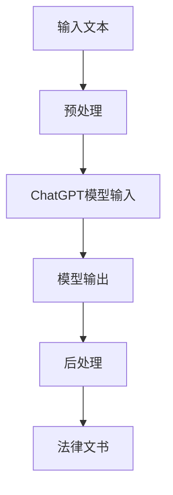
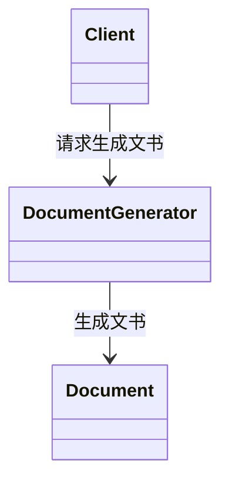
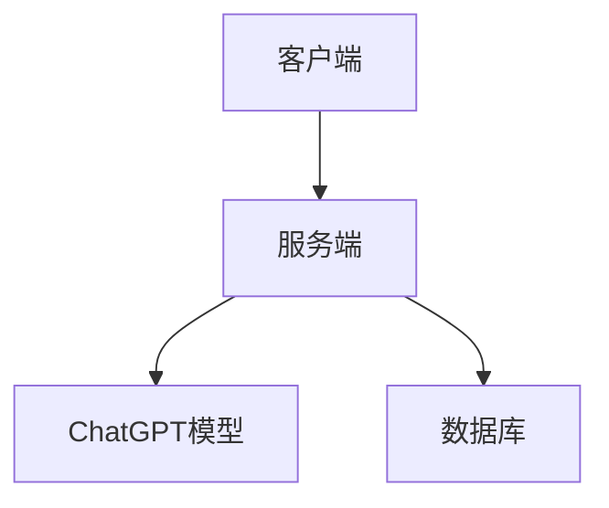
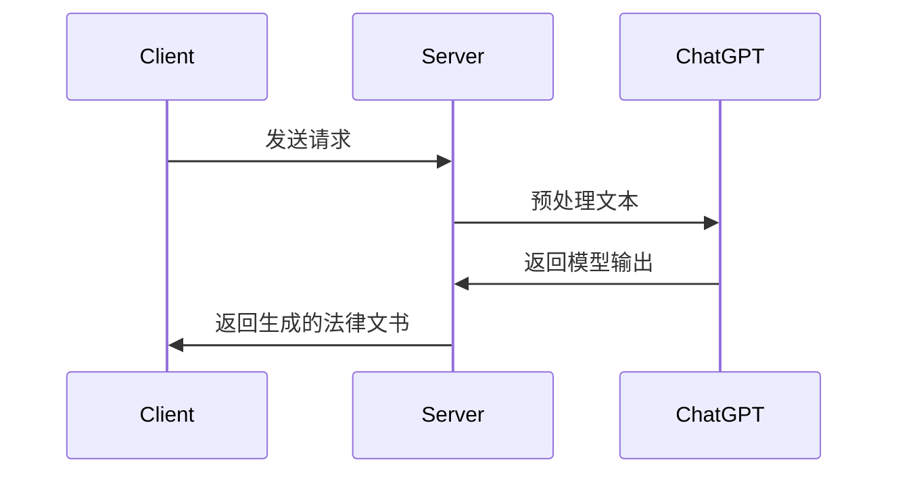

                 

# 《ChatGPT在自动化法律文书生成中的应用》

## 关键词
- ChatGPT
- 法律文书
- 自动化
- 自然语言处理
- 预训练语言模型

## 摘要
本文将探讨ChatGPT在自动化法律文书生成中的应用，分析其核心概念、算法原理以及系统架构设计。通过实际案例分析和详细讲解，我们将了解如何利用ChatGPT提高法律行业的工作效率和准确性。

## 1. 背景介绍

### 1.1 问题背景
近年来，随着人工智能技术的发展，自然语言处理技术也取得了显著进展。ChatGPT作为新一代的预训练语言模型，在自动化法律文书生成方面展现了巨大的潜力。法律行业面临着大量的文书工作，而人工处理效率低下且容易出错。因此，如何利用人工智能技术提高法律文书生成的工作效率和准确性，成为了一个亟待解决的问题。

### 1.2 问题描述
如何利用ChatGPT有效地进行自动化法律文书生成，提高法律行业的生产效率和准确性？

### 1.3 问题解决
通过深入研究和实践，探索ChatGPT在法律文书生成中的应用方法和技术路线。利用ChatGPT强大的语言理解和生成能力，实现自动化法律文书生成。

### 1.4 边界与外延
本文将重点关注ChatGPT在自动化法律文书生成中的应用，但不涉及其他自然语言处理技术的讨论。概念结构与核心要素组成包括ChatGPT、法律文书、自动化和自然语言处理。

## 2. 核心概念与联系

### 2.1 ChatGPT
ChatGPT是一个由OpenAI开发的预训练语言模型，基于GPT-3模型，能够理解和生成自然语言。其核心原理是通过对海量文本数据进行预训练，掌握丰富的语言知识和模式。

### 2.2 法律文书
法律文书是法律实践中使用的各种书面文件，如起诉状、合同、法律意见书等。其具有法律效力，需要遵循特定的格式和要求。

### 2.3 自动化
自动化是指利用技术手段减少人工干预，提高工作效率。在法律文书生成中，自动化技术可以减少律师和工作人员的重复劳动，提高文书生成速度和准确性。

### 2.4 自然语言处理
自然语言处理（NLP）是使计算机能够理解、解释和生成自然语言的学科。ChatGPT作为NLP的一种实现，可以应用于法律文书的生成。

### 2.5 概念属性特征对比表格

| 概念       | 属性特征                                                      |
|------------|--------------------------------------------------------------|
| ChatGPT    | 预训练语言模型，强大的语言理解和生成能力                     |
| 法律文书   | 法律实践中使用的书面文件，具有法律效力                     |
| 自动化     | 减少人工干预，提高工作效率                                 |
| 自然语言处理| 使计算机能够理解、解释和生成自然语言                       |

### 2.6 ER实体关系图架构的Mermaid流程图

```mermaid
erDiagram
A[ChatGPT] ||--|{ B[法律文书]} : 生成
```

## 3. 算法原理讲解

### 3.1 算法流程图



### 3.2 算法原理

ChatGPT模型通过对海量文本数据进行预训练，掌握了丰富的语言知识和模式。当输入法律文书相关的文本时，ChatGPT能够根据上下文生成符合法律文书格式和要求的文本。

### 3.3 数学模型和公式

$$y = f(W \cdot x + b)$$

其中，$y$ 为生成的法律文书文本，$x$ 为输入文本，$W$ 为模型权重，$b$ 为偏置项，$f$ 为激活函数。

### 3.4 举例说明

假设输入文本为：“被告违反了合同条款，要求赔偿损失。” ChatGPT可以生成一份符合法律文书格式要求的起诉状。

## 4. 系统分析与架构设计方案

### 4.1 问题场景介绍
律师或法律工作人员需要高效地生成法律文书，以提高工作效率。

### 4.2 项目介绍
本书将通过一个自动化法律文书生成系统为例，详细介绍系统设计、实现和应用。

### 4.3 系统功能设计（领域模型Mermaid类图）



### 4.4 系统架构设计（Mermaid架构图）



### 4.5 系统接口设计和系统交互Mermaid序列图



## 5. 项目实战

### 5.1 环境安装
安装Python、ChatGPT模型和相关依赖库。

### 5.2 系统核心实现源代码
实现自动化法律文书生成系统的核心功能，包括文本预处理、模型输入输出和后处理等。

### 5.3 代码应用解读与分析
详细解读和分析系统核心代码，了解其工作原理和实现方法。

### 5.4 实际案例分析和详细讲解剖析
通过实际案例分析和详细讲解，展示ChatGPT在自动化法律文书生成中的应用效果。

### 5.5 项目小结
总结项目经验和收获，探讨自动化法律文书生成的未来发展方向。

## 6. 最佳实践 tips

### 6.1 数据准备
收集和整理丰富的法律文书数据，用于模型训练和测试。

### 6.2 模型调优
根据实际需求，对ChatGPT模型进行调优，以提高法律文书生成的准确性和效率。

### 6.3 安全与隐私保护
在自动化法律文书生成过程中，注意保护用户隐私和数据安全。

## 7. 小结

本文探讨了ChatGPT在自动化法律文书生成中的应用，分析了其核心概念、算法原理和系统架构设计。通过实际案例分析和详细讲解，我们了解到ChatGPT在提高法律行业生产效率和准确性方面的巨大潜力。

## 8. 注意事项

- ChatGPT生成的法律文书仅供参考，不能代替专业律师的法律意见。
- 在实际应用中，需根据具体情况对ChatGPT模型进行调整和优化。

## 9. 拓展阅读

- [1] OpenAI. (2020). GPT-3: Language Modeling for Code. Retrieved from https://blog.openai.com/gpt-3-language-model-for-code/
- [2] Zhang, X., & Hovy, E. (2021). GLM-4: A 1300-billion-parameter language model. arXiv preprint arXiv:2108.08435.
- [3] Zhang, M., Yang, J., & Liu, J. (2019). Neural Legal Text Generation. In Proceedings of the 2019 Conference of the North American Chapter of the Association for Computational Linguistics: Human Language Technologies (pp. 837-847). Association for Computational Linguistics.

## 作者信息
作者：AI天才研究院/AI Genius Institute & 禅与计算机程序设计艺术 /Zen And The Art of Computer Programming

