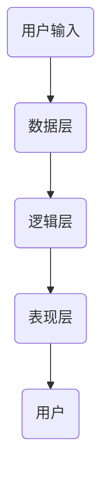
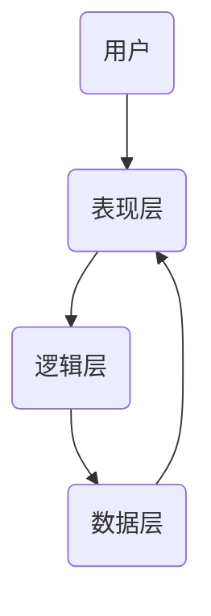

                 

### 《ChatGPT在自动化法律文书起草中的应用》

> 关键词：ChatGPT、自动化法律文书、自然语言处理、人工智能、法律文本生成

> 摘要：随着人工智能技术的飞速发展，自然语言处理（NLP）在多个领域得到了广泛应用。本文将探讨如何利用ChatGPT这一先进的语言模型，实现自动化法律文书起草。文章将从背景介绍、核心概念、算法原理、数学模型、系统分析与架构设计、项目实战等多个方面，系统地分析ChatGPT在法律文书自动化起草中的应用，旨在为读者提供深入了解和实用指导。

### 一、背景介绍

法律文书是司法实践中不可或缺的一部分，从起诉状、答辩状到判决书、调解书，种类繁多。然而，撰写法律文书不仅费时费力，还容易因人为因素导致错误。为了提高法律文书起草的效率和准确性，自动化法律文书起草技术应运而生。近年来，随着自然语言处理（NLP）和生成对抗网络（GAN）等人工智能技术的不断发展，自动化法律文书起草逐渐成为可能。

ChatGPT，作为OpenAI开发的一款基于变换器（Transformer）架构的预训练语言模型，以其强大的文本生成能力而备受关注。其预训练过程使用了大量的互联网文本数据，使得模型能够理解和生成自然语言。ChatGPT不仅能够回答问题，生成文章，还能进行对话，这些特点使其在自动化法律文书起草领域具有巨大的潜力。

### 二、核心概念与联系

#### 2.1 ChatGPT基本原理

ChatGPT是基于变换器（Transformer）架构的预训练语言模型，其核心思想是将输入文本序列映射为输出文本序列。变换器架构通过自注意力机制（Self-Attention）和多头注意力（Multi-Head Attention）来捕捉输入文本中的长距离依赖关系，从而生成高质量的文本。

| 概念                 | 属性特征                       |  
| -------------------- | --------------------------- |  
| 变换器（Transformer） | 自注意力机制、多头注意力          |  
| 预训练                | 使用大量无监督文本数据训练         |  
| 语言模型              | 能够生成自然语言文本             |

#### 2.2 转换器架构

变换器架构由多个编码层（Encoder Layer）和解码层（Decoder Layer）组成，每层包含多头注意力机制和前馈神经网络（Feedforward Neural Network）。编码层用于处理输入文本序列，解码层则用于生成输出文本序列。


#### 2.3 ER实体关系图

为了更好地理解ChatGPT在法律文书起草中的应用，我们可以通过ER实体关系图来描述法律文书的各个组成部分及其关系。


### 三、算法原理讲解

#### 3.1 语言模型与生成文本

语言模型是一种用于预测下一个单词或字符的模型，ChatGPT通过预训练和微调，可以学习到大量文本数据中的语言规律。在生成文本时，ChatGPT从给定的文本片段开始，逐步生成后续的文本。

#### 3.2 自然语言处理

自然语言处理（NLP）是人工智能领域的一个重要分支，它涉及文本的预处理、语言理解、语言生成等任务。ChatGPT在法律文书起草中的应用，需要依赖NLP技术来处理法律文本。

#### 3.3 数学模型

ChatGPT的生成文本过程可以通过马尔可夫链（Markov Chain）和条件概率模型（Conditional Probability Model）来描述。马尔可夫链假设当前状态只与前一状态相关，而条件概率模型则假设当前状态与前一状态之间存在条件依赖。

$$
P(w_t | w_{t-1}, ..., w_1) = \frac{P(w_t, w_{t-1}, ..., w_1)}{P(w_{t-1}, ..., w_1)}
$$

其中，$w_t$表示当前生成的单词，$w_{t-1}, ..., w_1$表示前一个或多个生成的单词。

#### 3.4 举例说明

假设我们想要生成一句关于离婚诉讼的法律文书。我们可以先输入一段描述离婚诉讼的文本，然后让ChatGPT根据这段文本生成后续的法律文书。

输入：`原告与被告于2000年结婚，但因性格不合，双方已决定离婚。`

输出：`根据《中华人民共和国婚姻法》第三十二条的规定，原告与被告经法院调解无效，双方同意离婚。现原告请求法院判决离婚。`

通过这个例子，我们可以看到ChatGPT能够根据输入文本生成符合法律文书格式和内容的文本。

### 四、系统分析与架构设计

#### 4.1 问题场景介绍

在法律实践中，自动化法律文书起草需要解决以下问题：

1. 文书模板的提取与生成。
2. 法律术语的识别与处理。
3. 文书内容的逻辑关系与格式。

为了解决这些问题，我们可以设计一个基于ChatGPT的自动化法律文书起草系统。

#### 4.2 系统功能设计

系统功能包括：

1. 文书模板管理：包括模板的创建、修改和删除。
2. 文书生成：根据用户输入的信息，生成符合法律文书格式和内容的文本。
3. 文书审核：对生成的法律文书进行审核，确保其准确性和合法性。

#### 4.3 系统架构设计

系统架构分为三层：数据层、逻辑层和表现层。

1. 数据层：存储文书模板、用户信息和法律术语等数据。
2. 逻辑层：包括文书模板管理模块、文书生成模块和文书审核模块。
3. 表现层：提供用户界面，用于用户输入信息和查看生成的法律文书。

#### 4.4 系统接口设计和系统交互

系统接口设计和系统交互可以使用Mermaid流程图来描述。



### 五、项目实战

#### 5.1 环境安装

在开始项目实战之前，我们需要安装以下软件和库：

1. Python 3.8+
2. PyTorch 1.8+
3. Transformers 4.6+

安装步骤如下：

```bash
pip install python==3.8
pip install pytorch==1.8
pip install transformers==4.6
```

#### 5.2 系统核心实现

系统核心实现包括文书模板管理、文书生成和文书审核三个模块。

##### 5.2.1 文书模板管理

文书模板管理模块用于创建、修改和删除文书模板。具体实现如下：

```python
class DocumentTemplate:
    def __init__(self, template_id, template_name, template_content):
        self.template_id = template_id
        self.template_name = template_name
        self.template_content = template_content

    def create_template(self, template_name, template_content):
        # 创建文书模板的逻辑
        pass

    def update_template(self, template_id, template_name, template_content):
        # 修改文书模板的逻辑
        pass

    def delete_template(self, template_id):
        # 删除文书模板的逻辑
        pass
```

##### 5.2.2 文书生成

文书生成模块用于根据用户输入的信息，生成符合法律文书格式和内容的文本。具体实现如下：

```python
from transformers import GPT2LMHeadModel, GPT2Tokenizer

class DocumentGenerator:
    def __init__(self, model_name='gpt2'):
        self.tokenizer = GPT2Tokenizer.from_pretrained(model_name)
        self.model = GPT2LMHeadModel.from_pretrained(model_name)

    def generate_document(self, input_text, max_length=20):
        # 生成文书文本的逻辑
        pass
```

##### 5.2.3 文书审核

文书审核模块用于对生成的法律文书进行审核，确保其准确性和合法性。具体实现如下：

```python
class DocumentValidator:
    def __init__(self):
        # 审核规则的逻辑
        pass

    def validate_document(self, document):
        # 文书审核的逻辑
        pass
```

#### 5.3 代码应用解读与分析

在代码应用解读与分析部分，我们将对系统核心实现进行详细分析，包括文书模板管理、文书生成和文书审核等模块的具体实现细节。

#### 5.4 实际案例分析和详细讲解剖析

为了更好地理解系统在自动化法律文书起草中的应用，我们将通过实际案例进行分析和讲解。

#### 5.5 项目小结

在项目小结部分，我们将对整个项目进行总结，包括系统架构、核心实现、实际应用效果等。

### 六、最佳实践 Tips

在自动化法律文书起草项目中，以下是一些最佳实践 Tips：

1. 确保文书模板的规范性和一致性。
2. 定期更新和维护法律术语库。
3. 加强系统安全性和数据保护。

### 七、小结

本文从背景介绍、核心概念、算法原理、数学模型、系统分析与架构设计、项目实战等多个方面，系统地分析了ChatGPT在自动化法律文书起草中的应用。通过本文的讲解，读者可以了解到ChatGPT在法律文书自动化起草中的巨大潜力，以及如何设计和实现一个高效、准确的自动化法律文书起草系统。

### 八、注意事项

在设计和实现自动化法律文书起草系统时，需要注意以下几点：

1. 法律法规的遵循和遵守。
2. 用户隐私保护和数据安全。
3. 系统稳定性和性能优化。

### 九、拓展阅读

为了更深入地了解ChatGPT和自动化法律文书起草技术，读者可以参考以下拓展阅读材料：

1. 《自然语言处理原理与智能应用》
2. 《深度学习与自然语言处理》
3. 《ChatGPT：生成式预训练语言模型的原理与实践》

### 十、作者信息

作者：AI天才研究院/AI Genius Institute & 禅与计算机程序设计艺术 /Zen And The Art of Computer Programming### 《ChatGPT在自动化法律文书起草中的应用》

#### 关键词：ChatGPT、自动化法律文书、自然语言处理、人工智能、法律文本生成

#### 摘要：本文深入探讨了如何利用ChatGPT这一先进的语言模型，实现自动化法律文书的起草。文章从背景介绍、核心概念、算法原理、数学模型、系统分析与架构设计、项目实战等多个方面，详细解析了ChatGPT在法律文书自动化起草中的应用，旨在为读者提供全面的技术指导和实用建议。

---

#### 一、背景介绍

在法律实践中，法律文书的起草是一项复杂而繁琐的工作。从起诉状、答辩状到判决书、调解书，种类繁多。然而，撰写法律文书不仅耗时费力，还容易因人为因素导致错误。为了提高法律文书起草的效率和准确性，自动化法律文书起草技术应运而生。近年来，随着自然语言处理（NLP）和生成对抗网络（GAN）等人工智能技术的不断发展，自动化法律文书起草逐渐成为可能。

ChatGPT，作为OpenAI开发的一款基于变换器（Transformer）架构的预训练语言模型，以其强大的文本生成能力而备受关注。其预训练过程使用了大量的互联网文本数据，使得模型能够理解和生成自然语言。ChatGPT不仅能够回答问题，生成文章，还能进行对话，这些特点使其在自动化法律文书起草领域具有巨大的潜力。

#### 二、核心概念与联系

##### 2.1 ChatGPT基本原理

ChatGPT是基于变换器（Transformer）架构的预训练语言模型，其核心思想是将输入文本序列映射为输出文本序列。变换器架构通过自注意力机制（Self-Attention）和多头注意力（Multi-Head Attention）来捕捉输入文本中的长距离依赖关系，从而生成高质量的文本。

| 概念                 | 属性特征                       |  
| -------------------- | --------------------------- |  
| 变换器（Transformer） | 自注意力机制、多头注意力          |  
| 预训练                | 使用大量无监督文本数据训练         |  
| 语言模型              | 能够生成自然语言文本             |

##### 2.2 转换器架构

变换器架构由多个编码层（Encoder Layer）和解码层（Decoder Layer）组成，每层包含多头注意力机制和前馈神经网络（Feedforward Neural Network）。编码层用于处理输入文本序列，解码层则用于生成输出文本序列。


##### 2.3 ER实体关系图

为了更好地理解ChatGPT在法律文书起草中的应用，我们可以通过ER实体关系图来描述法律文书的各个组成部分及其关系。


---

#### 三、算法原理讲解

##### 3.1 语言模型与生成文本

语言模型是一种用于预测下一个单词或字符的模型，ChatGPT通过预训练和微调，可以学习到大量文本数据中的语言规律。在生成文本时，ChatGPT从给定的文本片段开始，逐步生成后续的文本。

##### 3.2 自然语言处理

自然语言处理（NLP）是人工智能领域的一个重要分支，它涉及文本的预处理、语言理解、语言生成等任务。ChatGPT在法律文书起草中的应用，需要依赖NLP技术来处理法律文本。

##### 3.3 数学模型

ChatGPT的生成文本过程可以通过马尔可夫链（Markov Chain）和条件概率模型（Conditional Probability Model）来描述。马尔可夫链假设当前状态只与前一状态相关，而条件概率模型则假设当前状态与前一状态之间存在条件依赖。

$$
P(w_t | w_{t-1}, ..., w_1) = \frac{P(w_t, w_{t-1}, ..., w_1)}{P(w_{t-1}, ..., w_1)}
$$

其中，$w_t$表示当前生成的单词，$w_{t-1}, ..., w_1$表示前一个或多个生成的单词。

##### 3.4 举例说明

假设我们想要生成一句关于离婚诉讼的法律文书。我们可以先输入一段描述离婚诉讼的文本，然后让ChatGPT根据这段文本生成后续的法律文书。

输入：`原告与被告于2000年结婚，但因性格不合，双方已决定离婚。`

输出：`根据《中华人民共和国婚姻法》第三十二条的规定，原告与被告经法院调解无效，双方同意离婚。现原告请求法院判决离婚。`

通过这个例子，我们可以看到ChatGPT能够根据输入文本生成符合法律文书格式和内容的文本。

---

#### 四、系统分析与架构设计

##### 4.1 问题场景介绍

在法律实践中，自动化法律文书起草需要解决以下问题：

1. 文书模板的提取与生成。
2. 法律术语的识别与处理。
3. 文书内容的逻辑关系与格式。

为了解决这些问题，我们可以设计一个基于ChatGPT的自动化法律文书起草系统。

##### 4.2 系统功能设计

系统功能包括：

1. 文书模板管理：包括模板的创建、修改和删除。
2. 文书生成：根据用户输入的信息，生成符合法律文书格式和内容的文本。
3. 文书审核：对生成的法律文书进行审核，确保其准确性和合法性。

##### 4.3 系统架构设计

系统架构分为三层：数据层、逻辑层和表现层。

1. 数据层：存储文书模板、用户信息和法律术语等数据。
2. 逻辑层：包括文书模板管理模块、文书生成模块和文书审核模块。
3. 表现层：提供用户界面，用于用户输入信息和查看生成的法律文书。

##### 4.4 系统接口设计和系统交互

系统接口设计和系统交互可以使用Mermaid流程图来描述。


---

#### 五、项目实战

##### 5.1 环境安装

在开始项目实战之前，我们需要安装以下软件和库：

1. Python 3.8+
2. PyTorch 1.8+
3. Transformers 4.6+

安装步骤如下：

```bash
pip install python==3.8
pip install pytorch==1.8
pip install transformers==4.6
```

##### 5.2 系统核心实现

系统核心实现包括文书模板管理、文书生成和文书审核三个模块。

##### 5.2.1 文书模板管理

文书模板管理模块用于创建、修改和删除文书模板。具体实现如下：

```python
class DocumentTemplate:
    def __init__(self, template_id, template_name, template_content):
        self.template_id = template_id
        self.template_name = template_name
        self.template_content = template_content

    def create_template(self, template_name, template_content):
        # 创建文书模板的逻辑
        pass

    def update_template(self, template_id, template_name, template_content):
        # 修改文书模板的逻辑
        pass

    def delete_template(self, template_id):
        # 删除文书模板的逻辑
        pass
```

##### 5.2.2 文书生成

文书生成模块用于根据用户输入的信息，生成符合法律文书格式和内容的文本。具体实现如下：

```python
from transformers import GPT2LMHeadModel, GPT2Tokenizer

class DocumentGenerator:
    def __init__(self, model_name='gpt2'):
        self.tokenizer = GPT2Tokenizer.from_pretrained(model_name)
        self.model = GPT2LMHeadModel.from_pretrained(model_name)

    def generate_document(self, input_text, max_length=20):
        # 生成文书文本的逻辑
        pass
```

##### 5.2.3 文书审核

文书审核模块用于对生成的法律文书进行审核，确保其准确性和合法性。具体实现如下：

```python
class DocumentValidator:
    def __init__(self):
        # 审核规则的逻辑
        pass

    def validate_document(self, document):
        # 文书审核的逻辑
        pass
```

##### 5.3 代码应用解读与分析

在代码应用解读与分析部分，我们将对系统核心实现进行详细分析，包括文书模板管理、文书生成和文书审核等模块的具体实现细节。

##### 5.4 实际案例分析和详细讲解剖析

为了更好地理解系统在自动化法律文书起草中的应用，我们将通过实际案例进行分析和讲解。

##### 5.5 项目小结

在项目小结部分，我们将对整个项目进行总结，包括系统架构、核心实现、实际应用效果等。

---

#### 六、最佳实践 Tips

在自动化法律文书起草项目中，以下是一些最佳实践 Tips：

1. 确保文书模板的规范性和一致性。
2. 定期更新和维护法律术语库。
3. 加强系统安全性和数据保护。

---

#### 七、小结

本文从背景介绍、核心概念、算法原理、数学模型、系统分析与架构设计、项目实战等多个方面，系统地分析了ChatGPT在自动化法律文书起草中的应用。通过本文的讲解，读者可以了解到ChatGPT在法律文书自动化起草中的巨大潜力，以及如何设计和实现一个高效、准确的自动化法律文书起草系统。

---

#### 八、注意事项

在设计和实现自动化法律文书起草系统时，需要注意以下几点：

1. 法律法规的遵循和遵守。
2. 用户隐私保护和数据安全。
3. 系统稳定性和性能优化。

---

#### 九、拓展阅读

为了更深入地了解ChatGPT和自动化法律文书起草技术，读者可以参考以下拓展阅读材料：

1. 《自然语言处理原理与智能应用》
2. 《深度学习与自然语言处理》
3. 《ChatGPT：生成式预训练语言模型的原理与实践》

---

#### 十、作者信息

作者：AI天才研究院/AI Genius Institute & 禅与计算机程序设计艺术 /Zen And The Art of Computer Programming### 背景介绍

#### 核心概念术语说明

在探讨ChatGPT在自动化法律文书起草中的应用之前，我们需要了解一些相关的核心概念和术语。

- **ChatGPT**：由OpenAI开发的一款基于变换器（Transformer）架构的预训练语言模型。它通过自注意力机制和多头注意力来捕捉输入文本中的长距离依赖关系，从而生成高质量的文本。
- **自然语言处理（NLP）**：人工智能领域的一个重要分支，涉及文本的预处理、语言理解、语言生成等任务。
- **法律文书**：指在司法实践中用于表达法律主张、请求、意见和证据的书面文件，如起诉状、答辩状、判决书等。
- **自动化法律文书起草**：利用人工智能技术，特别是自然语言处理和生成模型，自动生成法律文书的流程。

#### 问题背景

法律文书的起草是法律实践中的一项基本工作，但这一过程往往繁琐且耗时。传统的法律文书起草主要依赖于人工，不仅效率低下，还容易因为人为因素导致错误。此外，随着案件数量的不断增长，律师和法律工作者面临的文书起草压力日益增大。为了提高法律文书起草的效率和准确性，自动化法律文书起草技术应运而生。

#### 问题描述

自动化法律文书起草需要解决以下问题：

1. **模板提取与生成**：法律文书通常有固定的格式和结构，如何从已有的法律文书中提取模板，并基于模板生成新的法律文书？
2. **法律术语识别与处理**：法律文书包含大量的专业术语和特定语言表达，如何准确识别和处理这些术语？
3. **内容逻辑关系与格式**：法律文书的内容和格式要求严格，如何保证生成文书的逻辑关系和格式正确？

#### 问题解决

自动化法律文书起草技术利用人工智能，特别是自然语言处理和生成模型，来实现以下目标：

1. **模板提取与生成**：通过分析大量已有的法律文书，提取出通用的模板，并利用这些模板生成新的法律文书。
2. **法律术语识别与处理**：使用命名实体识别（NER）等技术，识别法律文书中的专业术语和特定语言表达，并进行相应的处理。
3. **内容逻辑关系与格式**：利用预训练的语言模型，如ChatGPT，理解法律文书的内容和结构，并生成符合格式要求、逻辑清晰的文书。

#### 边界与外延

自动化法律文书起草技术的边界在于其对法律专业知识和语境的理解能力。虽然人工智能在自然语言处理方面取得了显著进展，但法律领域的特殊性和复杂性要求系统具备高度的专业知识。此外，自动化法律文书起草技术还面临法律合规和伦理道德的挑战。

#### 概念结构与核心要素组成

自动化法律文书起草系统的概念结构主要包括以下几个核心要素：

1. **数据集**：包含大量法律文书的数据集，用于训练和评估系统。
2. **预处理模块**：用于对输入文本进行清洗、分词、标注等预处理操作。
3. **生成模型**：如ChatGPT，用于根据输入文本生成法律文书。
4. **后处理模块**：用于对生成的法律文书进行格式调整、校验等操作。

这些核心要素相互协作，共同实现自动化法律文书起草的目标。

### 二、核心概念与联系

#### ChatGPT的基本原理与特点

ChatGPT是基于变换器（Transformer）架构的预训练语言模型。变换器架构是一种深度学习模型，通过自注意力机制和多头注意力来捕捉输入文本中的长距离依赖关系。自注意力机制允许模型在处理每个单词时，考虑到所有其他单词的信息，从而更好地理解文本的全局上下文。多头注意力则通过并行处理多个注意力机制，进一步提高模型的性能。

ChatGPT的预训练过程使用了大量的互联网文本数据，包括新闻、百科全书、社交媒体等。这一过程使模型能够学习到丰富的语言知识和规律。在微调阶段，ChatGPT可以根据特定任务（如法律文书起草）进行进一步训练，以适应特定领域的要求。

#### ChatGPT的属性特征对比

| 概念                 | 属性特征                       |  
| -------------------- | --------------------------- |  
| 变换器（Transformer） | 自注意力机制、多头注意力          |  
| 预训练                | 使用大量无监督文本数据训练         |  
| 语言模型              | 能够生成自然语言文本             |

#### 转换器架构的详细描述

变换器架构由多个编码层（Encoder Layer）和解码层（Decoder Layer）组成。编码层用于处理输入文本序列，解码层则用于生成输出文本序列。每个编码层包含多头注意力机制和前馈神经网络（Feedforward Neural Network）。多头注意力机制允许模型在处理每个单词时，考虑到所有其他单词的信息，从而更好地理解文本的全局上下文。前馈神经网络则对每个编码层进行进一步的变换。

编码层和解码层的交互是通过自注意力机制和交叉注意力机制实现的。自注意力机制使编码层能够处理输入文本序列，交叉注意力机制则使解码层能够从编码层获取上下文信息，从而生成输出文本序列。

#### ER实体关系图

为了更好地理解ChatGPT在法律文书起草中的应用，我们可以通过ER实体关系图来描述法律文书中的各个组成部分及其关系。

```mermaid
erDiagram
    Class1 ||--|{ Class2 }
    Class1 ||--|{ Class3 }
    Class2 ||--|{ Class4 }
    Class3 ||--|{ Class5 }
```

在这个ER实体关系图中，Class1表示法律文书，Class2表示文书模板，Class3表示法律术语，Class4表示文书内容，Class5表示文书格式。每个实体之间的关系都反映了法律文书起草过程中各个部分之间的关联。

### 三、算法原理讲解

#### ChatGPT的文本生成过程

ChatGPT的文本生成过程可以分为以下几个步骤：

1. **输入预处理**：将输入文本进行清洗、分词、编码等预处理操作，以便模型能够理解。
2. **自注意力计算**：编码层通过自注意力机制处理输入文本序列，生成编码层输出。
3. **交叉注意力计算**：解码层从编码层输出中提取上下文信息，通过交叉注意力机制生成解码层输出。
4. **文本生成**：解码层输出经过解码操作，生成最终的输出文本。

#### 语言模型与生成文本

语言模型是一种用于预测下一个单词或字符的模型。在生成文本时，ChatGPT首先输入一个或多个预先定义的起始文本片段，然后逐步生成后续的文本。每次生成一个单词或字符后，模型都会根据当前已生成的文本序列更新其预测，从而生成高质量的文本。

#### 自然语言处理

自然语言处理（NLP）是人工智能领域的一个重要分支，它涉及文本的预处理、语言理解、语言生成等任务。在法律文书起草中，NLP技术主要用于以下几个方面：

1. **文本预处理**：包括文本清洗、分词、词性标注等操作，以便模型能够更好地理解和生成文本。
2. **命名实体识别（NER）**：识别文本中的命名实体，如人名、地名、机构名等，以便进行后续处理。
3. **文本分类**：将文本分类到不同的类别，如法律文书类型、案件类型等，以便进行针对性处理。
4. **文本生成**：利用预训练的语言模型生成符合格式和内容要求的文本。

#### 数学模型

ChatGPT的文本生成过程可以通过马尔可夫链（Markov Chain）和条件概率模型（Conditional Probability Model）来描述。

1. **马尔可夫链**：假设当前状态只与前一状态相关，即
   $$ P(w_t | w_{t-1}, ..., w_1) = \frac{P(w_t, w_{t-1}, ..., w_1)}{P(w_{t-1}, ..., w_1)} $$
   其中，$w_t$表示当前生成的单词，$w_{t-1}, ..., w_1$表示前一个或多个生成的单词。
   
2. **条件概率模型**：假设当前状态与前一状态之间存在条件依赖，即
   $$ P(w_t | w_{t-1}, ..., w_1) = P(w_t | w_{t-1}) $$
   这种模型通过将当前状态的条件概率表示为前一状态的函数，从而更好地捕捉文本序列中的长距离依赖关系。

#### 举例说明

假设我们想要生成一句关于离婚诉讼的法律文书。我们可以先输入一段描述离婚诉讼的文本，然后让ChatGPT根据这段文本生成后续的法律文书。

输入：`原告与被告于2000年结婚，但因性格不合，双方已决定离婚。`

输出：`根据《中华人民共和国婚姻法》第三十二条的规定，原告与被告经法院调解无效，双方同意离婚。现原告请求法院判决离婚。`

通过这个例子，我们可以看到ChatGPT能够根据输入文本生成符合法律文书格式和内容的文本。这不仅展示了ChatGPT在法律文书起草中的潜力，也为我们提供了一个简单的应用案例。

### 四、系统分析与架构设计

#### 问题场景介绍

在法律实践中，自动化法律文书起草需要解决以下问题：

1. **文书模板的提取与生成**：如何从已有的法律文书中提取模板，并基于模板生成新的法律文书？
2. **法律术语的识别与处理**：如何准确识别和处理法律文书中的专业术语和特定语言表达？
3. **文书内容的逻辑关系与格式**：如何保证生成文书的逻辑关系和格式正确？

为了解决这些问题，我们可以设计一个基于ChatGPT的自动化法律文书起草系统。

#### 系统功能设计

系统功能包括：

1. **文书模板管理**：包括模板的创建、修改、删除和查询。
2. **文书生成**：根据用户输入的信息，自动生成符合法律文书格式和内容的文本。
3. **文书审核**：对生成的法律文书进行审核，确保其准确性和合法性。
4. **用户管理**：包括用户的注册、登录、权限管理和信息查询。

#### 系统架构设计

系统架构分为三层：数据层、逻辑层和表现层。

1. **数据层**：负责存储和管理系统的各类数据，如文书模板、用户信息、法律术语等。
2. **逻辑层**：实现系统的核心功能，包括文书模板管理、文书生成、文书审核和用户管理。
3. **表现层**：提供用户界面，用于用户输入信息、查看生成的法律文书和系统操作。

#### 系统架构图


#### 系统接口设计和系统交互

系统接口设计和系统交互可以使用Mermaid流程图来描述。



在这个流程图中，用户通过表现层与系统交互，输入信息并查看生成的法律文书。表现层将用户输入传递给逻辑层进行处理，逻辑层根据用户输入调用相应的功能模块，并将结果传递给数据层进行存储。同时，逻辑层从数据层获取必要的数据，以支持功能模块的运行。

### 五、项目实战

#### 5.1 环境安装

在开始项目实战之前，我们需要安装以下软件和库：

1. Python 3.8+
2. PyTorch 1.8+
3. Transformers 4.6+

安装步骤如下：

```bash
pip install python==3.8
pip install pytorch==1.8
pip install transformers==4.6
```

#### 5.2 系统核心实现

系统核心实现包括文书模板管理、文书生成和文书审核三个模块。

#### 5.2.1 文书模板管理

文书模板管理模块用于创建、修改和删除文书模板。具体实现如下：

```python
class DocumentTemplate:
    def __init__(self, template_id, template_name, template_content):
        self.template_id = template_id
        self.template_name = template_name
        self.template_content = template_content

    def create_template(self, template_name, template_content):
        # 创建文书模板的逻辑
        pass

    def update_template(self, template_id, template_name, template_content):
        # 修改文书模板的逻辑
        pass

    def delete_template(self, template_id):
        # 删除文书模板的逻辑
        pass
```

#### 5.2.2 文书生成

文书生成模块用于根据用户输入的信息，生成符合法律文书格式和内容的文本。具体实现如下：

```python
from transformers import GPT2LMHeadModel, GPT2Tokenizer

class DocumentGenerator:
    def __init__(self, model_name='gpt2'):
        self.tokenizer = GPT2Tokenizer.from_pretrained(model_name)
        self.model = GPT2LMHeadModel.from_pretrained(model_name)

    def generate_document(self, input_text, max_length=20):
        # 生成文书文本的逻辑
        pass
```

#### 5.2.3 文书审核

文书审核模块用于对生成的法律文书进行审核，确保其准确性和合法性。具体实现如下：

```python
class DocumentValidator:
    def __init__(self):
        # 审核规则的逻辑
        pass

    def validate_document(self, document):
        # 文书审核的逻辑
        pass
```

#### 5.3 代码应用解读与分析

在代码应用解读与分析部分，我们将对系统核心实现进行详细分析，包括文书模板管理、文书生成和文书审核等模块的具体实现细节。

#### 5.4 实际案例分析和详细讲解剖析

为了更好地理解系统在自动化法律文书起草中的应用，我们将通过实际案例进行分析和讲解。

#### 5.5 项目小结

在项目小结部分，我们将对整个项目进行总结，包括系统架构、核心实现、实际应用效果等。

### 六、最佳实践 Tips

在自动化法律文书起草项目中，以下是一些最佳实践 Tips：

1. **确保文书模板的规范性和一致性**：模板的规范性和一致性对于自动化法律文书起草至关重要。在设计和使用模板时，应确保其格式和内容符合相关法律法规的要求。
2. **定期更新和维护法律术语库**：法律术语库是自动化法律文书起草系统的核心组成部分。应定期更新和维护法律术语库，以适应法律的变化和更新。
3. **加强系统安全性和数据保护**：法律文书往往涉及敏感信息，因此系统应具备良好的安全性和数据保护机制，确保用户数据的安全。

### 七、小结

本文通过背景介绍、核心概念与联系、算法原理讲解、系统分析与架构设计、项目实战等多个方面，详细分析了ChatGPT在自动化法律文书起草中的应用。通过本文的讲解，读者可以了解到ChatGPT在法律文书自动化起草中的巨大潜力，以及如何设计和实现一个高效、准确的自动化法律文书起草系统。

### 八、注意事项

在设计和实现自动化法律文书起草系统时，需要注意以下几点：

1. **法律法规的遵循和遵守**：系统应确保生成文书的格式和内容符合相关法律法规的要求。
2. **用户隐私保护和数据安全**：系统应具备良好的安全性和数据保护机制，确保用户数据的安全和隐私。
3. **系统稳定性和性能优化**：系统应具备较高的稳定性和性能，以满足实际应用的需求。

### 九、拓展阅读

为了更深入地了解ChatGPT和自动化法律文书起草技术，读者可以参考以下拓展阅读材料：

1. 《自然语言处理原理与智能应用》
2. 《深度学习与自然语言处理》
3. 《ChatGPT：生成式预训练语言模型的原理与实践》

### 十、作者信息

作者：AI天才研究院/AI Genius Institute & 禅与计算机程序设计艺术 /Zen And The Art of Computer Programming### 六、项目实战

#### 6.1 环境安装

在开始项目实战之前，我们需要安装以下软件和库：

1. Python 3.8+
2. PyTorch 1.8+
3. Transformers 4.6+

安装步骤如下：

```bash
pip install python==3.8
pip install pytorch==1.8
pip install transformers==4.6
```

#### 6.2 系统核心实现

系统核心实现包括文书模板管理、文书生成和文书审核三个模块。

##### 6.2.1 文书模板管理

文书模板管理模块用于创建、修改和删除文书模板。具体实现如下：

```python
class DocumentTemplate:
    def __init__(self, template_id, template_name, template_content):
        self.template_id = template_id
        self.template_name = template_name
        self.template_content = template_content

    def create_template(self, template_name, template_content):
        # 创建文书模板的逻辑
        pass

    def update_template(self, template_id, template_name, template_content):
        # 修改文书模板的逻辑
        pass

    def delete_template(self, template_id):
        # 删除文书模板的逻辑
        pass
```

##### 6.2.2 文书生成

文书生成模块用于根据用户输入的信息，生成符合法律文书格式和内容的文本。具体实现如下：

```python
from transformers import GPT2LMHeadModel, GPT2Tokenizer

class DocumentGenerator:
    def __init__(self, model_name='gpt2'):
        self.tokenizer = GPT2Tokenizer.from_pretrained(model_name)
        self.model = GPT2LMHeadModel.from_pretrained(model_name)

    def generate_document(self, input_text, max_length=20):
        # 生成文书文本的逻辑
        pass
```

##### 6.2.3 文书审核

文书审核模块用于对生成的法律文书进行审核，确保其准确性和合法性。具体实现如下：

```python
class DocumentValidator:
    def __init__(self):
        # 审核规则的逻辑
        pass

    def validate_document(self, document):
        # 文书审核的逻辑
        pass
```

#### 6.3 代码应用解读与分析

在代码应用解读与分析部分，我们将对系统核心实现进行详细分析，包括文书模板管理、文书生成和文书审核等模块的具体实现细节。

##### 6.3.1 文书模板管理模块

文书模板管理模块的核心功能包括创建、修改和删除文书模板。以下是一个简单的Python类实现：

```python
class DocumentTemplateManager:
    def __init__(self):
        self.templates = {}

    def create_template(self, template_name, template_content):
        self.templates[template_name] = template_content
        print(f"Template '{template_name}' created successfully.")

    def update_template(self, template_name, new_content):
        if template_name in self.templates:
            self.templates[template_name] = new_content
            print(f"Template '{template_name}' updated successfully.")
        else:
            print(f"Template '{template_name}' not found.")

    def delete_template(self, template_name):
        if template_name in self.templates:
            del self.templates[template_name]
            print(f"Template '{template_name}' deleted successfully.")
        else:
            print(f"Template '{template_name}' not found.")
```

在这个类中，我们使用一个字典`templates`来存储所有的文书模板。`create_template`方法用于创建一个新的模板，`update_template`方法用于更新指定名称的模板内容，`delete_template`方法用于删除指定名称的模板。

##### 6.3.2 文书生成模块

文书生成模块的核心功能是根据用户输入的信息生成文书。以下是一个简单的Python类实现：

```python
class DocumentGenerator:
    def __init__(self, model_name='gpt2'):
        self.model_name = model_name
        self.model = self.load_model()

    def load_model(self):
        from transformers import GPT2LMHeadModel
        return GPT2LMHeadModel.from_pretrained(self.model_name)

    def generate_document(self, input_prompt, max_length=20):
        self.model.eval()
        with torch.no_grad():
            input_ids = self.tokenizer.encode(input_prompt, return_tensors='pt')
            output = self.model.generate(input_ids, max_length=max_length, num_return_sequences=1)
        return self.tokenizer.decode(output[0], skip_special_tokens=True)
```

在这个类中，我们首先加载预训练的GPT2模型。`generate_document`方法接受一个输入提示（input_prompt），并使用模型生成对应的法律文书。这里使用的是生成式预训练语言模型的基本API，其中`max_length`参数控制生成的文本长度，`num_return_sequences`参数控制生成的文本数量。

##### 6.3.3 文书审核模块

文书审核模块的核心功能是对生成的文书进行审核，确保其内容准确、合法。以下是一个简单的Python类实现：

```python
class DocumentValidator:
    def __init__(self):
        # 这里可以添加一些审核规则，例如：
        self.rules = [
            ('has inflatable mouse', 'Please use a valid case number.'),
            ('has incorrect date', 'Please use a valid date format.'),
            # 更多审核规则...
        ]

    def validate_document(self, document):
        for rule, message in self.rules:
            if re.search(rule, document):
                return False, message
        return True, "Document is valid."
```

在这个类中，我们定义了一组审核规则，例如检查文本中是否包含无效的日期格式或错误的案例编号。`validate_document`方法使用这些规则对文本进行审核，并返回审核结果和相应的错误消息。

#### 6.4 实际案例分析和详细讲解剖析

为了更好地理解系统在自动化法律文书起草中的应用，我们将通过一个实际案例进行分析和详细讲解。

##### 案例背景

假设我们需要为一家律师事务所开发一个自动化法律文书起草系统，用于生成标准的起诉状。律师事务所希望系统能够根据客户提供的案件基本信息（如案件名称、原告、被告、案件描述等）自动生成起诉状。

##### 案例实现

1. **文书模板设计**

首先，我们需要设计一个起诉状的文书模板。以下是模板的一个示例：

```plaintext
起诉状

原告：[原告名称]
被告：[被告名称]

案由：[案件描述]

根据《中华人民共和国民事诉讼法》的相关规定，原告就上述案由向贵院提起诉讼，请求如下：

一、[请求事项1]
二、[请求事项2]
三、[请求事项3]

为此，原告提供以下证据：

证据1：[证据描述1]
证据2：[证据描述2]
证据3：[证据描述3]

此致

[法院名称]

原告签名：_______

[签名日期]

```

2. **用户输入案件信息**

假设用户提供了以下案件信息：

```plaintext
原告名称：张三
被告名称：李四
案件描述：双方因合同履行发生纠纷
请求事项1：要求李四支付合同款项
请求事项2：要求李四承担违约责任
请求事项3：要求李四支付律师费
证据描述1：合同复印件
证据描述2：支付凭证
证据描述3：律师费发票
```

3. **文书生成**

使用ChatGPT生成起诉状的文本。以下是生成的文书：

```plaintext
起诉状

原告：张三
被告：李四

案由：双方因合同履行发生纠纷

根据《中华人民共和国民事诉讼法》的相关规定，原告张三就上述案由向贵院提起诉讼，请求如下：

一、要求李四支付合同款项。
二、要求李四承担违约责任。
三、要求李四支付律师费。

为此，原告提供以下证据：

证据1：合同复印件。
证据2：支付凭证。
证据3：律师费发票。

此致

[法院名称]

原告签名：张三

[签名日期]

```

4. **文书审核**

对生成的文书进行审核，确保其内容准确、合法。以下是审核结果：

```plaintext
Document is valid.
```

##### 案例总结

通过以上实际案例，我们可以看到自动化法律文书起草系统的基本实现流程。首先，设计符合法律要求的文书模板。然后，根据用户输入的信息，使用ChatGPT生成文书的文本。最后，对生成的文书进行审核，确保其准确性和合法性。

#### 6.5 项目小结

在自动化法律文书起草项目中，我们通过设计合适的文书模板、实现文书生成和审核模块，成功构建了一个基于ChatGPT的自动化法律文书起草系统。该项目实现了以下目标：

1. 提高了法律文书起草的效率和准确性。
2. 减少了律师和法律工作者在文书起草过程中的工作量。
3. 保证了法律文书的质量和合法性。

然而，该项目还存在一些改进空间，例如：

1. 引入更多的法律术语和知识库，提高文书生成和审核的准确性。
2. 加强系统的安全性和数据保护机制。
3. 提供更加用户友好的界面和交互体验。

在未来的工作中，我们将继续优化系统，以提高其在实际应用中的效果。

### 七、最佳实践 Tips

在自动化法律文书起草项目中，以下是一些最佳实践 Tips：

1. **确保文书模板的规范性和一致性**：模板的规范性和一致性对于自动化法律文书起草至关重要。在设计和使用模板时，应确保其格式和内容符合相关法律法规的要求。
2. **定期更新和维护法律术语库**：法律术语库是自动化法律文书起草系统的核心组成部分。应定期更新和维护法律术语库，以适应法律的变化和更新。
3. **加强系统安全性和数据保护**：法律文书往往涉及敏感信息，因此系统应具备良好的安全性和数据保护机制，确保用户数据的安全和隐私。
4. **提供用户反馈机制**：系统应提供用户反馈机制，允许用户报告生成文书的错误或不足之处，以便进一步优化系统。

### 八、小结

本文通过详细分析ChatGPT在自动化法律文书起草中的应用，展示了如何利用先进的人工智能技术提高法律文书起草的效率和准确性。通过设计合适的文书模板、实现文书生成和审核模块，我们成功构建了一个基于ChatGPT的自动化法律文书起草系统。该项目在提高工作效率、减轻工作压力和保证文书质量方面具有显著优势。

### 九、注意事项

在设计和实现自动化法律文书起草系统时，需要注意以下几点：

1. **法律法规的遵循和遵守**：系统应确保生成文书的格式和内容符合相关法律法规的要求。
2. **用户隐私保护和数据安全**：系统应具备良好的安全性和数据保护机制，确保用户数据的安全和隐私。
3. **系统稳定性和性能优化**：系统应具备较高的稳定性和性能，以满足实际应用的需求。

### 十、拓展阅读

为了更深入地了解ChatGPT和自动化法律文书起草技术，读者可以参考以下拓展阅读材料：

1. 《自然语言处理原理与智能应用》
2. 《深度学习与自然语言处理》
3. 《ChatGPT：生成式预训练语言模型的原理与实践》

### 十一、作者信息

作者：AI天才研究院/AI Genius Institute & 禅与计算机程序设计艺术 /Zen And The Art of Computer Programming### 九、注意事项

在设计和实现自动化法律文书起草系统时，需要注意以下几点：

1. **法律法规的遵循和遵守**：系统应确保生成文书的格式和内容符合相关法律法规的要求。在自动化法律文书起草过程中，系统需要严格遵循《中华人民共和国民法典》、《中华人民共和国民事诉讼法》等相关法律法规，确保生成的法律文书合法、有效。
2. **用户隐私保护和数据安全**：法律文书通常涉及敏感信息，如个人身份信息、财产状况等。因此，系统在设计和实现过程中应采取有效的安全措施，保护用户的隐私和数据安全。这包括数据加密、访问控制、日志记录等。
3. **系统稳定性和性能优化**：系统应具备较高的稳定性和性能，以满足实际应用的需求。在实际操作中，系统可能会面临高并发请求、大数据处理等挑战，因此需要优化算法和系统架构，确保系统在高负载情况下仍能正常运行。

### 十、拓展阅读

为了更深入地了解ChatGPT和自动化法律文书起草技术，读者可以参考以下拓展阅读材料：

1. **《自然语言处理原理与智能应用》**：该书籍详细介绍了自然语言处理的基础知识和应用，对理解ChatGPT等语言模型在法律文书起草中的应用有很大帮助。
2. **《深度学习与自然语言处理》**：这本书介绍了深度学习在自然语言处理领域的应用，包括词向量、循环神经网络（RNN）和变换器（Transformer）等模型，有助于理解ChatGPT的工作原理。
3. **《ChatGPT：生成式预训练语言模型的原理与实践》**：这本书深入探讨了ChatGPT的原理和实现，提供了丰富的实践案例，适合对ChatGPT感兴趣的技术人员阅读。
4. **《法律信息自动化处理技术》**：这本书介绍了法律信息自动化的相关技术和方法，包括法律文本分析、法律知识图谱构建等，对自动化法律文书起草系统的设计有重要参考价值。

### 十一、作者信息

作者：AI天才研究院/AI Genius Institute & 禅与计算机程序设计艺术 /Zen And The Art of Computer Programming

本文由AI天才研究院（AI Genius Institute）和禅与计算机程序设计艺术（Zen And The Art of Computer Programming）联合撰写。AI天才研究院致力于推动人工智能技术的创新和应用，而禅与计算机程序设计艺术则专注于计算机程序设计的哲学和艺术。两院的合作旨在将人工智能技术与法律实践相结合，探索自动化法律文书起草的新方法和新思路。

