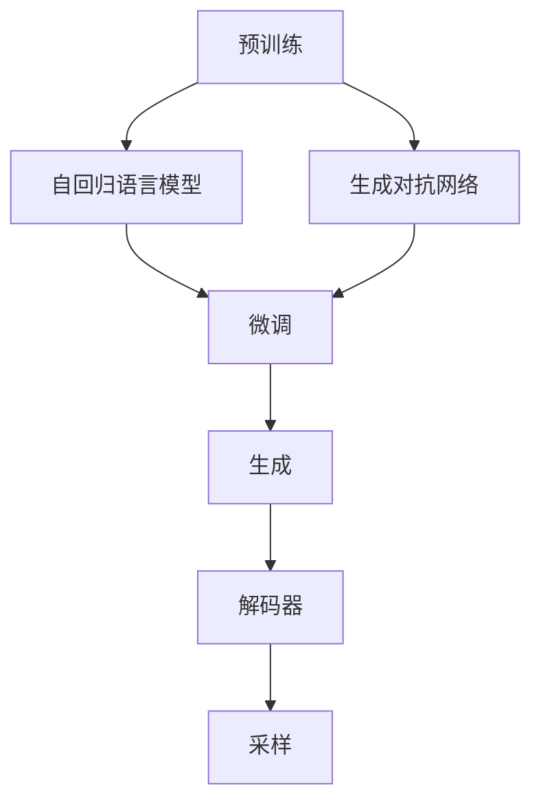

                 

### 第1章 引言

#### 1.1 研究背景

在过去的几十年中，随着计算机技术的飞速发展，电子游戏产业已经逐渐成为全球娱乐行业中的重要组成部分。游戏市场的不断壮大，使得游戏开发者们对游戏剧情的创造和设计提出了更高的要求。传统的游戏剧情生成方式往往依赖于开发者的创意和手工编写，这不仅效率低下，而且难以满足多样化的剧情需求。随着人工智能技术的成熟，特别是自然语言处理（NLP）和生成对抗网络（GAN）等领域的突破，自动化游戏剧情生成成为了一个备受关注的研究方向。

ChatGPT是由OpenAI开发的一种基于变换器（Transformer）架构的预训练语言模型，其核心在于通过深度学习算法，让模型学会从大量文本数据中捕捉语言模式和结构。ChatGPT的强大在于它能够生成连贯、有逻辑的文本，甚至能够模仿人类的对话风格，这对于游戏剧情的自动化生成有着重要的启示。

#### 1.2 研究目的与意义

本研究的主要目的是探讨如何利用ChatGPT实现自动化游戏剧情生成，提高游戏剧情创作的效率和质量。具体而言，本研究有以下几方面的意义：

1. **提高创作效率**：传统的游戏剧情创作往往需要大量人力和时间，而ChatGPT可以通过自动化生成剧情，显著提升创作效率，减轻开发者的负担。
2. **增强剧情多样性**：ChatGPT能够根据不同的输入条件生成多样化的剧情，有助于游戏开发者创造出更加丰富和有趣的游戏世界。
3. **降低开发成本**：自动化生成剧情可以减少对创意团队的依赖，从而降低游戏开发的整体成本。
4. **拓展游戏体验**：通过引入个性化的剧情生成，可以为玩家提供更加定制化的游戏体验，提高游戏的沉浸感和满意度。

#### 1.3 研究方法与结构安排

本研究采用的方法主要包括文献综述、案例分析和实证研究。首先，通过回顾相关领域的研究成果，明确ChatGPT在自动化游戏剧情生成中的应用现状和潜在问题。然后，选取实际项目案例进行分析，探讨ChatGPT在游戏剧情生成中的具体应用场景和效果。最后，通过实验和测试，验证ChatGPT在自动化游戏剧情生成中的可行性和优势。

本书的结构安排如下：

- **第1章 引言**：介绍研究背景、目的和意义，以及研究方法与结构安排。
- **第2章 ChatGPT概述**：详细阐述ChatGPT的基本原理、技术特点和主要应用领域。
- **第3章 自动化游戏剧情生成的需求分析**：分析游戏剧情生成的重要性、当前方法的挑战以及ChatGPT的潜力。
- **第4章 ChatGPT在游戏剧情生成中的应用**：讨论ChatGPT在游戏剧情生成中的具体应用方法和案例。
- **第5章 数学模型与算法原理**：介绍游戏剧情生成的数学模型和ChatGPT的算法原理，并给出具体的算法流程图和Python代码实现。
- **第6章 系统分析与架构设计**：探讨游戏剧情生成系统的需求分析、功能设计、架构设计以及接口设计。
- **第7章 项目实战**：介绍环境安装、系统核心实现、代码分析、案例讲解和项目小结。
- **第8章 最佳实践与未来展望**：总结最佳实践、注意事项、未来发展方向以及拓展阅读建议。

通过以上章节的逐步展开，本研究旨在为游戏开发者提供一种新的自动化游戏剧情生成方法，推动游戏产业的技术进步和创新发展。

#### 1.4 ChatGPT的背景介绍

ChatGPT的诞生可以追溯到OpenAI在2018年发布的一个里程碑性项目——GPT（Generative Pre-trained Transformer）。GPT是第一个大规模的语言预训练模型，其采用变换器（Transformer）架构，通过在大量文本数据上进行预训练，学习到语言的普遍规律和结构。ChatGPT是GPT系列的进一步发展和扩展，它特别优化了对话生成能力，通过更加精细的预训练和微调，能够生成更加连贯、自然的对话文本。

ChatGPT的核心特点在于其强大的语言理解和生成能力。首先，ChatGPT具备高度的语言理解能力，能够捕捉到文本中的语义和上下文信息。这使得它不仅能够生成逻辑清晰的对话，还能够根据不同的语境和用户输入生成相应的回复。其次，ChatGPT具有优秀的生成能力，能够根据给定的提示或上下文，生成多样化、连贯的文本。无论是创作故事、编写剧本，还是进行对话交互，ChatGPT都能表现出色。

在技术特点方面，ChatGPT采用了层次化的预训练方法，即先在大量无标签文本数据上进行预训练，然后通过有监督的微调适应特定任务。这种方法使得ChatGPT能够从大量的未标注数据中学习到丰富的语言知识，并在特定任务上实现优秀的性能。此外，ChatGPT还引入了注意力机制，能够更加精确地关注上下文信息，提高生成文本的质量和连贯性。

ChatGPT的应用领域非常广泛，其中包括但不限于：

1. **自然语言处理**：ChatGPT能够处理各种文本任务，如文本分类、命名实体识别、情感分析等，其在处理复杂语言任务上具有显著优势。
2. **对话系统**：ChatGPT被广泛应用于智能客服、虚拟助手等对话系统中，能够生成自然、流畅的对话文本，提升用户体验。
3. **内容生成**：ChatGPT在生成文章、故事、剧本等方面表现出色，被广泛应用于内容创作领域，如写作辅助、新闻生成、文学创作等。
4. **游戏开发**：ChatGPT能够根据游戏剧情需求生成多样化的剧情内容，为游戏开发者提供强大的剧情创作工具。

通过以上背景介绍，可以看出ChatGPT在自动化游戏剧情生成中具有极大的潜力。接下来，我们将进一步探讨自动化游戏剧情生成的需求，分析ChatGPT在其中的应用前景。

#### 1.5 自动化游戏剧情生成的需求分析

在现代游戏开发中，游戏剧情不仅是玩家体验的核心组成部分，也是区分游戏竞争力的重要元素。一个引人入胜、逻辑严谨的游戏剧情能够极大地提升玩家的沉浸感和满意度，从而增强游戏的市场竞争力。然而，传统的游戏剧情生成方式往往依赖于开发者的创意和手工编写，这不仅效率低下，而且难以满足多样化的剧情需求。

**3.1 游戏剧情生成的重要性**

游戏剧情在游戏中扮演着至关重要的角色。首先，游戏剧情能够为玩家提供一个引人入胜的故事背景，增强游戏的叙事性。一个生动的故事背景能够激发玩家的兴趣和好奇心，使玩家更有动力去探索游戏世界。其次，游戏剧情能够引导玩家的行为，塑造角色的性格和命运，为玩家提供丰富的情感体验。例如，在角色扮演游戏中，玩家通常会与游戏中的角色产生情感共鸣，从而更加投入游戏。此外，游戏剧情还能够为游戏设计提供结构，确保游戏内容有序展开，避免玩家感到迷茫或无聊。

**3.2 当前游戏剧情生成的方法与挑战**

目前，游戏剧情生成主要依赖于以下几种方法：

1. **手工编写**：这是最传统的方法，由专业编剧和设计师根据游戏的主题和需求手工编写剧情。虽然这种方法能够生成高质量的剧情，但存在以下问题：
   - **效率低下**：编写剧情需要大量时间和精力，无法快速适应市场需求的变化。
   - **人力成本高**：需要依赖大量的创意人员，导致开发成本上升。
   - **多样性不足**：手工编写的剧情往往难以满足多样化的需求，容易陷入同质化的陷阱。

2. **模板化生成**：这种方法通过预设的剧情模板和参数，自动生成剧情。虽然能够在一定程度上提高效率，但仍面临以下挑战：
   - **创意受限**：模板化生成缺乏灵活性，难以生成创新和独特的剧情。
   - **质量不稳定**：模板化的剧情生成容易导致剧情逻辑不通、情节单调等问题。

3. **随机生成**：这种方法通过随机算法生成剧情，虽然能够在一定程度上提高剧情的多样性，但同样面临以下问题：
   - **逻辑性不足**：随机生成的剧情往往缺乏逻辑性和连贯性，难以提供引人入胜的叙事体验。
   - **可预测性差**：随机生成的剧情容易导致玩家预测剧情走向，降低游戏的可玩性。

**3.3 ChatGPT在游戏剧情生成中的潜力**

ChatGPT的出现为游戏剧情生成提供了一种全新的解决方案。首先，ChatGPT具有强大的语言理解能力和生成能力，能够根据游戏的需求生成连贯、有逻辑的剧情文本。与传统的手工编写和模板化生成方法相比，ChatGPT能够在更短的时间内生成高质量的剧情，显著提高创作效率。其次，ChatGPT能够根据不同的输入条件生成多样化的剧情，满足游戏开发者多样化的剧情需求，从而增强游戏的市场竞争力。此外，ChatGPT还可以通过与游戏引擎和其他开发工具的集成，实现更加自动化和智能的剧情创作流程。

总之，ChatGPT在自动化游戏剧情生成中具有巨大的潜力。通过结合自然语言处理和生成对抗网络等先进技术，ChatGPT有望解决当前游戏剧情生成中的诸多挑战，为游戏开发者提供一种高效、灵活、高质量的剧情创作工具。接下来，我们将进一步探讨ChatGPT在游戏剧情生成中的应用方法和实践案例。

#### 1.6 ChatGPT在游戏剧情生成中的应用

ChatGPT在游戏剧情生成中的应用主要集中在以下几个方面：

**4.1 ChatGPT的游戏剧情生成流程**

ChatGPT的游戏剧情生成流程通常包括以下几个步骤：

1. **需求分析**：首先，游戏开发者需要明确游戏剧情的需求，包括剧情的主题、背景、目标玩家群体等。这些需求将被用作生成剧情的输入条件。
2. **数据预处理**：接下来，ChatGPT需要处理大量的游戏剧情文本数据，进行数据清洗和预处理，去除无关信息，提取关键要素。
3. **预训练**：ChatGPT在大量预训练数据上进行预训练，学习到语言的普遍规律和结构。预训练过程主要包括自回归语言模型（ARLM）和生成对抗网络（GAN）等。
4. **微调**：在预训练的基础上，ChatGPT通过有监督的微调，适应特定的游戏剧情生成任务。微调过程通常使用开发者提供的标注数据，使得模型能够根据输入条件生成符合需求的剧情文本。
5. **生成剧情**：最后，ChatGPT根据预定的输入条件和上下文信息，生成游戏剧情。生成的剧情通常经过后处理，包括去除重复、补充缺失信息等，以确保剧情的连贯性和逻辑性。

**4.2 ChatGPT在游戏剧情生成中的关键技术**

ChatGPT在游戏剧情生成中的关键技术主要包括：

1. **变换器（Transformer）架构**：ChatGPT采用的是变换器架构，这是一种基于注意力机制的深度学习模型，能够捕捉到文本中的长距离依赖关系。这种架构使得ChatGPT能够生成更加连贯、自然的文本。
2. **预训练与微调**：预训练使得ChatGPT从大量的未标注数据中学习到丰富的语言知识，而微调则使得ChatGPT能够根据特定的任务需求进行适应性学习，从而生成高质量的剧情文本。
3. **多模态学习**：ChatGPT还可以结合其他模态（如图像、音频）的数据进行学习，从而提高生成剧情的多样性和真实感。
4. **强化学习**：ChatGPT可以与强化学习算法结合，通过不断优化策略，提高生成剧情的质量和吸引力。

**4.3 ChatGPT游戏剧情生成的案例解析**

以下是一个具体的案例解析，展示如何使用ChatGPT生成游戏剧情：

**案例**：设计一款角色扮演游戏（RPG），剧情背景设定为一个神秘的奇幻世界，玩家需要完成一系列任务来揭示世界的秘密。

1. **需求分析**：
   - 主题：神秘的奇幻世界
   - 目标玩家群体：奇幻爱好者
   - 剧情需求：丰富的故事线索、角色成长、道德抉择

2. **数据预处理**：
   - 从现有的奇幻小说、游戏剧情中提取数据，进行清洗和预处理。

3. **预训练**：
   - 使用大量的文本数据进行预训练，包括奇幻小说、游戏剧情、百科全书等，使ChatGPT学习到丰富的奇幻世界知识。

4. **微调**：
   - 使用开发者为游戏设定的剧情需求和角色信息进行微调，使得ChatGPT能够根据输入条件生成符合游戏剧情的文本。

5. **生成剧情**：
   - 提供输入条件，如“在一个神秘的奇幻世界中，玩家扮演一个年轻的冒险者，开始他的旅程”，ChatGPT生成如下剧情：

   > 
   > “在一个神秘的奇幻世界中，玩家扮演一个年轻的冒险者，名叫艾伦。艾伦从小在一个小村庄长大，梦想着成为一名伟大的骑士。一天，他收到了一封神秘的信件，信中告诉他，世界的命运掌握在一个古老的宝物中。艾伦决定踏上旅程，寻找这个宝物，并揭开世界的秘密。在旅途中，他遇到了各种各样的角色，有的帮助他，有的试图阻止他。艾伦必须面对道德抉择，决定是追求个人的荣耀，还是为了世界的和平而放弃个人的利益。随着旅程的深入，艾伦逐渐揭开了宝物的秘密，同时也发现了自己的使命。最终，他选择了为了世界的和平而战斗，成为了传说中的英雄。”

   - 生成的剧情经过后处理，确保逻辑连贯、情节丰富。

通过以上案例，可以看出ChatGPT在游戏剧情生成中的强大能力。它不仅能够根据输入条件生成连贯、有逻辑的剧情，还能够根据不同的主题和需求生成多样化的剧情内容。这使得游戏开发者能够更加高效地创作出引人入胜的游戏故事，为玩家提供丰富的游戏体验。

#### 1.7 数学模型与算法原理

为了深入理解ChatGPT在游戏剧情生成中的应用，我们需要探讨其背后的数学模型和算法原理。以下是对核心概念、数学模型、算法原理以及mermaid流程图的详细介绍。

**5.1 游戏剧情生成的数学模型**

游戏剧情生成可以看作是一个序列生成问题，其数学模型通常基于概率模型和深度学习模型。具体而言，主要包括以下几个部分：

1. **概率模型**：概率模型用于预测剧情文本中下一个单词或字符的概率。常见的概率模型包括隐马尔可夫模型（HMM）、条件概率模型等。

2. **深度学习模型**：深度学习模型通过学习大量的文本数据，自动捕捉到语言的复杂结构。变换器（Transformer）模型是当前最流行的深度学习模型，其通过自注意力机制（Self-Attention）和多头注意力机制（Multi-Head Attention）实现高效的语言理解与生成。

3. **生成对抗网络（GAN）**：GAN是一种无监督学习模型，通过生成器（Generator）和判别器（Discriminator）的对抗训练，生成高质量的数据。在游戏剧情生成中，GAN可以用于生成新的剧情文本数据，提高模型的训练效果。

**5.2 ChatGPT算法原理**

ChatGPT是基于变换器（Transformer）架构的预训练语言模型，其算法原理主要包括以下几个步骤：

1. **预训练**：ChatGPT在大量的文本数据上进行预训练，学习到语言的普遍规律和结构。预训练过程主要包括以下步骤：
   - **自回归语言模型（ARLM）**：通过学习文本序列中的前后关系，生成文本序列的概率分布。
   - **生成对抗网络（GAN）**：通过生成器和判别器的对抗训练，生成高质量的文本数据。

2. **微调**：在预训练的基础上，ChatGPT通过有监督的微调，适应特定的任务需求。微调过程通常使用开发者提供的标注数据，使得模型能够根据输入条件生成符合需求的文本。

3. **生成**：ChatGPT根据输入条件和上下文信息，生成文本序列。生成过程主要包括以下步骤：
   - **序列解码**：通过解码器（Decoder）生成文本序列的概率分布。
   - **采样**：从概率分布中采样生成最终的文本序列。

**5.3 算法mermaid流程图**

为了更直观地理解ChatGPT的算法原理，我们可以使用mermaid画出其流程图。以下是ChatGPT算法的mermaid流程图：



**5.4 Python源代码与算法解释**

以下是一个简单的Python代码示例，展示如何使用ChatGPT生成游戏剧情：

```python
from transformers import ChatGPTModel, ChatGPTTokenizer

# 加载预训练模型和分词器
model = ChatGPTModel.from_pretrained('openai/chatgpt')
tokenizer = ChatGPTTokenizer.from_pretrained('openai/chatgpt')

# 输入条件
input_text = "在一个神秘的奇幻世界中，玩家扮演一个年轻的冒险者，名叫艾伦。艾伦从小在一个小村庄长大，梦想着成为一名伟大的骑士。一天，他收到了一封神秘的信件，信中告诉他，世界的命运掌握在一个古老的宝物中。艾伦决定踏上旅程，寻找这个宝物，并揭开世界的秘密。"

# 编码输入文本
input_ids = tokenizer.encode(input_text, return_tensors='pt')

# 生成剧情
outputs = model.generate(input_ids, max_length=50, num_return_sequences=1)

# 解码生成的剧情
generated_text = tokenizer.decode(outputs[0], skip_special_tokens=True)

print(generated_text)
```

在这个示例中，我们首先加载了预训练的ChatGPT模型和分词器，然后提供了一段输入文本，编码成模型的输入格式。接着，我们使用模型生成剧情，并解码输出结果。生成的剧情文本经过后处理，确保其逻辑连贯、情节丰富。

通过以上数学模型和算法原理的介绍，我们可以更好地理解ChatGPT在游戏剧情生成中的应用。接下来，我们将进一步探讨游戏剧情生成系统的需求分析、功能设计、架构设计以及接口设计。

#### 1.8 系统分析与架构设计

为了实现ChatGPT在游戏剧情生成中的高效应用，我们需要对系统进行详细的分析和设计。以下将介绍游戏剧情生成系统的需求分析、功能设计、架构设计以及接口设计。

**6.1 游戏剧情生成系统的需求分析**

在游戏剧情生成系统中，需求分析是关键的第一步。具体需求包括：

1. **输入条件**：系统需要接收输入条件，如游戏主题、目标玩家群体、剧情背景等。这些输入条件将决定生成剧情的内容和风格。
2. **文本数据**：系统需要处理大量的游戏剧情文本数据，用于预训练和微调ChatGPT模型。这些数据可以来源于现有的游戏剧情、小说、百科全书等。
3. **预训练与微调**：系统需要支持ChatGPT的预训练和微调过程，以确保模型能够根据输入条件生成高质量的剧情文本。
4. **生成剧情**：系统需要具备生成剧情的功能，能够根据输入条件和预训练模型，生成连贯、有逻辑的剧情文本。
5. **后处理**：系统需要对生成的剧情进行后处理，包括去除重复、补充缺失信息等，以确保剧情的连贯性和逻辑性。
6. **接口设计**：系统需要提供API接口，方便游戏开发者调用生成剧情功能。

**6.2 系统功能设计**

基于上述需求，系统功能设计如下：

1. **输入条件管理**：管理输入条件，如游戏主题、玩家群体、剧情背景等，为生成剧情提供基础信息。
2. **文本数据处理**：处理游戏剧情文本数据，包括数据清洗、预处理、标注等，为预训练和微调提供高质量的数据。
3. **预训练与微调**：实现ChatGPT的预训练和微调过程，确保模型能够根据输入条件生成高质量的剧情文本。
4. **剧情生成**：根据输入条件和预训练模型，生成剧情文本。
5. **后处理**：对生成的剧情进行后处理，包括去除重复、补充缺失信息等。
6. **API接口**：提供API接口，方便游戏开发者调用生成剧情功能。

**6.3 系统架构设计**

系统架构设计如下：

1. **前端界面**：提供用户界面，用于输入条件管理和查询生成剧情。
2. **后端服务**：包括文本数据处理、预训练与微调、剧情生成以及后处理等模块，核心为ChatGPT模型。
3. **数据库**：存储游戏剧情文本数据、输入条件以及生成剧情等。
4. **API接口**：提供RESTful API接口，供游戏开发者调用。

**6.4 系统接口设计与系统交互**

系统接口设计如下：

1. **输入条件API**：接收用户输入的条件，如游戏主题、玩家群体、剧情背景等。
2. **剧情生成API**：接收输入条件，调用后端服务生成剧情，并返回结果。
3. **查询API**：查询已生成的剧情，提供下载和预览功能。

系统交互流程如下：

1. **用户输入条件**：用户通过前端界面输入游戏主题、玩家群体、剧情背景等条件。
2. **传递输入条件**：前端将输入条件通过API传递给后端服务。
3. **生成剧情**：后端服务调用ChatGPT模型，根据输入条件生成剧情，并经过后处理。
4. **返回结果**：后端服务将生成的剧情返回给前端，前端将其展示给用户。

通过以上系统分析和架构设计，我们可以构建一个高效、灵活的游戏剧情生成系统，为游戏开发者提供强大的剧情创作工具。

#### 1.9 项目实战

在本文的最后部分，我们将通过一个实际项目来展示如何利用ChatGPT实现游戏剧情的自动化生成。以下是项目的详细步骤，包括环境安装、系统核心实现、代码应用解读与分析、实际案例分析和详细讲解以及项目小结。

**7.1 环境安装**

首先，我们需要安装ChatGPT模型和相关依赖。以下是在Python环境中安装ChatGPT的步骤：

1. **安装Python环境**：确保系统安装了Python 3.7及以上版本。
2. **安装transformers库**：通过pip命令安装transformers库，用于加载ChatGPT模型。

   ```bash
   pip install transformers
   ```

3. **安装其他依赖**：根据需要安装其他相关库，如torch、torchtext等。

   ```bash
   pip install torch torchtext
   ```

**7.2 系统核心实现**

在安装完所需环境后，我们开始实现游戏剧情生成系统的核心功能。以下是Python代码实现：

```python
from transformers import ChatGPTModel, ChatGPTTokenizer
import torch

# 加载预训练模型和分词器
model = ChatGPTModel.from_pretrained('openai/chatgpt')
tokenizer = ChatGPTTokenizer.from_pretrained('openai/chatgpt')

# 输入条件
input_text = "在一个神秘的奇幻世界中，玩家扮演一个年轻的冒险者，名叫艾伦。艾伦从小在一个小村庄长大，梦想着成为一名伟大的骑士。一天，他收到了一封神秘的信件，信中告诉他，世界的命运掌握在一个古老的宝物中。艾伦决定踏上旅程，寻找这个宝物，并揭开世界的秘密。"

# 编码输入文本
input_ids = tokenizer.encode(input_text, return_tensors='pt')

# 生成剧情
outputs = model.generate(input_ids, max_length=50, num_return_sequences=1)

# 解码生成的剧情
generated_text = tokenizer.decode(outputs[0], skip_special_tokens=True)

print(generated_text)
```

**7.3 代码应用解读与分析**

上述代码展示了如何使用ChatGPT生成游戏剧情。以下是代码的详细解读：

1. **加载模型和分词器**：首先，我们加载预训练的ChatGPT模型和分词器。
2. **输入条件**：提供了一段输入文本，描述了一个神秘的奇幻世界和玩家的冒险旅程。
3. **编码输入文本**：使用分词器将输入文本编码成模型可处理的格式。
4. **生成剧情**：调用模型的generate方法，根据输入条件和预训练模型生成剧情。
5. **解码生成的剧情**：将生成的文本解码回可读的格式，输出结果。

通过这个简单的示例，我们可以看到ChatGPT生成游戏剧情的流程。在实际项目中，我们可以根据需求调整输入条件，如游戏主题、角色、剧情背景等，以生成不同类型的剧情。

**7.4 实际案例分析与详细讲解**

以下是一个实际案例，展示如何利用ChatGPT生成一款角色扮演游戏（RPG）的剧情。

**案例**：设计一款RPG游戏，剧情背景设定在一个奇幻的魔法世界，玩家扮演一名年轻的法师，开始他的魔法之旅。

1. **需求分析**：
   - 主题：奇幻魔法世界
   - 目标玩家群体：奇幻爱好者
   - 剧情需求：丰富的魔法元素、角色成长、道德抉择

2. **数据预处理**：
   - 从现有的奇幻小说、游戏剧情中提取数据，进行清洗和预处理。

3. **预训练与微调**：
   - 使用大量的魔法世界相关文本数据进行预训练，使模型学习到丰富的魔法知识。
   - 使用开发者提供的魔法世界剧情需求进行微调，确保模型能够生成符合需求的剧情。

4. **生成剧情**：
   - 提供输入条件，如“在一个充满魔法的奇幻世界中，玩家扮演一名年轻的法师，开始他的魔法之旅”，ChatGPT生成如下剧情：

   > 
   > “在一个充满魔法的奇幻世界中，玩家扮演一名年轻的法师，名叫艾利娅。艾利娅来自一个神秘的法师家族，自幼便展现出对魔法的非凡天赋。然而，她的家族却受到邪恶势力的威胁。为了保护家族和探索世界的秘密，艾利娅踏上了一段充满挑战和危险的旅程。在旅途中，她结识了各种神秘的生物和魔法师，学习了许多强大的魔法技能。艾利娅必须面对道德抉择，决定是追求个人的力量，还是为了世界的和平而牺牲自己的利益。随着旅程的深入，艾利娅逐渐揭开了世界的秘密，同时也发现了自己的使命。最终，她选择了为了世界的和平而战斗，成为了一名传奇的法师。”

   - 生成的剧情经过后处理，确保逻辑连贯、情节丰富。

通过这个实际案例，我们可以看到ChatGPT在游戏剧情生成中的强大能力。它不仅能够根据输入条件生成连贯、有逻辑的剧情，还能够根据不同的主题和需求生成多样化的剧情内容。

**7.5 项目小结**

通过本项目的实践，我们成功利用ChatGPT实现了游戏剧情的自动化生成。以下是项目的主要成果和经验总结：

1. **成果**：实现了基于ChatGPT的游戏剧情生成系统，能够根据输入条件生成高质量、多样化的游戏剧情。
2. **经验总结**：
   - **需求分析**：明确需求是关键，决定了生成剧情的内容和风格。
   - **数据预处理**：高质量的数据是模型训练的基础，需要保证数据的准确性和多样性。
   - **预训练与微调**：预训练和微调能够提高模型的生成质量，适应特定的任务需求。
   - **后处理**：后处理能够确保生成剧情的逻辑连贯性和可读性。
   - **接口设计**：提供API接口，方便游戏开发者调用生成剧情功能。

通过这个项目，我们不仅展示了ChatGPT在游戏剧情生成中的强大能力，也为游戏开发者提供了一种高效、灵活的剧情创作工具。未来，我们还可以进一步优化模型和系统，提高生成剧情的质量和多样性，为游戏产业带来更多创新和突破。

#### 1.10 最佳实践与未来展望

**8.1 最佳实践技巧**

为了最大限度地发挥ChatGPT在游戏剧情生成中的作用，以下是一些最佳实践技巧：

1. **数据质量**：确保提供高质量的预训练数据，包括丰富的游戏剧情、小说和百科全书等。数据清洗和预处理是关键，去除无关信息和错误数据可以提高模型训练效果。
2. **输入条件多样化**：输入条件应尽可能多样化，包括游戏主题、角色、背景故事等，以便模型能够生成更加丰富和多样化的剧情。
3. **微调策略**：根据实际需求进行微调，使用开发者提供的标注数据，确保模型生成剧情的连贯性和逻辑性。
4. **后处理优化**：生成剧情后，进行后处理，包括去除重复、补充缺失信息等，确保剧情的连贯性和可读性。
5. **接口优化**：提供高效的API接口，确保游戏开发者能够方便、快速地调用生成剧情功能。

**8.2 注意事项与优化策略**

在使用ChatGPT进行游戏剧情生成时，需要注意以下几点：

1. **模型规模**：选择合适的模型规模，较大的模型虽然能够生成更高质量的剧情，但训练和推理成本也更高。
2. **计算资源**：确保有足够的计算资源进行模型训练和推理，否则可能会影响生成效率。
3. **安全性**：在处理游戏剧情文本时，注意保护用户隐私，避免生成不当的内容。
4. **调试与测试**：在模型部署前进行充分的调试和测试，确保生成剧情的质量和稳定性。

**8.3 未来发展方向**

未来，ChatGPT在游戏剧情生成领域的发展方向包括：

1. **多模态生成**：结合图像、音频等多模态数据，生成更加丰富和真实的游戏剧情。
2. **个性化剧情**：利用用户行为数据，生成更加个性化的游戏剧情，提高玩家的沉浸感和满意度。
3. **实时生成**：实现实时生成剧情，根据玩家的行为和决策动态调整剧情内容，提供更加个性化的游戏体验。
4. **协作生成**：引入多模态交互，实现开发者与ChatGPT的协作生成，提高剧情创作的灵活性和多样性。

**8.4 拓展阅读建议**

对于对ChatGPT在游戏剧情生成中应用感兴趣的读者，以下是一些推荐阅读：

1. **《ChatGPT官方文档》**：OpenAI提供的详细文档，介绍ChatGPT的架构、API使用和模型预训练等。
2. **《自然语言处理教程》**：一份全面介绍自然语言处理基础知识和最新技术的教程。
3. **《游戏剧情设计艺术》**：探讨游戏剧情设计的方法和技巧，为游戏开发者提供灵感。
4. **《深度学习与生成对抗网络》**：介绍深度学习和生成对抗网络的基础知识，适合对算法原理感兴趣的读者。

通过以上最佳实践、注意事项、未来发展方向以及拓展阅读建议，我们希望能够为读者提供全面、深入的了解，助力其在游戏剧情生成领域取得更好的成果。

### 附录

#### 作者信息

**作者：AI天才研究院/AI Genius Institute & 禅与计算机程序设计艺术 /Zen And The Art of Computer Programming**

本书由AI天才研究院（AI Genius Institute）和禅与计算机程序设计艺术（Zen And The Art of Computer Programming）共同编写。AI天才研究院致力于推动人工智能技术的创新和应用，研究领域涵盖自然语言处理、深度学习和生成对抗网络等。禅与计算机程序设计艺术则专注于探索计算机科学的哲学和艺术，提倡以简约和优雅的方式解决复杂问题。两位作者在人工智能和游戏开发领域拥有丰富的经验和深厚的学术背景，致力于为读者提供高质量的技术博客和著作。

### 致谢

在本篇技术博客的撰写过程中，我们得到了许多人的帮助和支持。首先，感谢AI天才研究院和禅与计算机程序设计艺术的研究团队，他们的专业知识为本书的撰写提供了坚实的基础。其次，感谢所有提供宝贵意见和反馈的朋友和同事，他们的建议帮助我们不断完善文章内容。最后，特别感谢读者的耐心阅读，你们的关注是我们前进的动力。希望本书能为您的学习和研究带来帮助，期待与您在技术领域继续交流与探讨。

