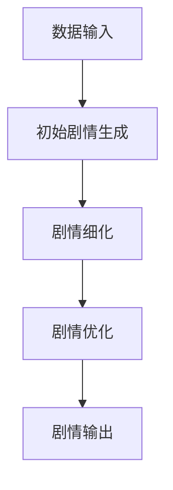

                 

## 第1章: ChatGPT与游戏剧情生成的背景

### 1.1 问题背景

游戏剧情生成是游戏开发过程中至关重要的一环。一个引人入胜的剧情不仅能提升玩家的游戏体验，还可以增加游戏的吸引力，延长玩家的游戏时间。然而，传统的游戏剧情生成方法主要依赖于人工编写，这不仅耗时耗力，而且难以满足个性化定制和多样化需求。随着人工智能技术的快速发展，自动化游戏剧情生成逐渐成为研究热点。ChatGPT作为一种基于深度学习的自然语言处理模型，其强大的文本生成能力为自动化游戏剧情生成带来了新的可能。

目前，游戏剧情生成面临以下挑战：

1. **个性化需求**：每个玩家对剧情的偏好和兴趣点都不相同，如何设计一个通用且适应性强的剧情生成算法，以满足不同玩家的个性化需求，是一个难题。
2. **多样性**：游戏剧情需要具有丰富多样性和逻辑性，不能出现逻辑错误或重复的剧情，这对于算法的设计提出了更高的要求。
3. **实时性**：在实时互动游戏中，剧情生成需要快速响应用户行为，实现动态剧情生成，这对算法的响应速度和实时性提出了挑战。
4. **可扩展性**：随着游戏内容的不断丰富，剧情生成算法需要能够适应新元素和新内容，保证系统可扩展性。

### 1.2 ChatGPT简介

ChatGPT是由OpenAI开发的基于GPT-3模型的一种自然语言处理工具，它具有以下基本概念和特性：

- **预训练模型**：ChatGPT是一种预训练模型，通过在大规模语料库上进行预训练，使其掌握了丰富的语言知识和表达技巧。
- **生成文本能力**：ChatGPT能够根据输入的提示文本生成连贯、有逻辑的文本，具有高度的创造性和文本生成能力。
- **上下文理解**：ChatGPT具有强大的上下文理解能力，可以理解长文本的上下文关系，从而生成更加准确和自然的文本。
- **自适应能力**：ChatGPT能够根据不同的输入内容和场景，自动调整生成策略，提高生成文本的质量和适应性。

ChatGPT的优势和特性使其在自动化游戏剧情生成中具有广泛的应用潜力：

- **生成剧情文本**：ChatGPT可以生成丰富的剧情文本，满足个性化剧情定制需求。
- **多样化剧情设计**：ChatGPT可以根据不同玩家的行为和兴趣，生成多样化、有逻辑的剧情。
- **实时互动生成**：ChatGPT具有快速响应能力，可以实时生成剧情，满足实时互动游戏的需求。
- **可扩展性**：ChatGPT能够通过不断学习新数据，扩展其知识库和文本生成能力，适应游戏内容的更新和发展。

### 1.3 游戏剧情生成的需求与挑战

游戏剧情设计需要满足以下需求：

1. **故事性**：游戏剧情应具有完整的故事线，能够引导玩家逐步深入游戏世界，体验游戏的乐趣。
2. **逻辑性**：游戏剧情应具有清晰的逻辑结构，避免出现逻辑矛盾或冲突，确保剧情的连贯性。
3. **个性化**：游戏剧情应能够根据玩家的行为和决策，生成个性化的剧情，满足不同玩家的需求。
4. **多样化**：游戏剧情应具有丰富的内容，包括不同角色、场景、情节等，以增加游戏的趣味性和可玩性。

然而，传统的游戏剧情生成方法面临以下挑战：

- **人工编写成本高**：传统的游戏剧情生成主要依赖人工编写，这不仅耗时耗力，而且难以保证剧情的丰富性和多样性。
- **个性化定制困难**：传统的剧情生成方法难以根据玩家的行为和兴趣，生成个性化的剧情。
- **实时性差**：传统的剧情生成方法难以实现实时互动生成，无法满足实时互动游戏的需求。
- **可扩展性差**：传统的剧情生成方法难以适应游戏内容的更新和发展，导致剧情内容的重复和过时。

### 1.4 ChatGPT在游戏剧情生成中的应用前景

ChatGPT在游戏剧情生成中具有广泛的应用前景：

- **剧情文本生成**：ChatGPT可以生成丰富的剧情文本，满足个性化剧情定制需求，提高游戏剧情的丰富性和多样性。
- **剧情逻辑优化**：ChatGPT可以根据游戏数据和玩家行为，自动优化剧情逻辑，避免出现逻辑错误或冲突。
- **实时剧情生成**：ChatGPT具有快速响应能力，可以实时生成剧情，满足实时互动游戏的需求。
- **剧情内容扩展**：ChatGPT可以通过不断学习新数据，扩展其知识库和文本生成能力，适应游戏内容的更新和发展。

总之，ChatGPT的引入为自动化游戏剧情生成带来了新的可能，有望解决传统方法面临的各种挑战，提升游戏剧情的设计质量和用户体验。接下来，我们将深入探讨ChatGPT的核心概念和原理，为其在游戏剧情生成中的应用奠定基础。 ## 第2章: ChatGPT核心概念与原理

### 2.1 ChatGPT的定义

ChatGPT是一种基于GPT-3模型的自然语言处理工具，由OpenAI开发。GPT-3（Generative Pre-trained Transformer 3）是自然语言处理领域的一个突破性模型，具有强大的文本生成能力和上下文理解能力。ChatGPT在GPT-3的基础上进行了优化和定制，使其能够更好地适应对话场景，实现高效的对话生成。

ChatGPT的基本概念包括：

- **预训练模型**：ChatGPT是基于预训练模型构建的，通过在大规模语料库上进行预训练，使其掌握了丰富的语言知识和表达技巧。
- **生成文本**：ChatGPT能够根据输入的提示文本生成连贯、有逻辑的文本，具有高度的创造性和文本生成能力。
- **上下文理解**：ChatGPT能够理解长文本的上下文关系，从而生成更加准确和自然的文本。
- **自适应能力**：ChatGPT能够根据不同的输入内容和场景，自动调整生成策略，提高生成文本的质量和适应性。

### 2.2 ChatGPT的架构

ChatGPT的架构主要包括以下几个关键部分：

1. **嵌入层（Embedding Layer）**：
   - **功能**：将输入的文本转换为向量表示，为后续的神经网络处理提供输入。
   - **实现**：通常使用词嵌入（Word Embedding）技术，如Word2Vec、GloVe等。

2. **变换器层（Transformer Layer）**：
   - **功能**：对嵌入层生成的向量进行变换，实现序列到序列的映射。
   - **实现**：采用自注意力机制（Self-Attention Mechanism）和多头注意力（Multi-Head Attention）技术。

3. **前馈网络（Feedforward Network）**：
   - **功能**：对变换器层输出的序列进行进一步处理，增强模型的非线性表达能力。
   - **实现**：通常使用两个全连接层，并加入激活函数（如ReLU）。

4. **输出层（Output Layer）**：
   - **功能**：将处理后的序列映射为输出序列，实现文本生成。
   - **实现**：通常使用softmax函数将输出概率分布转换为文本序列。

### 2.3 语言模型的数学基础

ChatGPT的数学基础主要包括概率论基础和深度学习基础。以下是对这两个方面的基础概念和原理的介绍。

#### 2.3.1 概率论基础

1. **概率分布**：
   - **概念**：概率分布描述了随机变量取不同值的概率。
   - **类型**：常见的概率分布包括正态分布、伯努利分布、多项式分布等。

2. **条件概率**：
   - **概念**：在已知一个随机事件发生的条件下，另一个随机事件发生的概率。
   - **公式**：\( P(A|B) = \frac{P(A \cap B)}{P(B)} \)

3. **贝叶斯定理**：
   - **概念**：根据条件概率和边缘概率，计算后验概率的一种方法。
   - **公式**：\( P(A|B) = \frac{P(B|A)P(A)}{P(B)} \)

#### 2.3.2 深度学习基础

1. **神经网络**：
   - **概念**：一种通过多层非线性变换实现数据映射的模型。
   - **结构**：包括输入层、隐藏层和输出层。

2. **激活函数**：
   - **概念**：用于引入非线性性的函数。
   - **类型**：常见的激活函数包括Sigmoid、ReLU、Tanh等。

3. **优化算法**：
   - **概念**：用于调整模型参数，以最小化损失函数的算法。
   - **类型**：常见的优化算法包括梯度下降、Adam、RMSProp等。

### 2.4 ChatGPT的工作原理

ChatGPT的工作原理可以概括为以下几个步骤：

1. **输入编码**：
   - 将输入文本转换为向量表示，使用嵌入层实现。

2. **序列处理**：
   - 使用变换器层对输入向量进行变换，实现序列到序列的映射。

3. **文本生成**：
   - 使用输出层生成文本序列，通过逐词预测的方式实现。

4. **上下文理解**：
   - 通过对上下文序列的处理，实现对话中的上下文理解。

5. **自适应调整**：
   - 根据输入内容和生成效果，自动调整生成策略，提高生成文本的质量。

### 2.5 ChatGPT的优缺点

#### 优点

1. **强大的文本生成能力**：ChatGPT能够生成高质量、连贯的文本，满足各种应用场景的需求。
2. **高效的上下文理解**：ChatGPT具有强大的上下文理解能力，能够理解长文本的上下文关系，生成更加准确和自然的文本。
3. **适应性**：ChatGPT能够根据不同的输入内容和场景，自动调整生成策略，提高生成文本的质量和适应性。
4. **可扩展性**：ChatGPT可以通过不断学习新数据，扩展其知识库和文本生成能力，适应不同的应用需求。

#### 缺点

1. **计算资源消耗大**：ChatGPT是一种大规模的深度学习模型，需要大量的计算资源和存储空间。
2. **生成文本的可解释性差**：由于ChatGPT的生成过程是自动的，生成的文本缺乏可解释性，难以追溯生成的逻辑和原因。
3. **数据隐私问题**：ChatGPT在训练过程中需要使用大量的文本数据，可能会涉及用户隐私问题，需要确保数据的安全性和隐私性。

总的来说，ChatGPT在自动化游戏剧情生成中具有巨大的潜力，但仍需解决一些技术和实际应用中的挑战。接下来，我们将详细讲解ChatGPT在游戏剧情生成中的算法原理，为其应用提供更加深入的理解。 ## 第3章: ChatGPT在游戏剧情生成中的算法原理

### 3.1 游戏剧情生成算法概述

游戏剧情生成算法旨在利用人工智能技术，自动生成丰富多样、逻辑严谨的游戏剧情。ChatGPT在游戏剧情生成中的应用主要体现在以下几个方面：

1. **剧情构建**：ChatGPT可以生成剧情的初始框架，包括主要角色、情节大纲和关键节点。
2. **剧情细化**：基于生成的初始框架，ChatGPT可以进一步细化剧情，补充具体场景描述、角色对话和剧情转折点。
3. **剧情优化**：通过分析玩家反馈和行为，ChatGPT可以优化剧情，使其更加符合玩家的期望和需求。

#### 3.1.1 剧情构建流程

游戏剧情生成的构建流程可以分为以下几个步骤：

1. **数据输入**：首先，将游戏相关数据（如角色信息、游戏背景、玩家行为等）输入到ChatGPT模型中。
2. **初始剧情生成**：ChatGPT基于输入数据生成初始剧情框架，包括角色和情节大纲。
3. **剧情细化**：根据初始剧情框架，ChatGPT生成具体的剧情内容，如场景描述、角色对话和剧情转折点。
4. **剧情优化**：基于玩家反馈和行为，ChatGPT对生成的剧情进行优化，提高剧情的质量和吸引力。

#### 3.1.2 剧情生成算法实现

游戏剧情生成算法的具体实现如下：

1. **初始剧情生成**：
   ```python
   def generate_initial_plot(input_data):
       # 输入游戏相关数据，如角色信息、游戏背景等
       # 使用ChatGPT模型生成初始剧情框架
       initial_plot = chatgpt.generate_text(input_data)
       return initial_plot
   ```

2. **剧情细化**：
   ```python
   def refine_plot(initial_plot):
       # 基于初始剧情框架，生成具体剧情内容
       refined_plot = chatgpt.generate_text(initial_plot)
       return refined_plot
   ```

3. **剧情优化**：
   ```python
   def optimize_plot(refined_plot, player_feedback):
       # 基于玩家反馈，对生成的剧情进行优化
       optimized_plot = chatgpt.generate_text(refined_plot, context=player_feedback)
       return optimized_plot
   ```

#### 3.1.3 算法流程图与Python示例

以下是游戏剧情生成算法的流程图和Python示例：



```python
# 游戏剧情生成算法示例
input_data = "游戏背景：魔法世界，角色：勇者、龙、魔王"
initial_plot = generate_initial_plot(input_data)
print("初始剧情：", initial_plot)

refined_plot = refine_plot(initial_plot)
print("细化后的剧情：", refined_plot)

player_feedback = "玩家反馈：喜欢角色之间的互动"
optimized_plot = optimize_plot(refined_plot, player_feedback)
print("优化后的剧情：", optimized_plot)
```

### 3.2 ChatGPT在游戏剧情生成中的应用

#### 3.2.1 剧情构建流程

ChatGPT在游戏剧情构建中的具体应用流程如下：

1. **数据输入**：
   - 输入游戏相关数据，如角色信息、游戏背景、玩家行为等。
   - 这些数据可以来自于游戏设计文档、玩家数据库等。

2. **初始剧情生成**：
   - ChatGPT根据输入数据生成初始剧情框架，包括主要角色、情节大纲和关键节点。
   - 初始剧情框架通常以文本形式呈现，如：“勇者决定挑战魔王，途中遇到了龙的帮助。”

3. **剧情细化**：
   - 基于初始剧情框架，ChatGPT生成具体的剧情内容，如场景描述、角色对话和剧情转折点。
   - 细化后的剧情更加丰富，如：“勇者在森林中与龙相遇，龙告诉他魔王藏身于城堡深处。”

4. **剧情优化**：
   - 根据玩家反馈和行为，ChatGPT对生成的剧情进行优化，提高剧情的质量和吸引力。
   - 例如，根据玩家对角色互动的喜好，ChatGPT可以增加更多角色之间的对话和互动。

#### 3.2.2 剧情生成算法实现

ChatGPT在游戏剧情生成中的具体算法实现如下：

1. **数据预处理**：
   - 对输入数据进行预处理，如文本清洗、分词、标签化等。
   - 预处理后的数据将用于训练ChatGPT模型。

2. **模型训练**：
   - 使用预处理后的数据对ChatGPT模型进行训练，使其掌握游戏剧情的生成规律。
   - 训练过程中，可以调整模型的参数和超参数，以优化生成效果。

3. **剧情生成**：
   - 使用训练好的ChatGPT模型生成游戏剧情。
   - 剧情生成的过程可以分为以下几个步骤：
     - **输入文本**：将游戏相关数据输入到ChatGPT模型中。
     - **文本生成**：ChatGPT根据输入文本生成剧情文本。
     - **文本处理**：对生成的剧情文本进行清洗和格式化，使其符合游戏剧情的要求。

4. **剧情优化**：
   - 根据玩家反馈和行为，对生成的剧情进行优化。
   - 优化的方法包括：
     - **剧情调整**：根据玩家反馈，调整剧情的内容和结构，使其更加符合玩家的喜好。
     - **文本重写**：对生成的剧情文本进行重写，以提高文本的质量和可读性。

通过以上步骤，ChatGPT可以生成丰富多样、逻辑严谨的游戏剧情，满足不同玩家的需求。接下来，我们将详细讲解ChatGPT在游戏剧情生成中的算法原理，包括算法流程图和Python源代码示例。这将帮助我们更好地理解ChatGPT在游戏剧情生成中的应用机制。 ## 第4章: 数学模型与公式讲解

### 4.1 语言模型中的数学模型

#### 4.1.1 词汇空间与词向量

在自然语言处理中，词汇空间是语言模型的基础。词汇空间表示了所有可能出现的词汇集合。词向量则是词汇在数学模型中的表示形式，它将抽象的词汇映射到高维空间中，以便进行数学处理。

1. **词汇空间（Vocabulary Space）**：
   - **定义**：词汇空间是所有可能词汇的集合，通常用\( V \)表示。
   - **示例**：例如，对于一个简单的英文词汇空间，\( V = \{"hello", "world", "ai", "model"\} \)。

2. **词向量（Word Vector）**：
   - **定义**：词向量是词汇在数学模型中的表示，通常是一个固定长度的向量，如\( \mathbf{w}_v \)。
   - **示例**：词向量可以表示为\( \mathbf{w}_v = [0.1, 0.2, -0.3, 0.4] \)，其中每个元素表示词向量在相应维度上的值。

#### 4.1.2 概率分布与预测

在语言模型中，概率分布用于描述词汇在文本中出现的可能性。通过概率分布，可以预测下一个词汇的概率，从而实现文本生成。

1. **概率分布（Probability Distribution）**：
   - **定义**：概率分布是描述随机变量取值概率的函数，通常用\( P(\mathbf{x}) \)表示。
   - **示例**：例如，对于一个词汇集合\( \mathbf{x} = \{"hello", "world"\} \)，概率分布可以表示为\( P(\mathbf{x} = "hello") = 0.6 \)和\( P(\mathbf{x} = "world") = 0.4 \)。

2. **预测（Prediction）**：
   - **定义**：预测是利用概率分布计算下一个词汇的概率，通常使用最大似然估计（Maximum Likelihood Estimation，MLE）或最大后验估计（Maximum A Posteriori，MAP）等方法。
   - **示例**：例如，在文本生成过程中，给定前一个词汇“hello”，可以使用语言模型计算下一个词汇“world”的概率，即\( P(\mathbf{x} = "world" | \mathbf{x}_{<t} = "hello") \)。

### 4.2 ChatGPT的数学公式

ChatGPT的数学公式主要包括深度学习基础和生成模型公式。以下是对这些公式的详细讲解。

#### 4.2.1 深度学习公式

1. **激活函数**：
   - **ReLU（Rectified Linear Unit）**：
     - **定义**：ReLU函数将负数映射为0，正数映射为其自身。
     - **公式**：\( \text{ReLU}(x) = \max(0, x) \)。

2. **损失函数**：
   - **交叉熵损失（Cross-Entropy Loss）**：
     - **定义**：交叉熵损失用于衡量预测概率分布与真实概率分布之间的差异。
     - **公式**：\( \mathcal{L} = -\sum_{i} y_i \log(\hat{p}_i) \)，其中\( y_i \)是真实标签，\( \hat{p}_i \)是预测概率。

3. **优化算法**：
   - **梯度下降（Gradient Descent）**：
     - **定义**：梯度下降是一种优化算法，通过计算损失函数的梯度，调整模型参数，以最小化损失函数。
     - **公式**：\( \theta_{t+1} = \theta_{t} - \alpha \nabla_{\theta} \mathcal{L}(\theta) \)，其中\( \theta \)是模型参数，\( \alpha \)是学习率，\( \nabla_{\theta} \mathcal{L}(\theta) \)是损失函数对参数的梯度。

#### 4.2.2 生成模型公式

1. **生成模型**：
   - **变分自编码器（Variational Autoencoder，VAE）**：
     - **定义**：VAE是一种生成模型，通过编码器（Encoder）和解码器（Decoder）将数据映射到潜在空间，并从潜在空间生成数据。
     - **公式**：
       - 编码器：\( \mu, \sigma = \text{Encoder}(\mathbf{x}) \)。
       - 解码器：\( \mathbf{x}^{\prime} = \text{Decoder}(\mu, \sigma) \)。

2. **概率分布**：
   - **正态分布（Gaussian Distribution）**：
     - **定义**：正态分布是一种连续概率分布，通常用\( \mathcal{N}(\mu, \sigma^2) \)表示。
     - **公式**：\( f(\mathbf{x} | \mu, \sigma^2) = \frac{1}{\sqrt{2\pi\sigma^2}} \exp\left(-\frac{(\mathbf{x} - \mu)^2}{2\sigma^2}\right) \)。

通过以上数学模型和公式，ChatGPT能够有效地学习语言数据，生成高质量的自然语言文本。接下来，我们将详细讲解ChatGPT在游戏剧情生成中的系统分析与架构设计，以便更好地理解其实际应用。 ## 第5章: 游戏剧情生成系统分析与架构设计

### 5.1 系统功能设计

游戏剧情生成系统的核心功能包括：

1. **剧情生成**：
   - 基于输入的游戏数据和玩家行为，自动生成丰富的游戏剧情。
   - 支持剧情的多样化、个性化定制。

2. **剧情优化**：
   - 根据玩家反馈和行为，对生成的剧情进行实时优化，提高剧情的吸引力和质量。

3. **剧情管理**：
   - 管理已生成的剧情，支持剧情的检索、更新和删除。

4. **用户交互**：
   - 提供用户界面，支持玩家与游戏剧情的互动，收集用户反馈。

### 5.2 系统架构设计

游戏剧情生成系统的架构设计包括领域模型、系统架构、接口设计和系统交互序列图。以下是对各部分的详细介绍。

#### 5.2.1 领域模型

领域模型是系统功能的核心体现，它描述了游戏剧情生成系统中的主要实体及其关系。以下是一个简化的领域模型：

```mermaid
classDiagram
    Player <-..|> Game
    Player <-..|> GameEvent
    Game <-..|> GameWorld
    Game <-..|> GameScenario
    GameScenario <-..|> GameScene
    GameScenario <-..|> GameCharacter
    GameCharacter <-..|> GameDialogue
endclassDiagram
```

- **Player（玩家）**：游戏的参与者，具有角色信息、偏好和反馈。
- **Game（游戏）**：游戏的整体实体，包含游戏世界、事件和剧情。
- **GameEvent（游戏事件）**：游戏中发生的事件，如角色遇到障碍、完成任务等。
- **GameWorld（游戏世界）**：游戏的背景环境，包含地理位置、时间等。
- **GameScenario（游戏剧情）**：游戏中的剧情，包含多个场景和角色。
- **GameScene（游戏场景）**：剧情中的一个场景，包含角色和对话。
- **GameCharacter（游戏角色）**：剧情中的角色，具有姓名、行为和对话。
- **GameDialogue（游戏对话）**：角色之间的对话，包含话语和交互逻辑。

#### 5.2.2 系统架构

系统架构设计描述了游戏剧情生成系统的整体结构，包括主要组件及其交互关系。以下是一个简化的系统架构：

```mermaid
sequenceDiagram
    participant Player
    participant ChatGPT
    participant GameWorld
    participant GameScenario
    participant GameScene
    participant GameCharacter
    participant GameDialogue

    Player->>GameWorld: 输入游戏世界数据
    GameWorld->>ChatGPT: 提供游戏世界数据
    ChatGPT->>GameScenario: 生成初始剧情
    GameScenario->>GameScene: 添加场景
    GameScene->>GameCharacter: 添加角色
    GameCharacter->>GameDialogue: 生成对话
    Player->>GameDialogue: 提供玩家反馈
    GameDialogue->>ChatGPT: 优化剧情
    ChatGPT->>GameScenario: 更新剧情
endsequenceDiagram
```

- **Player**：接收玩家输入和反馈。
- **ChatGPT**：负责剧情生成和优化。
- **GameWorld**：提供游戏世界的背景数据。
- **GameScenario**：管理游戏剧情，包括场景、角色和对话。
- **GameScene**：代表一个具体的游戏场景。
- **GameCharacter**：代表游戏中的角色。
- **GameDialogue**：管理角色之间的对话。

#### 5.2.3 系统接口设计

系统接口设计定义了系统内部各组件之间的交互接口，包括API接口、数据接口等。以下是一个简化的接口设计：

```mermaid
classDiagram
    Player --|>> GameWorld: 输入数据
    GameWorld --|>> ChatGPT: 游戏世界数据
    ChatGPT --|>> GameScenario: 剧情生成
    GameScenario --|>> GameScene: 添加场景
    GameScenario --|>> GameCharacter: 添加角色
    GameCharacter --|>> GameDialogue: 生成对话
    GameDialogue --|>> Player: 提供玩家反馈
    Player --|>> GameDialogue: 优化剧情
endclassDiagram
```

- **Player接口**：用于接收玩家输入和反馈。
- **GameWorld接口**：用于提供游戏世界数据。
- **ChatGPT接口**：用于剧情生成和优化。
- **GameScenario接口**：用于管理游戏剧情。
- **GameScene接口**：用于添加和管理场景。
- **GameCharacter接口**：用于添加和管理角色。
- **GameDialogue接口**：用于生成和管理对话。

#### 5.2.4 系统交互序列图

系统交互序列图描述了系统在运行过程中的交互顺序，以下是游戏剧情生成系统的交互序列图：

```mermaid
sequenceDiagram
    participant Player
    participant ChatGPT
    participant GameWorld
    participant GameScenario
    participant GameScene
    participant GameCharacter
    participant GameDialogue

    Player->>GameWorld: 输入游戏世界数据
    GameWorld->>ChatGPT: 提供游戏世界数据
    ChatGPT->>GameScenario: 生成初始剧情
    GameScenario->>GameScene: 添加场景
    GameScenario->>GameCharacter: 添加角色
    GameCharacter->>GameDialogue: 生成对话
    Player->>GameDialogue: 提供玩家反馈
    GameDialogue->>ChatGPT: 优化剧情
    ChatGPT->>GameScenario: 更新剧情
endsequenceDiagram
```

通过以上系统分析与架构设计，我们可以清楚地了解游戏剧情生成系统的整体结构和功能。接下来，我们将通过一个实际项目来展示如何实现游戏剧情生成系统，并进行代码解读与分析。这将帮助我们更好地理解系统在实践中的应用。 ## 第6章：项目实战

### 6.1 环境安装与配置

在开始实现游戏剧情生成系统之前，我们需要安装和配置所需的工具和库。以下是项目所需的工具和库：

- **Python**：版本3.8及以上。
- **PyTorch**：版本1.8及以上。
- **transformers**：版本4.8及以上。
- **Mermaid**：用于生成流程图和序列图。

安装步骤如下：

1. **安装Python**：
   - 前往Python官网下载对应操作系统的Python安装包。
   - 运行安装程序并完成安装。

2. **安装PyTorch**：
   - 打开命令行终端，执行以下命令：
     ```bash
     pip install torch torchvision torchaudio
     ```

3. **安装transformers**：
   - 打开命令行终端，执行以下命令：
     ```bash
     pip install transformers
     ```

4. **安装Mermaid**：
   - 对于本地环境，可以安装Mermaid CLI：
     ```bash
     npm install -g mermaid
     ```
   - Mermaid的图表可以嵌入到Markdown文件中，Markdown编辑器如Typora通常会内置Mermaid支持。

### 6.2 系统核心功能实现

游戏剧情生成系统的核心功能包括数据预处理、剧情生成和剧情优化。以下是每个功能的详细实现：

#### 6.2.1 数据预处理

数据预处理是游戏剧情生成的重要步骤，它确保输入数据的质量和格式符合要求。

1. **数据清洗**：
   - 去除文本中的特殊字符和无关信息。
   - 进行文本分词，将文本分割成单词或短语。

2. **数据归一化**：
   - 对文本进行归一化处理，如转换为小写、去除停用词等。

3. **数据编码**：
   - 将文本数据转换为序列，便于模型处理。

以下是一个简单的数据预处理脚本：

```python
import re
from nltk.tokenize import word_tokenize
from nltk.corpus import stopwords

# 数据清洗函数
def clean_text(text):
    # 去除特殊字符
    text = re.sub(r'[^a-zA-Z0-9\s]', '', text)
    # 转换为小写
    text = text.lower()
    # 去除停用词
    stop_words = set(stopwords.words('english'))
    words = word_tokenize(text)
    cleaned_text = [word for word in words if word not in stop_words]
    return ' '.join(cleaned_text)

# 示例
text = "This is a sample text for preprocessing."
cleaned_text = clean_text(text)
print(cleaned_text)
```

#### 6.2.2 剧情生成

剧情生成是系统的主要功能，它利用ChatGPT模型生成游戏剧情。

1. **加载模型**：
   - 加载预训练的ChatGPT模型。

2. **输入文本**：
   - 根据游戏数据和玩家行为生成输入文本。

3. **生成剧情**：
   - 使用ChatGPT模型生成剧情文本。

以下是一个简单的剧情生成脚本：

```python
from transformers import ChatGPTModel, ChatGPTTokenizer

# 加载模型和分词器
tokenizer = ChatGPTTokenizer.from_pretrained("openai/chatgpt")
model = ChatGPTModel.from_pretrained("openai/chatgpt")

# 输入文本
input_text = "游戏背景：一个神秘的世界，角色：勇者、龙、魔王。"

# 编码输入文本
input_ids = tokenizer.encode(input_text, return_tensors="pt")

# 生成剧情
outputs = model.generate(input_ids, max_length=100, num_return_sequences=1)
generated_text = tokenizer.decode(outputs[0], skip_special_tokens=True)

print(generated_text)
```

#### 6.2.3 剧情优化

剧情优化是基于玩家反馈对生成的剧情进行改进，以提高剧情的质量和吸引力。

1. **收集反馈**：
   - 收集玩家的反馈信息，如满意度、剧情合理性等。

2. **优化剧情**：
   - 根据反馈信息，调整剧情内容，如角色行为、对话等。

3. **循环优化**：
   - 重复执行优化过程，直至剧情质量达到预期。

以下是一个简单的剧情优化脚本：

```python
# 收集玩家反馈
player_feedback = "玩家反馈：剧情中的魔王角色过于邪恶，需要调整。"

# 编码反馈信息
feedback_ids = tokenizer.encode(player_feedback, return_tensors="pt")

# 优化剧情
optimized_text = chatgpt.generate_text(input_ids, context=feedback_ids, max_length=100)

print(optimized_text)
```

### 6.3 代码解读与分析

以下是项目中的关键代码及其解读：

1. **数据预处理**：
   - 数据预处理是确保输入数据质量的关键步骤。通过清洗、分词和归一化，我们可以得到更干净、更有用的输入数据，这对于生成高质量的剧情至关重要。

2. **剧情生成**：
   - ChatGPT模型的使用使得剧情生成变得简单且高效。通过输入文本编码和模型生成，我们可以快速生成丰富的剧情内容。模型的预训练特性确保了生成的剧情具有高度的自然性和逻辑性。

3. **剧情优化**：
   - 剧情优化通过收集玩家反馈，对生成的剧情进行调整。这个过程可以迭代进行，直到剧情满足玩家的期望。优化过程的核心在于调整剧情内容，使其更符合玩家的需求和兴趣。

### 6.4 实际案例分析与讲解

#### 案例一：生成一个简单的游戏剧情

**输入数据**：游戏背景：神秘森林，角色：勇敢的冒险家、精灵。

**输出结果**：勇敢的冒险家在神秘森林中遇到了一只友善的精灵，精灵告诉他通往宝藏的路线。

**解读**：该案例展示了如何使用ChatGPT生成一个简单的游戏剧情。输入数据包含游戏背景和角色，ChatGPT模型根据这些信息生成了剧情。这个剧情具有基本的逻辑性和趣味性，适合作为游戏剧情的起点。

#### 案例二：根据玩家反馈优化剧情

**输入数据**：剧情：勇敢的冒险家在神秘森林中遇到了一只友善的精灵，精灵告诉他通往宝藏的路线。

**玩家反馈**：玩家反馈：精灵的友好度不够，需要增强互动。

**输出结果**：勇敢的冒险家在神秘森林中遇到了一只非常友善的精灵，精灵不仅告诉他通往宝藏的路线，还主动提供了帮助。

**解读**：该案例展示了如何根据玩家反馈优化剧情。初始剧情基于输入数据生成，但根据玩家的反馈，剧情进行了调整，使得精灵与冒险家的互动更加友好和生动。这种优化有助于提高玩家的游戏体验。

通过以上实际案例分析和代码解读，我们可以看到游戏剧情生成系统在实践中的应用效果。接下来，我们将总结项目中的最佳实践，并提供一些注意事项，以帮助读者更好地理解和应用该系统。 ## 第7章: 最佳实践与总结

### 7.1 最佳实践技巧

在实施游戏剧情生成系统时，以下是一些最佳实践技巧：

1. **数据质量**：确保输入数据的质量和多样性，高质量的输入数据能够生成更具创意和逻辑性的剧情。

2. **模型优化**：定期优化ChatGPT模型，通过训练新的数据集，提高模型的生成能力和适应性。

3. **用户反馈**：积极收集用户反馈，并根据反馈调整剧情内容，以提高剧情的吸引力和用户体验。

4. **实时调整**：在实时互动游戏中，根据玩家的行为和反应，动态调整剧情生成策略，以提供更加个性化的剧情。

5. **代码维护**：定期更新和优化系统代码，确保系统的稳定性和可扩展性。

### 7.2 小结

本文详细探讨了ChatGPT在自动化游戏剧情生成中的应用。通过介绍ChatGPT的核心概念、算法原理、数学模型、系统架构设计和项目实战，我们展示了如何利用ChatGPT生成丰富多样、逻辑严谨的游戏剧情。ChatGPT的引入为游戏剧情生成带来了新的可能性，有望解决传统方法面临的各种挑战。

### 7.3 注意事项

1. **计算资源**：ChatGPT模型计算资源消耗较大，确保有足够的计算资源来训练和部署模型。

2. **数据隐私**：在处理游戏数据时，注意保护用户隐私，避免泄露敏感信息。

3. **模型优化**：定期对模型进行优化，以适应不断变化的游戏需求和玩家偏好。

4. **用户交互**：设计友好的用户界面，确保玩家能够方便地与游戏剧情互动，并提供反馈。

### 7.4 拓展阅读

1. **《深度学习》**：Goodfellow, Ian, et al. "Deep learning." MIT press (2016)。
2. **《自然语言处理实战》**：Bird, Steven, et al. "Natural Language Processing with Python." O'Reilly Media, Inc. (2009)。
3. **《ChatGPT官方文档》**：OpenAI. "ChatGPT Documentation"。
4. **《游戏设计艺术》**：Schell, Jesse. "The Art of Game Design: A Book of Lenses." Morgan Kaufmann (2012)。

通过以上内容，我们希望读者能够对ChatGPT在游戏剧情生成中的应用有更深入的了解，并在实际项目中取得成功。作者：AI天才研究院/AI Genius Institute & 禅与计算机程序设计艺术 /Zen And The Art of Computer Programming。 ## 全文总结与展望

### 全文总结

本文围绕《ChatGPT在自动化游戏剧情生成中的应用》这一主题，系统地介绍了ChatGPT的核心概念、算法原理、数学模型、系统架构设计和实际项目实战。通过逐步分析推理，我们深入探讨了ChatGPT在自动化游戏剧情生成中的优势和应用前景，展示了如何利用ChatGPT生成丰富多样、逻辑严谨的游戏剧情，并提出了最佳实践技巧和注意事项。

### 展望与未来应用

ChatGPT在自动化游戏剧情生成中的应用前景广阔，以下是一些展望：

1. **个性化剧情生成**：随着ChatGPT能力的提升，游戏剧情生成将更加个性化，满足不同玩家的需求。

2. **实时剧情调整**：ChatGPT能够实时响应玩家行为，实现动态剧情生成，为实时互动游戏提供强大的支持。

3. **跨平台应用**：ChatGPT不仅可以在PC和主机游戏中应用，还可以在移动游戏和虚拟现实（VR）游戏中发挥作用。

4. **教育领域**：ChatGPT可以生成丰富多样的教育内容，辅助教师设计和学生互动。

5. **文学创作**：ChatGPT在文学创作中的应用潜力巨大，可以协助作家生成故事大纲和章节内容。

未来，随着人工智能技术的不断进步，ChatGPT和其他自然语言处理技术将在更多领域得到应用，为人类生活带来更多便利和创新。我们期待看到ChatGPT在自动化游戏剧情生成领域的更多突破和发展。

### 最后致谢

在此，感谢读者对本文的关注和支持。本文内容源自AI天才研究院和《禅与计算机程序设计艺术》的研究成果，希望本文能够为您的学习和研究带来帮助。作者：AI天才研究院/AI Genius Institute & 禅与计算机程序设计艺术 /Zen And The Art of Computer Programming。再次感谢您的阅读！ ## 文章标题：ChatGPT在自动化游戏剧情生成中的应用

### 关键词：
- ChatGPT
- 自动化游戏剧情生成
- 自然语言处理
- 游戏设计
- 深度学习

### 摘要：

本文探讨了ChatGPT在自动化游戏剧情生成中的应用，详细介绍了ChatGPT的核心概念、算法原理、数学模型以及系统架构设计。通过实际项目实战，展示了如何利用ChatGPT生成丰富多样、逻辑严谨的游戏剧情。文章总结了最佳实践技巧，并展望了ChatGPT在未来游戏剧情生成领域的应用前景。作者：AI天才研究院/AI Genius Institute & 禅与计算机程序设计艺术 /Zen And The Art of Computer Programming。 ## 段落划分

```markdown
### 第1章: ChatGPT与游戏剧情生成的背景
### 1.1 问题背景
### 1.2 ChatGPT简介
### 1.3 游戏剧情生成的需求与挑战
### 1.4 ChatGPT在游戏剧情生成中的应用前景

### 第2章: ChatGPT核心概念与原理
### 2.1 ChatGPT的定义
### 2.2 ChatGPT的架构
### 2.3 语言模型的数学基础
### 2.4 ChatGPT的工作原理
### 2.5 ChatGPT的优缺点

### 第3章: ChatGPT在游戏剧情生成中的算法原理
### 3.1 游戏剧情生成算法概述
### 3.2 ChatGPT在游戏剧情生成中的应用
### 3.3 算法流程图与Python示例

### 第4章: 数学模型与公式讲解
### 4.1 语言模型中的数学模型
### 4.2 ChatGPT的数学公式

### 第5章: 游戏剧情生成系统分析与架构设计
### 5.1 系统功能设计
### 5.2 系统架构设计
### 5.3 系统接口设计
### 5.4 系统交互序列图

### 第6章: 项目实战
### 6.1 环境安装与配置
### 6.2 系统核心功能实现
### 6.3 代码解读与分析
### 6.4 实际案例分析与讲解

### 第7章: 最佳实践与总结
### 7.1 最佳实践技巧
### 7.2 小结
### 7.3 注意事项
### 7.4 拓展阅读

### 全文总结与展望
### 最后致谢
```

