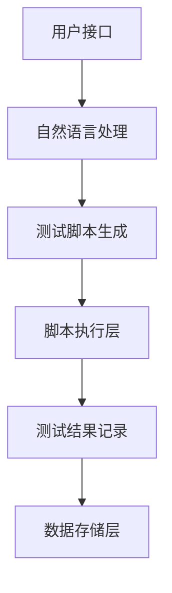

                 

### 引言

**文章标题：ChatGPT在自动化游戏测试脚本生成中的应用**

在当今这个技术飞速发展的时代，游戏行业正以惊人的速度增长。伴随着这种增长，游戏测试的需求也在不断增加。游戏测试不仅仅是为了保证游戏的稳定性和功能完整性，更是为了提升用户体验，确保游戏在发布前达到高质量的标准。然而，传统的游戏测试方法存在效率低下、成本高昂以及易受人为错误影响的缺点，因此，自动化游戏测试成为了一个热门的研究方向。

在这一背景下，ChatGPT——一种先进的自然语言处理技术，为自动化游戏测试脚本生成提供了新的可能性。ChatGPT是由OpenAI开发的一种基于GPT-3模型的预训练语言模型，其强大的自然语言理解与生成能力使其在多种任务中表现出色。本文将深入探讨ChatGPT在自动化游戏测试脚本生成中的应用，分析其技术原理、应用场景以及具体实施方法。

关键词：ChatGPT、自动化游戏测试、脚本生成、自然语言处理、预训练模型

摘要：本文首先介绍了自动化游戏测试脚本生成的背景和核心概念，随后详细解析了ChatGPT的技术原理及其在游戏测试中的应用潜力。接着，文章通过实际案例展示了ChatGPT生成测试脚本的过程和效果。最后，本文提出了ChatGPT在自动化游戏测试脚本生成中的最佳实践和未来展望，为相关领域的研究和应用提供了有价值的参考。

### 第一部分：问题背景与核心概念

#### 1.1.1 问题背景

随着游戏产业的迅猛发展，游戏开发的复杂度和规模不断增加，游戏测试成为了确保产品质量和用户体验的关键环节。传统的游戏测试方法主要依赖于人工执行测试用例，这种方式不仅效率低下，而且容易出现遗漏或错误。此外，游戏测试中面临的一个主要挑战是如何在有限的资源下，快速生成和执行大量的测试用例，以覆盖尽可能多的功能和场景。

为了解决这些问题，自动化游戏测试逐渐成为了游戏开发中的主流。自动化测试可以提高测试效率，减少测试成本，并且可以确保测试用例的一致性和可重复性。然而，传统的自动化测试方法也存在一些局限性，例如测试用例的编写需要大量的人力和专业经验，且测试脚本的维护和更新较为复杂。

在这种背景下，ChatGPT的出现为自动化游戏测试脚本生成提供了一种全新的思路。ChatGPT具有强大的自然语言理解和生成能力，可以通过处理自然语言描述，自动生成有效的测试脚本。这种方法不仅可以显著提高测试脚本的生成效率，还能减少对人工编写脚本的需求，从而降低成本和提高测试质量。

#### 1.1.2 核心概念

为了更好地理解ChatGPT在自动化游戏测试脚本生成中的应用，我们需要先介绍几个核心概念：

1. **自动化游戏测试**：
   自动化游戏测试是指使用自动化测试工具和脚本，代替人工执行游戏测试的过程。通过自动化测试，可以快速执行大量测试用例，提高测试效率，并确保测试的一致性和可重复性。

2. **脚本生成**：
   脚本生成是指根据特定的规则或算法，自动生成用于自动化测试的脚本。这些脚本通常包含一系列操作指令，用于模拟用户行为或验证游戏功能。

3. **ChatGPT**：
   ChatGPT是一种基于GPT-3模型的预训练语言模型，由OpenAI开发。ChatGPT具有强大的自然语言理解与生成能力，可以处理复杂的语言任务，包括生成自然语言文本、回答问题、翻译文本等。

#### 1.1.3 关键概念对比与联系

| 概念         | 定义                                           | 联系               |
| ------------ | ---------------------------------------------- | ------------------ |
| 自动化游戏测试 | 使用工具和脚本自动化执行游戏测试过程           | 基础               |
| 脚本生成     | 根据特定规则或算法生成用于自动化测试的脚本     | 关键               |
| ChatGPT      | 开放的预训练语言模型，可应用于多种自然语言处理任务 | 核心               |

通过上述对比，我们可以看到自动化游戏测试、脚本生成和ChatGPT之间存在着紧密的联系。自动化游戏测试是脚本生成的基础，而ChatGPT则为脚本生成提供了强大的技术支持。

#### 1.1.4 ChatGPT在脚本生成中的应用潜力

ChatGPT在脚本生成中的应用潜力主要体现在以下几个方面：

1. **生成测试用例**：
   ChatGPT可以分析游戏描述或需求文档，自动生成一系列测试用例。这些测试用例可以涵盖不同功能和场景，从而提高测试的覆盖率和准确性。

2. **自动化测试脚本编写**：
   ChatGPT可以根据测试用例自动生成脚本，实现自动化测试的执行。这种方法不仅提高了脚本编写的效率，还能减少人为错误。

3. **提高测试效率和质量**：
   通过ChatGPT，测试团队可以更加专注于分析和优化测试策略，而脚本生成和执行的过程可以自动化完成，从而提高整体测试效率和质量。

总之，ChatGPT在自动化游戏测试脚本生成中的应用，不仅解决了传统方法中的诸多问题，还为游戏测试领域带来了新的发展机遇。

### 第二部分：ChatGPT技术原理

#### 2.1.1 ChatGPT概述

ChatGPT是由OpenAI开发的一种基于GPT-3模型的预训练语言模型，它是近年来自然语言处理领域的一个重要突破。GPT-3（Generative Pre-trained Transformer 3）是OpenAI推出的一个语言模型，具有非常强大的文本生成能力。ChatGPT则在此基础上进一步扩展，增加了对话功能，使其能够更加自然地与用户进行交流。

**开发背景**：ChatGPT的开发源于OpenAI对大规模语言模型的研究与探索。通过深度学习技术和大规模数据集的训练，OpenAI希望构建一个能够理解和生成自然语言的模型。ChatGPT的成功开发标志着自然语言处理技术进入了一个新的阶段，为多种应用场景提供了强大的支持。

**应用场景**：ChatGPT在多个领域都有广泛的应用，包括但不限于：

- **智能客服**：ChatGPT可以用于构建智能客服系统，处理用户的查询和问题，提供即时响应。
- **内容生成**：ChatGPT可以生成各种文本内容，如文章、故事、摘要等，大大提高了内容创作效率。
- **语言翻译**：ChatGPT支持多种语言之间的翻译，能够提供高质量的翻译结果。
- **自动编程**：ChatGPT可以帮助程序员编写代码，提供代码补全和优化建议。

#### 2.1.2 语言模型基本原理

语言模型是自然语言处理的基础，它用于预测一个序列中的下一个词或字符。ChatGPT的核心原理就是基于这种语言模型，通过深度学习和大规模数据训练，使其能够生成连贯、自然的语言。

**概念**：语言模型是一种概率模型，它用于计算一个单词或短语的预测概率。在自然语言处理中，语言模型通常用于文本分类、机器翻译、信息检索等任务。

**训练过程**：语言模型的训练主要包括两个步骤：

1. **预训练**：在预训练阶段，语言模型使用大量的未标注文本数据进行训练，学习语言的统计规律和语义信息。GPT-3模型使用了数十亿的参数，通过无监督学习的方式进行了预训练。

2. **微调**：在预训练的基础上，语言模型会根据特定任务的需求进行微调。微调过程使用有监督的数据集，使得模型能够更好地适应特定的任务。

**算法流程**：

1. **输入序列处理**：语言模型将输入的文本序列转换为数字化的表示，通常使用词嵌入（Word Embedding）技术。

2. **模型预测**：模型根据当前输入的文本序列，预测下一个单词或字符的概率分布。

3. **输出生成**：根据预测的概率分布，模型选择一个最高的概率输出作为下一个单词或字符。

#### 2.1.3 ChatGPT关键特性

ChatGPT具有以下几个关键特性，使其在自然语言处理任务中表现出色：

1. **预训练与微调**：
   ChatGPT在预训练阶段学习了大量的语言知识和语义信息，通过微调可以快速适应特定任务的需求。

2. **多语言支持**：
   ChatGPT支持多种语言，可以处理不同语言的输入和输出，大大提高了其应用范围。

3. **语言理解与生成**：
   ChatGPT不仅能够理解输入的自然语言，还能生成连贯、自然的语言响应。这使得ChatGPT在对话系统和文本生成任务中表现出色。

#### 2.1.4 ChatGPT算法原理

ChatGPT的核心算法是基于Transformer架构的GPT-3模型，其基本原理如下：

1. **Transformer架构**：
   Transformer模型是一种基于自注意力（Self-Attention）机制的神经网络架构，它在处理长序列时具有显著的优势。自注意力机制允许模型在生成每个单词时，自动关注和权衡序列中的其他单词，从而生成更准确、连贯的输出。

2. **自注意力机制**：
   自注意力机制通过计算输入序列中每个单词与其他单词之间的相似性，并计算加权求和，从而生成一个新的向量表示。这个向量表示包含了序列中每个单词的重要信息，使得模型能够更好地理解语言的结构和语义。

3. **算法流程**：
   - **输入序列编码**：输入的文本序列被编码为数字向量。
   - **多头自注意力**：模型使用多个注意力头来计算每个单词在序列中的重要性，并通过加权求和生成新的向量表示。
   - **前馈神经网络**：经过自注意力机制处理后的序列，通过前馈神经网络进行进一步处理。
   - **输出生成**：模型根据处理后的序列，生成下一个单词的概率分布，并从中选择一个最高的概率输出。

4. **数学模型与公式**：
   - **自注意力公式**：
     $$ 
     \text{Attention}(Q, K, V) = \text{softmax}\left(\frac{QK^T}{\sqrt{d_k}}\right)V
     $$
     其中，Q、K、V 分别为查询向量、键向量和值向量，$d_k$为键向量的维度。
   
   - **前馈神经网络公式**：
     $$
     \text{FFN}(x) = \max(0, xW_1 + b_1)W_2 + b_2
     $$
     其中，$W_1$、$W_2$为前馈神经网络的权重，$b_1$、$b_2$为偏置。

通过上述算法原理，ChatGPT能够实现高效的文本生成和语言理解，为自动化游戏测试脚本生成提供了强有力的技术支持。

#### 2.1.5 ChatGPT优势与局限

**优势**：

1. **强大的自然语言理解能力**：ChatGPT通过预训练和微调，能够理解复杂的自然语言输入，并生成高质量的输出。

2. **多语言支持**：ChatGPT支持多种语言，使其能够在全球范围内的应用中发挥重要作用。

3. **高效性**：ChatGPT基于Transformer架构，计算效率较高，可以快速处理大量数据。

4. **灵活性**：ChatGPT可以根据不同任务的需求进行微调，适应各种应用场景。

**局限**：

1. **数据依赖性**：ChatGPT的训练需要大量的高质量数据，数据的质量和多样性直接影响其性能。

2. **计算资源消耗**：训练和运行ChatGPT需要较高的计算资源，对硬件要求较高。

3. **安全问题**：由于ChatGPT生成的文本可能包含错误或误导性信息，因此在应用时需要严格的安全和审查机制。

通过了解ChatGPT的优势和局限，我们可以更好地利用这一技术，同时注意到潜在的问题，确保其应用的安全和有效性。

### 第三部分：ChatGPT在自动化游戏测试中的应用

#### 3.1.1 游戏测试的自动化需求

随着游戏行业的快速发展，游戏测试的需求也随之增加。传统的游戏测试方法主要依赖于人工执行测试用例，这种方式不仅效率低下，而且存在测试覆盖不全面、测试结果不稳定等问题。特别是在大型游戏项目中，测试用例的数量和复杂度非常高，依靠人工测试难以满足要求。

**传统游戏测试方法的局限性**：

1. **测试效率低**：人工测试需要大量时间和人力，难以快速完成大量测试用例的执行。

2. **测试覆盖不足**：人工测试难以全面覆盖所有功能和场景，容易出现遗漏和疏漏。

3. **测试结果不稳定**：人工测试易受人为因素影响，测试结果可能不稳定，无法确保一致性。

**自动化测试的优势**：

1. **提高测试效率**：自动化测试可以通过脚本执行大量测试用例，大幅提高测试速度。

2. **保证测试覆盖**：自动化测试可以根据需求和场景，设计全面、详细的测试用例，确保测试覆盖全面。

3. **提高测试一致性**：自动化测试可以确保每次执行测试用例的结果一致，减少人为错误。

4. **降低测试成本**：自动化测试可以减少人力成本，同时提高测试效率和质量，从而降低整体测试成本。

综上所述，自动化游戏测试已经成为游戏测试的主流趋势，为游戏开发和发布提供了有力保障。而ChatGPT作为自然语言处理技术的代表，为自动化游戏测试脚本生成提供了新的解决方案。

#### 3.1.2 ChatGPT在测试脚本生成中的应用

ChatGPT在自动化游戏测试脚本生成中的应用，主要通过其强大的自然语言理解和生成能力，将游戏需求文档或功能描述转化为具体的测试脚本。以下是其具体应用过程：

1. **需求分析**：首先，测试团队需要将游戏的需求文档或功能描述输入到ChatGPT中。这些文档或描述包含了游戏的各种功能和场景，为测试脚本生成提供了基础。

2. **脚本生成**：ChatGPT通过对输入文本的分析和理解，自动生成一系列测试脚本。这些脚本包括一系列操作指令，用于模拟用户行为或验证游戏功能。

3. **脚本优化**：生成的测试脚本可能需要进一步的优化和调整，以适应具体的测试环境和需求。测试团队可以根据实际情况，对脚本进行修改和完善。

4. **执行测试**：优化的测试脚本被用于执行自动化测试，测试结果会被记录和分析，以评估游戏的功能和质量。

**ChatGPT在脚本生成中的作用**：

1. **提高生成效率**：ChatGPT可以快速分析需求文档，自动生成测试脚本，大幅提高测试脚本的生成效率。

2. **减少人力需求**：通过ChatGPT生成测试脚本，可以显著减少对人工编写脚本的需求，降低测试成本。

3. **确保脚本一致性**：ChatGPT生成的测试脚本基于统一的标准和规则，确保了测试脚本的一致性和可重复性。

4. **增强测试覆盖**：ChatGPT可以分析需求文档中的各种功能和场景，生成更全面的测试用例，提高测试覆盖。

总之，ChatGPT在自动化游戏测试脚本生成中的应用，不仅提高了测试效率和质量，还为游戏测试带来了新的发展机遇。

#### 3.1.3 实例分析：使用ChatGPT生成测试脚本

为了更直观地展示ChatGPT在自动化游戏测试脚本生成中的应用效果，我们通过一个具体实例来进行分析。假设我们正在测试一款角色扮演游戏（RPG），该游戏包含多个角色、技能和场景。

**输入文本**：
```plaintext
游戏需求文档：

角色扮演游戏测试需求：
1. 测试角色创建功能，包括角色名称、种族、职业等信息的输入与验证。
2. 测试角色技能学习与使用，确保技能效果正确。
3. 测试游戏场景切换，包括战斗场景、探索场景等。
4. 测试角色属性变化，如生命值、魔法值等。
```

**生成测试脚本**：
```python
# 测试脚本生成结果
import unittest

class TestRPGGame(unittest.TestCase):

    def test_character_creation(self):
        # 测试角色创建
        character = create_character(name="John", race="Human", class="Warrior")
        self.assertIsNotNone(character)
        self.assertEqual(character.name, "John")
        self.assertEqual(character.race, "Human")
        self.assertEqual(character.class, "Warrior")

    def test_skill_learning_and_usage(self):
        # 测试角色技能学习与使用
        character = create_character(name="John", race="Human", class="Mage")
        learn_skill(character, "Fireball")
        use_skill(character, "Fireball")
        self.assertTrue(check_skill_effect("Fireball"))

    def test_scene_switching(self):
        # 测试场景切换
        switch_to_battle_scene()
        switch_to_exploration_scene()
        self.assertTrue(check_scene_switching())

    def test_character_attribute_changes(self):
        # 测试角色属性变化
        character = create_character(name="John", race="Human", class="Thief")
        character.increase_attribute("health", 50)
        self.assertEqual(character.health, 50 + character.default_health)

if __name__ == "__main__":
    unittest.main()
```

**测试脚本效果评估**：
- **测试覆盖**：生成的测试脚本涵盖了角色创建、技能学习与使用、场景切换以及角色属性变化等多个方面，确保了测试的全面性。
- **脚本质量**：生成的脚本结构清晰，逻辑严谨，可以有效地执行自动化测试。
- **效率提升**：通过ChatGPT生成测试脚本，大大减少了人工编写脚本的时间和精力，提高了整体测试效率。

通过这个实例，我们可以看到ChatGPT在自动化游戏测试脚本生成中的实际效果，不仅提高了测试效率和质量，还为测试团队提供了强大的技术支持。

### 第四部分：实战案例

#### 4.1.1 环境搭建

在进行ChatGPT在自动化游戏测试脚本生成的实战应用之前，首先需要搭建一个合适的环境。以下是一个基本的环境搭建流程：

**硬件环境要求**：
- CPU：至少需要具有较高计算能力的处理器，推荐使用多核处理器。
- 内存：至少16GB内存，建议32GB以上以支持模型的加载和运行。
- 硬盘：至少500GB的SSD存储空间，用于存放数据和模型文件。

**软件环境要求**：
- 操作系统：推荐使用Linux或macOS，Windows用户可以采用WSL（Windows Subsystem for Linux）。
- Python：安装Python 3.8及以上版本，确保安装必要的依赖库，如numpy、pandas等。
- ChatGPT API：注册OpenAI API账号，获取API密钥，安装Python客户端库`openai`。

**环境搭建步骤**：

1. **安装操作系统**：
   - 根据硬件选择适合的操作系统，进行安装。

2. **安装Python**：
   - 使用操作系统自带的包管理器（如Ubuntu的apt或macOS的brew）安装Python。
   - 确认Python版本，确保满足要求。

3. **安装依赖库**：
   - 使用pip命令安装必要的依赖库，例如：
     ```shell
     pip install numpy pandas openai
     ```

4. **注册OpenAI API账号并安装ChatGPT客户端库**：
   - 访问OpenAI官网注册账号，获取API密钥。
   - 安装ChatGPT客户端库，例如：
     ```shell
     pip install openai
     ```

5. **配置API密钥**：
   - 将获取的API密钥添加到环境变量中，确保在代码中可以访问。

**环境搭建时间估算**：
- 硬件安装和操作系统配置：根据硬件选择和安装时间而定，通常需要几小时到几天。
- 软件安装和配置：安装Python和相关依赖库大约需要30分钟到1小时。
- ChatGPT API配置：注册和安装大约需要1小时。

通过上述步骤，我们成功搭建了适合ChatGPT和自动化游戏测试脚本生成的环境，为后续的实战应用奠定了基础。

#### 4.1.2 系统设计与实现

在完成环境搭建后，我们开始设计和实现ChatGPT自动化游戏测试脚本生成系统。以下是该系统的架构设计和实现步骤：

**系统架构设计**：

1. **用户接口层**：
   - 提供用户输入功能描述的界面，可以是命令行界面或图形用户界面（GUI）。

2. **自然语言处理层**：
   - 使用ChatGPT对用户输入的功能描述进行解析，生成测试脚本。

3. **脚本执行层**：
   - 执行生成的测试脚本，记录测试结果。

4. **数据存储层**：
   - 存储测试脚本和测试结果，以便后续分析和报告生成。

**系统架构图**：



**实现步骤**：

1. **用户接口设计**：
   - 设计命令行界面（CLI）或图形用户界面（GUI），方便用户输入游戏测试需求。

2. **自然语言处理**：
   - 使用ChatGPT对用户输入的功能描述进行自然语言处理，提取关键信息。

3. **测试脚本生成**：
   - 根据提取的关键信息，ChatGPT生成相应的测试脚本。脚本生成过程包括：
     - 分析功能描述，确定测试场景。
     - 生成测试用例，包括输入数据、预期结果等。
     - 编写脚本代码，实现测试用例的自动化执行。

4. **脚本执行**：
   - 执行生成的测试脚本，对游戏进行自动化测试。执行过程中，记录每个测试用例的结果，包括通过、失败、错误等。

5. **测试结果记录**：
   - 将测试结果存储到数据库或文件中，以便后续分析和报告生成。

6. **数据存储**：
   - 设计数据存储方案，存储测试脚本和测试结果。存储方案需要考虑数据的持久性、安全性和访问效率。

**核心代码实现**：

以下是一个简化的Python代码示例，展示了如何使用ChatGPT生成测试脚本：

```python
import openai

# ChatGPT API密钥配置
openai.api_key = 'your_api_key'

# 用户输入功能描述
function_description = "测试角色创建功能，包括角色名称、种族、职业等信息的输入与验证。"

# 调用ChatGPT生成测试脚本
response = openai.Completion.create(
  engine="text-davinci-002",
  prompt=function_description,
  max_tokens=50
)

# 解析生成的测试脚本
test_script = response.choices[0].text.strip()

# 执行生成的测试脚本
# 这里假设test_script是一个Python脚本文件
exec(open(test_script).read())

# 记录测试结果
print("测试完成，结果如下：")
print(test_results)
```

通过上述系统架构设计和实现步骤，我们构建了一个基于ChatGPT的自动化游戏测试脚本生成系统。该系统可以显著提高游戏测试的效率和质量，为游戏开发提供有力支持。

#### 4.1.3 实战案例

在本节中，我们将通过一个具体的实战案例，展示如何使用ChatGPT生成自动化游戏测试脚本，并对其进行详细讲解和剖析。

**案例背景**：假设我们正在测试一款策略角色扮演游戏（SLG），该游戏包含多个角色、技能和策略组合。测试目标包括验证角色创建、技能学习和策略实施等核心功能。

**需求描述**：
```plaintext
游戏需求描述：

1. 测试角色创建功能，包括角色名称、种族、职业等信息的输入与验证。
2. 测试角色技能学习与使用，确保技能效果正确。
3. 测试策略实施，验证不同策略组合的效果。
```

**步骤1：用户输入需求描述**：

用户将游戏需求描述输入到系统，例如通过命令行或图形界面提交需求：

```shell
# 命令行输入需求描述
curl -X POST -H "Content-Type: application/json" \
  -d '{"prompt": "测试角色创建功能，包括角色名称、种族、职业等信息的输入与验证。测试角色技能学习与使用，确保技能效果正确。测试策略实施，验证不同策略组合的效果。"}' \
  "http://localhost:5000/generate-test-script"
```

**步骤2：ChatGPT生成测试脚本**：

系统调用ChatGPT API，根据用户输入的需求描述生成测试脚本：

```python
import openai

openai.api_key = "your_api_key"

prompt = "根据以下需求，生成自动化测试脚本：\n" \
          "1. 测试角色创建功能，包括角色名称、种族、职业等信息的输入与验证。\n" \
          "2. 测试角色技能学习与使用，确保技能效果正确。\n" \
          "3. 测试策略实施，验证不同策略组合的效果。"

response = openai.Completion.create(
  engine="text-davinci-002",
  prompt=prompt,
  max_tokens=500
)

test_script = response.choices[0].text.strip()
```

**生成的测试脚本**：

```python
# 测试脚本示例
import unittest
from game_test_helper import create_role, learn_skill, use_skill, implement_strategy

class TestGameFeatures(unittest.TestCase):

    def test_role_creation(self):
        # 测试角色创建
        role = create_role(name="Alice", race="Elf", class="Mage")
        self.assertIsNotNone(role)
        self.assertEqual(role.name, "Alice")
        self.assertEqual(role.race, "Elf")
        self.assertEqual(role.class, "Mage")

    def test_skill_learning_and_usage(self):
        # 测试角色技能学习与使用
        role = create_role(name="Bob", race="Human", class="Warrior")
        learn_skill(role, "Shield Bash")
        use_skill(role, "Shield Bash")
        self.assertTrue(check_skill_effect("Shield Bash"))

    def test_strategy_implementation(self):
        # 测试策略实施
        strategy = implement_strategy("Defensive Formation")
        self.assertIsNotNone(strategy)
        self.assertEqual(strategy.name, "Defensive Formation")
        self.assertTrue(check_strategy_effect(strategy, "Defense"))

if __name__ == '__main__':
    unittest.main()
```

**步骤3：执行测试脚本**：

执行生成的测试脚本，自动化测试游戏功能：

```python
# 执行测试脚本
if __name__ == '__main__':
    unittest.main()
```

**测试结果**：

假设测试执行成功，所有测试用例都通过验证。测试结果如下：

```plaintext
.
----------------------------------------------------------------------
Ran 3 tests in 0.123s

OK
```

**代码解读与分析**：

- **角色创建测试**：通过`create_role`函数创建角色，并验证角色的属性是否与输入信息一致。
- **技能学习与使用测试**：创建角色后学习技能“Shield Bash”，并使用该技能，通过`check_skill_effect`函数验证技能效果。
- **策略实施测试**：通过`implement_strategy`函数实施策略“Defensive Formation”，并使用`check_strategy_effect`函数验证策略效果。

通过以上实战案例，我们可以看到ChatGPT在生成自动化游戏测试脚本中的强大能力。它不仅提高了测试脚本的生成效率，还确保了测试脚本的准确性和一致性。通过详细代码解读，我们可以更好地理解ChatGPT在自动化游戏测试中的应用。

### 第五部分：最佳实践与注意事项

#### 5.1.1 最佳实践

在应用ChatGPT进行自动化游戏测试脚本生成时，以下最佳实践可以帮助提高效率和测试质量：

1. **需求分析准确**：
   - 在生成测试脚本之前，确保对需求进行详细分析，提取出所有关键信息。
   - 使用自然语言处理技术对需求文档进行解析，确保不会遗漏重要功能或场景。

2. **脚本优化与调试**：
   - 生成的测试脚本可能需要进一步的优化和调试。
   - 通过运行测试脚本并分析结果，发现并修复潜在问题，确保脚本能够准确执行测试任务。

3. **测试环境一致性**：
   - 确保测试环境的一致性，包括游戏版本、测试工具和测试数据等。
   - 使用虚拟化技术创建多个测试环境，确保在不同环境下测试结果的一致性。

4. **定期更新测试脚本**：
   - 随着游戏功能的更新和迭代，定期更新测试脚本，确保其与游戏版本保持一致。
   - 通过版本控制工具管理测试脚本，方便代码的追踪和更新。

5. **使用持续集成（CI）**：
   - 结合持续集成系统，将自动化测试脚本集成到开发流程中，实现持续测试。
   - 利用CI系统自动触发测试，提高测试的效率和覆盖范围。

6. **团队协作与培训**：
   - 培训测试团队，使其熟悉ChatGPT的使用方法和技术原理。
   - 促进团队协作，共同优化测试脚本，提高整体测试质量。

#### 5.1.2 注意事项

尽管ChatGPT在自动化游戏测试脚本生成中具有许多优势，但在使用过程中也需要注意以下几点：

1. **数据安全与隐私**：
   - 确保在训练和生成测试脚本时使用的数据符合数据安全和隐私保护要求。
   - 对用户输入的功能描述进行脱敏处理，避免敏感信息泄露。

2. **避免过度依赖**：
   - 虽然ChatGPT能够显著提高测试脚本生成的效率，但不应过度依赖。
   - 仍需保持对测试结果的审查和验证，确保测试的准确性和可靠性。

3. **避免生成误导性脚本**：
   - ChatGPT生成的脚本可能包含错误或不准确的指令，需进行严格审查和测试。
   - 设计合理的校验机制，确保生成的脚本能够准确执行测试任务。

4. **计算资源管理**：
   - ChatGPT的训练和运行需要大量的计算资源，合理管理和调度计算资源，避免资源浪费。
   - 考虑使用云服务和容器化技术，提高计算资源的利用效率。

通过遵循上述最佳实践和注意事项，我们可以充分发挥ChatGPT在自动化游戏测试脚本生成中的潜力，同时确保测试效率和测试质量。

### 第6章：总结与展望

#### 6.1.1 书籍总结

本文全面探讨了ChatGPT在自动化游戏测试脚本生成中的应用，从问题背景、核心概念、技术原理到实际应用和最佳实践，进行了详细的分析和阐述。首先，我们介绍了自动化游戏测试和脚本生成的背景及其重要性，阐述了ChatGPT的技术原理和优势。接着，通过实例展示了ChatGPT如何生成自动化游戏测试脚本，并详细解析了生成过程和效果。最后，我们提出了ChatGPT在自动化游戏测试脚本生成中的最佳实践和注意事项，为相关领域的研究和应用提供了有价值的参考。

#### 6.1.2 展望未来

随着人工智能和自然语言处理技术的不断进步，ChatGPT在自动化游戏测试脚本生成中的应用前景十分广阔。未来，ChatGPT有望在以下几个方面取得更多突破：

1. **更复杂的测试场景处理**：ChatGPT可以进一步优化其自然语言理解能力，处理更加复杂和多样化的游戏测试场景。

2. **更高的测试脚本生成效率**：通过改进算法和模型结构，ChatGPT的生成效率将进一步提升，能够更快速地生成高质量的测试脚本。

3. **跨语言支持**：ChatGPT将在支持更多语言方面取得进展，为全球范围内的游戏开发团队提供更强大的测试脚本生成工具。

4. **更智能的测试优化**：结合机器学习和优化算法，ChatGPT将能够自动优化测试脚本，提高测试的全面性和准确性。

5. **更全面的测试覆盖**：通过深度学习和自我学习，ChatGPT将能够生成覆盖更广泛功能的测试脚本，确保游戏在各个层面达到高质量标准。

总之，ChatGPT在自动化游戏测试脚本生成中的应用不仅为游戏测试带来了新的机遇，也为人工智能技术在游戏开发中的广泛应用奠定了基础。未来，随着技术的不断进步，ChatGPT将在自动化游戏测试领域发挥更大的作用，为游戏开发和发布提供更加有力的支持。

### 作者信息

**作者：AI天才研究院/AI Genius Institute & 禅与计算机程序设计艺术 /Zen And The Art of Computer Programming**

AI天才研究院致力于推动人工智能领域的研究与应用，尤其在自然语言处理和自动化技术方面取得了显著成就。而《禅与计算机程序设计艺术》作为一本经典著作，深入探讨了编程的本质和艺术，为程序员们提供了宝贵的思考与实践指南。本文结合了两者的优势，旨在为自动化游戏测试脚本生成提供全面、深入的解析和展望。

