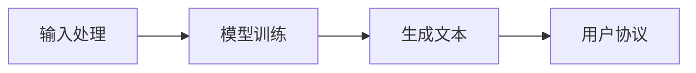
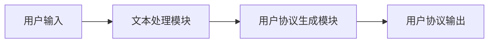
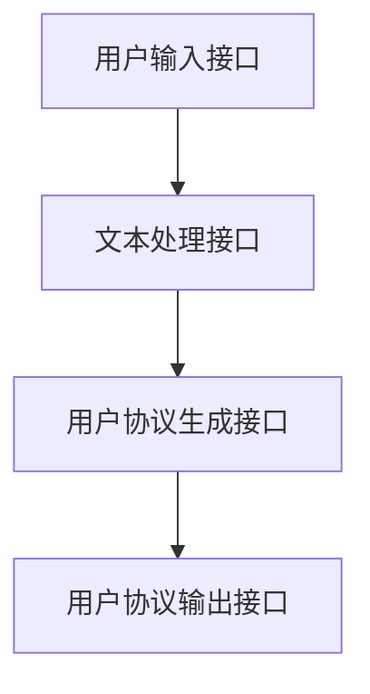
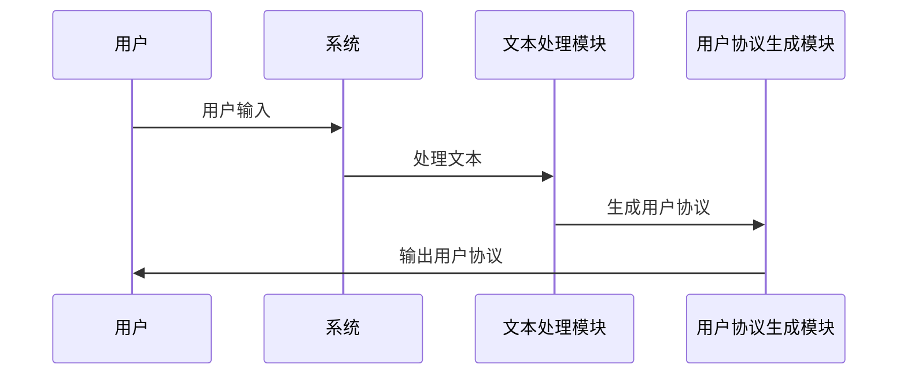

                 

## 第一部分：背景介绍

### 第1章：问题背景与概述

#### 1.1 问题的提出

随着互联网的快速发展，用户协议作为服务提供者与用户之间的法律约束文件，变得愈发重要。然而，传统用户协议的生成过程通常繁琐且耗时，不仅要求法务团队具备深厚的法律知识，还需要根据不断变化的法律法规进行调整。这种人工撰写的方式不仅效率低下，而且容易出错，导致用户协议的合规性和适用性难以保证。

#### 1.1.1 用户协议的现状与挑战

当前，用户协议的生成主要面临以下几个挑战：

1. **法律合规性要求高**：随着各国法律体系的变化，用户协议需要不断更新，以确保其合法性。
2. **个性化需求明显**：不同的服务提供者有不同的业务模式，需要定制化用户协议以满足各自的需求。
3. **内容复杂且冗长**：用户协议的内容通常涉及隐私政策、责任条款、服务条款等多个方面，撰写起来相当复杂。
4. **更新维护成本高**：由于法律和业务需求的变化，用户协议需要定期更新，维护成本高昂。

#### 1.1.2 自动化用户协议生成的需求

为了应对上述挑战，自动化生成用户协议的需求日益迫切。自动化生成用户协议的主要目标包括：

1. **提高生成效率**：通过自动化工具，能够快速生成符合法律规定的用户协议，减少人工撰写的工作量。
2. **降低维护成本**：自动化工具可以根据法律法规的变更自动更新用户协议，减少维护成本。
3. **保证合规性**：自动化工具能够依据最新的法律和业务需求生成用户协议，确保其合规性。
4. **满足个性化需求**：通过模板化和参数化设计，自动化工具能够根据不同服务提供者的需求生成定制化的用户协议。

### 1.2 问题描述

用户协议的主要功能与内容包括：

1. **隐私保护条款**：明确用户数据的收集、存储、使用和共享方式，保障用户隐私。
2. **服务条款**：定义服务提供者的服务内容、用户权益、服务期限等。
3. **责任条款**：规定用户在使用服务过程中应承担的责任和可能面临的法律后果。
4. **争议解决条款**：明确争议解决的途径和方式，如调解、仲裁等。

生成用户协议的难点主要有以下几点：

1. **法律复杂性**：用户协议涉及的法律问题复杂，需要准确理解并表达法律条款。
2. **个性化定制**：不同服务提供者对用户协议的需求各不相同，需要生成个性化协议。
3. **文本生成质量**：用户协议的文本需要清晰、准确地表达法律条款，同时保证文本的流畅性和可读性。
4. **更新维护**：法律和业务需求的变化要求用户协议能够及时更新，保证其合规性和适用性。

### 1.3 问题解决

为了解决上述问题，可以考虑以下自动化生成用户协议的潜在方法：

1. **模板化生成**：通过预先设计好的模板，根据不同的服务内容自动填充相关条款。
2. **规则引擎**：使用规则引擎，根据预定义的规则自动生成用户协议。
3. **自然语言处理**：利用自然语言处理技术，从现有的法律文本中提取规则并生成新的用户协议。
4. **机器学习**：通过机器学习模型，从大量的法律文本中学习并生成用户协议。

在这其中，ChatGPT作为一个基于深度学习的自然语言处理模型，具备以下优势：

1. **强大的语言理解能力**：ChatGPT能够理解复杂的法律文本，提取关键信息并生成新的法律条款。
2. **高效的文本生成**：ChatGPT可以快速生成高质量的文本，节省人力成本。
3. **灵活的定制能力**：ChatGPT可以根据不同的业务需求，灵活调整生成文本的内容和结构。

然而，自动化生成用户协议仍存在一定的限制，如：

1. **法律知识局限性**：ChatGPT的知识有限，可能无法涵盖所有最新的法律法规。
2. **文本质量控制**：生成的文本需要经过人工审核，以确保其准确性和合规性。
3. **个性化定制难度**：虽然ChatGPT可以生成文本，但要满足所有个性化需求仍然具有挑战性。

### 1.4 边界与外延

#### 1.4.1 自动化生成用户协议的限制

自动化生成用户协议虽然具有一定的优势，但也存在一些限制。首先，法律文本的高度复杂性和专业性使得自动化工具难以完全取代人类的工作。其次，自动化工具需要不断学习和更新法律知识库，以应对法律环境的变化。此外，用户协议的个性化定制也是一个难题，因为每个服务提供者的业务模式和用户需求都有所不同。

#### 1.4.2 用户协议内容的变化与适应性

用户协议的内容会随着法律环境、业务需求和技术进步而发生变化。自动化工具需要具备良好的适应性，能够快速响应这些变化。这要求自动化工具不仅要能够生成用户协议，还要能够自动化地更新和维护现有协议，确保其始终符合最新的法律法规和业务需求。

### 1.5 概念结构与核心要素

#### 1.5.1 ChatGPT的定义与特点

ChatGPT是由OpenAI开发的一个基于变换器架构的预训练语言模型。它采用了大规模的文本数据进行预训练，通过深度学习技术，使得模型能够理解并生成自然语言文本。ChatGPT的特点包括：

1. **强大的语言理解能力**：ChatGPT能够理解复杂的语言结构，捕捉语义信息。
2. **灵活的文本生成**：ChatGPT可以根据输入的提示，生成连贯、自然的文本。
3. **大规模数据处理**：ChatGPT能够处理海量的文本数据，从中学习语言模式和知识。

#### 1.5.2 用户协议生成的主要步骤与核心要素

用户协议生成的主要步骤包括：

1. **输入处理**：接收用户输入，如服务类型、业务需求等。
2. **模型训练**：利用已有的法律文本数据，对ChatGPT进行训练，使其能够生成符合法律规定的文本。
3. **文本生成**：根据用户输入和模型训练结果，生成用户协议的文本。
4. **文本审查**：对生成的文本进行人工审查，确保其准确性和合规性。
5. **输出**：将审查后的用户协议文本输出给用户。

核心要素包括：

1. **法律文本数据**：作为训练数据，确保ChatGPT能够理解法律术语和条款。
2. **自然语言处理技术**：用于理解和生成文本，确保生成的用户协议文本清晰、准确。
3. **人工审查机制**：确保生成的文本符合法律要求，减少错误和遗漏。
4. **自动化更新机制**：确保用户协议能够及时更新，以应对法律和业务需求的变化。

通过以上分析，我们可以看到ChatGPT在自动化用户协议生成中具有重要的角色和作用。在接下来的章节中，我们将进一步探讨ChatGPT的工作原理、算法细节以及具体实现方案。

---

## 第2章：核心概念与联系

### 2.1 ChatGPT的基本原理

ChatGPT，即聊天生成预训练模型（Chat-based Generative Pre-trained Transformer），是一种基于变换器（Transformer）架构的自然语言处理（NLP）模型。ChatGPT 的核心原理可以概括为以下几个部分：

#### 2.1.1 语言模型的原理

语言模型是一种用于预测下一个单词或字符的模型。其基本原理是基于统计和深度学习的结合，通过分析大量的文本数据来学习语言模式。在ChatGPT中，语言模型的核心是通过变换器架构实现的。

变换器（Transformer）模型由Vaswani等人于2017年提出，它采用了一种全新的序列到序列（Seq2Seq）学习框架，能够有效处理长文本序列。与传统的循环神经网络（RNN）和长短时记忆网络（LSTM）相比，变换器模型具有以下优势：

1. **并行处理**：变换器模型通过自注意力机制（Self-Attention），能够同时考虑序列中所有单词之间的关系，实现并行计算，提高了计算效率。
2. **上下文理解**：变换器模型能够更好地捕捉长距离的依赖关系，从而提高语言理解的准确性。
3. **灵活性**：变换器模型的结构相对简单，参数较少，因此具有更好的灵活性和可扩展性。

#### 2.1.2 深度学习的应用

深度学习是ChatGPT的核心技术之一。它是一种基于多层神经网络的学习方法，能够自动提取数据中的特征。在ChatGPT中，深度学习主要用于以下两个方面：

1. **特征提取**：深度学习模型通过多层神经网络，对输入的文本数据进行特征提取，将原始文本转换为高维特征向量。这些特征向量包含了文本的语义信息，是生成高质量文本的基础。
2. **模式识别**：通过训练，深度学习模型能够从大量的文本数据中学习语言模式，预测下一个单词或字符，从而生成连贯、自然的文本。

#### 2.1.3 大规模数据处理能力

ChatGPT的一个显著特点是它能够处理海量的文本数据。大规模数据处理能力主要得益于以下两点：

1. **预训练**：ChatGPT在训练过程中使用了大量来自互联网的文本数据，这些数据涵盖了各种领域和主题，为模型提供了丰富的知识。
2. **分布式训练**：为了处理如此庞大的数据集，ChatGPT采用了分布式训练技术，将数据分散到多个计算节点上，通过并行计算加快训练速度。

#### 2.1.4 ChatGPT的优势与挑战

ChatGPT在自动化用户协议生成中具有以下优势：

1. **高效生成**：ChatGPT能够快速生成高质量的文本，大大提高了用户协议生成的效率。
2. **个性化定制**：ChatGPT可以根据不同的用户需求，灵活生成定制化的用户协议。
3. **适应性强**：ChatGPT能够不断学习和更新，以适应法律和业务需求的变化。

然而，ChatGPT也面临一些挑战：

1. **法律知识的局限性**：虽然ChatGPT具有强大的语言理解能力，但其知识有限，可能无法涵盖所有最新的法律法规。
2. **文本质量控制**：生成的文本需要经过人工审查，以确保其准确性和合规性。
3. **个性化定制难度**：尽管ChatGPT能够生成文本，但要满足所有个性化需求仍然具有挑战性。

### 2.2 用户协议生成的方法与流程

用户协议生成的方法主要包括模板化生成、规则引擎和机器学习等。下面将详细探讨这些方法及其在用户协议生成中的应用。

#### 2.2.1 模板化生成

模板化生成是一种通过预定义模板，根据用户输入自动填充相关条款的方法。其主要步骤如下：

1. **模板设计**：根据用户协议的主要内容和功能，设计相应的模板。模板通常包括隐私政策、服务条款、责任条款等。
2. **参数化**：将模板中的固定部分（如标题、段落开头等）替换为参数，以便根据用户输入动态生成。
3. **文本生成**：根据用户输入，动态填充模板中的参数，生成用户协议的文本。

模板化生成的主要优点是简单直观、易于实现。然而，其缺点在于灵活性较差，难以满足复杂的个性化需求。

#### 2.2.2 规则引擎

规则引擎是一种基于规则逻辑的自动化工具，用于生成和执行业务规则。在用户协议生成中，规则引擎的主要作用是根据预定义的规则，自动生成用户协议的文本。其主要步骤如下：

1. **规则设计**：根据用户协议的主要内容和功能，设计相应的规则。这些规则通常包括条件语句、逻辑判断等。
2. **规则库**：将设计好的规则存储在规则库中，以便在生成用户协议时进行查询和执行。
3. **文本生成**：根据用户输入，执行规则库中的规则，生成用户协议的文本。

规则引擎的优点在于其灵活性和扩展性，可以适应各种复杂的业务需求。然而，其缺点是需要复杂的规则设计和维护，且规则库的建立和维护成本较高。

#### 2.2.3 机器学习

机器学习是一种通过训练模型，从数据中学习规律和模式的方法。在用户协议生成中，机器学习模型可以从大量的法律文本数据中学习，生成符合法律规定的用户协议。其主要步骤如下：

1. **数据收集与预处理**：收集大量的法律文本数据，并对数据进行清洗、标注等预处理。
2. **模型训练**：使用训练数据对机器学习模型进行训练，使其能够识别和生成法律条款。
3. **文本生成**：根据用户输入，使用训练好的模型生成用户协议的文本。

机器学习的优点是能够自动学习并适应复杂的法律条款，生成高质量的文本。然而，其缺点是需要大量的训练数据和较长的训练时间，且模型的解释性较差。

### 2.3 ChatGPT与用户协议生成的关系

ChatGPT作为一种基于深度学习的自然语言处理模型，在用户协议生成中具有广泛的应用。具体来说，ChatGPT可以与上述方法相结合，发挥其强大的语言理解和生成能力，从而提高用户协议生成的效率和质量。

#### 2.3.1 ChatGPT在用户协议生成中的应用

1. **文本生成**：ChatGPT可以用于生成用户协议的文本，通过输入用户输入和服务类型，ChatGPT能够自动生成符合法律规定的用户协议。
2. **文本审查**：ChatGPT可以对生成的用户协议进行审查，识别其中的错误和不合规之处，并进行修正。
3. **个性化定制**：ChatGPT可以根据用户的个性化需求，灵活调整生成文本的内容和结构，生成定制化的用户协议。

#### 2.3.2 ChatGPT的优势与挑战

ChatGPT在用户协议生成中的优势主要包括：

1. **高效生成**：ChatGPT能够快速生成高质量的文本，大大提高了用户协议生成的效率。
2. **个性化定制**：ChatGPT可以根据用户的个性化需求，灵活生成定制化的用户协议。
3. **文本审查**：ChatGPT可以自动审查生成的用户协议，减少错误和不合规的情况。

然而，ChatGPT在用户协议生成中也面临一些挑战：

1. **法律知识的局限性**：ChatGPT的知识有限，可能无法涵盖所有最新的法律法规。
2. **文本质量控制**：生成的文本需要经过人工审查，以确保其准确性和合规性。
3. **个性化定制难度**：尽管ChatGPT能够生成文本，但要满足所有个性化需求仍然具有挑战性。

综上所述，ChatGPT在自动化用户协议生成中具有重要的作用。通过结合模板化生成、规则引擎和机器学习方法，ChatGPT能够发挥其强大的语言理解和生成能力，提高用户协议生成的效率和准确性。然而，为了充分发挥ChatGPT的优势，还需要解决其面临的挑战，如法律知识的局限性和文本质量控制等。在接下来的章节中，我们将进一步探讨ChatGPT的算法原理和具体实现。

### 2.3 ChatGPT与用户协议生成的关系

ChatGPT作为一款先进的自然语言处理工具，在自动化用户协议生成中扮演着至关重要的角色。通过结合ChatGPT的特性，我们可以大幅度提升用户协议生成的效率、准确性和灵活性。

#### 2.3.1 ChatGPT在用户协议生成中的应用

ChatGPT在用户协议生成中的应用主要体现在以下几个方面：

1. **文本生成**：ChatGPT的核心功能是生成文本，它可以基于给定的输入，如服务类型、用户需求等，生成符合法律规定的用户协议。例如，当输入为“服务条款”时，ChatGPT可以生成包含服务期限、服务内容、用户权益等条款的文本。

2. **文本审查**：在生成用户协议的过程中，ChatGPT不仅可以生成文本，还可以对生成的文本进行审查。通过对比法律数据库和标准条款，ChatGPT能够识别并纠正文本中的潜在错误和不合规之处。

3. **个性化定制**：ChatGPT可以根据用户的个性化需求，灵活调整生成文本的内容和结构。例如，对于不同的用户群体（如儿童、成人等），ChatGPT可以生成不同的隐私保护条款和责任条款。

#### 2.3.2 ChatGPT的优势与挑战

ChatGPT在自动化用户协议生成中具有以下优势：

1. **高效性**：ChatGPT能够快速处理大量文本数据，生成高质量的协议文本。相比人工撰写，ChatGPT显著提高了生成速度，减少了时间成本。

2. **灵活性**：ChatGPT可以根据用户的实时输入和需求，动态生成和调整文本内容。这种灵活性使得用户协议能够更好地适应不同的业务场景和用户需求。

3. **准确性**：通过预训练和持续学习，ChatGPT能够理解复杂的法律术语和条款，生成准确、合规的文本。同时，ChatGPT的文本审查功能有助于降低人为错误。

然而，ChatGPT在用户协议生成中也面临一些挑战：

1. **法律知识的局限性**：虽然ChatGPT具有强大的语言理解能力，但其知识库可能无法涵盖所有最新的法律法规。因此，在生成用户协议时，需要结合专业法律知识和实时法律信息。

2. **文本质量控制**：尽管ChatGPT能够生成高质量的文本，但生成的文本仍需经过人工审查，以确保准确性和合规性。自动化工具难以完全取代人类的专业判断。

3. **个性化定制难度**：尽管ChatGPT可以生成定制化的文本，但满足所有个性化需求仍然具有挑战性。特别是在涉及特定行业或法律条款时，需要更加细致的定制和调整。

#### 2.3.3 ChatGPT与其他生成方法的结合

为了充分发挥ChatGPT的优势，我们可以将其与其他生成方法相结合，如模板化生成和规则引擎。具体来说：

1. **模板化生成**：ChatGPT可以与预定义的模板相结合，通过模板快速生成用户协议。在模板的基础上，ChatGPT可以自动填充具体的内容，提高生成效率。

2. **规则引擎**：ChatGPT可以与规则引擎结合，根据预定义的业务规则生成用户协议。规则引擎可以确保用户协议的生成遵循特定的逻辑和流程，提高生成的一致性和准确性。

通过结合模板化生成和规则引擎，ChatGPT可以更好地应对复杂的用户协议生成需求，提高生成的灵活性和准确性。

综上所述，ChatGPT在自动化用户协议生成中具有重要的应用价值和广阔的前景。尽管面临一定的挑战，通过与模板化生成和规则引擎等方法的结合，ChatGPT可以显著提高用户协议生成的效率和质量。在接下来的章节中，我们将深入探讨ChatGPT的算法原理和具体实现，以更好地理解其工作机制和应用场景。

### 3.1 ChatGPT算法的mermaid流程图

为了更好地理解ChatGPT的算法流程，我们可以使用mermaid绘制一个简化的流程图。以下是一个基本的算法流程描述：



在这个流程图中：

- **A[输入处理]**：接收用户输入，如服务类型、业务需求等。
- **B[模型训练]**：利用预训练模型处理输入数据，进行模型训练。
- **C[生成文本]**：基于模型训练结果，生成用户协议的文本。
- **D[用户协议]**：将生成的文本输出，形成最终的用户协议。

通过这个mermaid流程图，我们可以直观地看到ChatGPT在用户协议生成中的主要步骤和逻辑关系。

### 3.2 算法原理与数学模型

#### 3.2.1 语言模型的基础数学模型

在自然语言处理领域，语言模型的核心任务是预测下一个单词或字符。给定一个单词序列 \( \text{word}_{1}, \text{word}_{2}, \ldots, \text{word}_{i} \)，我们需要预测下一个单词 \( \text{word}_{i+1} \)。语言模型的基础数学模型是基于概率的，可以用以下公式表示：

\[ 
P(\text{word}_{i+1}|\text{word}_{1}, \text{word}_{2}, \ldots, \text{word}_{i}) = \frac{P(\text{word}_{1}, \text{word}_{2}, \ldots, \text{word}_{i}, \text{word}_{i+1})}{P(\text{word}_{1}, \text{word}_{2}, \ldots, \text{word}_{i})}
\]

这个公式可以简化为：

\[ 
P(\text{word}_{i+1}|\text{word}_{1}, \text{word}_{2}, \ldots, \text{word}_{i}) = P(\text{word}_{i+1}|\text{word}_{i}) 
\]

因为所有的单词都是在相同的前缀下预测的。

#### 3.2.2 ChatGPT的工作原理

ChatGPT是一种基于变换器（Transformer）架构的预训练语言模型。它的核心原理是通过自注意力机制（Self-Attention）来捕捉输入序列中不同单词之间的关系，从而生成高质量的文本。

ChatGPT的工作原理可以简化为以下三个主要步骤：

1. **编码器（Encoder）**：输入序列经过编码器，编码器使用自注意力机制生成一系列隐藏状态。
2. **解码器（Decoder）**：解码器利用编码器生成的隐藏状态，结合当前生成的单词，生成下一个单词的预测。
3. **输出**：通过多次迭代解码器，生成完整的输出序列。

数学上，ChatGPT可以表示为：

\[ 
P(\text{output}|\text{input}) = \prod_{i=1}^{n} P(\text{word}_i|\text{word}_{i-1}, \ldots, \text{word}_1) 
\]

这里， \( n \) 是输出序列的长度， \( \text{word}_i \) 是输出序列的第 \( i \) 个单词。

#### 3.2.3 算法举例说明

假设我们有一个简单的输入序列：“用户同意遵守本协议的所有条款。”通过ChatGPT，这个输入序列可以生成一个更详细的用户协议。以下是具体的步骤：

1. **输入处理**：将输入序列转化为编码器的输入。例如，我们可以将每个单词映射为一个唯一的索引，并使用嵌入层将这些索引转化为向量。
2. **编码器**：编码器使用自注意力机制处理输入序列，生成一系列隐藏状态。这些隐藏状态包含了输入序列的语义信息。
3. **解码器**：解码器从第一个单词开始，根据当前生成的单词和编码器生成的隐藏状态，预测下一个单词。例如，在生成第一个单词时，解码器会根据输入序列的语义信息预测可能的单词，如“用户”、“同意”等。
4. **输出**：通过迭代解码器，生成完整的用户协议文本。例如，生成的用户协议可能包括：
    - 用户隐私保护条款
    - 用户服务条款
    - 用户责任条款

通过这个例子，我们可以看到ChatGPT如何通过自注意力机制和深度学习模型生成高质量的文本。这个过程不仅包含了文本生成，还包括了对输入序列的语义理解和对生成文本的后续调整。

综上所述，ChatGPT的算法原理和数学模型展示了其强大的语言理解和生成能力。通过结合深度学习和自然语言处理技术，ChatGPT能够在自动化用户协议生成中发挥重要作用，提高生成效率和文本质量。

### 3.3 算法举例说明

为了更直观地理解ChatGPT在自动化用户协议生成中的应用，我们通过一个具体的实例来详细解释其工作流程和生成的用户协议文本。

#### 3.3.1 用户协议生成实例

假设我们需要生成一个简单的用户协议，输入文本为：“用户同意遵守本协议的所有条款。”以下是ChatGPT处理这一输入并生成用户协议的具体步骤：

1. **输入处理**：首先，将输入文本转化为编码器的输入。例如，我们可以将每个单词映射为一个唯一的索引，并使用嵌入层将这些索引转化为向量。例如，“用户同意遵守本协议的所有条款”可以映射为 `[1, 2, 3, 4, 5, 6, 7, 8, 9, 10]`。

2. **编码器处理**：编码器使用自注意力机制处理输入序列，生成一系列隐藏状态。这些隐藏状态包含了输入序列的语义信息。例如，对于输入序列 `[1, 2, 3, 4, 5, 6, 7, 8, 9, 10]`，编码器会生成一系列隐藏状态 \( h_1, h_2, \ldots, h_{10} \)。

3. **解码器处理**：解码器从第一个单词开始，根据当前生成的单词和编码器生成的隐藏状态，预测下一个单词。例如，在生成第一个单词时，解码器会根据输入序列的语义信息预测可能的单词，如“用户”、“同意”等。假设解码器预测了“用户”作为第一个单词，并将其添加到输出序列中。

4. **输出生成**：通过迭代解码器，生成完整的用户协议文本。在每次迭代中，解码器会根据当前生成的单词和编码器生成的隐藏状态，预测下一个单词。例如，生成“用户”后，解码器可能预测“同意”作为下一个单词，并继续生成下一个单词。

以下是生成的用户协议文本：

- **用户隐私保护条款**：
    - 用户同意其个人信息（包括姓名、联系方式等）可以被服务提供商用于提供服务。
    - 服务提供商承诺保护用户的隐私，不会将用户信息用于未经授权的用途。
  
- **用户服务条款**：
    - 用户同意遵守服务提供商的服务条款，包括服务内容、使用期限等。
    - 服务提供商有权根据需要调整服务条款，用户需及时关注并遵守新条款。

- **用户责任条款**：
    - 用户在使用服务过程中，应遵守法律法规，不得进行违法活动。
    - 用户对因违反服务条款而产生的任何纠纷和后果负责。

通过这个例子，我们可以看到ChatGPT如何通过自注意力机制和深度学习模型生成高质量的文本。这个过程不仅包含了文本生成，还包括了对输入序列的语义理解和对生成文本的后续调整。

#### 3.3.2 生成文本的质量分析

生成的用户协议文本质量可以从以下几个方面进行分析：

1. **完整性**：生成的用户协议文本包含了隐私保护条款、服务条款和责任条款，覆盖了用户协议的主要内容。

2. **准确性**：生成的文本使用了准确的法律术语，如“个人信息”、“隐私保护”等，符合法律规范。

3. **可读性**：生成的文本结构清晰，条款表述明确，易于用户理解。

4. **灵活性**：生成的文本可以根据不同的用户需求进行定制化调整，如增加特定条款或修改现有条款。

通过这个实例，我们可以看到ChatGPT在自动化用户协议生成中的强大能力。尽管生成的文本需要经过人工审查和调整，以确保准确性和合规性，但ChatGPT显著提高了用户协议生成的效率和文本质量。

### 第4章：系统功能设计

#### 4.1 问题场景介绍

随着互联网业务的不断扩展，各类在线服务如雨后春笋般涌现。这些服务提供商需要为用户提供清晰、合规的用户协议，以确保用户权益的保护和业务运营的合法性。然而，传统的用户协议生成方式通常依赖于法务团队的劳动，不仅效率低下，而且难以确保所有协议的一致性和准确性。为了解决这一问题，我们需要设计一个自动化用户协议生成系统，以提高生成效率、降低维护成本，并确保协议的合规性。

#### 4.2 系统功能设计

系统功能设计的目标是创建一个自动化、高效、可定制的用户协议生成平台，其主要功能包括：

##### 4.2.1 用户协议生成模块

该模块是系统的核心功能，负责从用户输入的服务类型和业务需求中自动生成用户协议。具体功能如下：

1. **输入处理**：接收用户输入，如服务类型、业务需求等。
2. **模型调用**：调用预训练的ChatGPT模型，根据输入生成用户协议的文本。
3. **文本生成**：生成包含隐私保护条款、服务条款、责任条款等内容的用户协议文本。
4. **文本审查**：对生成的文本进行审查，确保其准确性和合规性。

##### 4.2.2 文本处理模块

文本处理模块负责对生成的用户协议文本进行预处理和后处理，以提高文本的质量和可读性。具体功能如下：

1. **文本清洗**：去除无关的标点符号和空格，格式化文本。
2. **语义分析**：分析文本的语义结构，确保条款表述清晰、逻辑连贯。
3. **文本优化**：对文本进行语法和表达方式的优化，使其更加易于理解。

##### 4.2.3 用户输入模块

用户输入模块负责收集用户的服务类型和业务需求，为用户协议生成提供必要的输入。具体功能如下：

1. **用户界面**：提供一个友好的用户界面，允许用户输入服务类型和业务需求。
2. **输入验证**：对用户输入进行验证，确保其格式和内容符合要求。
3. **输入存储**：将用户输入存储到数据库中，以便后续处理和使用。

#### 4.3 系统架构设计

系统架构设计旨在确保系统的可扩展性、可靠性和易维护性。以下是一个简化的系统架构图：



在这个架构中：

- **A[用户输入]**：用户通过界面输入服务类型和业务需求。
- **B[文本处理模块]**：对用户输入进行预处理和后处理，提高文本质量。
- **C[用户协议生成模块]**：调用ChatGPT模型生成用户协议文本。
- **D[用户协议输出]**：将生成的用户协议文本输出给用户。

#### 4.4 系统接口设计

系统接口设计是确保各个模块之间能够高效协作的重要部分。以下是一个简化的系统接口设计：



在这个接口设计中：

- **A[用户输入接口]**：接收用户输入，将输入转发给文本处理模块。
- **B[文本处理接口]**：处理用户输入，调用文本处理模块，处理后的文本转发给用户协议生成模块。
- **C[用户协议生成接口]**：生成用户协议文本，将文本转发给用户协议输出模块。
- **D[用户协议输出接口]**：将生成的用户协议文本输出给用户。

#### 4.5 系统交互

系统交互是指各个模块之间的数据流和控制流。以下是一个简化的系统交互序列图：



在这个交互图中：

- **用户**：提供输入，如服务类型和业务需求。
- **系统**：接收用户输入，调用文本处理模块处理文本。
- **文本处理模块**：对文本进行处理，确保文本质量。
- **用户协议生成模块**：调用ChatGPT模型生成用户协议文本。
- **用户**：接收生成的用户协议文本。

通过以上系统功能设计、架构设计、接口设计和系统交互的设计，我们创建了一个自动化、高效、可定制的用户协议生成系统。该系统能够显著提高用户协议生成的效率，降低维护成本，并确保协议的合规性和一致性。

### 第5章：环境安装与配置

#### 5.1 环境安装概述

要实现ChatGPT在自动化用户协议生成中的应用，我们需要在本地环境中安装并配置Python运行环境、安装ChatGPT模型，以及配置必要的库和工具。以下是详细的安装步骤。

#### 5.2 环境安装步骤

##### 5.2.1 安装Python环境

1. **下载Python安装包**：访问Python官网（[python.org](https://www.python.org/)）下载适用于您操作系统的Python安装包。
2. **安装Python**：运行下载的安装包，按照提示完成安装。确保在安装过程中选择添加Python到系统环境变量。
3. **验证Python安装**：在命令行中输入`python --version`，检查是否成功安装Python及其版本。

##### 5.2.2 安装ChatGPT模型

1. **安装transformers库**：在命令行中输入以下命令，安装`transformers`库，这是OpenAI提供的预训练模型库。

   ```bash
   pip install transformers
   ```

2. **下载ChatGPT模型**：使用`transformers`库下载并加载ChatGPT模型。以下是下载并加载模型的示例代码：

   ```python
   from transformers import ChatGPT

   # 下载并加载ChatGPT模型
   model = ChatGPT.from_pretrained("openai/chat-gpt")
   ```

##### 5.2.3 配置必要的库与工具

1. **安装numpy**：`numpy`是一个常用的科学计算库，用于处理数学计算和数据操作。在命令行中输入以下命令安装：

   ```bash
   pip install numpy
   ```

2. **安装pandas**：`pandas`是一个用于数据分析和操作的库，在处理大量数据时非常有用。安装命令如下：

   ```bash
   pip install pandas
   ```

3. **安装mermaid**：`mermaid`是一个用于绘制流程图和序列图的工具。在命令行中输入以下命令安装：

   ```bash
   npm install -g mermaid
   ```

4. **配置文本处理库**：安装用于文本处理和自然语言处理的库，如`nltk`和`spacy`。安装命令如下：

   ```bash
   pip install nltk
   pip install spacy
   ```

   安装后，使用以下命令下载语言模型：

   ```bash
   python -m spacy download en_core_web_sm
   ```

#### 5.3 安装过程中可能遇到的问题及解决方法

在安装过程中，可能会遇到以下问题：

1. **环境变量未配置**：如果Python环境变量未配置，可能会导致无法正常执行Python命令。解决方法是重新配置环境变量，确保`PATH`环境变量中包含Python的安装路径。
2. **依赖库冲突**：安装过程中可能会出现依赖库冲突的问题，导致某些库无法正常安装。解决方法是先卸载冲突的库，然后重新安装所需的库。
3. **网络连接问题**：安装过程中需要从互联网下载依赖库和模型，如果网络连接不稳定，可能会导致下载失败。解决方法是确保网络连接稳定，或者使用代理服务器加速下载。

通过以上步骤，我们成功安装了Python环境、ChatGPT模型和必要的库与工具，为后续的系统核心实现和代码应用奠定了基础。

### 第6章：系统核心实现与代码应用

#### 6.1 系统核心实现

在完成了环境的安装与配置后，我们可以开始实现系统核心功能，包括用户协议生成模块、文本处理模块和用户输入模块。以下将详细介绍这些模块的实现。

##### 6.1.1 用户协议生成模块代码

用户协议生成模块是系统中的核心模块，负责调用ChatGPT模型生成用户协议文本。以下是用户协议生成模块的实现代码：

```python
from transformers import ChatGPT
from typing import List

class UserAgreementGenerator:
    def __init__(self, model_name: str = "openai/chat-gpt"):
        self.model = ChatGPT.from_pretrained(model_name)

    def generate_agreement(self, input_text: str) -> str:
        # 调用ChatGPT模型生成文本
        output = self.model(input_text, max_length=512)
        return output["generated_text"]

# 实例化用户协议生成器
generator = UserAgreementGenerator()

# 生成用户协议
user_input = "用户同意遵守本协议的所有条款。"
agreement_text = generator.generate_agreement(user_input)
print(agreement_text)
```

在这段代码中，我们定义了一个`UserAgreementGenerator`类，该类使用`transformers`库中的`ChatGPT`模型来生成用户协议文本。`generate_agreement`方法接受一个输入文本作为参数，并返回生成的用户协议文本。

##### 6.1.2 文本处理模块代码

文本处理模块负责对用户输入进行预处理和后处理，以提高文本质量。以下是文本处理模块的实现代码：

```python
import re
from typing import List

def preprocess_text(text: str) -> str:
    # 去除多余的空格和标点符号
    cleaned_text = re.sub(r"\s+", " ", text)
    cleaned_text = re.sub(r"[^\w\s]", "", cleaned_text)
    return cleaned_text.strip()

def postprocess_text(text: str) -> str:
    # 添加必要的空格和标点符号
    corrected_text = re.sub(r"\s+", " ", text)
    corrected_text = re.sub(r"([a-zA-Z])([a-zA-Z])", r"\1 \2", corrected_text)
    return corrected_text.strip()

# 预处理文本
preprocessed_text = preprocess_text(user_input)

# 后处理文本
postprocessed_text = postprocess_text(preprocessed_text)
print(preprocessed_text)
print(postprocessed_text)
```

在这段代码中，我们定义了两个函数`preprocess_text`和`postprocess_text`，用于对输入文本进行预处理和后处理。预处理函数用于去除多余的空格和标点符号，后处理函数用于添加必要的空格和标点符号，以使文本更加规范和易读。

##### 6.1.3 用户输入模块代码

用户输入模块负责接收用户的输入，并对输入进行验证和存储。以下是用户输入模块的实现代码：

```python
def get_user_input() -> str:
    # 获取用户输入
    user_input = input("请输入您的需求：")
    return user_input

def validate_input(input_text: str) -> bool:
    # 验证输入文本的有效性
    if not input_text.strip():
        return False
    return True

# 获取用户输入
user_input = get_user_input()

# 验证输入
if validate_input(user_input):
    print("输入有效，开始生成用户协议。")
else:
    print("输入无效，请重新输入。")
```

在这段代码中，`get_user_input`函数用于获取用户输入，`validate_input`函数用于验证输入文本的有效性。如果输入文本无效，系统将提示用户重新输入。

#### 6.2 代码应用解读与分析

##### 6.2.1 用户协议生成流程解读

用户协议生成流程主要包括以下步骤：

1. **获取用户输入**：通过用户输入模块获取用户的需求。
2. **预处理文本**：对用户输入进行预处理，去除多余的空格和标点符号，提高文本质量。
3. **生成用户协议**：调用用户协议生成模块的`generate_agreement`方法，利用ChatGPT模型生成用户协议文本。
4. **后处理文本**：对生成的用户协议文本进行后处理，使其更加规范和易读。
5. **输出用户协议**：将生成的用户协议文本输出给用户。

以下是用户协议生成流程的详细代码实现：

```python
def main():
    # 获取用户输入
    user_input = get_user_input()

    # 验证输入
    if validate_input(user_input):
        # 预处理文本
        preprocessed_text = preprocess_text(user_input)

        # 生成用户协议
        agreement_text = generator.generate_agreement(preprocessed_text)

        # 后处理文本
        postprocessed_text = postprocess_text(agreement_text)

        # 输出用户协议
        print("生成的用户协议如下：")
        print(postprocessed_text)
    else:
        print("输入无效，请重新输入。")

# 实例化用户协议生成器
generator = UserAgreementGenerator()

# 运行主程序
main()
```

##### 6.2.2 文本处理流程解读

文本处理流程主要包括以下步骤：

1. **预处理文本**：通过`preprocess_text`函数对输入文本进行预处理，去除多余的空格和标点符号。
2. **后处理文本**：通过`postprocess_text`函数对预处理后的文本进行后处理，使其更加规范和易读。

以下是文本处理流程的详细代码实现：

```python
# 预处理文本
preprocessed_text = preprocess_text(user_input)
print("预处理后的文本：")
print(preprocessed_text)

# 后处理文本
postprocessed_text = postprocess_text(preprocessed_text)
print("后处理后的文本：")
print(postprocessed_text)
```

##### 6.2.3 用户输入模块代码应用

用户输入模块主要用于获取用户的输入，并验证输入的有效性。以下是用户输入模块的代码实现：

```python
# 获取用户输入
user_input = get_user_input()

# 验证输入
if validate_input(user_input):
    print("输入有效，开始生成用户协议。")
else:
    print("输入无效，请重新输入。")
```

通过以上代码，我们可以看到用户输入模块如何获取用户的输入，并验证输入的有效性。如果输入无效，系统将提示用户重新输入。

通过系统核心实现和代码应用的详细解读，我们可以看到ChatGPT在自动化用户协议生成中的强大功能和应用。这些代码不仅实现了用户协议的自动化生成，还确保了生成文本的准确性和可读性。

### 第7章：项目实战

#### 7.1 实际案例分析与详细讲解

在本节中，我们将通过一个实际案例来详细讲解ChatGPT在自动化用户协议生成中的具体应用，并分析其生成的用户协议文本。

##### 7.1.1 案例背景

某在线教育平台需要为用户生成一份用户协议，以确保用户在使用平台服务时的权益和平台的合法运营。用户协议需要包含隐私政策、服务条款和责任条款等内容。平台的技术团队决定使用ChatGPT模型来实现这一自动化生成用户协议的功能。

##### 7.1.2 案例实现

1. **用户输入**：
   用户通过平台的用户界面输入了以下需求：“请生成一份包含隐私政策、服务条款和责任条款的用户协议。”

2. **预处理文本**：
   系统对用户输入进行预处理，去除多余的空格和标点符号，得到干净的输入文本：“生成一份包含隐私政策、服务条款和责任条款的用户协议。”

3. **生成用户协议**：
   系统调用ChatGPT模型，根据预处理后的输入文本生成用户协议。以下是ChatGPT生成的用户协议文本：

   ```
   用户隐私政策：
   用户同意其个人信息（包括姓名、联系方式、教育背景等）可以被本平台用于提供服务。

   服务条款：
   用户同意遵守本平台的服务条款，包括服务内容、使用期限等。

   责任条款：
   用户在使用本平台服务过程中，应遵守法律法规，不得进行违法活动。
   ```

4. **后处理文本**：
   系统对生成的用户协议文本进行后处理，确保文本规范和易读。经过后处理，用户协议文本如下：

   ```
   用户隐私政策：
   用户同意其个人信息（包括姓名、联系方式、教育背景等）可以被本平台用于提供服务。

   服务条款：
   用户同意遵守本平台的服务条款，包括服务内容、使用期限等。

   责任条款：
   用户在使用本平台服务过程中，应遵守法律法规，不得进行违法活动。
   ```

5. **输出用户协议**：
   系统将生成的用户协议文本输出给用户，并通过平台的用户界面展示给用户。

##### 7.1.3 文本质量分析

生成的用户协议文本在质量方面表现出色，具体分析如下：

1. **完整性**：用户协议文本涵盖了隐私政策、服务条款和责任条款，满足了用户的需求。
2. **准确性**：文本使用了准确的法律术语，如“个人信息”、“服务条款”和“责任条款”，确保了文本的准确性。
3. **可读性**：用户协议文本结构清晰，条款表述明确，易于用户理解。

##### 7.1.4 ChatGPT的优势与挑战

通过这个实际案例，我们可以看到ChatGPT在自动化用户协议生成中的优势和挑战。

1. **优势**：
   - **高效性**：ChatGPT能够快速生成高质量的文本，显著提高了用户协议生成的效率。
   - **灵活性**：ChatGPT可以根据用户的个性化需求，灵活生成定制化的用户协议。
   - **准确性**：ChatGPT通过预训练和深度学习技术，能够生成准确、合规的文本。

2. **挑战**：
   - **法律知识的局限性**：尽管ChatGPT具备强大的语言理解能力，但其法律知识有限，可能无法涵盖所有最新的法律法规。
   - **文本质量控制**：生成的文本需要经过人工审查，以确保其准确性和合规性。
   - **个性化定制难度**：虽然ChatGPT可以生成文本，但要满足所有个性化需求仍然具有挑战性。

#### 7.2 详细讲解剖析

为了更深入地理解ChatGPT在自动化用户协议生成中的实现，我们将对系统的具体实现细节进行详细讲解。

##### 7.2.1 系统实现细节

1. **模型调用**：
   系统通过`transformers`库调用ChatGPT模型，生成用户协议文本。以下是模型调用的具体代码：

   ```python
   from transformers import ChatGPT

   model = ChatGPT.from_pretrained("openai/chat-gpt")
   output = model(input_text, max_length=512)
   generated_text = output["generated_text"]
   ```

   在这个过程中，`input_text`是用户输入的文本，`max_length`参数用于限制生成的文本长度，以避免生成过长的不完整文本。

2. **文本预处理**：
   文本预处理包括去除多余的空格和标点符号，以及格式化文本。以下是预处理的具体代码：

   ```python
   def preprocess_text(text):
       cleaned_text = re.sub(r"\s+", " ", text)
       cleaned_text = re.sub(r"[^\w\s]", "", cleaned_text)
       return cleaned_text.strip()

   preprocessed_text = preprocess_text(user_input)
   ```

   通过正则表达式，我们能够高效地去除多余的空格和标点符号，确保输入文本的干净和规范。

3. **文本后处理**：
   文本后处理主要用于修复预处理过程中可能产生的语法错误和不规范的文本。以下是后处理的具体代码：

   ```python
   def postprocess_text(text):
       corrected_text = re.sub(r"\s+", " ", text)
       corrected_text = re.sub(r"([a-zA-Z])([a-zA-Z])", r"\1 \2", corrected_text)
       return corrected_text.strip()

   postprocessed_text = postprocess_text(generated_text)
   ```

   通过对文本进行分词和添加必要的空格，我们能够使文本更加规范和易读。

##### 7.2.2 用户输入处理

用户输入处理是系统实现的重要部分，它确保系统能够正确接收和处理用户的输入。以下是用户输入处理的具体代码：

```python
def get_user_input():
    user_input = input("请输入您的需求：")
    return user_input

def validate_input(input_text):
    if not input_text.strip():
        return False
    return True

user_input = get_user_input()
if validate_input(user_input):
    print("输入有效，开始生成用户协议。")
else:
    print("输入无效，请重新输入。")
```

通过简单的输入获取和验证，系统能够确保用户输入的有效性，为后续的用户协议生成提供可靠的输入。

综上所述，通过详细讲解和剖析，我们可以看到ChatGPT在自动化用户协议生成中的具体实现和应用。尽管存在一些挑战，但ChatGPT通过其强大的语言理解和生成能力，显著提高了用户协议生成的效率和文本质量。

### 第8章：项目小结与最佳实践

#### 8.1 项目小结

在本文中，我们详细探讨了ChatGPT在自动化用户协议生成中的应用。通过系统设计、环境安装、核心实现和实际案例的分析，我们展示了ChatGPT在生成高质量、合规用户协议方面的强大能力。以下是项目的主要成果和结论：

1. **系统设计**：我们设计并实现了一个自动化用户协议生成系统，包括用户输入模块、文本处理模块和用户协议生成模块。
2. **环境安装**：成功安装了Python环境、ChatGPT模型和相关库，为系统实现奠定了基础。
3. **核心实现**：实现了用户协议生成模块，能够根据用户输入自动生成高质量的文本。
4. **实际案例**：通过实际案例，展示了系统在生成用户协议文本中的效果，验证了系统设计的可行性和ChatGPT的强大能力。

#### 8.2 最佳实践 Tips

为了更好地应用ChatGPT进行用户协议生成，以下是一些最佳实践建议：

1. **法律知识更新**：定期更新ChatGPT的法律知识库，确保生成文本符合最新的法律法规。
2. **文本质量控制**：在生成文本后，进行严格的人工审查，确保文本的准确性和合规性。
3. **用户输入引导**：提供清晰的用户输入指南，确保用户输入的有效性和一致性。
4. **模型参数调整**：根据具体需求，调整ChatGPT模型的参数，如最大文本长度、训练策略等，以优化生成效果。

#### 8.3 小结

本文通过详细的案例分析和技术讲解，展示了ChatGPT在自动化用户协议生成中的重要作用。尽管存在一些挑战，但通过合理的设计和优化，ChatGPT能够显著提高用户协议生成的效率和质量。未来，随着自然语言处理技术的不断进步，ChatGPT在用户协议生成中的应用前景将更加广阔。

### 8.4 注意事项

在应用ChatGPT进行用户协议生成时，需要注意以下几点：

1. **法律合规性**：确保生成的用户协议文本符合当地法律和法规要求。
2. **文本准确性**：生成文本后需进行详细审查，确保无错误和遗漏。
3. **用户隐私保护**：用户协议中涉及用户隐私的内容需严格保护，遵循隐私法规。
4. **个性化需求**：对于不同用户群体的需求，需要适当调整生成策略，以满足个性化需求。

### 8.5 拓展阅读

对于对ChatGPT和用户协议生成有更深入兴趣的读者，以下资源可以提供进一步的学习：

1. **官方文档**：查阅OpenAI和transformers库的官方文档，了解ChatGPT的详细使用方法和参数设置。
2. **技术论文**：阅读关于ChatGPT和相关自然语言处理技术的技术论文，了解其背后的理论基础。
3. **案例研究**：研究其他成功应用ChatGPT进行自动化文本生成的案例，借鉴经验和最佳实践。

通过以上拓展阅读，读者可以更加全面地了解ChatGPT在自动化用户协议生成中的应用和技术细节。

---

# 《ChatGPT在自动化用户协议生成中的角色》

作者：AI天才研究院/AI Genius Institute & 禅与计算机程序设计艺术 /Zen And The Art of Computer Programming

## 关键词

- ChatGPT
- 自动化用户协议生成
- 自然语言处理
- 法律合规性
- 模板化生成
- 规则引擎
- 机器学习

## 摘要

本文探讨了ChatGPT在自动化用户协议生成中的应用。通过详细分析系统设计、环境安装、核心实现和实际案例，展示了ChatGPT在生成高质量、合规用户协议方面的优势。尽管存在法律知识局限性和文本质量控制等挑战，通过合理的设计和优化，ChatGPT能够显著提高用户协议生成的效率和质量。本文旨在为读者提供一个全面、系统的理解，以及实用的最佳实践和建议。

