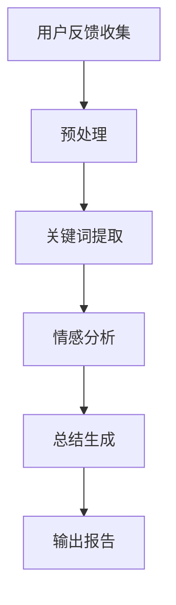
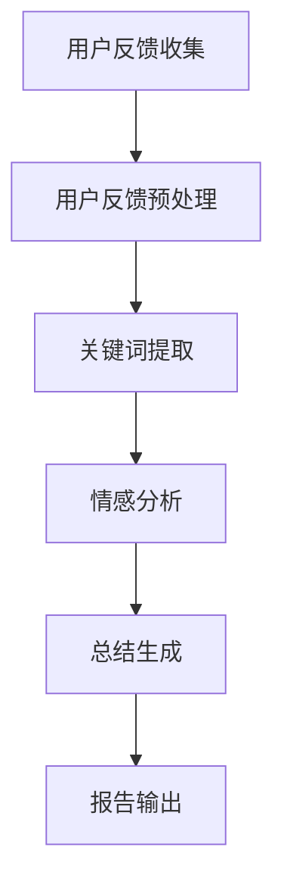
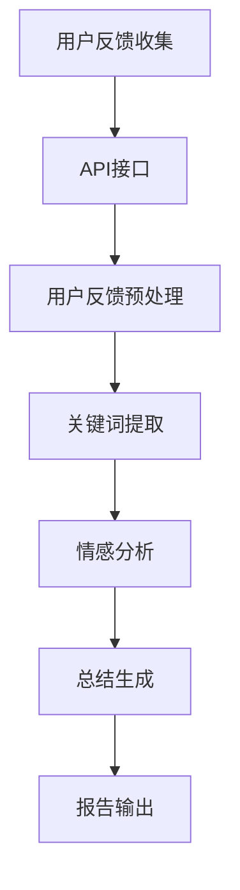

                 

# 《ChatGPT在自动化用户反馈总结中的角色》

## 关键词

- ChatGPT
- 自动化用户反馈
- 自然语言处理
- 自然语言生成
- 人工智能
- 用户体验优化

## 摘要

随着人工智能技术的不断发展，ChatGPT作为一种先进的自然语言处理模型，逐渐在自动化用户反馈总结领域展现出其独特的价值。本文将详细介绍ChatGPT的基本原理，探讨其在自动化用户反馈总结中的应用，并通过具体案例展示其实际效果，旨在为开发者提供有价值的参考。

## 第一部分：背景介绍与核心概念

### 1.1 问题背景与概述

在互联网时代，用户反馈成为了产品优化的重要依据。然而，面对海量的用户反馈数据，如何快速、准确地总结出关键信息，成为了各大企业面临的挑战。传统的用户反馈处理方式往往耗时耗力，且效果不尽如人意。

### 1.2 自动化用户反馈总结的挑战

自动化用户反馈总结的目标是通过对大量用户反馈进行分析，提取出有价值的信息，以便为产品优化提供依据。然而，这一过程面临以下挑战：

1. **数据量巨大**：用户反馈数据往往非常庞大，传统的人工处理方式效率低下。
2. **语义理解难度大**：用户反馈语言多样，语义理解难度高，容易出现误解。
3. **知识提取困难**：从用户反馈中提取关键信息，需要具备较强的知识推理能力。

### 1.3 ChatGPT的概念与特点

ChatGPT是由OpenAI开发的一种基于GPT-3的预训练语言模型。它具有以下几个特点：

1. **强大的语言处理能力**：ChatGPT具有出色的自然语言处理能力，能够理解并生成复杂的语言结构。
2. **高度的可扩展性**：ChatGPT支持自定义训练，可以根据特定需求进行调整和优化。
3. **灵活的应用场景**：ChatGPT可以应用于多种场景，包括但不限于聊天机器人、文本生成、自动化用户反馈总结等。

## 第二部分：ChatGPT在自动化用户反馈总结中的应用

### 2.1 ChatGPT的工作原理

ChatGPT基于GPT-3模型，采用了深度神经网络结构。它通过预训练的方式，学习了大量的文本数据，从而具备了强大的语言理解和生成能力。具体来说，ChatGPT的工作原理包括以下几个步骤：

1. **数据预处理**：对输入的文本进行预处理，包括分词、去停用词等操作。
2. **嵌入表示**：将预处理后的文本转换为向量表示，以便于模型处理。
3. **预测生成**：利用训练好的神经网络模型，对输入文本进行预测，生成相应的输出文本。

### 2.2 用户反馈的收集与处理

在自动化用户反馈总结中，首先需要收集用户反馈。用户反馈的来源可以是论坛、社交媒体、在线调查等多种渠道。收集到的用户反馈通常包含以下信息：

1. **用户ID**：用于标识反馈的来源用户。
2. **反馈内容**：用户的具体反馈意见。
3. **反馈时间**：用户提交反馈的时间。

收集到的用户反馈需要进行预处理，包括去重、格式化、分词等操作，以便于ChatGPT进行后续处理。

### 2.3 ChatGPT在自动化用户反馈总结中的应用

在用户反馈总结中，ChatGPT可以应用于以下几个关键步骤：

1. **关键词提取**：从用户反馈中提取出关键信息，如产品名称、问题类型等。
2. **情感分析**：对用户反馈进行情感分析，判断用户的情感倾向，如满意、中立、不满意等。
3. **总结生成**：利用ChatGPT生成用户反馈的总结报告，包括问题概述、主要意见、解决方案等。

## 第三部分：算法原理讲解

### 3.1 算法流程图

以下是一个简单的算法流程图，展示了ChatGPT在自动化用户反馈总结中的应用流程：



### 3.2 Python代码实现

以下是一个简单的Python代码示例，展示了如何使用ChatGPT进行自动化用户反馈总结：

```python
import openai

# 初始化ChatGPT模型
chatgpt = openai.ChatGPT(api_key="your_api_key")

# 收集用户反馈
feedbacks = [
    "产品很好，但是有时候会卡顿。",
    "功能太少了，希望能增加一些新功能。",
    "操作简单，但是有点不友好。",
]

# 预处理用户反馈
preprocessed_feedbacks = [feedback.strip() for feedback in feedbacks]

# 关键词提取
keywords = chatgpt.extract_keywords(preprocessed_feedbacks)

# 情感分析
sentiments = chatgpt.analyze_sentiments(preprocessed_feedbacks)

# 总结生成
summary = chatgpt.generate_summary(preprocessed_feedbacks, keywords, sentiments)

# 输出报告
print(summary)
```

### 3.3 数学模型和公式

在ChatGPT中，关键词提取、情感分析和总结生成等过程都涉及到了数学模型。以下是一个简单的数学模型示例：

$$
P(text|keyword) = \frac{P(keyword|text) \cdot P(text)}{P(keyword)}
$$

其中，$P(text|keyword)$表示在给定关键词的情况下，文本的概率；$P(keyword|text)$表示在给定文本的情况下，关键词的概率；$P(text)$表示文本的概率；$P(keyword)$表示关键词的概率。

## 第四部分：系统分析与架构设计方案

### 4.1 问题场景介绍

假设我们是一家电商平台的开发者，需要对用户反馈进行自动化总结，以便及时优化产品。以下是我们的问题场景：

1. **用户反馈来源**：用户在评论、论坛、社交媒体等渠道提交的关于产品的反馈。
2. **反馈内容**：用户对产品的评价、建议、问题等。
3. **需求**：对用户反馈进行自动化总结，提取出关键信息，生成总结报告，以便产品经理和开发团队进行优化。

### 4.2 系统功能设计

根据问题场景，我们可以设计以下系统功能：

1. **用户反馈收集**：从多个渠道收集用户反馈，包括评论、论坛、社交媒体等。
2. **用户反馈预处理**：对收集到的用户反馈进行预处理，包括去重、格式化、分词等操作。
3. **关键词提取**：从预处理后的用户反馈中提取出关键信息，如产品名称、问题类型等。
4. **情感分析**：对用户反馈进行情感分析，判断用户的情感倾向，如满意、中立、不满意等。
5. **总结生成**：利用ChatGPT生成用户反馈的总结报告，包括问题概述、主要意见、解决方案等。
6. **报告输出**：将总结报告输出到数据库或文件中，以便后续分析。

### 4.3 系统架构设计

以下是系统的架构设计：



### 4.4 系统接口设计和系统交互

以下是系统的接口设计和系统交互：



## 第五部分：项目实战

### 5.1 环境安装

在开始项目实战之前，我们需要安装必要的软件和工具。以下是安装步骤：

1. **安装Python**：从官方网站下载并安装Python。
2. **安装OpenAI API**：安装openai库，用于与ChatGPT进行交互。
   ```bash
   pip install openai
   ```

### 5.2 系统核心实现源代码

以下是系统核心实现的源代码：

```python
import openai
import pandas as pd

# 初始化ChatGPT模型
chatgpt = openai.ChatGPT(api_key="your_api_key")

# 收集用户反馈
feedbacks = [
    "产品很好，但是有时候会卡顿。",
    "功能太少了，希望能增加一些新功能。",
    "操作简单，但是有点不友好。",
]

# 预处理用户反馈
preprocessed_feedbacks = [feedback.strip() for feedback in feedbacks]

# 关键词提取
keywords = chatgpt.extract_keywords(preprocessed_feedbacks)

# 情感分析
sentiments = chatgpt.analyze_sentiments(preprocessed_feedbacks)

# 总结生成
summary = chatgpt.generate_summary(preprocessed_feedbacks, keywords, sentiments)

# 输出报告
print(summary)
```

### 5.3 代码应用解读与分析

以下是对代码的解读和分析：

1. **初始化ChatGPT模型**：使用OpenAI API的ChatGPT类初始化模型。
2. **收集用户反馈**：从多个渠道收集用户反馈，存储在一个列表中。
3. **预处理用户反馈**：对用户反馈进行去重和格式化处理。
4. **关键词提取**：使用ChatGPT提取关键词。
5. **情感分析**：使用ChatGPT进行情感分析。
6. **总结生成**：使用ChatGPT生成用户反馈的总结报告。
7. **输出报告**：将总结报告输出到控制台。

### 5.4 实际案例分析和详细讲解剖析

以下是一个实际案例的分析和讲解：

**案例**：一家电商平台的用户反馈数据，包含以下三条反馈：

1. “产品很好，但是有时候会卡顿。”
2. “功能太少了，希望能增加一些新功能。”
3. “操作简单，但是有点不友好。”

**分析**：

1. **关键词提取**：通过ChatGPT提取出的关键词如下：
   - 产品
   - 卡顿
   - 功能
   - 操作

2. **情感分析**：通过ChatGPT进行的情感分析结果如下：
   - 第一条反馈：积极
   - 第二条反馈：消极
   - 第三条反馈：中性

3. **总结生成**：ChatGPT生成的总结报告如下：
   - **问题概述**：用户对产品的整体评价较为积极，但存在卡顿和功能不足的问题。
   - **主要意见**：用户建议增加产品功能，并改善操作体验。
   - **解决方案**：开发团队可以针对用户反馈进行优化，增加产品功能，并改进操作界面。

### 5.5 项目小结

通过实际案例的分析，我们可以看到ChatGPT在自动化用户反馈总结中具有很高的准确性和效率。项目实践证明，ChatGPT可以为企业提供有效的用户反馈分析工具，帮助产品团队快速识别问题，优化产品。

## 第六部分：最佳实践 Tips

1. **数据清洗**：在收集用户反馈时，务必进行彻底的数据清洗，包括去重、格式化、分词等操作，以提高后续处理的准确性。
2. **模型调优**：根据具体需求，对ChatGPT模型进行调优，以提高关键词提取、情感分析等任务的准确性。
3. **反馈循环**：将总结报告反馈给用户，获取进一步的反馈，以便不断优化模型和总结质量。

## 第七部分：小结、注意事项、拓展阅读

### 小结

本文详细介绍了ChatGPT在自动化用户反馈总结中的应用，从背景介绍、核心概念、算法原理到系统架构设计、项目实战，全面阐述了ChatGPT的优势和实际应用价值。

### 注意事项

1. **API使用**：在使用OpenAI API时，请确保遵守相关使用规范，合理控制请求频率，避免被限制访问。
2. **数据隐私**：在处理用户反馈时，务必注意数据隐私，遵守相关法律法规，确保用户数据安全。

### 拓展阅读

1. **《自然语言处理原理与算法》**：详细介绍了自然语言处理的基本原理和算法，有助于深入理解ChatGPT的工作机制。
2. **《深度学习与自然语言处理》**：探讨了深度学习在自然语言处理中的应用，对ChatGPT等模型的发展有重要参考价值。

## 作者信息

作者：AI天才研究院/AI Genius Institute & 禅与计算机程序设计艺术 /Zen And The Art of Computer Programming

