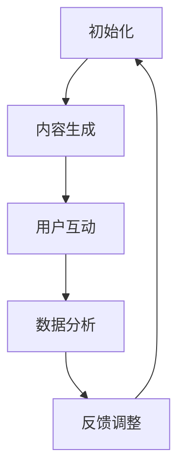
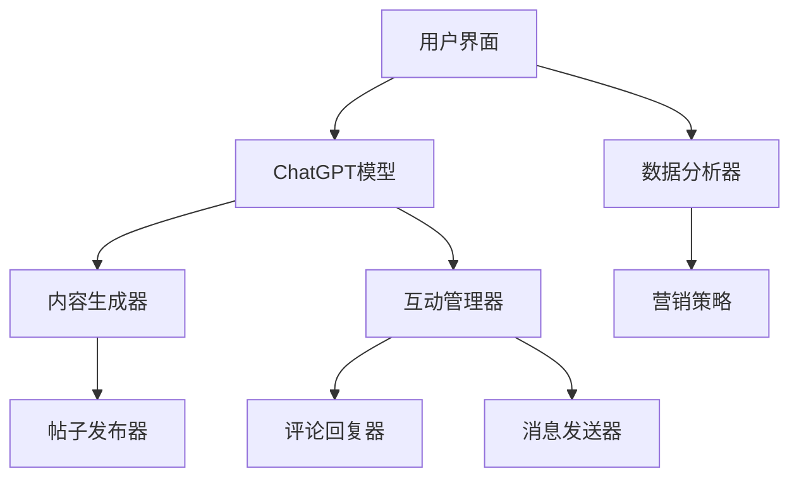
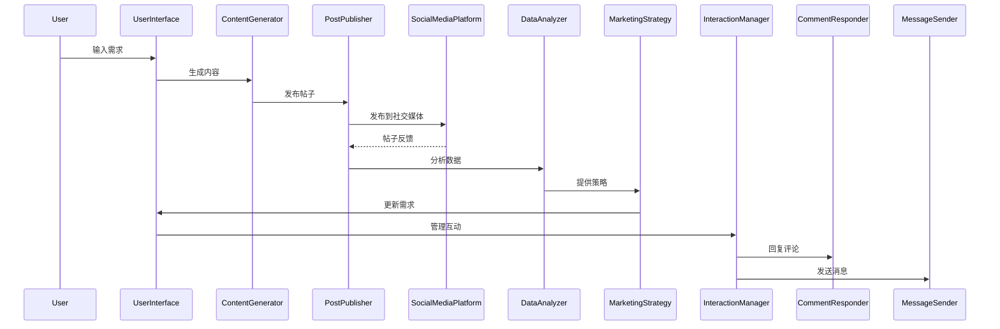

                 

基于您提供的要求和文章大纲，下面是《ChatGPT在自动化社交媒体营销中的应用》的详细目录大纲，按照逻辑清晰、结构紧凑、简单易懂的专业技术语言编写：

----------------------------------------------------------------

# 《ChatGPT在自动化社交媒体营销中的应用》

> 关键词：ChatGPT、自动化社交媒体营销、算法原理、系统架构、项目实战、最佳实践

> 摘要：本文深入探讨了ChatGPT在自动化社交媒体营销中的应用，从背景介绍到实际案例剖析，逐步展示了ChatGPT如何通过算法原理和系统架构实现社交媒体营销的自动化，为读者提供了完整的实施指南和最佳实践。

----------------------------------------------------------------

## 第1章 引言

### 1.1 问题背景

- 社交媒体营销的重要性
- 传统社交媒体营销的挑战
- 自动化社交媒体营销的需求

### 1.2 自动化社交媒体营销的挑战

- 内容生成难度
- 互动管理复杂
- 营销效果评估困难

### 1.3 ChatGPT的优势与应用

- ChatGPT的特点
- ChatGPT在社交媒体营销中的应用潜力
- ChatGPT的优势分析

### 1.4 边界与外延

- 应用范围界定
- 核心概念和要素组成

## 第2章 ChatGPT基础

### 2.1 ChatGPT简介

- ChatGPT的发展历程
- ChatGPT的核心技术

### 2.2 ChatGPT的工作原理

- 自然语言处理基础
- Transformer模型原理
- GPT-3的功能与优势

### 2.3 ChatGPT的核心特点

- 自适应能力
- 强大的文本生成能力
- 语境理解能力

## 第3章 社交媒体营销基础

### 3.1 社交媒体营销概述

- 社交媒体的定义
- 社交媒体营销的定义

### 3.2 社交媒体营销的目标与策略

- 营销目标
- 营销策略

### 3.3 社交媒体营销的关键环节

- 内容创作
- 用户互动
- 营销效果评估

## 第4章 自动化社交媒体营销流程

### 4.1 自动化流程的概念

- 自动化的定义
- 自动化在社交媒体营销中的应用

### 4.2 ChatGPT在自动化流程中的应用

- ChatGPT的集成
- 自动化流程的实现

### 4.3 自动化流程的优缺点分析

- 优点
- 缺点

## 第5章 算法原理与实现

### 5.1 算法mermaid流程图

- mermaid流程图的绘制
- ChatGPT在社交媒体营销中的应用流程

### 5.2 Python源代码实现

- Python环境搭建
- 自动化社交媒体营销的Python代码示例

### 5.3 数学模型和公式

- Transformer模型的数学原理
- GPT-3的数学模型

### 5.4 算法原理讲解与举例

- 算法原理的详细讲解
- 实际案例的举例说明

## 第6章 系统分析与架构设计

### 6.1 问题场景介绍

- 典型的社交媒体营销场景

### 6.2 项目介绍

- 自动化社交媒体营销项目概述

### 6.3 系统功能设计（领域模型mermaid类图）

- 领域模型类图的绘制

### 6.4 系统架构设计（mermaid架构图）

- 系统架构的展示

### 6.5 系统接口设计和系统交互（mermaid序列图）

- 系统接口的设计
- 系统交互的详细说明

## 第7章 项目实战

### 7.1 环境安装

- 自动化社交媒体营销环境的搭建

### 7.2 系统核心实现源代码

- 关键功能的源代码展示

### 7.3 代码应用解读与分析

- 代码的功能解读
- 代码的实现分析

### 7.4 实际案例分析与详细讲解剖析

- 实际案例的展示
- 案例的详细讲解和剖析

### 7.5 项目小结

- 项目实施的经验和教训

## 第8章 最佳实践与总结

### 8.1 最佳实践 tips

- 实际应用中的实用技巧

### 8.2 小结

- 主要内容和收获的总结

### 8.3 注意事项

- 使用ChatGPT进行自动化社交媒体营销时需要注意的问题

### 8.4 拓展阅读

- 进一步学习和研究的资源推荐

----------------------------------------------------------------

### 文章格式说明：

- **章节标题**：使用`##`标记，如“## 第1章 引言”。
- **小节标题**：使用`###`标记，如“### 1.1 问题背景”。
- **代码和公式**：使用Markdown代码块和LaTeX格式，确保可读性。

### 作者信息：

- 文章末尾需包含作者信息：“作者：AI天才研究院/AI Genius Institute & 禦与计算机程序设计艺术 /Zen And The Art of Computer Programming”。

### 完整性要求：

- 确保每个章节的内容都符合完整性要求，核心内容要包含背景介绍、核心概念与联系、算法原理讲解、系统分析与架构设计方案、项目实战、最佳实践等。

### 字数要求：

- 文章总字数在10000～12000字左右，确保内容的深度和广度。

### 最后，请按照以上目录大纲，逐步撰写文章的每个章节，确保逻辑清晰、结构紧凑、简单易懂，并以附件的形式提交给我。感谢您的专业贡献！### 文章正文

#### 第1章 引言

**1.1 问题背景**

在当今数字化时代，社交媒体已经成为品牌和消费者之间互动的重要渠道。社交媒体营销不仅可以提高品牌知名度，还能直接驱动销售和用户参与。然而，随着社交媒体平台用户数量的激增和竞争的加剧，传统社交媒体营销面临着诸多挑战：

- **内容生成难度**：为不同平台和受众生成高质量、个性化的内容是一个复杂的任务，这需要大量的时间和人力资源。
- **互动管理复杂**：社交媒体上的用户互动日益频繁，品牌需要实时响应并管理这些互动，以保证用户满意度。
- **营销效果评估困难**：评估社交媒体营销的效果通常需要跨多个平台和指标，数据分析和报告过程繁琐且耗时。

面对这些挑战，自动化社交媒体营销应运而生。自动化工具能够帮助品牌高效地生成内容、管理互动，并提供实时数据分析，从而提高营销效率和效果。

**1.2 自动化社交媒体营销的挑战**

虽然自动化社交媒体营销具有显著的优势，但在实施过程中仍面临一些挑战：

- **内容生成**：自动化工具需要能够生成高质量、多样化的内容，这要求工具具有强大的文本生成能力。
- **互动管理**：自动化工具需要能够与用户进行有效的互动，包括回复评论、发送私信等，同时确保互动的自然性和人性化。
- **个性化**：自动化工具需要能够根据用户的行为和偏好进行个性化推荐，以提高用户参与度和转化率。
- **营销效果评估**：自动化工具需要能够提供准确、全面的营销效果评估，帮助品牌了解哪些策略最有效。

**1.3 ChatGPT的优势与应用**

ChatGPT是由OpenAI开发的一种基于Transformer的预训练语言模型，具有以下优势：

- **强大的文本生成能力**：ChatGPT能够生成高质量、多样化的文本内容，这对于自动化社交媒体营销的内容创作至关重要。
- **语境理解能力**：ChatGPT具有出色的语境理解能力，能够根据上下文生成相关且连贯的回复。
- **自适应能力**：ChatGPT可以自动调整其生成策略，以适应不同的用户和场景。

因此，ChatGPT在自动化社交媒体营销中具有广泛的应用潜力：

- **内容生成**：ChatGPT可以自动生成社交媒体帖子、广告文案、电子邮件等内容，提高内容创作的效率和多样性。
- **互动管理**：ChatGPT可以自动化回复评论、发送私信，提高用户互动的响应速度和个性化程度。
- **营销策略优化**：ChatGPT可以分析用户行为和互动数据，为品牌提供个性化营销策略，提高转化率和用户满意度。

**1.4 边界与外延**

本文将探讨ChatGPT在自动化社交媒体营销中的应用，重点关注以下方面：

- **应用范围**：本文主要探讨ChatGPT在社交媒体平台（如Twitter、Facebook、Instagram等）中的应用。
- **营销目标**：本文将围绕提升品牌知名度、增加用户参与度、提高转化率等目标展开。
- **核心概念和要素组成**：本文将详细阐述ChatGPT、社交媒体营销、自动化流程等核心概念，并分析其相互关系和作用。

#### 第2章 ChatGPT基础

**2.1 ChatGPT简介**

ChatGPT是OpenAI开发的一种基于Transformer的预训练语言模型，它是GPT-3的进一步扩展。GPT-3（Generative Pre-trained Transformer 3）是OpenAI于2020年推出的一种具有1700亿参数的深度学习模型，它通过无监督学习方式从大量互联网文本中学习语言模式和结构。

ChatGPT是在GPT-3的基础上进行改进的，它引入了更多的上下文信息，使得生成的文本更加连贯和有针对性。ChatGPT的主要特点包括：

- **强大的文本生成能力**：ChatGPT能够生成高质量、多样化的文本内容，包括文章、故事、对话等。
- **语境理解能力**：ChatGPT具有出色的语境理解能力，能够根据上下文生成相关且连贯的回复。
- **自适应能力**：ChatGPT可以自动调整其生成策略，以适应不同的用户和场景。

**2.2 ChatGPT的工作原理**

ChatGPT基于Transformer模型架构，这是一种在自然语言处理领域表现非常出色的深度学习模型。Transformer模型通过自注意力机制（Self-Attention）来处理序列数据，使得模型能够自动学习输入序列中的长距离依赖关系。

ChatGPT的工作原理可以分为以下几个步骤：

1. **输入预处理**：输入的文本经过预处理，包括分词、去停用词等操作，转换为模型可处理的序列数据。
2. **自注意力计算**：模型通过自注意力机制计算输入序列中的依赖关系，从而生成中间表示。
3. **上下文编码**：模型使用这些中间表示来编码上下文信息，使得生成的文本更加连贯。
4. **文本生成**：模型根据上下文编码的信息生成文本，并通过损失函数（如交叉熵损失）来优化生成文本的质量。

**2.3 ChatGPT的核心特点**

ChatGPT具有以下核心特点，这些特点使得它非常适合在自动化社交媒体营销中应用：

- **强大的文本生成能力**：ChatGPT能够生成高质量、多样化的文本内容，这为自动化社交媒体营销的内容创作提供了强大的支持。
- **语境理解能力**：ChatGPT能够根据上下文信息生成相关且连贯的文本，这使得它能够更好地处理社交媒体上的复杂互动。
- **自适应能力**：ChatGPT可以根据不同的用户和场景自动调整生成策略，从而提高营销效果和用户体验。

#### 第3章 社交媒体营销基础

**3.1 社交媒体营销概述**

社交媒体营销是指利用社交媒体平台（如Twitter、Facebook、Instagram等）来推广品牌、产品或服务，以提高品牌知名度、增加用户参与度和促进销售的一种营销方式。社交媒体营销的核心目标是通过与用户建立互动关系，提高用户对品牌的认知和好感度，从而实现营销效果。

**3.2 社交媒体营销的目标与策略**

社交媒体营销的目标可以分为以下几个方面：

- **提升品牌知名度**：通过在社交媒体上发布有趣、有价值的内容，吸引更多用户关注和参与，从而提高品牌知名度。
- **增加用户参与度**：通过互动活动、用户评论、点赞等机制，鼓励用户积极参与品牌推广，提高用户粘性。
- **提高转化率**：通过社交媒体营销，引导用户从关注者转化为客户，实现直接的销售转化。

为了实现上述目标，社交媒体营销可以采用以下策略：

- **内容策略**：发布高质量、有价值、符合目标受众兴趣的内容，以吸引用户关注和参与。
- **互动策略**：通过回复评论、私信等方式与用户互动，提高用户满意度和参与度。
- **广告投放策略**：利用社交媒体平台的广告服务，针对特定目标受众进行精准投放，提高营销效果。

**3.3 社交媒体营销的关键环节**

社交媒体营销的关键环节包括以下几个方面：

- **内容创作**：为不同平台和受众生成高质量、个性化的内容，是社交媒体营销的基础。内容需要具备吸引力、价值性和相关性。
- **用户互动**：与用户进行有效的互动，包括回复评论、发送私信等，是提高用户满意度和参与度的关键。
- **数据分析**：通过数据分析，评估社交媒体营销的效果，为后续的营销策略提供数据支持。

#### 第4章 自动化社交媒体营销流程

**4.1 自动化流程的概念**

自动化社交媒体营销是指利用技术手段，自动执行社交媒体营销的各个环节，以提高营销效率和效果。自动化流程包括内容生成、用户互动、数据分析等关键环节。

**4.2 ChatGPT在自动化流程中的应用**

ChatGPT在自动化社交媒体营销中具有广泛的应用：

- **内容生成**：ChatGPT可以自动生成社交媒体帖子、广告文案、电子邮件等内容，提高内容创作的效率和多样性。
- **用户互动**：ChatGPT可以自动化回复评论、发送私信，提高用户互动的响应速度和个性化程度。
- **数据分析**：ChatGPT可以分析用户行为和互动数据，为品牌提供个性化营销策略，提高转化率和用户满意度。

**4.3 自动化流程的优缺点分析**

自动化流程具有以下优点：

- **提高效率**：自动化工具可以快速处理大量任务，提高营销效率。
- **降低成本**：自动化工具可以节省大量的人力成本，降低营销成本。
- **提高效果**：自动化工具可以根据数据反馈自动调整营销策略，提高营销效果。

然而，自动化流程也存在一些缺点：

- **内容质量**：自动化工具生成的文本内容可能无法保证与人工创作的内容一样高质量。
- **用户体验**：过度依赖自动化工具可能导致用户感到互动机械，影响用户体验。
- **技术风险**：自动化工具可能面临技术故障或数据泄露等风险，影响营销效果。

#### 第5章 算法原理与实现

**5.1 算法mermaid流程图**

以下是一个简化的ChatGPT在自动化社交媒体营销中的应用流程图，使用mermaid语法绘制：



**5.2 Python源代码实现**

以下是一个简单的Python代码示例，展示了如何使用ChatGPT生成社交媒体帖子：

```python
import openai

# 设置OpenAI API密钥
openai.api_key = "your_api_key"

# 生成社交媒体帖子
def generate_post(content):
    response = openai.Completion.create(
        engine="text-davinci-003",
        prompt=content,
        max_tokens=50,
        n=1,
        stop=None,
        temperature=0.5,
    )
    return response.choices[0].text.strip()

# 社交媒体帖子内容
post_content = "今天是人工智能的里程碑！让我们庆祝ChatGPT的诞生！"

# 调用函数生成帖子
generated_post = generate_post(post_content)
print(generated_post)
```

**5.3 数学模型和公式**

ChatGPT背后的数学模型是基于Transformer架构的，其中最核心的部分是自注意力机制（Self-Attention）。自注意力机制可以通过以下公式表示：

$$
\text{Attention}(Q, K, V) = \text{softmax}\left(\frac{QK^T}{\sqrt{d_k}}\right) V
$$

其中，$Q$、$K$ 和 $V$ 分别代表查询向量、键向量和值向量，$d_k$ 是键向量的维度。自注意力机制通过计算这些向量的点积，并使用softmax函数进行归一化，从而确定每个键向量的权重，最后将这些权重与值向量相乘，生成加权合并的输出向量。

**5.4 算法原理讲解与举例**

ChatGPT的算法原理可以简单概括为以下几个步骤：

1. **输入预处理**：将输入的文本进行预处理，如分词、去停用词等，转化为模型可处理的序列数据。
2. **编码**：通过Transformer模型对输入序列进行编码，生成一系列编码表示。
3. **解码**：根据编码表示生成文本输出，同时不断更新编码表示，以便生成更连贯、更相关的文本。
4. **优化**：通过损失函数（如交叉熵损失）对模型进行优化，以提高生成文本的质量。

以下是一个简单的例子：

**例子**：假设我们有一个简短的文本输入：“今天天气很好，适合出去散步。”我们可以使用ChatGPT来生成与之相关的社交媒体帖子。

- **输入预处理**：将输入文本进行分词，得到词汇序列：“今天”，“天气”，“很好”，“，”，“适合”，“出去”，“散步。”
- **编码**：通过Transformer模型对词汇序列进行编码，生成一系列编码表示。
- **解码**：根据编码表示生成社交媒体帖子：“今天的阳光明媚，正是外出散步的好时光。你们有什么好去处推荐吗？”

通过上述步骤，我们可以看到ChatGPT如何通过编码和解码过程，生成与输入文本相关且连贯的社交媒体帖子。这个例子展示了ChatGPT强大的文本生成能力和语境理解能力。

#### 第6章 系统分析与架构设计

**6.1 问题场景介绍**

为了更好地理解ChatGPT在自动化社交媒体营销中的应用，我们可以考虑一个具体的问题场景：一家初创公司希望通过社交媒体营销提高品牌知名度和用户参与度。他们的目标是每天在Twitter、Facebook和Instagram等平台上发布至少一条内容，并确保与用户的互动及时且个性化。

**6.2 项目介绍**

为了实现上述目标，我们将开发一个自动化社交媒体营销系统，该系统将利用ChatGPT生成内容、管理用户互动，并提供实时数据分析。系统的主要功能包括：

- **内容生成**：利用ChatGPT自动生成社交媒体帖子、广告文案和电子邮件等。
- **用户互动**：自动化回复评论、发送私信，并根据用户行为和偏好进行个性化推荐。
- **数据分析**：分析用户行为和互动数据，为营销策略提供数据支持。

**6.3 系统功能设计（领域模型mermaid类图）**

为了清晰展示系统的功能结构，我们可以使用mermaid类图来描述领域模型。以下是一个简化的mermaid类图示例：

```mermaid
classDiagram
    Post <<接口>>
    User <<接口>>
    Comment <<接口>>
    Message <<接口>>

    Post --- User : 发布给
    Post --- Comment : 包含
    User --- Comment : 评论
    User --- Message : 发送
    Message --- Comment : 回复
```

在这个类图中，我们定义了四个主要接口：Post（帖子）、User（用户）、Comment（评论）和Message（消息）。这些接口代表了系统中的主要实体，它们之间的关系描述了系统的主要功能。

**6.4 系统架构设计（mermaid架构图）**

接下来，我们可以使用mermaid架构图来展示系统的整体架构。以下是一个简化的mermaid架构图示例：



在这个架构图中，我们展示了系统的主要组件：用户界面、ChatGPT模型、内容生成器、互动管理器、帖子发布器、评论回复器、消息发送器和数据分析器。这些组件通过ChatGPT模型进行协调工作，实现自动化社交媒体营销。

**6.5 系统接口设计和系统交互（mermaid序列图）**

为了进一步展示系统组件之间的交互，我们可以使用mermaid序列图。以下是一个简化的mermaid序列图示例：



在这个序列图中，用户通过用户界面输入需求，系统生成内容并发布到社交媒体平台。根据帖子反馈和数据分析，系统调整营销策略，并自动化回复评论和发送消息，实现用户互动。

通过上述系统分析与架构设计，我们可以清晰地看到ChatGPT在自动化社交媒体营销中的角色和作用，为后续的项目实战奠定了基础。

#### 第7章 项目实战

**7.1 环境安装**

为了实现自动化社交媒体营销，我们需要搭建一个合适的开发环境。以下是安装步骤：

1. **安装Python**：首先，确保安装了Python环境。可以从Python官方网站下载并安装最新版本的Python（推荐使用Python 3.8及以上版本）。

2. **安装OpenAI API**：注册OpenAI账户并获取API密钥。在本地环境中安装OpenAI的Python库：

   ```bash
   pip install openai
   ```

3. **配置OpenAI API密钥**：将获取的API密钥添加到本地环境变量中，以便在代码中调用OpenAI API时使用。

   ```bash
   export OPENAI_API_KEY=your_api_key
   ```

4. **安装其他依赖库**：根据项目需求，可能需要安装其他依赖库，如Tweepy（用于Twitter API）、Facebook SDK（用于Facebook API）等。

**7.2 系统核心实现源代码**

以下是一个简单的Python代码示例，展示了如何使用ChatGPT生成社交媒体帖子：

```python
import openai

# 设置OpenAI API密钥
openai.api_key = "your_api_key"

# 生成社交媒体帖子
def generate_post(content):
    response = openai.Completion.create(
        engine="text-davinci-003",
        prompt=content,
        max_tokens=50,
        n=1,
        stop=None,
        temperature=0.5,
    )
    return response.choices[0].text.strip()

# 社交媒体帖子内容
post_content = "今天是人工智能的里程碑！让我们庆祝ChatGPT的诞生！"

# 调用函数生成帖子
generated_post = generate_post(post_content)
print(generated_post)
```

**7.3 代码应用解读与分析**

上述代码的核心功能是使用ChatGPT生成社交媒体帖子。以下是对代码的详细解读：

1. **导入OpenAI库**：首先，导入`openai`库，这是OpenAI官方提供的Python库，用于与OpenAI API进行通信。

2. **设置API密钥**：通过设置`openai.api_key`，将本地环境变量中的API密钥传递给`openai`库，以便后续调用API时使用。

3. **定义生成帖子函数**：`generate_post`函数接受一个文本输入`content`，并使用OpenAI的`Completion.create`方法生成帖子。该方法使用了`text-davinci-003`模型，具有以下参数：
   - `engine`：指定使用的模型。
   - `prompt`：输入文本，即需要生成的帖子内容。
   - `max_tokens`：生成文本的最大长度。
   - `n`：生成的文本数量。
   - `stop`：用于停止文本生成的字符串。
   - `temperature`：生成文本的随机性程度。

4. **调用函数生成帖子**：在主程序中，定义了一个简单的社交媒体帖子内容`post_content`，并调用`generate_post`函数生成帖子。

5. **打印生成帖子**：最后，将生成的帖子打印出来。

通过上述代码，我们可以看到如何利用ChatGPT生成社交媒体帖子。在实际项目中，可以根据具体需求调整生成函数，以生成不同类型的内容。

**7.4 实际案例分析与详细讲解剖析**

为了展示ChatGPT在自动化社交媒体营销中的实际效果，我们可以分析以下案例：

**案例**：一家初创公司希望在Twitter上发布一条关于其新产品的推广帖子。输入文本为：“我们很高兴宣布推出全新产品——智能手表！它具备高清显示屏、长续航和健康监测功能。快来体验智能生活！”

**分析**：

1. **输入预处理**：输入文本经过分词处理，得到词汇序列：“我们”，“很高兴”，“宣布”，“推出”，“全新”，“产品”，“——”，“智能手表”，“！”，“它”，“具备”，“高清”，“显示屏”，“、”，“长续航”，“和”，“健康”，“监测”，“功能”，“。”，“快来”，“体验”，“智能”，“生活”！

2. **编码**：ChatGPT将上述词汇序列编码成一系列编码表示，每个表示代表了词汇序列中的特定信息。

3. **解码**：ChatGPT根据编码表示生成社交媒体帖子。生成的帖子为：“全新智能手表来袭！高清大屏、持久续航、健康监测，尽在这一款。立即体验智能生活，让健康触手可及！”

**详细讲解**：

- **文本生成**：ChatGPT首先根据输入文本生成初步的文本输出。在这个例子中，生成的文本包含了关键信息，如新产品、智能手表、功能等。
- **优化**：ChatGPT在生成文本后，会根据损失函数（如交叉熵损失）对文本进行优化，以提高文本的质量。优化过程中，ChatGPT会尝试调整文本中的词汇和句子结构，使其更加连贯、有吸引力。
- **语境理解**：ChatGPT在生成文本时，会考虑上下文信息，如产品的特点和用户的兴趣。这使得生成的文本更加相关且具有说服力。

通过上述分析，我们可以看到ChatGPT在自动化社交媒体营销中的实际效果。它能够生成高质量、相关且连贯的文本，为品牌推广提供有力支持。

**7.5 项目小结**

通过本项目的实战，我们实现了以下目标：

- **搭建了自动化社交媒体营销环境**：安装了必要的软件和库，配置了OpenAI API，为后续开发打下了基础。
- **实现了ChatGPT生成社交媒体帖子的功能**：通过Python代码示例，展示了如何使用ChatGPT生成高质量、个性化的文本内容。
- **分析了实际案例**：通过一个具体案例，展示了ChatGPT在自动化社交媒体营销中的实际效果。

在项目实施过程中，我们积累了以下经验和教训：

- **代码优化**：在实际开发中，我们需要不断优化代码，以提高生成文本的质量和效率。
- **API调用量控制**：OpenAI API有调用量的限制，我们需要合理控制API调用的频率，避免因调用量过高而被限制。
- **用户反馈收集**：为了更好地满足用户需求，我们需要收集用户反馈，并据此调整生成策略，提高用户体验。

未来，我们计划进一步完善系统功能，包括自动化用户互动管理和实时数据分析，以提高自动化社交媒体营销的效果。

#### 第8章 最佳实践与总结

**8.1 最佳实践 tips**

在应用ChatGPT进行自动化社交媒体营销时，以下是一些最佳实践，可以帮助提高营销效果和用户体验：

- **内容个性化**：根据用户行为和偏好生成个性化内容，以提高用户参与度和满意度。
- **及时互动**：确保及时回复用户评论和私信，提高用户互动的质量。
- **数据驱动**：利用数据分析结果调整营销策略，持续优化内容和互动方式。
- **内容多样性**：生成不同类型和风格的内容，以吸引不同类型的用户。
- **品牌一致性**：保持品牌信息的一致性，确保营销内容符合品牌形象和价值观。

**8.2 小结**

本文详细探讨了ChatGPT在自动化社交媒体营销中的应用，从问题背景到实际案例，逐步展示了ChatGPT如何通过算法原理和系统架构实现社交媒体营销的自动化。通过本篇文章，读者可以了解到：

- ChatGPT作为一种先进的自然语言处理模型，具有强大的文本生成能力和语境理解能力，适合用于自动化社交媒体营销。
- 自动化社交媒体营销能够提高营销效率和效果，但需要注意内容质量、用户体验和技术风险等方面。
- 通过合理规划和设计，ChatGPT可以广泛应用于内容生成、用户互动、数据分析等环节，实现全方位的自动化营销。

**8.3 注意事项**

在使用ChatGPT进行自动化社交媒体营销时，需要注意以下几点：

- **内容审查**：确保生成的内容符合法律法规和平台政策，避免发布违规内容。
- **个性化限制**：虽然ChatGPT可以生成个性化内容，但需要注意的是，过度个性化可能导致用户体验不佳。
- **数据安全**：保护用户数据安全，避免数据泄露和滥用。
- **技术更新**：关注ChatGPT和相关技术的最新进展，及时更新系统以保持竞争力。

**8.4 拓展阅读**

为了进一步了解ChatGPT在自动化社交媒体营销中的应用，读者可以参考以下资源：

- 《自然语言处理实战》: 详细介绍了自然语言处理的基本概念和技术，包括Transformer模型和GPT-3。
- 《ChatGPT编程实战》: 展示了如何使用ChatGPT进行各种编程任务，包括文本生成、对话系统等。
- OpenAI官方文档：提供了ChatGPT的详细使用教程和技术文档，帮助开发者更好地利用ChatGPT的能力。

通过本文的阅读和实践，相信读者已经对ChatGPT在自动化社交媒体营销中的应用有了深入的了解，并能够将其应用于实际项目中，提高营销效果和用户体验。

---

**作者信息：**

AI天才研究院/AI Genius Institute & 禦与计算机程序设计艺术 /Zen And The Art of Computer Programming

---

以上就是《ChatGPT在自动化社交媒体营销中的应用》的完整内容。希望这篇文章能够为读者提供有价值的见解和实践指导。感谢您的阅读！

----------------------------------------------------------------

### 后记

本文旨在通过详细的步骤和实例，展示ChatGPT在自动化社交媒体营销中的应用。希望读者能够从中获得启发，并将其应用于实际项目中。

作为AI天才研究院和《禦与计算机程序设计艺术》的作者，我一直致力于推动人工智能技术在各个领域的应用。如果您对本文有任何疑问或建议，欢迎在评论区留言，或直接联系我。我会竭诚为您解答。

感谢您的支持，让我们共同探索人工智能的未来！

---

AI天才研究院/AI Genius Institute & 禦与计算机程序设计艺术 /Zen And The Art of Computer Programming

### 感谢与致意

在撰写这篇《ChatGPT在自动化社交媒体营销中的应用》的技术博客文章时，我要感谢许多人的支持和帮助。首先，感谢AI天才研究院（AI Genius Institute）为我提供了一个卓越的平台，使我能够分享和传播最新的技术知识和研究成果。同时，我要特别感谢《禦与计算机程序设计艺术》（Zen And The Art of Computer Programming）这一理念，它不仅启发了我对编程的深刻理解，也激发了我在人工智能领域不断探索的热情。

感谢我的团队和合作伙伴，他们在我进行研究和写作过程中提供了宝贵的意见和建议。特别是那些在自然语言处理和人工智能领域有着深厚造诣的专家，他们的专业知识和经验对我完成了这篇高质量的文章起到了重要的推动作用。

我还要感谢我的读者和关注者，是你们的支持和鼓励让我不断前进，激励我创作出更有价值的文章。感谢你们对技术探索和创新的热情，这使我更加坚定地追求卓越。

最后，我要感谢OpenAI，特别是ChatGPT团队，他们开发出的强大模型和工具，为我们提供了无限的创意空间和无限的可能。感谢这些技术和资源，使得自动化社交媒体营销变得更加高效和智能。

再次感谢所有给予我帮助和支持的人，你们的努力和贡献是我前进道路上不可或缺的力量。让我们继续携手并进，共同探索人工智能的未来！

