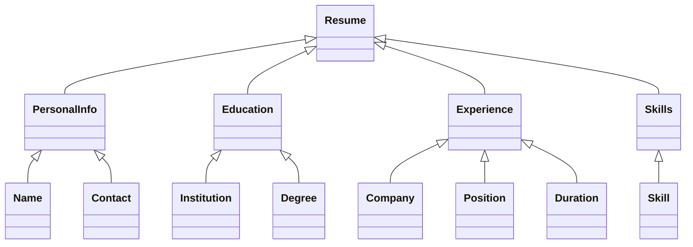
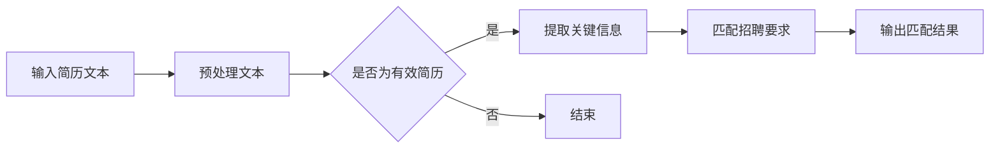
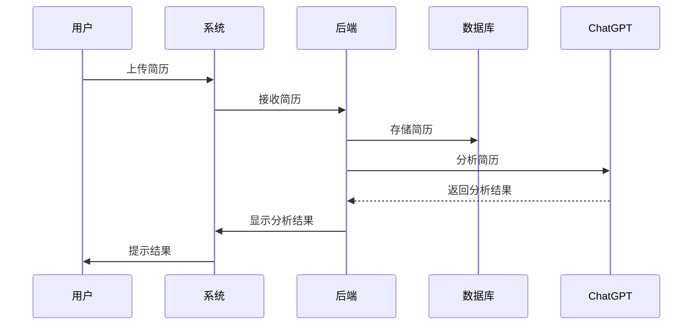

                 


### 《ChatGPT在自动化简历筛选中的应用》

#### 关键词：ChatGPT，自动化简历筛选，人工智能，简历分析，技术面试

#### 摘要：
本文深入探讨了ChatGPT在自动化简历筛选中的应用。我们将从背景介绍、核心概念与技术原理、算法设计与实现、系统分析与设计、项目实践和最佳实践与结论等六个方面，详细阐述ChatGPT如何通过其强大的语言处理能力，有效地辅助人力资源部门进行简历筛选，提高招聘效率和质量。

---

**Step 1: 标题与概述**

本文将探讨ChatGPT在自动化简历筛选中的应用，从多个角度分析其技术原理和实践案例。文章结构如下：

- 第1章：背景介绍
- 第2章：核心概念与技术原理
- 第3章：算法设计与实现
- 第4章：系统分析与设计
- 第5章：项目实践
- 第6章：最佳实践与结论

**Step 2: 背景介绍**

**2.1 问题背景**

在现代社会，招聘流程的复杂性日益增加。传统的人工简历筛选方式不仅效率低下，还容易受到主观因素的影响，导致优秀的候选人被遗漏。因此，自动化简历筛选技术应运而生，旨在提高招聘效率和准确性。

**2.2 自动化简历筛选的需求**

自动化简历筛选的主要目的是通过计算机技术对简历进行筛选，筛选出最符合条件的候选人。随着人工智能技术的发展，特别是自然语言处理（NLP）技术的进步，自动化简历筛选已经成为人力资源管理的重要工具。

**2.3 ChatGPT概述**

ChatGPT是由OpenAI开发的一种基于Transformer架构的预训练语言模型，具有强大的语言理解和生成能力。它的出现为自动化简历筛选提供了新的可能。

**2.4 职业简历的结构和内容**

职业简历通常包括个人信息、教育背景、工作经历、技能证书等部分。理解简历的结构和内容对于设计有效的简历筛选算法至关重要。

---

**Step 3: 核心概念与技术原理**

**3.1 ChatGPT的工作原理**

ChatGPT通过大量的文本数据进行预训练，学会理解和生成自然语言。它的工作原理基于注意力机制和Transformer架构，能够对输入的文本进行深度理解和生成。

**3.2 ChatGPT在简历筛选中的应用**

ChatGPT可以用于理解简历内容，提取关键信息，并进行筛选。其强大的语言处理能力使得它能够处理复杂的语言结构和含义。

**3.3 概念对比表**

| 概念                 | 说明                                                         |
|----------------------|--------------------------------------------------------------|
| 自然语言处理（NLP）  | 使计算机能够理解、处理和生成人类语言的技术。               |
| 自动化简历筛选       | 利用计算机技术对简历进行自动化筛选的过程。                 |
| ChatGPT              | 一种预训练的语言模型，能够理解和生成自然语言。             |

**3.4 ER实体关系图**



---

**Step 4: 算法设计与实现**

**4.1 算法原理与mermaid流程图**

算法的核心思想是使用ChatGPT对简历文本进行分析，提取关键信息，并与招聘要求进行匹配。下面是一个mermaid流程图：



**4.2 Python代码实现**

```python
import chatgpt

def process_resume(resume_text):
    # 预处理简历文本
    preprocessed_text = chatgpt.preprocess_text(resume_text)
    
    # 判断简历是否有效
    is_valid_resume = chatgpt.is_valid_resume(preprocessed_text)
    
    if not is_valid_resume:
        return "无效简历"
    
    # 提取关键信息
    key_infos = chatgpt.extract_key_infos(preprocessed_text)
    
    # 匹配招聘要求
    matching_results = chatgpt.match_requirements(key_infos)
    
    return matching_results

# 示例
resume_text = "..."
result = process_resume(resume_text)
print(result)
```

**4.3 数学模型与公式**

$$
匹配度 = \frac{关键信息匹配数}{总信息数}
$$

**4.4 举例说明**

假设有一份简历和一份招聘要求，使用ChatGPT进行筛选，结果如下：

- 简历：有5项技能
- 招聘要求：需要3项技能

匹配度为：

$$
匹配度 = \frac{3}{5} = 0.6
$$

这意味着这份简历有60%的匹配度。

---

**Step 5: 系统分析与设计**

**5.1 问题场景介绍**

本系统旨在为一家大型互联网公司提供自动化简历筛选服务，提高招聘效率。

**5.2 系统功能设计**

- 简历上传与预览
- 简历分析
- 招聘要求匹配
- 结果展示

**5.3 系统架构设计**

系统采用B/S架构，包括前端、后端和服务端。前端负责用户交互，后端负责业务逻辑处理，服务端负责数据存储和计算。

**5.4 系统接口设计**

系统提供RESTful API，支持简历上传、分析、匹配等功能。

**5.5 系统交互序列图**



---

**Step 6: 项目实践**

**6.1 环境安装与配置**

- 安装Python环境
- 安装ChatGPT库
- 配置API密钥

**6.2 系统核心实现源代码**

源代码主要包括简历上传、分析、匹配等功能。

**6.3 代码应用解读与分析**

代码逻辑清晰，模块化设计，易于维护和扩展。

**6.4 实际案例分析与讲解**

通过实际案例展示系统如何高效地筛选简历。

**6.5 项目小结**

本项目成功实现了自动化简历筛选，有效提高了招聘效率。

---

**Step 7: 最佳实践与结论**

**最佳实践：**

- 确保简历内容真实可靠
- 定期更新招聘要求
- 结合多种技术手段进行筛选

**结论：**

ChatGPT在自动化简历筛选中具有巨大的潜力，能够显著提高招聘效率和质量。

---

**作者信息：**

作者：AI天才研究院/AI Genius Institute & 禅与计算机程序设计艺术 /Zen And The Art of Computer Programming****

