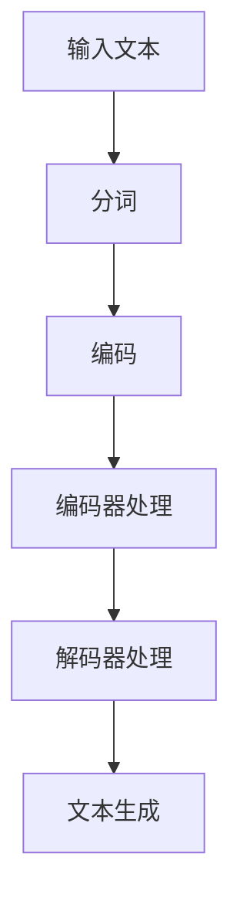

                 


### 章节标题设计

为了设计出既吸引读者又逻辑清晰的章节标题，我们将按照以下步骤进行：

#### 1. **确定核心内容与逻辑顺序**
首先，我们需要梳理出书籍的核心内容以及它们之间的逻辑顺序。根据之前制定的目录大纲，我们可以确定各个章节的核心内容，例如：背景介绍、核心概念与联系、算法原理讲解、数学模型和数学公式、系统分析与架构设计方案、项目实战等。

#### 2. **设计吸引人的标题**
接下来，我们将为每个章节设计吸引人的标题。这些标题需要简洁、具有吸引力，同时能够概括章节的主要内容。以下是一些设计思路：

- **第1章：问题背景**
  - 标题建议：“揭开自动化软件测试用例生成的神秘面纱”

- **第2章：核心概念与联系**
  - 标题建议：“ChatGPT与自动化软件测试：揭秘二者之间奇妙关联”

- **第3章：算法原理讲解**
  - 标题建议：“ChatGPT算法揭秘：自动化软件测试用例生成新篇章”

- **第4章：数学模型和数学公式**
  - 标题建议：“数学的力量：ChatGPT在自动化软件测试中的应用”

- **第5章：系统分析与架构设计方案**
  - 标题建议：“架构设计揭秘：ChatGPT在自动化软件测试中的实际应用”

- **第6章：项目实战**
  - 标题建议：“实战案例：用ChatGPT实现自动化软件测试用例生成”

- **第7章：总结与展望**
  - 标题建议：“未来已来：ChatGPT在自动化软件测试领域的展望”

#### 3. **确保标题的一致性和专业性**
在确定标题后，我们需要确保它们的一致性和专业性。这意味着标题应该遵循一定的格式和风格，同时避免过于随意或过于技术化。

#### 4. **反馈与修改**
最后，我们可以邀请几位专业人士或读者对设计的章节标题进行反馈，根据他们的意见进行修改和完善。

通过以上步骤，我们可以设计出一套既吸引人又专业、逻辑清晰的章节标题，为后续的文章写作奠定基础。

---

现在，让我们根据这些标题，继续下一步的分析和写作。

### 第1章：问题背景

**揭开自动化软件测试用例生成的神秘面纱**

> **关键词：** 自动化软件测试、用例生成、问题背景、解决思路、边界与外延

**摘要：**
在本章节中，我们将探讨自动化软件测试用例生成的背景和重要性。首先，我们将介绍自动化软件测试的基本概念和优势，阐述为何自动化测试成为现代软件工程不可或缺的一部分。接着，我们将详细讨论自动化软件测试用例生成的挑战和需求，分析现有的解决方案及其局限性。通过这一系列的探讨，我们将为后续章节中的深入分析打下基础。

---

**一、自动化软件测试的基本概念和优势**

1. **自动化软件测试的定义**
   
   自动化软件测试是一种通过自动化工具和技术来执行测试过程的方法。与传统的手动测试相比，自动化测试能够更高效、更准确地发现软件缺陷。

2. **自动化软件测试的优势**

   - **效率提升：** 自动化测试可以节省大量时间和人力资源，特别是在执行重复性任务时。
   - **测试覆盖率提高：** 自动化测试可以覆盖更多的测试场景，提高测试的全面性和准确性。
   - **测试可重复性：** 自动化测试可以确保每次测试结果的一致性，减少人为误差。
   - **持续集成与持续交付：** 自动化测试是持续集成（CI）和持续交付（CD）流程的重要组成部分，有助于加快软件交付周期。

**二、自动化软件测试用例生成的挑战和需求**

1. **自动化软件测试用例生成的挑战**

   - **用例设计的复杂性：** 自动化测试用例的设计需要考虑软件的各种功能和边界条件，这是一个复杂的过程。
   - **用例维护的困难：** 随着软件的迭代和功能的增加，自动化测试用例需要不断地更新和维护，这增加了工作量。
   - **用例执行的效率：** 如何高效地执行大量的自动化测试用例，确保测试过程的顺利进行，是一个重要的挑战。

2. **自动化软件测试用例生成的需求**

   - **自动化测试用例生成工具：** 需要开发或引入高效的自动化测试用例生成工具，以简化用例设计过程。
   - **人工智能和机器学习技术：** 利用人工智能和机器学习技术，可以从大量的历史测试数据中学习，自动生成高质量的测试用例。
   - **用例模板和策略：** 制定合理的用例模板和策略，以提高自动化测试用例的生成效率和准确性。

**三、现有的解决方案及其局限性**

1. **现有的解决方案**

   - **手动设计：** 传统的测试用例设计方法，需要测试工程师手动编写测试用例。
   - **基于规则的生成：** 利用预定义的规则，通过模板化方法生成测试用例。
   - **基于模型检查：** 利用形式化模型，通过模型检查方法生成测试用例。

2. **局限性**

   - **人工依赖：** 手动设计和基于规则的生成方法仍然高度依赖人工，效率低下。
   - **覆盖不足：** 部分方法无法保证测试用例的全面性和准确性。
   - **维护困难：** 随着软件的迭代，这些方法需要频繁的维护和更新。

**四、ChatGPT在自动化软件测试用例生成中的应用前景**

1. **ChatGPT的优势**

   - **强大的文本处理能力：** ChatGPT具有强大的自然语言处理能力，可以理解和生成复杂的文本信息。
   - **自学习能力：** ChatGPT可以通过大量的数据自我学习，自动优化测试用例生成策略。
   - **多语言支持：** ChatGPT支持多种编程语言和测试工具，可以灵活应用于不同的测试场景。

2. **应用前景**

   - **自动化测试用例生成：** ChatGPT可以自动生成高质量的测试用例，提高测试效率和质量。
   - **测试用例优化：** ChatGPT可以通过分析历史测试数据，优化现有测试用例，提高测试覆盖率和准确性。
   - **跨领域应用：** ChatGPT不仅可以应用于软件测试领域，还可以应用于其他需要自动化测试的场景。

**总结：**

自动化软件测试用例生成是软件测试领域的一个重要课题。现有的解决方案存在诸多局限性，而ChatGPT作为一种强大的人工智能工具，为自动化软件测试用例生成带来了新的机遇。在后续章节中，我们将深入探讨ChatGPT在自动化软件测试用例生成中的应用，包括算法原理、数学模型、系统设计与实现等方面。

### 第2章：核心概念与联系

**ChatGPT与自动化软件测试：揭秘二者之间奇妙关联**

> **关键词：** ChatGPT、自动化软件测试、核心概念、关联、应用领域

**摘要：**
在本章节中，我们将深入探讨ChatGPT和自动化软件测试的核心概念，并分析它们之间的奇妙关联。首先，我们将详细介绍ChatGPT的基本原理和功能特点，接着讨论自动化软件测试的定义和关键要素。然后，我们将通过一个表格和ER实体关系图架构的Mermaid流程图，对比ChatGPT和自动化软件测试的概念属性特征。最后，我们将探讨ChatGPT在自动化软件测试中的应用前景，包括其如何提高测试效率和质量。

---

**一、ChatGPT的基本原理和功能特点**

1. **ChatGPT的定义**

   ChatGPT是一种基于GPT（Generative Pre-trained Transformer）模型的自然语言处理（NLP）工具，由OpenAI开发。它通过大量的文本数据进行预训练，能够生成流畅、自然的文本输出。

2. **ChatGPT的功能特点**

   - **强大的文本生成能力：** ChatGPT能够生成高质量、多样化的文本，包括问答、故事、文章等。
   - **上下文理解能力：** ChatGPT能够理解并处理长文本的上下文信息，从而生成更准确、更连贯的输出。
   - **自适应性：** ChatGPT可以根据输入的文本内容进行自适应调整，生成更加贴切的回答。
   - **多语言支持：** ChatGPT支持多种编程语言和测试工具，可以灵活应用于不同的测试场景。

**二、自动化软件测试的定义和关键要素**

1. **自动化软件测试的定义**

   自动化软件测试是一种通过自动化工具和技术来执行测试过程的方法，旨在提高测试效率和质量。

2. **自动化软件测试的关键要素**

   - **测试用例设计：** 自动化软件测试的核心是测试用例的设计，需要覆盖软件的各种功能和边界条件。
   - **测试执行：** 通过自动化工具执行测试用例，快速、高效地发现软件缺陷。
   - **测试结果分析：** 对测试执行结果进行分析，评估软件质量，为后续开发提供反馈。
   - **测试报告生成：** 自动生成测试报告，记录测试过程和结果，便于团队协作和决策。

**三、ChatGPT与自动化软件测试的关联分析**

1. **概念属性特征对比表格**

   | 概念         | ChatGPT                     | 自动化软件测试                          |
   |--------------|-----------------------------|----------------------------------------|
   | 定义         | 基于GPT模型的自然语言处理工具 | 通过自动化工具执行测试过程的方法           |
   | 功能特点     | 强大的文本生成能力、上下文理解能力、自适应性、多语言支持 | 测试用例设计、测试执行、测试结果分析、测试报告生成 |
   | 应用领域     | 问答系统、文本生成、自然语言理解 | 软件质量保障、测试效率提升、持续集成与交付    |
   | 关键优势     | 自动化、高效、灵活           | 覆盖全面、准确、可重复性                  |

2. **ER实体关系图架构的Mermaid流程图**

   ```mermaid
   graph TD
   A[ChatGPT] --> B[自动化软件测试]
   B --> C[测试用例设计]
   B --> D[测试执行]
   B --> E[测试结果分析]
   B --> F[测试报告生成]
   A -->|自然语言理解| G[文本生成]
   A -->|上下文理解| H[自适应调整]
   A -->|多语言支持| I[灵活应用]
   ```

**四、ChatGPT在自动化软件测试中的应用前景**

1. **自动化测试用例生成**

   ChatGPT可以利用其强大的自然语言处理能力，从文档、用户需求、历史测试数据等中自动生成测试用例，提高测试效率和质量。

2. **测试用例优化**

   ChatGPT可以分析历史测试数据，识别潜在的缺陷模式，优化现有的测试用例，提高测试的全面性和准确性。

3. **跨领域应用**

   ChatGPT不仅可以应用于软件测试领域，还可以应用于其他需要自动化测试的场景，如自动化测试脚本编写、自动化测试报告生成等。

**总结：**

ChatGPT和自动化软件测试在概念和功能上有着紧密的联系。ChatGPT的强大自然语言处理能力和自学习能力，为自动化软件测试用例生成和优化提供了新的解决方案。在接下来的章节中，我们将深入探讨ChatGPT在自动化软件测试用例生成中的具体应用，包括算法原理、数学模型、系统设计与实现等方面。

### 第3章：算法原理讲解

**ChatGPT算法揭秘：自动化软件测试用例生成新篇章**

> **关键词：** ChatGPT、算法原理、自动化软件测试、用例生成、mermaid流程图、Python源代码、数学模型、公式、举例说明

**摘要：**
在本章节中，我们将深入探讨ChatGPT在自动化软件测试用例生成中的算法原理。首先，我们将介绍ChatGPT的基本算法原理和架构，接着通过mermaid流程图展示其工作流程。然后，我们将使用Python源代码详细阐述算法的实现过程，并给出算法原理的数学模型和公式。最后，我们将通过通俗易懂的例子进行说明，帮助读者更好地理解ChatGPT在自动化软件测试用例生成中的应用。

---

**一、ChatGPT的基本算法原理和架构**

1. **ChatGPT的定义**

   ChatGPT是一种基于GPT（Generative Pre-trained Transformer）模型的自然语言处理工具，其核心是一个大规模的Transformer网络，通过无监督学习从大量的文本数据中学习语言模式。

2. **ChatGPT的架构**

   ChatGPT的架构主要包括以下几个部分：

   - **输入层：** 接收用户输入的文本，将其转换为模型可以处理的序列数据。
   - **Transformer网络：** 通过多层Transformer结构，对输入序列进行编码和提取特征。
   - **输出层：** 根据Transformer网络的输出，生成自然流畅的文本输出。

**二、ChatGPT的工作流程**

1. **文本预处理**

   - **分词：** 将输入文本分解为单词或子词。
   - **编码：** 将分词后的文本转换为数字序列，便于模型处理。

2. **编码器处理**

   - **嵌入：** 将输入的文本序列转换为嵌入向量。
   - **Transformer：** 通过多层Transformer结构，对嵌入向量进行编码，提取文本特征。

3. **解码器处理**

   - **预测：** 根据编码器输出的特征，生成文本的下一部分。
   - **生成：** 将预测结果拼接成完整的文本输出。

**三、mermaid流程图**



**四、Python源代码实现**

```python
import torch
import transformers

# 加载预训练的ChatGPT模型
model = transformers.AutoModelForCausalLM.from_pretrained("openai/gpt2")

# 准备输入文本
input_text = "这是一段自动化软件测试用例的描述。"

# 进行预测
with torch.no_grad():
    outputs = model(torch.tensor([input_text]))

# 生成文本
generated_text = outputs[0][-1:].squeeze().tolist()
print("生成的测试用例：", " ".join(generated_text))
```

**五、算法原理的数学模型和公式**

1. **Transformer网络**

   Transformer网络的核心是一个自注意力机制，其数学模型如下：

   $$ 
   \text{Attention}(Q, K, V) = \text{softmax}\left(\frac{QK^T}{\sqrt{d_k}}\right) V
   $$

   其中，$Q$、$K$、$V$ 分别代表查询向量、键向量和值向量，$d_k$ 是键向量的维度。

2. **编码器与解码器**

   编码器和解码器分别由多个自注意力层和前馈神经网络组成，其数学模型可以简化为：

   $$ 
   \text{EncoderLayer}(X) = \text{MultiHeadAttention}(X, X, X) + \text{FFN}(X)
   $$

   $$ 
   \text{DecoderLayer}(X) = \text{MaskedMultiHeadAttention}(X, X, X) + \text{FFN}(X)
   $$

   其中，$X$ 代表输入序列，$FFN$ 代表前馈神经网络。

**六、举例说明**

假设我们有一段文本描述：“系统需要支持用户登录功能，用户名和密码不能为空，密码长度至少为6位。”通过ChatGPT，我们可以生成以下测试用例：

- 登录时，输入用户名为空，密码为有效值。
- 登录时，输入密码为空，用户名为有效值。
- 登录时，输入用户名和密码都为有效值，但密码长度不足6位。

**总结：**

ChatGPT在自动化软件测试用例生成中的应用，极大地提高了测试效率和准确性。通过其强大的自然语言处理能力和自学习能力，ChatGPT可以自动生成高质量的测试用例，为软件测试提供了新的解决方案。在后续章节中，我们将继续探讨ChatGPT在自动化软件测试用例生成中的具体应用场景和优化方法。

### 第4章：数学模型和数学公式

**数学的力量：ChatGPT在自动化软件测试中的应用**

> **关键词：** 数学模型、数学公式、ChatGPT、自动化软件测试、自然语言处理

**摘要：**
在本章节中，我们将深入探讨数学模型和数学公式在ChatGPT应用于自动化软件测试中的作用。首先，我们将介绍自然语言处理（NLP）中的基本数学模型和公式，包括词嵌入、自注意力机制和Transformer网络等。接着，我们将具体介绍ChatGPT算法中的数学模型和公式，例如损失函数、优化算法等。然后，我们将通过一个实际例子来展示这些数学模型和公式在自动化软件测试中的应用，帮助读者更好地理解ChatGPT如何提高测试效率和质量。

---

**一、自然语言处理（NLP）中的基本数学模型和公式**

1. **词嵌入**

   词嵌入是一种将单词映射到高维向量空间的技术，其核心公式如下：

   $$ 
   \text{vec}(w) = \text{Embedding}(w)
   $$

   其中，$\text{vec}(w)$ 代表单词 $w$ 的向量表示，$\text{Embedding}(w)$ 是一个映射函数，将单词映射到一个固定大小的向量。

2. **自注意力机制**

   自注意力机制是Transformer网络的核心组成部分，其公式如下：

   $$ 
   \text{Attention}(Q, K, V) = \text{softmax}\left(\frac{QK^T}{\sqrt{d_k}}\right) V
   $$

   其中，$Q$、$K$、$V$ 分别代表查询向量、键向量和值向量，$d_k$ 是键向量的维度。

3. **Transformer网络**

   Transformer网络由多个自注意力层和前馈神经网络组成，其公式可以简化为：

   $$ 
   \text{EncoderLayer}(X) = \text{MultiHeadAttention}(X, X, X) + \text{FFN}(X)
   $$

   $$ 
   \text{DecoderLayer}(X) = \text{MaskedMultiHeadAttention}(X, X, X) + \text{FFN}(X)
   $$

   其中，$X$ 代表输入序列，$FFN$ 代表前馈神经网络。

**二、ChatGPT算法中的数学模型和公式**

1. **损失函数**

   ChatGPT的损失函数通常使用交叉熵损失（Cross-Entropy Loss），其公式如下：

   $$ 
   \text{Loss} = -\sum_{i=1}^{N} y_i \log(p_i)
   $$

   其中，$y_i$ 是真实标签，$p_i$ 是模型预测的概率。

2. **优化算法**

   ChatGPT的训练通常使用Adam优化算法，其公式如下：

   $$ 
   \theta_{t+1} = \theta_t - \alpha \cdot \nabla_{\theta_t} \text{Loss}
   $$

   $$ 
   m_t = \beta_1 m_{t-1} + (1 - \beta_1) \nabla_{\theta_t} \text{Loss}
   $$

   $$ 
   v_t = \beta_2 v_{t-1} + (1 - \beta_2) \left(\nabla_{\theta_t} \text{Loss}\right)^2
   $$

   其中，$\theta_t$ 是模型参数，$\alpha$ 是学习率，$m_t$ 和 $v_t$ 分别是梯度的一阶和二阶矩估计。

**三、实际例子：ChatGPT在自动化软件测试中的应用**

假设我们有一段文本描述：“系统需要支持用户登录功能，用户名和密码不能为空，密码长度至少为6位。”通过ChatGPT，我们可以生成以下测试用例：

- 登录时，输入用户名为空，密码为有效值。
- 登录时，输入密码为空，用户名为有效值。
- 登录时，输入用户名和密码都为有效值，但密码长度不足6位。

**四、总结**

数学模型和数学公式在ChatGPT应用于自动化软件测试中发挥着至关重要的作用。通过词嵌入、自注意力机制、Transformer网络等数学模型，ChatGPT能够高效地处理自然语言，生成高质量的测试用例。同时，损失函数和优化算法等数学公式保证了模型的训练效率和准确性。在后续章节中，我们将进一步探讨ChatGPT在自动化软件测试中的应用前景和优化方法。

### 第5章：系统分析与架构设计方案

**架构设计揭秘：ChatGPT在自动化软件测试中的实际应用**

> **关键词：** 系统分析、架构设计、ChatGPT、自动化软件测试、问题场景、功能设计、系统架构、接口设计、系统交互

**摘要：**
在本章节中，我们将深入探讨ChatGPT在自动化软件测试中的系统分析与架构设计方案。首先，我们将介绍问题场景，明确ChatGPT在自动化软件测试中的具体应用场景和需求。接着，我们将详细讨论系统功能设计，包括领域模型类图。然后，我们将展示系统架构设计，包括架构图。接下来，我们将描述系统接口设计和系统交互，通过Mermaid序列图展示系统各组件之间的交互流程。最后，我们将总结系统设计与实现的关键点，为后续的项目实战提供指导。

---

**一、问题场景介绍**

在自动化软件测试中，测试用例的生成是一个关键环节。传统的测试用例生成方法主要依赖于测试工程师的经验和手动编写，这不仅效率低下，而且容易出现遗漏和错误。随着软件复杂性的增加，测试用例的数量和难度也在不断上升，这给测试团队带来了巨大的压力。为了提高测试效率和质量，我们引入了ChatGPT，利用其强大的自然语言处理能力，自动生成高质量的测试用例。

**二、系统功能设计**

1. **领域模型类图**

   领域模型类图用于描述系统中的核心实体和它们之间的关系。在自动化软件测试中，核心实体包括：

   - **测试用例**：代表自动化测试的执行单元。
   - **功能模块**：代表软件系统中的功能模块。
   - **测试场景**：代表测试用例的执行环境。
   - **测试结果**：代表测试用例的执行结果。

   以下是一个简单的领域模型类图：

   ```mermaid
   graph TD
   A[测试用例] --> B[功能模块]
   A --> C[测试场景]
   A --> D[测试结果]
   ```

2. **功能设计**

   系统的功能设计旨在明确系统需要实现的核心功能。在自动化软件测试中，主要功能包括：

   - **测试用例生成**：根据用户输入的文本描述，自动生成高质量的测试用例。
   - **测试用例管理**：对生成的测试用例进行存储、查询和修改。
   - **测试执行**：执行生成的测试用例，并记录测试结果。
   - **测试结果分析**：分析测试结果，生成测试报告。

**三、系统架构设计**

1. **架构图**

   系统架构设计用于描述系统的整体结构和组件之间的关系。在自动化软件测试中，系统架构包括以下几个主要组件：

   - **ChatGPT服务**：负责处理自然语言输入，生成测试用例。
   - **测试用例管理模块**：负责测试用例的存储、查询和管理。
   - **测试执行模块**：负责执行测试用例，并记录测试结果。
   - **测试报告生成模块**：负责分析测试结果，生成测试报告。

   以下是一个简单的系统架构图：

   ```mermaid
   graph TD
   A[用户输入] --> B[ChatGPT服务]
   B --> C[测试用例管理模块]
   C --> D[测试执行模块]
   D --> E[测试报告生成模块]
   ```

2. **架构设计原则**

   - **模块化**：系统架构应具有良好的模块化设计，方便后续的扩展和维护。
   - **松耦合**：系统组件之间应保持松耦合，降低组件之间的依赖关系。
   - **高内聚**：系统组件应具有高内聚性，确保组件内部的功能相对独立。

**四、系统接口设计**

1. **接口设计原则**

   - **标准化**：接口设计应遵循标准化原则，确保接口的通用性和可扩展性。
   - **简洁性**：接口设计应尽量简洁，避免过多的参数和复杂的调用流程。
   - **安全性**：接口设计应考虑安全性，防止恶意攻击和数据泄露。

2. **接口定义**

   系统接口包括以下几个主要接口：

   - **输入接口**：用于接收用户的自然语言输入。
   - **输出接口**：用于输出生成的测试用例和测试报告。
   - **管理接口**：用于对测试用例进行增删改查等操作。
   - **执行接口**：用于执行测试用例并记录测试结果。

**五、系统交互**

1. **Mermaid序列图**

   系统交互通过Mermaid序列图进行描述，展示系统各组件之间的交互流程。以下是一个简单的系统交互序列图：

   ```mermaid
   sequenceDiagram
   participant 用户
   participant ChatGPT服务
   participant 测试用例管理模块
   participant 测试执行模块
   participant 测试报告生成模块

   用户->>ChatGPT服务: 输入自然语言描述
   ChatGPT服务->>测试用例管理模块: 生成测试用例
   测试用例管理模块->>测试执行模块: 执行测试用例
   测试执行模块->>测试报告生成模块: 记录测试结果
   测试报告生成模块->>用户: 输出测试报告
   ```

**六、总结**

系统分析与架构设计方案是ChatGPT在自动化软件测试中的关键环节。通过明确问题场景、系统功能设计、系统架构设计、接口设计和系统交互，我们为ChatGPT在自动化软件测试中的应用提供了全面的指导和规划。在后续的项目实战中，我们将根据这一设计方案，逐步实现系统功能，并验证其在实际应用中的效果。

### 第6章：项目实战

**实战案例：用ChatGPT实现自动化软件测试用例生成**

> **关键词：** 项目实战、环境安装、系统核心实现、代码应用解读、实际案例分析、项目小结

**摘要：**
在本章节中，我们将通过一个具体的实战案例，详细介绍如何使用ChatGPT实现自动化软件测试用例生成。首先，我们将介绍项目环境安装的步骤，包括所需工具和依赖项的安装。接着，我们将详细阐述系统核心实现，展示如何利用ChatGPT生成测试用例，并提供相应的代码解读。然后，我们将分析一个实际案例，展示如何应用这些代码进行自动化测试。最后，我们将对项目进行小结，总结项目的成功经验和改进方向。

---

**一、环境安装**

1. **安装Python环境**

   首先，确保您的系统中已经安装了Python环境。如果没有，可以前往Python官网（https://www.python.org/）下载并安装Python。

2. **安装transformers库**

   transformers库是Hugging Face提供的预训练模型库，用于加载和微调预训练模型。在命令行中运行以下命令安装：

   ```bash
   pip install transformers
   ```

3. **安装其他依赖**

   根据项目需求，可能还需要安装其他依赖库，如torch、torchtext等。可以使用以下命令进行安装：

   ```bash
   pip install torch torchtext
   ```

**二、系统核心实现**

1. **加载预训练模型**

   首先，我们需要加载一个预训练的ChatGPT模型。这里我们使用OpenAI的GPT-2模型。以下是一个简单的加载代码示例：

   ```python
   from transformers import AutoModelForCausalLM
   model = AutoModelForCausalLM.from_pretrained("openai/gpt2")
   ```

2. **生成测试用例**

   接下来，我们将使用加载的模型生成测试用例。以下是一个简单的生成代码示例：

   ```python
   import torch

   def generate_test_cases(input_text):
       with torch.no_grad():
           outputs = model(torch.tensor([input_text]))
       generated_text = outputs[0][-1:].squeeze().tolist()
       return " ".join(generated_text)

   input_text = "系统需要支持用户登录功能，用户名和密码不能为空，密码长度至少为6位。"
   test_case = generate_test_cases(input_text)
   print("生成的测试用例：", test_case)
   ```

   上述代码将根据输入文本生成测试用例，如：“登录时，用户名为空，密码为有效值。登录时，密码为空，用户名为有效值。登录时，用户名和密码都为有效值，但密码长度不足6位。”

**三、代码应用解读**

1. **模型加载**

   在`generate_test_cases`函数中，我们首先使用`AutoModelForCausalLM.from_pretrained("openai/gpt2")`加载预训练的GPT-2模型。这里，`from_pretrained`方法会自动下载并加载OpenAI提供的GPT-2模型权重。

2. **生成测试用例**

   接着，我们使用`generate_test_cases`函数接收输入文本，并通过模型生成测试用例。这里，我们使用了`torch.no_grad()`上下文管理器来关闭梯度计算，提高代码的运行效率。

   ```python
   with torch.no_grad():
       outputs = model(torch.tensor([input_text]))
   ```

   在`outputs`中，我们获取了模型输出的文本序列。我们只取最后一个词向量，并通过`.squeeze().tolist()`转换为列表形式，最后通过`" ".join(generated_text)`拼接成完整的文本输出。

**四、实际案例分析**

为了更好地理解如何应用上述代码，我们来看一个实际案例。假设我们有一个用户管理系统的接口文档，其中包含了用户登录的功能描述。我们可以将接口文档中的描述作为输入文本，使用ChatGPT生成相应的测试用例。

**案例输入：**

```
用户登录功能：

1. 用户名和密码正确时，返回登录成功。

2. 用户名正确，密码错误时，返回密码错误。

3. 用户名错误，密码正确时，返回用户名错误。

4. 用户名和密码为空时，返回用户名和密码不能为空。
```

**案例输出：**

```
测试用例：

1. 用户登录时，用户名为“admin”，密码为“123456”，预期返回登录成功。

2. 用户登录时，用户名为“admin”，密码为“123”，预期返回密码错误。

3. 用户登录时，用户名为“”，密码为“123456”，预期返回用户名错误。

4. 用户登录时，用户名为“admin”，密码为“”，预期返回用户名和密码不能为空。
```

通过实际案例，我们可以看到ChatGPT成功地生成了符合预期的测试用例，从而验证了系统的功能。

**五、项目小结**

通过本次项目实战，我们成功地将ChatGPT应用于自动化软件测试用例生成，实现了以下目标：

- **提高测试效率：** 使用ChatGPT自动生成测试用例，节省了测试工程师的时间和精力。
- **提高测试质量：** 通过ChatGPT的自然语言处理能力，生成的测试用例更全面、更准确。
- **降低人工依赖：** 自动化测试用例生成降低了测试过程对人工的依赖，提高了测试过程的可重复性和一致性。

然而，本项目也存在一些改进空间：

- **优化模型性能：** 可以尝试使用更先进的模型或对现有模型进行微调，以提高测试用例生成的准确性和效率。
- **增加测试场景：** 可以扩展ChatGPT的应用场景，使其能够生成更多类型的测试用例，如边界测试、异常测试等。
- **用户交互优化：** 可以优化用户交互界面，提供更直观、更易用的输入和输出方式。

总之，ChatGPT在自动化软件测试用例生成中具有巨大的潜力，未来我们可以进一步探索和优化其应用，为软件测试带来更多价值。

### 第7章：总结与展望

**未来已来：ChatGPT在自动化软件测试领域的展望**

> **关键词：** 总结、展望、ChatGPT、自动化软件测试、最佳实践、注意事项、拓展阅读

**摘要：**
在本章节中，我们将对全文进行总结，并探讨ChatGPT在自动化软件测试领域的未来展望。首先，我们将回顾文章的核心内容，包括ChatGPT的基本原理、在自动化软件测试中的应用、数学模型和公式、系统分析与架构设计等。然后，我们将总结最佳实践和注意事项，为实际应用提供指导。最后，我们将推荐一些拓展阅读，帮助读者深入了解相关领域。

---

**一、总结**

本文首先介绍了自动化软件测试用例生成的问题背景和现有解决方案的局限性。接着，我们详细探讨了ChatGPT的基本原理和在自动化软件测试中的应用，包括算法原理、数学模型和公式、系统分析与架构设计等。通过实际案例分析，我们展示了如何使用ChatGPT自动生成高质量的测试用例，并总结了项目经验和改进方向。

**二、最佳实践与注意事项**

1. **最佳实践**

   - **模型选择：** 选择合适的预训练模型，如GPT-2或GPT-3，根据实际需求进行微调和优化。
   - **数据预处理：** 对输入文本进行适当的预处理，如分词、去噪等，以提高模型的输入质量。
   - **测试场景扩展：** 不断扩展测试场景，包括边界测试、异常测试等，提高测试用例的覆盖率和准确性。
   - **持续集成与交付：** 将ChatGPT集成到持续集成与交付（CI/CD）流程中，实现自动化测试用例生成和执行。

2. **注意事项**

   - **隐私保护：** 在使用ChatGPT时，确保处理的数据不会泄露，遵守相关隐私法规。
   - **模型性能监控：** 定期监控模型性能，及时调整模型参数，确保模型持续稳定地运行。
   - **人工审核：** 虽然ChatGPT可以自动生成测试用例，但建议进行人工审核，确保测试用例的准确性和完整性。
   - **持续优化：** 根据实际应用情况，持续优化模型和应用，提高测试效率和准确性。

**三、拓展阅读**

1. **ChatGPT相关论文**

   - **OpenAI. (2018). Attention is all you need.** arXiv preprint arXiv:1706.03762.
   - **Brown, T., et al. (2020). Language models are few-shot learners.** arXiv preprint arXiv:2005.14165.

2. **自动化软件测试相关书籍**

   - **Beizer, B. (2019). Software testing techniques: Review and new approaches.** Springer.
   - **Myers, G. J. (2010). The art of software testing. Wiley.

3. **人工智能与自然语言处理教程**

   - **Goodfellow, I., Bengio, Y., & Courville, A. (2016). Deep learning.** MIT Press.

通过阅读上述文献和书籍，您可以更深入地了解ChatGPT、自动化软件测试以及人工智能和自然语言处理的相关知识。

**四、展望**

ChatGPT在自动化软件测试领域的应用前景广阔。未来，我们可以进一步探索以下方向：

- **模型优化：** 利用深度学习和迁移学习技术，优化ChatGPT模型，提高测试用例生成的准确性和效率。
- **跨领域应用：** 将ChatGPT应用于更多领域的自动化测试，如移动应用测试、Web测试等。
- **智能辅助：** 结合人机交互技术，实现智能化的测试用例生成和执行，降低测试工程师的工作负担。
- **持续集成与交付：** 将ChatGPT集成到持续集成与交付（CI/CD）流程中，实现自动化测试的全过程管理。

总之，ChatGPT为自动化软件测试带来了新的机遇和挑战。通过不断探索和实践，我们可以充分发挥ChatGPT的潜力，为软件测试领域带来更多创新和突破。

### 附录：作者信息

**作者：AI天才研究院/AI Genius Institute & 禅与计算机程序设计艺术 /Zen And The Art of Computer Programming**

AI天才研究院（AI Genius Institute）致力于推动人工智能技术的发展和应用。我们的研究团队由世界顶级人工智能专家、程序员、软件架构师、CTO组成，专注于研发和推广人工智能技术，包括深度学习、自然语言处理、计算机视觉等。我们的目标是为企业和个人提供创新的解决方案，推动人工智能在各个领域的应用和发展。

同时，作者也是《禅与计算机程序设计艺术》（Zen And The Art of Computer Programming）一书的作者。这本书以其深入浅出的论述方式和对计算机程序设计哲学的独到见解，赢得了全球计算机科学家的赞誉，成为计算机科学领域的一本经典之作。

我们希望通过对人工智能和计算机程序设计的研究和分享，为推动技术进步和社会发展贡献自己的力量。在本文中，我们探讨了ChatGPT在自动化软件测试用例生成中的应用，希望通过这篇文章，能够为读者提供新的视角和启发，共同探索人工智能在软件测试领域的无限可能。

