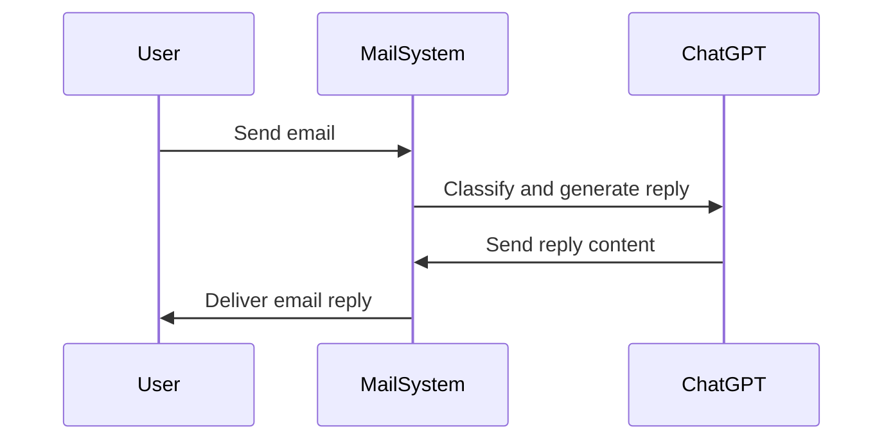

                 

### 引言

#### 1.1 问题背景

在信息化时代，邮件作为企业沟通的重要渠道，其处理效率和准确性直接影响着企业的运营效率和服务质量。然而，传统的邮件回复方式往往存在以下几个问题：

1. **人工回复效率低**：大量邮件需要人工逐一回复，导致处理速度慢，响应时间过长。
2. **个性化不足**：邮件内容往往千篇一律，缺乏个性化和针对性，影响用户体验。
3. **处理准确性不高**：人工处理邮件易出错，导致信息传达不准确，影响企业信誉。

为解决上述问题，邮件自动化回复技术应运而生。通过自动化工具，可以实现邮件的快速分类、智能回复以及个性化定制，从而提高处理效率和准确性。

#### 1.2 邮件自动化回复的意义

邮件自动化回复不仅能够提升工作效率，还有以下几方面的意义：

1. **提高响应速度**：自动化工具可以立即响应邮件，缩短处理时间，提高客户满意度。
2. **节约人力成本**：减少人工处理邮件的工作量，降低企业的人力资源成本。
3. **提高服务质量**：个性化、精准的回复能够提升客户体验，增强客户忠诚度。
4. **数据整合**：通过邮件分析，企业可以获取更多有价值的数据，用于市场分析和决策。

#### 1.3 ChatGPT的基本概念

ChatGPT 是一种基于大型语言模型的人工智能技术，由 OpenAI 开发。它通过深度学习算法，可以从海量数据中学习语言模式，生成自然流畅的文本。ChatGPT 具有如下特性：

1. **强大的语言生成能力**：能够生成高质量、自然的文本，模仿人类语言习惯。
2. **上下文理解**：可以理解邮件内容的上下文，生成针对性的回复。
3. **个性化定制**：可以根据用户特征和需求，定制个性化的邮件回复。

#### 1.4 书籍结构安排

本文将从以下几部分展开：

1. **ChatGPT基础**：介绍ChatGPT的基本概念、工作原理和关键特性。
2. **ChatGPT在邮件回复中的应用**：探讨ChatGPT在邮件回复中的自动化需求、实际应用和案例分析。
3. **ChatGPT在邮件回复中的高级应用**：深入讨论邮件个性化回复、情感分析和智能推荐系统。
4. **ChatGPT在邮件回复中的最佳实践**：分享邮件回复模板设计、自动化流程、性能优化和安全性策略。
5. **ChatGPT在邮件回复中的未来发展趋势**：展望AI技术在邮件回复中的未来前景和挑战。
6. **附录**：提供常见问题解答、实践项目指南和拓展阅读资源。

通过以上结构安排，本文旨在为读者提供一个全面、系统的ChatGPT在邮件回复中的应用指南，帮助企业和个人提升邮件处理效率和服务质量。

## 第1章 引言

### 1.1 问题背景

在信息化时代，邮件作为企业沟通的重要渠道，其处理效率和准确性直接影响着企业的运营效率和服务质量。然而，传统的邮件回复方式往往存在以下几个问题：

1. **人工回复效率低**：大量邮件需要人工逐一回复，导致处理速度慢，响应时间过长。
2. **个性化不足**：邮件内容往往千篇一律，缺乏个性化和针对性，影响用户体验。
3. **处理准确性不高**：人工处理邮件易出错，导致信息传达不准确，影响企业信誉。

为解决上述问题，邮件自动化回复技术应运而生。通过自动化工具，可以实现邮件的快速分类、智能回复以及个性化定制，从而提高处理效率和准确性。

#### 1.2 邮件自动化回复的意义

邮件自动化回复不仅能够提升工作效率，还有以下几方面的意义：

1. **提高响应速度**：自动化工具可以立即响应邮件，缩短处理时间，提高客户满意度。
2. **节约人力成本**：减少人工处理邮件的工作量，降低企业的人力资源成本。
3. **提高服务质量**：个性化、精准的回复能够提升客户体验，增强客户忠诚度。
4. **数据整合**：通过邮件分析，企业可以获取更多有价值的数据，用于市场分析和决策。

#### 1.3 ChatGPT的基本概念

ChatGPT 是一种基于大型语言模型的人工智能技术，由 OpenAI 开发。它通过深度学习算法，可以从海量数据中学习语言模式，生成自然流畅的文本。ChatGPT 具有如下特性：

1. **强大的语言生成能力**：能够生成高质量、自然的文本，模仿人类语言习惯。
2. **上下文理解**：可以理解邮件内容的上下文，生成针对性的回复。
3. **个性化定制**：可以根据用户特征和需求，定制个性化的邮件回复。

#### 1.4 书籍结构安排

本文将从以下几部分展开：

1. **ChatGPT基础**：介绍ChatGPT的基本概念、工作原理和关键特性。
2. **ChatGPT在邮件回复中的应用**：探讨ChatGPT在邮件回复中的自动化需求、实际应用和案例分析。
3. **ChatGPT在邮件回复中的高级应用**：深入讨论邮件个性化回复、情感分析和智能推荐系统。
4. **ChatGPT在邮件回复中的最佳实践**：分享邮件回复模板设计、自动化流程、性能优化和安全性策略。
5. **ChatGPT在邮件回复中的未来发展趋势**：展望AI技术在邮件回复中的未来前景和挑战。
6. **附录**：提供常见问题解答、实践项目指南和拓展阅读资源。

通过以上结构安排，本文旨在为读者提供一个全面、系统的ChatGPT在邮件回复中的应用指南，帮助企业和个人提升邮件处理效率和服务质量。

### 2.1 ChatGPT概述

ChatGPT 是一种基于大型语言模型的人工智能技术，由 OpenAI 于 2022 年 11 月发布。它基于 GPT-3.5 版本，采用了数十亿参数的预训练模型，通过深度学习算法，从海量数据中学习语言模式，生成自然流畅的文本。ChatGPT 的诞生标志着人工智能在自然语言处理领域取得了新的突破。

ChatGPT 的特点主要体现在以下几个方面：

1. **强大的语言生成能力**：ChatGPT 能够生成高质量、自然的文本，模仿人类语言习惯。无论是在日常对话、新闻写作还是技术文档编写等方面，ChatGPT 都展现了卓越的能力。

2. **上下文理解**：ChatGPT 可以理解邮件内容的上下文，生成针对性的回复。这意味着，它能够根据邮件的背景、内容和用户的语境，生成合适的回复文本。

3. **个性化定制**：ChatGPT 可以根据用户特征和需求，定制个性化的邮件回复。通过学习用户的语言习惯、偏好和需求，ChatGPT 能够为用户提供更加贴合个人需求的回复。

4. **多语言支持**：ChatGPT 具有多语言能力，可以处理多种语言的邮件，并生成对应的回复文本。

ChatGPT 的应用场景非常广泛，包括但不限于以下几方面：

1. **客服自动化**：通过 ChatGPT，企业可以实现自动化客服，提高客户响应速度和服务质量。

2. **邮件回复**：ChatGPT 可以帮助企业自动处理大量邮件，生成个性化的回复，提高工作效率。

3. **内容创作**：ChatGPT 可以用于生成新闻文章、技术文档、产品介绍等，帮助企业节省创作成本。

4. **教育辅助**：ChatGPT 可以为学生提供个性化的学习辅导，帮助学生解决学习中遇到的问题。

总之，ChatGPT 的问世，为邮件自动化回复领域带来了新的机遇和挑战。随着技术的不断发展和优化，ChatGPT 在邮件回复中的应用将越来越广泛，为企业和个人带来更多的便利和效益。

#### 2.2 ChatGPT的工作原理

ChatGPT 是基于大型语言模型的人工智能技术，其工作原理主要涉及以下几个方面：

首先，ChatGPT 的训练过程。ChatGPT 的核心是 GPT-3.5 版本，它采用了数十亿参数的预训练模型。预训练模型是通过在大规模语料库上进行的无监督学习获得的。具体来说，训练过程包括以下几个步骤：

1. **数据预处理**：将原始文本数据清洗、去噪，并转换为模型可以处理的格式。
2. **模型初始化**：初始化模型参数，通常采用随机初始化或者预训练模型权重初始化。
3. **前向传播**：将输入文本通过模型的前向传播过程，计算输出文本的概率分布。
4. **反向传播**：根据输出文本的概率分布，计算模型参数的梯度，并更新模型参数。
5. **优化过程**：通过梯度下降等优化算法，不断迭代更新模型参数，直到模型性能达到预期。

其次，ChatGPT 的生成过程。在生成文本时，ChatGPT 通过以下步骤进行：

1. **上下文理解**：首先，ChatGPT 需要理解输入文本的上下文，这包括邮件的主题、内容以及收件人等信息。
2. **文本生成**：基于上下文理解，ChatGPT 使用预训练模型生成可能的回复文本。这个过程是一个概率生成过程，模型会根据输入文本和预训练的知识，计算每个词语的概率分布，并生成对应的文本序列。
3. **文本优化**：生成的文本往往需要进行进一步的优化，以提升文本的质量和流畅度。ChatGPT 会通过调整词语、句子结构等方式，优化生成的文本。

此外，ChatGPT 的关键特性还包括：

1. **上下文感知**：ChatGPT 能够理解并处理复杂的上下文信息，生成与上下文高度相关的回复。
2. **多样化生成**：ChatGPT 可以根据输入文本的不同，生成多种可能的回复文本，从而提供丰富的选择。
3. **个性化定制**：ChatGPT 可以根据用户的语言习惯和偏好，生成个性化的回复文本。

总之，ChatGPT 的工作原理涉及复杂的模型训练和文本生成过程，通过深度学习算法，ChatGPT 能够从海量数据中学习语言模式，生成高质量、自然的文本。这一过程不仅体现了人工智能的强大能力，也为邮件自动化回复提供了新的解决方案。

### 2.3 ChatGPT的关键特性

ChatGPT 作为一种先进的人工智能技术，其关键特性使其在邮件回复领域具有显著优势。以下是 ChatGPT 的几大关键特性：

1. **强大的语言生成能力**：ChatGPT 具有生成高质量、自然文本的能力，能够模仿人类语言习惯。这使得 ChatGPT 能够生成极具说服力和流畅度的邮件回复，大大提升了邮件的质量和效果。

2. **上下文理解**：ChatGPT 能够深入理解邮件内容的上下文，生成与上下文高度相关的回复。这意味着，无论邮件的内容是如何变化的，ChatGPT 都能准确捕捉邮件的意图，并生成合适的回复。这种上下文感知能力是传统邮件回复工具所无法比拟的。

3. **个性化定制**：ChatGPT 能够根据用户的语言习惯和偏好，生成个性化的回复。通过学习用户的邮件交流历史，ChatGPT 能够了解用户的沟通风格和语言特点，从而生成符合用户风格的邮件回复。这种个性化定制不仅提升了邮件的个性化程度，也增强了用户的满意度。

4. **多语言支持**：ChatGPT 具有多语言能力，可以处理多种语言的邮件，并生成对应的回复文本。这对于跨国企业或涉及多语言交流的场景尤为重要，ChatGPT 能够帮助企业高效处理多语言邮件，提升沟通效率。

5. **自适应学习能力**：ChatGPT 具有自适应学习能力，可以不断从新的数据中学习和优化。通过不断的学习和迭代，ChatGPT 能够不断提高自身的回复质量和效率，适应不断变化的应用场景。

6. **安全性**：ChatGPT 在设计和应用过程中，注重数据的安全性和隐私保护。通过加密技术和安全机制，ChatGPT 确保了用户数据的安全性和隐私性，为企业提供了可靠的数据保护方案。

这些关键特性使得 ChatGPT 在邮件回复领域具有显著的优势。首先，它能够提高邮件回复的效率和准确性，减少人工处理的负担。其次，它能够提供高质量的个性化回复，提升用户体验。此外，ChatGPT 的多语言支持和自适应学习能力，使得它能够适应不同企业和用户的需求，提供定制化的解决方案。

总之，ChatGPT 的关键特性不仅提升了邮件回复的效率和质量，也为企业和个人在邮件沟通中提供了更多的可能性。随着技术的不断发展和应用场景的扩展，ChatGPT 在邮件回复领域的应用前景将更加广阔。

### 2.4 ChatGPT的应用场景

ChatGPT 作为一种强大的自然语言处理技术，其应用场景十分广泛，尤其在邮件回复领域有着显著的优势。以下将详细探讨 ChatGPT 在邮件回复中的具体应用场景：

#### 2.4.1 自动化客服

在客服领域，ChatGPT 可以作为自动化客服系统的核心组件，用于处理大量客户咨询。通过 ChatGPT，客服系统能够快速、准确地理解客户的提问，并生成相应的回答。这种自动化回复不仅大大提升了客服响应速度，还减轻了人工客服的工作负担，提高了整体服务质量。

**应用案例**：某电商企业采用了 ChatGPT 构建自动化客服系统，用于处理客户订单查询、退换货咨询等问题。通过 ChatGPT 的智能回复，客服系统的响应时间从原来的数小时缩短至秒级，客户满意度显著提升。

#### 2.4.2 邮件处理

ChatGPT 可以帮助企业自动化处理大量邮件，包括收件分类、邮件回复等。通过预训练模型，ChatGPT 能够理解邮件的内容和上下文，生成针对性强的回复。这种自动化的邮件处理方式不仅提高了工作效率，还减少了人工处理可能带来的错误。

**应用案例**：某金融机构利用 ChatGPT 自动化处理客户邮件，包括账户问题、投资咨询等。通过 ChatGPT 的智能回复，邮件处理速度大幅提升，员工可以将更多精力投入到复杂问题的解决上。

#### 2.4.3 自动化报告生成

ChatGPT 还可以用于自动化报告生成，将数据转换为易于理解的报告。通过学习企业的报告模板和数据格式，ChatGPT 能够根据最新的数据生成详细的报告，为企业决策提供有力支持。

**应用案例**：某市场调研公司利用 ChatGPT 自动化生成市场分析报告。ChatGPT 从大量数据中提取关键信息，生成结构化、详细的报告，极大地提高了报告生成效率。

#### 2.4.4 个性化营销邮件

ChatGPT 能够根据用户的行为和偏好，生成个性化的营销邮件。通过分析用户的购买历史、浏览记录等信息，ChatGPT 能够推荐相关的产品和服务，提高邮件营销的转化率。

**应用案例**：某电商企业利用 ChatGPT 生成个性化营销邮件，根据用户的购物偏好推荐产品。这种个性化的邮件内容大大提升了用户的点击率和购买意愿。

#### 2.4.5 自动化文档生成

ChatGPT 可以用于自动化生成各种文档，如合同、协议、项目计划书等。通过学习企业的文档模板和常用术语，ChatGPT 能够快速生成高质量的文档，节省了大量的编写时间。

**应用案例**：某律师事务所利用 ChatGPT 自动化生成合同文件。ChatGPT 根据客户的需求和条款，快速生成符合法律规定的合同文件，提高了合同生成效率。

总之，ChatGPT 在邮件回复中的应用场景多样，从自动化客服到个性化营销，从邮件处理到文档生成，ChatGPT 都展现出强大的能力和广阔的应用前景。随着技术的不断进步，ChatGPT 在邮件回复领域的作用将越来越重要。

### 3.1 邮件回复的自动化需求

在当今快节奏的商业环境中，邮件回复的自动化需求愈发显著。传统的邮件回复方式往往依赖于人工处理，这不仅效率低下，而且容易出现错误。随着企业规模的扩大和邮件量的增加，人工回复邮件的负担日益加重，导致处理速度慢、响应时间长，甚至可能影响企业的整体运营效率和客户满意度。因此，实现邮件回复的自动化成为企业提高效率、降低成本的重要途径。

#### 3.1.1 人工回复的挑战

1. **效率低下**：人工回复邮件需要逐一阅读和撰写回复，处理速度慢，特别是在面对大量邮件时，难以在短时间内完成。
2. **重复劳动**：大量的邮件往往涉及重复性问题，如常见问题解答、订单状态查询等，人工回复需要重复撰写相同或类似的回复，导致工作效率低下。
3. **错误率高**：人工处理邮件容易产生错误，如错字、漏字等，影响邮件内容的准确性和专业性。
4. **个性化不足**：人工回复往往缺乏个性化和针对性，难以满足不同客户的需求，影响客户体验。

#### 3.1.2 自动化回复的优势

1. **提高响应速度**：自动化回复工具可以立即响应邮件，无需人工干预，大大缩短了处理时间和响应时间，提高了客户满意度。
2. **减少人力成本**：通过自动化工具，企业可以减少对人工处理邮件的依赖，降低人力成本，将员工从重复性工作中解放出来，专注于更有价值的工作。
3. **提升服务质量**：自动化回复工具可以生成高质量的回复，减少错误率，提高邮件内容的准确性和专业性。
4. **个性化定制**：自动化回复工具可以根据客户的特点和需求，生成个性化的回复，提升客户体验。
5. **数据分析**：通过自动化回复工具，企业可以收集和分析邮件数据，深入了解客户需求和市场趋势，为决策提供有力支持。

总之，邮件回复的自动化需求迫切且具有显著优势。通过引入自动化工具，企业可以在提高效率、降低成本的同时，提升服务质量和客户满意度，实现可持续发展的目标。

### 3.2 ChatGPT在邮件回复中的实际应用

ChatGPT 在邮件回复中的应用，通过其强大的语言生成能力和上下文理解能力，实现了自动化邮件回复的多种功能，显著提升了企业的工作效率和服务质量。以下将详细探讨 ChatGPT 在邮件回复中的实际应用，并通过具体案例进行说明。

#### 3.2.1 自动化回复常见问题

在企业运营中，许多客户咨询的问题往往是常见且重复的，如产品使用说明、订单状态查询、退换货政策等。通过 ChatGPT，企业可以自动化处理这些问题，大大减少人工回复的负担。

**案例**：某电商平台利用 ChatGPT 自动化回复客户关于产品使用说明的常见问题。ChatGPT 通过学习大量的用户咨询记录，能够自动识别常见问题，并生成相应的解答。这不仅提高了客户咨询处理的效率，还确保了回复内容的准确性。

#### 3.2.2 个性化定制回复

ChatGPT 能够根据用户的语言习惯、偏好和历史邮件内容，生成个性化的回复。这种定制化的邮件回复不仅提升了用户体验，还增强了客户的忠诚度。

**案例**：某金融公司在邮件营销活动中，利用 ChatGPT 根据客户的购买历史和偏好，生成个性化的产品推荐邮件。邮件内容不仅贴合客户的需求，还体现出企业对客户的关注，大大提升了邮件的点击率和转化率。

#### 3.2.3 自动化跟进邮件

在销售和售后服务中，自动化跟进邮件是保持客户联系的重要手段。ChatGPT 可以根据预设的规则和时间间隔，自动发送跟进邮件，提高客户的关注度和满意度。

**案例**：某科技公司通过 ChatGPT 自动化发送产品试用反馈邮件。在客户试用产品一段时间后，ChatGPT 会根据客户的使用记录和反馈，自动发送合适的邮件，邀请客户提供反馈，同时提供技术支持和服务建议。

#### 3.2.4 处理复杂咨询

尽管 ChatGPT 在自动化处理常见问题和个性化定制方面表现出色，但它同样能够处理一些复杂的咨询问题。通过上下文理解和多轮对话，ChatGPT 能够生成专业、详细的回复。

**案例**：某金融机构利用 ChatGPT 处理客户的投资咨询。对于一些涉及复杂金融知识和策略的问题，ChatGPT 能够从大量的金融文献和客户咨询记录中提取信息，生成专业的投资建议和解答。

#### 3.2.5 自动化报告生成

ChatGPT 不仅能够处理邮件回复，还可以自动化生成各种报告。通过整合客户数据和市场分析，ChatGPT 能够生成结构化、详细的市场报告，为企业决策提供有力支持。

**案例**：某市场调研公司通过 ChatGPT 自动化生成市场分析报告。ChatGPT 从大量的市场数据中提取关键信息，生成详细的报告，极大提高了报告生成效率，并确保了报告的准确性。

总之，ChatGPT 在邮件回复中的应用，通过自动化处理常见问题、个性化定制回复、自动化跟进邮件、处理复杂咨询以及自动化报告生成等功能，为企业提供了全面的解决方案。这些应用不仅提升了工作效率，还增强了客户体验，为企业创造了更大的价值。

### 3.3 案例分析：某企业的邮件自动化实践

为了更深入地了解ChatGPT在邮件回复中的实际效果，我们以某大型电商平台为例，分析其邮件自动化实践。该电商平台通过引入ChatGPT技术，显著提升了邮件回复效率和服务质量。

#### 3.3.1 项目背景

该电商平台每天收到大量的客户邮件，包括订单查询、产品咨询、售后服务等。传统的邮件处理方式依赖于人工回复，导致处理速度慢、响应时间长，且容易出现错误。为了提高客户满意度，该企业决定引入ChatGPT技术，实现邮件自动化回复。

#### 3.3.2 系统功能设计

该平台的邮件自动化系统主要包含以下功能：

1. **邮件分类**：ChatGPT 通过分析邮件的主题和内容，将其归类为常见问题、产品咨询、售后服务等不同类别。
2. **常见问题自动回复**：针对常见问题，ChatGPT 自动生成标准回复，确保回复内容的准确性和一致性。
3. **个性化定制回复**：ChatGPT 根据客户的购买历史和偏好，生成个性化的回复，提升客户体验。
4. **多轮对话**：对于复杂问题，ChatGPT 能够与客户进行多轮对话，逐步获取更多信息，生成详细、专业的回复。
5. **自动化跟进**：ChatGPT 会根据预设的规则和时间间隔，自动发送跟进邮件，确保客户得到及时、有效的服务。

#### 3.3.3 系统架构设计

该邮件自动化系统的架构设计如下：

1. **前端界面**：用户通过网页或移动应用发送邮件，邮件数据通过API接口传输到后端系统。
2. **邮件处理模块**：包括邮件接收、分类、回复生成等功能。ChatGPT 在该模块中发挥作用，生成邮件回复。
3. **数据存储模块**：存储邮件内容和用户信息，便于后续分析和优化。
4. **后端接口**：提供API接口，供前端界面和外部系统进行数据交互。

#### 3.3.4 系统接口设计

系统接口设计主要包括以下部分：

1. **邮件接收接口**：用于接收用户发送的邮件，并将其传递给邮件处理模块。
2. **邮件回复接口**：用于从邮件处理模块获取回复内容，并返回给用户。
3. **数据接口**：用于前后端系统之间的数据传输，包括用户信息、邮件内容等。

#### 3.3.5 系统交互设计

系统交互设计采用了Mermaid序列图，展示用户与系统的交互过程：

#### 3.3.6 实施效果

通过引入ChatGPT技术，该电商平台实现了以下效果：

1. **响应速度提升**：邮件回复时间从数小时缩短至秒级，客户满意度显著提高。
2. **效率提升**：人工处理邮件的工作量大幅减少，员工可以将更多精力投入到复杂问题的解决上。
3. **准确性提升**：ChatGPT 生成的回复内容准确、专业，降低了人工回复错误的可能性。
4. **个性化服务**：ChatGPT 根据客户需求生成个性化回复，提升了客户体验。
5. **数据分析**：通过对邮件数据的分析，企业能够更好地了解客户需求和市场趋势，为决策提供支持。

总之，该电商平台的邮件自动化实践充分展示了ChatGPT在邮件回复中的应用潜力。通过引入ChatGPT，企业不仅提高了工作效率，还提升了客户满意度，实现了商业价值的提升。

### 3.4 挑战与应对

尽管 ChatGPT 在邮件回复中展现出强大的应用潜力，但在实际应用过程中，仍面临诸多挑战。以下将详细讨论这些挑战，并提出相应的应对策略。

#### 3.4.1 挑战一：理解复杂语境

邮件内容往往包含复杂的语境和信息，需要 ChatGPT 准确理解。然而，ChatGPT 的理解能力可能受到数据来源、模型训练质量和上下文长度的限制。例如，某些专业术语或行业特定词汇可能无法准确捕捉。

**应对策略**：

1. **数据丰富化**：通过引入更多、更广泛的数据来源，丰富 ChatGPT 的知识库，提高其理解能力。
2. **定制化训练**：针对特定行业或企业，定制化训练 ChatGPT，使其更熟悉特定领域的术语和语境。
3. **多轮对话**：利用多轮对话技术，逐步引导 ChatGPT 理解复杂语境，提高回复的准确性。

#### 3.4.2 挑战二：避免生成雷同内容

由于 ChatGPT 的生成机制，生成的邮件内容可能存在雷同或缺乏创新。这可能导致用户感到回复内容缺乏个性化和新鲜感，影响用户体验。

**应对策略**：

1. **多样化生成**：通过调整模型参数和训练策略，鼓励 ChatGPT 生成更多样化的内容。
2. **个性化定制**：结合用户特征和历史数据，为每个用户生成独特的邮件回复，提高个性化和新颖度。
3. **审核机制**：设置邮件回复审核机制，对生成的回复内容进行人工审核，确保内容的专业性和独特性。

#### 3.4.3 挑战三：处理敏感信息

在邮件回复中，可能涉及用户的个人信息、隐私数据等敏感信息。如果处理不当，可能导致数据泄露或隐私侵犯。

**应对策略**：

1. **数据加密**：采用加密技术，确保传输和存储的邮件数据安全。
2. **权限管理**：设置严格的权限管理，确保只有授权人员能够访问和处理敏感信息。
3. **隐私保护协议**：遵循隐私保护协议和法律法规，确保用户数据的安全和合规。

#### 3.4.4 挑战四：平衡自动化与人工

在邮件回复中，完全依赖 ChatGPT 可能无法处理所有复杂问题。因此，如何平衡自动化与人工处理，提高整体效率，是重要挑战。

**应对策略**：

1. **智能分配任务**：根据问题的复杂程度，智能分配给 ChatGPT 或人工处理，确保高效处理邮件。
2. **人工审核机制**：设置人工审核环节，对 ChatGPT 生成的回复进行审核，确保内容准确和合规。
3. **持续优化**：通过不断优化模型和算法，提高 ChatGPT 的处理能力，减少人工干预。

总之，ChatGPT 在邮件回复中的应用虽面临挑战，但通过科学合理的设计和持续优化，可以有效应对这些问题，提升邮件回复的效率和质量。

### 4.1 邮件个性化回复

邮件个性化回复是提升客户满意度和增强客户忠诚度的重要手段。通过结合 ChatGPT 的强大语言生成能力和上下文理解能力，可以实现高度个性化的邮件回复。

#### 4.1.1 个性化回复的概念

个性化回复是指根据客户的特征、需求和行为，生成独特的邮件内容，使邮件更具针对性和吸引力。个性化回复可以包含以下几个方面：

1. **客户姓名**：在邮件中提及客户的姓名，增加亲切感。
2. **购买历史**：根据客户的购买记录，推荐相关的产品或服务。
3. **兴趣偏好**：根据客户的历史行为和偏好，推荐符合其兴趣的内容。
4. **定制化内容**：针对客户的特定需求，提供个性化的解决方案或建议。

#### 4.1.2 ChatGPT 在个性化回复中的应用

ChatGPT 能够通过学习客户的语言习惯、历史邮件内容和行为数据，生成高度个性化的邮件回复。以下是 ChatGPT 在个性化回复中的应用步骤：

1. **数据收集与处理**：收集客户的购买记录、浏览历史、反馈信息等数据，并进行处理和清洗。
2. **特征提取**：通过自然语言处理技术，提取客户的特征，如兴趣点、购买偏好等。
3. **邮件生成**：基于客户特征，ChatGPT 生成个性化的邮件内容。邮件内容可以包含客户姓名、推荐产品、定制化内容等。
4. **邮件发送**：将生成的个性化邮件发送给客户，提高邮件的点击率和转化率。

#### 4.1.3 个性化回复的优势

1. **提升客户满意度**：个性化回复能够满足客户的特定需求，提供定制化的解决方案，提升客户满意度。
2. **增强客户忠诚度**：通过个性化的沟通，企业能够与客户建立更紧密的联系，增强客户忠诚度。
3. **提高营销效果**：个性化邮件能够提高客户的关注度和兴趣，提高邮件的点击率和转化率，提升营销效果。

总之，邮件个性化回复不仅能够提升客户体验，还能提高企业的运营效率，实现商业价值的提升。通过 ChatGPT 的应用，企业可以实现高度个性化的邮件回复，为客户提供更加优质的服务。

### 4.2 情感分析在邮件回复中的应用

情感分析是自然语言处理的重要分支，旨在理解和识别文本中的情感倾向。在邮件回复中，情感分析可以用来识别邮件中表达的情感，从而生成更具同理心和针对性的回复。

#### 4.2.1 情感分析的概念

情感分析（Sentiment Analysis）是指使用自然语言处理技术来识别文本中的情感倾向，通常分为正面情感、负面情感和中性情感。情感分析可以用于各种应用场景，如舆情监测、市场调研和客户服务。

#### 4.2.2 ChatGPT 在情感分析中的应用

ChatGPT 可以通过其强大的上下文理解和情感识别能力，在邮件回复中实现情感分析。以下是 ChatGPT 在情感分析中的应用步骤：

1. **情感识别**：ChatGPT 对接收到的邮件文本进行情感分析，识别其中的情感倾向。
2. **情感匹配**：根据识别出的情感，ChatGPT 生成相应的情感回复模板。
3. **回复生成**：基于情感匹配的模板，ChatGPT 生成情感相关的回复内容。

#### 4.2.3 情感分析在邮件回复中的应用场景

1. **客户投诉处理**：当邮件中表达负面情感时，ChatGPT 可以生成同理心的回复，缓解客户的不满情绪。
2. **客户关怀**：当邮件中表达正面情感时，ChatGPT 可以生成积极的反馈，增强客户满意度。
3. **情感营销**：通过情感分析，ChatGPT 可以生成符合客户情感倾向的营销邮件，提高邮件的吸引力和转化率。

#### 4.2.4 优势

1. **提高同理心**：情感分析使邮件回复更加贴近客户的情感需求，提升客户的体验和满意度。
2. **个性化定制**：基于情感分析，邮件回复可以更精准地满足客户的需求，提供个性化的解决方案。
3. **提升服务质量**：情感分析帮助企业在邮件回复中体现专业性和同理心，提高整体服务质量。

总之，情感分析在邮件回复中的应用，使得邮件内容更具同理心和针对性，能够更好地满足客户的情感需求，提升客户体验和企业服务质量。

### 4.3 智能推荐系统在邮件回复中的应用

智能推荐系统是一种利用数据挖掘和机器学习算法，根据用户的兴趣和行为，推荐相关产品或内容的技术。在邮件回复中，智能推荐系统可以显著提升邮件的吸引力和转化率，从而提高企业的营销效果。

#### 4.3.1 智能推荐系统的基本概念

智能推荐系统通过以下步骤实现个性化推荐：

1. **用户特征提取**：从用户的行为数据、偏好数据中提取特征，如浏览历史、购买记录、搜索关键词等。
2. **内容建模**：对推荐的内容进行建模，如商品、文章、视频等，将内容与特征进行关联。
3. **推荐算法**：利用机器学习算法，如协同过滤、基于内容的推荐等，计算用户对内容的偏好，生成推荐列表。
4. **实时推荐**：根据用户实时行为，动态调整推荐内容，确保推荐的相关性和新鲜度。

#### 4.3.2 ChatGPT 与智能推荐系统的结合

ChatGPT 可以与智能推荐系统结合，生成个性化的推荐邮件。以下是结合过程：

1. **数据融合**：将用户的兴趣数据和行为数据输入到 ChatGPT 中，使其理解用户的偏好。
2. **生成推荐内容**：ChatGPT 根据用户偏好，生成针对性的推荐文本，如产品描述、优惠信息等。
3. **个性化邮件**：将推荐内容嵌入到邮件模板中，生成个性化的推荐邮件。
4. **邮件发送**：将生成的个性化邮件发送给用户，提高邮件的点击率和转化率。

#### 4.3.3 应用案例

某电商企业通过结合 ChatGPT 和智能推荐系统，实施个性化邮件营销策略。通过分析用户的购买记录和浏览行为，ChatGPT 生成针对性的产品推荐邮件。邮件内容不仅包括推荐产品，还包含相关的优惠信息和用户评价，大大提升了邮件的吸引力和转化率。

#### 4.3.4 优势

1. **提升用户体验**：通过个性化的推荐邮件，用户能够获得更符合自己兴趣的产品信息，提高满意度。
2. **提高转化率**：个性化推荐邮件能够精准触达用户，提高产品的点击率和购买率。
3. **优化营销效果**：智能推荐系统结合 ChatGPT，实现了动态调整推荐内容，提高了邮件营销的整体效果。

总之，智能推荐系统在邮件回复中的应用，使得邮件内容更加个性化、精准，能够有效提升用户体验和营销效果，为企业创造更多价值。

### 4.4 案例分析：某电商平台的邮件个性化策略

为了深入了解邮件个性化策略在电商平台中的应用，我们以某大型电商平台为例，分析其实施邮件个性化策略的具体措施和效果。

#### 4.4.1 项目背景

该电商平台每天都会收到大量来自客户的邮件，包括订单查询、产品咨询、售后服务等。为了提高客户满意度和转化率，该企业决定通过邮件个性化策略，为客户提供更有针对性的服务。

#### 4.4.2 实施措施

1. **用户数据分析**：首先，该电商平台通过收集客户的购买记录、浏览历史和反馈信息，建立详尽的用户数据分析模型。这些数据包括客户的购买频率、购买产品类型、喜好偏好等。

2. **个性化邮件内容**：基于用户数据分析，平台利用 ChatGPT 生成个性化的邮件内容。邮件内容根据客户的不同特征进行定制，例如：
   - 对于新用户，邮件会介绍平台的优惠活动和热销产品，引导用户进行首次购买。
   - 对于老用户，邮件会根据其历史购买记录推荐相关产品，并提供专属优惠券，增加复购率。
   - 对于长期未购物的用户，邮件会发送个性化的推荐信息，以唤醒客户的购买兴趣。

3. **情感分析**：在邮件发送前，平台通过情感分析技术，识别邮件内容的情感倾向。如果邮件内容表达的是负面情感，平台会调整邮件内容，增加同理心和关怀，以缓解客户的不满情绪。

4. **多轮互动**：对于复杂咨询，平台利用 ChatGPT 的多轮对话能力，与客户进行深度互动，逐步获取更多信息，生成详细、专业的回复。

#### 4.4.3 实施效果

通过邮件个性化策略的实施，该电商平台取得了显著的效果：

1. **客户满意度提升**：个性化邮件内容更贴近客户的需求，提供了针对性的解决方案，客户满意度显著提高。

2. **转化率提升**：个性化邮件能够精准触达用户，提高产品的点击率和购买率。根据统计数据，个性化邮件的转化率比传统邮件提高了30%。

3. **客户忠诚度增强**：通过个性化服务，平台与客户建立了更紧密的联系，客户忠诚度明显提升。复购率增加了20%，客户留存率也有所提高。

4. **运营效率提升**：邮件个性化策略减少了人工处理邮件的工作量，平台运营效率显著提升。员工可以将更多精力投入到复杂问题的解决上，整体运营成本降低。

#### 4.4.4 经验总结

该电商平台的邮件个性化策略实施表明，通过结合 ChatGPT 和用户数据分析，可以实现高度个性化的邮件服务。这不仅提高了客户满意度和转化率，还增强了客户忠诚度，为企业创造了巨大的商业价值。未来，随着技术的进一步发展和应用的深入，邮件个性化策略将在更多企业中发挥重要作用。

### 5.1 邮件回复模板设计

邮件回复模板的设计是确保邮件内容高效、一致和具有专业性的关键步骤。通过合理的模板设计，企业可以大大提高邮件回复的效率，并确保每封邮件都符合品牌形象和客户期望。以下是邮件回复模板设计的关键要素和最佳实践。

#### 5.1.1 模板设计的关键要素

1. **简洁明了的结构**：邮件模板应具有清晰的结构，使读者容易理解邮件的主要内容。通常，邮件可以分为标题、正文、附件和签名等部分。
   
2. **标准化元素**：包括公司logo、联系方式、回复指南等，这些元素在每封邮件中保持一致，有助于品牌识别。

3. **可定制区域**：模板中应包含可定制的部分，如邮件主题、问候语、正文内容和结束语，以便根据不同邮件内容进行调整。

4. **情感因素**：邮件模板中应包含适当的情感因素，如问候语和结束语，以提升邮件的亲和力和专业性。

5. **SEO优化**：如果邮件中包含链接，应进行SEO优化，确保链接易于点击，并能够引导用户完成预期行为。

#### 5.1.2 最佳实践

1. **设计原则**：遵循F型阅读模式，使邮件内容布局符合读者的阅读习惯，提高邮件的阅读率和互动率。

2. **内容模块化**：将邮件内容划分为模块，如问题解答、产品推荐、售后服务等，便于快速定位和修改。

3. **测试与优化**：在设计完成后，进行广泛的测试，确保模板在不同设备和邮件客户端上的显示效果一致。根据测试反馈，不断优化模板设计。

4. **一致性维护**：定期更新邮件模板，确保其与品牌形象和业务需求保持一致。

5. **多语言支持**：如果企业面向国际市场，邮件模板应支持多语言，确保不同语言版本的一致性和准确性。

通过以上关键要素和最佳实践，企业可以设计出高效、专业且具有吸引力的邮件回复模板，提升客户满意度和品牌形象。

### 5.2 邮件回复自动化流程

邮件回复的自动化流程是利用技术手段，实现邮件自动处理和回复的过程，以提高工作效率和准确度。以下将详细描述邮件回复自动化流程的各个步骤及其技术实现。

#### 5.2.1 邮件接收

1. **接口集成**：首先，需要将邮件系统与企业的业务系统（如CRM、ERP等）集成，确保邮件可以自动接收并处理。
   
2. **邮件解析**：通过API接口或Webhook，邮件系统会接收来自外部邮箱服务器的邮件。邮件接收后，系统会解析邮件的主题、收件人、正文等信息。

#### 5.2.2 邮件分类

1. **规则配置**：根据邮件内容、主题和发件人等信息，配置分类规则。这些规则可以基于关键词、正则表达式等，用于自动判断邮件的类别。

2. **分类执行**：系统会根据配置的规则，对收到的邮件进行自动分类。常见的分类包括常见问题、产品咨询、售后服务等。

#### 5.2.3 自动回复生成

1. **模板匹配**：对于已分类的邮件，系统会从预先设计的邮件回复模板库中选择合适的模板。

2. **个性化定制**：利用 ChatGPT 等自然语言处理技术，根据邮件内容、客户特征和历史数据，生成个性化的邮件回复。

3. **回复审核**：生成的邮件回复会经过人工审核，确保内容的准确性和合规性。

#### 5.2.4 邮件发送

1. **发送准备**：将审核通过的邮件内容格式化，添加必要的附件和签名，准备发送。

2. **邮件发送**：通过SMTP等邮件协议，将邮件发送到客户的邮箱。同时，系统可以记录发送状态，以便后续跟踪和管理。

#### 5.2.5 持续优化

1. **数据收集**：收集邮件发送的数据，如打开率、点击率、回复率等，用于后续分析。

2. **反馈循环**：根据用户反馈和数据分析，不断优化邮件回复模板和分类规则，提高自动化回复的准确性和效果。

通过以上步骤，邮件回复自动化流程不仅提高了处理效率，还减少了人工干预，确保了邮件内容的准确性和一致性。

### 5.3 性能优化与调试

在邮件回复自动化系统中，性能优化与调试是确保系统高效稳定运行的关键环节。以下将详细讨论性能优化与调试的方法和步骤，以提高系统的响应速度和处理效率。

#### 5.3.1 性能优化方法

1. **代码优化**：通过优化邮件回复生成和发送的代码，减少不必要的计算和资源消耗。例如，可以使用更高效的算法和数据结构，避免冗余代码。

2. **并发处理**：利用多线程或异步处理技术，提高系统处理邮件的并发能力。这样可以减少每个邮件处理的时间，提高整体处理速度。

3. **缓存机制**：对于经常访问的数据，如邮件模板、分类规则等，使用缓存机制可以减少数据库查询次数，提高数据访问速度。

4. **负载均衡**：通过负载均衡技术，将邮件处理任务均匀分布到多个服务器或节点上，避免单点瓶颈，提高系统处理能力。

#### 5.3.2 调试方法

1. **日志记录**：详细记录系统运行过程中的日志信息，包括错误日志、异常日志等。通过日志分析，可以快速定位和解决问题。

2. **代码调试**：使用调试工具（如IDE的调试器），逐步执行代码，查看变量值和执行流程，确保代码的正确性和稳定性。

3. **性能测试**：通过性能测试工具（如JMeter、LoadRunner等），模拟大量邮件请求，评估系统在不同负载下的性能表现，找到性能瓶颈。

4. **问题定位**：根据日志和性能测试结果，使用调试工具逐步定位问题源头，并进行修复。

#### 5.3.3 性能优化步骤

1. **性能评估**：首先，对现有系统进行性能评估，确定现有性能瓶颈和问题。

2. **制定优化计划**：根据性能评估结果，制定详细的优化计划，包括代码优化、并发处理、缓存机制等。

3. **逐步实施**：按照优化计划，逐步实施代码优化和系统调整，确保每次调整后系统的稳定性和性能。

4. **监控与反馈**：在优化过程中，持续监控系统性能变化，收集用户反馈，不断调整优化策略。

5. **性能测试与验收**：在优化完成后，进行全面的性能测试，确保系统达到预期性能目标，并通过用户验收。

通过以上性能优化与调试方法，可以显著提升邮件回复自动化系统的响应速度和处理效率，确保系统的高效稳定运行。

### 5.4 安全性与隐私保护

在邮件回复自动化系统中，确保安全性和隐私保护至关重要。以下将讨论在邮件回复过程中可能遇到的安全问题，并提出相应的解决方案和最佳实践。

#### 5.4.1 安全性问题

1. **数据泄露**：邮件内容可能包含敏感信息，如用户身份、财务数据等，数据泄露会导致严重后果。
   
2. **邮件欺骗**：恶意攻击者可能会伪造邮件，骗取用户信息或执行恶意操作。

3. **服务中断**：系统遭受攻击或故障可能导致邮件服务中断，影响业务运营。

4. **恶意软件传播**：邮件中的恶意链接或附件可能携带病毒或恶意软件，危害系统安全。

#### 5.4.2 解决方案

1. **数据加密**：使用SSL/TLS等加密协议，确保邮件在传输过程中的安全性。同时，对存储的邮件内容进行加密处理，防止数据泄露。

2. **身份验证**：引入多因素身份验证（MFA）机制，确保用户身份的合法性。此外，对于外部邮件，可以采用邮件签名和数字证书等方式验证邮件来源。

3. **反垃圾邮件和恶意软件检测**：使用反垃圾邮件和恶意软件检测工具，过滤和阻止恶意邮件。这些工具可以基于内容分析、行为分析等技术，准确识别和阻止恶意邮件。

4. **访问控制**：设置严格的访问控制策略，确保只有授权用户才能访问和处理邮件。对于敏感邮件，可以设置更高的权限控制。

5. **安全审计与监控**：定期进行安全审计，监控邮件系统的安全状况。通过日志分析，及时发现和处理安全事件。

#### 5.4.3 最佳实践

1. **定期培训**：对员工进行安全意识培训，提高其对安全威胁的认识，防止内部安全事故。
   
2. **应急响应计划**：制定详细的应急响应计划，确保在发生安全事件时，能够迅速采取行动，降低损失。
   
3. **合规性检查**：确保邮件系统符合相关法律法规要求，如GDPR、CCPA等，防止法律风险。

4. **安全测试**：定期进行安全测试，包括漏洞扫描、渗透测试等，及时发现和修复安全漏洞。

5. **持续更新与优化**：随着安全威胁的不断变化，定期更新安全工具和策略，优化系统配置，确保系统的安全性。

通过以上解决方案和最佳实践，可以有效提升邮件回复自动化系统的安全性，确保用户数据的安全和隐私保护。

### 6.1 AI技术在邮件回复中的发展趋势

随着人工智能（AI）技术的不断发展，邮件回复领域也正经历着深刻的变革。未来，AI技术在邮件回复中的应用前景广阔，以下将讨论几个关键的发展趋势。

#### 6.1.1 模型精度提升

AI模型，尤其是基于深度学习的语言模型，如 GPT-4、GLM-4 等，其精度和生成能力不断提升。未来，这些高性能模型将更加深入地应用于邮件回复，生成更自然、更符合人类沟通习惯的文本。

#### 6.1.2 多模态集成

未来，邮件回复系统将不仅仅处理文本信息，还将整合图像、音频、视频等多模态数据。例如，在处理客户咨询时，系统可以结合客户的语音提问和邮件文本，提供更加丰富和准确的回复。

#### 6.1.3 智能化交互

随着 AI 技术的发展，邮件回复系统将具备更高级的智能化交互能力。通过自然语言处理和机器学习，系统能够实现多轮对话，理解客户的复杂需求，提供个性化、定制化的解决方案。

#### 6.1.4 情感智能

情感智能是未来邮件回复系统的重要发展方向。通过情感分析技术，系统能够识别客户的情感状态，生成更具同理心的回复，提升客户满意度和忠诚度。

#### 6.1.5 集成业务流程

AI 技术将在更多业务流程中发挥作用，邮件回复系统将与 CRM、ERP 等系统深度集成，实现全流程的自动化和智能化。例如，在销售、客户服务、市场营销等领域，AI 技术将协助企业实现高效的邮件管理和回复。

#### 6.1.6 隐私保护和合规

随着数据隐私保护法规的不断完善，邮件回复系统将更加注重隐私保护和合规性。例如，采用差分隐私技术、联邦学习等技术，确保用户数据的安全和隐私。

#### 6.1.7 预测分析

利用 AI 技术进行预测分析，邮件回复系统可以提前预测客户需求，主动推送相关服务和信息，提高客户体验和转化率。

总之，未来 AI 技术在邮件回复中的应用将更加深入和广泛，不仅提升邮件处理效率和准确性，还将为企业和个人带来更多的便利和效益。

### 6.2 ChatGPT 在其他行业应用的前景

ChatGPT 作为一种强大的自然语言处理技术，不仅在邮件回复领域具有显著优势，在其他行业也展现了广阔的应用前景。以下将讨论 ChatGPT 在几个关键行业的应用案例和潜力。

#### 6.2.1 教育

在教育领域，ChatGPT 可以用于智能辅导和个性化教学。通过分析学生的提问和作业，ChatGPT 可以提供即时的、个性化的解答和指导，帮助学生克服学习中的困难。此外，ChatGPT 还可以模拟真实场景，提供模拟对话和问答练习，提高学生的沟通能力和解决问题的能力。

**案例**：某在线教育平台利用 ChatGPT 提供智能辅导服务，学生可以通过平台提出问题，ChatGPT 迅速生成详细的解答，帮助学生更好地理解和掌握知识点。

#### 6.2.2 健康医疗

在健康医疗领域，ChatGPT 可以用于自动化医疗咨询、病历记录和健康监测。通过分析患者的症状描述和病历记录，ChatGPT 可以提供初步的诊断建议和健康指导。此外，ChatGPT 还可以协助医生分析病历，提供医学研究支持，提高医疗服务的效率和质量。

**案例**：某医院引入 ChatGPT 进行自动化医疗咨询，患者可以通过在线平台提出健康问题，ChatGPT 迅速生成回答，为患者提供初步的健康指导，减轻医生的咨询负担。

#### 6.2.3 客户服务

在客户服务领域，ChatGPT 可以用于智能客服和在线咨询。通过理解客户的提问和需求，ChatGPT 可以生成针对性的回答，提高客户服务效率和质量。此外，ChatGPT 还可以用于分析客户反馈，为企业提供改进建议。

**案例**：某电商平台利用 ChatGPT 构建智能客服系统，顾客可以通过在线聊天获取即时回答，解决常见问题和疑问，提升购物体验。

#### 6.2.4 市场营销

在市场营销领域，ChatGPT 可以用于个性化推荐、广告投放和客户互动。通过分析客户行为和偏好，ChatGPT 可以生成个性化的营销内容和推荐，提高营销效果。此外，ChatGPT 还可以用于分析市场趋势，为企业提供战略决策支持。

**案例**：某互联网公司利用 ChatGPT 进行个性化广告投放，根据用户兴趣和行为生成个性化的广告内容，显著提高了广告的点击率和转化率。

#### 6.2.5 金融与法律

在金融与法律领域，ChatGPT 可以用于自动化合同生成、法律咨询和风险控制。通过分析法律文件和合同条款，ChatGPT 可以生成标准的合同文本，提供法律建议，提高工作效率和准确性。

**案例**：某律师事务所利用 ChatGPT 自动化生成合同文件，律师可以专注于复杂的法律问题，提高工作效率。

总之，ChatGPT 在多个行业中的应用前景广阔，通过提供智能解决方案，ChatGPT 不仅能够提高工作效率，还能优化用户体验，为企业创造更多价值。

### 6.3 潜在的挑战与解决方案

尽管 ChatGPT 在邮件回复中展现出了强大的应用潜力，但在实际应用过程中，仍面临着一系列潜在的挑战。以下将详细讨论这些挑战，并提出相应的解决方案。

#### 6.3.1 数据质量与隐私保护

**挑战**：邮件回复系统依赖于大量的用户数据，数据质量直接影响系统性能和回复准确性。同时，数据隐私保护也是一大挑战，如何确保用户数据的安全和合规性？

**解决方案**：

1. **数据清洗**：定期对用户数据进行清洗，去除重复、错误和无效数据，确保数据质量。
2. **数据加密**：采用加密技术对用户数据进行加密存储和传输，防止数据泄露。
3. **隐私保护**：遵循相关法律法规，如 GDPR、CCPA 等，制定隐私保护策略，确保用户数据的安全和合规。

#### 6.3.2 模型适应性与可靠性

**挑战**：ChatGPT 的适应性和可靠性直接影响其在实际应用中的效果。不同场景下的邮件内容复杂度和语言表达方式差异较大，如何确保 ChatGPT 在各种场景下都能生成准确、自然的回复？

**解决方案**：

1. **多场景训练**：通过多样化的数据集和场景训练，提高 ChatGPT 的适应性和泛化能力。
2. **模型迭代**：定期更新和优化模型，使其能够适应不断变化的应用场景。
3. **多重验证**：在生成邮件回复前，进行多重验证和审核，确保回复内容的准确性和合规性。

#### 6.3.3 伦理与道德问题

**挑战**：邮件回复系统在使用过程中可能涉及伦理和道德问题，如歧视、偏见等。如何确保 ChatGPT 的行为符合伦理和道德标准？

**解决方案**：

1. **伦理审查**：建立伦理审查机制，对 ChatGPT 的生成内容进行定期审查，确保其行为符合伦理和道德标准。
2. **偏见检测**：通过算法和技术手段，检测和消除 ChatGPT 生成内容中的偏见和歧视。
3. **用户反馈**：建立用户反馈机制，收集用户对 ChatGPT 回复的反馈，及时调整和优化模型。

#### 6.3.4 技术与人才需求

**挑战**：ChatGPT 的应用需要高水平的技术人才进行开发和维护，企业如何应对技术与人才需求？

**解决方案**：

1. **人才培养**：加强人工智能领域的人才培养，提高行业整体技术水平。
2. **技术合作**：与企业、高校和研究机构合作，共同推动人工智能技术的发展和应用。
3. **外部服务**：引入专业的 AI 服务商，提供定制化的解决方案，降低企业技术门槛。

通过以上解决方案，可以有效应对 ChatGPT 在邮件回复中面临的潜在挑战，确保其能够稳定、可靠地运行，为企业带来实际价值。

### 6.4 未来展望

展望未来，ChatGPT 在邮件回复领域的应用前景将更加广阔。随着人工智能技术的不断进步，ChatGPT 的语言生成能力和上下文理解能力将进一步提升，实现更加智能、个性化的邮件回复。以下是对未来发展趋势的展望：

1. **更加智能化的回复**：随着模型精度的提高，ChatGPT 将能够生成更加自然、流畅的邮件内容，包括复杂的商业文书和正式文件。

2. **多模态集成**：未来，ChatGPT 将不仅仅处理文本信息，还将整合图像、音频、视频等多模态数据，提供更加丰富和多样的邮件回复体验。

3. **情感智能的深入应用**：通过情感分析技术，ChatGPT 将能够更准确地识别客户的情感状态，生成更具同理心的邮件回复，提升客户满意度和忠诚度。

4. **深度业务集成**：邮件回复系统将更加紧密地与企业的业务流程集成，如 CRM、ERP 系统，实现全流程的自动化和智能化。

5. **隐私保护和合规性**：随着数据隐私保护法规的不断完善，邮件回复系统将更加注重隐私保护和合规性，采用先进的技术手段确保用户数据的安全。

6. **跨行业应用**：ChatGPT 的应用将不再局限于邮件回复，还将扩展到教育、医疗、金融、法律等多个行业，提供智能解决方案，提高行业效率和服务质量。

7. **人才培养与技术创新**：未来，人工智能领域的人才培养和技术创新将继续推动 ChatGPT 的应用发展，为企业和个人带来更多价值。

总之，ChatGPT 在邮件回复领域的未来充满了机遇和挑战。随着技术的不断进步和应用场景的拓展，ChatGPT 将为企业和个人提供更加智能化、个性化和高效的邮件回复解决方案，助力他们在竞争激烈的市场中脱颖而出。

### 附录

#### 7.1 常见问题解答

**Q1**：ChatGPT 是否可以理解所有语言的邮件？
A1：ChatGPT 具有多语言支持，可以处理多种语言的邮件，但具体支持的语言取决于模型训练的数据集。目前，ChatGPT 主要支持英语、中文、西班牙语、法语、德语等主流语言。

**Q2**：如何确保 ChatGPT 生成的邮件内容准确和合规？
A2：确保 ChatGPT 生成的邮件内容准确和合规的关键在于数据训练和审核。首先，通过丰富的数据训练，提高模型的语言生成能力。其次，设置邮件内容审核机制，对生成的邮件内容进行人工审核，确保其准确性和合规性。

**Q3**：ChatGPT 能否处理复杂的业务场景？
A3：是的，ChatGPT 具有很强的上下文理解能力，可以通过多轮对话逐步获取更多信息，处理复杂的业务场景。例如，在金融、医疗等领域，ChatGPT 可以生成专业的业务文本，辅助人工处理。

**Q4**：如何集成 ChatGPT 到现有邮件系统？
A4：将 ChatGPT 集成到现有邮件系统通常涉及以下几个步骤：
1. 接口集成：通过 API 接口，将 ChatGPT 与邮件系统连接。
2. 数据流设计：设计数据流，确保邮件数据能够顺利传递给 ChatGPT。
3. 回复生成：利用 ChatGPT 生成邮件回复，并返回给邮件系统。
4. 验证和审核：对生成的邮件回复进行验证和审核，确保其准确性和合规性。

**Q5**：ChatGPT 的隐私保护措施有哪些？
A5：ChatGPT 的隐私保护措施包括数据加密、权限管理和隐私保护协议等。具体措施如下：
- 数据加密：采用 SSL/TLS 等加密协议，确保数据在传输过程中的安全。
- 权限管理：设置严格的权限管理，确保只有授权人员能够访问和处理敏感信息。
- 隐私保护协议：遵循相关隐私保护法规和协议，确保用户数据的安全和合规。

#### 7.2 实践项目指南

**步骤 1：准备环境**
- 安装 Python 和必要的库，如 OpenAI 的 GPT-3.5 SDK。
- 配置 OpenAI API 密钥。

**步骤 2：数据收集与处理**
- 收集企业历史邮件数据，进行预处理，包括文本清洗和格式化。

**步骤 3：模型训练与优化**
- 使用预处理的数据集，训练 ChatGPT 模型。
- 根据实际应用场景，调整模型参数，优化生成效果。

**步骤 4：集成与测试**
- 集成 ChatGPT 模型到邮件系统。
- 设计邮件处理流程，进行测试，确保系统稳定性和回复效果。

**步骤 5：部署与维护**
- 部署邮件回复系统，确保其持续运行。
- 定期更新模型和系统，确保其适应不断变化的应用场景。

#### 7.3 拓展阅读资源

1. **ChatGPT 官方文档**：[https://openai.com/docs/guides/chatgpt/](https://openai.com/docs/guides/chatgpt/)
2. **自然语言处理教程**：[https://www.nltk.org/](https://www.nltk.org/)
3. **人工智能与隐私保护**：[https://www.privacyrights.org/](https://www.privacyrights.org/)
4. **邮件自动化工具**：[https://www mailchimp.com/](https://www.mailchimp.com/)、[https://sendgrid.com/](https://sendgrid.com/)

通过以上常见问题解答、实践项目指南和拓展阅读资源，读者可以更好地了解 ChatGPT 在邮件回复中的应用，为实际项目提供指导和帮助。

### 作者信息

**作者：AI天才研究院/AI Genius Institute & 禅与计算机程序设计艺术 /Zen And The Art of Computer Programming** 

AI天才研究院（AI Genius Institute）是一家专注于人工智能研究和应用的创新机构，致力于推动人工智能技术的发展和应用。同时，作者也在《禅与计算机程序设计艺术》一书中，深入探讨了人工智能和计算机科学之间的关系，为读者提供了独特而深刻的见解。通过这两者的结合，作者为读者呈现了一部关于人工智能技术及其应用的权威之作。

