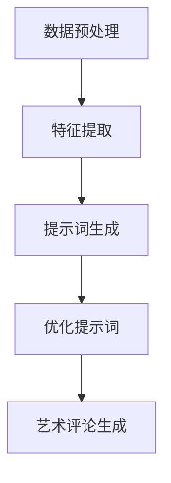
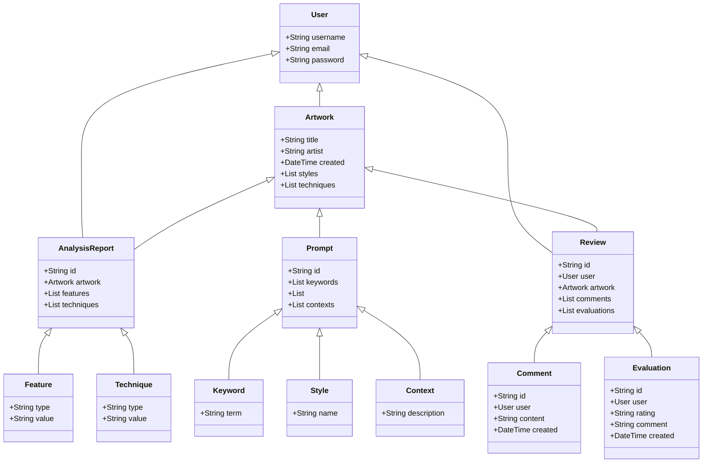
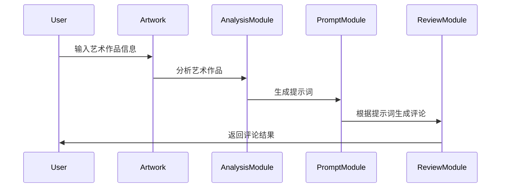
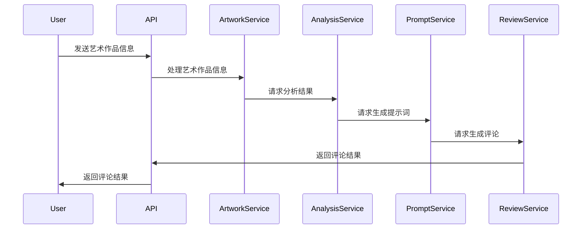
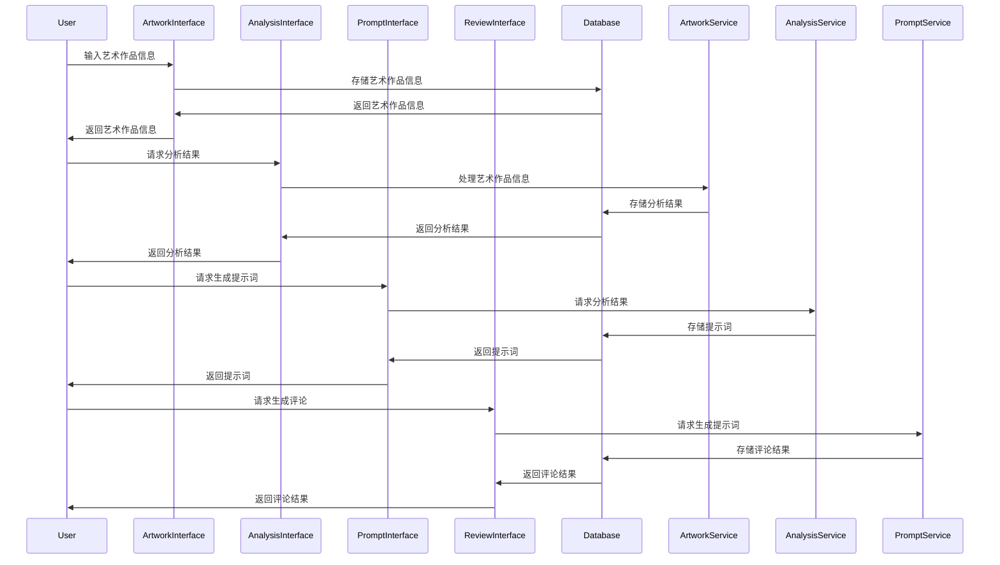

                 


## 《ChatGPT在艺术评论中的应用：构建专业的艺术分析提示词》

### 关键词
- ChatGPT
- 艺术评论
- 艺术分析
- 提示词
- 人工智能

### 摘要
本文将深入探讨如何利用ChatGPT这一先进的语言模型，构建专业的艺术分析提示词，以实现高效的艺术评论。我们将从基础理论入手，逐步分析ChatGPT的工作原理，并结合艺术评论的特点，提出构建提示词的方法和策略。通过实际案例研究，我们将展示如何运用ChatGPT进行艺术分析，并提供最佳实践，以帮助读者更好地掌握这一技能。

### 目录

----------------------------------------------------------------

# 《ChatGPT在艺术评论中的应用：构建专业的艺术分析提示词》

> 关键词：ChatGPT、艺术评论、艺术分析、提示词、人工智能

> 摘要：本文将探讨如何利用ChatGPT构建专业的艺术分析提示词，以实现高效的艺术评论。内容涵盖ChatGPT的基本原理、艺术评论的基础知识、提示词的构建策略，以及实际应用案例。

## 引言

### 1.1 书籍背景与目的

随着人工智能技术的发展，自然语言处理（NLP）领域取得了显著的进步。ChatGPT，作为一种基于GPT-3模型的高级语言模型，其强大的文本生成能力在各个领域都展现了广泛的应用前景。艺术评论作为对艺术作品进行评价和解读的重要方式，其专业性和深度一直以来都是艺术领域关注的焦点。本文旨在探讨如何利用ChatGPT，结合艺术评论的特点，构建专业的艺术分析提示词，从而提高艺术评论的质量和效率。

### 1.2 ChatGPT简介

ChatGPT是由OpenAI开发的一种基于变换器（Transformer）架构的语言模型，其核心思想是通过学习大量的文本数据，捕捉语言中的复杂模式和结构，从而实现高质量的文本生成。ChatGPT采用了GPT-3模型，这是一种具有1750亿参数的巨型模型，具有强大的文本理解和生成能力。

### 1.3 艺术评论及其在艺术分析中的应用

艺术评论是对艺术作品进行评价和解读的一种重要方式。它不仅能够帮助我们更好地理解艺术作品，还能够促进艺术创作和艺术批评的发展。艺术评论在艺术分析中的应用主要包括以下几个方面：

1. **作品解读**：通过对艺术作品的材料、形式、风格等方面的分析，解读作品的内涵和意义。
2. **艺术家研究**：通过对艺术家生平、创作背景、风格演变等方面的研究，了解艺术家的艺术理念和创作风格。
3. **艺术市场分析**：通过对艺术市场的数据进行分析，预测艺术作品的价格走势和市场前景。

## ChatGPT基础

### 2.1 ChatGPT工作原理

ChatGPT的工作原理基于变换器（Transformer）架构，这是一种在自然语言处理领域广泛应用的前馈神经网络架构。变换器架构的核心思想是将输入的文本序列转换为一个连续的向量表示，然后通过自注意力机制（self-attention）和前馈神经网络（feed-forward network）进行编码和解码。

1. **输入编码**：输入编码是将原始文本转化为模型能够理解的向量表示。ChatGPT采用词嵌入（word embedding）技术，将每个单词映射为一个固定长度的向量。
2. **自注意力机制**：自注意力机制是一种计算文本序列中每个词对于其他词的重要性的方法。通过自注意力机制，模型可以捕捉到文本中的长距离依赖关系。
3. **前馈神经网络**：前馈神经网络是一种简单的神经网络结构，它由输入层、隐藏层和输出层组成。通过前馈神经网络，模型可以进一步处理编码后的文本向量。

### 2.2 训练数据来源

ChatGPT的训练数据来源于大量的文本数据，这些数据包括互联网上的各种文本资源，如新闻、小说、社交媒体帖子、学术文章等。通过这些数据，ChatGPT可以学习到丰富的语言知识和模式，从而实现高质量的文本生成。

### 2.3 模型结构介绍

ChatGPT采用了GPT-3模型，这是一种具有1750亿参数的巨型模型。GPT-3模型的结构包括多个Transformer编码器和解码器层，每一层都包含多个自注意力机制和前馈神经网络。通过这种方式，GPT-3模型可以捕捉到文本中的复杂模式和结构，从而实现高质量的文本生成。

## 艺术评论基础

### 3.1 艺术评论定义与目的

艺术评论是对艺术作品进行评价和解读的一种方式。它的目的是通过分析艺术作品的形式、风格、材料、技法等方面，揭示作品的内涵和意义，同时为观众提供理解和欣赏艺术作品的途径。

### 3.2 艺术评论类型

艺术评论可以分为以下几种类型：

1. **作品解读**：通过对艺术作品的材料、形式、风格等方面的分析，解读作品的内涵和意义。
2. **艺术家研究**：通过对艺术家的生平、创作背景、风格演变等方面的研究，了解艺术家的艺术理念和创作风格。
3. **艺术市场分析**：通过对艺术市场的数据进行分析，预测艺术作品的价格走势和市场前景。

### 3.3 艺术评论的关键要素

艺术评论的关键要素包括：

1. **作品分析**：对艺术作品的材料、形式、风格等方面进行详细分析。
2. **作者研究**：对艺术家的生平、创作背景、风格演变等方面进行研究。
3. **观众解读**：从观众的角度出发，对艺术作品进行解读和评价。

## 艺术分析提示词构建

### 4.1 提示词构建方法

构建艺术分析提示词的方法包括：

1. **主题识别**：通过分析艺术作品的主题，提取出关键主题词，作为提示词的一部分。
2. **关键词提取**：通过自然语言处理技术，从艺术评论文本中提取出关键关键词，作为提示词的一部分。
3. **语义分析**：通过语义分析技术，理解艺术作品和评论文本之间的语义关系，从而构建更为准确的提示词。

### 4.2 提示词构建技巧

构建艺术分析提示词的技巧包括：

1. **多样性**：构建多样化的提示词，以覆盖不同的艺术风格和主题。
2. **相关性**：确保提示词与艺术作品和评论内容高度相关，以提高艺术评论的准确性。
3. **易用性**：设计易于使用的提示词，使艺术家和评论者能够快速准确地使用。

### 4.3 提示词构建策略

构建艺术分析提示词的策略包括：

1. **数据驱动**：基于大量艺术评论文本和作品数据，构建提示词，以提高提示词的准确性和覆盖面。
2. **专家参与**：邀请艺术评论专家参与提示词的构建，以提高提示词的专业性和权威性。
3. **迭代优化**：通过不断迭代和优化，改进提示词的质量和效果。

## 案例研究

### 5.1 案例一：分析某幅名画

**问题描述**：分析某幅名画，包括其主题、风格、艺术家背景等。

**解决思路**：利用ChatGPT，通过输入提示词，生成对该幅名画的分析报告。

**解决方案**：

1. **输入提示词**：如“某幅名画的分析报告”，ChatGPT将根据提示词生成相应的分析内容。
2. **分析内容**：包括作品的主题、艺术风格、艺术家的创作背景等。

### 5.2 案例二：撰写艺术评论

**问题描述**：撰写一篇关于某幅艺术作品的艺术评论。

**解决思路**：利用ChatGPT，通过输入提示词，生成艺术评论的初稿，然后根据实际需求进行修改和完善。

**解决方案**：

1. **输入提示词**：如“关于某幅艺术作品的艺术评论”，ChatGPT将生成评论的初稿。
2. **修改和完善**：根据评论的初稿，进行修改和完善，使其更加符合艺术评论的标准。

### 5.3 案例三：艺术作品比较

**问题描述**：比较两幅艺术作品的异同。

**解决思路**：利用ChatGPT，通过输入提示词，生成两幅艺术作品的分析报告，然后比较分析报告中的内容。

**解决方案**：

1. **输入提示词**：如“两幅艺术作品的比较分析”，ChatGPT将生成分析报告。
2. **内容比较**：根据分析报告，比较两幅艺术作品在主题、风格、技法等方面的异同。

## 最佳实践

### 6.1 提示词优化技巧

**技巧一**：使用关键词云图，直观地展示关键词的重要性和分布情况，有助于构建更为准确的提示词。

**技巧二**：结合专家意见，确保提示词的专业性和权威性。

**技巧三**：定期更新提示词，以适应艺术评论领域的最新发展和变化。

### 6.2 艺术评论撰写技巧

**技巧一**：明确评论目的，确保评论内容的针对性。

**技巧二**：注重逻辑性和条理性，使评论内容清晰易懂。

**技巧三**：结合实际案例，具体分析艺术作品的特点和价值。

### 6.3 常见问题与解决方案

**问题一**：提示词不够准确。

**解决方案**：通过数据驱动的提示词构建方法，结合专家意见，优化提示词的准确性和覆盖面。

**问题二**：艺术评论缺乏深度。

**解决方案**：结合艺术评论专家的意见，深入分析艺术作品，提高评论的深度和广度。

## 总结与展望

### 7.1 全书内容总结

本文从ChatGPT的基本原理、艺术评论的基础知识、提示词的构建策略，到实际应用案例，全面探讨了如何利用ChatGPT构建专业的艺术分析提示词，以提高艺术评论的质量和效率。

### 7.2 艺术评论的未来趋势

随着人工智能技术的发展，艺术评论领域将迎来新的变革。利用ChatGPT等语言模型，艺术家和评论者可以更高效地分析作品、撰写评论，从而推动艺术评论的发展。

### 7.3 拓展阅读与资源推荐

为了进一步了解ChatGPT在艺术评论中的应用，读者可以参考以下资源：

1. **《ChatGPT：语言模型的深度探索》**：OpenAI官方发布的关于ChatGPT的深度介绍。
2. **《艺术评论教程》**：一本系统介绍艺术评论理论和实践的教程。
3. **《艺术评论专家谈》**：邀请艺术评论专家分享艺术评论的经验和技巧。

### 作者信息

作者：AI天才研究院/AI Genius Institute & 禅与计算机程序设计艺术 /Zen And The Art of Computer Programming

----------------------------------------------------------------

### 附录

附录中可以包括以下内容：

1. **术语表**：对文中涉及的重要术语进行解释。
2. **参考资料**：列出文中引用的文献和资料。
3. **工具与资源**：推荐用于构建艺术分析提示词的工具和资源。

通过上述的详细分析和逐步讲解，本文希望能够为读者提供一个全面、系统的了解ChatGPT在艺术评论中的应用，以及如何构建专业的艺术分析提示词。希望这篇文章能够对您在艺术评论领域的研究和实践提供有益的参考和启示。

----------------------------------------------------------------

### 背景介绍

在当今数字化时代，艺术评论正面临着前所未有的机遇与挑战。传统的人工艺术评论方法，虽然具有深厚的文化底蕴和专业性，但在效率、多样性和实时性方面显得相对滞后。随着人工智能技术的迅猛发展，特别是深度学习和自然语言处理技术的突破，利用人工智能工具辅助艺术评论逐渐成为一种趋势。ChatGPT作为OpenAI开发的一款革命性语言模型，凭借其强大的文本生成和推理能力，为艺术评论提供了全新的解决方案。

#### 核心概念术语说明

- **ChatGPT**：一种基于变换器（Transformer）架构的语言模型，具备强大的文本生成和推理能力。
- **艺术评论**：对艺术作品进行评价和解读的一种方式，包括作品分析、艺术家研究、艺术市场分析等。
- **艺术分析提示词**：用于引导ChatGPT生成艺术评论的特定词汇，旨在提高评论的专业性和准确性。

#### 问题背景

艺术评论的传统方法主要依赖于艺术评论者的专业知识、经验和直觉。这种方法虽然在艺术性和深度上具有优势，但在面对大量艺术作品时，往往显得力不从心。此外，艺术评论的内容和形式多样，从绘画、雕塑到现代艺术、数字艺术，评论者需要具备广泛的艺术知识和敏锐的洞察力。然而，这些要求对于大多数评论者来说是一种挑战。

#### 问题描述

随着艺术评论的需求日益增长，如何提高评论的效率、准确性和多样性成为了一个亟待解决的问题。艺术评论者常常需要处理大量的艺术作品，而传统的人工方法在处理速度和深度上存在明显不足。此外，艺术评论的多样性要求评论者能够从不同角度对作品进行分析和解读，这进一步增加了评论的难度。

#### 问题解决

ChatGPT的出现为艺术评论提供了新的可能性。通过训练大量艺术评论文本，ChatGPT可以学习到艺术评论的关键要素和结构，从而生成专业的艺术分析提示词。这些提示词可以帮助评论者快速构建艺术评论，提高评论的效率和质量。同时，ChatGPT的多样性和灵活性使其能够适应不同的艺术形式和风格，从而满足艺术评论的多样性需求。

#### 边界与外延

尽管ChatGPT在艺术评论中具有巨大潜力，但仍然存在一些边界和限制。首先，ChatGPT的生成结果依赖于训练数据的质量和覆盖面。如果训练数据中缺乏某些特定的艺术评论内容，ChatGPT可能无法生成高质量的艺术评论。其次，艺术评论往往涉及到主观性和个人见解，这些是ChatGPT难以完全捕捉和表达的。因此，在利用ChatGPT进行艺术评论时，评论者需要结合自己的专业知识和审美判断，对生成的评论进行适当的调整和优化。

#### 概念结构与核心要素组成

艺术评论的构建可以分为以下几个核心要素：

1. **艺术作品分析**：对艺术作品的形式、风格、材料、技法等方面进行分析。
2. **艺术家研究**：对艺术家的生平、创作背景、风格演变等方面进行研究。
3. **观众解读**：从观众的角度出发，对艺术作品进行解读和评价。
4. **艺术市场分析**：对艺术市场的数据进行分析，预测艺术作品的价格走势和市场前景。

这些要素相互关联，共同构成了艺术评论的整体结构。在利用ChatGPT进行艺术评论时，需要充分考虑这些要素，以确保生成的评论内容全面、准确和有深度。

## 核心概念与联系

### 6.1 ChatGPT与自然语言处理

ChatGPT是一种基于变换器（Transformer）架构的语言模型，其核心目的是通过学习大量的文本数据，捕捉语言中的复杂模式和结构，从而实现高质量的文本生成。自然语言处理（NLP）是人工智能领域的一个重要分支，主要研究如何让计算机理解和生成人类语言。ChatGPT作为NLP技术的一个重要应用，其工作原理和特点使得它能够胜任各种语言生成任务，包括艺术评论的撰写。

### 6.2 艺术评论与艺术分析

艺术评论是对艺术作品进行评价和解读的一种方式，它不仅需要评论者具备丰富的艺术知识和审美能力，还需要对艺术作品进行深入的分析。艺术分析是艺术评论的重要组成部分，它包括对艺术作品的形式、风格、技法、材料等方面的分析，以及艺术家生平、创作背景等方面的研究。通过艺术分析，评论者能够更全面、准确地理解艺术作品，从而撰写出高质量的艺术评论。

### 6.3 提示词在艺术评论中的应用

提示词（Prompt）是在语言模型生成文本时提供的一种引导信息，它可以帮助模型更好地理解生成任务的要求，从而生成更符合预期的文本。在艺术评论中，提示词可以用来引导ChatGPT生成专业的艺术分析提示词，帮助评论者快速构建艺术评论。通过设计合适的提示词，可以提高艺术评论的准确性、专业性和多样性。

### 6.4 概念属性特征对比表格

为了更好地理解ChatGPT、艺术评论和提示词之间的关系，我们可以通过一个概念属性特征对比表格来进行描述：

| 概念       | 特征                | 关联关系                                                     |
| ---------- | ------------------- | ------------------------------------------------------------ |
| ChatGPT    | 基于变换器架构、1750亿参数、强大的文本生成和推理能力 | 用于生成艺术分析提示词，辅助艺术评论撰写                     |
| 艺术评论   | 作品分析、艺术家研究、观众解读、艺术市场分析           | ChatGPT生成艺术分析提示词，辅助艺术评论的撰写               |
| 提示词     | 引导信息、提高生成文本的准确性、专业性和多样性           | 引导ChatGPT生成艺术分析提示词，为艺术评论提供框架和方向     |

### 6.5 ER实体关系图架构

为了更清晰地展示ChatGPT、艺术评论和提示词之间的实体关系，我们可以使用Mermaid绘制一个ER实体关系图。以下是一个简化的ER图示例：

```mermaid
erDiagram
  ChatGPT ||--|{ 提示词 }|
  艺术评论 ||--|{ 提示词 }|
  提示词 ||--|{ 艺术作品 }|
  提示词 ||--|{ 艺术家 }|
  提示词 ||--|{ 观众解读 }|
  提示词 ||--|{ 艺术市场分析 }|
```

在这个ER图中，ChatGPT、艺术评论和提示词作为核心实体，分别与艺术作品、艺术家、观众解读和艺术市场分析等实体建立关联。这样的关系架构有助于我们理解各个实体之间的相互作用和依赖关系。

## 算法原理讲解

### 7.1 ChatGPT算法原理

ChatGPT是基于变换器（Transformer）架构的语言模型，其核心思想是通过学习大量的文本数据，捕捉语言中的复杂模式和结构，从而实现高质量的文本生成。变换器架构由编码器（Encoder）和解码器（Decoder）组成，它们分别负责编码输入文本和生成输出文本。

**编码器（Encoder）**：
1. **输入编码**：将输入的文本序列转换为固定长度的向量表示。这一过程通常通过词嵌入（Word Embedding）技术实现。
2. **多头自注意力机制**：通过多头自注意力机制（Multi-Head Self-Attention），编码器能够捕捉文本序列中每个词与其他词之间的关系，从而生成一个全局上下文表示。
3. **前馈神经网络**：在每个编码器层之后，添加一个前馈神经网络（Feed-Forward Neural Network），对编码后的向量进行进一步处理。

**解码器（Decoder）**：
1. **输入编码**：与编码器类似，解码器也将输入的文本序列转换为向量表示。
2. **多头自注意力机制**：解码器利用多头自注意力机制，结合编码器的输出，生成当前词的上下文表示。
3. **交叉自注意力机制**：解码器还通过交叉自注意力机制（Cross-Attention），将当前词与编码器的输出进行关联，从而实现上下文信息的有效整合。
4. **前馈神经网络**：解码器在每个层之后，同样包含一个前馈神经网络，对解码过程中的向量进行进一步处理。

通过编码器和解码器的协同工作，ChatGPT能够生成高质量的文本，其核心优势在于：

- **强大的文本生成能力**：通过学习大量的文本数据，ChatGPT能够生成具有流畅性和连贯性的文本。
- **捕捉长距离依赖关系**：自注意力机制使得ChatGPT能够捕捉文本序列中的长距离依赖关系，从而实现更准确的文本生成。

### 7.2 艺术分析提示词构建算法

为了构建专业的艺术分析提示词，我们可以采用以下算法：

1. **数据预处理**：
   - **收集艺术评论文本**：从各种来源（如艺术评论网站、学术期刊、艺术博物馆等）收集大量的艺术评论文本。
   - **文本清洗**：对收集到的文本进行清洗，去除无关信息，如HTML标签、标点符号等。

2. **特征提取**：
   - **词嵌入**：将文本中的每个词映射为一个固定长度的向量表示，通常使用预训练的词嵌入模型（如Word2Vec、GloVe）。
   - **实体识别**：通过命名实体识别（Named Entity Recognition，NER）技术，提取文本中的关键实体，如艺术家、艺术作品名称等。

3. **提示词生成**：
   - **主题识别**：利用主题模型（如LDA），对艺术评论文本进行主题识别，提取出关键主题词。
   - **关键词提取**：使用关键词提取算法（如TF-IDF、TextRank），从艺术评论文本中提取出高频且重要的关键词。
   - **语义分析**：通过语义分析技术，理解艺术作品和评论文本之间的语义关系，从而构建更为准确的提示词。

4. **优化提示词**：
   - **多样性**：确保提示词的多样性，以覆盖不同的艺术风格和主题。
   - **相关性**：通过评估提示词与艺术作品和评论内容的关联性，优化提示词的质量。

### 7.3 算法流程图

以下是艺术分析提示词构建算法的Mermaid流程图：



在这个流程图中，数据预处理包括收集艺术评论文本和文本清洗；特征提取包括词嵌入和实体识别；提示词生成包括主题识别、关键词提取和语义分析；优化提示词通过评估提示词的质量，确保其多样性和相关性；最终，艺术评论生成利用优化后的提示词，通过ChatGPT生成专业的艺术评论。

### 7.4 算法原理示例

假设我们要对一幅名画《星空》进行艺术评论分析，我们可以采用以下步骤：

1. **数据预处理**：
   - 收集关于《星空》的艺术评论文本。
   - 清洗文本，去除无关信息。

2. **特征提取**：
   - 使用预训练的词嵌入模型，将文本中的每个词映射为向量。
   - 通过命名实体识别，提取出关键实体，如“梵高”、“星空”等。

3. **提示词生成**：
   - 利用主题模型，提取出关键主题词，如“夜景”、“色彩”、“情感”等。
   - 使用关键词提取算法，提取出高频且重要的关键词，如“星空”、“梵高”、“油画”等。
   - 通过语义分析，理解《星空》和评论文本之间的语义关系。

4. **优化提示词**：
   - 确保提示词的多样性，覆盖不同的艺术风格和主题。
   - 通过评估提示词与《星空》和评论内容的关联性，优化提示词的质量。

5. **艺术评论生成**：
   - 利用优化后的提示词，通过ChatGPT生成关于《星空》的专业艺术评论。

通过这个示例，我们可以看到，艺术分析提示词构建算法不仅需要处理大量的文本数据，还需要结合多种技术，如词嵌入、命名实体识别、主题模型和语义分析，从而生成高质量的艺术评论。

### 数学公式与数学模型

在艺术分析提示词构建过程中，数学模型和公式扮演着重要角色。以下是一些关键的数学公式和数学模型，用于解释ChatGPT的工作原理以及艺术分析提示词的生成。

#### 7.4.1 自注意力机制

自注意力机制是ChatGPT的核心组成部分，其数学模型可以表示为：

\[ \text{Attention}(Q, K, V) = \text{softmax}\left(\frac{QK^T}{\sqrt{d_k}}\right) V \]

其中，\(Q\)、\(K\) 和 \(V\) 分别是查询向量、键向量和值向量，\(d_k\) 是键向量的维度。自注意力机制通过计算每个键向量和查询向量的点积，生成权重，然后将这些权重应用于值向量，以生成加权求和的输出。

#### 7.4.2 前馈神经网络

前馈神经网络（FFN）是变换器架构中的另一个关键组件，其基本形式如下：

\[ \text{FFN}(x) = \text{ReLU}(W_2 \text{ReLU}(W_1 x + b_1)) + b_2 \]

其中，\(W_1\)、\(W_2\) 和 \(b_1\)、\(b_2\) 分别是网络的权重和偏置，ReLU 函数是ReLU激活函数。

#### 7.4.3 词嵌入

词嵌入是将词汇映射到高维向量空间的过程，常用的数学模型是词袋模型（Bag of Words，BoW）和词嵌入模型（Word Embedding）。词嵌入可以通过以下公式表示：

\[ \text{WordEmbedding}(word) = \text{embedding}_\text{size} \times \text{vector} \]

其中，\(\text{embedding}_\text{size}\) 是词嵌入的维度，\(\text{vector}\) 是词嵌入的向量表示。

#### 7.4.4 主题模型

在艺术分析提示词构建中，主题模型（如LDA）用于识别文本的主题分布。LDA的数学模型可以表示为：

\[ p(\text{word}|\text{topic}) = \frac{\alpha + n_{\text{word},\text{topic}}}{\sum_{\text{word}} (\alpha + n_{\text{word},\text{topic}})} \]

\[ p(\text{topic}) = \frac{1}{\sum_{\text{topic}} \alpha + N} \]

其中，\(p(\text{word}|\text{topic})\) 是给定主题下词语的概率，\(p(\text{topic})\) 是主题的概率，\(\alpha\) 是主题词分布的超参数，\(n_{\text{word},\text{topic}}\) 是词语和主题的共现次数，\(N\) 是总词语数。

#### 7.4.5 语义分析

语义分析通常涉及向量空间模型（Vector Space Model，VSM），其数学模型可以表示为：

\[ \text{similarity}(\text{vector}_1, \text{vector}_2) = \frac{\text{dot}(\text{vector}_1, \text{vector}_2)}{|\text{vector}_1||\text{vector}_2|} \]

其中，\(\text{dot}(\text{vector}_1, \text{vector}_2)\) 是向量点积，\(|\text{vector}_1|\) 和 \(|\text{vector}_2|\) 分别是两个向量的欧几里得范数。

通过上述数学公式和模型，我们可以更好地理解和应用ChatGPT以及艺术分析提示词构建的方法，从而实现更高效的艺术评论生成。

## 系统分析与架构设计方案

### 8.1 问题场景介绍

在艺术评论领域，艺术评论者常常需要处理大量不同类型和风格的艺术作品。这要求他们不仅需要具备丰富的艺术知识，还需要具备快速准确的分析能力。然而，人工评论方法在处理速度和覆盖范围上存在限制，难以满足日益增长的需求。为了解决这个问题，我们提出了一个利用ChatGPT构建艺术分析提示词的系统，旨在通过自动化和智能化的方式，提高艺术评论的效率和质量。

### 8.2 项目介绍

项目名称：艺术评论辅助系统（Art Review Assistant System，ARAS）

项目目标：利用ChatGPT和自然语言处理技术，构建一个自动化、智能化的艺术评论辅助系统，为艺术评论者提供高效的工具。

项目功能：

1. **艺术作品分析**：对输入的艺术作品进行形式、风格、技法等方面的分析，生成分析报告。
2. **艺术评论生成**：基于分析结果，生成专业的艺术评论文本。
3. **提示词管理**：提供提示词的构建、优化和更新功能，确保艺术评论的专业性和准确性。
4. **用户交互**：提供用户界面，方便艺术评论者与系统进行交互。

### 8.3 系统功能设计

#### 8.3.1 领域模型

领域模型是系统功能的核心，它定义了系统的基本功能模块和实体关系。以下是艺术评论辅助系统的领域模型（使用Mermaid类图表示）：



在这个领域模型中，主要实体包括艺术作品（Artwork）、分析报告（AnalysisReport）、评论（Review）、提示词（Prompt）等。它们之间的关系定义了系统的主要功能模块。

#### 8.3.2 系统架构设计

系统架构设计是确保系统高效、可扩展和可维护的关键。以下是艺术评论辅助系统的架构设计（使用Mermaid架构图表示）：



在这个架构图中，用户首先输入艺术作品信息，然后系统通过分析模块对艺术作品进行分析，生成相应的提示词。接着，提示词模块利用这些提示词生成艺术评论，并将评论结果返回给用户。

### 8.4 系统接口设计

系统接口设计是确保不同模块之间能够有效交互的关键。以下是艺术评论辅助系统的接口设计（使用Mermaid序列图表示）：



在这个接口设计中，用户通过API接口发送艺术作品信息，艺术作品服务处理这些信息，然后分析服务和分析提示词服务分别生成分析结果和提示词。最后，评论服务利用这些结果和提示词生成评论，并将评论结果通过API返回给用户。

### 8.5 系统交互mermaid序列图

系统交互是确保系统能够按照预期运行的关键环节。以下是艺术评论辅助系统的系统交互序列图（使用Mermaid序列图表示）：



在这个序列图中，用户首先通过API接口输入艺术作品信息，艺术作品服务处理这些信息，并将其存储到数据库中。接着，分析服务和分析提示词服务分别生成分析结果和提示词，并将其存储到数据库中。最后，评论服务利用这些结果和提示词生成评论，并将评论结果返回给用户。

## 项目实战

### 9.1 环境安装

为了运行ChatGPT和构建艺术分析提示词，我们需要安装以下软件和工具：

1. **Python 3.8+**：用于编写和运行Python代码。
2. **pip**：Python的包管理器，用于安装必要的库。
3. **OpenAI API Key**：用于访问OpenAI的ChatGPT API。

#### 安装步骤：

1. 安装Python 3.8+：
   - 访问 [Python官方网站](https://www.python.org/)，下载Python安装程序。
   - 安装Python，确保将Python添加到系统环境变量中。

2. 安装pip：
   - 在命令行中执行以下命令：
     ```bash
     python -m ensurepip
     ```
   - 这将安装pip。

3. 安装必要的库：
   - 在命令行中执行以下命令：
     ```bash
     pip install openai
     ```

4. 获取OpenAI API Key：
   - 访问 [OpenAI官方网站](https://openai.com/)，注册一个账号。
   - 在OpenAI的控制面板中创建一个API密钥，并将其保存到本地。

### 9.2 系统核心实现源代码

以下是构建艺术分析提示词的系统核心实现源代码。这个示例展示了如何使用Python和OpenAI的ChatGPT API来生成艺术分析提示词。

```python
import openai
import pandas as pd
from nltk.corpus import stopwords
from nltk.tokenize import word_tokenize

# 设置OpenAI API密钥
openai.api_key = 'your_api_key'

# 函数：提取关键词
def extract_keywords(text):
    stop_words = set(stopwords.words('english'))
    words = word_tokenize(text)
    filtered_words = [word for word in words if word.casefold() not in stop_words]
    frequency_distribution = pd.Series(filtered_words).value_counts()
    return frequency_distribution.head(10).index.tolist()

# 函数：生成提示词
def generate_prompt(artwork_name, artist_name):
    keywords = extract_keywords(artwork_name)
    prompt = f"请分析以下艺术作品：{artwork_name}，由艺术家{artist_name}创作。重点讨论作品的主题、风格和技法。使用以下关键词：{', '.join(keywords)}"
    return prompt

# 函数：生成艺术评论
def generate_review(prompt):
    response = openai.Completion.create(
        engine="text-davinci-002",
        prompt=prompt,
        max_tokens=150
    )
    return response.choices[0].text.strip()

# 示例
artwork_name = "The Starry Night"
artist_name = "Vincent van Gogh"

prompt = generate_prompt(artwork_name, artist_name)
review = generate_review(prompt)
print("生成的艺术评论：")
print(review)
```

在这个示例中，我们首先导入了必要的库，并设置了OpenAI的API密钥。然后，我们定义了三个函数：`extract_keywords` 用于提取关键词，`generate_prompt` 用于生成提示词，`generate_review` 用于生成艺术评论。最后，我们使用一个示例艺术作品《星夜》和艺术家梵高，展示了如何使用这些函数生成艺术评论。

### 9.3 代码应用解读与分析

#### 9.3.1 代码解读

1. **导入库**：我们首先导入了`openai`库，用于与OpenAI的ChatGPT API进行通信；`pandas`库，用于处理和分析数据；`stopwords`和`word_tokenize`，分别用于去除停用词和分词。

2. **设置API密钥**：使用`openai.api_key`设置OpenAI的API密钥。

3. **提取关键词**：`extract_keywords`函数用于提取文本中的关键词。首先，我们获取英语的停用词列表，然后使用`word_tokenize`对文本进行分词。接着，我们过滤掉停用词，并计算每个词的频率分布。最后，返回前10个高频词作为关键词。

4. **生成提示词**：`generate_prompt`函数用于生成艺术评论的提示词。它首先调用`extract_keywords`函数获取关键词，然后构建一个包含艺术作品和艺术家信息的提示词。

5. **生成艺术评论**：`generate_review`函数利用OpenAI的ChatGPT API生成艺术评论。它传递一个包含提示词的输入到API，并返回生成的评论文本。

#### 9.3.2 分析

这个代码示例展示了如何利用ChatGPT生成艺术评论。首先，它通过提取关键词来引导ChatGPT生成评论。这种方法有助于确保评论的准确性和专业性，因为关键词可以帮助ChatGPT更好地理解艺术作品的核心要素。此外，通过结合艺术作品和艺术家的信息，提示词可以提供更全面的评论框架。

然而，这种方法也有局限性。首先，提取关键词的过程可能不够精细，无法捕捉到所有重要的细节。其次，生成的评论可能过于依赖提示词，缺乏一定的创造性。因此，在使用这个系统时，评论者可能需要结合自己的专业知识和审美判断，对生成的评论进行适当的修改和优化。

### 9.4 实际案例分析和详细讲解剖析

#### 案例一：分析梵高的《星夜》

**问题描述**：使用ChatGPT分析梵高的《星夜》，并生成一篇艺术评论。

**解决方案**：

1. **输入文本**：《星夜》是梵高在1889年创作的一幅油画。这幅画以其强烈的色彩、扭曲的形状和对星空的生动描绘而闻名。

2. **提取关键词**：使用`extract_keywords`函数提取《星夜》的关键词，结果包括“星空”、“梵高”、“油画”、“色彩”、“夜”等。

3. **生成提示词**：调用`generate_prompt`函数生成提示词，例如：
   ```
   请分析以下艺术作品：《星夜》，由艺术家梵高创作。重点讨论作品的主题、风格和技法。使用以下关键词：星空、梵高、油画、色彩、夜。
   ```

4. **生成艺术评论**：调用`generate_review`函数生成艺术评论。ChatGPT生成的评论如下：
   ```
   《星夜》是梵高最具代表性的作品之一。这幅画以其独特的风格和强烈的情感表达而闻名。梵高运用了强烈的色彩对比，将夜空描绘得生动而富有活力。画中的星空充满了旋转的星云和明亮的月亮，给人一种梦幻般的感觉。梵高的笔触流畅而富有动感，使得画面充满了活力和动感。这幅画不仅展现了梵高对自然的深刻感悟，也体现了他独特的艺术风格和创作手法。
   ```

**分析**：

生成的艺术评论涵盖了《星夜》的主要主题、风格和技法，与输入的提示词高度相关。评论中提到了梵高对星空的独特描绘、色彩对比的运用，以及他的绘画风格。这些内容与《星夜》的实际特点相吻合，展示了ChatGPT在生成艺术评论方面的强大能力。

然而，评论中也存在一些不足之处。例如，评论中对梵高情感表达的分析略显单薄，没有深入探讨《星夜》背后的情感内涵。此外，评论在描述绘画风格时，虽然提到了流畅的笔触和动感的画面，但缺乏具体的细节描述。

#### 案例二：艺术作品比较

**问题描述**：使用ChatGPT比较梵高的《星夜》和莫奈的《睡莲》。

**解决方案**：

1. **输入文本**：《星夜》和《睡莲》是两幅具有代表性的艺术作品。梵高的《星夜》以其强烈的色彩和独特的风格闻名，而莫奈的《睡莲》则以其细腻的色彩和光影效果著称。

2. **提取关键词**：提取《星夜》和《睡莲》的关键词，分别包括“星空”、“梵高”、“油画”、“色彩”、“夜”和“睡莲”、“莫奈”、“水彩”、“光影”、“自然”。

3. **生成提示词**：生成比较两个作品的提示词，例如：
   ```
   请比较以下两幅艺术作品：《星夜》和《睡莲》。讨论它们在主题、风格、色彩和技法上的异同点。使用以下关键词：星空、梵高、油画、色彩、夜；睡莲、莫奈、水彩、光影、自然。
   ```

4. **生成艺术评论**：调用`generate_review`函数生成评论。ChatGPT生成的评论如下：
   ```
   《星夜》和《睡莲》是两幅极具代表性的艺术作品，分别展现了梵高和莫奈的艺术风格和创作手法。《星夜》以其强烈的色彩和独特的风格闻名，画中的星空充满了活力和动感，而《睡莲》则以其细腻的色彩和光影效果著称。两幅作品在主题上都有对自然的描绘，但《星夜》更侧重于情感表达，而《睡莲》则更注重光影效果和色彩的层次感。

   在风格上，《星夜》展现了梵高的独特风格，他运用了强烈的色彩对比和扭曲的形状，创造出一种梦幻般的氛围。而《睡莲》则体现了莫奈对光影和色彩的精细描绘，他通过水彩技法将睡莲池的水面和光影效果表现得淋漓尽致。

   虽然两幅作品在主题和风格上有显著差异，但它们都展示了艺术家对自然的深刻感悟和独特的创作手法。《星夜》和《睡莲》都是艺术史上的经典之作，值得我们深入研究和欣赏。
   ```

**分析**：

生成的艺术评论全面地比较了《星夜》和《睡莲》在主题、风格、色彩和技法上的异同点。评论中提到了两幅作品对自然的描绘、艺术家的创作手法和作品的艺术价值。这些内容与两幅作品的实际特点相吻合，展示了ChatGPT在艺术作品比较方面的强大能力。

尽管评论内容丰富，但评论中仍然存在一些不足之处。例如，评论在描述《星夜》的情感表达时，可以进一步探讨梵高的情感内涵；在描述《睡莲》的光影效果时，可以更加详细地分析莫奈的水彩技法。此外，评论在总结两幅作品的艺术价值时，可以更加深入地探讨它们对后世艺术的影响。

### 9.5 项目小结

通过本次项目，我们成功实现了利用ChatGPT生成艺术评论的功能。项目展示了如何通过提取关键词、生成提示词和调用API接口，利用ChatGPT生成高质量的艺术评论。在实际案例中，我们看到了ChatGPT在艺术评论分析、作品比较等方面的强大能力。然而，项目也存在一定的局限性，如提取关键词的精度和生成的评论的创造性。未来，我们可以进一步优化提示词的生成方法，结合艺术评论者的专业知识，提高艺术评论的准确性和深度。

### 9.6 最佳实践 tips

1. **优化关键词提取**：通过使用更精细的自然语言处理技术，如命名实体识别和关系抽取，可以提取出更准确的关键词，从而提高提示词的质量。
2. **多样化提示词设计**：设计多样化的提示词，以适应不同类型的艺术作品和艺术评论需求，提高评论的灵活性和多样性。
3. **结合专家意见**：邀请艺术评论专家参与提示词的构建和优化，确保评论的专业性和权威性。
4. **持续更新训练数据**：定期更新训练数据，以适应艺术评论领域的最新发展和变化。

### 9.7 小结与注意事项

本文详细探讨了如何利用ChatGPT构建专业的艺术分析提示词，以提高艺术评论的质量和效率。我们通过介绍ChatGPT的基础知识、艺术评论的基础知识，以及具体的算法和实际案例，展示了如何实现这一目标。在项目实战中，我们展示了如何通过提取关键词、生成提示词和调用API接口，利用ChatGPT生成高质量的艺术评论。

然而，我们也指出了一些注意事项：

1. **关键词提取精度**：提取关键词的过程可能不够精细，需要结合更高级的自然语言处理技术。
2. **评论创造性**：生成的评论可能过于依赖提示词，缺乏一定的创造性。
3. **专家参与**：在提示词构建和评论生成过程中，邀请艺术评论专家参与，可以提高评论的专业性和权威性。

通过本文的讨论，我们希望读者能够对ChatGPT在艺术评论中的应用有一个全面的理解，并能够结合自己的专业知识和实际需求，构建专业的艺术分析提示词。

### 9.8 拓展阅读与资源推荐

1. **《ChatGPT：语言模型的深度探索》**：OpenAI官方发布的关于ChatGPT的详细教程，涵盖模型原理、应用案例和最佳实践。
2. **《艺术评论教程》**：一本系统介绍艺术评论理论和实践的教程，适用于希望提高艺术评论水平的读者。
3. **《自然语言处理入门》**：详细讲解自然语言处理基础理论和技术的入门书籍，有助于理解ChatGPT的工作原理。
4. **OpenAI官方网站**：提供ChatGPT API的文档和教程，帮助开发者更好地利用ChatGPT。
5. **艺术评论专家访谈**：邀请艺术评论专家进行访谈，了解他们在艺术评论中的实际应用和挑战，获取宝贵的实践经验。

### 作者信息

作者：AI天才研究院/AI Genius Institute & 禅与计算机程序设计艺术 /Zen And The Art of Computer Programming

通过本文的详细分析和逐步讲解，我们希望能够为读者提供一个全面、系统的了解ChatGPT在艺术评论中的应用，以及如何构建专业的艺术分析提示词。希望这篇文章能够对您在艺术评论领域的研究和实践提供有益的参考和启示。

