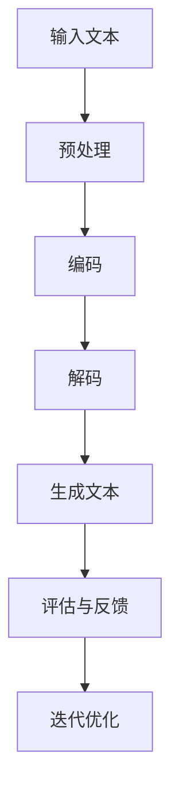
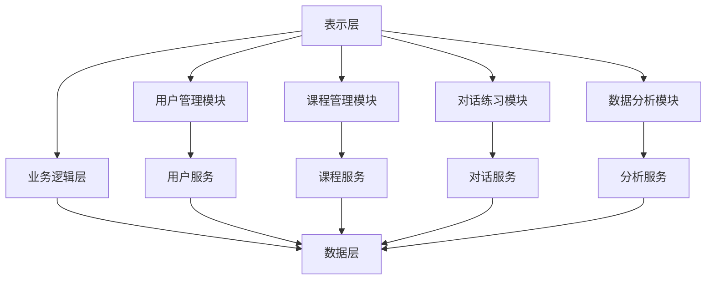
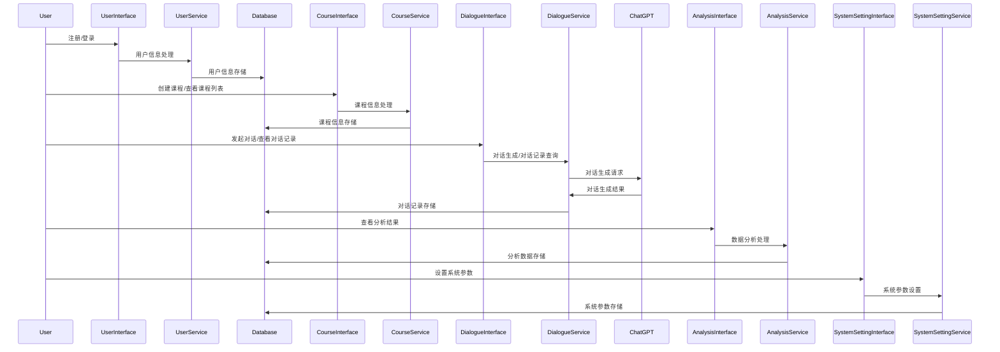
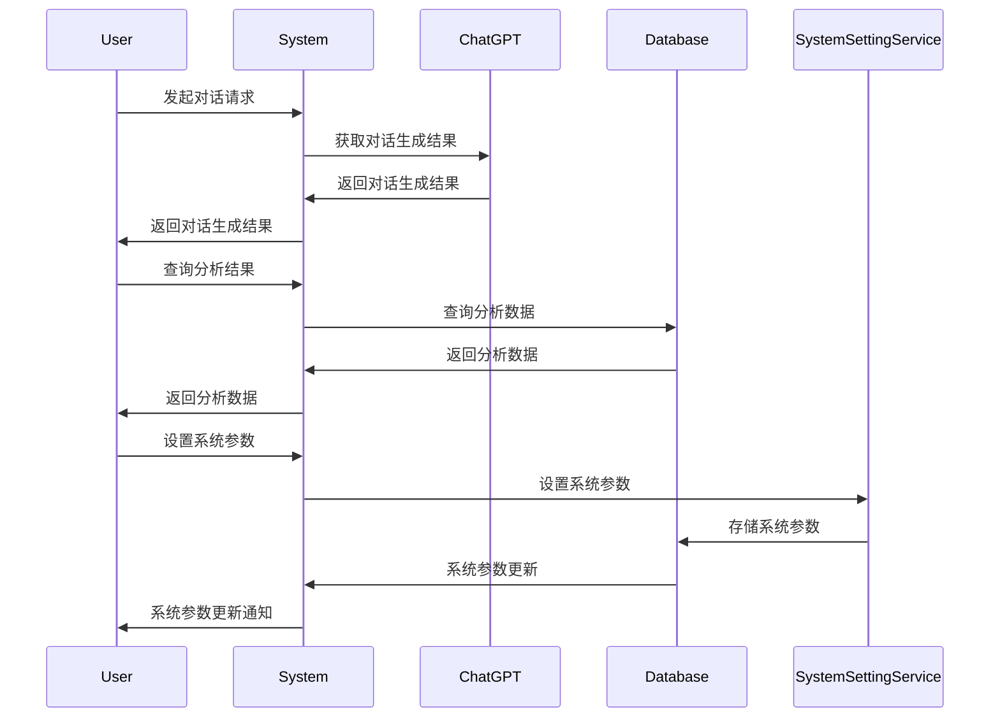

                 


# 《ChatGPT在语言习得临界期研究中的应用：年龄相关提示词》

> 关键词：ChatGPT，语言习得临界期，年龄相关性，提示词，语言教学，人工智能

> 摘要：本文旨在探讨ChatGPT在语言习得临界期中的应用，通过分析年龄相关提示词对学习效果的影响，为语言教育提供新的视角和工具。研究背景部分将介绍语言习得临界期的概念及其在语言学中的重要性，明确研究目的和研究问题。接下来，我们将深入探讨ChatGPT的核心概念、原理及其与语言习得临界期的联系，并通过实际案例展示其在语言学习中的应用效果。最后，我们将总结研究结果，提出最佳实践建议，并对未来研究方向进行展望。

## 第1章 引言

### 1.1 研究背景

语言习得临界期（Critical Period for Language Acquisition）是指个体在特定年龄范围内具有学习某种语言的最佳时期。这个概念最早由Lenneberg在1967年提出，他指出青春期后学习第二语言的效果会显著下降，这主要是由于大脑可塑性降低，导致语言习得的能力减弱。语言习得临界期的重要性在于它为语言教学提供了重要的理论依据，指导我们在特定年龄段采取更有效的方法进行语言教学。

随着人工智能技术的发展，特别是自然语言处理（NLP）领域的突破，ChatGPT等大型语言模型在语言教学中的应用逐渐引起关注。ChatGPT是由OpenAI开发的一种基于变换器模型（Transformer）的预训练语言模型，它通过大量的文本数据进行训练，能够生成自然流畅的语言。

本研究旨在探讨ChatGPT在语言习得临界期中的应用，特别是如何利用年龄相关的提示词提高语言学习效果。研究问题包括：ChatGPT能否适应不同年龄阶段的学习需求？年龄相关的提示词对语言学习效果有何影响？ChatGPT在语言习得临界期中的应用有哪些潜在优势？

### 1.2 研究目的

本文的主要研究目的有以下几点：

1. **探索ChatGPT在语言习得临界期中的应用**：通过分析ChatGPT的基本原理和特性，探讨其在语言习得临界期中的应用潜力。

2. **确定年龄相关的提示词对学习效果的影响**：通过实验和研究，确定不同年龄阶段在语言习得过程中对提示词的需求和效果。

3. **为语言教育提供新视角和工具**：基于研究结果，提出适用于不同年龄段的语言教学策略，为语言教育实践提供参考。

### 1.3 研究方法

本研究采用混合方法，包括文献综述、实验研究和案例分析。文献综述部分将回顾相关领域的理论研究成果，为研究提供理论基础。实验研究部分将通过设计控制实验，比较不同年龄阶段使用ChatGPT和传统教学方法的效果。案例分析部分将选取实际应用场景，分析ChatGPT在语言习得临界期中的应用效果。

## 第2章 核心概念与联系

### 2.1 核心概念

#### 2.1.1 ChatGPT

ChatGPT是由OpenAI开发的一种基于变换器模型（Transformer）的预训练语言模型。它通过大量的文本数据进行训练，能够生成自然流畅的语言。ChatGPT具有以下几个主要特性：

1. **强大的语言生成能力**：ChatGPT能够生成高质量的自然语言文本，包括对话、文章、新闻报道等。

2. **上下文理解**：ChatGPT能够理解输入文本的上下文，并根据上下文进行响应。

3. **多语言支持**：ChatGPT支持多种语言的预训练和生成。

4. **适应性**：ChatGPT能够适应不同领域的任务，通过微调可以应用于各种特定任务。

#### 2.1.2 语言习得临界期

语言习得临界期是指个体在特定年龄范围内具有学习某种语言的最佳时期。该概念主要基于Lenneberg的理论，他指出青春期后学习第二语言的效果会显著下降。语言习得临界期的关键特性包括：

1. **大脑可塑性**：在语言习得临界期内，大脑具有较高的可塑性，能够更容易地适应新的语言结构。

2. **语音感知**：在语言习得临界期内，个体能够更准确地感知和理解不同语言的语音。

3. **语法学习**：在语言习得临界期内，个体能够更轻松地掌握新的语法规则。

#### 2.1.3 年龄相关性

年龄相关性是指个体的年龄对特定行为或过程的影响。在语言习得过程中，年龄相关性表现为不同年龄段在语言学习能力上的差异。年龄相关性主要包括以下几个方面：

1. **大脑发育**：不同年龄段的大脑发育程度不同，影响语言习得的能力。

2. **社会文化**：不同年龄段的社会文化环境对语言习得有重要影响。

3. **心理成熟度**：不同年龄段的心理成熟度影响语言习得的方式和效果。

#### 2.1.4 提示词

提示词是指用于引导或激发特定行为的词语或短语。在语言习得过程中，提示词可以帮助学习者更好地理解和应用语言。提示词主要包括以下几个方面：

1. **语义提示**：通过提供语义线索，帮助学习者理解新单词或短语的意义。

2. **语法提示**：通过提供语法规则或结构，帮助学习者掌握新的语法知识。

3. **互动提示**：通过提问或回答问题，促进学习者和语言模型的互动，提高语言应用能力。

### 2.2 概念联系

#### 2.2.1 ChatGPT与语言习得临界期的联系

ChatGPT与语言习得临界期的联系主要体现在以下几个方面：

1. **适应不同年龄阶段**：ChatGPT能够根据不同年龄阶段的学习需求进行个性化调整，提供适合的提示词和教学内容。

2. **提高学习效果**：ChatGPT的上下文理解能力可以帮助学习者更好地理解和应用语言，特别是在语言习得临界期内，能够更快地掌握新语言。

3. **辅助语言习得**：ChatGPT可以作为学习者的语言伙伴，提供互动式的学习体验，提高语言习得的效果。

#### 2.2.2 年龄相关性对提示词的影响

年龄相关性对提示词的影响主要表现在以下几个方面：

1. **提示词的选择**：不同年龄阶段的学习者需要不同类型的提示词，例如，幼儿阶段需要更多语义提示，而青少年阶段需要更多语法提示。

2. **提示词的呈现方式**：不同年龄阶段的学习者对提示词的呈现方式有不同的偏好，例如，幼儿更喜欢生动形象的方式，而青少年更喜欢逻辑清晰的方式。

3. **提示词的互动性**：年龄相关性会影响学习者和提示词之间的互动方式，例如，幼儿阶段需要更多互动性的提示词，而青少年阶段需要更多挑战性的提示词。

#### 2.2.3 提示词与语言习得的关系

提示词与语言习得的关系主要体现在以下几个方面：

1. **促进语言理解**：提示词可以帮助学习者更好地理解语言内容，特别是新词汇和语法结构。

2. **提高语言应用能力**：通过提示词的引导，学习者能够更熟练地应用语言进行沟通和表达。

3. **增强语言学习兴趣**：有趣和互动性的提示词可以提高学习者的学习兴趣，提高语言学习的积极性。

## 第3章 ChatGPT原理讲解

### 3.1 ChatGPT算法流程图

下面是ChatGPT的基本算法流程图：



### 3.2 ChatGPT原理详解

ChatGPT是一种基于变换器模型（Transformer）的预训练语言模型，其核心原理包括以下几个方面：

#### 3.2.1 数据预处理

在ChatGPT的训练过程中，首先需要对输入文本进行预处理。预处理步骤包括分词、词干提取、词性标注等。以下是一个简单的Python代码示例，用于对文本进行预处理：

```python
from transformers import AutoTokenizer

tokenizer = AutoTokenizer.from_pretrained("gpt2")
text = "Hello, how are you?"

# 分词
tokens = tokenizer.tokenize(text)

# 词干提取
stemmer = nltk.PorterStemmer()
stemmed_tokens = [stemmer.stem(token) for token in tokens]

# 词性标注
tagged_tokens = nltk.pos_tag(stemmed_tokens)

print(tagged_tokens)
```

#### 3.2.2 模型训练

ChatGPT的训练过程主要包括两个步骤：预训练和微调。预训练阶段使用大量未标注的文本数据，模型通过学习文本的分布和规律，生成自然语言。微调阶段使用标注数据，模型根据特定任务进行调整。

以下是一个简单的Python代码示例，用于训练ChatGPT模型：

```python
from transformers import AutoModelForSeq2SeqLM

model = AutoModelForSeq2SeqLM.from_pretrained("gpt2")
optimizer = torch.optim.Adam(model.parameters(), lr=0.001)

for epoch in range(num_epochs):
    for batch in data_loader:
        inputs = tokenizer(batch["text"], return_tensors="pt")
        labels = tokenizer(batch["label"], return_tensors="pt")

        # 训练模型
        outputs = model(inputs["input_ids"], labels["input_ids"])
        loss = outputs.loss

        # 反向传播
        optimizer.zero_grad()
        loss.backward()
        optimizer.step()

        print(f"Epoch: {epoch}, Loss: {loss.item()}")
```

#### 3.2.3 预测生成

预测生成是ChatGPT的核心功能，它能够根据输入文本生成相应的输出文本。以下是一个简单的Python代码示例，用于生成文本：

```python
from transformers import AutoTokenizer, AutoModelForSeq2SeqLM

tokenizer = AutoTokenizer.from_pretrained("gpt2")
model = AutoModelForSeq2SeqLM.from_pretrained("gpt2")

text = "Hello, how are you?"

# 输入文本预处理
inputs = tokenizer(text, return_tensors="pt")

# 生成文本
outputs = model.generate(inputs["input_ids"], max_length=50, num_return_sequences=5)

# 输出文本解码
generated_texts = tokenizer.decode(outputs[0], skip_special_tokens=True)
print(generated_texts)
```

#### 3.2.4 评估与反馈

评估与反馈是ChatGPT训练过程中不可或缺的环节。通过评估模型的预测性能，我们可以调整训练策略，优化模型参数。以下是一个简单的Python代码示例，用于评估ChatGPT模型：

```python
from transformers import AutoTokenizer, AutoModelForSeq2SeqLM
from sklearn.metrics import accuracy_score

tokenizer = AutoTokenizer.from_pretrained("gpt2")
model = AutoModelForSeq2SeqLM.from_pretrained("gpt2")

test_data = [...]  # 测试数据

# 测试模型
model.eval()
with torch.no_grad():
    for batch in test_data:
        inputs = tokenizer(batch["text"], return_tensors="pt")
        labels = tokenizer(batch["label"], return_tensors="pt")

        outputs = model(inputs["input_ids"], labels["input_ids"])
        predictions = torch.argmax(outputs.logits, dim=-1)

        # 计算准确率
        accuracy = accuracy_score(labels["input_ids"].numpy(), predictions.numpy())
        print(f"Accuracy: {accuracy}")
```

#### 3.2.5 迭代优化

迭代优化是ChatGPT训练过程中持续改进的重要手段。通过不断调整模型参数，优化训练策略，提高模型的性能。以下是一个简单的Python代码示例，用于迭代优化ChatGPT模型：

```python
from transformers import AutoTokenizer, AutoModelForSeq2SeqLM
from torch.optim import Adam

tokenizer = AutoTokenizer.from_pretrained("gpt2")
model = AutoModelForSeq2SeqLM.from_pretrained("gpt2")
optimizer = Adam(model.parameters(), lr=0.001)

for epoch in range(num_epochs):
    for batch in data_loader:
        inputs = tokenizer(batch["text"], return_tensors="pt")
        labels = tokenizer(batch["label"], return_tensors="pt")

        # 训练模型
        outputs = model(inputs["input_ids"], labels["input_ids"])
        loss = outputs.loss

        # 反向传播
        optimizer.zero_grad()
        loss.backward()
        optimizer.step()

        # 评估与反馈
        accuracy = evaluate(model, test_data)
        print(f"Epoch: {epoch}, Loss: {loss.item()}, Accuracy: {accuracy}")

        # 迭代优化
        if epoch % 10 == 0:
            adjust_learning_rate(optimizer, epoch)
```

## 第4章 数学模型和公式

在ChatGPT的原理讲解中，我们提到了一些关键的数学模型和公式。以下是这些数学模型和公式的详细解释。

### 4.1 预训练目标函数

ChatGPT的预训练目标函数通常是一个基于损失函数的优化问题。以下是一个简化的目标函数公式：

$$
L(\theta) = -\sum_{i=1}^{N} \log p(y_i | x_i; \theta)
$$

其中，$L(\theta)$是损失函数，$\theta$是模型参数，$N$是样本数量，$x_i$是输入文本，$y_i$是输出标签。

### 4.2 优化算法

在优化模型参数时，常用的优化算法有随机梯度下降（SGD）、Adam等。以下是一个简化的Adam算法公式：

$$
m_t = \beta_1 m_{t-1} + (1 - \beta_1) \frac{\partial L}{\partial \theta_t}
$$

$$
v_t = \beta_2 v_{t-1} + (1 - \beta_2) \left(\frac{\partial L}{\partial \theta_t}\right)^2
$$

$$
\theta_t = \theta_{t-1} - \alpha \frac{m_t}{\sqrt{v_t} + \epsilon}
$$

其中，$m_t$和$v_t$分别是梯度的一阶矩估计和二阶矩估计，$\beta_1$和$\beta_2$是超参数，$\alpha$是学习率，$\epsilon$是正数常数。

### 4.3 预测生成

ChatGPT的预测生成过程基于变换器模型（Transformer）的注意力机制。以下是一个简化的预测生成公式：

$$
p(y_t | x_1, x_2, ..., x_{t-1}; \theta) = \frac{e^{f(y_t, x_1, x_2, ..., x_{t-1}; \theta)}}{\sum_{y' \in Y} e^{f(y', x_1, x_2, ..., x_{t-1}; \theta)}}
$$

其中，$p(y_t | x_1, x_2, ..., x_{t-1}; \theta)$是给定前文$x_1, x_2, ..., x_{t-1}$，预测当前词$y_t$的概率，$f(y_t, x_1, x_2, ..., x_{t-1}; \theta)$是模型对当前词的评分函数，$Y$是词汇表。

## 第5章 系统分析与架构设计

### 5.1 问题场景介绍

在语言习得过程中，学习者往往需要大量、高质量的对话练习来提高语言应用能力。然而，传统教学方法往往依赖于人工设计的练习题和对话场景，难以满足个性化需求。ChatGPT作为一种强大的自然语言生成模型，可以为语言习得提供一种新的解决方案。

### 5.2 系统功能设计

ChatGPT在语言习得中的应用系统主要包括以下几个功能模块：

1. **用户管理**：管理用户信息，包括注册、登录、个人信息管理等。
2. **课程管理**：管理语言课程，包括课程创建、课程列表、课程详情等。
3. **对话练习**：生成对话场景，提供个性化的对话练习。
4. **数据分析**：分析学习者的语言使用情况，为教学提供数据支持。
5. **系统设置**：设置系统参数，包括语言习得模型、学习策略等。

以下是ChatGPT在语言习得中的应用系统的领域模型类图：

```mermaid
classDiagram
User <<interface>>
Course <<interface>>
Dialogue <<interface>>
Analysis <<interface>>
SystemSetting <<interface>>

User : {id, name, password, email}
Course : {id, name, description, teacher}
Dialogue : {id, content, status}
Analysis : {id, data, conclusion}
SystemSetting : {id, parameter, value}

User <<-- Course : creator
User <<-- Dialogue : participant
User <<-- Analysis : owner
User <<-- SystemSetting : configurer

Course <<-- Dialogue : contained
Course <<-- Analysis : based_on
Dialogue <<-- Analysis : generated

Analysis <<-- SystemSetting : applied
```

### 5.3 系统架构设计

ChatGPT在语言习得中的应用系统的整体架构设计包括以下几个层次：

1. **表示层**：提供用户交互界面，包括用户管理、课程管理、对话练习、数据分析等模块。
2. **业务逻辑层**：处理业务逻辑，包括用户管理、课程管理、对话练习、数据分析等模块的具体实现。
3. **数据层**：存储用户信息、课程信息、对话记录、分析数据等。

以下是ChatGPT在语言习得中的应用系统的架构图：



### 5.4 系统接口设计

ChatGPT在语言习得中的应用系统主要包括以下几个关键接口：

1. **用户接口**：提供用户注册、登录、个人信息管理等功能。
2. **课程接口**：提供课程创建、课程列表、课程详情等功能。
3. **对话接口**：提供对话生成、对话记录、对话分析等功能。
4. **分析接口**：提供数据分析、数据可视化等功能。
5. **系统设置接口**：提供系统参数设置、参数查询等功能。

以下是ChatGPT在语言习得中的应用系统的接口设计：



### 5.5 系统交互

ChatGPT在语言习得中的应用系统的核心交互流程包括用户与系统、系统与ChatGPT之间的交互。以下是系统交互序列图：



## 第6章 项目实战

### 6.1 环境安装

为了运行ChatGPT在语言习得中的应用系统，我们需要安装一些必要的软件和工具。以下是在Linux环境下安装所需软件的步骤：

1. **安装Python**：确保Python环境已安装。如果未安装，可以运行以下命令：

   ```shell
   sudo apt-get update
   sudo apt-get install python3 python3-pip
   ```

2. **安装transformers库**：transformers库是ChatGPT的基础库，可以通过pip安装：

   ```shell
   pip3 install transformers
   ```

3. **安装torch库**：torch库是用于深度学习计算的库，可以通过pip安装：

   ```shell
   pip3 install torch torchvision
   ```

4. **安装其他依赖库**：根据项目需求，可能需要安装其他依赖库，如nltk、matplotlib等：

   ```shell
   pip3 install nltk matplotlib
   ```

### 6.2 系统核心实现

以下是一个简单的ChatGPT在语言习得中的应用系统的实现示例，包括用户管理、课程管理、对话生成、数据分析等功能。

#### 6.2.1 用户管理

```python
# user_management.py
import json
from transformers import AutoTokenizer, AutoModelForSeq2SeqLM

tokenizer = AutoTokenizer.from_pretrained("gpt2")
model = AutoModelForSeq2SeqLM.from_pretrained("gpt2")

def register_user(username, password, email):
    # 注册新用户
    user_data = {
        "username": username,
        "password": password,
        "email": email
    }
    with open("users.json", "r+") as f:
        users = json.load(f)
        if username in users:
            return "用户已存在"
        else:
            users[user

