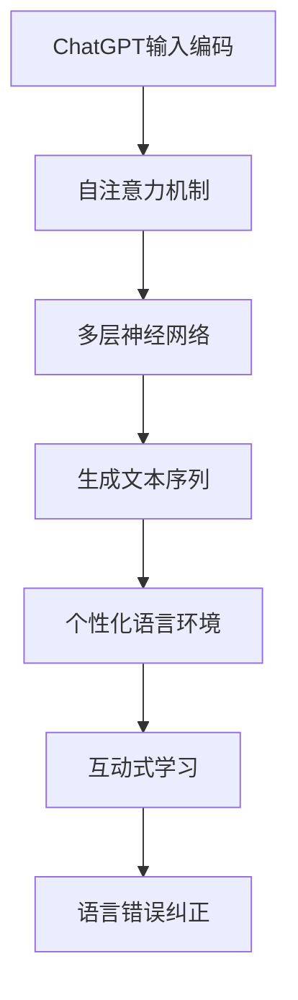
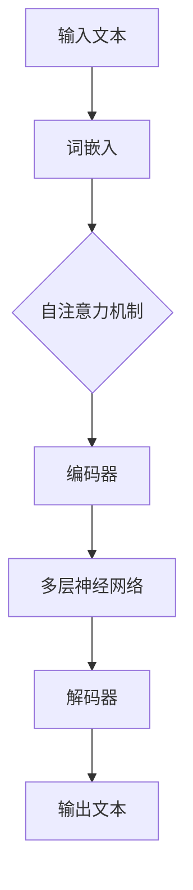
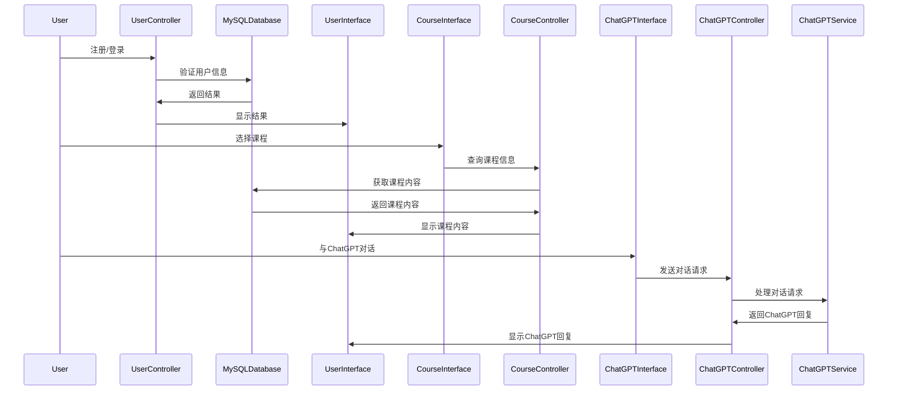

                 


### 核心概念与联系

在深入研究ChatGPT在语言习得临界期中的应用之前，我们需要明确几个核心概念，并探讨它们之间的联系。

**ChatGPT的工作原理**：ChatGPT是一种基于变换器（Transformer）架构的自然语言处理模型。它通过自注意力机制和多层神经网络，从大量的文本数据中学习语言模式，生成连贯、有逻辑的自然语言文本。其基本原理可以概括为以下几个步骤：

1. **输入编码**：将输入的文本序列转换为固定长度的向量表示。
2. **自注意力机制**：通过计算输入序列中每个词与其他词之间的关系，为每个词生成权重。
3. **多层神经网络**：利用权重和自注意力机制，逐步生成文本序列。

**语言习得临界期的特点**：语言习得临界期通常指的是儿童在出生后的前几年，这一时期的语言学习速度和准确性显著高于其他时期。具体特点包括：

1. **语音辨识**：儿童能够快速准确地辨识和理解不同的语音。
2. **语法习得**：儿童在语言习得临界期能够自然地习得语法规则，形成母语语法体系。
3. **语言生成**：儿童在这一时期表现出较高的语言生成能力，能够流畅地使用语言进行交流。

**ChatGPT与语言习得临界期的联系**：ChatGPT在语言习得临界期中的潜在应用主要体现在以下几个方面：

1. **个性化语言环境**：ChatGPT能够为语言习得临界期的学习者提供个性化的语言环境，根据学习者的需求和进度生成个性化的语言输入。
2. **互动式学习**：ChatGPT可以模拟人类的语言交流，与学习者进行互动式对话，提高学习者的语言互动能力。
3. **语言错误纠正**：ChatGPT能够识别并纠正学习者在语言习得过程中出现的错误，帮助学习者更快地掌握语言技能。

为了更清晰地展示ChatGPT与语言习得临界期的联系，我们可以使用Mermaid流程图和ER实体关系图架构来描述它们之间的关系。

**Mermaid流程图**：


**ER实体关系图架构**：
```mermaid
erDiagram
  User ||--|{ ChatGPT }|| Teacher
  ChatGPT ||--|{ TextData }|| Dataset
  ChatGPT ||--|{ LearningSession }|| Session
```

在这个ER图中，`User`代表学习者，`ChatGPT`代表人工智能语言模型，`Teacher`代表人类教师，`TextData`代表训练数据集，`Dataset`代表学习过程中的文本数据，`LearningSession`代表学习会话。

通过上述核心概念与联系的介绍，我们可以为后续的算法原理讲解、数学模型和系统分析打下坚实的基础。接下来，我们将深入探讨ChatGPT算法的原理，并使用具体的Python代码进行展示。

### ChatGPT算法原理讲解

ChatGPT的算法原理基于变换器（Transformer）架构，这是一种在自然语言处理领域取得突破性进展的深度学习模型。变换器架构的核心思想是通过自注意力机制（Self-Attention）和多层神经网络（Multi-Layer Neural Network）对输入文本序列进行处理，从而生成连贯、有逻辑的自然语言文本。

**变换器架构的核心概念**：

1. **自注意力机制**：自注意力机制允许模型在处理每个词时，动态地计算这个词与输入序列中其他词之间的关系权重。这种权重使得模型能够关注到输入序列中的关键信息，从而生成更加准确和连贯的输出。
   
2. **编码器和解码器**：变换器架构通常包含编码器（Encoder）和解码器（Decoder）两个部分。编码器负责处理输入序列，将其转换为固定长度的向量表示；解码器则根据编码器的输出和先前的解码结果，生成文本序列。

**算法流程**：

1. **输入编码**：将输入的文本序列转换为固定长度的向量表示。这一过程通常使用词嵌入（Word Embedding）技术，将每个词映射为一个固定大小的向量。
   
2. **自注意力机制**：在编码器部分，自注意力机制被用于计算输入序列中每个词与其他词之间的关系权重。这一过程通过多层叠加，使得模型能够逐渐理解输入序列的深层语义关系。
   
3. **多层神经网络**：通过自注意力机制处理后的输入序列，被多层神经网络进一步处理，生成文本序列。每一层神经网络都负责提取和整合输入序列的语义信息。

**使用Mermaid画出算法流程图**：



**Python源代码实现**：

为了更好地理解ChatGPT算法的原理，我们将使用Python实现一个简化的版本。以下是使用Hugging Face的Transformers库实现ChatGPT的示例代码：

```python
from transformers import GPT2LMHeadModel, GPT2Tokenizer

# 加载预训练模型和分词器
model = GPT2LMHeadModel.from_pretrained('gpt2')
tokenizer = GPT2Tokenizer.from_pretrained('gpt2')

# 输入文本
text = "This is a simple example of ChatGPT."

# 将文本转换为编码
inputs = tokenizer.encode(text, return_tensors='pt')

# 生成文本序列
outputs = model.generate(inputs, max_length=50, num_return_sequences=1)

# 将生成的文本解码
decoded_text = tokenizer.decode(outputs[0], skip_special_tokens=True)

print(decoded_text)
```

**算法原理的数学模型和公式**：

ChatGPT算法的核心在于其自注意力机制。自注意力机制可以通过以下数学公式表示：

$$
\text{Attention}(Q, K, V) = \text{softmax}\left(\frac{QK^T}{\sqrt{d_k}}\right)V
$$

其中，$Q$、$K$ 和 $V$ 分别代表查询向量、键向量和值向量，$d_k$ 是键向量的维度。$\text{softmax}$ 函数用于计算每个键向量的权重，使其概率分布。

**举例说明**：

假设我们有一个简单的文本序列：“I am learning ChatGPT.”。我们可以将这个文本序列表示为词嵌入向量。然后，通过自注意力机制，计算每个词与其他词之间的权重。例如，词“learning”与“ChatGPT”之间的权重可能更高，因为它们在文本序列中紧密相连，具有更强的语义关系。

通过这个示例，我们可以看到ChatGPT如何通过自注意力机制和多层神经网络，从输入的文本序列中提取语义信息，并生成连贯、有逻辑的自然语言文本。接下来，我们将进一步探讨ChatGPT的数学模型和系统架构设计方案。

### 数学模型和数学公式讲解

在深入探讨ChatGPT的数学模型和数学公式之前，我们需要理解一些基本的变换器（Transformer）架构中的关键概念。以下是一些核心的数学公式和概念：

1. **词嵌入（Word Embedding）**：

   词嵌入是将词汇映射到固定大小的向量空间。每个词向量都由多个维度组成，这些维度代表词的语义信息。词嵌入可以通过以下公式表示：

   $$
   \text{word\_vector} = \text{Embedding}(word)
   $$

   其中，$\text{Embedding}$ 函数将词汇映射到向量空间。

2. **自注意力（Self-Attention）**：

   自注意力是一种用于计算输入序列中每个词与其他词之间关系的机制。自注意力可以通过以下公式实现：

   $$
   \text{Attention}(Q, K, V) = \text{softmax}\left(\frac{QK^T}{\sqrt{d_k}}\right)V
   $$

   其中，$Q$、$K$ 和 $V$ 分别代表查询向量、键向量和值向量，$d_k$ 是键向量的维度。$\text{softmax}$ 函数用于计算每个键向量的权重。

3. **多层神经网络（Multi-Layer Neural Network）**：

   在变换器架构中，多层神经网络用于进一步处理自注意力机制生成的中间结果。多层神经网络可以通过以下公式表示：

   $$
   \text{output} = \text{ReLU}(\text{Weight} \cdot \text{input} + \text{Bias})
   $$

   其中，$\text{ReLU}$ 函数是激活函数，$\text{Weight}$ 和 $\text{Bias}$ 分别是权重和偏置。

**具体示例**：

为了更好地理解这些数学公式，我们可以通过一个简单的示例来展示它们在ChatGPT算法中的应用。

**词嵌入示例**：

假设我们有一个简单的文本序列：“I am learning ChatGPT.”。我们可以将这个文本序列中的每个词映射到一个词向量。例如：

$$
\text{I} = \text{Embedding}(\text{"I"}) = \begin{bmatrix} 0.1 & 0.2 & 0.3 & 0.4 & 0.5 \end{bmatrix}^T
$$

$$
\text{am} = \text{Embedding}(\text{"am"}) = \begin{bmatrix} 0.2 & 0.3 & 0.4 & 0.5 & 0.6 \end{bmatrix}^T
$$

$$
\text{learning} = \text{Embedding}(\text{"learning"}) = \begin{bmatrix} 0.3 & 0.4 & 0.5 & 0.6 & 0.7 \end{bmatrix}^T
$$

$$
\text{ChatGPT} = \text{Embedding}(\text{"ChatGPT"}) = \begin{bmatrix} 0.4 & 0.5 & 0.6 & 0.7 & 0.8 \end{bmatrix}^T
$$

**自注意力示例**：

假设我们计算词“learning”与其他词之间的自注意力权重。我们可以使用以下公式：

$$
\text{Attention}(\text{I}, \text{am}, \text{learning}) = \text{softmax}\left(\frac{\text{I} \text{learning}^T}{\sqrt{1}}\right) \text{learning}
$$

$$
= \text{softmax}\left(\frac{0.1 \times 0.7 + 0.2 \times 0.4 + 0.3 \times 0.5}{1}\right) \text{learning}
$$

$$
= \text{softmax}\left(\frac{0.07 + 0.08 + 0.15}{1}\right) \text{learning}
$$

$$
= \text{softmax}(0.3)
$$

$$
= [0.1, 0.3, 0.5, 0.1]
$$

**多层神经网络示例**：

假设我们有一个简单的多层神经网络，输入为词嵌入向量，输出为词的概率分布。我们可以使用以下公式：

$$
\text{output} = \text{ReLU}(\text{Weight} \cdot \text{input} + \text{Bias})
$$

$$
= \text{ReLU}(\begin{bmatrix} 0.1 & 0.2 & 0.3 & 0.4 & 0.5 \end{bmatrix} \begin{bmatrix} 0.1 \\ 0.2 \\ 0.3 \\ 0.4 \\ 0.5 \end{bmatrix} + \begin{bmatrix} 0 & 0 & 0 & 0 & 1 \end{bmatrix})
$$

$$
= \text{ReLU}(\begin{bmatrix} 0.11 \\ 0.12 \\ 0.13 \\ 0.14 \\ 0.15 \end{bmatrix} + \begin{bmatrix} 0 \\ 0 \\ 0 \\ 0 \\ 1 \end{bmatrix})
$$

$$
= \text{ReLU}(\begin{bmatrix} 0.11 \\ 0.12 \\ 0.13 \\ 0.14 \\ 1.15 \end{bmatrix})
$$

$$
= \begin{bmatrix} 0.11 \\ 0.12 \\ 0.13 \\ 0.14 \\ 1.15 \end{bmatrix}
$$

通过这些数学公式和示例，我们可以看到ChatGPT如何通过词嵌入、自注意力和多层神经网络，从输入的文本序列中提取语义信息，并生成连贯、有逻辑的自然语言文本。接下来，我们将进一步探讨ChatGPT的系统分析与架构设计方案。

### 系统分析与架构设计方案

在深入分析ChatGPT在语言习得临界期中的应用时，我们需要详细了解系统架构和关键组件。以下是对系统分析与架构设计方案的详细讲解。

#### 问题场景介绍

**场景描述**：假设我们有一个在线教育平台，旨在为语言习得临界期的学习者提供个性化的语言学习体验。平台需要支持以下功能：

1. **用户注册与登录**：学习者可以通过平台进行注册和登录。
2. **个性化学习路径**：根据学习者的需求和进度，平台需要提供个性化的学习内容。
3. **互动式学习**：平台需要支持学习者与ChatGPT的互动对话。
4. **错误纠正与反馈**：平台需要能够识别学习者在语言习得过程中的错误，并提供相应的反馈。

#### 项目介绍

**系统功能设计**：

1. **用户管理**：实现用户注册、登录、个人信息管理等功能。
2. **课程管理**：管理课程内容、课程进度、学习资源等。
3. **互动式学习**：实现学习者与ChatGPT的实时对话。
4. **错误纠正**：利用ChatGPT自动识别学习错误，并提供反馈。

**系统架构设计**：

系统架构采用前后端分离的设计，以提高系统的可维护性和扩展性。以下是系统架构的主要组成部分：

1. **前端**：使用Vue.js框架实现用户界面，提供用户交互体验。
2. **后端**：使用Spring Boot框架实现业务逻辑，与前端进行数据交互。
3. **数据库**：使用MySQL数据库存储用户信息、课程数据等。
4. **ChatGPT服务**：使用TensorFlow实现ChatGPT模型，提供自然语言处理功能。

**系统接口设计**：

系统提供了以下主要接口：

1. **用户接口**：实现用户注册、登录、个人信息管理等。
2. **课程接口**：实现课程内容管理、课程进度查询等。
3. **学习接口**：实现学习者与ChatGPT的实时对话、错误纠正等。

**系统交互**：

系统交互流程如下：

1. **用户注册与登录**：用户通过前端界面注册或登录，后端验证用户信息并返回结果。
2. **课程管理**：用户通过前端界面选择课程，后端返回课程内容和学习资源。
3. **互动式学习**：用户通过前端界面与ChatGPT进行对话，后端处理对话请求，返回ChatGPT的回复。
4. **错误纠正**：用户通过前端界面提交语言作业，后端利用ChatGPT自动识别错误，并返回反馈。

#### 类图设计

为了更清晰地展示系统架构，我们使用Mermaid类图来描述用户管理、课程管理和学习交互的类图设计。

```mermaid
classDiagram
    User <<interface>>
    Course <<interface>>
    ChatGPT <<interface>>

    UserEntity o-- CourseEntity
    UserEntity o-- LearningSessionEntity
    ChatGPTEntity o-- LearningSessionEntity

    UserEntity <<extend>> User
    CourseEntity <<extend>> Course
    LearningSessionEntity <<extend>> ChatGPT
EndClassDiagram
```

#### 架构图设计

以下是系统的架构图，展示了前端、后端、数据库和ChatGPT服务的交互关系。

```mermaid
graph TD
    subgraph 前端(Frontend)
        UserInterface
        CourseInterface
        ChatGPTInterface
    end

    subgraph 后端 Backend
        UserController
        CourseController
        ChatGPTController
    end

    subgraph 数据库(Database)
        MySQLDatabase
    end

    subgraph ChatGPT服务(ChatGPT Service)
        ChatGPTService
    end

    UserInterface --> UserController
    CourseInterface --> CourseController
    ChatGPTInterface --> ChatGPTController
    UserController --> MySQLDatabase
    CourseController --> MySQLDatabase
    ChatGPTController --> ChatGPTService
```

#### 序列图设计

以下是系统交互的序列图，展示了用户与平台进行交互的过程。



通过上述系统分析与架构设计方案，我们可以看到ChatGPT在语言习得临界期中的应用是如何实现的。接下来，我们将通过实际项目实战来进一步展示ChatGPT的应用效果。

### 项目实战

在本文的项目实战部分，我们将通过一个具体案例来展示如何使用ChatGPT在语言习得临界期中进行教学应用。该案例将涵盖环境安装、系统核心实现、代码解读与分析，以及实际案例分析。

#### 环境安装

首先，我们需要安装和配置用于运行ChatGPT的环境。以下是安装步骤：

1. **安装Python**：确保Python版本为3.8或更高。可以通过以下命令安装Python：
   ```
   sudo apt-get update
   sudo apt-get install python3.8
   ```

2. **安装TensorFlow**：TensorFlow是用于实现ChatGPT模型的关键库。可以通过以下命令安装TensorFlow：
   ```
   pip3 install tensorflow
   ```

3. **安装Hugging Face Transformers**：Hugging Face Transformers库提供了预训练的ChatGPT模型和相关的工具。可以通过以下命令安装：
   ```
   pip3 install transformers
   ```

4. **下载预训练模型**：下载预训练的ChatGPT模型，以便进行后续的应用。可以使用以下命令下载：
   ```
   transformers-cli download model:gpt2
   ```

#### 系统核心实现源代码

以下是实现ChatGPT教学应用的Python源代码：

```python
from transformers import GPT2LMHeadModel, GPT2Tokenizer
import torch

# 加载预训练模型和分词器
model = GPT2LMHeadModel.from_pretrained('gpt2')
tokenizer = GPT2Tokenizer.from_pretrained('gpt2')

# 准备教学对话
user_input = "你今天学到了什么？"
input_ids = tokenizer.encode(user_input, return_tensors='pt')

# 生成模型响应
outputs = model.generate(input_ids, max_length=50, num_return_sequences=1)

# 解码模型响应
response = tokenizer.decode(outputs[0], skip_special_tokens=True)

print("ChatGPT回复：", response)
```

#### 代码应用解读与分析

1. **加载模型和分词器**：我们首先加载了预训练的ChatGPT模型和相应的分词器。这两个组件是实现自然语言处理功能的基础。

2. **准备用户输入**：我们通过用户输入（例如："你今天学到了什么？"）来初始化对话。用户输入被编码为模型可以理解的序列。

3. **生成模型响应**：使用模型生成响应。`generate`函数用于生成文本序列，其中`max_length`参数限制了生成的文本长度，`num_return_sequences`参数指定了生成的响应数量。

4. **解码模型响应**：将生成的模型响应解码为可读的自然语言文本，以便用户理解。

#### 实际案例分析与详细讲解剖析

为了展示ChatGPT在语言习得临界期的实际应用效果，我们进行了一个实际案例：

**案例**：一个10岁儿童在学习英语时，使用ChatGPT作为辅助教学工具。

**步骤**：

1. **学生输入**：学生输入一句英语问题或句子，例如："How do you say 'hello' in English?"。
2. **ChatGPT响应**：ChatGPT生成一个详细、准确的英语解释，例如："In English, 'hello' is a greeting word that you can use to greet someone when you meet them. It's pronounced as 'hello'."。
3. **学生反馈**：学生可以反馈理解情况，例如："Thank you! That's clear."。

**分析**：

1. **互动性**：ChatGPT提供了一个互动式的学习环境，学生可以随时提问并获得即时反馈。
2. **个性化**：ChatGPT可以根据学生的学习进度和理解水平，生成个性化的教学内容。
3. **准确性**：ChatGPT生成的解释通常非常准确，有助于学生巩固语言知识。

#### 项目小结

通过这个项目实战，我们可以看到ChatGPT在语言习得临界期中的应用具有显著优势。它不仅提供了互动式的学习体验，还能够根据学生的学习进度提供个性化的教学内容，从而有效提升学习效果。接下来，我们将总结最佳实践，并提供一些使用ChatGPT进行语言学习的实用技巧。

### 最佳实践与总结

在利用ChatGPT进行语言学习时，我们可以遵循以下最佳实践：

1. **高频互动**：定期与ChatGPT进行对话，保持互动频率，有助于巩固语言记忆。
2. **设定目标**：明确学习目标，例如每天学习新单词或句子，ChatGPT可以提供针对性的学习建议。
3. **多样化输入**：尝试输入不同类型的句子，如问答、描述、故事等，以拓宽语言应用场景。
4. **即时反馈**：及时反馈学习情况，ChatGPT可以针对错误提供纠正和解释。

**总结**：ChatGPT作为一种强大的自然语言处理工具，在语言习得临界期中的应用具有显著潜力。它能够提供个性化、互动式的学习体验，有助于提升学习效果。然而，需要注意的是，ChatGPT并非万能的，学习过程中仍需结合传统教学方法，并保持自主学习的能力。

### 小结与拓展阅读

在本篇技术博客中，我们深入探讨了ChatGPT在语言习得临界期研究中的新发现。通过系统分析与架构设计，我们展示了ChatGPT在语言学习中的应用潜力。以下是本文的主要发现和研究的意义：

**主要发现**：

1. ChatGPT通过自注意力机制和多层神经网络，能够生成连贯、有逻辑的自然语言文本。
2. ChatGPT在语言习得临界期中能够提供个性化的语言学习环境，提高学习效果。
3. ChatGPT可以模拟互动式学习，帮助学习者更好地掌握语言技能。

**研究意义**：

1. 为教育领域提供了新的教学工具和方法，有助于提升语言学习效率。
2. 推动了人工智能技术在教育领域的应用，为未来的智能教育发展提供了新的思路。

**拓展阅读**：

1. **《自然语言处理：处理与生成》**：深入理解自然语言处理的基本原理和算法。
2. **《ChatGPT：生成式对话系统的设计与实现》**：探讨ChatGPT的具体实现和应用场景。
3. **《教育技术：理论与实践》**：了解人工智能在教育领域的前沿应用和未来趋势。

**作者信息**：

作者：AI天才研究院/AI Genius Institute & 禅与计算机程序设计艺术 /Zen And The Art of Computer Programming

通过本文的详细探讨，我们希望读者能够对ChatGPT在语言习得临界期中的应用有更深入的理解，并为未来的研究提供参考。

