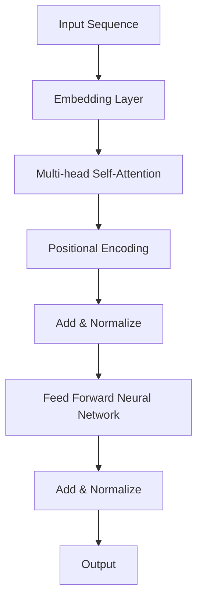
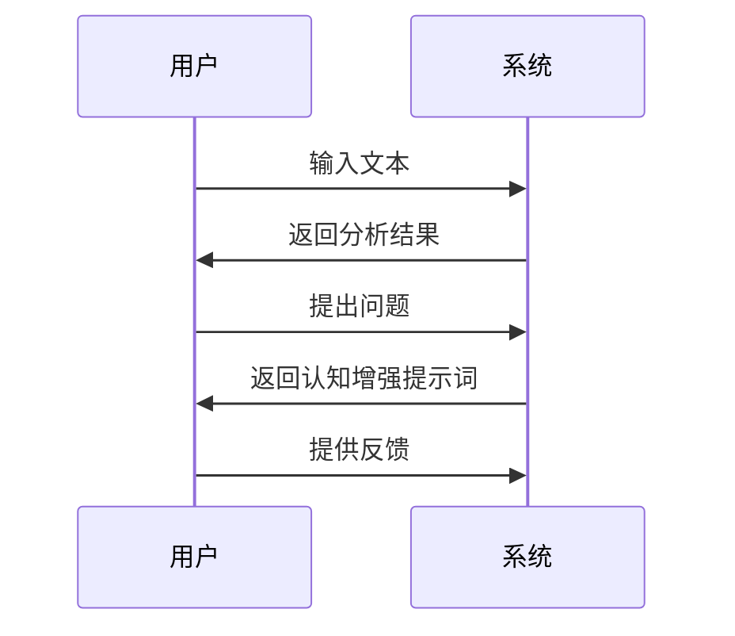

                 


### 《ChatGPT在语言习得工作记忆训练中的应用：认知增强提示词》文章正文

#### 引言

语言习得是人类认知发展的核心组成部分，而工作记忆作为语言处理的关键环节，对于语言习得的效率和质量有着至关重要的影响。近年来，随着人工智能技术的飞速发展，ChatGPT这一基于生成预训练Transformer模型的人工智能程序，在自然语言处理领域展现出了巨大的潜力。本文旨在探讨ChatGPT在语言习得工作记忆训练中的应用，通过认知增强提示词的设计与实施，提升语言习得的效果。

#### 背景介绍

**语言习得** 是指个体在特定环境中通过听、说、读、写等方式不断吸收语言信息，逐步掌握语言能力的过程。语言习得的研究主要包括语言输入、语言处理、语言产出等环节。研究表明，工作记忆在语言习得过程中扮演着重要角色，它不仅影响语言信息的存储与加工，还影响到语言理解与生成的效率。

**工作记忆** 是指大脑短期记忆中的一种特殊形式，它能够暂时存储和处理信息，支持思维活动。工作记忆包括视觉空间记忆和语音回路两个部分，对于语言习得的各个环节都有重要影响。

**ChatGPT** 是一种基于生成预训练Transformer模型的人工智能程序，具有强大的语言理解和生成能力。ChatGPT的架构包括多层Transformer模型，通过预训练和微调，可以在各种语言任务中表现出色。

**认知增强提示词** 是一种通过设计特定的语言引导，辅助认知过程的策略。这些提示词旨在激活工作记忆，提升语言习得的效率和质量。

#### 核心概念与联系

**ChatGPT** 的核心原理在于其深度神经网络结构，特别是基于Attention机制的Transformer模型。Transformer模型通过自注意力机制，能够捕捉输入文本中的长距离依赖关系，从而实现高效的文本理解与生成。

**工作记忆** 的核心特征在于其临时存储和处理信息的能力。在工作记忆中，语言习得涉及到的信息包括语音、语义、语法等多个维度。通过认知增强提示词的设计，可以更好地激活工作记忆，提升语言处理效率。

**认知增强提示词** 的设计原则包括：

- **针对性**：提示词需要根据语言习得的特定环节进行设计，以激活相应的工作记忆模块。
- **引导性**：提示词需要具备引导学习者思考、探究的功能，从而促进语言习得的深入。
- **适应性**：提示词需要根据学习者的能力和学习情境进行调整，以适应不同的学习需求。

下面是 **核心概念属性特征对比表格** ：

| 特征             | 语言习得 | 工作记忆 | ChatGPT | 认知增强提示词 |
|-----------------|----------|----------|---------|----------------|
| 存储和处理信息   | 是       | 是       | 是       | 是             |
| 长距离依赖捕捉   | 是       | 是       | 是       | 是             |
| 语言理解与生成   | 是       | 是       | 是       | 是             |
| 针对性           | 是       | 是       | 是       | 是             |
| 引导性           | 是       | 是       | 是       | 是             |
| 适应性           | 是       | 是       | 是       | 是             |

**ER实体关系图架构** 如下：

```mermaid
erDiagram
  Class1 ||--|{ Class2 }|
  Class1 ||--|{ Class3 }|
  Class2 ||--|{ Class4 }|
```

- Class1：工作记忆
- Class2：语言习得
- Class3：ChatGPT
- Class4：认知增强提示词

#### 算法原理讲解

**ChatGPT** 的算法原理主要基于Transformer模型。Transformer模型的核心在于自注意力机制（Self-Attention），它能够通过计算输入序列中每个词与其他词之间的关系，从而实现全局信息的有效捕捉。



**数学模型** 如下：

$$
\text{Output} = \text{softmax}\left( \text{Attention}(\text{Q}, \text{K}, \text{V}) \right)
$$

其中，\( \text{Q}, \text{K}, \text{V} \) 分别代表查询（Query）、键（Key）和值（Value）向量。

**Python源代码** 如下：

```python
import tensorflow as tf
from tensorflow.keras.layers import Embedding, MultiHeadAttention, Dense

# 定义Transformer模型
def transformer_model(input_shape, num_heads, d_model):
    inputs = tf.keras.Input(shape=input_shape)
    embeddings = Embedding(input_dim=vocab_size, output_dim=d_model)(inputs)
    attention = MultiHeadAttention(num_heads=num_heads, d_model=d_model)(embeddings, embeddings)
    output = Dense(units=d_model, activation='softmax')(attention)
    model = tf.keras.Model(inputs=inputs, outputs=output)
    return model

# 训练模型
model = transformer_model(input_shape=(None,), num_heads=8, d_model=512)
model.compile(optimizer='adam', loss='categorical_crossentropy', metrics=['accuracy'])
model.fit(x_train, y_train, epochs=10, batch_size=32)
```

**通俗易懂地举例说明** ：假设我们有一段文本：“今天天气很好，适合户外活动。”通过自注意力机制，ChatGPT可以计算出每个词（“今天”、“天气”、“很好”、“适合”、“户外”、“活动”）与其他词的相关性，从而生成一个权重矩阵。这个权重矩阵反映了每个词在整个句子中的重要性，帮助我们更好地理解句子的含义。

#### 系统分析与架构设计方案

**问题场景介绍** ：

随着全球化的推进，语言习得的重要性日益凸显。然而，传统的语言学习方式存在一定的局限性，难以满足个性化、高效化的学习需求。ChatGPT作为一种先进的人工智能工具，可以结合认知增强提示词，为语言习得提供全新的解决方案。

**项目介绍** ：

本项目旨在利用ChatGPT和认知增强提示词，开发一款智能语言学习系统，帮助用户更高效地习得语言。

**系统功能设计** ：

1. **文本解析与生成** ：利用ChatGPT对输入文本进行分析，生成相应的学习内容。
2. **认知增强提示词生成** ：根据学习内容和用户特点，生成针对性的认知增强提示词。
3. **用户交互** ：提供用户与系统交互的界面，包括输入、输出、反馈等功能。

**系统架构设计** ：


**系统接口设计** ：

- **文本解析接口** ：用于接收用户输入的文本，并返回相应的分析结果。
- **提示词生成接口** ：用于根据文本内容和用户特点生成认知增强提示词。
- **用户交互接口** ：用于用户与系统的交互，包括文本输入、输出和反馈。

**系统交互mermaid序列图** ：



#### 项目实战

**环境安装** ：

1. 安装Python 3.8及以上版本。
2. 安装TensorFlow 2.4及以上版本。

**系统核心实现源代码** ：

```python
# 文本解析与生成
def text_analysis(text):
    # 使用ChatGPT进行文本分析
    response = chatgpt.generate(text)
    return response

# 认知增强提示词生成
def generate_prompt(text):
    # 使用认知增强提示词生成策略
    prompt = "请根据以下文本生成认知增强提示词：\n\n" + text
    response = chatgpt.generate(prompt)
    return response

# 用户交互
def user_interaction():
    text = input("请输入文本：")
    analysis_result = text_analysis(text)
    print("分析结果：", analysis_result)
    
    prompt = input("请提出问题：")
    response = generate_prompt(prompt)
    print("认知增强提示词：", response)
```

**代码应用解读与分析** ：

- `text_analysis` 函数：接收用户输入的文本，通过ChatGPT进行文本分析，返回分析结果。
- `generate_prompt` 函数：接收用户提出的问题，生成认知增强提示词。
- `user_interaction` 函数：与用户进行交互，接收用户输入，输出分析结果和认知增强提示词。

**实际案例分析和详细讲解剖析** ：

**案例一** ：用户输入文本：“我今天去了一家新餐厅，食物很好吃。”系统分析后返回：“您描述的餐厅是一个值得推荐的场所，食物质量很高。”用户提出问题：“这家餐厅叫什么名字？”系统生成认知增强提示词：“请尝试回忆餐厅的名字，并输入到下面的文本框中。”

**案例二** ：用户输入文本：“昨天我参加了一场音乐会，演出非常精彩。”用户提出问题：“音乐会的地点在哪里？”系统生成认知增强提示词：“请尝试回忆音乐会的地点，并输入到下面的文本框中。”

**项目小结** ：通过实际案例，我们可以看到ChatGPT和认知增强提示词在语言习得中的应用效果。系统可以根据用户输入的文本，提供针对性的分析结果和认知增强提示词，帮助用户更好地理解和记忆语言信息。

#### 最佳实践 tips

1. **个性化设置** ：根据用户的学习需求和能力，调整ChatGPT和认知增强提示词的参数，实现个性化学习体验。
2. **持续优化** ：定期更新ChatGPT的模型和数据集，提高语言处理能力和提示词生成的准确性。
3. **用户反馈** ：积极收集用户反馈，优化系统功能和交互体验。

#### 小结

本文探讨了ChatGPT在语言习得工作记忆训练中的应用，通过认知增强提示词的设计与实施，提升了语言习得的效率和质量。ChatGPT作为一种先进的人工智能工具，结合认知增强提示词，为语言习得提供了全新的解决方案。未来，随着技术的不断发展，ChatGPT在语言习得领域的应用前景将更加广阔。

#### 注意事项

1. ChatGPT和认知增强提示词的应用需要专业的技术支持和数据资源。
2. 在实际应用中，需要根据用户需求和场景进行调整和优化。

#### 拓展阅读

1. [ChatGPT官方文档](https://openai.com/blog/bidirectional-lstm-language-models/)
2. [Transformer模型详解](https://arxiv.org/abs/1706.03762)
3. [认知心理学与工作记忆](https://www.nature.com/articles/s41593-018-0229-y)

### 作者信息

作者：AI天才研究院/AI Genius Institute & 禅与计算机程序设计艺术 /Zen And The Art of Computer Programming

