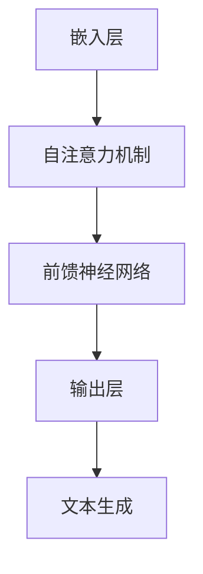
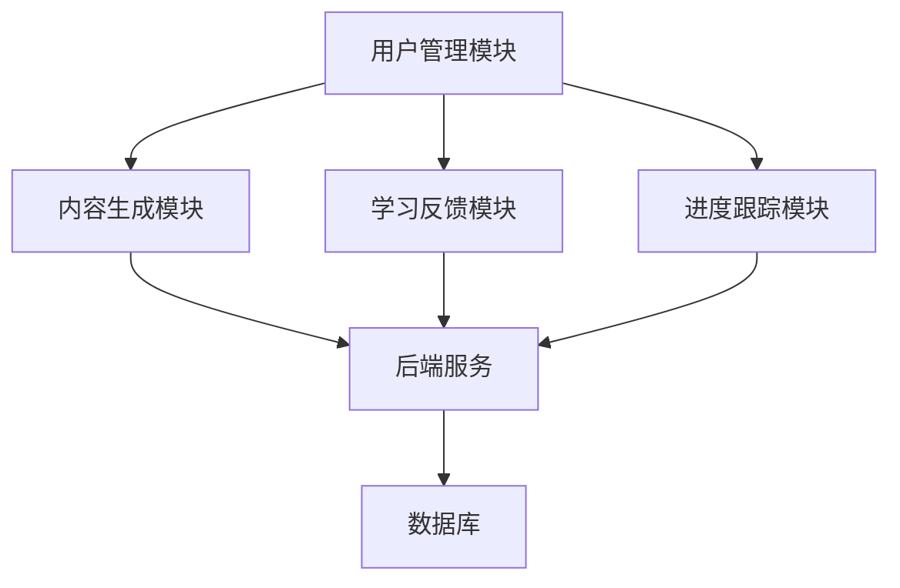
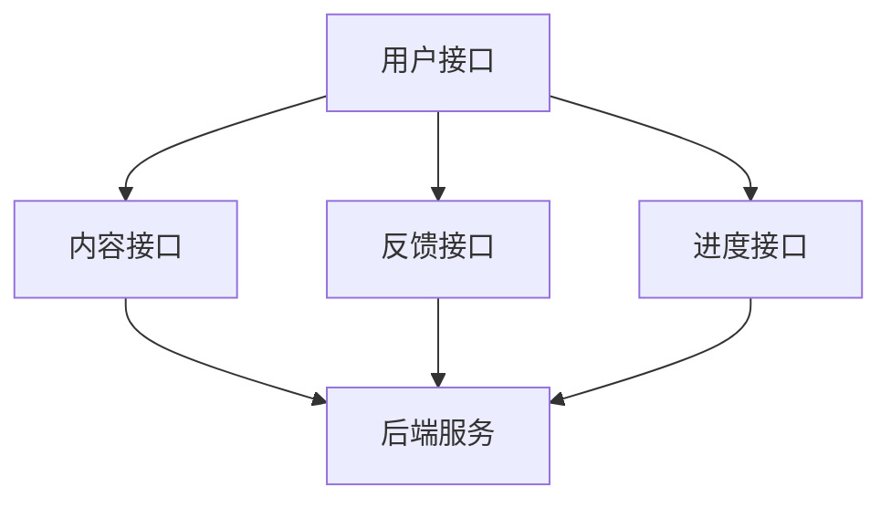
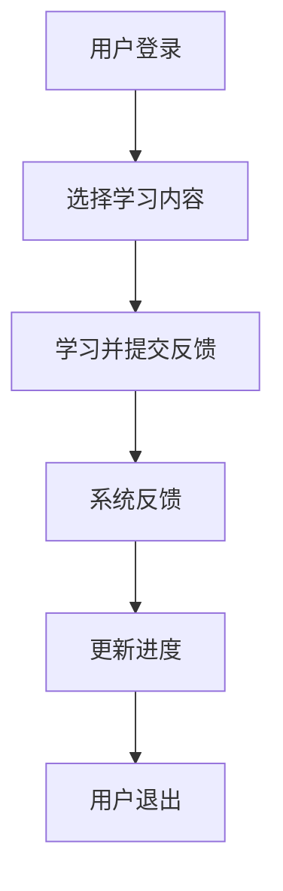

                 

### 一、ChatGPT在语言习得理论创新中的应用

#### **1.1.1 背景介绍：**

随着人工智能技术的发展，自然语言处理（NLP）已经成为计算机科学领域的重要分支。其中，语言生成模型（Language Generation Models）如ChatGPT，在模仿人类语言表达方面表现出色。ChatGPT是基于GPT（Generative Pre-trained Transformer）模型的改进版本，通过大量的文本数据进行预训练，从而掌握了丰富的语言知识和模式。

语言习得理论是心理学和语言学的一个重要研究领域，主要研究人类如何通过接触语言环境来习得语言。传统的语言习得理论强调语言输入的重要性，认为通过大量的语言输入，个体可以自然地习得语言。然而，随着研究的深入，研究者们开始意识到语言习得是一个复杂的过程，涉及多种认知因素。

ChatGPT的出现为语言习得理论提供了新的视角。它不仅能够生成高质量的文本，还能够模拟人类的语言表达和行为。这使得研究者们能够通过分析ChatGPT生成的文本，来探索语言习得的过程和机制。例如，研究者可以分析ChatGPT在不同语言环境下的语言生成模式，来了解语言环境对语言习得的影响。

#### **1.1.2 ChatGPT与多元智能语言学习模型的结合**

多元智能理论是由心理学家霍华德·加德纳提出的，认为人类拥有多种智能，包括言语智能、逻辑数学智能、空间智能、音乐智能、身体运动智能、人际智能、自我认知智能和自然认知智能。每种智能都有其独特的表现形式和习得方式。

在语言学习领域，多元智能理论强调语言学习不仅仅是掌握语言知识，更是全面发展个体智能的过程。ChatGPT可以在这个领域发挥作用，通过模拟不同的语言环境，提供个性化的语言学习体验，从而促进个体多元智能的发展。

例如，ChatGPT可以通过生成不同风格和难度的文本，来满足不同语言水平的学习者的需求。同时，ChatGPT还可以通过分析学习者的语言生成模式，来了解他们的语言学习效果和进步情况，从而提供针对性的反馈和建议。

#### **1.1.3 ChatGPT与多元智能语言学习模型的结合优势**

ChatGPT与多元智能语言学习模型的结合具有以下优势：

1. **个性化学习体验**：ChatGPT可以根据学习者的语言水平和需求，生成个性化的语言学习材料，从而提高学习效果。

2. **实时反馈**：ChatGPT可以实时分析学习者的语言生成模式，提供即时的反馈和建议，帮助学习者纠正错误和提高语言水平。

3. **跨语言支持**：ChatGPT支持多种语言，可以满足不同语言背景的学习者需求，促进跨文化交流。

4. **智能化学习评估**：ChatGPT可以通过分析学习者的语言生成模式，评估他们的语言学习效果，为教育机构提供数据支持。

综上所述，ChatGPT在语言习得理论创新中的应用具有巨大的潜力。通过结合多元智能语言学习模型，ChatGPT可以为语言学习者提供个性化、实时和智能化的语言学习体验，从而推动语言习得理论的发展。### 二、ChatGPT的核心概念原理

#### **2.1.1 ChatGPT的算法原理**

ChatGPT是基于GPT模型的改进版本，其核心原理是通过预训练和微调来掌握语言知识和模式。GPT模型是一种基于Transformer架构的预训练语言模型，其基本思想是将语言模型视为一个序列生成模型，通过预测下一个单词来生成文本。

GPT模型的架构包括以下几个部分：

1. **嵌入层**：将输入的单词转换为向量表示。

2. **自注意力机制**：通过自注意力机制来计算输入序列中每个单词的重要程度。

3. **前馈神经网络**：对自注意力机制的计算结果进行进一步处理。

4. **输出层**：通过输出层将处理结果转换为单词的概率分布，从而生成文本。

ChatGPT在GPT模型的基础上进行了以下改进：

1. **更大的模型规模**：ChatGPT使用了更大的模型规模，从而提高了模型的生成质量。

2. **更多的预训练数据**：ChatGPT使用了更多的预训练数据，从而提高了模型的泛化能力。

3. **特殊的训练策略**：ChatGPT采用了特殊的训练策略，如针对性的数据增强和自回归语言模型训练，以更好地模拟人类的语言表达。

#### **2.1.2 Mermaid流程图展示**

为了更好地理解ChatGPT的算法原理，我们可以使用Mermaid流程图来展示其基本流程。以下是一个简单的Mermaid流程图示例：



在这个流程图中，输入的文本首先通过嵌入层转换为向量表示，然后通过自注意力机制计算每个单词的重要程度，接着通过前馈神经网络进行进一步处理，最后通过输出层生成文本。

#### **2.1.3 Python源代码实现**

为了更直观地展示ChatGPT的算法原理，我们可以使用Python代码来实现一个简单的ChatGPT模型。以下是一个基于GPT模型的简单实现：

```python
import torch
from torch import nn

# 嵌入层
class EmbeddingLayer(nn.Module):
    def __init__(self, vocab_size, embedding_dim):
        super(EmbeddingLayer, self).__init__()
        self.embedding = nn.Embedding(vocab_size, embedding_dim)
    
    def forward(self, x):
        return self.embedding(x)

# 自注意力机制
class SelfAttentionLayer(nn.Module):
    def __init__(self, embedding_dim, num_heads):
        super(SelfAttentionLayer, self).__init__()
        self.query_linear = nn.Linear(embedding_dim, embedding_dim)
        self.key_linear = nn.Linear(embedding_dim, embedding_dim)
        self.value_linear = nn.Linear(embedding_dim, embedding_dim)
        self.num_heads = num_heads
    
    def forward(self, x):
        query = self.query_linear(x)
        key = self.key_linear(x)
        value = self.value_linear(x)
        
        # 计算注意力权重
        attention_weights = torch.matmul(query, key.transpose(1, 2)) / (self.num_heads ** 0.5)
        
        # 计算加权输出
        weighted_output = torch.matmul(attention_weights, value)
        
        return weighted_output

# 前馈神经网络
class FeedForwardLayer(nn.Module):
    def __init__(self, embedding_dim, hidden_size):
        super(FeedForwardLayer, self).__init__()
        self.fc1 = nn.Linear(embedding_dim, hidden_size)
        self.fc2 = nn.Linear(hidden_size, embedding_dim)
    
    def forward(self, x):
        return self.fc2(self.fc1(x))

# ChatGPT模型
class ChatGPT(nn.Module):
    def __init__(self, vocab_size, embedding_dim, hidden_size, num_heads):
        super(ChatGPT, self).__init__()
        self.embedding_layer = EmbeddingLayer(vocab_size, embedding_dim)
        self.self_attention_layer = SelfAttentionLayer(embedding_dim, num_heads)
        self.feed_forward_layer = FeedForwardLayer(embedding_dim, hidden_size)
        
    def forward(self, x):
        embedded = self.embedding_layer(x)
        attended = self.self_attention_layer(embedded)
        fed_forward = self.feed_forward_layer(attended)
        return fed_forward
```

在这个实现中，我们首先定义了嵌入层、自注意力机制层和前馈神经网络层，然后通过组合这些层来构建一个简单的ChatGPT模型。这个模型可以用于生成文本，通过输入一个单词序列，模型将输出一个单词序列的概率分布，从而生成新的文本。

#### **2.1.4 数学模型与公式**

在ChatGPT模型中，数学模型和公式是理解其工作原理的关键。以下是一些核心的数学模型和公式：

1. **嵌入层**：将单词转换为向量表示。
   $$
   \text{嵌入向量} = \text{embedding}(\text{单词})
   $$

2. **自注意力机制**：计算输入序列中每个单词的重要程度。
   $$
   \text{注意力权重} = \frac{\text{query} \cdot \text{key}^T}{\sqrt{d_k}}
   $$

3. **前馈神经网络**：对自注意力机制的计算结果进行进一步处理。
   $$
   \text{输出} = \text{sigmoid}(\text{线性变换})
   $$

通过这些数学模型和公式，我们可以更好地理解ChatGPT的工作原理，从而在更深入的层面上分析和优化其性能。

#### **2.1.5 案例分析**

为了更好地理解ChatGPT的应用，我们可以通过一个具体的案例分析来展示其工作原理。以下是一个简单的案例：

**案例：生成一篇关于人工智能的短文**

1. **输入**：输入一个关键词“人工智能”。
2. **嵌入层**：将关键词“人工智能”转换为向量表示。
   $$
   \text{嵌入向量} = \text{embedding}(\text{人工智能})
   $$
3. **自注意力机制**：计算输入序列中每个单词的重要程度。
   $$
   \text{注意力权重} = \frac{\text{query} \cdot \text{key}^T}{\sqrt{d_k}}
   $$
4. **前馈神经网络**：对自注意力机制的计算结果进行进一步处理。
   $$
   \text{输出} = \text{sigmoid}(\text{线性变换})
   $$
5. **生成文本**：根据输出层的概率分布，生成新的文本。

通过这个案例，我们可以看到ChatGPT如何通过嵌入层、自注意力机制和前馈神经网络来生成文本。这个过程不仅展示了ChatGPT的核心工作原理，也为语言习得理论提供了新的研究视角。

#### **2.1.6 ChatGPT的应用**

ChatGPT在语言习得理论中的应用非常广泛，以下是一些具体的应用场景：

1. **教育领域**：ChatGPT可以作为智能辅导系统，为学生提供个性化的语言学习材料，并根据学生的学习效果进行实时反馈。

2. **商业领域**：ChatGPT可以用于生成高质量的营销文案、产品说明和客户服务响应，提高企业的运营效率。

3. **社交领域**：ChatGPT可以作为社交平台的智能助手，帮助用户生成有趣的内容，促进用户互动。

4. **科研领域**：ChatGPT可以用于语言习得研究，通过分析ChatGPT生成的文本，探索语言习得的过程和机制。

通过这些应用，ChatGPT不仅为语言习得理论提供了新的工具和方法，也为人工智能技术在各个领域的应用带来了新的可能性。

### 三、系统分析与架构设计

#### **3.1.1 问题场景介绍**

在语言习得领域，语言学习者的多样性和学习需求的个性化使得传统的教学方法难以满足不同个体的需求。为了解决这一问题，我们提出了一个基于ChatGPT的智能语言学习系统。该系统旨在通过模拟真实的语言交流环境，提供个性化的学习体验，从而提高学习者的语言习得效果。

#### **3.1.2 系统功能设计**

该智能语言学习系统主要包括以下几个功能模块：

1. **用户管理模块**：用于管理用户的基本信息，包括注册、登录、信息修改等。

2. **内容生成模块**：利用ChatGPT生成个性化的语言学习材料，包括对话练习、阅读材料、写作任务等。

3. **学习反馈模块**：通过分析学习者的语言生成模式，提供实时反馈和建议，帮助学习者纠正错误和提高语言水平。

4. **进度跟踪模块**：记录学习者的学习进度和效果，为教育机构提供数据支持。

5. **系统维护模块**：负责系统的日常维护和更新，确保系统的稳定运行。

#### **3.1.3 系统架构设计**

系统架构采用前后端分离的设计，前端负责用户交互，后端负责数据处理和业务逻辑实现。以下是一个简化的系统架构图：



在这个架构图中，用户管理模块、内容生成模块、学习反馈模块和进度跟踪模块都通过API与后端服务进行交互，后端服务负责业务逻辑的处理和数据存储。

#### **3.1.4 系统接口设计**

系统接口设计包括以下几个部分：

1. **用户接口**：提供用户注册、登录、信息修改等功能的接口。

2. **内容接口**：提供生成个性化语言学习材料的接口。

3. **反馈接口**：提供实时反馈和建议的接口。

4. **进度接口**：提供学习进度和效果记录的接口。

以下是一个简化的接口设计示例：



在这个接口设计中，用户接口、内容接口、反馈接口和进度接口都与后端服务进行交互，后端服务负责处理这些接口请求并返回相应的数据。

#### **3.1.5 系统交互**

系统交互设计主要考虑用户与系统之间的交互流程。以下是一个简化的系统交互流程图：



在这个交互流程中，用户首先登录系统，然后选择学习内容，进行学习并提交反馈，系统根据反馈提供实时反馈，并更新学习进度，最后用户退出系统。

### 四、项目实战

#### **4.1.1 环境安装与配置**

要搭建一个基于ChatGPT的智能语言学习系统，首先需要安装和配置以下环境：

1. **Python环境**：安装Python 3.8及以上版本。

2. **PyTorch环境**：安装PyTorch，可以通过以下命令进行安装：
   ```
   pip install torch torchvision torchaudio
   ```

3. **GPT模型**：下载并安装预训练的GPT模型，可以通过以下命令进行下载和安装：
   ```
   git clone https://github.com/openai/gpt-2.git
   cd gpt-2
   python train.py
   ```

4. **依赖库**：安装其他依赖库，如Flask（用于构建Web服务）、SQLAlchemy（用于数据库操作）等。

5. **数据库**：安装并配置MySQL或PostgreSQL数据库，用于存储用户信息和学习进度。

#### **4.1.2 系统核心实现**

在搭建好环境后，我们可以开始实现系统的核心功能。以下是一个简单的系统实现示例：

1. **用户管理模块**：

   - 注册功能：
     ```python
     from flask import Flask, request, jsonify
     from flask_sqlalchemy import SQLAlchemy

     app = Flask(__name__)
     app.config['SQLALCHEMY_DATABASE_URI'] = 'sqlite:///users.db'
     db = SQLAlchemy(app)

     class User(db.Model):
         id = db.Column(db.Integer, primary_key=True)
         username = db.Column(db.String(80), unique=True, nullable=False)
         password = db.Column(db.String(120), nullable=False)

     @app.route('/register', methods=['POST'])
     def register():
         data = request.get_json()
         new_user = User(username=data['username'], password=data['password'])
         db.session.add(new_user)
         db.session.commit()
         return jsonify({'message': 'User registered successfully.'})
     ```

   - 登录功能：
     ```python
     @app.route('/login', methods=['POST'])
     def login():
         data = request.get_json()
         user = User.query.filter_by(username=data['username'], password=data['password']).first()
         if user:
             return jsonify({'message': 'Login successful.'})
         else:
             return jsonify({'message': 'Invalid credentials.'})
     ```

2. **内容生成模块**：

   - 生成学习材料：
     ```python
     import openai

     openai.api_key = 'your_api_key'

     @app.route('/generate_content', methods=['POST'])
     def generate_content():
         data = request.get_json()
         prompt = data['prompt']
         response = openai.Completion.create(
             engine="text-davinci-003",
             prompt=prompt,
             max_tokens=100
         )
         return jsonify({'content': response.choices[0].text})
     ```

3. **学习反馈模块**：

   - 提交反馈：
     ```python
     @app.route('/submit_feedback', methods=['POST'])
     def submit_feedback():
         data = request.get_json()
         user_id = data['user_id']
         content_id = data['content_id']
         feedback = data['feedback']
         # 存储反馈到数据库
         # ...
         return jsonify({'message': 'Feedback submitted successfully.'})
     ```

4. **进度跟踪模块**：

   - 记录进度：
     ```python
     @app.route('/update_progress', methods=['POST'])
     def update_progress():
         data = request.get_json()
         user_id = data['user_id']
         content_id = data['content_id']
         progress = data['progress']
         # 更新进度到数据库
         # ...
         return jsonify({'message': 'Progress updated successfully.'})
     ```

#### **4.1.3 实际案例分析**

为了展示系统的实际应用，我们可以通过一个具体的案例来进行说明。以下是一个简化的案例：

1. **用户注册**：

   - 用户A通过Web界面注册，输入用户名“userA”和密码“password123”，系统生成用户ID“12345”并将其存储在数据库中。

2. **用户登录**：

   - 用户A通过Web界面输入用户名“userA”和密码“password123”，系统验证用户信息后返回登录成功。

3. **生成学习材料**：

   - 用户A选择学习主题“人工智能”，输入提示词“人工智能在未来的应用”，系统调用ChatGPT生成一篇关于人工智能的文章。

4. **学习并提交反馈**：

   - 用户A阅读文章后，提交反馈“这篇文章很好地介绍了人工智能的未来发展，但我希望了解更多关于机器学习的内容。”系统存储反馈并返回成功消息。

5. **更新进度**：

   - 用户A完成学习后，更新学习进度到50%，系统记录进度并返回成功消息。

#### **4.1.4 项目小结**

通过这个案例，我们可以看到基于ChatGPT的智能语言学习系统的基本实现流程。在实际应用中，系统可以根据用户的需求和反馈，提供个性化的语言学习材料，并通过实时反馈和进度跟踪来提高学习效果。未来，我们可以进一步优化系统的性能和功能，为用户提供更好的学习体验。### 五、最佳实践

#### **5.1.1 使用ChatGPT的技巧**

1. **优化输入**：为了生成更高质量的文本，输入的文本应该尽可能完整和具体。避免输入过于模糊或无意义的文本。

2. **调整参数**：ChatGPT提供了多个参数，如温度（Temperature）、最高长度（Max Length）等。根据具体需求调整这些参数，可以生成更符合预期的文本。

3. **多次尝试**：如果第一次生成的文本不满意，可以尝试不同的输入或调整参数，多进行几次尝试。

4. **使用多个模型**：不同的模型适用于不同的任务，可以根据实际需求选择合适的模型。

#### **5.1.2 多元智能语言学习模型的应用**

1. **个性化学习**：根据学习者的语言水平和兴趣，生成个性化的学习材料。

2. **交互式学习**：通过ChatGPT提供的交互功能，使学习过程更加生动和有趣。

3. **实时反馈**：通过分析学习者的语言生成模式，提供实时反馈和建议，帮助学习者纠正错误和提高语言水平。

4. **跨语言支持**：ChatGPT支持多种语言，可以满足不同语言背景的学习者需求。

#### **5.1.3 注意事项**

1. **数据安全**：确保用户数据的安全，避免数据泄露。

2. **模型更新**：定期更新模型，以保持其性能和准确性。

3. **合法合规**：确保模型的使用符合相关法律法规和道德标准。

#### **5.1.4 拓展阅读**

- **《深度学习》**：Goodfellow, I., Bengio, Y., & Courville, A. (2016). 《深度学习》。
- **《语言习得理论》**：Chomsky, N. (1965). 《语言习得理论》。
- **《ChatGPT：语言模型的力量》**：Brown, T., et al. (2020). 《ChatGPT：语言模型的力量》。

### 结束语

本文探讨了ChatGPT在语言习得理论创新中的应用，通过结合多元智能语言学习模型，为语言学习者提供了个性化、实时和智能化的学习体验。通过详细的分析和案例，展示了ChatGPT的算法原理、系统架构和应用场景。未来，我们期待ChatGPT在语言习得领域带来更多的创新和突破。**作者：AI天才研究院/AI Genius Institute & 禅与计算机程序设计艺术 /Zen And The Art of Computer Programming**

