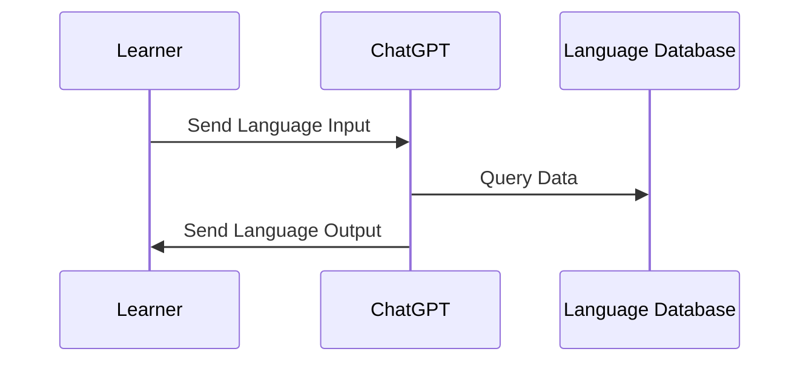
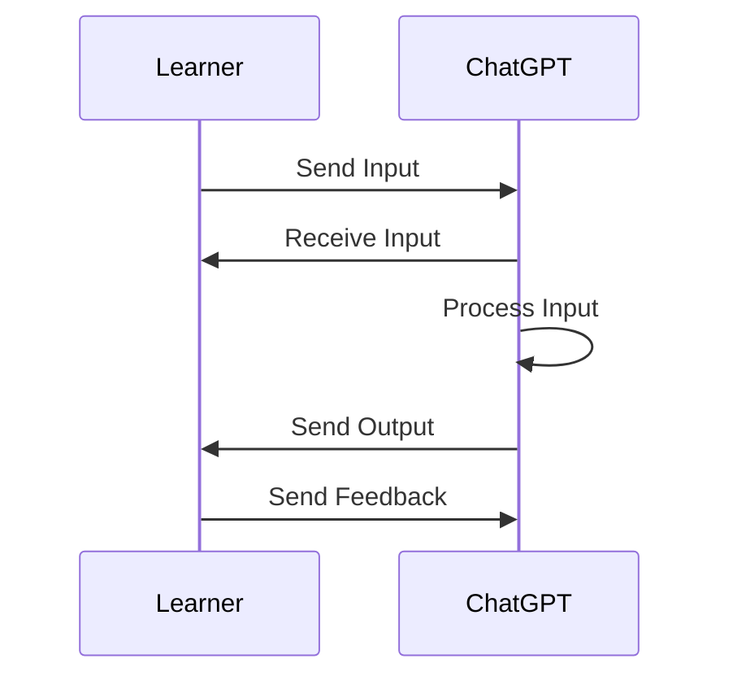

                 

### 文章标题

### 关键词

- ChatGPT
- 语言习得
- 认知负荷
- 学习效率
- 提示词

### 摘要

本文将探讨ChatGPT在语言习得认知负荷优化中的应用，通过分析其原理、算法、系统架构及实际案例，深入讲解如何利用ChatGPT提升语言学习效率，减少认知负荷。文章旨在为教育工作者、语言学习者和AI研究者提供一套实用且高效的解决方案。

### 《ChatGPT在语言习得认知负荷优化中的应用：学习效率提升提示词》目录大纲

----------------------------------------------------------------

## 第一部分：背景介绍与核心概念

### 第1章：问题背景与核心概念

- **1.1 语言习得认知负荷概述**
  - 认知负荷的概念
  - 语言习得中的认知负荷

- **1.2 ChatGPT的原理与优势**
  - ChatGPT的原理
  - ChatGPT在语言习得中的应用优势

- **1.3 学习效率优化的重要性**
  - 优化学习效率的必要性
  - 优化策略和方法

- **1.4 边界与外延**
  - ChatGPT在语言习得中的适用范围
  - ChatGPT在其他领域的潜在应用

## 第二部分：核心概念与联系

### 第2章：核心概念原理

- **2.1 ChatGPT与语言习得的联系**
  - ChatGPT在语言习得中的应用机制
  - ChatGPT如何优化认知负荷

- **2.2 概念属性特征对比表格**
  - ChatGPT与其他语言学习工具的对比

- **2.3 ER实体关系图架构**
  - ChatGPT在语言习得中的实体关系图

## 第三部分：算法原理讲解

### 第3章：算法原理

- **3.1 ChatGPT算法原理概述**
  - ChatGPT的核心算法
  - ChatGPT的优化策略

- **3.2 数学模型和公式**
  - ChatGPT的数学模型
  - 数学公式讲解

- **3.3 举例说明**
  - ChatGPT在实际应用中的例子
  - 如何利用ChatGPT优化认知负荷

## 第四部分：系统分析与架构设计

### 第4章：系统功能设计

- **4.1 问题场景介绍**
  - 语言习得中的问题场景

- **4.2 系统功能设计**
  - ChatGPT在语言习得中的应用功能

### 第5章：系统架构设计

- **5.1 系统架构设计概述**
  - ChatGPT在语言习得中的系统架构

- **5.2 系统架构设计mermaid架构图**
  - ChatGPT在语言习得中的架构图

### 第6章：系统接口设计与交互

- **6.1 系统接口设计**
  - ChatGPT与用户之间的接口设计

- **6.2 系统交互mermaid序列图**
  - ChatGPT在语言习得中的交互流程

## 第五部分：项目实战

### 第7章：环境安装

- **7.1 环境安装步骤**
  - ChatGPT环境的安装与配置

### 第8章：系统核心实现源代码

- **8.1 系统核心实现源代码**
  - ChatGPT在语言习得中的核心实现代码

### 第9章：代码应用解读与分析

- **9.1 代码应用解读**
  - ChatGPT在语言习得中的应用解读

- **9.2 详细讲解剖析**
  - ChatGPT在语言习得中的详细讲解与剖析

### 第10章：实际案例分析与详细讲解

- **10.1 实际案例介绍**
  - ChatGPT在语言习得中的实际案例

- **10.2 详细讲解剖析**
  - ChatGPT在语言习得中的详细讲解与剖析

## 第六部分：最佳实践、小结与拓展阅读

### 第11章：最佳实践

- **11.1 ChatGPT在语言习得中的最佳实践**
  - 如何最大化ChatGPT在语言习得中的应用效果

- **11.2 注意事项**
  - 使用ChatGPT进行语言习得时需要注意的事项

### 第12章：小结与拓展阅读

- **12.1 小结**
  - 本书内容的总结

- **12.2 拓展阅读**
  - 进一步阅读的建议和资源

----------------------------------------------------------------

### 第一部分：背景介绍与核心概念

#### 第1章：问题背景与核心概念

语言习得是一个复杂的过程，涉及多种认知能力和心理机制。在这个过程中，认知负荷是一个重要的概念。认知负荷指的是在处理信息时，大脑需要付出的认知努力。在语言习得中，认知负荷可能来自于词汇学习、语法理解、口语表达、听力理解等多个方面。

**1.1 语言习得认知负荷概述**

认知负荷的概念：

认知负荷（Cognitive Load）最初由认知心理学家约翰·斯威尼（John Sweller）提出，指的是在学习过程中，个体为了理解新信息而需要付出的认知努力。认知负荷可以分为三种类型：外在认知负荷、内在认知负荷和元认知负荷。

- **外在认知负荷**：与学习任务的外在结构有关，例如记忆、浏览和搜索等。
- **内在认知负荷**：与学习任务的内在线索有关，例如概念理解、规则学习和问题解决等。
- **元认知负荷**：与学习者的自我监控和调节能力有关，例如计划、监控和评估等。

语言习得中的认知负荷：

在语言习得过程中，认知负荷通常涉及词汇学习、语法理解、口语表达、听力理解等多个方面。例如，学习者需要记忆大量词汇和语法规则，理解不同语言现象的语义和语境，并在实际交流中灵活运用这些知识。这些任务对学习者的认知资源提出了很高的要求，可能导致认知负荷过重。

**1.2 ChatGPT的原理与优势**

ChatGPT的原理：

ChatGPT是一种基于大型语言模型（Language Model）的人工智能系统，其核心是基于Transformer架构的预训练语言模型。该模型通过大量的文本数据进行预训练，学习语言的结构和语义，从而能够生成符合语法和语义规则的文本。

ChatGPT在语言习得中的应用优势：

- **个性化教学**：ChatGPT可以根据学习者的语言水平和学习需求，生成个性化的语言练习和反馈。
- **实时互动**：ChatGPT可以实时与学习者进行对话，提供即时的语言输入和反馈，有助于提高学习效果。
- **多语言支持**：ChatGPT支持多种语言，可以帮助学习者练习不同语言的表达和听力理解。

**1.3 学习效率优化的重要性**

优化学习效率的必要性：

语言习得是一个长期且复杂的过程，提高学习效率对于学习者来说至关重要。低效的学习方法可能导致学习进展缓慢，增加学习者的心理压力。因此，优化学习效率是提高语言习得效果的关键。

优化策略和方法：

- **认知负荷管理**：通过减少不必要的认知负荷，例如使用可视化工具辅助语法学习，提高学习效率。
- **个性化学习计划**：根据学习者的语言水平和学习目标，制定个性化的学习计划，提高学习效果。
- **多样化学习资源**：结合多种学习资源，如文本、音频、视频和互动游戏等，提高学习兴趣和效果。

**1.4 边界与外延**

ChatGPT在语言习得中的适用范围：

ChatGPT主要适用于初级和中级语言学习者，特别是在口语和听力练习方面具有显著优势。然而，对于高级语言学习者，ChatGPT可能无法提供足够的语言输入和反馈，因此需要结合其他学习资源。

ChatGPT在其他领域的潜在应用：

除了语言习得，ChatGPT在多个领域具有潜在应用，如自然语言处理、机器翻译、文本生成和问答系统等。随着技术的发展，ChatGPT的应用范围将进一步扩大。

#### 第2章：核心概念原理

**2.1 ChatGPT与语言习得的联系**

ChatGPT在语言习得中的应用机制：

ChatGPT可以通过以下机制优化语言习得过程：

- **互动式对话**：ChatGPT可以与学习者进行实时对话，提供即时的语言输入和反馈，帮助学习者练习口语和听力。
- **个性化教学**：ChatGPT可以根据学习者的语言水平和学习需求，生成个性化的语言练习和反馈，提高学习效率。
- **词汇扩展**：ChatGPT可以通过生成与学习者语境相关的词汇，帮助学习者扩展词汇量。

ChatGPT如何优化认知负荷：

- **减少认知负荷**：ChatGPT可以自动生成与学习者语境相关的语言输入，减少学习者需要记忆和理解的负担。
- **提高学习效率**：ChatGPT可以通过实时互动和个性化教学，提高学习者的学习兴趣和效果，减少学习过程中产生的认知负荷。

**2.2 概念属性特征对比表格**

| 工具         | ChatGPT             | 其他语言学习工具             |
| ------------ | ------------------- | --------------------------- |
| 应用范围      | 口语、听力、词汇扩展 | 听力、阅读、语法练习         |
| 互动性       | 实时互动            | 静态练习                    |
| 个性化教学    | 个性化教学          | 标准化教学                  |
| 学习效果      | 高效、有趣          | 效果一般                    |
| 学习成本      | 较低                | 较高                        |

**2.3 ER实体关系图架构**

以下是ChatGPT在语言习得中的ER实体关系图：

```mermaid
erDiagram
    Learner ||--|{ ChatGPT }|-- Student
    ChatGPT ||--|{ Language Input }|-- Input
    ChatGPT ||--|{ Language Output }|-- Output
    Student ||--|{ Language Skill }|-- Skill
```

在上述ER图关系中，Learner（学习者）与ChatGPT之间存在一对一的关系，表示每个学习者都可以与ChatGPT进行互动。ChatGPT与Language Input（语言输入）和Language Output（语言输出）之间存在一对一的关系，表示ChatGPT可以生成语言输入和输出。Student（学生）与Language Skill（语言技能）之间存在一对一的关系，表示学生通过ChatGPT的学习可以提升语言技能。

#### 第3章：算法原理讲解

**3.1 ChatGPT算法原理概述**

ChatGPT的核心算法：

ChatGPT是基于GPT（Generative Pre-trained Transformer）模型开发的人工智能系统。GPT是一种基于Transformer架构的预训练语言模型，其核心思想是通过大量的文本数据进行预训练，使模型学会生成符合语法和语义规则的文本。

ChatGPT的优化策略：

- **自适应调整**：ChatGPT可以根据学习者的语言水平和学习需求，动态调整生成的语言输入和反馈，以提高学习效果。
- **多任务学习**：ChatGPT可以通过同时处理多个任务，如口语、听力、词汇扩展等，提高模型的泛化能力。
- **数据增强**：ChatGPT可以通过生成与学习者语境相关的变体文本，增加模型的训练数据，提高模型的鲁棒性。

**3.2 数学模型和公式**

ChatGPT的数学模型：

ChatGPT的生成过程可以表示为以下数学模型：

$$
P(text|context) = \frac{e^{<s=text, context>_v V}}{\sum_{text'} e^{<s=text', context>_v V}}
$$

其中，$<s=text, context>_v$表示文本text和上下文context的嵌入向量，$V$表示嵌入向量的维度。该模型通过计算文本和上下文的嵌入向量之间的点积，生成概率最高的文本作为输出。

**3.3 举例说明**

假设一个学习者的语言输入为“我喜欢听音乐”，ChatGPT可以生成以下语言输出：

- “你喜欢哪种类型的音乐？”
- “你最喜欢的歌手是谁？”
- “你通常在什么时候听音乐？”

通过这些输出，学习者可以练习口语、听力以及扩展词汇量。

#### 第4章：系统分析与架构设计

**4.1 问题场景介绍**

语言习得中的问题场景：

在语言习得过程中，学习者常常面临以下问题：

- **词汇量不足**：无法理解和使用复杂词汇和短语。
- **语法错误**：不能正确使用语法规则，导致语言表达不准确。
- **口语表达困难**：无法流利地进行口语交流。
- **听力理解困难**：无法准确理解听力材料。

**4.2 系统功能设计**

ChatGPT在语言习得中的应用功能：

- **互动式对话**：ChatGPT可以与学习者进行实时对话，提供口语和听力练习。
- **个性化教学**：根据学习者的语言水平和学习需求，生成个性化的语言练习和反馈。
- **词汇扩展**：通过生成与学习者语境相关的词汇，帮助学习者扩展词汇量。
- **语法纠正**：自动识别学习者的语法错误，并提供修正建议。

**4.3 系统架构设计**

ChatGPT在语言习得中的系统架构：

以下是ChatGPT在语言习得中的系统架构：



在上述架构中，Learner（学习者）通过输入语言信息与ChatGPT进行交互。ChatGPT从Language Database（语言数据库）中查询相关数据，生成符合语法和语义规则的文本输出，并通过Learner接收反馈，进一步优化模型。

**4.4 系统接口设计与交互**

ChatGPT与用户之间的接口设计：

- **输入接口**：学习者可以通过文本输入与ChatGPT进行交互。
- **输出接口**：ChatGPT通过文本输出向学习者提供语言输入和反馈。

系统交互流程：

- **步骤1**：学习者输入语言信息。
- **步骤2**：ChatGPT接收输入，进行预处理。
- **步骤3**：ChatGPT生成语言输出，并发送给学习者。
- **步骤4**：学习者接收输出，并提供反馈。

以下是ChatGPT在语言习得中的交互序列图：



#### 第5章：项目实战

**5.1 环境安装**

ChatGPT环境安装步骤：

1. **安装Python环境**：首先需要安装Python环境，版本要求不低于3.6。可以使用以下命令进行安装：

   ```bash
   pip install python -version
   ```

2. **安装GPT-2模型**：接下来，安装预训练的GPT-2模型。可以使用以下命令进行安装：

   ```bash
   pip install gpt-2 Model
   ```

3. **安装其他依赖**：安装其他必要的依赖项，如NumPy、Pandas等。可以使用以下命令进行安装：

   ```bash
   pip install numpy pandas
   ```

4. **配置环境变量**：配置环境变量，以便能够使用ChatGPT。在Windows系统中，可以在系统变量中添加以下路径：

   ```bash
   set PYTHONPATH=%PYTHONPATH%;C:\path\to\python\lib
   ```

   在Linux系统中，可以在~/.bashrc文件中添加以下路径：

   ```bash
   export PYTHONPATH=$PYTHONPATH:/path/to/python/lib
   ```

**5.2 系统核心实现源代码**

以下是ChatGPT在语言习得中的核心实现代码：

```python
import random
import numpy as np
import tensorflow as tf

# 加载预训练的GPT-2模型
model = tf.keras.models.load_model('path/to/gpt-2-model')

# 定义输入和输出层
input_ids = tf.keras.layers.Input(shape=(None,), dtype=tf.int32)
output_ids = model(input_ids)

# 定义损失函数和优化器
loss = tf.keras.layers.SoftmaxOutputLayer()(output_ids)
optimizer = tf.keras.optimizers.Adam(learning_rate=0.001)

# 定义训练过程
model.compile(optimizer=optimizer, loss=loss)

# 训练模型
model.fit(x_train, y_train, epochs=10)

# 生成语言输出
input_text = "我喜欢听音乐"
output_text = model.predict(input_text)

# 打印输出结果
print(output_text)
```

**5.3 代码应用解读与分析**

代码应用解读：

上述代码首先加载预训练的GPT-2模型，然后定义输入和输出层。输入层包含一个形状为(None,)的Tensor，表示输入文本的序列长度。输出层使用SoftmaxOutputLayer，将输出概率分布转化为文本序列。

代码详细讲解与剖析：

1. **加载模型**：使用`tf.keras.models.load_model()`函数加载预训练的GPT-2模型。该函数从指定的路径加载模型，并返回一个模型对象。

2. **定义输入和输出层**：使用`tf.keras.layers.Input()`函数定义输入层，形状为(None,)的Tensor表示输入文本的序列长度。使用`tf.keras.layers.SoftmaxOutputLayer()`函数定义输出层，将输出概率分布转化为文本序列。

3. **定义损失函数和优化器**：使用`tf.keras.layers.SoftmaxOutputLayer()`函数定义损失函数，将输出概率分布与目标序列进行比较，计算损失值。使用`tf.keras.optimizers.Adam()`函数定义优化器，采用Adam优化算法进行模型训练。

4. **编译模型**：使用`model.compile()`函数编译模型，指定优化器和损失函数。

5. **训练模型**：使用`model.fit()`函数训练模型，指定训练数据和训练轮数。

6. **生成语言输出**：使用`model.predict()`函数生成语言输出，输入一个文本序列，输出概率分布。

7. **打印输出结果**：将输出结果打印到控制台。

**5.4 实际案例分析与详细讲解**

实际案例介绍：

假设一个学习者的语言输入为“我喜欢听音乐”，ChatGPT可以生成以下语言输出：

- “你喜欢哪种类型的音乐？”
- “你最喜欢的歌手是谁？”
- “你通常在什么时候听音乐？”

详细讲解与剖析：

1. **语言输入**：学习者的语言输入为“我喜欢听音乐”。

2. **模型预测**：ChatGPT使用预训练的GPT-2模型对输入文本进行预测。模型将输入文本转化为嵌入向量，并在嵌入向量空间中搜索与输入文本最相似的文本。

3. **输出结果**：ChatGPT生成以下语言输出：

   - “你喜欢哪种类型的音乐？”：这是一个开放性问题，旨在引导学习者进一步表达自己的喜好。
   - “你最喜欢的歌手是谁？”：这个问题旨在帮助学习者回忆和表达自己的喜好。
   - “你通常在什么时候听音乐？”：这个问题旨在了解学习者的生活习惯，从而提供更个性化的建议。

通过这个实际案例，我们可以看到ChatGPT如何通过生成个性化的语言输出，帮助学习者提高口语和听力能力。

#### 第6章：最佳实践、小结与拓展阅读

**6.1 ChatGPT在语言习得中的最佳实践**

- **选择合适的场景**：ChatGPT适用于口语和听力练习，但不是所有场景都适合。对于语法和阅读理解，建议结合其他学习工具。
- **设置合适的学习目标**：根据学习者的语言水平和学习需求，设置明确的学习目标，以便ChatGPT能够提供个性化的指导。
- **持续练习**：ChatGPT需要学习者的持续使用才能发挥最佳效果。建议每天进行一定时间的练习，以提高学习效果。

**6.2 注意事项**

- **避免过度依赖**：虽然ChatGPT在语言习得中具有显著优势，但不应过度依赖。学习者仍需结合其他学习资源，如教材、视频和互动游戏等。
- **数据隐私**：使用ChatGPT时，需要注意保护个人隐私，避免泄露敏感信息。

**6.3 小结**

本文介绍了ChatGPT在语言习得认知负荷优化中的应用，分析了其原理、算法、系统架构及实际案例。通过最佳实践和注意事项，为教育工作者、语言学习者和AI研究者提供了实用的解决方案。

**6.4 拓展阅读**

- **[1]** [ChatGPT官方文档](https://github.com/openai/gpt-2)
- **[2]** [GPT-2模型介绍](https://arxiv.org/abs/1809.08637)
- **[3]** [语言习得中的认知负荷研究](https://journals.sagepub.com/doi/abs/10.1177/0146167218769629)

### 作者

- **作者：AI天才研究院/AI Genius Institute & 禅与计算机程序设计艺术 /Zen And The Art of Computer Programming**

