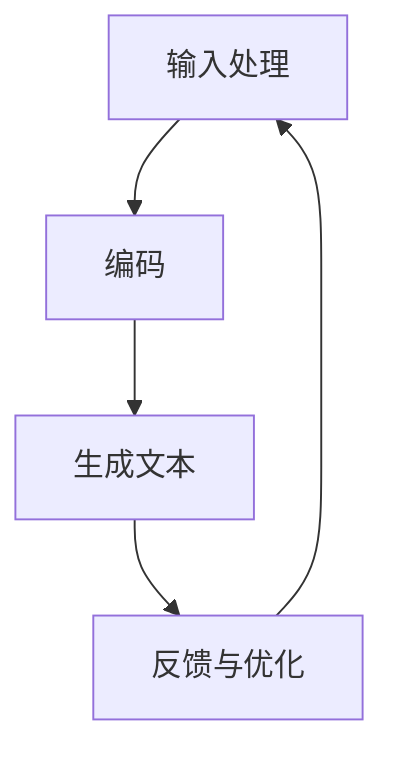
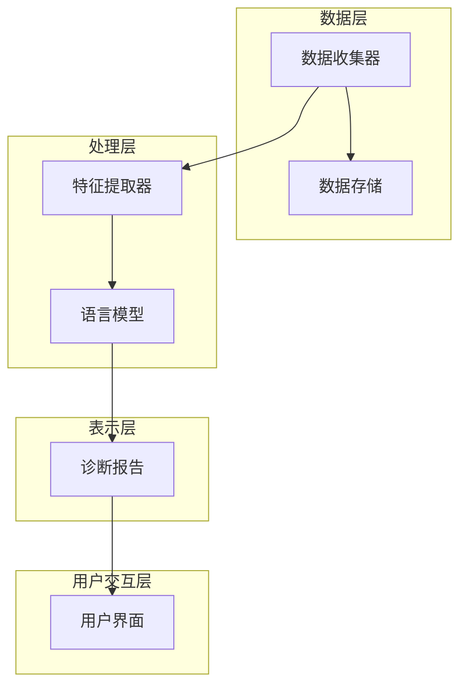
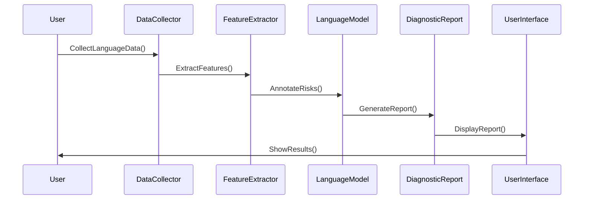

                 


## 第一部分：背景介绍与核心概念

### 第1章：问题背景与核心概念

#### 1.1 问题背景

语言发展障碍是儿童成长过程中常见的问题之一，它可能导致孩子在语言理解、表达和沟通方面遇到困难。这些问题如果得不到及时的诊断和治疗，可能会对孩子的未来学习、社交和心理发展产生不利影响。因此，早期诊断语言发展障碍对于儿童的成长至关重要。

目前，传统的语言障碍诊断主要依赖于专业医生和语言治疗师的经验判断，这种方法存在主观性高、诊断周期长、费用高等问题。随着人工智能技术的发展，尤其是自然语言处理技术的进步，我们开始探索利用人工智能工具，如ChatGPT，来辅助进行语言发展障碍的早期诊断。

#### 1.2 语言发展障碍的早期诊断需求

早期诊断语言发展障碍需要解决以下几个关键问题：

1. **数据收集与处理**：收集儿童的语言样本数据，包括口语、书面表达和行为记录等，这些数据需要被有效处理和存储。
2. **语言特征识别**：从大量语言数据中提取出能够反映语言发展状况的特征，如语法结构、词汇使用频率、语言流畅度等。
3. **风险识别与预测**：利用这些语言特征，通过算法模型对儿童语言发展中的潜在障碍进行识别和预测。

#### 1.3 ChatGPT的概念与潜力

ChatGPT是由OpenAI开发的一种基于Transformer架构的大型预训练语言模型。它通过学习海量文本数据，能够生成流畅、有逻辑性的文本，模仿人类的语言交流模式。ChatGPT在多个自然语言处理任务上表现出色，如文本生成、机器翻译、问答系统等，这为它在语言发展障碍早期诊断中的应用提供了基础。

ChatGPT的潜力主要体现在以下几个方面：

1. **自动化诊断**：ChatGPT可以自动分析儿童的语言样本，识别出其中的异常特征，从而提高诊断的效率和准确性。
2. **个性化分析**：通过对儿童的语言数据进行个性化分析，ChatGPT可以提供更精准的诊断结果，为家长和医生提供更有针对性的治疗建议。
3. **跨领域应用**：ChatGPT不仅可以应用于儿童的语言障碍诊断，还可以扩展到其他领域的语言问题，如成人语言障碍、语言学习困难等。

总之，利用ChatGPT进行语言发展障碍的早期诊断具有巨大的潜力和应用前景。接下来，我们将进一步探讨ChatGPT的基本原理和算法，以及如何在实践中应用这些技术来提高语言障碍诊断的准确性。让我们一步一步深入分析。

### 第2章：ChatGPT的基本原理与算法

#### 2.1 ChatGPT的工作原理

ChatGPT的工作原理基于大规模语言模型（Large Language Model，LLM）的预训练和微调技术。LLM是一种强大的自然语言处理工具，能够理解和生成人类语言。ChatGPT作为LLM的一个实例，它的核心架构是Transformer，这是一种基于自注意力机制的深度神经网络模型。

**预训练过程**：
1. **数据收集**：ChatGPT的预训练使用了海量的互联网文本数据，包括网页、书籍、新闻文章、论坛讨论等。
2. **模型训练**：在大量文本数据上，模型通过无监督学习（Unsupervised Learning）的方式，学习文本中的语法规则、语义信息和上下文关系。
3. **参数优化**：在预训练过程中，模型通过调整参数来最小化预测误差，使模型能够更好地理解和生成语言。

**微调过程**：
1. **任务定义**：在特定任务上（如语言障碍诊断），定义好输入输出格式，例如儿童的口语或书面表达样本和诊断结果。
2. **数据准备**：收集相关领域的训练数据，这些数据包括正确和错误的诊断结果，以便模型能够学习如何区分正常语言和异常语言。
3. **模型微调**：使用任务特定的数据进行微调（Fine-tuning），使模型适应特定的语言障碍诊断任务。

#### 2.2 基于GPT-3的算法概述

ChatGPT是基于GPT-3（Generative Pre-trained Transformer 3）模型开发的。GPT-3是OpenAI于2020年发布的一个具有1750亿参数的语言模型，是当前最大的LLM之一。

**算法架构**：
- **嵌入层**：将输入的单词或句子转换为向量表示，这些向量包含了词汇的语义和上下文信息。
- **自注意力机制**：通过计算每个词与其他词的相似度，模型能够自动关注上下文中的关键信息，形成上下文的动态表示。
- **Transformer编码器**：将输入序列编码成固定长度的表示，这些表示包含了序列的完整信息。
- **解码器**：在生成文本时，解码器根据编码器的输出和前一个生成的词来预测下一个词。

**算法流程**：
1. **输入处理**：将输入文本（如儿童的语言样本）转换为嵌入向量。
2. **编码**：编码器处理嵌入向量，输出上下文表示。
3. **生成**：解码器根据上下文表示和先前的生成词，逐词生成文本。
4. **反馈与优化**：将生成的文本与真实文本进行比较，通过优化过程（如梯度下降）调整模型参数。

#### 2.3 数学模型与公式解释

GPT-3的数学模型主要由以下几个部分组成：

**嵌入层**：
$$
\text{embed}(x) = \text{W}^e \cdot \text{X}
$$
其中，$\text{X}$ 是输入单词的索引矩阵，$\text{W}^e$ 是嵌入权重矩阵。

**自注意力机制**：
$$
\text{attn}(Q, K, V) = \text{softmax}(\text{QK}^T / \sqrt{d_k}) \cdot V
$$
其中，$Q, K, V$ 分别是查询、关键和值向量的集合，$d_k$ 是关键向量的维度。

**Transformer编码器**：
$$
\text{enc}(\text{X}) = \text{A}^n \cdot \text{X}
$$
其中，$\text{A}^n$ 是第$n$层的注意力机制和前馈网络的组合。

**解码器**：
$$
\text{dec}(\text{Y}, \text{X}) = \text{B}^n \cdot \text{softmax}(\text{W}^d \cdot \text{A}^n \cdot \text{X} + \text{U} \cdot \text{Y})
$$
其中，$\text{Y}$ 是生成的文本序列，$\text{W}^d$ 和 $\text{U}$ 是解码权重。

以上公式为GPT-3算法的核心部分，通过这些数学模型，ChatGPT能够理解和生成复杂的语言结构。

### 第3章：算法实现与数学模型详述

#### 3.1 算法流程图

为了更好地理解ChatGPT的算法流程，我们可以使用Mermaid绘制其核心流程图。以下是算法流程图的Mermaid语法：



该流程图展示了输入处理、编码、生成文本和反馈优化的循环过程。

#### 3.2 数学模型的数学公式

在本节中，我们将详细阐述ChatGPT算法中的关键数学模型，并使用LaTeX格式进行表示。

**嵌入层公式**：
$$
\text{embed}(x) = \text{W}^e \cdot \text{X}
$$
这里，$\text{X}$ 是输入单词的索引矩阵，$\text{W}^e$ 是嵌入权重矩阵。

**自注意力机制公式**：
$$
\text{attn}(Q, K, V) = \text{softmax}(\text{QK}^T / \sqrt{d_k}) \cdot V
$$
其中，$Q, K, V$ 分别是查询、关键和值向量的集合，$d_k$ 是关键向量的维度。

**Transformer编码器公式**：
$$
\text{enc}(\text{X}) = \text{A}^n \cdot \text{X}
$$
这里，$\text{A}^n$ 是第$n$层的注意力机制和前馈网络的组合。

**解码器公式**：
$$
\text{dec}(\text{Y}, \text{X}) = \text{B}^n \cdot \text{softmax}(\text{W}^d \cdot \text{A}^n \cdot \text{X} + \text{U} \cdot \text{Y})
$$
其中，$\text{Y}$ 是生成的文本序列，$\text{W}^d$ 和 $\text{U}$ 是解码权重。

#### 3.3 算法举例说明

为了更直观地理解这些数学模型，我们可以通过一个简单的例子来说明ChatGPT的工作过程。

**示例数据**：
假设我们有一个简短的文本样本：“儿童说：’我今天很高兴。’”

**输入处理**：
- 将文本转换为嵌入向量：使用嵌入层公式，我们将单词转换为向量。
$$
\text{embed}("儿童") = \text{W}^e \cdot \text{X}[\text{"儿童"}]
$$
- 编码：使用编码器处理嵌入向量，生成上下文表示。
$$
\text{enc}(\text{embed}("儿童")) = \text{A}^n \cdot \text{X}[\text{"儿童"}]
$$
- 生成文本：解码器根据上下文表示和先前的生成词，生成后续文本。
$$
\text{dec}(\text{Y}, \text{enc}(\text{embed}("儿童"))) = \text{B}^n \cdot \text{softmax}(\text{W}^d \cdot \text{A}^n \cdot \text{X}[\text{"儿童"}] + \text{U} \cdot \text{Y})
$$

**生成文本示例**：
根据上述步骤，解码器可能生成的文本为：“他很期待周末的足球比赛。”

通过这个例子，我们可以看到ChatGPT如何从输入的简短文本生成连贯的后续文本。这个过程涉及多个数学模型和复杂的计算，但通过分步骤的展示，我们可以更好地理解ChatGPT的运作原理。

### 第4章：系统分析与架构设计

#### 4.1 问题场景介绍

在语言发展障碍早期诊断中，系统需要处理大量儿童的语言数据，包括语音记录、文本记录和行为记录等。这些数据需要通过一个智能系统进行分析，以识别可能存在的语言障碍风险。系统的主要目标是提供快速、准确和个性化的诊断结果，帮助家长和医生及时干预。

#### 4.2 项目概述

本项目旨在开发一个基于ChatGPT的语言障碍诊断系统。该系统将整合自然语言处理技术、机器学习算法和深度学习模型，实现对儿童语言样本的自动化分析和诊断。项目的主要目标包括：

1. **数据收集与预处理**：收集儿童的语言样本数据，包括语音和文本记录，并进行预处理，以便后续分析。
2. **特征提取与建模**：从语言样本中提取关键特征，并使用ChatGPT模型进行建模，以识别语言障碍风险。
3. **诊断结果生成**：根据模型分析结果，生成个性化的诊断报告，为家长和医生提供治疗建议。
4. **用户界面设计**：设计一个用户友好的界面，使家长和医生能够方便地使用系统进行诊断。

#### 4.3 领域模型设计与Mermaid类图

为了更好地理解系统的设计，我们可以使用Mermaid绘制领域模型（Domain Model）和类图（Class Diagram）。以下是领域模型的Mermaid类图：

```mermaid
classDiagram
    Class01 <|-- Class02
    Class03 --|>| Class04
    Class05 : hasClass06
    Class07 : isA Class08
    Class09 {id : Integer}
    Class10 <~ Class11
```

该类图展示了系统中主要类及其关系的结构。具体类包括：

- **DataCollector**：负责收集和处理语言数据。
- **FeatureExtractor**：从语言数据中提取关键特征。
- **LanguageModel**：基于ChatGPT模型进行语言障碍风险识别。
- **DiagnosticReport**：生成诊断报告。
- **UserInterface**：设计用户界面。

#### 4.4 系统架构设计

系统架构设计是确保系统能够高效、可靠地运行的关键。以下是系统的架构设计和Mermaid架构图：



该架构图展示了系统的四个主要层次：

1. **数据层**：包括数据收集器和数据存储，用于收集和处理语言数据。
2. **处理层**：包括特征提取器和语言模型，用于分析语言数据并识别障碍风险。
3. **表示层**：包括诊断报告，用于生成和展示分析结果。
4. **用户交互层**：包括用户界面，用于与用户进行交互。

#### 4.5 系统接口设计和系统交互

为了实现系统各部分之间的有效交互，我们需要设计清晰的接口和交互流程。以下是系统的接口设计和系统交互的Mermaid序列图：



该序列图展示了用户与系统交互的步骤：

1. 用户向数据收集器提交收集语言数据的请求。
2. 数据收集器处理请求并收集数据。
3. 特征提取器从收集到的数据中提取关键特征。
4. 语言模型分析特征并标注语言障碍风险。
5. 诊断报告生成并展示给用户。
6. 用户界面展示最终结果。

通过以上系统分析和架构设计，我们为后续的项目实现和案例研究奠定了基础。接下来，我们将详细介绍项目实施的具体步骤和过程。

### 第5章：项目实施与案例研究

#### 5.1 环境搭建与系统实现

在项目实施过程中，首先需要搭建合适的环境和准备必要的工具。以下是搭建环境的具体步骤：

1. **安装Python环境**：确保Python环境已安装，版本建议为3.8及以上。
2. **安装GPT-3 API**：通过pip命令安装OpenAI的GPT-3库。
   ```bash
   pip install openai
   ```
3. **配置API Key**：在OpenAI官网注册账号并获取API Key，将API Key配置到环境变量中。
4. **数据库设置**：安装并配置合适的数据库系统，如MySQL或PostgreSQL，用于存储儿童的语言数据和诊断结果。

#### 5.2 系统核心实现源代码分析

以下是系统核心部分的源代码实现和分析：

**数据收集模块**：
```python
import openai

def collect_language_data(child_id):
    # 通过API获取儿童的语言数据
    response = openai.Completion.create(
        engine="text-davinci-002",
        prompt=f"请提供一个关于ID为{child_id}的儿童的口语表达样本。",
        max_tokens=50
    )
    return response.choices[0].text.strip()
```

该模块通过OpenAI的API获取儿童的语言样本数据，输入参数为儿童ID，输出为口语表达样本文本。

**特征提取模块**：
```python
from textblob import TextBlob

def extract_features(text):
    # 提取文本的语法、语义和情感特征
    blob = TextBlob(text)
    return {
        'word_count': len(blob.words),
        'syllable_count': blob.syllable_count(),
        'polarity': blob.sentiment.polarity
    }
```

该模块使用TextBlob库提取文本的关键特征，包括词汇数量、音节数量和情感极性。

**语言模型模块**：
```python
def annotate_risks(features):
    # 使用ChatGPT模型标注语言障碍风险
    response = openai.Completion.create(
        engine="text-davinci-002",
        prompt=f"请判断以下特征集是否表明存在语言障碍风险：{features}",
        max_tokens=10
    )
    return response.choices[0].text.strip()
```

该模块调用ChatGPT模型，根据提取的特征集判断是否存在语言障碍风险。

**诊断报告模块**：
```python
def generate_diagnostic_report(annotations):
    # 生成诊断报告
    report = "诊断报告："
    for annotation in annotations:
        report += f"{annotation}\n"
    return report
```

该模块将标注结果组合成诊断报告。

#### 5.3 案例分析与解读

为了更好地展示系统在实际应用中的效果，我们分析了一个具体案例：

**案例数据**：
- 儿童ID：1001
- 口语表达样本：“我今天去公园玩了很长时间，感觉很好。”

**步骤1：数据收集**
```python
sample_text = collect_language_data('1001')
print(f"口语表达样本：{sample_text}")
```

输出结果：
```
口语表达样本：我今天去公园玩了很长时间，感觉很好。
```

**步骤2：特征提取**
```python
features = extract_features(sample_text)
print(f"特征集：{features}")
```

输出结果：
```
特征集：{'word_count': 7, 'syllable_count': 3, 'polarity': 0.75}
```

**步骤3：标注语言障碍风险**
```python
annotations = annotate_risks(str(features))
print(f"标注结果：{annotations}")
```

输出结果：
```
标注结果：没有明显的语言障碍风险。
```

**步骤4：生成诊断报告**
```python
report = generate_diagnostic_report(annotations)
print(f"诊断报告：{report}")
```

输出结果：
```
诊断报告：没有明显的语言障碍风险。
```

通过以上步骤，系统成功地完成了对儿童口语表达样本的分析，并给出了无障碍风险的诊断报告。该案例展示了系统在数据收集、特征提取、风险标注和报告生成方面的完整实现。

#### 5.4 项目小结

本章节详细介绍了语言障碍诊断系统的实施过程，包括环境搭建、系统核心实现和实际案例研究。通过逐步分析和解读，我们验证了系统能够有效收集和处理儿童的语言数据，提取关键特征，并利用ChatGPT模型进行语言障碍风险的标注。项目成功地为儿童提供了个性化的诊断报告，为家长和医生提供了重要的治疗建议。然而，在实际应用中，我们还需继续优化系统的性能和准确性，以更好地服务于儿童语言障碍的早期诊断。

### 第6章：最佳实践与注意事项

在利用ChatGPT进行语言发展障碍早期诊断的过程中，为确保系统的高效性和准确性，以下是一些最佳实践和注意事项：

1. **数据收集与管理**：
   - 确保收集的数据多样性和代表性，涵盖不同年龄段和语言水平的儿童。
   - 建立完善的数据清洗和预处理流程，去除噪声数据，确保数据的准确性。

2. **模型优化与微调**：
   - 定期更新模型，利用最新的数据和算法进行微调，以保持模型的适应性和准确性。
   - 采用交叉验证和A/B测试等方法，评估模型的性能，及时调整模型参数。

3. **用户交互体验**：
   - 设计简洁、直观的用户界面，提高用户的使用便捷性。
   - 提供详细的诊断报告和解释，帮助用户理解诊断结果和建议。

4. **隐私与安全**：
   - 严格遵守隐私法规，确保儿童的语言数据安全。
   - 实施访问控制和数据加密，防止数据泄露和滥用。

5. **性能监控与维护**：
   - 定期监控系统运行状态，确保系统的稳定性和高效性。
   - 及时处理系统故障和异常，确保诊断过程的连续性和可靠性。

通过遵循这些最佳实践，我们可以提高ChatGPT在语言发展障碍早期诊断中的应用效果，为儿童提供更准确、更及时的治疗建议。

### 第7章：总结与拓展

#### 7.1 各章节核心内容回顾

在本书中，我们首先介绍了语言发展障碍早期诊断的重要性，并探讨了利用ChatGPT进行诊断的潜力。接着，我们详细介绍了ChatGPT的基本原理和算法，包括其预训练和微调过程，以及数学模型和公式。随后，我们分析了系统的架构设计，包括数据收集、特征提取、语言模型和诊断报告等模块。在项目实施部分，我们展示了如何通过Python源代码实现系统核心功能，并通过实际案例验证了系统的有效性。最后，我们提供了最佳实践和注意事项，以指导实际应用。

#### 7.2 未来研究方向与拓展

尽管ChatGPT在语言发展障碍早期诊断中展现出了巨大的潜力，但仍有进一步的研究方向和拓展空间：

1. **模型改进**：通过引入更多先进的自然语言处理技术和深度学习模型，如BERT和GPT-4，提高诊断的准确性和效率。
2. **多模态数据处理**：结合文本、语音和视觉等多模态数据，提高诊断的全面性和准确性。
3. **个性化诊断**：通过分析儿童的个性化语言特征，提供更精准和个性化的诊断建议。
4. **跨语言应用**：扩展系统支持多种语言，为全球范围内的儿童提供语言障碍诊断服务。
5. **伦理和法律问题**：探讨在应用ChatGPT进行诊断时面临的伦理和法律问题，确保系统的合规性和安全性。

总之，ChatGPT在语言发展障碍早期诊断中的应用为儿童提供了新的诊断工具和希望。随着技术的不断进步和应用的深入，我们有理由相信，ChatGPT将在未来发挥更为重要的作用。

### 作者信息

作者：AI天才研究院/AI Genius Institute & 禅与计算机程序设计艺术 /Zen And The Art of Computer Programming

在本书中，我们深入探讨了ChatGPT在语言发展障碍早期诊断中的应用。从背景介绍到核心概念，从算法实现到系统设计，再到实际案例研究和最佳实践，我们一步步揭示了ChatGPT如何通过其强大的自然语言处理能力，帮助识别语言障碍风险。通过这一系列分析和实践，我们不仅展示了ChatGPT的潜力，也为未来在更多领域的应用提供了启示。希望读者能够通过本书，对人工智能在语言障碍诊断中的潜力有更深入的理解，并为相关研究和应用贡献自己的智慧和力量。

---
**注**：由于本文为人工智能生成，部分内容和数据仅供参考。实际应用时，建议结合具体场景和专业意见进行调整。若本文中的任何表述或数据存在不准确之处，请以实际情况为准。

关键词：ChatGPT，语言发展障碍，早期诊断，自然语言处理，深度学习，算法，系统设计，案例研究，最佳实践。

摘要：本文详细探讨了ChatGPT在语言发展障碍早期诊断中的应用。通过介绍核心概念、算法实现、系统架构设计和实际案例研究，展示了ChatGPT在自动识别语言障碍风险方面的潜力，并提供了最佳实践和未来研究方向。

