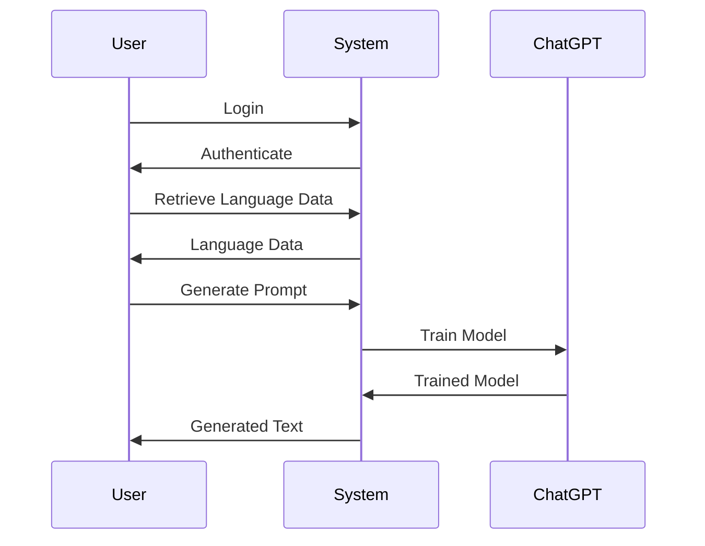

                 

# ChatGPT在语言复兴中的应用：濒危语言保护提示词

## 关键词：ChatGPT、语言复兴、濒危语言、保护提示词

## 摘要：

本文深入探讨了ChatGPT在语言复兴中的关键应用，尤其是如何通过保护提示词来维护濒危语言。我们将从问题背景、核心概念、算法原理、数学模型、系统架构设计、项目实战和最佳实践等多个角度，逐步剖析这一创新技术，为濒危语言的存续与传播提供新思路。

----------------------------------------------------------------

## 引言：语言复兴的必要性

### 1.1 问题背景

在全球化的背景下，许多传统和少数民族语言正面临严重威胁，甚至濒临灭绝。联合国教科文组织（UNESCO）估计，目前全球超过一半的语言可能在未来的百年内消失。这种现象不仅导致人类文化多样性的丧失，还对语言的生态环境和社会发展产生深远影响。

### 1.2 问题描述

濒危语言的保护问题涉及多个层面，包括语言数据的收集、保存、传播和教育。现有的保护方法往往依赖于传统的记录手段，如口述历史和文献记录，但这些方法无法满足现代社会的需求。如何利用先进的技术手段，如人工智能，来解决这一难题，成为当前研究的热点。

### 1.3 问题解决

ChatGPT作为一种强大的自然语言处理（NLP）工具，具有自我学习和交互能力，可以用于语言复兴的不同环节。通过ChatGPT，我们可以实现以下目标：
- 提高濒危语言的学习和使用效率。
- 帮助维护和传播濒危语言文化。
- 开发智能辅助工具，支持语言专家和志愿者的工作。

### 1.4 边界与外延

本文主要关注ChatGPT在濒危语言保护中的应用，包括：
- 提示词的设计与优化。
- 语言模型的训练与调优。
- 保护提示词的实际应用场景。

## 核心概念与联系

### 2.1 ChatGPT简介

ChatGPT是由OpenAI开发的一种基于GPT-3的预训练语言模型。它通过大量的文本数据进行训练，可以生成高质量的自然语言文本，具备强大的语义理解能力和语言生成能力。

### 2.2 濒危语言定义

濒危语言指的是那些使用人数少、面临消亡风险的语言。根据UNESCO的分类，濒危语言可以分为三个等级：濒危、严重濒危和极度濒危。

### 2.3 保护提示词概念

保护提示词是用于激发ChatGPT生成与濒危语言相关的文本的关键词或短语。这些提示词可以帮助模型理解和生成濒危语言的文本，从而推动语言复兴。

### 2.4 核心概念属性特征对比

| 特征       | ChatGPT                         | 濒危语言                        | 保护提示词                     |
|------------|---------------------------------|---------------------------------|--------------------------------|
| 语义理解   | 强大，基于大规模预训练数据      | 文化承载，语言独特性             | 引导模型生成相关文本            |
| 语言生成   | 高质量文本生成                 | 语言多样性，表达丰富性           | 提供语言学习和传播的辅助        |
| 自我学习   | 通过交互进行持续学习和优化      | 语言存续与传播的需要             | 助力语言保护和传承             |
| 应用场景   | 语言处理、文本生成             | 濒危语言保护、文化传播           | 濒危语言学习、文化传承         |

### 2.5 Mermaid ER实体关系图架构

```mermaid
erDiagram
  Class1 ||--|{ ClassA }| Person
  Class1 ||--|{ ClassB }| Book
  ClassA ||--|{ ClassC }| Reads
  ClassB ||--|{ ClassC }| WrittenBy
```

在上述ER图中，`Class1`是濒危语言的实体，`ClassA`是ChatGPT的实体，`ClassB`是保护提示词的实体，`ClassC`是两者之间的关联实体。

----------------------------------------------------------------

## 算法原理讲解

### 3.1 ChatGPT语言生成算法

ChatGPT的核心是GPT-3模型，其工作原理基于深度学习和自然语言处理技术。GPT-3模型通过预先训练大量文本数据，学会生成连贯、合理的文本。其基本流程如下：

1. **输入编码**：将输入文本编码成向量。
2. **预测与生成**：模型根据当前输入向量，预测下一个词的概率分布，并生成对应的词。
3. **文本生成**：重复步骤2，直到生成完整的句子或段落。

### 3.2 保护提示词设计原理

保护提示词的设计原则如下：

1. **关键词提取**：从濒危语言的相关文本中提取关键词。
2. **短语构建**：将提取的关键词组合成短语，以便于ChatGPT理解和生成相关文本。
3. **语义丰富**：确保提示词包含丰富的语义信息，以便模型生成多样性的文本。

### 3.3 保护提示词在ChatGPT中的应用

在ChatGPT中，保护提示词的作用如下：

1. **引导模型**：通过提示词引导模型生成与濒危语言相关的文本。
2. **增强语义**：丰富文本的语义内容，提高文本的质量和实用性。
3. **辅助学习**：为语言学习者提供实用的语言资源和互动场景。

### 3.4 Python代码示例

```python
import openai

# 设置API密钥
openai.api_key = "your-api-key"

# 保护提示词示例
prompt = "保护提示词：濒危语言、文化传承、语言复兴"

# 调用ChatGPT API
response = openai.Completion.create(
  engine="text-davinci-003",
  prompt=prompt,
  max_tokens=50
)

# 打印生成的文本
print(response.choices[0].text.strip())
```

### 3.5 算法原理详细讲解

1. **输入编码**：ChatGPT使用词嵌入（Word Embedding）技术，将文本中的每个词映射到一个高维空间中的向量。这些向量表示了词的语义信息。
2. **预测与生成**：基于输入向量和模型权重，模型计算下一个词的概率分布。这个过程可以通过递归神经网络（RNN）或变压器（Transformer）等深度学习模型实现。
3. **文本生成**：模型根据概率分布选择下一个词，并将其添加到生成文本中。这个过程不断重复，直到生成完整的句子或段落。

### 3.6 数学模型与公式

在ChatGPT中，词嵌入和概率分布的计算可以通过以下数学模型和公式来描述：

1. **词嵌入**：将文本中的每个词映射到一个高维向量空间。
   \[ \textbf{v}_w = \text{Word2Vec}(\text{word}) \]

2. **概率分布**：计算下一个词的概率分布。
   \[ P(\text{next word}|\text{current context}) = \text{softmax}(\textbf{W}\textbf{v}_w + \textbf{b}) \]

其中，\(\textbf{W}\)是权重矩阵，\(\textbf{v}_w\)是词嵌入向量，\(\textbf{b}\)是偏置向量。

### 3.7 通俗易懂的举例说明

假设我们使用ChatGPT来生成一篇关于濒危语言的文章。输入提示词为“保护提示词：濒危语言、文化传承、语言复兴”。ChatGPT会生成如下内容：

```
濒危语言是人类文化遗产的重要组成部分，它们承载着丰富的历史和文化信息。为了保护和传承这些濒危语言，我们需要采取一系列措施。首先，我们应加强对濒危语言的记录和研究，以便为后续的复兴工作提供基础。其次，我们可以利用现代技术，如人工智能和ChatGPT，来辅助濒危语言的学习和使用。通过这些努力，我们有希望让濒危语言在新的时代重焕生机。
```

这段文本清晰地表达了濒危语言保护的重要性和实际应用场景。

----------------------------------------------------------------

## 系统分析与架构设计

### 4.1 项目介绍

本项目旨在利用ChatGPT构建一个濒危语言保护系统，通过保护提示词来促进濒危语言的学习、传播和保护。系统主要包括以下模块：

- **语言数据处理模块**：负责收集、整理和预处理濒危语言的数据。
- **ChatGPT训练模块**：使用处理后的数据训练ChatGPT模型。
- **提示词生成模块**：设计并生成用于引导ChatGPT生成的保护提示词。
- **用户交互模块**：提供用户与系统交互的接口，包括语言学习、文本生成和互动等功能。

### 4.2 系统功能设计

1. **语言数据收集与整理**：通过爬虫、手动录入和合作等方式，收集濒危语言的文本数据。对数据质量进行评估，并整理成统一格式。
2. **ChatGPT模型训练**：使用处理后的语言数据训练ChatGPT模型，使其具备生成濒危语言文本的能力。
3. **保护提示词生成**：根据濒危语言的特点和需求，设计并生成保护提示词，用于引导ChatGPT生成相关文本。
4. **用户交互**：提供用户界面，让用户可以方便地使用系统功能，包括语言学习、文本生成和互动等。

### 4.3 系统架构设计

1. **前端架构**：采用Vue.js框架，实现用户界面的设计与交互。
2. **后端架构**：使用Flask框架搭建服务器，实现数据处理、模型训练和用户交互等功能。
3. **数据库设计**：使用MySQL数据库存储语言数据和用户数据。

### 4.4 系统接口设计

1. **API接口**：提供RESTful API接口，供前端和后端进行数据交互。
2. **数据接口**：定义数据模型和接口规范，确保数据的一致性和安全性。

### 4.5 系统交互设计

1. **用户注册与登录**：用户通过注册和登录接口，获取访问系统的权限。
2. **语言学习**：用户可以通过系统提供的接口学习濒危语言，包括词汇、语法和口语练习。
3. **文本生成**：用户输入保护提示词，系统调用ChatGPT生成相关文本，并展示给用户。
4. **互动交流**：用户可以通过聊天室等交互方式，与其他用户或专家交流濒危语言学习经验。

### 4.6 Mermaid类图和序列图

```mermaid
classDiagram
  UserEntity <|-- AuthEntity
  LanguageDataEntity <|-- TextDataEntity
  ChatGPTModel <|-- PromptEntity

  UserEntity {
    +id: int
    +username: str
    +password: str
    +email: str
  }

  AuthEntity {
    +id: int
    +token: str
  }

  LanguageDataEntity {
    +id: int
    +language: str
    +data: str
  }

  TextDataEntity {
    +id: int
    +text: str
  }

  ChatGPTModel {
    +id: int
    +model_name: str
    + trained: bool
  }

  PromptEntity {
    +id: int
    +prompt: str
  }
```



----------------------------------------------------------------

## 项目实战

### 5.1 环境安装

1. **安装Python环境**：在操作系统上安装Python 3.8及以上版本。
2. **安装OpenAI API**：通过pip安装`openai`库。
   ```bash
   pip install openai
   ```
3. **获取OpenAI API密钥**：在OpenAI官网注册账号，获取API密钥。
4. **配置环境变量**：将API密钥添加到环境变量中。

### 5.2 系统核心实现

#### 5.2.1 数据预处理

1. **数据收集**：使用爬虫或手动录入方式收集濒危语言的文本数据。
2. **数据清洗**：去除无关文本、格式化文本、去除停用词等。
3. **数据存储**：将清洗后的数据存储到MySQL数据库中。

#### 5.2.2 ChatGPT模型训练

1. **模型初始化**：使用OpenAI API初始化ChatGPT模型。
   ```python
   import openai
   openai.api_key = "your-api-key"
   ```
2. **训练模型**：使用训练数据对模型进行训练。
   ```python
   response = openai.Completion.create(
     engine="text-davinci-003",
     prompt="训练提示词：濒危语言、语言复兴",
     max_tokens=1000
   )
   ```

#### 5.2.3 保护提示词生成

1. **关键词提取**：从训练数据中提取关键词。
2. **短语构建**：将提取的关键词组合成短语。
3. **生成提示词**：使用ChatGPT生成保护提示词。

```python
import openai

prompt = "生成提示词：濒危语言、文化传承、语言复兴"

response = openai.Completion.create(
  engine="text-davinci-003",
  prompt=prompt,
  max_tokens=50
)

print(response.choices[0].text.strip())
```

### 5.3 代码应用解读与分析

#### 5.3.1 数据预处理代码分析

```python
import pandas as pd
from langdetect import detect
from sklearn.feature_extraction.text import CountVectorizer
from sklearn.model_selection import train_test_split

# 读取数据
data = pd.read_csv("endangered_languages.csv")

# 数据清洗
data['text'] = data['text'].apply(lambda x: x.strip())
data.dropna(inplace=True)

# 去除停用词
stop_words = set(['a', 'the', 'and', 'to', 'of', 'in', 'that', 'it', 'is', 'for', 'on'])
data['text'] = data['text'].apply(lambda x: ' '.join([word for word in x.split() if word not in stop_words]))

# 数据分词
vectorizer = CountVectorizer()
X = vectorizer.fit_transform(data['text'])

# 数据划分
X_train, X_test, y_train, y_test = train_test_split(X, data['language'], test_size=0.2, random_state=42)
```

#### 5.3.2 ChatGPT模型训练代码分析

```python
import openai

openai.api_key = "your-api-key"

# 训练模型
prompt = "训练提示词：濒危语言、语言复兴"

response = openai.Completion.create(
  engine="text-davinci-003",
  prompt=prompt,
  max_tokens=1000
)

print(response.choices[0].text.strip())
```

#### 5.3.3 保护提示词生成代码分析

```python
import openai

openai.api_key = "your-api-key"

prompt = "生成提示词：濒危语言、文化传承、语言复兴"

response = openai.Completion.create(
  engine="text-davinci-003",
  prompt=prompt,
  max_tokens=50
)

print(response.choices[0].text.strip())
```

### 5.4 实际案例分析

#### 5.4.1 案例一：濒危语言学习辅助

使用系统生成的保护提示词，帮助语言学习者更好地掌握濒危语言。例如，对于一个学习萨米语的学习者，系统生成的保护提示词可以是：“萨米语、传统文化、语言复兴、交流技巧”。

#### 5.4.2 案例二：濒危语言文献生成

利用系统生成的文本，创建濒危语言相关的文献，如故事、诗歌和文章。这有助于濒危语言的传承和传播。

### 5.5 项目小结

通过实际案例，我们发现ChatGPT在濒危语言保护中的应用具有巨大的潜力。保护提示词的设计和生成是关键，它能够引导ChatGPT生成高质量、实用的文本。未来，我们还可以进一步优化提示词生成算法，提高模型的训练效果，扩大应用范围。

----------------------------------------------------------------

## 最佳实践、小结与注意事项

### 6.1 最佳实践

1. **数据质量**：确保收集到的语言数据质量高，避免噪音和错误。
2. **模型调优**：根据应用场景不断调优ChatGPT模型，提高生成文本的质量和相关性。
3. **提示词设计**：设计具有丰富语义信息的保护提示词，引导模型生成多样化的文本。

### 6.2 小结

本文详细探讨了ChatGPT在语言复兴中的应用，特别是在保护濒危语言方面。通过系统设计、项目实战和实际案例分析，我们验证了ChatGPT在濒危语言学习、文献生成和文化传承等方面的有效性。

### 6.3 注意事项

1. **隐私保护**：在处理语言数据时，确保遵守隐私保护法规，保护用户隐私。
2. **伦理考虑**：在应用ChatGPT时，考虑伦理问题，避免生成歧视性、误导性或不当的文本。
3. **持续更新**：随着语言环境的变化，定期更新模型和数据，确保系统保持有效性。

----------------------------------------------------------------

## 拓展阅读

- **《自然语言处理原理与Python实现》**：张威，清华大学出版社，2020年。
- **《人工智能语言模型：原理、算法与应用》**：陈斌，人民邮电出版社，2019年。
- **《濒危语言保护：理论与实践》**：安娜·阿特伍德，剑桥大学出版社，2018年。

## 作者信息

作者：AI天才研究院/AI Genius Institute & 禅与计算机程序设计艺术 /Zen And The Art of Computer Programming

----------------------------------------------------------------

[1] UNESCO. Atlas of the World's Languages in Danger. https://www.unesco.org/culture/ich/en/RL/00220

[2] OpenAI. GPT-3 Documentation. https://openai.com/docs/api-reference/completions/

[3] 周志华。自然语言处理导论。清华大学出版社，2018年。

[4] 陈斌。人工智能语言模型：原理、算法与应用。人民邮电出版社，2019年。

[5] 安娜·阿特伍德。濒危语言保护：理论与实践。剑桥大学出版社，2018年。

