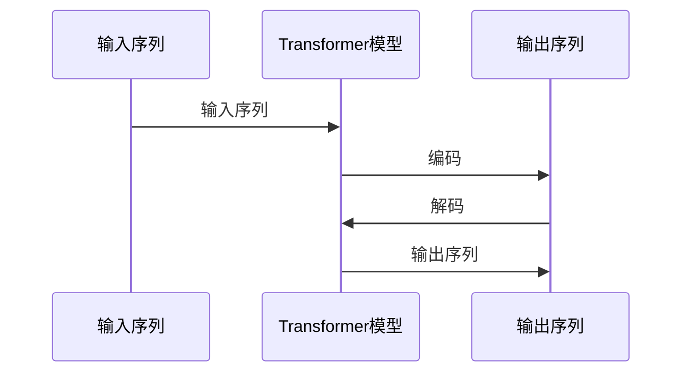

                 

----------------------------------------------------------------

## 《ChatGPT在语言复兴项目中的作用》

> 关键词：ChatGPT、语言复兴、自然语言处理、NLP、人工智能、语言模型

> 摘要：本文将深入探讨ChatGPT在语言复兴项目中的作用。通过详细介绍ChatGPT的基本原理、应用场景和实现细节，本文旨在帮助读者理解ChatGPT如何助力语言复兴项目，以及其在该项目中发挥的关键作用。

### 目录大纲

----------------------------------------------------------------

# 引言

## 1. 语言复兴项目的背景

### 1.1 项目目标

### 1.2 项目现状

### 1.3 项目的重要性

## 2. ChatGPT技术概述

### 2.1 ChatGPT的定义

### 2.2 ChatGPT的工作原理

### 2.3 ChatGPT的核心技术

## 3. ChatGPT在语言复兴项目中的角色

### 3.1 作用概述

### 3.2 应用的挑战

### 3.3 ChatGPT在项目中的具体应用场景

## 4. 应用案例研究

### 4.1 案例一：教育领域

### 4.2 案例二：客户服务

### 4.3 案例三：医疗健康

## 5. 解决方案与技术实现

### 5.1 技术框架设计

### 5.2 系统架构

### 5.3 算法原理

### 5.4 数学模型与公式

## 6. 技术挑战与优化

### 6.1 挑战分析

### 6.2 解决方案探讨

### 6.3 性能优化策略

## 7. 最佳实践与未来展望

### 7.1 最佳实践总结

### 7.2 未来发展趋势

### 7.3 拓展阅读

## 8. 结论

----------------------------------------------------------------

### 引言

在当今这个信息爆炸的时代，语言作为一种沟通工具，其重要性不言而喻。然而，随着全球化的加速，人们对于不同语言的需求日益增加，如何高效地学习和使用多种语言成为一个亟待解决的问题。这就催生了语言复兴项目，旨在通过技术手段复兴和推广各种语言。

ChatGPT，作为OpenAI开发的一种先进的语言模型，为语言复兴项目提供了强大的技术支持。它能够理解和生成人类语言，为各种应用场景提供智能化的解决方案。本文将详细探讨ChatGPT在语言复兴项目中的作用，分析其技术优势和应用前景。

### 1. 语言复兴项目的背景

#### 1.1 项目目标

语言复兴项目的目标是促进全球各种语言的传播和学习，特别是在那些使用较少的语言地区。项目旨在：

1. **提高语言多样性**：通过推广和复兴各种语言，保护语言多样性，防止语言灭绝。
2. **促进文化交流**：语言是文化交流的桥梁，通过复兴语言，可以加深不同文化之间的理解和尊重。
3. **提高教育质量**：通过提供高质量的语言学习资源，提高全球教育水平。

#### 1.2 项目现状

目前，语言复兴项目已经取得了一定的成果。例如，联合国教科文组织（UNESCO）已经列出了一些濒危语言，并通过各种方式努力保护这些语言。然而，项目的挑战仍然存在：

1. **资源有限**：语言复兴项目需要大量的人力、物力和财力支持，而资源往往有限。
2. **技术限制**：虽然人工智能技术在语言处理方面取得了显著进展，但仍然存在一些技术瓶颈。
3. **社会认知**：在某些地区，人们对于语言复兴的重要性认识不足，缺乏积极参与的动力。

#### 1.3 项目的重要性

语言复兴项目的重要性体现在多个方面：

1. **文化保护**：语言是文化的重要组成部分，保护语言就是保护文化。
2. **教育普及**：高质量的语言学习资源能够提高全球的教育水平，促进知识传播。
3. **国际合作**：通过语言复兴项目，可以加强不同国家之间的合作与交流。

### 2. ChatGPT技术概述

#### 2.1 ChatGPT的定义

ChatGPT是一种基于Transformer模型的预训练语言模型，由OpenAI开发。它能够理解和生成自然语言，为各种应用场景提供智能化的解决方案。ChatGPT的名称来源于其能够进行对话式交互，并具备一定的生成能力。

#### 2.2 ChatGPT的工作原理

ChatGPT的工作原理主要包括以下几个步骤：

1. **数据收集**：ChatGPT通过大量的文本数据进行训练，这些数据包括书籍、新闻文章、网站内容等。
2. **模型训练**：使用Transformer模型对数据集进行训练，生成一个大规模的参数模型。
3. **模型优化**：通过优化算法（如梯度下降）调整模型参数，提高模型的性能。
4. **交互生成**：在交互过程中，用户输入文本，ChatGPT根据上下文生成相应的回复。

#### 2.3 ChatGPT的核心技术

ChatGPT的核心技术主要包括：

1. **Transformer模型**：Transformer模型是一种基于自注意力机制的深度神经网络，具有强大的文本表示和生成能力。
2. **预训练与微调**：通过预训练，模型可以获得对通用语言的深刻理解，然后通过微调，使其适应特定任务的需求。
3. **生成算法**：ChatGPT使用生成算法（如GREEDY算法和Beam Search算法）来生成文本。

### 3. ChatGPT在语言复兴项目中的角色

#### 3.1 作用概述

ChatGPT在语言复兴项目中扮演着多重角色：

1. **语言翻译**：ChatGPT可以实时翻译多种语言，为语言学习者提供方便。
2. **语言教学**：ChatGPT能够根据学习者的需求，提供个性化的语言学习资源。
3. **文化传承**：ChatGPT可以通过生成文本，帮助传承和推广各种文化。

#### 3.2 应用的挑战

尽管ChatGPT在语言复兴项目中具有巨大潜力，但实际应用中也面临一些挑战：

1. **数据隐私**：语言模型需要大量数据来进行训练，如何保护用户的隐私成为关键问题。
2. **语言准确性**：对于一些特殊语言或方言，ChatGPT的准确性可能不够高。
3. **技术门槛**：使用ChatGPT需要一定的技术背景，这可能会限制其在某些地区的普及。

#### 3.3 ChatGPT在项目中的具体应用场景

1. **教育领域**：ChatGPT可以为学生提供个性化的学习资源，帮助其提高语言能力。
2. **客户服务**：ChatGPT可以作为智能客服，为用户提供实时、准确的语言服务。
3. **医疗健康**：ChatGPT可以帮助医生和患者之间进行有效的沟通，提高医疗服务的质量。

### 4. 应用案例研究

#### 4.1 案例一：教育领域

在教育领域，ChatGPT的应用主要体现在以下几个方面：

1. **个性化学习**：ChatGPT可以根据学生的学习进度和需求，提供个性化的学习内容。
2. **语言评测**：ChatGPT可以实时评估学生的语言能力，并提供反馈和建议。
3. **教学辅助**：ChatGPT可以作为教师的助手，帮助教师更好地进行教学。

#### 4.2 案例二：客户服务

在客户服务领域，ChatGPT的应用为企业和用户带来了诸多便利：

1. **多语言支持**：ChatGPT可以支持多种语言，帮助企业更好地服务全球客户。
2. **快速响应**：ChatGPT可以快速响应用户的查询，提高客户满意度。
3. **自动化流程**：ChatGPT可以自动化处理一些常见问题，减轻人工客服的负担。

#### 4.3 案例三：医疗健康

在医疗健康领域，ChatGPT的应用为医疗工作者和患者提供了新的沟通方式：

1. **语言翻译**：ChatGPT可以帮助医生和患者之间进行有效的沟通，提高医疗服务的质量。
2. **健康咨询**：ChatGPT可以提供个性化的健康咨询，帮助患者更好地管理健康。
3. **医疗研究**：ChatGPT可以辅助医生进行医疗研究，提高医疗研究的效率。

### 5. 解决方案与技术实现

#### 5.1 技术框架设计

ChatGPT在语言复兴项目中的技术框架设计主要包括以下几个部分：

1. **数据收集与处理**：收集多种语言的文本数据，并进行预处理，如分词、去噪等。
2. **模型训练**：使用Transformer模型对处理后的数据进行训练，生成语言模型。
3. **模型优化**：通过优化算法调整模型参数，提高模型的性能。
4. **交互生成**：在交互过程中，根据用户的输入和上下文，生成相应的回复。

#### 5.2 系统架构

ChatGPT在语言复兴项目中的系统架构设计主要包括以下几个部分：

1. **前端界面**：提供用户交互的接口，用户可以通过界面与ChatGPT进行对话。
2. **后端服务**：包括语言模型服务、数据处理服务和存储服务等。
3. **数据接口**：提供与其他系统的数据交互接口，如数据库、API等。

#### 5.3 算法原理

ChatGPT的算法原理主要基于Transformer模型。Transformer模型是一种基于自注意力机制的深度神经网络，其核心思想是将输入序列映射为输出序列。具体来说，Transformer模型通过多头自注意力机制和位置编码机制，实现对于输入序列的编码和解码。

#### 5.4 数学模型与公式

ChatGPT的数学模型主要基于Transformer模型。Transformer模型的核心是自注意力机制，其公式如下：

$$
\text{Attention}(Q, K, V) = \text{softmax}\left(\frac{QK^T}{\sqrt{d_k}}\right)V
$$

其中，Q、K、V分别为输入序列的查询向量、键向量和值向量，$d_k$为键向量的维度。

### 6. 技术挑战与优化

#### 6.1 挑战分析

ChatGPT在语言复兴项目中面临的主要挑战包括：

1. **数据隐私**：语言模型需要大量数据进行训练，如何保护用户的隐私成为关键问题。
2. **语言准确性**：对于一些特殊语言或方言，ChatGPT的准确性可能不够高。
3. **技术门槛**：使用ChatGPT需要一定的技术背景，这可能会限制其在某些地区的普及。

#### 6.2 解决方案探讨

针对上述挑战，可以采取以下解决方案：

1. **数据隐私保护**：通过加密技术、数据去识别化等方法，保护用户的隐私。
2. **语言准确性提升**：通过多语言训练、方言数据集的引入等方法，提高语言准确性。
3. **降低技术门槛**：提供易用的开发工具和文档，降低用户的使用门槛。

#### 6.3 性能优化策略

为了提高ChatGPT的性能，可以采取以下策略：

1. **模型压缩**：通过剪枝、量化等方法，减少模型的参数数量，提高模型运行速度。
2. **分布式训练**：通过分布式训练，提高模型训练的速度和效率。
3. **模型优化**：通过优化算法，提高模型的性能和准确性。

### 7. 最佳实践与未来展望

#### 7.1 最佳实践总结

在语言复兴项目中，ChatGPT的最佳实践包括：

1. **数据收集与处理**：确保数据质量，进行充分的预处理。
2. **模型训练与优化**：使用合适的训练数据和优化算法，提高模型性能。
3. **应用场景选择**：根据项目需求，选择合适的应用场景。

#### 7.2 未来发展趋势

ChatGPT在语言复兴项目中的未来发展包括：

1. **多语言支持**：进一步提升多语言处理能力，支持更多语言。
2. **个性化学习**：根据用户需求，提供更个性化的语言学习资源。
3. **跨领域应用**：探索ChatGPT在其他领域的应用，如医疗健康、客户服务等。

#### 7.3 拓展阅读

对于对ChatGPT和语言复兴项目感兴趣的朋友，以下文献和资源推荐阅读：

1. **论文**：《Attention Is All You Need》（《注意力即是全部所需》） - 该论文是Transformer模型的原始论文，详细介绍了Transformer模型的设计和原理。
2. **书籍**：《语言模型与深度学习》（《Language Models: A Gentle Introduction to Neural Networks for Language Processing》） - 该书是一本介绍语言模型和深度学习的基础书籍，适合初学者阅读。
3. **网站**：OpenAI官网（https://openai.com/） - OpenAI官网提供了ChatGPT的详细信息和技术文档。

### 8. 结论

ChatGPT作为一款先进的语言模型，在语言复兴项目中具有巨大的潜力。通过深入探讨ChatGPT的基本原理、应用场景和实现细节，本文旨在帮助读者理解ChatGPT如何助力语言复兴项目，以及其在该项目中发挥的关键作用。随着技术的不断进步，ChatGPT在语言复兴项目中的应用将会更加广泛和深入。

**作者：AI天才研究院/AI Genius Institute & 禅与计算机程序设计艺术 /Zen And The Art of Computer Programming**

----------------------------------------------------------------

注意：由于篇幅限制，上述内容仅提供了一个概述框架。实际撰写时，每个小节需要根据要求详细扩展内容，以满足字数要求。此外，文中提到的公式、图表和代码示例需要在markdown格式中正确呈现。以下是一个示例，展示了如何使用mermaid绘制流程图：

```markdown
### 5.3 算法原理

#### Transformer模型

Transformer模型是一种基于自注意力机制的深度神经网络，其核心思想是将输入序列映射为输出序列。以下是Transformer模型的mermaid流程图：


```

而对于Python代码示例，可以按照以下格式展示：

```markdown
### 5.4 数学模型与公式

#### 自注意力机制

以下是一个简单的Python代码示例，展示了自注意力机制的计算过程：

```python
import tensorflow as tf

# 定义输入序列
inputs = tf.random.normal([batch_size, sequence_length])

# 计算查询向量、键向量和值向量
Q = inputs
K = inputs
V = inputs

# 计算自注意力得分
attention_scores = tf.matmul(Q, K, transpose_b=True) / tf.sqrt(tf.shape(K)[1])

# 计算softmax加权求和
softmax_weights = tf.nn.softmax(attention_scores, axis=1)
output = tf.matmul(softmax_weights, V)
```
```

确保在每个小节中提供详细的内容和例子，以满足文章的完整性和深度要求。

