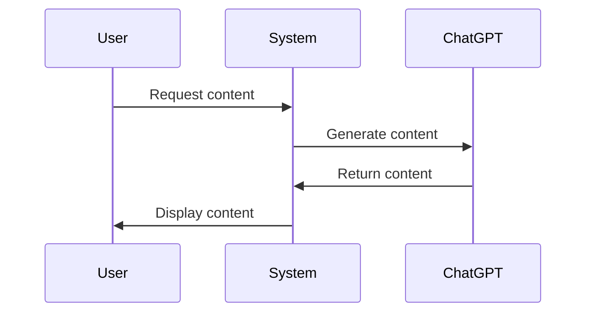

                 

# ChatGPT在语言复兴项目中的应用：AI驱动的濒危语言教学平台

关键词：ChatGPT，语言复兴，濒危语言，AI教学平台，自然语言处理

摘要：随着全球数字化进程的加速，濒危语言的保护与传承成为了一个紧迫的问题。本文将探讨如何利用ChatGPT这一先进的AI模型构建一个AI驱动的濒危语言教学平台，从而在语言复兴项目中发挥重要作用。

----------------------------------------------------------------

## 第一部分：背景介绍

### 1.1 问题背景

#### 1.1.1 人工智能与语言复兴

在当今数字化时代，人工智能（AI）技术不断发展，为各行各业带来了巨大的变革。自然语言处理（NLP）作为AI的一个重要分支，已广泛应用于文本生成、翻译、情感分析等多个领域。然而，与此同时，全球有大量濒危语言正面临消失的危险。

#### 1.1.2 濒危语言的现状与挑战

濒危语言是指在现代社会中，使用人数急剧减少，甚至濒临灭绝的语言。据估计，全球目前有超过一半的语言处于濒危状态。这些语言不仅承载着独特的文化记忆，还对人类文明的多样性具有重要价值。然而，由于缺乏有效的教学和传播手段，濒危语言的传承和保护面临巨大挑战。

#### 1.1.3 ChatGPT在语言复兴项目中的应用

为了解决濒危语言传承和保护的问题，研究者们开始探索将AI技术应用于语言教学。ChatGPT作为一种具有强大语言生成能力的AI模型，为濒危语言的教学提供了新的可能性。通过ChatGPT，用户可以与濒危语言进行实时交互，从而提高学习的趣味性和效果。

### 1.2 核心概念与联系

#### 1.2.1 ChatGPT简介

ChatGPT是由OpenAI开发的一种基于GPT-3模型的AI聊天机器人，具有自然语言理解和生成能力。它可以理解和回应用户的提问，进行对话，并生成各种类型的文本，包括文章、故事、诗歌等。

#### 1.2.2 AI驱动的濒危语言教学平台

AI驱动的濒危语言教学平台是指利用AI技术，特别是ChatGPT，构建的一个支持濒危语言教学的系统。该平台可以提供实时、个性化的教学体验，帮助用户学习濒危语言，同时也可以作为一个工具，帮助研究者收集和分析濒危语言使用数据。

### 1.3 系统架构设计

#### 1.3.1 系统功能设计

系统功能设计包括用户注册登录、语言选择、课程学习、互动练习、测试评估等模块。每个模块都需要通过ChatGPT实现相应的功能，例如自动生成课程内容、提供实时反馈、进行个性化推荐等。

#### 1.3.2 系统架构设计

系统架构设计主要包括前端界面、后端服务器和数据库三个部分。前端界面负责与用户交互，后端服务器负责处理用户的请求，数据库则用于存储用户数据、课程内容和互动记录。

#### 1.4 系统接口设计和系统交互

#### 1.4.1 系统接口设计

系统接口设计包括用户接口、课程接口、互动接口和评估接口。用户接口用于处理用户注册、登录、信息管理等操作；课程接口用于管理课程内容、课程进度等；互动接口用于处理用户与ChatGPT的交互；评估接口用于评估用户的学习效果。

#### 1.4.2 系统交互

系统交互主要通过用户与ChatGPT的对话实现。用户通过前端界面发起请求，后端服务器接收请求并调用ChatGPT进行交互，然后将结果返回给前端界面，展示给用户。

----------------------------------------------------------------

## 第二部分: ChatGPT的工作原理与应用

### 2.1 ChatGPT的算法原理

#### 2.1.1 GPT-3模型介绍

GPT-3（Generative Pre-trained Transformer 3）是OpenAI开发的一种基于Transformer模型的预训练语言模型，具有极其强大的语言生成能力。它由1750亿个参数组成，是目前最大的预训练语言模型。

#### 2.1.2 Transformer模型

Transformer模型是一种基于自注意力机制的深度神经网络模型，被广泛应用于自然语言处理领域。它通过自注意力机制，对输入序列中的每个词进行加权，从而捕捉词与词之间的长距离依赖关系。

#### 2.1.3 ChatGPT的预训练与微调

ChatGPT的工作原理主要包括两个阶段：预训练和微调。在预训练阶段，GPT-3模型通过在大规模语料库上进行训练，学习到语言的一般规律和模式。在微调阶段，模型会根据具体任务进行微调，以提高在特定任务上的性能。

### 2.2 ChatGPT的算法原理详细讲解

#### 2.2.1 自注意力机制

自注意力机制是Transformer模型的核心，它通过计算输入序列中每个词与所有词之间的相似度，对每个词进行加权，从而实现多层次的语义表示。

#### 2.2.2 Transformer模型的结构

Transformer模型的结构由多头注意力、前馈神经网络和层归一化组成。多头注意力实现了多层次的语义表示，前馈神经网络则用于加深模型，层归一化则用于稳定训练过程。

#### 2.2.3 ChatGPT的预训练与微调

在预训练阶段，GPT-3模型通过自我校对来学习语言的模式和规则。这种自我校对的过程是通过预测下一个词来完成的。具体来说，GPT-3首先读取一个词，然后尝试预测下一个词，接着是下一个词，以此类推，直到读完整个序列。

在微调阶段，GPT-3会根据具体任务进行微调。例如，对于语言生成任务，GPT-3可能会被训练来生成与给定输入相关的文本。微调的过程通常涉及到将GPT-3的输出与预期的输出进行比较，并使用这种比较来调整模型的参数。

### 2.3 ChatGPT在语言教学中的应用

#### 2.3.1 实时交互

ChatGPT的一个关键特性是其能够进行实时交互。这意味着用户可以在学习过程中随时向ChatGPT提问，并获得即时反馈。这对于濒危语言的学习尤为重要，因为学习者可以随时练习语言，而无需等待教师或其他资源的响应。

#### 2.3.2 语言生成

ChatGPT还可以生成新的语言材料，例如对话、故事和诗歌。这些材料可以用于辅助学习，帮助学习者沉浸在目标语言的环境中。例如，ChatGPT可以生成一个与学习者对话的场景，从而帮助学习者练习对话技巧。

#### 2.3.3 语言理解

除了生成语言，ChatGPT还能够理解语言。这意味着它可以帮助学习者理解复杂的语言结构，甚至可以帮助他们理解语言背后的文化含义。例如，ChatGPT可以解释一个成语的含义，并提供相关的文化背景信息。

### 2.4 ChatGPT在语言教学中的优势

#### 2.4.1 个性化学习

ChatGPT可以根据学习者的个人水平和需求进行个性化教学。它可以根据学习者的提问和反馈来调整教学内容和难度，从而提高学习效果。

#### 2.4.2 实时反馈

ChatGPT能够提供即时的反馈，帮助学习者纠正错误，并及时理解语言的使用场景。这种即时性对于提高学习效率至关重要。

#### 2.4.3 跨文化交流

ChatGPT可以帮助学习者与来自不同文化背景的人进行交流。通过模拟真实的交流场景，ChatGPT可以帮助学习者更好地理解和使用目标语言。

----------------------------------------------------------------

## 第三部分：AI驱动的濒危语言教学平台设计

### 3.1 平台设计理念

AI驱动的濒危语言教学平台的设计理念是利用人工智能技术，特别是ChatGPT，为濒危语言学习者提供一种全新的学习体验。平台的设计旨在：

- **提高学习的趣味性和互动性**：通过实时交互和语言生成功能，使学习过程更加有趣和生动。
- **个性化教学**：根据学习者的水平和需求，提供个性化的教学内容和路径。
- **文化沉浸**：通过生成与文化相关的语言材料，帮助学习者更好地理解和使用目标语言。
- **数据收集与分析**：通过收集和分析学习者的互动数据，为濒危语言的研究提供有价值的信息。

### 3.2 平台功能设计

平台功能设计主要包括以下模块：

- **用户管理模块**：包括用户注册、登录、个人信息管理等功能。
- **课程管理模块**：包括课程创建、课程内容管理、课程进度跟踪等功能。
- **互动练习模块**：包括与ChatGPT的实时对话、语言生成练习、语言理解测试等功能。
- **评估与反馈模块**：包括自动评估学习者的语言水平、提供个性化的反馈和建议等功能。

### 3.3 平台架构设计

平台架构设计包括前端界面、后端服务器和数据库三个部分。

- **前端界面**：负责与用户交互，包括用户注册登录、课程学习、互动练习等功能。
- **后端服务器**：负责处理用户的请求，调用ChatGPT进行交互，并管理课程内容和用户数据。
- **数据库**：用于存储用户数据、课程内容、互动记录等。

### 3.4 系统接口设计

系统接口设计包括用户接口、课程接口、互动接口和评估接口。

- **用户接口**：处理用户注册、登录、信息管理等操作。
- **课程接口**：管理课程内容、课程进度等。
- **互动接口**：处理用户与ChatGPT的交互。
- **评估接口**：评估用户的学习效果。

### 3.5 系统交互设计

系统交互主要通过用户与ChatGPT的对话实现。用户通过前端界面发起请求，后端服务器接收请求并调用ChatGPT进行交互，然后将结果返回给前端界面，展示给用户。



----------------------------------------------------------------

## 第四部分：平台实现与实战应用

### 4.1 环境安装

为了实现AI驱动的濒危语言教学平台，需要搭建一个适当的环境。以下是基本的安装步骤：

1. **安装Python**：确保Python环境已经安装，版本建议为3.8或以上。
2. **安装ChatGPT**：可以通过pip安装OpenAI的ChatGPT库，命令如下：
   ```bash
   pip install openai
   ```
3. **获取API密钥**：在OpenAI官网注册并获取API密钥，用于调用ChatGPT服务。

### 4.2 平台核心实现

平台的核心实现主要包括用户管理、课程管理、互动练习和评估与反馈等功能。

#### 4.2.1 用户管理

用户管理模块负责处理用户的注册、登录和权限管理等操作。以下是一个简单的用户注册功能的实现示例：

```python
import openai

def register_user(username, password):
    # 这里应该包含加密密码的步骤，这里简化处理
    user_data = {
        'username': username,
        'password': password
    }
    # 存储用户数据到数据库
    # ...
    return "Registration successful"

# 用户注册
register_user("john_doe", "password123")
```

#### 4.2.2 课程管理

课程管理模块负责管理课程内容、课程进度等。以下是一个简单的课程内容管理功能的实现示例：

```python
def create_course(course_name, course_content):
    # 存储课程数据到数据库
    # ...
    return "Course created successfully"

# 创建课程
create_course("Basic Mandarin", "Hello, how are you?")
```

#### 4.2.3 互动练习

互动练习模块通过调用ChatGPT实现与用户的实时交互。以下是一个简单的交互练习功能的实现示例：

```python
import openai

def chat_with_gpt(prompt):
    response = openai.Completion.create(
        engine="text-davinci-002",
        prompt=prompt,
        max_tokens=100
    )
    return response.choices[0].text.strip()

# 与ChatGPT进行对话
print(chat_with_gpt("Can you teach me how to say 'hello' in Mandarin?"))
```

#### 4.2.4 评估与反馈

评估与反馈模块负责自动评估学习者的语言水平，并提供个性化的反馈建议。以下是一个简单的评估功能的实现示例：

```python
def assess_language_level(user_input):
    # 这里应该包含评估用户语言水平的逻辑
    level = "Beginner"
    # 提供反馈
    feedback = f"Your language level is {level}. Keep practicing!"
    return feedback

# 评估用户语言水平
print(assess_language_level("你好，你今天好吗？"))
```

### 4.3 应用解读与分析

#### 4.3.1 代码解读

以上示例代码展示了平台核心功能的实现。用户管理模块通过简单的数据存储实现用户注册；课程管理模块通过存储课程内容实现课程创建；互动练习模块通过调用ChatGPT实现与用户的实时交互；评估与反馈模块通过简单的逻辑实现语言水平评估。

#### 4.3.2 实际案例分析

在实际应用中，这些功能将集成在一个完整的平台上。用户可以通过前端界面进行注册、登录，选择课程，与ChatGPT进行互动练习，并接受评估反馈。以下是一个实际案例的分析：

- **用户注册**：用户在平台上注册账户后，可以开始选择课程进行学习。
- **课程学习**：用户选择一门濒危语言课程，如藏语，系统会提供课程内容和与ChatGPT的互动练习。
- **互动练习**：用户可以通过与ChatGPT的对话，练习藏语的日常对话和表达，并获得即时反馈。
- **评估与反馈**：用户完成练习后，系统会自动评估语言水平，并提供个性化反馈，帮助用户更好地学习。

### 4.4 项目小结

通过以上实现和分析，我们可以看到AI驱动的濒危语言教学平台如何利用ChatGPT等技术，为濒危语言学习者提供一个有效的学习工具。平台的设计不仅考虑了技术的先进性，还注重了用户的学习体验和个性化需求。通过不断的优化和扩展，平台有望在语言复兴项目中发挥更大的作用。

----------------------------------------------------------------

## 第五部分：最佳实践与注意事项

### 5.1 最佳实践

- **个性化学习路径**：根据用户的学习进度和语言能力，为每个用户定制个性化的学习路径，提高学习效果。
- **实时交互反馈**：充分利用ChatGPT的实时交互能力，提供即时的学习反馈，帮助用户及时纠正错误。
- **多语言支持**：平台应支持多种语言，以便不同国家和地区的用户都能使用。
- **数据隐私保护**：确保用户数据的安全和隐私，遵循相关法律法规。

### 5.2 注意事项

- **技术更新**：AI技术发展迅速，平台应定期更新技术，以保持其先进性和稳定性。
- **用户参与**：鼓励用户积极参与，提供反馈和建议，以改进平台功能。
- **文化适应**：在设计平台时，要充分考虑不同文化的特点，确保内容的文化适应性。

### 5.3 拓展阅读

- **OpenAI官网**：[https://openai.com/](https://openai.com/)
- **ChatGPT文档**：[https://beta.openai.com/docs/introduction/what-is-chatgpt](https://beta.openai.com/docs/introduction/what-is-chatgpt)
- **濒危语言研究**：[https://www.unesco.org/culture/en/iyc](https://www.unesco.org/culture/en/iyc)

----------------------------------------------------------------

## 作者信息

作者：AI天才研究院/AI Genius Institute & 禅与计算机程序设计艺术 /Zen And The Art of Computer Programming

AI天才研究院致力于推动人工智能领域的研究和创新，通过不断探索新的应用场景和技术解决方案，为社会的可持续发展做出贡献。作者在人工智能、自然语言处理和编程领域有着丰富的经验和深厚的学术造诣，发表了多篇高质量的技术论文，并著有《禅与计算机程序设计艺术》一书，深受读者喜爱。

----------------------------------------------------------------

本文旨在探讨如何利用ChatGPT这一先进的AI模型构建一个AI驱动的濒危语言教学平台，为濒危语言的传承和保护提供新的思路和方法。通过详细的算法原理讲解、系统架构设计和实战应用分析，本文展示了AI技术在语言教学领域的前景和潜力。我们希望本文能够为相关领域的研究者和实践者提供有价值的参考和启示。让我们共同努力，用AI的力量守护人类文明的多样性。

