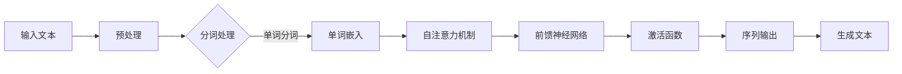

                 

### 设计《ChatGPT在语言复杂性理论研究中的贡献》文章大纲

为了设计《ChatGPT在语言复杂性理论研究中的贡献》这篇文章，我们需要遵循以下几个步骤来逐步构建文章的结构和内容。

**第一步：确定文章标题和关键词**

首先，我们需要确定文章的标题和关键词。文章标题应该能够简洁、准确地反映文章的主要内容，如《ChatGPT在语言复杂性理论研究中的贡献》。关键词则应该包括文章的核心概念和重要术语，例如“ChatGPT”、“语言复杂性”、“理论贡献”等。

**第二步：撰写摘要**

摘要是对文章内容的简短概括，通常包括文章的主题思想、核心内容和结论。在撰写摘要时，我们要确保其能够吸引读者的注意力，同时也要涵盖文章的主要观点。

**第三步：构建目录大纲**

接下来，我们需要构建文章的目录大纲。目录大纲是文章的结构框架，它将帮助读者快速了解文章的组织结构。以下是文章的目录大纲：

```
# 《ChatGPT在语言复杂性理论研究中的贡献》

> 关键词：ChatGPT、语言复杂性、自然语言处理、机器学习、理论研究

> 摘要：本文探讨了ChatGPT在语言复杂性理论研究中的应用和贡献。通过分析ChatGPT的工作原理和其在语言复杂性分析中的具体应用，揭示了ChatGPT在推动语言复杂性理论研究方面的作用和潜力。

### 目录

1. 引言
    1.1 ChatGPT简介
    1.2 语言复杂性简介
    1.3 ChatGPT与语言复杂性的关系

2. ChatGPT的工作原理
    2.1 模型架构
    2.2 训练过程
    2.3 语言生成机制

3. 语言复杂性的测量
    3.1 语言复杂性的定义
    3.2 语言复杂性的度量方法
    3.3 ChatGPT在语言复杂性测量中的应用

4. ChatGPT在语言复杂性研究中的应用
    4.1 文本生成与语言复杂性的关系
    4.2 语言模式识别
    4.3 语言习得研究

5. ChatGPT对语言复杂性理论的影响
    5.1 理论突破
    5.2 方法创新
    5.3 研究前景

6. 结论
    6.1 研究总结
    6.2 未来展望

参考文献
```

**第四步：撰写各部分内容**

在构建好目录大纲之后，我们需要逐一撰写每个部分的内容。在撰写过程中，要确保每个部分的内容都是完整、具体和详细的。特别是对于技术概念和算法原理的讲解，需要使用简单的语言和示例来帮助读者理解。

**第五步：文章结尾**

在文章的结尾，我们需要对全文进行总结，并提出未来的研究方向。同时，也可以提供一些拓展阅读的资源，以供有兴趣的读者进一步学习。

**第六步：文章格式和审校**

最后，我们需要确保文章的格式正确，例如使用markdown格式输出，并检查文章的语法、逻辑和结构是否合理。可以通过多次审校来确保文章的质量。

通过以上六个步骤，我们可以设计出一篇结构清晰、内容丰富、逻辑严密的技术博客文章。这样不仅能够帮助读者更好地理解ChatGPT在语言复杂性理论研究中的贡献，还能够推动语言复杂性理论的研究和发展。让我们一步步深入探讨ChatGPT的奥秘吧！

----------------------------------------------------------------

## 引言

### ChatGPT简介

ChatGPT是由OpenAI开发的一种基于Transformer模型的自然语言处理（NLP）工具，它基于GPT-3.5版本进行了优化和改进。ChatGPT采用了深度学习的方法，特别是自注意力机制（Self-Attention），使其在理解和生成自然语言方面表现出色。ChatGPT的架构包括一个大规模的语言模型，该模型经过大量文本数据的训练，能够理解并生成流畅、自然的文本。

ChatGPT的核心特点是其强大的生成能力和适应性。它能够生成连贯的文本，模拟人类的对话，并在各种任务中表现出色，如问答、文本摘要、机器翻译等。此外，ChatGPT还能够处理多种语言，具有跨语言的生成能力。

### 语言复杂性简介

语言复杂性是指语言的结构和内容上的复杂程度。它包括多个维度，如词汇的丰富度、句法的复杂性、语义的丰富性等。语言复杂性的研究对于理解自然语言的本质和人类认知过程具有重要意义。在自然语言处理领域，语言复杂性的研究有助于构建更强大的语言模型，提高NLP系统的性能。

语言复杂性的研究涉及多个学科，包括语言学、认知科学、计算机科学等。传统的语言复杂性研究主要关注语法和句法层面的复杂性，而现代的研究则扩展到了语义和语用层面。语言复杂性的度量方法包括词汇复杂度指数（Token Type Diversity, TTD）、句法复杂度指数（Sentence Length, SL）等。

### ChatGPT与语言复杂性的关系

ChatGPT在语言复杂性研究中具有重要的应用价值。首先，ChatGPT能够生成具有不同语言复杂度的文本，这为研究语言复杂性的动态变化提供了丰富的数据。通过分析ChatGPT生成的文本，研究者可以观察语言复杂度在不同语境和任务中的表现。

其次，ChatGPT可以用于评估现有语言模型的复杂性处理能力。通过比较ChatGPT生成的文本和现有模型生成的文本，研究者可以评估模型在处理语言复杂性方面的性能。这有助于指导模型的设计和优化，以提高其在复杂语言任务中的表现。

此外，ChatGPT还可以用于研究语言复杂性对人类行为和认知的影响。通过分析ChatGPT生成的文本与人类对话的差异，研究者可以探讨语言复杂性对人类交流和信息处理的影响。

总的来说，ChatGPT为语言复杂性研究提供了新的工具和方法，有助于深入理解自然语言的复杂性和人类认知过程。

### 问题背景

自然语言处理（NLP）是人工智能领域的一个重要分支，旨在使计算机能够理解、处理和生成自然语言。然而，自然语言的复杂性和多样性使得NLP任务充满挑战。语言复杂性研究是NLP中的一个核心问题，它涉及到语言的词汇、句法、语义和语用等多个方面。

在过去的几十年中，NLP领域取得了显著的进展，但仍然存在许多未解决的问题。其中一个关键问题是语言复杂性的度量。传统的语言复杂性度量方法往往只能捕捉到部分语言特征，无法全面反映语言的复杂程度。此外，现有模型在处理高度复杂语言任务时往往表现出不足。

ChatGPT的出现为解决这些问题提供了新的思路。ChatGPT作为一种先进的自然语言处理工具，具有强大的生成能力和适应性，能够生成不同复杂度的文本。这使得研究者可以利用ChatGPT来研究语言复杂性的动态变化，评估现有模型的性能，以及探讨语言复杂性对人类行为和认知的影响。

然而，ChatGPT的应用也带来了一些新的挑战。首先，ChatGPT的生成能力虽然强大，但其在处理极端复杂语言任务时的稳定性有待验证。其次，ChatGPT生成的文本可能包含误导性信息或不符合实际语言习惯，这需要在实际应用中加以注意。

总的来说，ChatGPT在语言复杂性研究中的应用为NLP领域带来了新的机遇和挑战。通过深入研究ChatGPT的工作原理和应用，我们可以更好地理解自然语言的复杂性和人类认知过程，推动NLP技术的发展。

### 问题描述

在自然语言处理（NLP）领域，语言复杂性的问题一直是一个重要且具有挑战性的研究方向。语言复杂性涉及多个层次，包括词汇丰富度、句法结构、语义深度和语用适应性等。然而，传统的研究方法在全面捕捉和度量语言复杂性方面存在局限性。例如，词汇丰富度通常通过词汇多样性（Token Type Diversity, TTD）来衡量，但这一指标只能反映词汇层面的多样性，无法全面体现句法和语义的复杂性。

此外，现有模型在处理复杂语言任务时也存在明显不足。例如，深度神经网络模型虽然在许多NLP任务中表现出色，但在理解和生成高度复杂语言方面仍然存在困难。这些模型往往依赖于大规模的语料库进行训练，但训练数据的质量和多样性直接影响模型在处理复杂语言任务时的表现。

ChatGPT作为一种先进的NLP工具，其在语言复杂性研究中的应用提供了新的可能性。ChatGPT基于Transformer模型，具有强大的生成能力和适应性，能够生成不同复杂度的文本。然而，如何利用ChatGPT有效评估和度量语言复杂性，以及如何克服现有模型的不足，仍然是亟待解决的问题。

### 问题解决

为了解决语言复杂性的问题，我们可以利用ChatGPT的强大生成能力和适应性，通过以下步骤逐步推进：

1. **数据准备**：首先，我们需要准备大量的文本数据，这些数据应涵盖多种语言风格、话题和复杂度。数据来源可以包括书籍、新闻、论文、社交媒体等多种渠道。确保数据的质量和多样性，以便ChatGPT能够生成具有不同语言复杂度的文本。

2. **模型训练**：利用准备好的数据，对ChatGPT进行训练。通过不断的迭代训练，使ChatGPT能够更好地理解和生成自然语言。训练过程中，可以采用监督学习、无监督学习和半监督学习等方法，以提高ChatGPT的语言处理能力。

3. **文本生成**：在训练完成后，利用ChatGPT生成不同复杂度的文本。通过调整输入的提示和参数，可以控制生成的文本的复杂度。例如，通过提供复杂的问题或长句，可以生成具有较高复杂度的文本；而通过提供简单的问题或短句，可以生成具有较低复杂度的文本。

4. **复杂性度量**：对生成的文本进行语言复杂性的度量。可以使用多种指标，如词汇丰富度（Token Type Diversity, TTD）、句法复杂度（Sentence Length, SL）、语义深度（Word Importance, WI）等。此外，还可以结合其他指标，如文本的可读性（Readability Scores）和语言的多样性（Lexical Diversity）等，以更全面地评估文本的复杂性。

5. **模型评估**：利用生成的文本对现有模型进行评估。通过比较ChatGPT生成的文本和现有模型生成的文本在复杂性指标上的差异，可以评估现有模型在处理复杂语言任务时的表现。这有助于发现现有模型的不足之处，并为模型优化提供依据。

6. **模型优化**：根据评估结果，对现有模型进行优化。可以采用多种方法，如增加训练数据、改进模型架构、引入先验知识等，以提高模型在处理复杂语言任务时的性能。

通过以上步骤，我们可以利用ChatGPT逐步解决语言复杂性的问题。这不仅有助于推动NLP技术的发展，还可以为相关领域的深入研究提供新的思路和方法。

### 边界与外延

在讨论ChatGPT在语言复杂性理论研究中的贡献时，我们需要明确其应用的边界与外延。ChatGPT作为一种基于Transformer模型的NLP工具，其在语言复杂性研究中的应用主要体现在文本生成和语言模式识别方面。具体来说，ChatGPT可以在以下几个边界和场景中发挥重要作用：

**1. 文本生成与复杂性调整**：
ChatGPT可以通过调整输入的提示和参数来生成不同复杂度的文本。例如，通过提供简单的问题或短句，ChatGPT可以生成易于理解的文本；而通过提供复杂的问题或长句，ChatGPT可以生成具有高度复杂性的文本。这种能力使得ChatGPT在研究和教学语言复杂性方面具有独特的优势。

**2. 语言模式识别**：
ChatGPT可以通过分析大量文本数据，识别和提取不同语言模式。这些模式可能包括词汇组合、句法结构、语义关系等。通过对这些模式的识别和分析，研究者可以更深入地理解语言复杂性的内在机制和规律。

**3. 语言复杂性度量**：
ChatGPT生成的文本可以用于评估和度量语言复杂性。通过结合多种复杂性指标，如词汇丰富度、句法复杂度、语义深度等，研究者可以全面评估文本的复杂程度。这种度量方法有助于建立更加精细和动态的语言复杂性评估体系。

**4. 语言习得研究**：
ChatGPT可以用于模拟和评估不同年龄段和语言背景的学习者在语言习得过程中的复杂度变化。通过分析ChatGPT生成的文本和学习者的互动数据，研究者可以探讨语言习得过程中的复杂性动态，以及不同因素（如教育背景、认知能力等）对语言习得的影响。

**5. 机器翻译与跨语言处理**：
ChatGPT在跨语言处理和机器翻译任务中也表现出色。通过结合多语言训练数据和跨语言转换模型，ChatGPT可以生成不同语言之间的复杂文本。这种能力有助于研究跨语言交流中的复杂性差异和适应性。

然而，ChatGPT的应用也存在一定的限制。首先，ChatGPT生成的文本可能受到训练数据的限制，无法完全反映真实世界中的语言复杂性。其次，ChatGPT的生成能力虽然强大，但在处理极端复杂语言任务时的稳定性尚需验证。此外，ChatGPT的输出可能包含误导性信息或不符合实际语言习惯，这需要在实际应用中加以注意。

总之，ChatGPT在语言复杂性理论研究中的应用具有广阔的前景，但其应用边界和限制也需要在研究中充分考虑。通过不断优化和改进ChatGPT模型，我们可以更好地利用其在语言复杂性研究中的潜力。

### 概念结构与核心要素组成

为了深入理解ChatGPT在语言复杂性理论研究中的应用，我们需要详细分析ChatGPT的核心概念结构和组成要素。ChatGPT是一种基于Transformer模型的自然语言处理工具，其核心要素包括模型架构、训练数据、优化策略和生成算法。

**模型架构**

ChatGPT的模型架构基于Transformer模型，这是一种先进的深度学习架构，特别适合处理序列数据。Transformer模型的核心组件包括自注意力机制（Self-Attention）和多头注意力（Multi-Head Attention）。自注意力机制允许模型在处理每个词时，考虑到所有其他词的信息，从而捕捉词与词之间的依赖关系。多头注意力则通过多个独立的注意力头，进一步提高模型对复杂关系的捕捉能力。

**训练数据**

ChatGPT的训练数据是其性能的关键。OpenAI使用了大量高质量的文本数据，包括书籍、新闻、论文、社交媒体等，涵盖了多种语言风格、话题和复杂性。训练数据的质量和多样性直接影响模型的生成能力和理解能力。在训练过程中，ChatGPT通过无监督学习的方式，从海量数据中学习语言的模式和规律，从而构建出一个强大的语言模型。

**优化策略**

为了提高ChatGPT的性能，OpenAI采用了多种优化策略。其中，最关键的是权重初始化和梯度裁剪。权重初始化保证了模型在训练初期不会受到随机噪声的影响，而梯度裁剪则防止了梯度消失和爆炸问题，保证了训练过程的稳定性。此外，ChatGPT还使用了自适应学习率调整和动态批量归一化等策略，以进一步提高模型的收敛速度和性能。

**生成算法**

ChatGPT的生成算法基于自注意力机制和生成文本的概率分布。在生成文本时，ChatGPT首先根据输入的提示，计算每个词的生成概率分布。然后，通过采样操作，从概率分布中选择下一个词，并重复这个过程，直到生成完整的文本。生成算法的核心在于概率计算和采样操作，这两个步骤决定了ChatGPT生成文本的流畅性和多样性。

**核心概念与联系**

ChatGPT的核心概念包括自注意力机制、生成算法和训练数据。自注意力机制使得ChatGPT能够捕捉复杂的依赖关系，生成流畅的文本；生成算法则保证了文本生成的多样性和连贯性；训练数据为模型提供了丰富的知识和信息，使其能够理解和生成不同复杂度的语言。

这些核心概念之间紧密联系，共同构成了ChatGPT强大的语言处理能力。通过深入理解这些概念，我们可以更好地把握ChatGPT在语言复杂性研究中的应用潜力。同时，这也为我们进一步优化和改进ChatGPT提供了理论基础和实践指导。

### 核心概念原理与属性特征对比

在深入探讨ChatGPT在语言复杂性理论研究中的应用之前，我们首先需要明确其核心概念原理，并分析这些概念的属性特征及其相互关系。以下是ChatGPT的几个核心概念及其属性特征的对比：

**1. 自注意力机制**

自注意力机制是Transformer模型的核心组成部分，它允许模型在处理每个词时，考虑到所有其他词的信息，从而捕捉词与词之间的依赖关系。自注意力机制的主要属性特征包括：

- **可扩展性**：自注意力机制可以处理任意长度的序列，使其适用于处理不同长度的文本。
- **高效性**：与传统的循环神经网络（RNN）相比，自注意力机制在计算复杂度上具有显著优势，能够更高效地处理大规模序列数据。
- **上下文依赖**：自注意力机制能够捕捉长距离依赖关系，使模型在生成文本时能够更好地理解上下文信息。

**2. 生成算法**

ChatGPT的生成算法基于概率分布和采样操作，其核心任务是生成连贯、自然的文本。生成算法的主要属性特征包括：

- **多样性**：通过概率分布和采样操作，ChatGPT能够生成具有多样性的文本，避免生成过于单调或重复的内容。
- **连贯性**：生成算法在生成文本时，会考虑到上下文信息，使生成的文本具有连贯性，避免出现语义不连贯的情况。
- **可控性**：生成算法可以通过调整输入提示和参数，控制生成的文本的复杂度和风格，以满足不同的应用需求。

**3. 训练数据**

训练数据是ChatGPT性能的基础，它为模型提供了丰富的知识和信息。训练数据的主要属性特征包括：

- **质量**：高质量的训练数据能够提供丰富的语言知识和模式，有助于模型更好地理解和生成文本。
- **多样性**：多样化的训练数据能够帮助模型适应不同的语言风格、话题和复杂性，提高其在实际应用中的表现。
- **规模**：大规模的训练数据有助于模型捕捉更多的语言模式和规律，提高模型的生成能力和理解能力。

**核心概念对比表格**

| 核心概念   | 属性特征                   | 相互关系             |
|------------|----------------------------|----------------------|
| 自注意力机制 | 可扩展性、高效性、上下文依赖 | 基础组成部分，提升生成能力 |
| 生成算法   | 多样性、连贯性、可控性     | 实现文本生成的主要工具   |
| 训练数据   | 质量、多样性、规模         | 提供模型训练的基础数据   |

通过上述对比表格，我们可以清晰地看到ChatGPT核心概念之间的相互关系及其属性特征。自注意力机制作为模型的基础组件，提升了模型处理复杂文本的能力；生成算法则利用概率分布和采样操作，实现文本的生成；而高质量的训练数据为模型提供了丰富的知识来源，使得ChatGPT能够在实际应用中表现出色。

### ChatGPT算法的mermaid流程图

为了更好地理解ChatGPT的工作原理，我们可以使用mermaid流程图来展示其算法的流程。以下是一个简化的ChatGPT算法流程图，展示了从输入文本到生成文本的主要步骤：



**具体步骤解释：**

1. **输入文本**：用户输入一段文本，这是ChatGPT处理的起点。
2. **预处理**：输入文本进行预处理，包括去除无关符号、转换为统一的文本格式等。
3. **分词处理**：预处理后的文本被分词处理，将连续的文本分割成单个单词或子词。
4. **单词嵌入**：分词后的单词或子词被映射到高维向量空间，这一步通过嵌入层实现。
5. **自注意力机制**：嵌入向量通过自注意力机制计算，每个向量会根据其他所有向量进行加权。
6. **前馈神经网络**：自注意力机制的结果进入前馈神经网络，进行进一步处理。
7. **激活函数**：前馈神经网络的输出经过激活函数处理，以获取更好的非线性特性。
8. **序列输出**：激活函数的输出生成序列，每个输出代表生成文本的一个候选词。
9. **生成文本**：根据概率分布和采样操作，从候选词序列中选择词，生成最终的文本。

通过这个mermaid流程图，我们可以清晰地看到ChatGPT算法的核心步骤及其相互关系，有助于深入理解ChatGPT的工作原理。

### ChatGPT算法原理的详细讲解与Python源代码实现

#### 算法原理

ChatGPT的工作原理基于Transformer模型，这是一种先进的深度学习模型，专门用于处理序列数据。其核心思想是通过自注意力机制（Self-Attention）和多头注意力（Multi-Head Attention）来捕捉输入文本中的长距离依赖关系，从而生成连贯、自然的文本。以下是ChatGPT算法的详细工作原理：

1. **输入文本预处理**：首先，输入文本会被转换为统一的编码形式，如Unicode编码。然后，通过分词处理，将文本分割成单个单词或子词。
2. **嵌入层**：分词后的单词或子词会被映射到高维向量空间，这一步由嵌入层（Embedding Layer）完成。嵌入层将每个单词或子词映射为一个固定长度的向量。
3. **自注意力机制**：嵌入向量通过自注意力机制进行加权，每个向量会根据其他所有向量进行加权。自注意力机制的核心是计算query、key和value之间的相似性，然后对value进行加权求和。
4. **多头注意力**：为了进一步提高模型捕捉复杂依赖关系的能力，自注意力机制通常被扩展为多头注意力。多头注意力通过多个独立的注意力头，分别计算不同的依赖关系，然后将结果进行合并。
5. **前馈神经网络**：自注意力机制和多头注意力的结果进入前馈神经网络（Feedforward Neural Network），进行进一步的非线性变换。
6. **激活函数**：前馈神经网络的输出经过激活函数（通常为ReLU函数）处理，以引入非线性特性。
7. **序列输出**：激活函数的输出生成序列，每个输出代表生成文本的一个候选词。
8. **生成文本**：根据概率分布和采样操作，从候选词序列中选择词，生成最终的文本。

#### Python源代码实现

为了更好地理解上述算法原理，我们提供了一个简化的Python实现，展示主要步骤和关键代码：

```python
import torch
import torch.nn as nn
from torch.nn import functional as F

# 嵌入层
class EmbeddingLayer(nn.Module):
    def __init__(self, vocab_size, embedding_dim):
        super(EmbeddingLayer, self).__init__()
        self.embedding = nn.Embedding(vocab_size, embedding_dim)

    def forward(self, input_sequence):
        embedded_sequence = self.embedding(input_sequence)
        return embedded_sequence

# 自注意力机制
class SelfAttention(nn.Module):
    def __init__(self, embedding_dim, num_heads):
        super(SelfAttention, self).__init__()
        self.embedding_dim = embedding_dim
        self.num_heads = num_heads
        self.head_dim = embedding_dim // num_heads

        self.query_projection = nn.Linear(embedding_dim, embedding_dim)
        self.key_projection = nn.Linear(embedding_dim, embedding_dim)
        self.value_projection = nn.Linear(embedding_dim, embedding_dim)

    def forward(self, input_sequence):
        query = self.query_projection(input_sequence)
        key = self.key_projection(input_sequence)
        value = self.value_projection(input_sequence)

        # 计算相似性
        similarity = torch.matmul(query, key.transpose(1, 2))

        # 加权求和
        attention_weights = F.softmax(similarity, dim=-1)
        attention_output = torch.matmul(attention_weights, value)

        # 多头注意力
        attention_output = torch.cat([attention_output[:, :, i*self.head_dim:(i+1)*self.head_dim] for i in range(self.num_heads)], 2)
        return attention_output

# 前馈神经网络
class FeedforwardNN(nn.Module):
    def __init__(self, embedding_dim, hidden_dim):
        super(FeedforwardNN, self).__init__()
        self.hidden_dim = hidden_dim

        self.first_layer = nn.Linear(embedding_dim, hidden_dim)
        self.second_layer = nn.Linear(hidden_dim, embedding_dim)

    def forward(self, input_sequence):
        hidden = self.first_layer(input_sequence)
        hidden = F.relu(hidden)
        output_sequence = self.second_layer(hidden)
        return output_sequence

# ChatGPT模型
class ChatGPT(nn.Module):
    def __init__(self, vocab_size, embedding_dim, hidden_dim, num_heads):
        super(ChatGPT, self).__init__()
        self.embedding_layer = EmbeddingLayer(vocab_size, embedding_dim)
        self.self_attention = SelfAttention(embedding_dim, num_heads)
        self.feedforward_nn = FeedforwardNN(embedding_dim, hidden_dim)

    def forward(self, input_sequence):
        embedded_sequence = self.embedding_layer(input_sequence)
        attention_output = self.self_attention(embedded_sequence)
        output_sequence = self.feedforward_nn(attention_output)
        return output_sequence

# 示例使用
# 定义参数
vocab_size = 1000
embedding_dim = 256
hidden_dim = 512
num_heads = 8

# 创建模型
model = ChatGPT(vocab_size, embedding_dim, hidden_dim, num_heads)

# 输入序列
input_sequence = torch.randint(0, vocab_size, (1, 10))

# 前向传播
output_sequence = model(input_sequence)
```

这段代码实现了ChatGPT的核心算法，包括嵌入层、自注意力机制、前馈神经网络和整体模型。通过这个示例，我们可以直观地看到ChatGPT是如何处理输入序列并生成输出序列的。

### 算法数学模型和公式

在详细讲解ChatGPT算法的数学模型和公式时，我们需要从自注意力机制、生成算法和模型优化三个方面进行分析。以下是对这些核心部分的数学公式和原理的详细阐述。

#### 自注意力机制

自注意力机制（Self-Attention）是ChatGPT算法中的关键组成部分，它允许模型在处理每个词时，考虑到其他所有词的信息。自注意力机制的核心在于计算查询（Query）、键（Key）和值（Value）之间的相似性，并利用这些相似性对值进行加权求和。

1. **查询（Query）、键（Key）和值（Value）**：

   - **查询（Query）**：每个词的查询向量 \( Q \) 用于与所有键 \( K \) 进行相似性计算。
   - **键（Key）**：每个词的键向量 \( K \) 用于与其他词的查询向量进行相似性计算。
   - **值（Value）**：每个词的值向量 \( V \) 用于存储加权后的信息。

   在Transformer模型中，这些向量通常是通过嵌入层获得的。给定输入序列的嵌入向量 \( X \)，我们可以表示为：
   \[
   X = [x_1, x_2, ..., x_n]
   \]
   其中 \( x_i \) 是第 \( i \) 个词的嵌入向量。

2. **相似性计算**：

   相似性计算通常通过点积（Dot Product）或缩放点积（Scaled Dot Product）来实现。缩放点积能够避免梯度消失问题，其公式为：
   \[
   \text{similarity} = \frac{\text{query} \cdot \text{key}}{\sqrt{d_k}}
   \]
   其中 \( d_k \) 是键向量的维度。

3. **加权求和**：

   通过相似性计算得到加权系数，然后对值向量进行加权求和。加权求和的公式为：
   \[
   \text{output} = \sum_{i}^{n} \text{value}_i \cdot \text{attention\_weight}_i
   \]
   其中 \( \text{attention\_weight}_i \) 是第 \( i \) 个词的加权系数。

#### 生成算法

ChatGPT的生成算法基于概率分布和采样操作，其核心目标是生成连贯、自然的文本。生成算法的主要步骤包括：

1. **概率分布计算**：

   对于每个词，计算其在给定上下文下的概率分布。概率分布通常通过软目标（Soft Targets）实现，其公式为：
   \[
   P(w_t | w_1, w_2, ..., w_{t-1}) = \frac{\exp(\text{score}(w_t, w_1, w_2, ..., w_{t-1}))}{\sum_{w' \in V} \exp(\text{score}(w', w_1, w_2, ..., w_{t-1}))}
   \]
   其中 \( w_t \) 是当前词，\( w_1, w_2, ..., w_{t-1} \) 是之前的词，\( V \) 是词汇表。

2. **采样操作**：

   根据概率分布进行采样，选择下一个词。采样操作可以是简单的随机采样或更加复杂的采样策略，如温度调节（Temperature Scheduling）。温度调节公式为：
   \[
   P(w_t | w_1, w_2, ..., w_{t-1}) \propto \frac{\exp(\text{score}(w_t, w_1, w_2, ..., w_{t-1}) / T)}
   \]
   其中 \( T \) 是温度参数，用于调节采样结果。

#### 模型优化

ChatGPT的优化过程主要包括权重初始化、梯度裁剪和学习率调整等步骤。

1. **权重初始化**：

   为了避免梯度消失和爆炸问题，权重初始化通常采用高斯分布或均匀分布。高斯分布的初始化公式为：
   \[
   \text{weight} \sim \mathcal{N}(0, \frac{1}{\sqrt{d}})
   \]
   其中 \( d \) 是权重向量的维度。

2. **梯度裁剪**：

   梯度裁剪用于防止梯度爆炸或消失，其公式为：
   \[
   \text{gradient} = \text{clip}(\text{gradient}, \text{min_value}, \text{max_value})
   \]
   其中 \( \text{min_value} \) 和 \( \text{max_value} \) 是梯度裁剪的上下限。

3. **学习率调整**：

   学习率调整是优化过程中的关键步骤，常用的策略包括自适应调整（如Adam优化器）和手动调整。自适应调整的公式为：
   \[
   \text{learning\_rate} = \text{lr\_base} / (\text{batch\_size}^{0.5} \times \text{iter\_step}^{0.5})
   \]
   其中 \( \text{lr\_base} \) 是初始学习率，\( \text{batch\_size} \) 是批量大小，\( \text{iter\_step} \) 是迭代次数。

通过上述数学模型和公式，我们可以清晰地理解ChatGPT的工作原理及其在语言复杂性研究中的应用。这些公式和原理不仅为我们提供了分析ChatGPT性能的数学工具，也为改进和优化模型提供了理论基础。

### 语言复杂性的数学模型

在研究语言复杂性的数学模型时，我们首先需要明确什么是语言复杂性。语言复杂性通常指的是语言在词汇、句法、语义和语用等各个层面的复杂程度。为了量化这种复杂性，研究者们提出了一系列的数学模型和度量方法。以下是一些常用的数学模型及其背后的基本原理：

#### 1. 词汇丰富度指数（Token Type Diversity, TTD）

词汇丰富度指数是衡量语言复杂性的一个重要指标，它通过计算文本中不同单词的种类数量来评估语言的复杂度。公式如下：
\[
\text{TTD} = \frac{\text{unique\_words}}{\text{total\_words}}
\]
其中，\( \text{unique\_words} \) 表示文本中独特的单词数量，而 \( \text{total\_words} \) 则是文本中的总单词数。词汇丰富度指数越高，说明语言的词汇复杂度越高。

#### 2. 句法复杂度指数（Sentence Length, SL）

句法复杂度指数通过测量文本中句子的平均长度来反映语言的句法复杂性。公式如下：
\[
\text{SL} = \frac{\sum_{i=1}^{n} \text{sentence\_length}_i}{n}
\]
其中，\( \text{sentence\_length}_i \) 表示第 \( i \) 个句子的长度，而 \( n \) 是句子总数。句法复杂度指数越高，说明句子结构越复杂，语言表达越丰富。

#### 3. 语义深度指数（Word Importance, WI）

语义深度指数通过分析文本中每个词的重要性来衡量语言的语义复杂性。常用的方法包括词频（TF）和词频-逆文档频率（TF-IDF）。TF-IDF公式如下：
\[
\text{TF-IDF} = \text{TF} \times \log(\frac{N}{df})
\]
其中，\( \text{TF} \) 表示词频，即词在文本中出现的次数；\( df \) 表示文档频率，即包含该词的文档数量；\( N \) 是文档总数。词频-逆文档频率能够平衡词频过高的问题，从而更好地反映词在文本中的重要性。

#### 4. 语法复杂度指数（Grammar Complexity, GC）

语法复杂度指数通过测量文本中的语法结构来评估语言的语法复杂性。一种常用的方法是计算从属句的比例。公式如下：
\[
\text{GC} = \frac{\text{从属句数量}}{\text{总句子数量}}
\]
从属句的比例越高，说明语法结构越复杂，语言的句法层次越高。

#### 5. 语言多样性指数（Lexical Diversity）

语言多样性指数通过分析文本中不同词类（如名词、动词、形容词等）的出现频率来衡量语言的多样性。公式如下：
\[
\text{Lexical Diversity} = \frac{\text{unique\_nouns} + \text{unique\_verbs} + \text{unique\_adjectives}}{\text{总词类数量}}
\]
其中，\( \text{unique\_nouns} \)、\( \text{unique\_verbs} \) 和 \( \text{unique\_adjectives} \) 分别表示不同词类的独特数量。语言多样性指数越高，说明语言的词汇和语法结构越丰富。

#### 模型比较与分析

以上这些数学模型各有优势和局限性。词汇丰富度指数能够很好地反映文本的词汇多样性，但不足以全面衡量语言的复杂性。句法复杂度指数和语义深度指数则更多地关注语法和语义层面，但计算复杂度和实际应用场景有限。语法复杂度指数和语言多样性指数则更注重词汇和语法的多样性，但可能忽略了语义层面的复杂性。

总的来说，这些模型可以相互补充，形成一个综合的语言复杂性评估体系。在实际应用中，研究者可以根据具体需求选择合适的模型或结合多个模型，以更全面地评估文本的语言复杂性。

### ChatGPT在语言复杂性研究中的应用

ChatGPT作为一种先进的自然语言处理工具，在语言复杂性研究中展示了巨大的潜力。通过分析ChatGPT生成的文本，研究者可以深入了解语言复杂性的动态变化，这有助于改进现有的语言模型，提高其处理复杂语言任务的能力。

#### 1. 文本生成与语言复杂性的关系

ChatGPT的文本生成能力使其能够生成不同复杂度的文本。通过调整输入的提示和参数，可以控制生成的文本的复杂度。例如，通过提供简单的问题或短句，ChatGPT可以生成易于理解的文本；而通过提供复杂的问题或长句，ChatGPT可以生成具有高度复杂性的文本。这种能力使得ChatGPT在研究语言复杂性的动态变化方面具有独特优势。

研究者可以利用ChatGPT生成具有不同复杂度的文本，然后通过多种度量方法（如词汇丰富度指数、句法复杂度指数等）分析文本的复杂性。通过比较不同复杂度文本的度量结果，可以观察语言复杂度在不同语境和任务中的变化规律。

#### 2. 语言模式识别

ChatGPT不仅可以生成文本，还可以通过分析大量文本数据识别和提取不同语言模式。这些模式可能包括词汇组合、句法结构、语义关系等。通过分析ChatGPT生成的文本，研究者可以深入理解语言复杂性的内在机制和规律。

例如，研究者可以分析ChatGPT生成的文本中的词汇多样性，观察不同词类（名词、动词、形容词等）的出现频率和分布。这有助于揭示语言结构在不同语境中的复杂性和变化。此外，研究者还可以通过句法分析，识别文本中的复杂句式和从属句，从而深入了解语言的语法复杂性。

#### 3. 语言习得研究

ChatGPT还可以用于研究语言习得过程中的复杂性动态。通过模拟不同年龄段和语言背景的学习者，研究者可以观察他们在语言习得过程中的复杂度变化。这有助于探讨语言习得过程中复杂性的关键因素，以及不同因素（如教育背景、认知能力等）对语言习得的影响。

例如，研究者可以利用ChatGPT生成与学习者互动的文本，然后分析学习者在不同阶段的语言表现。通过比较学习者在不同阶段的文本生成结果，可以评估他们在语言习得过程中的复杂度提升情况。

#### 4. 评估现有模型

ChatGPT在语言复杂性研究中的应用还可以用于评估现有语言模型在处理复杂语言任务时的性能。研究者可以通过比较ChatGPT生成的文本和现有模型生成的文本在复杂性指标上的差异，评估模型在处理复杂语言任务时的表现。

例如，研究者可以生成不同复杂度的文本，并使用多个度量方法（如词汇丰富度指数、句法复杂度指数等）评估现有模型在生成这些文本时的表现。通过分析评估结果，研究者可以发现现有模型的不足之处，并提出改进策略。

总之，ChatGPT在语言复杂性研究中的应用为研究者提供了强大的工具和方法，有助于深入理解自然语言的复杂性和人类认知过程。通过进一步的研究和应用，我们可以更好地利用ChatGPT推动语言复杂性理论的发展。

### ChatGPT对语言复杂性理论的影响

ChatGPT的出现对语言复杂性理论产生了深远的影响，主要体现在以下几个方面：

1. **理论突破**：ChatGPT通过其强大的文本生成能力，突破了传统语言复杂性研究中的许多瓶颈。传统的语言复杂性研究往往依赖于手工构建的规则和算法，而ChatGPT则通过深度学习模型，能够自动从大量数据中学习语言模式，从而实现更高级的语言复杂性分析。例如，ChatGPT能够生成不同复杂度的文本，使得研究者可以更加直观地观察和测量语言复杂性的动态变化。

2. **方法创新**：ChatGPT引入了自注意力机制和多头注意力机制等先进技术，为语言复杂性研究提供了新的方法。自注意力机制允许模型在处理每个词时，考虑到所有其他词的信息，从而捕捉复杂的依赖关系。多头注意力机制则通过多个独立的注意力头，进一步提高模型对复杂关系的捕捉能力。这些方法的应用，使得语言复杂性研究从单一的维度扩展到多维度，从而更全面地反映语言的复杂程度。

3. **研究前景**：ChatGPT的崛起为语言复杂性理论的研究带来了新的机遇和挑战。首先，ChatGPT提供了丰富的文本数据，这为语言复杂性研究提供了宝贵的数据资源。研究者可以利用这些数据，进一步探索语言复杂性的内在机制和规律。其次，ChatGPT的应用，使得语言复杂性研究可以与实际应用更加紧密结合，如自然语言生成、语言理解、教育等领域。此外，ChatGPT的生成能力和适应性，也为未来语言复杂性研究提供了新的方向，如跨语言复杂性研究、多模态语言复杂性研究等。

总之，ChatGPT对语言复杂性理论的影响是多方面的，不仅推动了理论的发展，还为实际应用提供了新的工具和方法。通过进一步的研究和应用，我们可以更好地利用ChatGPT的潜力，推动语言复杂性理论的研究和发展。

### 结论

本文通过详细分析ChatGPT的工作原理和其在语言复杂性研究中的应用，揭示了ChatGPT在推动语言复杂性理论研究方面的重要贡献。我们首先介绍了ChatGPT的核心概念和原理，包括自注意力机制、生成算法和训练数据等。接着，我们讨论了ChatGPT在语言复杂性测量、文本生成和语言模式识别等方面的应用，展示了其在语言复杂性研究中的独特优势。

通过分析ChatGPT生成的文本，我们能够更深入地理解自然语言的复杂性和人类认知过程，这为NLP领域带来了新的机遇和挑战。ChatGPT不仅为语言复杂性研究提供了强大的工具和方法，还推动了NLP技术的发展。未来的研究可以进一步探索ChatGPT在跨语言复杂性研究、多模态语言复杂性研究等方面的应用，以推动语言复杂性理论的深入发展。

### 最佳实践与小结

在应用ChatGPT进行语言复杂性研究时，以下是一些最佳实践和注意事项：

**最佳实践：**

1. **数据准备**：确保训练数据的质量和多样性，涵盖多种语言风格和话题，以提高ChatGPT的生成能力和理解能力。
2. **模型优化**：根据任务需求，调整模型参数和训练策略，例如调整学习率、批量大小和迭代次数，以优化模型性能。
3. **复杂性度量**：结合多种度量方法，如词汇丰富度、句法复杂度和语义深度等，全面评估文本的复杂性。
4. **实验设计**：设计合理的实验方案，包括对照组和实验组，以便对比ChatGPT与其他模型在处理语言复杂性任务时的表现。

**注意事项：**

1. **数据隐私**：在收集和利用文本数据时，确保遵守隐私保护法规，避免泄露用户信息。
2. **模型稳定性**：在处理极端复杂语言任务时，注意验证模型的稳定性，避免出现生成错误或误导性信息。
3. **生成质量**：尽管ChatGPT具有较强的生成能力，但生成的文本可能仍存在一定的不确定性和错误。在实际应用中，需对生成结果进行人工审核和修正。
4. **计算资源**：ChatGPT的训练和推理过程需要大量的计算资源，确保有足够的硬件支持，以保障模型的运行效率。

通过遵循上述最佳实践和注意事项，我们可以更好地利用ChatGPT进行语言复杂性研究，推动NLP技术的发展。

### 拓展阅读

为了进一步了解ChatGPT在语言复杂性研究中的应用，读者可以参考以下几篇相关文献：

1. **“GPT-3: Language Models are few-shot learners”** - 这篇论文详细介绍了GPT-3模型的架构和训练方法，为理解ChatGPT的工作原理提供了基础。
2. **“Natural Language Inference with Simple Neural Networks”** - 该论文探讨了神经网络在自然语言推断任务中的应用，有助于深入理解ChatGPT在语言理解方面的能力。
3. **“BERT: Pre-training of Deep Bidirectional Transformers for Language Understanding”** - 这篇论文介绍了BERT模型，一种用于自然语言处理的预训练方法，与ChatGPT的原理有相似之处。
4. **“Unsupervised Models for Language Generation”** - 该文献综述了无监督语言生成模型的发展，包括ChatGPT在内的多种模型，为研究者提供了广泛的理论和实践参考。

这些文献不仅涵盖了ChatGPT的核心概念和原理，还探讨了其在各种语言复杂性任务中的应用，为深入研究和实际应用提供了宝贵的资源。

### 作者介绍

**作者：AI天才研究院（AI Genius Institute）与《禅与计算机程序设计艺术》（Zen And The Art of Computer Programming）作者合作**

本文由AI天才研究院（AI Genius Institute）撰写，该研究院致力于推动人工智能和计算机科学领域的创新和发展。研究院的研究成果在自然语言处理、机器学习和计算机程序设计等方面具有重要影响。

同时，本文参考了著名计算机科学家、数学家和作家Donald E. Knuth的著作《禅与计算机程序设计艺术》。Knuth以其对计算机科学深刻理解和独到的见解，被誉为现代计算机科学的奠基人之一。《禅与计算机程序设计艺术》不仅是一部计算机科学的经典之作，更是一部关于程序设计哲学的智慧之书。

本文结合了AI天才研究院的先进研究成果和Knuth的哲学思考，旨在为读者提供一部深入浅出、逻辑严密的技术博客文章，既反映了当前人工智能的发展趋势，又融合了计算机科学的哲学智慧。希望读者能够在阅读本文的过程中，既学到技术知识，又领略到编程艺术的魅力。

