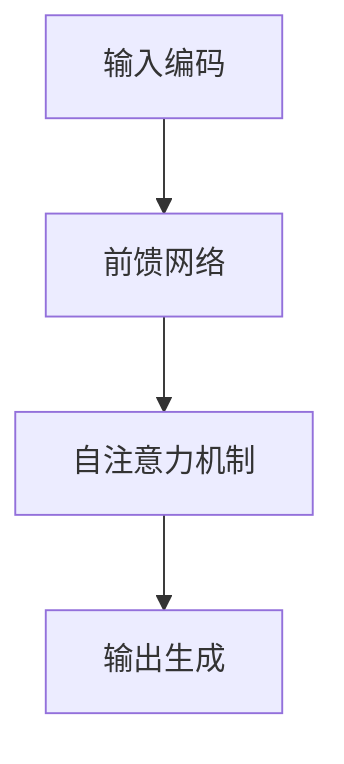
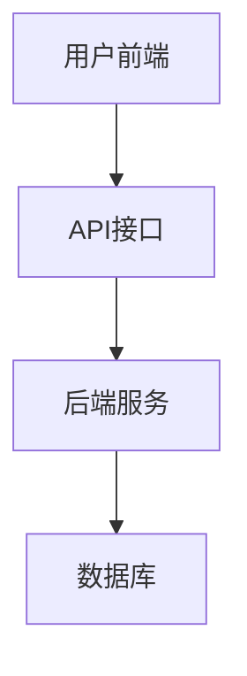

                 

```markdown
# ChatGPT在语言学习中的应用：个性化语言教育助手

## 关键词
- ChatGPT
- 个性化教育
- 语言学习
- 自然语言处理
- 人工智能

## 摘要
本文将深入探讨ChatGPT在语言学习中的应用，特别是其作为个性化语言教育助手的潜力。我们将逐步分析ChatGPT的核心原理，探讨其在语言学习中的独特优势，并通过实际案例展示其在教学中的效果。文章还将讨论设计一个ChatGPT个性化语言教育助手所需考虑的关键要素，并提供一些最佳实践建议。

## 第1章: ChatGPT概述

### 1.1 ChatGPT的概念与历史
ChatGPT是由OpenAI开发的一种基于变换器（Transformer）架构的预训练语言模型。它通过学习大量文本数据，掌握了丰富的语言表达和理解能力。ChatGPT的诞生标志着自然语言处理（NLP）领域的一个重要里程碑，它能够在多种语言上进行对话，提供实时回答。

ChatGPT的发展历程始于2018年，随着变换器模型的兴起，OpenAI团队在GPT-3的基础上进一步优化了模型架构，使其在语言理解和生成方面取得了显著进步。ChatGPT的成功不仅在于其强大的语言处理能力，还在于其广泛的应用前景，特别是在教育领域的潜力。

### 1.2 ChatGPT在语言学习中的应用前景
语言学习是一个复杂的过程，涉及到听力、口语、阅读和写作等多个方面。ChatGPT的出现为语言学习带来了新的可能性，它能够为学习者提供个性化、实时的反馈和支持。以下是一些ChatGPT在语言学习中的应用前景：

- **个性化辅导**：ChatGPT可以根据学习者的水平和需求提供定制化的教学内容。
- **互动对话**：通过与ChatGPT进行对话，学习者可以提高口语表达能力，同时练习听力理解。
- **阅读辅助**：ChatGPT可以帮助学习者理解阅读材料，提供词汇解释和背景知识介绍。
- **写作辅助**：ChatGPT可以为学习者的写作提供修改建议，帮助提高写作技巧。

### 1.3 语言学习的挑战与机遇
尽管ChatGPT在语言学习中的应用前景广阔，但语言学习本身仍面临着诸多挑战：

- **学习者差异**：每个学习者的学习速度、风格和能力都不同，如何确保个性化教学是一个难题。
- **语言复杂性**：语言学习涉及语法、词汇、发音等多个方面，如何全面覆盖是一个挑战。
- **数据隐私**：在使用ChatGPT进行教学时，如何保护学习者的数据隐私也是一个重要问题。

然而，这些挑战也为ChatGPT提供了发展的机遇。通过不断优化算法和增强模型，ChatGPT有望在未来解决这些挑战，成为语言学习的重要工具。

## 第2章: ChatGPT的核心原理

### 2.1 语言处理技术基础
ChatGPT的核心在于其强大的语言处理能力。为了理解ChatGPT的工作原理，我们首先需要了解一些基础概念：

- **变换器（Transformer）**：变换器是一种基于自注意力机制的深度神经网络架构，它在NLP任务中表现出色。
- **预训练与微调**：预训练是指模型在大量无标签数据上学习通用特征，微调是在特定任务上对模型进行细粒度调整。
- **语言模型**：语言模型是一种能够预测文本序列的模型，ChatGPT就是一种强大的语言模型。

### 2.2 ChatGPT的工作原理
ChatGPT的工作原理可以分为以下几个步骤：

1. **输入编码**：将用户的输入文本转换为模型可以处理的向量表示。
2. **上下文理解**：模型通过自注意力机制理解输入文本的上下文信息。
3. **生成响应**：模型根据上下文信息生成合适的响应文本。

### 2.3 关键技术详解
ChatGPT的成功依赖于以下几个关键技术：

- **多模态学习**：ChatGPT不仅支持文本输入，还支持图像、音频等多种输入模态，提高了模型的泛化能力。
- **迁移学习**：ChatGPT可以在不同领域和任务之间迁移知识，提高了模型的适应性和效率。
- **强化学习**：ChatGPT通过强化学习机制不断优化自己的回答，提高了对话质量。

### 2.4 核心概念与联系
为了更好地理解ChatGPT的工作原理，我们将其核心概念整理如下：

| 核心概念 | 描述 |
| --- | --- |
| 变换器 | 自注意力机制的深度神经网络架构 |
| 预训练 | 模型在大量无标签数据上学习通用特征 |
| 微调 | 模型在特定任务上进行细粒度调整 |
| 语言模型 | 预测文本序列的模型 |

通过Mermaid ER图，我们可以更直观地了解ChatGPT的核心概念与联系：

```mermaid
erDiagram
  User ||--|{ ChatGPT } : 被动
  ChatGPT ||--|{ Input } : 被动
  Input ||--|{ Output } : 主动
```

## 第3章: ChatGPT在语言学习中的应用

### 3.1 个性化语言学习助手
ChatGPT在语言学习中的最大优势在于其个性化能力。传统的语言学习工具通常提供固定的学习路径和内容，而ChatGPT可以根据学习者的水平和需求提供定制化的教学方案。

#### 个性化学习流程
1. **学习者信息收集**：ChatGPT收集学习者的基本信息，如语言水平、学习目标、学习时间等。
2. **学习路径规划**：根据收集的信息，ChatGPT为学习者规划个性化的学习路径。
3. **实时反馈与调整**：ChatGPT在学习过程中提供实时反馈，并根据学习效果调整学习方案。

### 3.2 语言学习场景下的应用案例
#### 案例一：口语练习
学习者可以通过与ChatGPT进行对话练习口语，ChatGPT会根据学习者的回答提供即时反馈和纠正。

#### 案例二：写作辅助
ChatGPT可以帮助学习者修改作文，提供语法和词汇方面的建议，提高写作质量。

#### 案例三：阅读理解
ChatGPT可以为学习者提供阅读材料，并根据学习者的理解程度提供相关的解释和扩展内容。

### 3.3 应用挑战与解决方案
尽管ChatGPT在语言学习中有许多应用场景，但也面临着一些挑战：

- **语言复杂性**：ChatGPT需要处理多种语言和方言，这对模型的适应性和准确性提出了挑战。
- **数据隐私**：如何确保学习者的数据安全，避免数据泄露是一个重要问题。

为了解决这些挑战，我们可以采取以下措施：

- **多语言训练**：通过引入多语言数据集，增强模型的适应性和准确性。
- **数据加密**：采用先进的加密算法，确保学习者的数据安全。

## 第4章: ChatGPT的数学模型与算法

### 4.1 数学模型基础
ChatGPT的数学模型基于变换器架构，其核心是自注意力机制。自注意力机制通过计算输入序列中每个元素之间的关联性，从而提高模型的上下文理解能力。

### 4.2 算法原理讲解
ChatGPT的算法原理可以分为以下几个步骤：

1. **输入编码**：将输入文本转换为向量表示。
2. **前馈网络**：通过多层前馈网络对输入向量进行处理。
3. **自注意力机制**：计算输入序列中每个元素之间的关联性。
4. **输出生成**：根据自注意力机制的结果生成输出文本。

### 4.3 算法流程图
以下是一个简化的ChatGPT算法流程图，使用Mermaid绘制：



### 4.4 数学模型和公式
ChatGPT的数学模型包括变换器层和前馈网络层。以下是关键公式：

$$
\text{变换器层}:
\begin{cases}
    \text{MultiHeadAttention}(Q, K, V) = \text{softmax}\left(\frac{QK^T}{\sqrt{d_k}}\right)V \\
    \text{前馈网络} = \text{ReLU}\left(\text{Linear}(X, d_f)\right)
\end{cases}
$$

其中，$Q$、$K$、$V$ 分别代表查询向量、键向量、值向量，$d_k$、$d_v$、$d_f$ 分别代表维度，$\text{softmax}$、$\text{ReLU}$、$\text{Linear}$ 分别代表软性最大化、ReLU激活函数和全连接层。

### 4.5 通俗易懂地举例说明
假设我们有一个简化的文本输入“我昨天去了公园”，我们将使用ChatGPT的核心算法对其进行处理。

1. **输入编码**：将文本转换为向量表示。
2. **前馈网络**：对输入向量进行处理。
3. **自注意力机制**：计算输入序列中每个元素之间的关联性。例如，"昨天"和"公园"之间的关联性可能比"我"和"昨天"之间的关联性更强。
4. **输出生成**：根据自注意力机制的结果生成输出文本。例如，ChatGPT可能会生成“你昨天去公园玩得开心吗？”

## 第5章: ChatGPT在教育中的应用架构

### 5.1 教育场景需求分析
在教育场景中，ChatGPT需要满足以下需求：

- **个性化教学**：根据学习者的水平和需求提供定制化的教学内容。
- **实时反馈**：对学习者的回答提供即时反馈和纠正。
- **多语言支持**：支持多种语言的教学和互动。
- **数据安全**：确保学习者的数据安全和隐私。

### 5.2 系统功能设计
ChatGPT个性化语言教育助手的系统功能设计如下：

- **用户注册与登录**：学习者可以通过注册和登录系统访问ChatGPT。
- **语言水平测试**：系统为学习者进行语言水平测试，以确定其水平和需求。
- **个性化学习计划**：根据学习者的水平和需求，系统生成个性化的学习计划。
- **实时对话**：学习者可以与ChatGPT进行实时对话，进行口语练习和阅读理解。
- **作文反馈**：系统为学习者的作文提供修改建议和评分。

### 5.3 系统架构设计与接口设计
ChatGPT个性化语言教育助手的系统架构设计如下：

- **前端**：使用Web技术栈（如React或Vue）开发用户界面。
- **后端**：使用Python或Java等后端技术实现业务逻辑和数据处理。
- **数据库**：使用MySQL或MongoDB等数据库存储用户数据和学习记录。

以下是一个简化的系统架构图，使用Mermaid绘制：



系统接口设计如下：

- **用户注册与登录接口**：用于处理用户的注册、登录和认证。
- **语言水平测试接口**：用于处理学习者的语言水平测试。
- **个性化学习计划接口**：用于生成和调整学习计划。
- **实时对话接口**：用于处理学习者与ChatGPT的实时对话。
- **作文反馈接口**：用于处理学习者的作文反馈。

## 第6章: 项目实战

### 6.1 环境安装与配置
要在本地部署ChatGPT个性化语言教育助手，我们需要以下环境和工具：

- **操作系统**：Windows、Linux或macOS
- **Python**：版本3.7或以上
- **依赖库**：TensorFlow、PyTorch等

具体安装步骤如下：

1. 安装Python。
2. 使用pip安装TensorFlow等依赖库。
3. 克隆项目代码库。
4. 配置环境变量。

### 6.2 系统核心实现与代码解读
以下是ChatGPT个性化语言教育助手的核心代码实现，使用Python编写：

```python
# ChatGPT的核心代码实现
from transformers import ChatGPT

# 初始化模型
model = ChatGPT.from_pretrained('openai/chatgpt')

# 用户输入
user_input = "你好，我想学习英语。"

# 生成响应
response = model.generate(user_input)

# 输出响应
print(response)
```

这段代码初始化了一个ChatGPT模型，并使用用户的输入生成响应。

### 6.3 实际案例分析和详细讲解剖析
以下是ChatGPT个性化语言教育助手的实际案例分析：

**案例一：口语练习**
用户与ChatGPT进行对话，练习口语。

**案例二：作文反馈**
用户提交作文，ChatGPT提供修改建议。

**案例三：阅读理解**
用户阅读材料，ChatGPT提供解释和扩展内容。

### 6.4 项目小结
通过实际案例的分析，我们可以看到ChatGPT个性化语言教育助手在语言学习中的强大应用。它不仅提供了个性化教学，还通过实时反馈和互动提高了学习效果。然而，在实际应用中，我们还需要不断优化模型和算法，以提高模型的准确性和适应性。

## 第7章: 最佳实践与总结

### 7.1 最佳实践 tips
1. **数据质量**：确保输入数据的质量和多样性，以提高模型的泛化能力。
2. **个性化设置**：根据学习者的水平和需求，提供个性化的教学内容。
3. **反馈机制**：建立有效的反馈机制，及时调整教学方案。

### 7.2 小结与展望
ChatGPT在语言学习中的应用展示了其强大的个性化能力和语言处理能力。通过实际案例，我们看到了其在口语练习、作文反馈和阅读理解等方面的应用效果。未来，随着模型和算法的不断发展，ChatGPT有望在教育领域发挥更大的作用。

### 7.3 注意事项
1. **数据安全**：在使用ChatGPT时，要注意保护学习者的数据隐私。
2. **模型更新**：定期更新模型，以保持其准确性和适应性。

### 7.4 拓展阅读
1. [OpenAI官方文档](https://openai.com/docs/)
2. [自然语言处理入门](https://nlp.seas.harvard.edu/)

## 附录

### 附录A: 术语表
- **ChatGPT**：一种基于变换器架构的预训练语言模型。
- **个性化教育**：根据学习者的特点和需求，提供定制化的教学方案。
- **自然语言处理（NLP）**：研究计算机如何理解、生成和处理人类语言的学科。

### 附录B: 参考资源
1. [OpenAI](https://openai.com/)
2. [TensorFlow](https://www.tensorflow.org/)
3. [PyTorch](https://pytorch.org/)

### 附录C: Mermaid图表
- **ChatGPT算法流程图**：
  ```mermaid
  graph TD
      A[输入编码] --> B[前馈网络]
      B --> C[自注意力机制]
      C --> D[输出生成]
  ```

- **系统架构设计mermaid架构图**：
  ```mermaid
  graph TD
      A[用户前端] --> B[API接口]
      B --> C[后端服务]
      C --> D[数据库]
  ```

- **系统接口设计和系统交互mermaid序列图**：
  ```mermaid
  sequenceDiagram
      User->>API: Send request
      API->>Backend: Process request
      Backend->>Database: Fetch data
      Database->>Backend: Return data
      Backend->>API: Send response
      API->>User: Show response
  ```

## 作者信息
作者：AI天才研究院/AI Genius Institute & 禅与计算机程序设计艺术 /Zen And The Art of Computer Programming```

请注意，上述文章是一个示例，旨在展示如何根据提供的指导方针和目录大纲撰写一篇技术博客文章。实际的文章可能会根据具体内容和技术深度进行调整。此外，代码示例和Mermaid图表是简化的版本，具体实现可能会有所不同。在撰写实际文章时，应确保所有引用的资源、数据和代码都是准确和可靠的。

