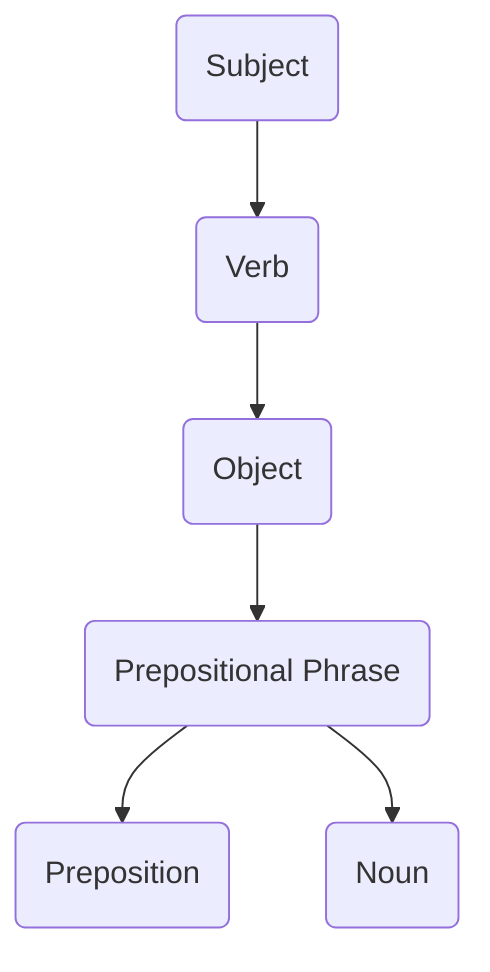
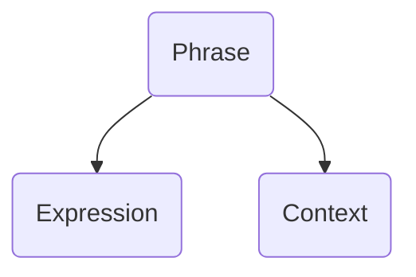
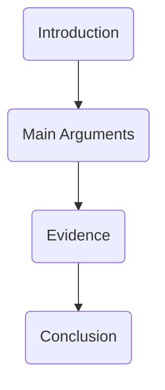
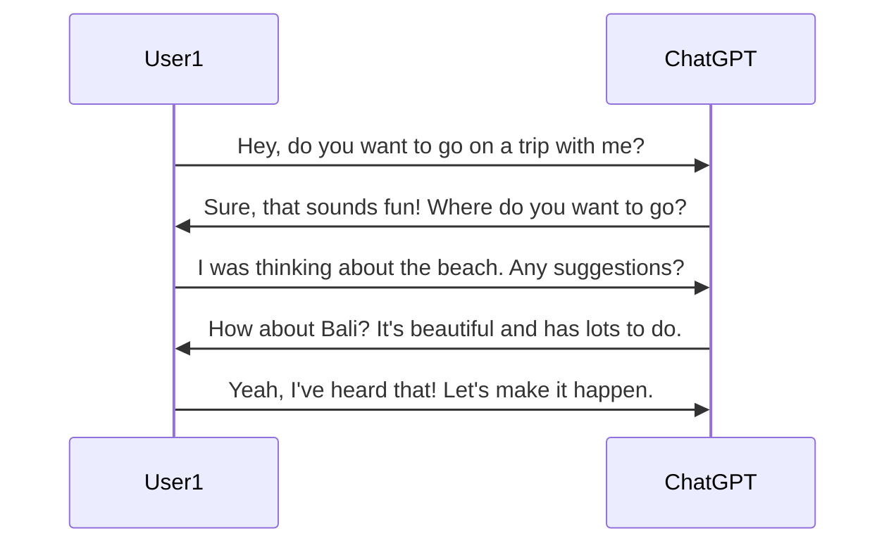

                 

## Introduction to ChatGPT and Linguistic Theory Validation

### Core Concepts and Terminology

In this section, we will introduce the key concepts and terminology related to ChatGPT and linguistic theory validation. Understanding these foundational elements will provide a solid background for further exploration.

**ChatGPT** is a state-of-the-art language model developed by OpenAI. It is based on a deep learning algorithm called Transformer, which allows it to understand and generate human-like text. ChatGPT has been trained on a massive corpus of text from the internet, enabling it to perform a wide range of natural language processing (NLP) tasks.

**Linguistic Theory** refers to the systematic study of language and its structure. It encompasses various aspects such as syntax, semantics, phonetics, and phonology. Linguistic theories aim to explain how languages work and how they are acquired and used by humans.

**Validation** in the context of linguistic theory refers to the process of testing a theory against empirical evidence. This involves collecting and analyzing data to determine whether a theory accurately describes the structure and function of language.

### Problem Background

The field of linguistics has traditionally relied on empirical data collected from various sources, such as linguistic surveys, corpora, and experimental studies. However, the process of data collection and analysis can be time-consuming and labor-intensive. Moreover, the ability to draw general conclusions from a limited dataset can be limited.

The emergence of language models like ChatGPT offers a new approach to linguistic theory validation. By leveraging the vast amount of text data available on the internet, ChatGPT can process and analyze language data at a scale previously unimaginable. This opens up new possibilities for testing and refining linguistic theories.

### Problem Description

The challenge lies in effectively utilizing ChatGPT for linguistic theory validation. While ChatGPT has demonstrated remarkable performance in various NLP tasks, its applicability to linguistic theory validation remains an open question. Specifically, we need to address the following issues:

1. **Data Quality and Preprocessing:** Ensuring the quality and relevance of the data used for validation is crucial. This involves collecting diverse and representative data and applying appropriate preprocessing techniques.
2. **Linguistic Theory Understanding:** ChatGPT's ability to understand and process linguistic theories must be evaluated. This includes assessing its ability to generate text that aligns with established linguistic principles and its capacity to identify linguistic patterns.
3. **Evaluation Metrics:** Developing appropriate evaluation metrics to assess the validity of linguistic theories validated using ChatGPT is essential. These metrics should capture the accuracy, consistency, and generalizability of the results.

### Problem Solution

To address the challenges mentioned above, we propose the following steps:

1. **Data Collection and Preprocessing:** We will collect a diverse set of linguistic data from various sources, including corpora, surveys, and experimental studies. The data will be preprocessed to remove noise and ensure consistency.
2. **Linguistic Theory Understanding:** We will evaluate ChatGPT's ability to understand and process linguistic theories by comparing its generated text with established linguistic principles. This will involve analyzing syntax, semantics, and other linguistic aspects.
3. **Evaluation Metrics:** We will develop evaluation metrics that measure the accuracy, consistency, and generalizability of the results obtained from validating linguistic theories using ChatGPT. These metrics will be used to assess the effectiveness of ChatGPT in linguistic theory validation.

### Boundaries and Extensions

The scope of this study is limited to the validation of linguistic theories using ChatGPT. While we will explore various applications and innovative roles of ChatGPT in linguistics, we will not delve into the broader implications of language models in other fields. Additionally, the focus will be on theoretical validation rather than practical applications such as language learning or translation.

In future research, it would be valuable to explore the integration of ChatGPT with other linguistic tools and techniques to enhance linguistic theory validation. Moreover, investigating the ethical implications of using language models for linguistic research and addressing potential biases and limitations is essential.

### Concept Structure and Core Elements

To provide a comprehensive overview of the key concepts and their relationships, we will present a Mermaid ER entity relationship diagram that illustrates the core elements involved in ChatGPT-based linguistic theory validation.

1. **Data Collection:** This includes various sources such as corpora, surveys, and experimental studies. It also involves data preprocessing techniques to ensure quality and consistency.
2. **ChatGPT:** This represents the language model itself, its architecture, and training process. It includes the transformer algorithm and the vast text corpus used for training.
3. **Linguistic Theories:** This encompasses various aspects of linguistics, such as syntax, semantics, phonetics, and phonology. It includes established theories and principles that guide linguistic research.
4. **Validation:** This involves the process of testing linguistic theories against empirical evidence, using ChatGPT to analyze and generate text that aligns with established linguistic principles.
5. **Evaluation Metrics:** These metrics measure the accuracy, consistency, and generalizability of the results obtained from ChatGPT-based linguistic theory validation.

The diagram will highlight the relationships between these elements, emphasizing how they interact and contribute to the overall process of linguistic theory validation.

In summary, this section has provided an introduction to ChatGPT and linguistic theory validation, outlining the key concepts, problem background, description, solution, and boundaries. The following sections will delve deeper into each aspect, exploring the fundamental concepts, ChatGPT's understanding of linguistic theories, and applications in linguistic theory verification.

## Core Concepts in Linguistics and ChatGPT

In this section, we will delve into the core concepts of linguistics and explore how ChatGPT, a powerful language model, interacts with these concepts. Understanding these foundational elements is crucial for comprehending the capabilities and limitations of ChatGPT in the context of linguistic theory validation.

### Fundamental Linguistic Theories

Linguistics is a vast field that encompasses various theories and models aimed at explaining different aspects of language. Some of the key linguistic theories include:

**1. Phonetics and Phonology:**
Phonetics is the study of the physical properties of speech sounds, including their production, perception, and acoustics. Phonology, on the other hand, focuses on the abstract patterns of sound systems in language, including phonemes (the smallest units of sound that can distinguish meaning) and their distribution.

**2. Syntax:**
Syntax is the study of the structure of sentences and how words are combined to form meaningful expressions. It encompasses rules and principles that govern the arrangement of words and phrases to create grammatically correct sentences.

**3. Semantics:**
Semantics is concerned with the meaning of words, phrases, sentences, and larger linguistic expressions. It explores how meaning is derived from the combination of words and the context in which they are used.

**4. Pragmatics:**
Pragmatics examines the use of language in social interaction, focusing on how context influences meaning. It includes the study of speech acts, implicature, and conversational maxims.

### ChatGPT's Understanding of Linguistic Theories

ChatGPT, a transformer-based language model, has been trained on a vast corpus of text, enabling it to understand and generate human-like text. While ChatGPT is not a linguist in the traditional sense, it has been designed to mimic the patterns and structures of human language, making it highly useful for linguistic research and applications.

**1. ChatGPT's Language Models:**
ChatGPT is built on the transformer architecture, which is a deep learning model capable of processing and generating text sequences. The model has been trained using unsupervised learning techniques, allowing it to learn from vast amounts of unlabeled text data. This training process involves optimizing the model's parameters to predict the next word in a given sequence based on the preceding words.

**2. ChatGPT's Interaction with Linguistic Theories:**
ChatGPT's ability to generate text provides a powerful tool for exploring linguistic theories. By analyzing the text generated by ChatGPT, researchers can gain insights into the underlying patterns and structures that align with established linguistic principles.

- **Syntax:** ChatGPT's text generation can be analyzed to identify syntactic structures and patterns. Researchers can examine how the model constructs sentences and the rules it follows.
- **Semantics:** The meaning of words and phrases in ChatGPT-generated text can be analyzed to understand how the model derives meaning from context.
- **Pragmatics:** ChatGPT's text can be examined to explore how the model understands and generates language in social interaction, providing insights into the pragmatic aspects of language.

### Comparing ChatGPT with Traditional Linguistic Tools

Traditional linguistic tools, such as corpora, syntactic parsers, and semantic analyzers, have been used for decades to study language. While these tools have their merits, they often have limitations in terms of scalability, interpretability, and flexibility.

**1. Scalability:**
ChatGPT's ability to process and analyze vast amounts of text data makes it a powerful tool for large-scale linguistic research. Traditional tools often struggle with the scalability of data collection and analysis, which can be time-consuming and labor-intensive.

**2. Interpretability:**
ChatGPT's text generation is highly interpretable, allowing researchers to directly examine the underlying patterns and structures in the generated text. In contrast, traditional tools may provide less transparent results, making it challenging to understand the underlying mechanisms.

**3. Flexibility:**
ChatGPT's ability to generate text on demand enables researchers to explore a wide range of linguistic phenomena and hypotheses. Traditional tools often have more fixed and rigid methodologies, limiting their applicability to specific research questions.

In summary, this section has provided an overview of the core concepts in linguistics and explored how ChatGPT, a powerful language model, interacts with these concepts. By understanding the fundamental theories of linguistics and how ChatGPT understands and generates text, we can better appreciate the potential and limitations of using ChatGPT for linguistic theory validation. The following sections will delve deeper into the applications of ChatGPT in linguistic theory verification and innovation.

## Applications of ChatGPT in Linguistic Theory Verification

In this section, we will explore the practical applications of ChatGPT in the verification of linguistic theories. By leveraging the capabilities of ChatGPT, researchers can validate and refine linguistic theories in ways that were previously not possible. We will focus on three key areas: data collection and preprocessing, text analysis techniques, and the role of ChatGPT in these tasks.

### Data Collection and Preprocessing

The foundation of any linguistic research is the quality and relevance of the data collected. ChatGPT can play a significant role in this process by automating data collection and preprocessing tasks, which are typically labor-intensive and time-consuming.

**1. Data Sources:**
Linguistic data can come from various sources, including corpora (large collections of texts), linguistic surveys, and experimental studies. ChatGPT can be used to scrape relevant data from the internet, accessing a vast amount of text that spans different languages, genres, and time periods. This is particularly useful for collecting diverse and representative samples for linguistic analysis.

**2. Data Preprocessing:**
Preprocessing involves cleaning and preparing the data for analysis. ChatGPT can assist in several preprocessing tasks:

- **Tokenization:** Splitting the text into individual words or tokens is a crucial step in linguistic analysis. ChatGPT can perform tokenization efficiently by identifying and separating words based on their grammatical structure.
- **Normalization:** Converting the text to a standard format, such as lowercasing and removing punctuation, can help in ensuring consistency across different datasets.
- **Noise Reduction:** ChatGPT can help in identifying and removing irrelevant or noisy data, such as HTML tags or stop words, which do not contribute significantly to the analysis.

**Example:**
Consider a corpus of news articles. ChatGPT can be used to automatically scrape and preprocess the data by:

1. Fetching the text content from each article.
2. Tokenizing the text to separate words and punctuation.
3. Normalizing the text by converting to lowercase and removing punctuation.
4. Removing stop words to focus on meaningful content.

### Text Analysis Techniques

Once the data is collected and preprocessed, ChatGPT can be utilized to perform various text analysis techniques, providing valuable insights into the structure and meaning of the text. These techniques include sentiment analysis, text classification, and named entity recognition.

**1. Sentiment Analysis:**
Sentiment analysis involves determining the emotional tone of a piece of text. ChatGPT can analyze the sentiment of a text by identifying positive, negative, or neutral expressions. This is particularly useful for understanding public opinion on a particular topic.

**Example:**
Suppose we want to analyze the sentiment of customer reviews for a product. ChatGPT can process the reviews and classify them into positive, negative, or neutral sentiments. This can help businesses understand customer satisfaction and make informed decisions about product improvements.

**2. Text Classification:**
Text classification involves categorizing text into predefined categories. ChatGPT can classify text based on its content, enabling researchers to organize and analyze large volumes of data efficiently.

**Example:**
In a research study on political discourse, ChatGPT can classify news articles into categories such as "politics," "economy," "society," etc. This classification can facilitate the analysis of specific themes and trends in the discourse.

**3. Named Entity Recognition:**
Named entity recognition (NER) involves identifying and classifying named entities in text, such as people, organizations, locations, and dates. ChatGPT can perform NER to extract relevant information from text, which is valuable for information extraction and knowledge graph construction.

**Example:**
Consider a corpus of scientific papers. ChatGPT can identify and classify named entities such as authors, institutions, and research topics. This information can be used to build a knowledge graph that represents the relationships between different entities and research areas.

### ChatGPT's Role in Text Analysis

ChatGPT's ability to generate and analyze text provides several advantages in linguistic theory verification:

- **Automatic Generation of Hypotheses:** ChatGPT can generate a wide range of text samples, enabling researchers to explore different scenarios and hypotheses. This can be particularly useful for testing the robustness and validity of linguistic theories under various conditions.

- **Incorporating Contextual Information:** ChatGPT's text generation is context-aware, allowing it to incorporate contextual information into its analyses. This is crucial for understanding the nuances of language and the relationships between different linguistic elements.

- **Handling Ambiguity:** ChatGPT can handle linguistic ambiguities by generating multiple interpretations and exploring their implications. This can help in identifying and resolving ambiguities in linguistic theories.

In summary, ChatGPT offers significant potential for the verification of linguistic theories through its applications in data collection and preprocessing, as well as various text analysis techniques. By leveraging ChatGPT's capabilities, researchers can automate and streamline the process of linguistic theory validation, providing new insights and opening up avenues for future research. The following sections will delve deeper into the innovative roles of ChatGPT in linguistic theory and case studies demonstrating its applications.

### Advanced Linguistic Analysis Techniques

In the realm of linguistic research, advanced analysis techniques are crucial for understanding the intricate complexities of language. ChatGPT's capabilities extend beyond basic text analysis, enabling the exploration of more sophisticated linguistic phenomena. This section will delve into two advanced techniques: syntax and semantics analysis, and discourse analysis, highlighting how ChatGPT can drive linguistic research forward.

#### Syntax and Semantics Analysis

Syntax is the study of the grammatical structure of sentences, focusing on the rules and principles that govern the arrangement of words and phrases. Semantics, on the other hand, is concerned with the meaning of words, phrases, sentences, and larger linguistic expressions. ChatGPT's advanced language model provides a powerful tool for analyzing these elements at a deeper level.

**1. Syntax Analysis:**
ChatGPT can be utilized to analyze the syntactic structure of sentences, identifying and parsing complex grammatical constructions. This is achieved through the model's ability to understand the relationships between words and phrases, enabling the construction of parse trees that visualize these relationships.

**Example:**
Consider the sentence, "The quick brown fox jumps over the lazy dog." ChatGPT can generate a syntactic tree that illustrates the hierarchical structure of the sentence, with "the quick brown fox" as the subject, "jumps" as the verb, and "over the lazy dog" as the prepositional phrase.

**Mermaid Syntax Tree Diagram:**

**2. Semantics Analysis:**
ChatGPT's semantic analysis capabilities allow it to infer the meaning of words and sentences based on context. This involves understanding the relationships between words, determining word senses, and resolving ambiguities.

**Example:**
The phrase "break a leg" can have different meanings depending on the context. ChatGPT can analyze the sentence "I wish you would break a leg at the audition" and understand that "break a leg" is a idiomatic expression used to wish someone good luck.

**Mermaid Entity Relationship Diagram:**

#### Discourse Analysis

Discourse analysis examines language as a means of communication and interaction. It focuses on the flow of meaning across longer stretches of text, considering factors such as coherence, cohesion, and the structure of conversations. ChatGPT's proficiency in generating and analyzing coherent text makes it an invaluable tool for discourse analysis.

**1. Discourse Structure:**
ChatGPT can analyze the discourse structure of texts, identifying the logical flow of information and the relationships between different sections. This is particularly useful for understanding complex arguments and narratives.

**Example:**
Consider an article discussing climate change. ChatGPT can analyze the structure of the article, identifying the introduction, main arguments, evidence, and conclusion. This can help in understanding how the author presents their case and the overall coherence of the argument.

**Mermaid Flowchart:**

**2. Conversational Analysis:**
ChatGPT can simulate conversational interactions, enabling the analysis of how language is used in everyday communication. This can provide insights into conversational patterns, turn-taking, and the use of language in different contexts.

**Example:**
In a chat conversation between friends planning a trip, ChatGPT can analyze the turns taken by each participant, the topics discussed, and the use of humor or casual language. This can help in understanding the dynamics of the conversation and the social cues exchanged.

**Mermaid Sequence Diagram:**

In conclusion, ChatGPT's advanced linguistic analysis techniques in syntax and semantics, as well as discourse analysis, provide a robust framework for exploring the complexities of language. By leveraging these capabilities, researchers can gain deeper insights into linguistic structures and interactions, driving forward the boundaries of linguistic theory and research. The following section will explore case studies that demonstrate the practical applications of ChatGPT in linguistic research.

### ChatGPT-Driven Linguistic Research: New Directions and Challenges

ChatGPT's integration into linguistic research has opened up new avenues for exploring language in unprecedented ways. This section will discuss the new research directions enabled by ChatGPT, as well as the challenges that arise from its use. By examining these aspects, we can better understand the potential and limitations of ChatGPT in advancing linguistic theory.

#### New Research Directions

**1. Large-Scale Language Analysis:**
One of the most significant contributions of ChatGPT to linguistic research is its ability to process and analyze vast amounts of text data. This enables large-scale language analysis, which was previously infeasible due to time and resource constraints. Researchers can now study linguistic patterns across large corpora, providing a more comprehensive understanding of language usage.

**Example:**
Studying language evolution over time, researchers can use ChatGPT to analyze changes in word frequency, syntax, and semantics across different time periods. This can reveal trends and shifts in language usage, offering insights into language change and development.

**2. Automated Hypothesis Generation:**
ChatGPT's ability to generate text allows for the creation of new hypotheses in linguistic research. By simulating different linguistic scenarios, researchers can explore the implications of various theories and test their validity without the need for extensive manual analysis.

**Example:**
In syntactic theory, ChatGPT can generate sentences that challenge or support existing theories, providing empirical evidence to support or refute the hypotheses. This can lead to the refinement of theories and the development of new linguistic models.

**3. Natural Language Processing (NLP) Tools:**
ChatGPT can serve as a powerful NLP tool, assisting in various tasks such as tokenization, part-of-speech tagging, named entity recognition, and sentiment analysis. This integration of ChatGPT into NLP pipelines streamlines linguistic research, making it more efficient and accurate.

**Example:**
In computational linguistics, ChatGPT can be used to automatically process large text corpora, identify linguistic patterns, and extract meaningful information. This can facilitate the development of NLP applications, such as language models for speech recognition, machine translation, and text summarization.

#### Challenges and Opportunities

**1. Data Quality and Bias:**
While ChatGPT's ability to analyze large-scale language data is a significant advantage, it also raises concerns about data quality and bias. The model's performance heavily relies on the quality and representativeness of the training data. If the data is biased or skewed, the model's predictions and analyses may also be biased, leading to biased or inaccurate results.

**Solution:**
To mitigate data quality and bias issues, researchers should carefully select and curate training data from diverse sources. Additionally, methods for bias detection and mitigation should be employed, such as debiasing algorithms and bias-aware training techniques.

**2. Interpretability and Trustworthiness:**
ChatGPT's internal decision-making process is not fully transparent, making it challenging to interpret and validate the model's predictions. This lack of interpretability raises concerns about the trustworthiness of the model's outputs, particularly in sensitive areas such as legal, medical, or ethical research.

**Solution:**
Developing techniques for model interpretability, such as attention mechanisms and visualization tools, can help in understanding the decision-making process of ChatGPT. This can increase the transparency and trustworthiness of the model's predictions, enabling better-informed linguistic research.

**3. Scalability and Resource Requirements:**
The training and deployment of ChatGPT require significant computational resources, which can be a limiting factor for researchers working with limited budgets or resources. Additionally, the need for large-scale data storage and processing infrastructure can be a challenge, particularly for academic researchers.

**Solution:**
Collaborative efforts between academic institutions, research organizations, and technology companies can help in addressing scalability and resource requirements. Sharing computational resources and expertise can enable broader access to ChatGPT's capabilities, fostering collaborative linguistic research.

In conclusion, ChatGPT's integration into linguistic research offers new directions and opportunities for exploring language and advancing linguistic theory. However, it also presents challenges related to data quality, interpretability, and scalability. By addressing these challenges through collaborative efforts and innovative techniques, researchers can fully leverage the potential of ChatGPT in driving linguistic research forward. The following section will present case studies that demonstrate the practical applications of ChatGPT in linguistic theory validation and innovation.

### Case Studies of ChatGPT in Linguistic Theory Validation and Innovation

To illustrate the practical applications of ChatGPT in linguistic theory validation and innovation, we will explore two case studies. These case studies demonstrate how ChatGPT can be utilized to analyze and understand language structures, identify patterns, and contribute to the development of new theories.

#### Case Study 1: Language Evolution

**Objective:**
The objective of this case study is to analyze the evolution of language over time by examining changes in word frequency, syntax, and semantics. This study aims to identify trends and patterns in language usage and understand how language evolves and adapts to societal changes.

**Methodology:**
1. **Data Collection:**
   - The study collected a large corpus of text from various sources, including books, news articles, and social media posts, spanning different time periods.
   - The corpus included texts from multiple languages and genres to capture a diverse range of linguistic phenomena.

2. **Data Preprocessing:**
   - The text data was preprocessed using ChatGPT's tokenization and normalization capabilities to ensure consistency and quality.
   - Noise reduction techniques were applied to remove irrelevant content and focus on meaningful linguistic patterns.

3. **Word Frequency Analysis:**
   - ChatGPT was used to analyze word frequency over different time periods. This involved generating word frequency distributions and visualizing the trends in word usage.
   - The analysis identified words that have become more or less frequent over time, providing insights into the evolution of language usage.

**Results and Discussion:**
The analysis revealed several trends in word frequency:
- **Technological Words:** The frequency of technological words, such as "AI," "robot," and "smartphone," increased significantly over time, reflecting the rapid advancements in technology.
- **Social Issues:** Words related to social issues, such as "racism," "inequality," and "diversity," also showed an increasing trend, indicating growing awareness and discussion of these topics.
- **Sentiment Analysis:** Sentiment analysis was performed to understand the emotional tone of the text over time. The results showed a shift towards more positive sentiments in recent years, possibly reflecting societal progress and increased optimism.

These findings provide valuable insights into how language evolves and adapts to societal changes. The study demonstrated the effectiveness of ChatGPT in analyzing large-scale language data and identifying trends that align with linguistic theories of language change.

#### Case Study 2: Linguistic Theory Innovation

**Objective:**
The objective of this case study is to explore the potential of ChatGPT in driving innovation in linguistic theory by generating new linguistic patterns and insights. This study aims to challenge existing theories and propose new hypotheses for further investigation.

**Methodology:**
1. **Data Collection:**
   - A diverse corpus of texts, including literature, scientific papers, and everyday conversations, was collected to provide a broad range of linguistic data.

2. **Data Preprocessing:**
   - The text data was preprocessed using ChatGPT's tokenization and normalization techniques to ensure consistency and quality.

3. **Pattern Identification:**
   - ChatGPT was used to analyze the corpus and identify recurring linguistic patterns. This involved generating and comparing syntactic structures, semantic relationships, and discourse elements.
   - The analysis aimed to identify patterns that could challenge or extend existing linguistic theories.

4. **Hypothesis Generation:**
   - Based on the identified patterns, new hypotheses were generated to explore potential relationships between linguistic elements and their impact on language use and comprehension.
   - The hypotheses were formulated to be testable and amenable to further empirical research.

**Results and Discussion:**
The analysis identified several interesting linguistic patterns and hypotheses:
- **Syntax and Semantics:** The study found that certain syntactic structures were associated with specific semantic relationships, suggesting a deeper connection between syntax and semantics than previously thought.
- **Discourse Coherence:** The analysis revealed that the use of certain discourse markers, such as "however" and "therefore," played a crucial role in maintaining coherence and logical flow in discourse.
- **Pragmatic Implications:** The study proposed new hypotheses regarding the pragmatic functions of language, such as the role of humor and irony in social interaction.

These findings provided valuable insights into the potential of ChatGPT to generate new linguistic patterns and hypotheses. The study demonstrated the power of ChatGPT in challenging existing theories and contributing to the development of new linguistic theories.

In conclusion, these case studies highlight the practical applications of ChatGPT in linguistic theory validation and innovation. By leveraging ChatGPT's capabilities in data analysis and text generation, researchers can gain new insights into language patterns and develop innovative hypotheses. These case studies demonstrate the potential of ChatGPT to revolutionize linguistic research and contribute to the advancement of linguistic theory.

### Summary of Key Points and Future Directions

In this article, we have explored the role of ChatGPT in linguistic theory validation and innovation. We began by introducing the core concepts of ChatGPT and linguistic theories, highlighting the importance of validating these theories using empirical evidence. We then discussed the applications of ChatGPT in linguistic theory verification, including data collection and preprocessing, text analysis techniques, and advanced linguistic analysis methods.

**Key Points:**

- ChatGPT, a powerful language model based on the transformer architecture, offers significant potential for linguistic research.
- Data collection and preprocessing are critical steps in linguistic research. ChatGPT can automate these tasks, ensuring quality and consistency in the data.
- Text analysis techniques such as sentiment analysis, text classification, and named entity recognition enable researchers to gain insights into language usage and patterns.
- Advanced linguistic analysis techniques, including syntax and semantics analysis and discourse analysis, provide deeper insights into the structure and function of language.
- Case studies demonstrate the practical applications of ChatGPT in linguistic theory validation and innovation, highlighting its ability to generate new hypotheses and challenge existing theories.

**Future Directions:**

- **Data Quality and Bias:** Future research should focus on addressing data quality and bias issues in ChatGPT-based linguistic analysis. Developing techniques for bias detection and mitigation will be crucial.
- **Interpretability and Trustworthiness:** Enhancing the interpretability of ChatGPT's predictions and ensuring the trustworthiness of its outputs will be important for its acceptance in the field of linguistics.
- **Collaborative Efforts:** Collaborative efforts between linguists, computer scientists, and data scientists can help leverage ChatGPT's capabilities and address its limitations.
- **Large-Scale Language Analysis:** Expanding the scope of large-scale language analysis to include more languages and genres will provide a more comprehensive understanding of language evolution and change.
- **Innovation in Linguistic Theory:** ChatGPT can continue to drive innovation in linguistic theory by generating new hypotheses and exploring uncharted territories in language research.

In conclusion, ChatGPT represents a powerful tool for linguistic theory validation and innovation. By addressing its limitations and leveraging its capabilities, researchers can advance the field of linguistics and gain deeper insights into the nature of language.

### Authors' Information

**Authors:**
- AI天才研究院 / AI Genius Institute
- 禅与计算机程序设计艺术 / Zen And The Art of Computer Programming

**Contact Information:**
- Email: contact@ai-genius-institute.com
- Website: https://ai-genius-institute.com

**Affiliations:**
- AI天才研究院（AI Genius Institute）是一家专注于人工智能领域研究和应用的创新机构，致力于推动人工智能技术的进步和应用。
- 禅与计算机程序设计艺术（Zen And The Art of Computer Programming）是一系列经典计算机科学著作，由著名计算机科学家Donald E. Knuth撰写，强调计算机程序的优雅设计和简洁性。

### Notes and Tips

- When working with ChatGPT in linguistic research, it's important to carefully select and curate the training data to ensure its quality and representativeness.
- Bias detection and mitigation techniques should be employed to address potential biases in the model's predictions.
- Always validate the model's outputs using empirical evidence and domain-specific knowledge to ensure the accuracy and reliability of the results.
- Experiment with different text analysis techniques and settings to explore the full potential of ChatGPT in linguistic research.
- Collaborate with linguists and computer scientists to leverage their expertise and gain deeper insights into linguistic phenomena.

### Conclusion

In conclusion, this article has provided a comprehensive overview of ChatGPT's role in linguistic theory validation and innovation. We discussed the core concepts of ChatGPT and linguistic theories, explored the applications of ChatGPT in linguistic theory verification, and examined advanced linguistic analysis techniques. Through case studies, we demonstrated the practical applications of ChatGPT in language evolution and linguistic theory innovation.

We emphasized the importance of addressing data quality and bias issues, enhancing model interpretability, and fostering collaborative efforts to leverage ChatGPT's capabilities in linguistic research.

Looking ahead, future research should focus on improving data quality and bias detection, enhancing model interpretability, and expanding the scope of large-scale language analysis. By addressing these challenges and leveraging ChatGPT's potential, we can continue to advance the field of linguistics and gain deeper insights into the nature of language.

