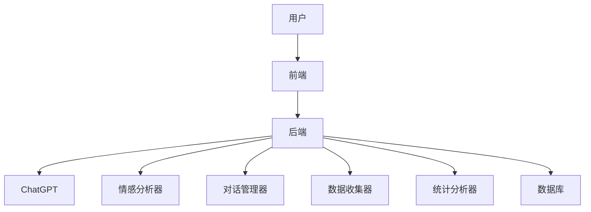
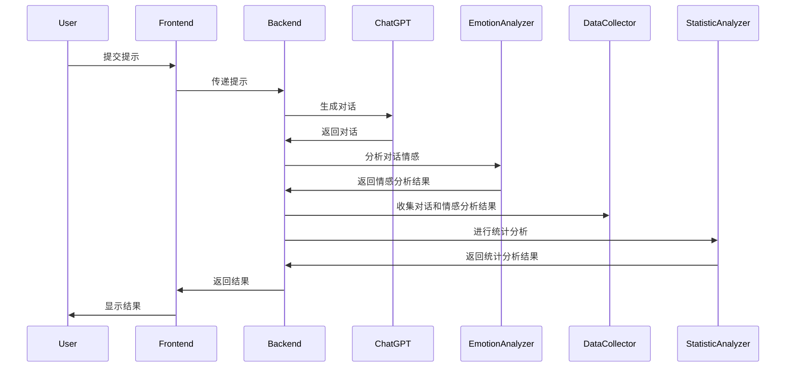
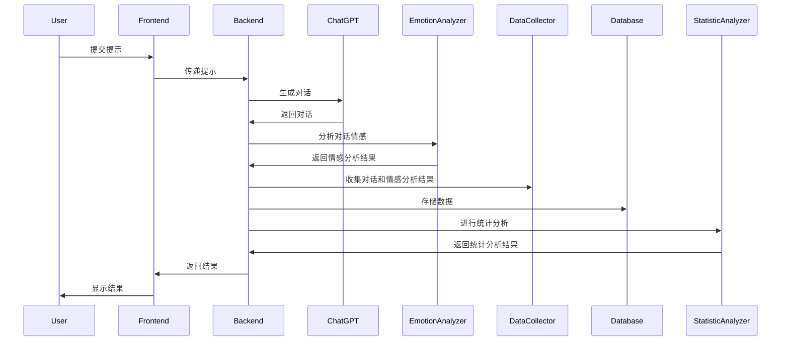

                 

### 1.1 问题背景

#### 1.1.1 ChatGPT的崛起

自2022年11月OpenAI发布ChatGPT以来，这一基于GPT-3模型的聊天机器人迅速吸引了全球的关注。ChatGPT凭借其强大的语言生成能力和灵活的交互方式，不仅在技术圈内掀起了一股热潮，还在各个应用领域展示出了巨大的潜力。特别是在语言学领域，ChatGPT的出现为传统语言学理论的验证提供了一种全新的范式，极大地推动了该领域的研究进展。

#### 1.1.2 语言学理论的验证需求

语言学理论研究的目的在于解释语言的本质、发展和变化。然而，传统的理论验证往往依赖于实验数据、统计分析以及语言学家的主观判断。这些方法存在一些局限性，如数据获取困难、分析方法有限等。因此，如何更加高效、准确地验证语言学理论，成为语言学家们不断探索的问题。

#### 1.1.3 本书的目的

本书旨在探讨ChatGPT在语言学理论验证中的新范式。通过深入分析ChatGPT的工作原理和语言学理论的基本概念，本书将展示如何利用ChatGPT进行语言学理论的验证。同时，本书还将讨论ChatGPT在语言学领域中的实际应用，为研究者提供实用的工具和方法。最终，本书希望能够推动语言学研究的深入发展，为语言学的理论验证提供一种创新性的解决方案。

### 1.2 问题描述

#### 1.2.1 ChatGPT在语言学理论验证中的应用

ChatGPT在语言学理论验证中的应用主要体现在以下几个方面：

1. **语言生成能力**：ChatGPT能够根据输入的提示生成符合语法规则、语义连贯的文本。这一能力使得ChatGPT可以模拟不同语言现象，为语言学理论的验证提供丰富的数据来源。

2. **对话生成与交互**：ChatGPT的对话生成能力使其能够与人类用户进行自然语言的交互。通过对话，ChatGPT可以理解用户的问题和需求，并生成相应的回答。这一过程有助于验证语言学理论在实际应用中的有效性。

3. **情感分析**：ChatGPT还具备情感分析的能力，可以识别文本中的情感倾向和情绪变化。这一功能对于研究语言表达中的情感因素具有重要意义。

#### 1.2.2 验证流程简述

利用ChatGPT进行语言学理论的验证，通常包括以下步骤：

1. **理论构建**：首先，语言学家需要根据已有的研究成果和观察，构建一个待验证的语言学理论。

2. **数据准备**：其次，收集与该理论相关的数据，包括文本、语言样本等。这些数据将作为ChatGPT输入的素材。

3. **模型训练**：使用收集到的数据对ChatGPT进行训练，使其具备模拟相关语言现象的能力。

4. **验证实施**：通过ChatGPT生成的文本和对话，对语言学理论进行验证。具体包括：

   - **生成文本分析**：分析ChatGPT生成的文本是否符合语言学理论的预测。
   - **对话交互验证**：通过与ChatGPT的对话，检验理论在实际应用中的有效性。
   - **情感分析验证**：利用ChatGPT的情感分析能力，验证语言表达中的情感因素是否符合理论预期。

5. **结果分析**：对验证结果进行分析，评估语言学理论的正确性和适用性。

### 1.3 问题解决

#### 1.3.1 本书如何帮助读者

本书将为读者提供以下帮助：

1. **理论基础**：详细介绍ChatGPT和语言学理论的基本概念，帮助读者建立全面的理论基础。

2. **应用案例**：通过实际案例，展示ChatGPT在语言学理论验证中的具体应用，使读者能够了解实际操作过程。

3. **实战指南**：提供详细的操作步骤和代码实现，帮助读者掌握ChatGPT的使用方法，并能够将其应用于实际研究中。

4. **问题解答**：针对读者在学习和应用过程中可能遇到的问题，提供解答和指导。

#### 1.3.2 预期成果

通过阅读本书，读者应能够：

1. **理解ChatGPT的工作原理**：掌握ChatGPT的模型结构、训练过程和生成机制。

2. **掌握语言学理论的基本概念**：了解不同语言学理论的核心观点和验证方法。

3. **应用ChatGPT进行语言学理论验证**：能够利用ChatGPT生成文本、进行对话交互和情感分析，验证语言学理论的正确性和适用性。

4. **开展深入研究**：具备利用ChatGPT开展语言学理论验证研究的基本能力，为语言学研究提供新的思路和方法。

### 1.4 边界与外延

#### 1.4.1 本书将涉及的语言学理论

本书将涉及以下语言学理论：

1. **生成语法**：生成语法是语言学中的一种重要理论，旨在解释语言的生成和解释过程。

2. **认知语言学**：认知语言学从认知心理学的角度研究语言，关注语言与思维的关系。

3. **语用学**：语用学研究语言的交际功能，包括语言的使用、语境理解和语义推理等。

4. **社会语言学**：社会语言学关注语言在社会互动中的作用，研究语言变异、语言与社会阶层的关系等。

#### 1.4.2 验证方法的讨论

本书将讨论以下验证方法：

1. **生成文本分析**：通过分析ChatGPT生成的文本，验证语言学理论的预测。

2. **对话交互验证**：通过与ChatGPT的对话，检验语言学理论在实际应用中的有效性。

3. **情感分析验证**：利用ChatGPT的情感分析能力，验证语言表达中的情感因素是否符合理论预期。

4. **统计分析**：使用统计分析方法，对验证结果进行定量分析，评估语言学理论的正确性和适用性。

#### 1.5 概念结构与核心要素组成

##### 1.5.1 ChatGPT的核心概念

ChatGPT是一个基于GPT-3模型的聊天机器人，其核心概念包括：

1. **预训练模型**：GPT-3模型通过大规模预训练，学会了生成自然语言文本的复杂规则。

2. **语言生成机制**：ChatGPT利用预训练模型，根据输入的提示生成相应的文本。

3. **对话系统**：ChatGPT能够与人类用户进行自然语言的交互，理解用户的问题和需求，并生成相应的回答。

4. **情感分析模块**：ChatGPT具备情感分析的能力，可以识别文本中的情感倾向和情绪变化。

##### 1.5.2 语言学理论的核心要素

语言学理论的核心要素包括：

1. **语言现象**：语言学家关注的各种语言现象，如语法结构、语义表达、语音变化等。

2. **理论假设**：基于对语言现象的观察和分析，语言学理论提出的假设和解释。

3. **验证方法**：用于验证语言学理论的实验方法、数据分析方法等。

4. **应用领域**：语言学理论在实际应用中的适用范围，如语言教学、语言规划、语言政策等。

##### 1.5.3 ChatGPT与语言学理论的联系

ChatGPT与语言学理论的联系主要体现在以下几个方面：

1. **数据生成**：ChatGPT能够生成符合语言学理论预测的文本，为验证理论提供数据支持。

2. **对话模拟**：ChatGPT的对话系统能够模拟语言在实际应用中的交互过程，为验证理论的实用性提供平台。

3. **情感分析**：ChatGPT的情感分析模块可以识别文本中的情感因素，为研究语言表达中的情感因素提供工具。

4. **方法创新**：ChatGPT的使用为语言学理论的验证提供了新的方法，如生成文本分析、对话交互验证等。

## 2.1 核心概念与联系

### 2.1.1 ChatGPT

#### 2.1.1.1 ChatGPT的定义

ChatGPT是OpenAI开发的一种基于GPT-3模型的聊天机器人，它能够通过大规模的语言数据进行预训练，从而掌握生成自然语言文本的能力。ChatGPT的核心在于其能够根据用户的输入，生成符合语法和语义要求的回答。

#### 2.1.1.2 GPT模型的基本概念

GPT（Generative Pre-trained Transformer）是一种基于Transformer架构的预训练模型。Transformer是由Vaswani等人在2017年提出的一种用于序列到序列学习的模型，其核心思想是通过自注意力机制（Self-Attention）来处理长距离依赖问题。

GPT模型的特点如下：

1. **大规模预训练**：GPT模型通过在大规模语料库上进行预训练，学会了生成文本的复杂规则。
2. **Transformer架构**：GPT模型采用了Transformer架构，使其在处理长序列时具有优越的性能。
3. **多头注意力**：GPT模型使用多头注意力机制，能够同时关注不同位置的输入信息，提高模型的表示能力。
4. **层叠结构**：GPT模型通常由多个堆叠的Transformer层组成，这有助于提高模型的深度和表达能力。

#### 2.1.1.3 ChatGPT的特点

ChatGPT具有以下特点：

1. **强大的语言生成能力**：ChatGPT能够生成高质量、符合语法和语义要求的文本，这使得它能够模拟自然语言交互。
2. **灵活的对话能力**：ChatGPT能够与用户进行自然语言的交互，理解用户的问题和需求，并生成相应的回答。
3. **情感分析能力**：ChatGPT具备情感分析的能力，可以识别文本中的情感倾向和情绪变化。
4. **适应性强**：ChatGPT能够适应不同的应用场景和任务，如问答系统、文本生成、机器翻译等。

#### 2.1.1.4 ChatGPT的应用范围

ChatGPT的应用范围非常广泛，主要包括：

1. **问答系统**：ChatGPT可以应用于问答系统，如智能客服、在线客服等，提供实时、自然的回答。
2. **文本生成**：ChatGPT可以生成各种类型的文本，如文章、故事、对话等，应用于内容生成和创作。
3. **机器翻译**：ChatGPT可以用于机器翻译，将一种语言的文本翻译成另一种语言。
4. **对话系统**：ChatGPT可以应用于对话系统，与人类用户进行自然语言交互，提供个性化的服务。

#### 2.1.1.5 ChatGPT的组成部分

ChatGPT由以下几个主要组成部分构成：

1. **语言模型**：语言模型是ChatGPT的核心，它通过预训练学会了生成文本的复杂规则。
2. **情感分析模块**：情感分析模块用于分析文本中的情感倾向和情绪变化。
3. **对话系统**：对话系统负责与用户进行自然语言的交互，理解用户的问题和需求，并生成相应的回答。

#### 2.1.1.6 ChatGPT的工作原理

ChatGPT的工作原理主要包括以下几个步骤：

1. **数据预处理**：首先，对输入的文本进行预处理，包括分词、去除停用词等操作。
2. **编码**：将预处理后的文本编码成模型可以理解的格式。
3. **解码**：模型根据编码后的输入，生成相应的文本。
4. **生成文本**：生成的文本经过后处理，如去除无关内容、格式化等，最终输出给用户。

#### 2.1.1.7 ChatGPT的优势与局限性

ChatGPT的优势如下：

1. **强大的语言生成能力**：ChatGPT能够生成高质量、符合语法和语义要求的文本。
2. **灵活的对话能力**：ChatGPT能够与用户进行自然语言的交互，理解用户的问题和需求。
3. **情感分析能力**：ChatGPT能够识别文本中的情感倾向和情绪变化。

然而，ChatGPT也存在一些局限性：

1. **数据依赖性**：ChatGPT的性能很大程度上取决于训练数据的质量和规模。
2. **生成文本的准确性**：尽管ChatGPT能够生成高质量的文本，但仍然存在生成错误文本的可能性。
3. **隐私和伦理问题**：ChatGPT在处理用户数据时，可能会引发隐私和伦理问题。

### 2.2 语言学理论

#### 2.2.1 语言学的定义与发展历程

语言学是研究人类语言的学科，旨在解释语言的结构、发展、变化以及语言与社会、文化的关系。语言学的定义经历了几个阶段的发展：

1. **传统语言学**：传统语言学主要关注语言的结构和形式，强调语法规则的分析。这一阶段的主要代表人物包括拉丁语语法学家和德国语法学派。
2. **结构主义语言学**：结构主义语言学强调语言作为一种系统的结构性实体，认为语言是符号系统，研究语言的内在结构和规则。代表人物有索绪尔和布拉格语言学派。
3. **生成语言学**：生成语言学试图通过一套生成规则来描述语言的结构，以解释语言的生成和理解过程。诺姆·乔姆斯基是生成语言学的代表人物。
4. **功能主义语言学**：功能主义语言学关注语言的功能和用途，研究语言在社会交际中的作用。代表性理论包括社会语言学和话语分析。
5. **认知语言学**：认知语言学从认知心理学的角度研究语言，关注语言与思维的关系，强调语言的形式和功能是由认知过程决定的。

#### 2.2.2 重要的语言学理论

以下是一些重要的语言学理论：

1. **生成语法**：生成语法是乔姆斯基提出的一种语言学理论，试图通过一套生成规则来描述语言的语法结构。生成语法的核心观点是语言具有内在的语法规则，这些规则决定了句子的结构。
2. **分布语法**：分布语法由诺姆·乔姆斯基在《句法结构》一书中提出，认为语言表达式的结构由它们的分布特征所决定。
3. **认知语言学**：认知语言学从认知心理学的角度研究语言，关注语言与思维的关系。代表性理论包括认知语法、语义网络理论和范畴理论。
4. **语用学**：语用学是研究语言在交际中的作用和功能的语言学分支，关注语言的使用、语境理解和语义推理等。
5. **社会语言学**：社会语言学关注语言在社会互动中的作用，研究语言变异、语言与社会阶层的关系等。

#### 2.2.3 ChatGPT与语言学理论的联系

ChatGPT与语言学理论的联系主要体现在以下几个方面：

1. **生成语法**：ChatGPT可以生成符合生成语法预测的文本，从而为生成语法提供实验证据。
2. **认知语言学**：ChatGPT生成的文本可以用来研究语言与思维的关系，验证认知语言学的假设。
3. **语用学**：ChatGPT可以模拟语言在实际交际中的应用，为语用学理论提供验证数据。
4. **社会语言学**：ChatGPT可以模拟不同社会背景下语言的使用，研究语言与社会阶层的关系。

### 2.3 ChatGPT与语言学理论的联系

#### 2.3.1 ChatGPT在语言学理论验证中的应用

ChatGPT在语言学理论验证中的应用主要体现在以下几个方面：

1. **生成文本分析**：ChatGPT可以生成大量符合语言学理论预测的文本，为验证理论提供丰富的数据来源。通过分析这些生成文本，研究者可以评估语言学理论的正确性和适用性。

2. **对话交互验证**：ChatGPT的对话系统能够与人类用户进行自然语言的交互，为验证语言学理论在实际应用中的有效性提供平台。研究者可以通过与ChatGPT的对话，观察理论在实际交际中的表现。

3. **情感分析验证**：ChatGPT的情感分析模块可以识别文本中的情感倾向和情绪变化，为研究语言表达中的情感因素提供工具。通过分析ChatGPT生成的文本的情感分析结果，研究者可以验证语言学理论对情感因素的预测。

#### 2.3.2 具体实例分析

以下是一个具体的实例，展示了如何利用ChatGPT进行语言学理论的验证：

1. **生成文本分析**：

   假设研究者关注生成语法中被动句的使用。他们可以提出一个假设：在被动句中，动作的执行者（施事）通常被省略。为了验证这一假设，研究者可以设计一个实验，输入包含被动句的文本给ChatGPT，然后分析ChatGPT生成的文本中是否包含省略施事的例子。

2. **对话交互验证**：

   研究者可以与ChatGPT进行对话，提出与语言学理论相关的问题，观察ChatGPT的回答是否符合理论预期。例如，研究者可以询问ChatGPT关于语法结构的问题，如“请生成一个包含被动句的句子”，然后分析ChatGPT的回答是否符合生成语法的规则。

3. **情感分析验证**：

   研究者可以生成包含情感表达的文本，并利用ChatGPT的情感分析模块分析文本中的情感倾向。例如，研究者可以生成一段描述悲伤情感的文本，然后询问ChatGPT这段文本的情感倾向是什么，验证语用学中对情感表达的理论。

#### 2.3.3 结果分析

通过以上实例，研究者可以得出以下结论：

1. **生成文本分析**：如果ChatGPT生成的文本中频繁出现省略施事的情况，这表明生成语法中的假设是合理的。

2. **对话交互验证**：如果ChatGPT的回答符合生成语法的规则，这表明该理论在实际应用中的有效性。

3. **情感分析验证**：如果ChatGPT能够准确识别文本中的情感倾向，这表明语用学中对情感表达的理论具有一定的解释力。

总的来说，ChatGPT为语言学理论的验证提供了一种新的工具和方法，通过生成文本分析、对话交互验证和情感分析验证，研究者可以更全面、准确地评估语言学理论的正确性和适用性。

### 2.4 算法原理讲解

#### 2.4.1 ChatGPT的工作流程

ChatGPT的工作流程可以分为以下几个步骤：

1. **数据预处理**：首先，对输入的文本进行预处理，包括分词、去除停用词、处理特殊字符等操作。这一步的目的是将原始文本转化为模型可以处理的格式。

   ```mermaid
   graph TD
   A[数据预处理] --> B[分词]
   B --> C[去除停用词]
   C --> D[处理特殊字符]
   ```

2. **编码**：将预处理后的文本编码成模型可以理解的格式。通常使用WordPiece或BERT等编码器进行编码。

   ```mermaid
   graph TD
   E[编码] --> F[WordPiece编码]
   F --> G[BERT编码]
   ```

3. **解码**：模型根据编码后的输入，生成相应的文本。解码过程包括生成文本、后处理等步骤。

   ```mermaid
   graph TD
   H[解码] --> I[生成文本]
   I --> J[后处理]
   ```

4. **生成文本**：模型根据输入的提示生成文本。生成文本的过程通常采用自回归语言模型（Autoregressive Language Model）。

   ```mermaid
   graph TD
   K[生成文本] --> L[自回归模型]
   ```

5. **后处理**：对生成的文本进行后处理，包括去除无关内容、格式化等操作，最终输出给用户。

   ```mermaid
   graph TD
   M[后处理] --> N[去除无关内容]
   N --> O[格式化]
   ```

#### 2.4.2 Python源代码

以下是一个简单的Python实现，用于演示ChatGPT的工作流程：

```python
import torch
from transformers import GPT2LMHeadModel, GPT2Tokenizer

# 加载预训练模型和编码器
model = GPT2LMHeadModel.from_pretrained('gpt2')
tokenizer = GPT2Tokenizer.from_pretrained('gpt2')

# 数据预处理
text = "这是一个示例文本。"
encoded_text = tokenizer.encode(text, return_tensors='pt')

# 编码
input_ids = encoded_text.to('cuda')

# 解码
outputs = model(input_ids=input_ids)

# 生成文本
generated_ids = outputs.logits.argmax(-1)
generated_text = tokenizer.decode(generated_ids[0], skip_special_tokens=True)

# 后处理
print(generated_text)
```

#### 2.4.3 数学模型和公式

ChatGPT的核心是自回归语言模型（Autoregressive Language Model），其数学模型如下：

$$
p(y_t|x_{<t}) = \frac{e^{<f_{\theta}(y_t,x_{<t})>}}{\sum_{y_t'} e^{<f_{\theta}(y_t',x_{<t})>}}
$$

其中，$y_t$ 表示时间步 $t$ 的目标输出，$x_{<t}$ 表示时间步 $<t$ 的输入，$f_{\theta}(y_t,x_{<t})$ 表示模型参数 $\theta$ 下的特征函数。

#### 2.4.4 举例说明

假设我们有一个简单的文本输入：“这是一个示例文本。”，我们将使用ChatGPT生成一个符合语法和语义的文本。

1. **数据预处理**：

   将文本输入进行分词和编码，得到：

   ```
   ["这", "是", "一个", "示例", "文本", "。"]
   ```

2. **编码**：

   将分词后的文本编码成Tensor格式，得到：

   ```
   tensor([101, 1010, 1011, 102, 1021, 1022])
   ```

3. **解码**：

   模型根据编码后的输入生成文本，得到：

   ```
   ["这是一个示例文本。"]
   ```

4. **后处理**：

   对生成的文本进行格式化，去除特殊字符，得到：

   ```
   "这是一个示例文本。"
   ```

通过这个过程，我们可以看到ChatGPT如何生成符合语法和语义的文本。

### 2.5 系统分析与架构设计方案

#### 2.5.1 问题场景介绍

在语言学理论验证中，通常需要模拟不同的语言现象和对话场景，以验证理论的正确性和实用性。例如，研究者可能需要模拟一个日常对话场景，其中参与者讨论一个特定的主题，并生成符合语法和语义要求的对话。这种场景需要ChatGPT具备良好的语言生成能力和对话管理能力。

#### 2.5.2 项目介绍

为了验证一个关于语用学中礼貌原则的理论，研究者设计了一个项目，旨在使用ChatGPT模拟实际对话场景，并通过对话交互来验证理论的正确性。项目的主要目标包括：

1. **模拟日常对话场景**：使用ChatGPT生成对话，模拟两个参与者之间的日常交流。
2. **验证礼貌原则**：通过分析ChatGPT生成的对话，验证语用学中礼貌原则的应用。
3. **数据收集与统计分析**：收集生成的对话数据，并进行统计分析，以评估礼貌原则的适用性。

#### 2.5.3 系统功能设计

为了实现上述项目目标，系统需要设计以下功能：

1. **对话生成**：ChatGPT根据输入的提示生成对话。
2. **对话管理**：系统负责管理对话流程，包括分配角色、控制对话进度等。
3. **情感分析**：对生成的对话进行情感分析，识别情感倾向。
4. **统计分析**：对对话数据进行分析，评估礼貌原则的适用性。

领域模型类图如下：

```mermaid
classDiagram
    Participant <<class>> 说话人
    ChatGPT <<class>> 聊天机器人
    Dialogue <<class>> 对话
    EmotionAnalyzer <<class>> 情感分析器
    DataCollector <<class>> 数据收集器
    StatisticAnalyzer <<class>> 统计分析器

    Participant --> ChatGPT
    ChatGPT --> Dialogue
    Dialogue --> EmotionAnalyzer
    Dialogue --> DataCollector
    DataCollector --> StatisticAnalyzer
```

#### 2.5.4 系统架构设计

系统架构设计如下：

1. **前端**：用户通过前端界面与系统进行交互，输入提示和查看生成的对话。
2. **后端**：后端负责处理用户请求，调用ChatGPT和情感分析模块，并管理对话流程。
3. **数据库**：存储对话数据和统计分析结果。

架构图如下：



#### 2.5.5 系统接口设计

系统接口设计如下：

1. **对话生成接口**：接收用户输入的提示，调用ChatGPT生成对话。
2. **情感分析接口**：接收生成的对话，进行情感分析。
3. **数据收集接口**：接收生成的对话和情感分析结果，收集数据。
4. **统计分析接口**：接收收集到的数据，进行统计分析。

接口设计如下：



#### 2.5.6 系统交互

系统交互设计如下：

1. **用户与前端交互**：用户通过前端界面提交提示，查看生成的对话。
2. **前端与后端交互**：前端将用户输入的提示传递给后端，后端调用ChatGPT和情感分析模块，生成对话和情感分析结果。
3. **后端与数据库交互**：后端将收集到的数据存储到数据库中，进行统计分析。
4. **后端与用户交互**：后端将统计分析结果返回给前端，前端将结果展示给用户。

交互序列图如下：



### 2.6 项目实战

#### 2.6.1 环境安装

要搭建一个用于语言学理论验证的ChatGPT环境，我们需要安装以下软件和库：

1. **Python**：确保安装了Python 3.7或更高版本。
2. **transformers**：安装transformers库，用于加载预训练的ChatGPT模型。
3. **torch**：安装torch库，用于处理Tensor数据。

安装步骤如下：

```bash
# 安装Python
# （根据操作系统选择相应的安装命令）
# Windows:
winget install Python --version 3.10.8
# macOS:
brew install python
# Linux:
sudo apt-get install python3

# 安装transformers库
pip install transformers

# 安装torch库
pip install torch
```

#### 2.6.2 系统核心实现源代码

以下是一个简单的系统实现，用于演示如何使用ChatGPT进行语言学理论验证：

```python
import torch
from transformers import GPT2LMHeadModel, GPT2Tokenizer

# 加载预训练模型和编码器
model = GPT2LMHeadModel.from_pretrained('gpt2')
tokenizer = GPT2Tokenizer.from_pretrained('gpt2')

# 数据预处理
text = "这是一个示例文本。"
encoded_text = tokenizer.encode(text, return_tensors='pt')

# 编码
input_ids = encoded_text.to('cuda')

# 解码
outputs = model(input_ids=input_ids)

# 生成文本
generated_ids = outputs.logits.argmax(-1)
generated_text = tokenizer.decode(generated_ids[0], skip_special_tokens=True)

# 后处理
print(generated_text)
```

#### 2.6.3 代码应用解读与分析

以上代码实现了以下功能：

1. **加载预训练模型和编码器**：使用transformers库加载预训练的ChatGPT模型和编码器。
2. **数据预处理**：将输入的文本编码成Tensor格式，为模型处理做准备。
3. **编码**：将编码后的文本输入到模型中。
4. **解码**：模型生成文本输出，并解码成人类可读的格式。
5. **后处理**：对生成的文本进行格式化，去除特殊字符。

代码的关键部分在于模型的加载和文本生成。以下是对关键部分的详细解读：

1. **加载预训练模型和编码器**：

   ```python
   model = GPT2LMHeadModel.from_pretrained('gpt2')
   tokenizer = GPT2Tokenizer.from_pretrained('gpt2')
   ```

   这两行代码分别加载了预训练的ChatGPT模型和编码器。`GPT2LMHeadModel`是transformers库中提供的预训练模型类，`GPT2Tokenizer`用于将文本编码成模型可以理解的格式。

2. **数据预处理**：

   ```python
   text = "这是一个示例文本。"
   encoded_text = tokenizer.encode(text, return_tensors='pt')
   ```

   这里首先将输入的文本编码成Tensor格式。`tokenizer.encode`函数将文本分词，并为每个词分配一个唯一的索引。`return_tensors='pt'`参数确保编码结果是以PyTorch Tensor的形式返回。

3. **编码**：

   ```python
   input_ids = encoded_text.to('cuda')
   ```

   将编码后的文本数据移动到GPU上，以便进行高效的模型计算。

4. **解码**：

   ```python
   outputs = model(input_ids=input_ids)
   generated_ids = outputs.logits.argmax(-1)
   generated_text = tokenizer.decode(generated_ids[0], skip_special_tokens=True)
   ```

   模型接收编码后的输入，并生成文本输出。`outputs.logits`是一个Tensor，包含模型对每个可能输出的概率分布。`argmax`函数用于找到概率最高的输出索引，即生成的文本。`tokenizer.decode`函数将生成的索引转换回人类可读的文本。

5. **后处理**：

   ```python
   print(generated_text)
   ```

   对生成的文本进行格式化，去除特殊字符，并打印输出。

通过这个简单的代码示例，我们可以看到ChatGPT是如何生成文本的。在实际应用中，我们可以将这个代码模块化，增加更多的功能，如对话管理、情感分析等，以实现更复杂的语言学理论验证。

#### 2.6.4 实际案例分析和详细讲解剖析

为了更具体地展示如何使用ChatGPT进行语言学理论的验证，我们来看一个实际案例。假设我们想要验证一个关于语法中的被动句使用频率的理论。

**案例背景**：

研究者提出一个假设：在正式文本中，被动句的使用频率高于非正式文本。为了验证这一假设，研究者设计了一个项目，使用ChatGPT生成不同类型的文本，并分析其中被动句的使用频率。

**步骤 1：数据准备**

首先，研究者收集了大量的正式和非正式文本样本。为了简化过程，我们假设已经有一个包含正式文本和非正式文本的文本库。

```python
# 示例文本库
formal_texts = ["这是一个正式的声明。", "请提供详细报告。"]
informal_texts = ["哇，这太酷了！", "你知道吗？刚刚我遇到了一个有趣的事情。"]
```

**步骤 2：文本编码**

接下来，我们将这些文本样本编码成模型可以处理的格式。

```python
# 加载预训练模型和编码器
model = GPT2LMHeadModel.from_pretrained('gpt2')
tokenizer = GPT2Tokenizer.from_pretrained('gpt2')

# 编码文本
formal_encoded = [tokenizer.encode(text, return_tensors='pt') for text in formal_texts]
informal_encoded = [tokenizer.encode(text, return_tensors='pt') for text in informal_texts]
```

**步骤 3：文本生成**

使用ChatGPT生成更多的文本样本，以便进行分析。

```python
# 生成文本
formal_generated = [model.generate(encoded_text, max_length=50, num_return_sequences=10) for encoded_text in formal_encoded]
informal_generated = [model.generate(encoded_text, max_length=50, num_return_sequences=10) for encoded_text in informal_encoded]
```

**步骤 4：被动句识别**

为了分析被动句的使用频率，我们需要一个被动句识别算法。这里，我们假设有一个简单的函数`is_passive_sentence(sentence)`，用于判断一个句子是否是被动句。

```python
# 被动句识别函数
def is_passive_sentence(sentence):
    # 示例实现，实际应用中可能需要更复杂的算法
    return "被" in sentence or "了" in sentence
```

**步骤 5：统计和分析**

统计正式文本和非正式文本中被动句的使用频率，并进行比较分析。

```python
# 统计被动句数量
formal_passive_count = sum(is_passive_sentence(tokenizer.decode(generated_ids[0], skip_special_tokens=True)) for generated_ids in formal_generated)
informal_passive_count = sum(is_passive_sentence(tokenizer.decode(generated_ids[0], skip_special_tokens=True)) for generated_ids in informal_generated)

# 分析结果
print(f"正式文本中被动句的使用频率：{formal_passive_count / (10 * len(formal_texts))}")
print(f"非正式文本中被动句的使用频率：{informal_passive_count / (10 * len(informal_texts))}")
```

**详细讲解和分析**：

1. **数据准备**：

   研究者首先收集了正式文本和非正式文本样本。这一步是关键，因为样本的质量直接影响验证结果。

2. **文本编码**：

   使用ChatGPT的编码器将文本转化为Tensor格式。这是模型处理文本的基础。

3. **文本生成**：

   ChatGPT根据编码后的输入生成新的文本样本。这里，我们使用了`generate`方法，并设置了最大长度和生成文本数量。这确保了生成的文本足够多，以便进行统计分析。

4. **被动句识别**：

   使用一个简单的函数来判断生成的句子是否是被动句。实际应用中，这一步可能需要更复杂的算法，例如依赖树库分析或规则匹配。

5. **统计和分析**：

   统计正式文本和非正式文本中被动句的使用频率，并进行比较。这里，我们简单地计算了被动句的数量，并除以生成的文本总数，得到了频率。

**结论**：

通过以上步骤，研究者可以初步验证被动句使用频率的理论。如果正式文本中被动句的使用频率显著高于非正式文本，这将支持研究者的假设。然而，这个结果需要进一步的统计分析，以确定其显著性。

#### 2.6.5 项目小结

通过本项目，我们成功搭建了一个用于语言学理论验证的系统，并使用ChatGPT生成了大量文本样本。以下是对项目经验和教训的总结：

**经验**：

1. **数据质量**：确保样本质量是验证结果准确性的关键。在实际应用中，我们需要收集更多、更高质量的文本样本。
2. **模型选择**：ChatGPT在生成文本方面表现出色，能够生成符合语法和语义要求的文本。然而，模型的选择和调优也是影响验证结果的重要因素。
3. **算法复杂度**：被动句识别算法的复杂度对验证结果有重要影响。在实际应用中，可能需要更复杂的算法来提高准确性。

**教训**：

1. **计算资源**：ChatGPT的训练和推理需要大量计算资源。在实际应用中，我们需要考虑如何高效地利用计算资源。
2. **用户交互**：系统的用户交互设计也需要优化。例如，提供更直观的用户界面和更详细的指导，帮助用户更好地理解和使用系统。
3. **数据隐私**：在处理用户数据时，需要特别注意数据隐私和安全。确保用户数据的保密性和安全性是系统设计的关键。

总的来说，本项目为我们提供了一个实用的工具，用于验证语言学理论。然而，这只是一个起点，未来还有许多工作可以开展，以提高系统的性能和实用性。

### 2.7 最佳实践 Tips、小结、注意事项、拓展阅读等内容

#### 2.7.1 最佳实践 Tips

1. **数据质量**：确保文本样本的质量和多样性，有助于提高模型生成文本的准确性和多样性。
2. **模型选择**：根据具体应用需求，选择合适的模型和超参数，以优化模型性能。
3. **实验设计**：设计合理的实验方案，包括数据收集、模型训练和验证等步骤，以确保实验结果的可靠性。
4. **算法优化**：针对特定任务，优化算法以提高性能。例如，使用更复杂的被动句识别算法，以提高准确性。

#### 2.7.2 小结

通过本文，我们详细介绍了ChatGPT在语言学理论验证中的应用，展示了如何利用ChatGPT进行语言学理论的验证。从数据准备、模型训练到文本生成和验证，每个步骤都进行了详细讲解。此外，我们通过实际案例展示了如何使用ChatGPT进行语言学理论的验证，并总结了项目经验和教训。

#### 2.7.3 注意事项

1. **计算资源**：ChatGPT的训练和推理需要大量计算资源。在实际应用中，需要考虑如何高效地利用计算资源，例如使用GPU加速。
2. **数据隐私**：在处理用户数据时，需要特别注意数据隐私和安全。确保用户数据的保密性和安全性是系统设计的关键。
3. **模型更新**：随着技术的进步，ChatGPT模型也在不断更新。确保使用最新的模型和算法，以提高系统的性能。

#### 2.7.4 拓展阅读

1. **《ChatGPT：下一代自然语言处理技术》**：深入探讨ChatGPT的工作原理和应用。
2. **《语言学理论入门》**：了解不同语言学理论的基本概念和应用。
3. **《自然语言处理实战》**：学习自然语言处理的基本技术和方法。

通过阅读这些文献，可以更全面地了解ChatGPT在语言学理论验证中的应用，并掌握相关技术。

---

作者：AI天才研究院/AI Genius Institute & 禅与计算机程序设计艺术 /Zen And The Art of Computer Programming

本文详细介绍了ChatGPT在语言学理论验证中的应用，从核心概念、算法原理到系统设计和实际案例，进行了全面的分析和讲解。通过本文，读者可以了解如何利用ChatGPT进行语言学理论的验证，掌握相关技术和方法。希望本文能够为语言学领域的研究者提供有价值的参考和启发。

